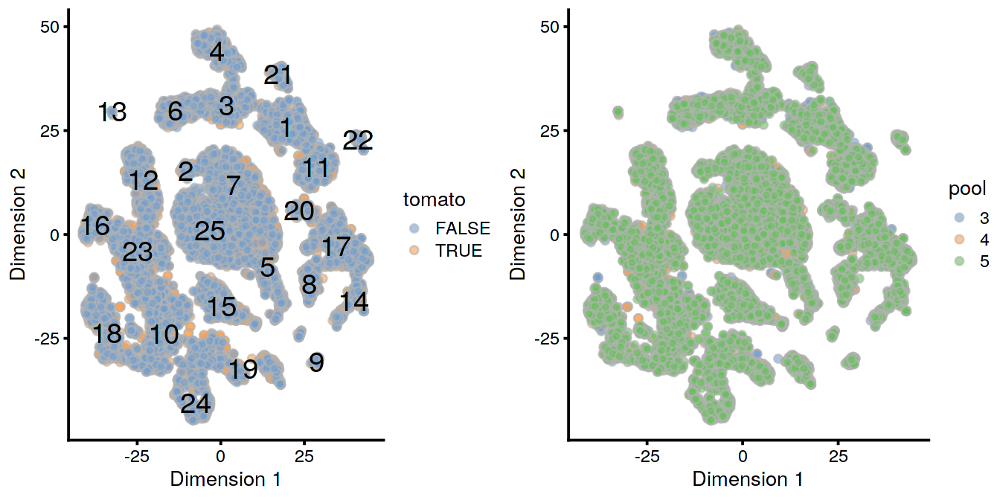
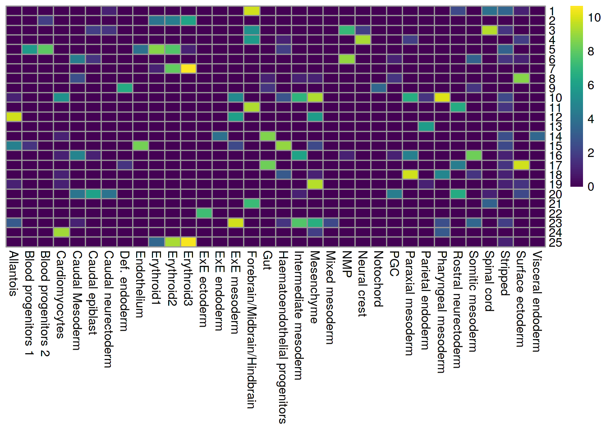
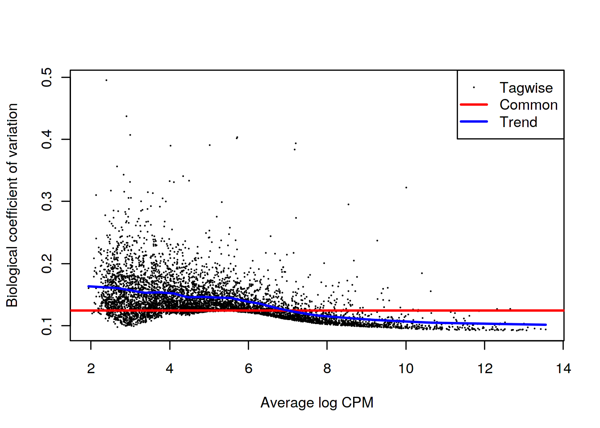
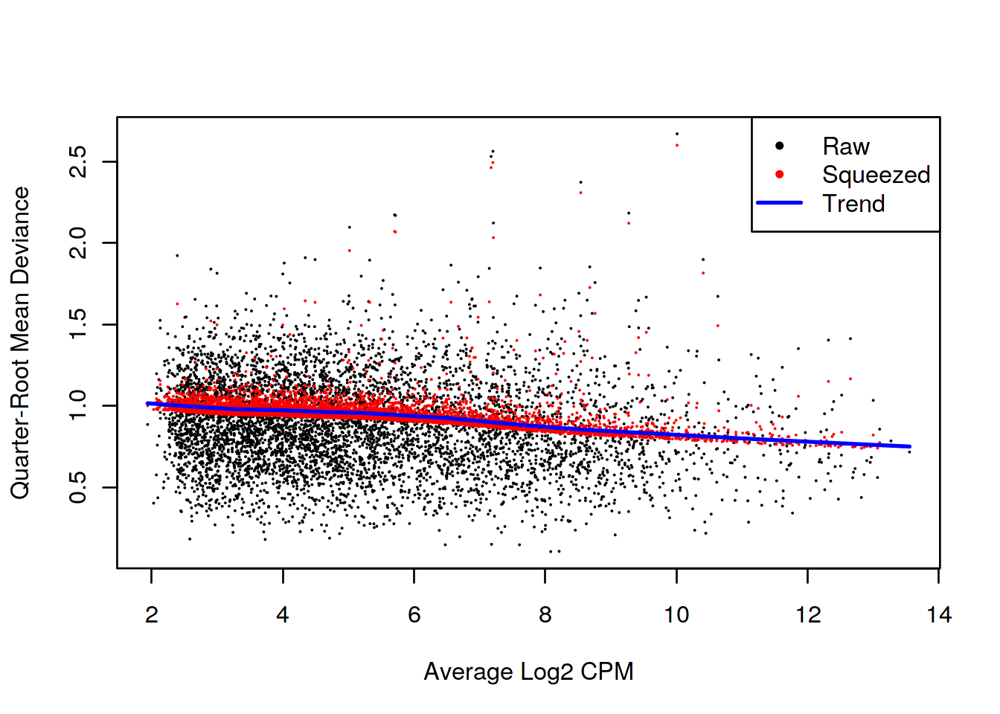
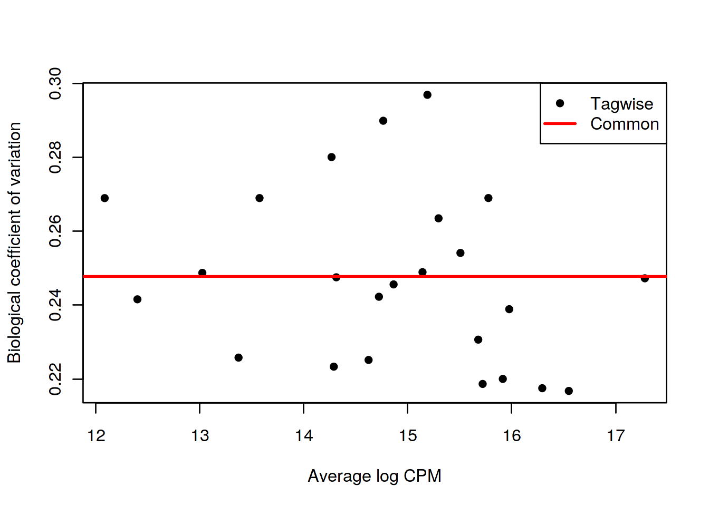
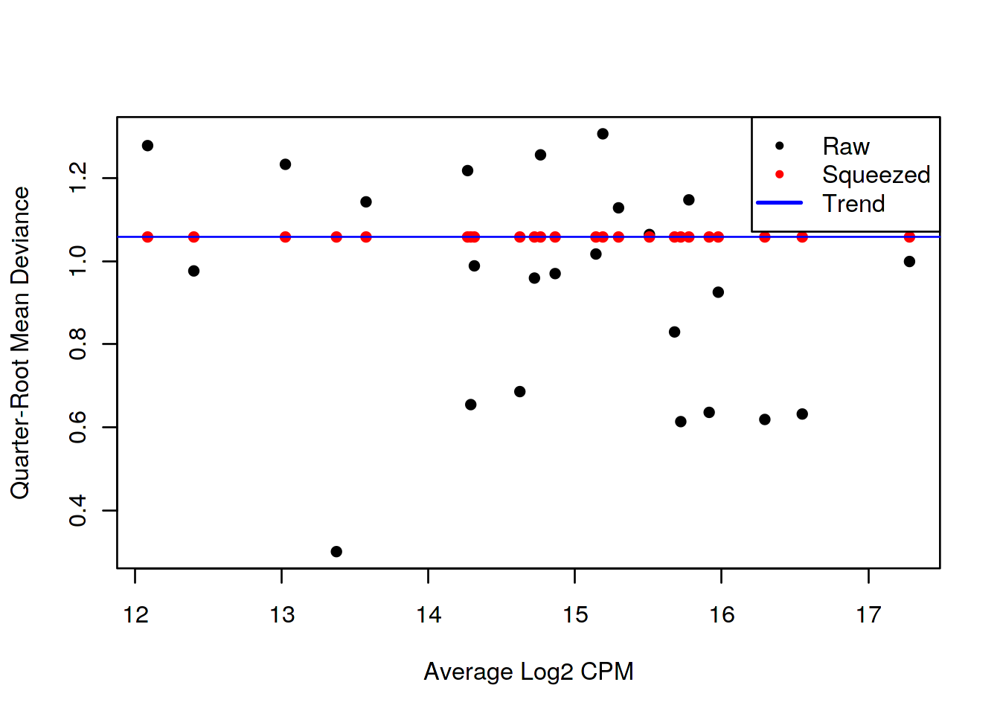

---
output:
  html_document
bibliography: ../ref.bib
---

# Multi-sample comparisons

<script>
document.addEventListener("click", function (event) {
    if (event.target.classList.contains("aaron-collapse")) {
        event.target.classList.toggle("active");
        var content = event.target.nextElementSibling;
        if (content.style.display === "block") {
          content.style.display = "none";
        } else {
          content.style.display = "block";
        }
    }
})
</script>

<style>
.aaron-collapse {
  background-color: #eee;
  color: #444;
  cursor: pointer;
  padding: 18px;
  width: 100%;
  border: none;
  text-align: left;
  outline: none;
  font-size: 15px;
}

.aaron-content {
  padding: 0 18px;
  display: none;
  overflow: hidden;
  background-color: #f1f1f1;
}
</style>

## Motivation

A powerful use of scRNA-seq technology lies in the design of replicated multi-condition experiments to detect changes in composition or expression between conditions.
For example, a researcher could use this strategy to detect changes in cell type abundance after drug treatment [@richard2018tcell] or genetic modifications [@scialdone2016resolving].
This provides more biological insight than conventional scRNA-seq experiments involving only one biological condition, especially if we can relate population changes to specific experimental perturbations.

Differential analyses of multi-condition scRNA-seq experiments can be broadly split into two categories - differential expression (DE) and differential abundance (DA) analyses.
The former tests for changes in expression between conditions for cells of the same type that are present in both conditions,
while the latter tests for changes in the composition of cell types (or states, etc.) between conditions.
In this chapter, we will demonstrate both analyses using data from a study of the early mouse embryo [@pijuansala2019single].

## Setting up the data

Our demonstration scRNA-seq dataset was generated from chimeric mouse embryos at the E8.5 developmental stage.
Each chimeric embryo was generated by injecting td-Tomato-positive embryonic stem cells (ESCs) into a wild-type (WT) blastocyst.
Unlike in previous experiments [@scialdone2016resolving], there is no genetic difference between the injected and background cells other than the expression of td-Tomato in the former.
Instead, the aim of this "wild-type chimera" study is to determine whether the injection procedure itself introduces differences in lineage commitment compared to the background cells.

The experiment used a paired design with three replicate batches of two samples each.
Specifically, each batch contains one sample consisting of td-Tomato positive cells and another consisting of negative cells,
obtained by fluorescence-activated cell sorting from a single pool of dissociated cells from 6-7 chimeric embryos.
For each sample, scRNA-seq data was generated using the 10X Genomics protocol [@zheng2017massively] to obtain 2000-7000 cells.

<button class="aaron-collapse">View history</button>
<div class="aaron-content">
   
```r
### loading ###
library(MouseGastrulationData)
sce.chimera <- WTChimeraData(samples=5:10)
sce.chimera

### feature-annotation ###
library(scater)
rownames(sce.chimera) <- uniquifyFeatureNames(
    rowData(sce.chimera)$ENSEMBL, rowData(sce.chimera)$SYMBOL)

### quality-control ###
drop <- sce.chimera$celltype.mapped %in% c("stripped", "Doublet")
sce.chimera <- sce.chimera[,!drop]

### normalization ###
sce.chimera <- logNormCounts(sce.chimera)

### variance-modelling ###
library(scran)
dec.chimera <- modelGeneVar(sce.chimera, block=sce.chimera$sample)
chosen.hvgs <- dec.chimera$bio > 0

### merging ###
library(batchelor)
merged <- correctExperiments(sce.chimera, 
    batch=sce.chimera$sample, 
    subset.row=chosen.hvgs,
    PARAM=FastMnnParam(
        merge.order=list(
            list(
                list(1, 3), # WT (3 replicates)
                5
            ),
            list(
                list(2, 4), # td-Tomato (3 replicates)
                6
            )
        )
    )
)

### clustering ###
g <- buildSNNGraph(merged, use.dimred="corrected")
clusters <- igraph::cluster_louvain(g)
merged$cluster <- factor(clusters$membership)

### dimensionality-reduction ###
merged <- runTSNE(merged, dimred="corrected", external_neighbors=TRUE)
merged <- runUMAP(merged, dimred="corrected", external_neighbors=TRUE)
```

</div>


```r
merged
```

```
## class: SingleCellExperiment 
## dim: 14699 19426 
## metadata(1): merge.info
## assays(3): reconstructed counts logcounts
## rownames(14699): Xkr4 Rp1 ... Vmn2r122 CAAA01147332.1
## rowData names(1): rotation
## colnames(19426): cell_9769 cell_9770 ... cell_30701 cell_30702
## colData names(12): batch cell ... doub.density cluster
## reducedDimNames(3): corrected TSNE UMAP
## spikeNames(0):
## altExpNames(0):
```

The differential analyses are predicated on many of the pre-processing steps covered in previous chapters.
For brevity, we will not explicitly repeat them here,
only noting that we have already merged cells from all samples into the same coordinate system (Chapter \@ref(data-integration))
and clustered the merged dataset to obtain a common partitioning across all samples (Chapter \@ref(clustering)).
A brief inspection of the results indicates that clusters contain similar contributions from all batches with only modest differences associated with td-Tomato expression (Figure \@ref(fig:tsne-initial)).


```r
library(scater)
table(merged$cluster, merged$tomato)
```

```
##     
##      FALSE TRUE
##   1    546  403
##   2     62   52
##   3    471  400
##   4    466  207
##   5    493  467
##   6    258  249
##   7   1106  782
##   8    200  220
##   9     47   57
##   10   891 1106
##   11   419  310
##   12   413  626
##   13    58    0
##   14   209  214
##   15   363  509
##   16   234  197
##   17   660  608
##   18   568  414
##   19   218  481
##   20   137   74
##   21    82   78
##   22   155    1
##   23   627  624
##   24   253  311
##   25  1395  705
```

```r
table(merged$cluster, merged$pool)
```

```
##     
##         3    4    5
##   1   225  172  552
##   2    26   30   58
##   3   226  174  471
##   4    77  161  435
##   5   141  434  385
##   6   187  116  204
##   7   256  732  900
##   8    69  133  218
##   9    16   31   57
##   10  261  537 1199
##   11  179  169  381
##   12  114  288  637
##   13    2   51    5
##   14   77   97  249
##   15  183  242  447
##   16  157   81  193
##   17  123  309  836
##   18  227  230  525
##   19  220  169  310
##   20    3   10  198
##   21   27   29  104
##   22    6   84   66
##   23  226  420  605
##   24  100  105  359
##   25  196  840 1064
```

```r
gridExtra::grid.arrange(
    plotTSNE(merged, colour_by="tomato", text_by="cluster"),
    plotTSNE(merged, colour_by=data.frame(pool=factor(merged$pool))),
    ncol=2
)
```



Ordinarily, we would be obliged to perform marker detection to assign biological meaning to these clusters.
For simplicity, we will skip this step by directly using the cell type labels provided by @pijuansala2019single.
These were obtained by mapping the cells in this dataset to a larger, pre-annotated "atlas" of mouse early embryonic development.
While broadly consistent, many of our clusters map to multiple labels (Figure \@ref(fig:heat-cluster-label}), which reflects the difficulties in unambiguously resolving cell types undergoing differentiation.


```r
by.label <- table(merged$cluster, merged$celltype.mapped)
pheatmap::pheatmap(log2(by.label+1), cluster_cols=FALSE, cluster_rows=FALSE,
    color=viridis::viridis(101))
```

<div class="figure">

<p class="caption">(\#fig:heat-cluster-label)Heatmap showing the abundance of cells with each combination of cluster (row) and cell type label (column). The color scale represents the log~2~-count for each combination.</p>
</div>

## Differential expression between conditions

### Creating pseudo-bulk samples

The most obvious differential analysis is to look for changes in expression between conditions.
We perform the DE analysis separately for each label to identify cell type-specific transcriptional effects of injection.
The actual DE testing is performed on "pseudo-bulk" expression profiles [@tung2017batch], 
generated by summing counts together for all cells with the same combination of label and sample.
This leverages the resolution offered by single-cell technologies to define the labels,
and combines it with the statistical rigor of existing methods for DE analyses involving a small number of samples.


```r
# Using 'label' and 'sample' as our two factors; each column of the output
# corresponds to one unique combination of these two factors.
summed <- aggregateAcrossCells(merged, 
    id=DataFrame(
        label=merged$celltype.mapped,
        sample=merged$sample)
)
summed
```

```
## class: SingleCellExperiment 
## dim: 14699 186 
## metadata(1): merge.info
## assays(1): counts
## rownames(14699): Xkr4 Rp1 ... Vmn2r122 CAAA01147332.1
## rowData names(1): rotation
## colnames: NULL
## colData names(14): batch cell ... label sample
## reducedDimNames(3): corrected TSNE UMAP
## spikeNames(0):
## altExpNames(0):
```

At this point, it is worth reflecting on the motivations behind the use of pseudo-bulking:

- Larger counts are more amenable to downstream analysis with standard methods for bulk RNA-seq analysis.
Normalization is more straightforward and certain approximations are more accurate for large counts.
- Collapsing cells into samples reflects the fact that our biological replication occurs at the sample level [@lun2017overcoming].
Each sample is represented no more than once for each condition, avoiding problems from unmodelled correlations between samples. 
Supplying the per-cell counts directly would indicate that each cell is a biological replicate, which is not true from an experimental perspective.
- Variance between cells within each sample is masked, provided it does not affect variance across (replicate) samples.
This avoids penalizing DEGs that are not uniformly up- or down-regulated for all cells in all samples of one condition.
Masking is generally desirable as DEGs (unlike marker genes) do not need to have low within-sample variance to be interesting, e.g., if the treatment effect is consistent across populations but heterogeneous on a per-cell basis.

### Performing the DE analysis

#### Introduction

The DE analysis will be performed using quasi-likelihood (QL) methods from the *[edgeR](https://bioconductor.org/packages/3.10/edgeR)* package [@robinson2010edgeR;@chen2016reads].
This uses a negative binomial generalized linear model (NB GLM) to handle overdispersed count data in experiments with limited replication.
In our case, we have biological variation with three paired replicates per condition, so *[edgeR](https://bioconductor.org/packages/3.10/edgeR)* (or its contemporaries) is a natural choice for the analysis.

We do not use all labels for GLM fitting as the strong DE between labels makes it difficult to compute a sensible average abundance to model the mean-dispersion trend.
Moreover, label-specific batch effects would not be easily handled with a single additive term in the design matrix for the batch.
Instead, we arbitrarily pick one of the labels to use for this demonstration.


```r
label <- "Mesenchyme"
current <- summed[,label==summed$celltype.mapped]

# Creating up a DGEList object for use in edgeR:
library(edgeR)
y <- DGEList(counts(current), samples=colData(current))
y
```

```
## An object of class "DGEList"
## $counts
##        Sample1 Sample2 Sample3 Sample4 Sample5 Sample6
## Xkr4         2       0       0       0       3       0
## Rp1          0       0       1       0       0       0
## Sox17        7       0       3       0      14       9
## Mrpl15    1420     271    1009     379    1578     749
## Rgs20        3       0       1       1       0       0
## 14694 more rows ...
## 
## $samples
##         group lib.size norm.factors batch       cell          barcode
## Sample1     1  4607053            1     5  cell_9769 AAACCTGAGACTGTAA
## Sample2     1  1064970            1     6 cell_12212 AAGGCAGAGATGCGAC
## Sample3     1  2494010            1     7 cell_13244 AAAGATGGTCATACTG
## Sample4     1  1028668            1     8 cell_16261 AAAGTAGAGCGATCCC
## Sample5     1  4290221            1     9 cell_19345 AAACGGGTCGTCTGAA
## Sample6     1  1950840            1    10 cell_23936 AAAGTAGTCTTGCCGT
##         sample stage tomato pool stage.mapped celltype.mapped closest.cell
## Sample1      5  E8.5   TRUE    3        E8.25      Mesenchyme   cell_24159
## Sample2      6  E8.5  FALSE    3        E8.25      Mesenchyme   cell_66561
## Sample3      7  E8.5   TRUE    4        E8.25      Mesenchyme  cell_137494
## Sample4      8  E8.5  FALSE    4         E8.5      Mesenchyme  cell_132462
## Sample5      9  E8.5   TRUE    5        E7.25      Mesenchyme   cell_17255
## Sample6     10  E8.5  FALSE    5         E8.5      Mesenchyme   cell_41003
##         doub.density cluster      label sample.1
## Sample1     0.029850      19 Mesenchyme        5
## Sample2     0.001651      19 Mesenchyme        6
## Sample3     0.079208      10 Mesenchyme        7
## Sample4     0.014702      10 Mesenchyme        8
## Sample5     0.111286      23 Mesenchyme        9
## Sample6     0.000000      19 Mesenchyme       10
```

#### Pre-processing

A typical step in bulk RNA-seq data analyses is to remove samples with very low library sizes corresponding to failed library preparation or sequencing.
In our situation, this is equivalent to removing label-sample combinations that have very few or lowly-sequenced cells.
The corresponding summed count vectors are likely to be highly variable and thus reduce power for DE detection.
The exact definition of "very low" will vary, but in this case, we define it to be log-library sizes that are more than 3 median absolute deviations from the median.


```r
discarded <- isOutlier(y$samples$lib.size, log=TRUE, type="lower", nmads=3)
y <- y[,!discarded]
summary(discarded)
```

```
##    Mode   FALSE 
## logical       6
```

Another typical step in bulk RNA-seq analyses is to remove genes that are lowly expressed.
This reduces computational work, improves the accuracy of mean-variance trend modelling and decreases the severity of the multiple testing correction.
Genes are discarded if they are not expressed above a log-CPM threshold in a minimum number of samples (determined from the size of the smallest treatment group in the experimental design). 


```r
keep <- filterByExpr(y, group=current$tomato)
y <- y[keep,]
summary(keep)
```

```
##    Mode   FALSE    TRUE 
## logical    9011    5688
```

Finally, we correct for composition biases by computing normalization factors with the trimmed mean of M-values method [@robinson2010scaling].
We do not need the bespoke single-cell methods described in Chapter \@ref(normalization), as the counts for our pseudo-bulk samples are large enough to apply bulk normalization methods.
(Readers should be aware that *[edgeR](https://bioconductor.org/packages/3.10/edgeR)* normalization factors are closely related but _not the same_ as the size factors described elsewhere in this book.)


```r
y <- calcNormFactors(y)
y$samples
```

```
##         group lib.size norm.factors batch       cell          barcode
## Sample1     1  4607053       1.0683     5  cell_9769 AAACCTGAGACTGTAA
## Sample2     1  1064970       1.0487     6 cell_12212 AAGGCAGAGATGCGAC
## Sample3     1  2494010       0.9582     7 cell_13244 AAAGATGGTCATACTG
## Sample4     1  1028668       0.9774     8 cell_16261 AAAGTAGAGCGATCCC
## Sample5     1  4290221       0.9707     9 cell_19345 AAACGGGTCGTCTGAA
## Sample6     1  1950840       0.9817    10 cell_23936 AAAGTAGTCTTGCCGT
##         sample stage tomato pool stage.mapped celltype.mapped closest.cell
## Sample1      5  E8.5   TRUE    3        E8.25      Mesenchyme   cell_24159
## Sample2      6  E8.5  FALSE    3        E8.25      Mesenchyme   cell_66561
## Sample3      7  E8.5   TRUE    4        E8.25      Mesenchyme  cell_137494
## Sample4      8  E8.5  FALSE    4         E8.5      Mesenchyme  cell_132462
## Sample5      9  E8.5   TRUE    5        E7.25      Mesenchyme   cell_17255
## Sample6     10  E8.5  FALSE    5         E8.5      Mesenchyme   cell_41003
##         doub.density cluster      label sample.1
## Sample1     0.029850      19 Mesenchyme        5
## Sample2     0.001651      19 Mesenchyme        6
## Sample3     0.079208      10 Mesenchyme        7
## Sample4     0.014702      10 Mesenchyme        8
## Sample5     0.111286      23 Mesenchyme        9
## Sample6     0.000000      19 Mesenchyme       10
```

#### Statistical modelling

We set up the design matrix to block on the batch-to-batch differences across different embryo pools,
while retaining an additive term that represents the effect of injection. 
The latter is represented in our model as the log-fold change in gene expression in td-Tomato-positive cells over their negative counterparts within the same label.
Our aim is to test whether this log-fold change is significantly different from zero.


```r
design <- model.matrix(~factor(pool) + factor(tomato), y$samples)
design
```

```
##         (Intercept) factor(pool)4 factor(pool)5 factor(tomato)TRUE
## Sample1           1             0             0                  1
## Sample2           1             0             0                  0
## Sample3           1             1             0                  1
## Sample4           1             1             0                  0
## Sample5           1             0             1                  1
## Sample6           1             0             1                  0
## attr(,"assign")
## [1] 0 1 1 2
## attr(,"contrasts")
## attr(,"contrasts")$`factor(pool)`
## [1] "contr.treatment"
## 
## attr(,"contrasts")$`factor(tomato)`
## [1] "contr.treatment"
```

We estimate the negative binomial (NB) dispersions with `estimateDisp()`.
The role of the NB dispersion is to model the mean-variance trend (Figure \@ref(fig:bcvplot)),
which is not easily accommodated by QL dispersions alone due to the quadratic nature of the NB mean-variance trend.


```r
y <- estimateDisp(y, design)
summary(y$trended.dispersion)
```

```
##    Min. 1st Qu.  Median    Mean 3rd Qu.    Max. 
##  0.0103  0.0167  0.0213  0.0202  0.0235  0.0266
```

```r
plotBCV(y)
```

<div class="figure">

<p class="caption">(\#fig:bcvplot)Biological coefficient of variation (BCV) for each gene as a function of the average abundance. The BCV is computed as the square root of the NB dispersion after empirical Bayes shrinkage towards the trend. Trended and common BCV estimates are shown in blue and red, respectively.</p>
</div>

We also estimate the quasi-likelihood dispersions with `glmQLFit()` [@chen2016reads].
This fits a GLM to the counts for each gene and estimates the QL dispersion from the GLM deviance.
We set `robust=TRUE` to avoid distortions from highly variable clusters [@phipson2016robust].
The QL dispersion models the uncertainty and variability of the per-gene variance (Figure \@ref(fig:qlplot)) - which is not well handled by the NB dispersions, so the two dispersion types complement each other in the final analysis.


```r
fit <- glmQLFit(y, design, robust=TRUE)
summary(fit$var.prior)
```

```
##    Min. 1st Qu.  Median    Mean 3rd Qu.    Max. 
##   0.318   0.714   0.854   0.804   0.913   1.067
```

```r
summary(fit$df.prior)
```

```
##    Min. 1st Qu.  Median    Mean 3rd Qu.    Max. 
##   0.227  12.675  12.675  12.339  12.675  12.675
```

```r
plotQLDisp(fit)
```

<div class="figure">

<p class="caption">(\#fig:qlplot)QL dispersion estimates for each gene as a function of abundance. Raw estimates (black) are shrunk towards the trend (blue) to yield squeezed estimates (red).</p>
</div>

We test for differences in expression due to injection using `glmQLFTest()`.
DEGs are defined as those with non-zero log-fold changes at a false discovery rate of 5%.
Very few genes are significantly DE, indicating that injection has little effect on the transcriptome of mesenchyme cells.
(Note that this logic is somewhat circular, 
as a large transcriptional effect may have caused cells of this type to be re-assigned to a different label.
We discuss this in more detail in Section \@ref(de-da-duality) below.)


```r
res <- glmQLFTest(fit, coef=ncol(design))
summary(decideTests(res))
```

```
##        factor(tomato)TRUE
## Down                    8
## NotSig               5672
## Up                      8
```

```r
topTags(res)
```

```
## Coefficient:  factor(tomato)TRUE 
##            logFC logCPM       F    PValue       FDR
## Phlda2   -4.3874  9.934 1638.59 1.812e-16 1.031e-12
## Erdr1     2.0691  8.833  356.37 1.061e-11 3.017e-08
## Mid1      1.5191  6.931  120.15 1.844e-08 3.497e-05
## H13      -1.0596  7.540   80.80 2.373e-07 2.527e-04
## Kcnq1ot1  1.3763  7.242   83.31 2.392e-07 2.527e-04
## Akr1e1   -1.7206  5.128   79.31 2.665e-07 2.527e-04
## Zdbf2     1.8008  6.797   83.66 6.809e-07 5.533e-04
## Asb4     -0.9235  7.341   53.45 2.918e-06 2.075e-03
## Impact    0.8516  7.353   50.31 4.145e-06 2.620e-03
## Lum      -0.6031  9.275   41.67 1.205e-05 6.851e-03
```


### Putting it all together

We repeat this process for each of the labels to identify injection-induced DE in each cell type.
This is mostly straightforward as we can write a loop that simply performs the DE analysis for each subset of columns in `summed`.
However, some additional care is required to automatically deal with labels that are not represented in both injected and background cells, for which a DE analysis between conditions is meaningless;
or are not represented in a sufficient number of replicate samples to enable modelling of biological variability.
This is represented by the extra checks related to `design` in the code chunk below.


```r
de.results <- list()
for (i in unique(summed$celltype.mapped)) {
    current <- summed[,i==summed$celltype.mapped]
    y <- DGEList(counts(current), samples=colData(current))

    discarded <- isOutlier(colSums(counts(current)), 
        log=TRUE, type="lower", nmads=3)
    y <- y[,!discarded]
    y <- y[filterByExpr(y, group=current$tomato),]
    y <- calcNormFactors(y)

    design <- try(
        model.matrix(~factor(pool) + factor(tomato), y$samples),
        silent=TRUE
    )
    if (is(design, "try-error") || 
        qr(design)$rank==nrow(design) ||
        qr(design)$rank < ncol(design)) 
    {
        # Skipping labels without contrasts or without 
        # enough residual d.f. to estimate the dispersion.
        next
    }

    y <- estimateDisp(y, design)
    fit <- glmQLFit(y, design)
    res <- glmQLFTest(fit, coef=ncol(design))
    de.results[[i]] <- res
}
```

We examine the numbers of DEGs at a FDR of 5% for each label.
In general, there seems to be very little differential expression that is introduced by injection.


```r
summaries <- lapply(de.results, FUN=function(x) summary(decideTests(x))[,1])
sum.tab <- do.call(rbind, summaries)
sum.tab
```

```
##                                Down NotSig Up
## Mesenchyme                        8   5672  8
## Endothelium                       3   3224  4
## Allantois                        64   4779 65
## Erythroid3                       10   5056 11
## Erythroid1                        8   2784 12
## Pharyngeal mesoderm               5   5080  8
## Forebrain/Midbrain/Hindbrain      8   6225 12
## Spinal cord                      14   4552 36
## Cardiomyocytes                    6   4361  5
## Somitic mesoderm                 10   2940 18
## NMP                               6   4105 12
## Paraxial mesoderm                 4   4756  5
## Erythroid2                        4   3389  9
## Haematoendothelial progenitors    4   4106  7
## Neural crest                      6   3314  5
## Rostral neurectoderm              3   2691  3
## Intermediate mesoderm             5   3070  5
## ExE mesoderm                      5   5045 11
## Surface ectoderm                  7   5557  9
## Gut                               7   4479  7
## Caudal Mesoderm                   3   1417  4
## Blood progenitors 2               1   2124  3
## Stripped                          7    393  0
## Def. endoderm                     3   1280  1
## Blood progenitors 1               1   1248  2
## PGC                               1    527  0
## Caudal epiblast                   0   1405  1
## Visceral endoderm                 4    245  1
## ExE endoderm                      2    502  2
```

A survey of the DEGs from all labels identifies _Xist_ as being consistently downregulated in the injected cells.
This is consistent with the fact that the injected cells are male while the background cells are derived from pools of male and female embryos (due to experimental difficulties with resolving sex at this stage).
The consistent downregulation of _Phlda2_ and _Cdkn1c_ in the injected cells is also interesting, given that both are imprinted genes. 


```r
# TODO: easier consolidation.
degs <- lapply(de.results, FUN=function(x) rownames(topTags(x, p.value=0.05)))
common.degs <- sort(table(unlist(degs)), decreasing=TRUE)
head(common.degs, 20)
```

```
## 
##    Erdr1     Xist     Mid1   Cdkn1c   Phlda2 Kcnq1ot1   Akr1e1     Nnat 
##       25       24       22       20       20       18       12        8 
##  Slc38a4     Hopx      H13    Mcts2    Zdbf2    Hbb-y     Asb4 Baiap2l1 
##        8        7        6        4        4        3        2        2 
## Hist1h1b Hist1h1e   Impact     Peg3 
##        2        2        2        2
```


We also list the labels that were skipped due to the absence of replicates or contrasts.
If it is necessary to extract statistics in the absence of replicates, several strategies can be applied such as reducing the complexity of the model or using a predefined value for the NB dispersion.
We refer readers to the *[edgeR](https://bioconductor.org/packages/3.10/edgeR)* user's guide for more details.


```r
setdiff(unique(summed$celltype.mapped), names(summaries))
```

```
## [1] "ExE ectoderm"        "Caudal neurectoderm" "Parietal endoderm"  
## [4] "Notochord"           "Mixed mesoderm"
```

## Differential abundance between conditions

### Overview

In a DA analysis, we test for significant changes in per-label cell abundance across conditions.
This will reveal which cell types are depleted or enriched upon treatment, which is arguably just as interesting as changes in expression within each cell type.
The DA analysis has a long history in flow cytometry [@finak2014opencyto;@lun2017testing] where it is routinely used to examine the effects of different conditions on the composition of complex cell populations.
By performing it here, we effectively treat scRNA-seq as a "super-FACS" technology for defining relevant subpopulations using the entire transcriptome.

We prepare for the DA analysis by quantifying the number of cells assigned to each label (or cluster).
In this case, we are aiming to identify labels that change in abundance among the compartment of injected cells compared to the background.


```r
abundances <- table(merged$celltype.mapped, merged$sample) 
abundances <- unclass(abundances) 
head(abundances)
```

```
##                      
##                        5  6   7   8   9  10
##   Allantois           97 15 139 127 318 259
##   Blood progenitors 1  6  3  16   6   8  17
##   Blood progenitors 2 31  8  28  21  43 114
##   Cardiomyocytes      85 21  79  31 174 211
##   Caudal Mesoderm     10 10   9   3  10  29
##   Caudal epiblast      2  2   0   0  22  45
```

### Performing the DA analysis

Our DA analysis will again be performed with the *[edgeR](https://bioconductor.org/packages/3.10/edgeR)* package.
This allows us to take advantage of the NB GLM methods to model overdispersed count data in the presence of limited replication - 
except that the counts are not of reads per gene, but of cells per label [@lun2017testing].
The aim is to share information across labels to improve our estimates of the biological variability in cell abundance between replicates.


```r
# Attaching some column metadata.
extra.info <- colData(merged)[match(colnames(abundances), merged$sample),]
y.ab <- DGEList(abundances, samples=extra.info)
y.ab
```

```
## An object of class "DGEList"
## $counts
##                      
##                        5  6   7   8   9  10
##   Allantois           97 15 139 127 318 259
##   Blood progenitors 1  6  3  16   6   8  17
##   Blood progenitors 2 31  8  28  21  43 114
##   Cardiomyocytes      85 21  79  31 174 211
##   Caudal Mesoderm     10 10   9   3  10  29
## 29 more rows ...
## 
## $samples
##    group lib.size norm.factors batch       cell          barcode sample
## 5      1     2298            1     5  cell_9769 AAACCTGAGACTGTAA      5
## 6      1     1026            1     6 cell_12180 AAACCTGCAGATGGCA      6
## 7      1     2740            1     7 cell_13227 AAACCTGAGACAAGCC      7
## 8      1     2904            1     8 cell_16234 AAACCTGCAAACCCAT      8
## 9      1     4057            1     9 cell_19332 AAACCTGCAACGATCT      9
## 10     1     6401            1    10 cell_23875 AAACCTGAGGCATGTG     10
##    stage tomato pool stage.mapped              celltype.mapped
## 5   E8.5   TRUE    3        E8.25                   Mesenchyme
## 6   E8.5  FALSE    3        E8.25             Somitic mesoderm
## 7   E8.5   TRUE    4         E8.5             Somitic mesoderm
## 8   E8.5  FALSE    4        E8.25                 ExE mesoderm
## 9   E8.5   TRUE    5         E8.0                 ExE mesoderm
## 10  E8.5  FALSE    5         E8.5 Forebrain/Midbrain/Hindbrain
##    closest.cell doub.density cluster
## 5    cell_24159     0.029850      19
## 6    cell_63247     0.291916       6
## 7    cell_25454     0.601740      16
## 8   cell_139075     0.004733      23
## 9   cell_116116     0.079415      12
## 10   cell_39343     0.040747       1
```

We filter out low-abundance labels as previously described.
This avoids cluttering the result table with very rare subpopulations that contain only a handful of cells.
For a DA analysis of cluster abundances, filtering is generally not required as most clusters will not be of low-abundance (otherwise there would not have been enough evidence to define the cluster in the first place).


```r
keep <- filterByExpr(y.ab, group=y.ab$samples$tomato)
y.ab <- y.ab[keep,]
summary(keep)
```

```
##    Mode   FALSE    TRUE 
## logical      10      24
```

Unlike DE analyses, we do not perform an additional normalization step with `calcNormFactors()`.
This means that we are only normalizing based on the "library size", i.e., the total number of cells in each sample.
Any changes we detect between conditions will subsequently represent differences in the proportion of cells in each cluster.
The motivation behind this decision is discussed in more detail in Section \@ref(composition-effects).

We formulate the design matrix with a blocking factor for the batch of origin for each sample and an additive term for the td-Tomato status (i.e., injection effect).
Here, the log-fold change in our model refers to the change in cell abundance after injection, rather than the change in gene expression.


```r
design <- model.matrix(~factor(pool) + factor(tomato), y.ab$samples)
```

We use the `estimateDisp()` function to estimate the NB dipersion for each cluster (Figure \@ref(fig:abplotbcv)).
We turn off the trend as we do not have enough points for its stable estimation. 


```r
y.ab <- estimateDisp(y.ab, design, trend="none")
summary(y.ab$common.dispersion)
```

```
##    Min. 1st Qu.  Median    Mean 3rd Qu.    Max. 
##  0.0614  0.0614  0.0614  0.0614  0.0614  0.0614
```

```r
plotBCV(y.ab, cex=1)
```

<div class="figure">

<p class="caption">(\#fig:abplotbcv)Biological coefficient of variation (BCV) for each label with respect to its average abundance. BCVs are defined as the square root of the NB dispersion. Common dispersion estimates are shown in red.</p>
</div>

We repeat this process with the QL dispersion, again disabling the trend (Figure \@ref(fig:abplotql)).


```r
fit.ab <- glmQLFit(y.ab, design, robust=TRUE, abundance.trend=FALSE)
summary(fit.ab$var.prior)
```

```
##    Min. 1st Qu.  Median    Mean 3rd Qu.    Max. 
##    1.25    1.25    1.25    1.25    1.25    1.25
```

```r
summary(fit.ab$df.prior)
```

```
##    Min. 1st Qu.  Median    Mean 3rd Qu.    Max. 
##     Inf     Inf     Inf     Inf     Inf     Inf
```

```r
plotQLDisp(fit.ab, cex=1)
```

<div class="figure">

<p class="caption">(\#fig:abplotql)QL dispersion estimates for each label with respect to its average abundance. Quarter-root values of the raw estimates are shown in black while the shrunken estimates are shown in red. Shrinkage is performed towards the common dispersion in blue.</p>
</div>

We test for differences in abundance between td-Tomato-positive and negative samples using `glmQLFTest()`.
We see that extra-embryonic ectoderm is strongly depleted in the injected cells. 
This is consistent with the expectation that cells injected into the blastocyst should not contribute to extra-embryonic tissue.
The injected cells also contribute more to the mesenchyme, which may also be of interest.


```r
res <- glmQLFTest(fit.ab, coef=ncol(design))
summary(decideTests(res))
```

```
##        factor(tomato)TRUE
## Down                    1
## NotSig                 22
## Up                      1
```

```r
topTags(res)
```

```
## Coefficient:  factor(tomato)TRUE 
##                                  logFC logCPM      F    PValue       FDR
## ExE ectoderm                   -6.5663  13.02 66.267 1.352e-10 3.245e-09
## Mesenchyme                      1.1652  16.29 11.291 1.535e-03 1.841e-02
## Allantois                       0.8345  15.51  5.312 2.555e-02 1.621e-01
## Cardiomyocytes                  0.8484  14.86  5.204 2.701e-02 1.621e-01
## Neural crest                   -0.7706  14.76  4.106 4.830e-02 2.149e-01
## Endothelium                     0.7519  14.29  3.912 5.371e-02 2.149e-01
## Erythroid3                     -0.6431  17.28  3.604 6.367e-02 2.183e-01
## Haematoendothelial progenitors  0.6581  14.72  3.124 8.351e-02 2.505e-01
## ExE mesoderm                    0.3805  15.68  1.181 2.827e-01 6.258e-01
## Pharyngeal mesoderm             0.3793  15.72  1.169 2.850e-01 6.258e-01
```


### Handling composition effects {#composition-effects}

#### Background

As mentioned above, we do not use `calcNormFactors()` in our default DA analysis.
This normalization step assumes that most of the input features are not different between conditions.
While this assumption is reasonable for most types of gene expression data, it is generally too strong for cell type abundance - most experiments consist of only a few cell types that may all change in abundance upon perturbation.
Thus, our default approach is to only normalize based on the total number of cells in each sample, which means that we are effectively testing for differential proportions between conditions.

Unfortunately, the use of the total number of cells leaves us susceptible to composition effects.
For example, a large increase in abundance for one cell subpopulation will introduce decreases in proportion for all other subpopulations - which is technically correct, but may be misleading if one concludes that those other subpopulations are decreasing in abundance of their own volition.
If composition biases are proving problematic for interpretation of DA results, we have several avenues for removing them or mitigating their impact by leveraging _a priori_ biological knowledge.

#### Assuming most labels do not change

If it is possible to assume that most labels (i.e., cell types) do not change in abundance, we can use `calcNormFactors()` to compute normalization factors.
This seems to be a fairly reasonable assumption for the WT chimeras where the injection is expected to have only a modest effect at most.


```r
y.ab2 <- calcNormFactors(y.ab)
y.ab2$samples$norm.factors
```

```
## [1] 1.0055 1.0833 1.1658 0.7614 1.0616 0.9743
```

We then proceed with the remainder of the *[edgeR](https://bioconductor.org/packages/3.10/edgeR)* analysis, shown below in condensed format.
Many of the positive log-fold changes are shifted towards zero, consistent with the removal of composition biases from the presence of extra-embryonic ectoderm in only background cells.
In particular, the mesenchyme is no longer significantly DA after injection.


```r
y.ab2 <- estimateDisp(y.ab2, design, trend="none")
fit.ab2 <- glmQLFit(y.ab2, design, robust=TRUE, abundance.trend=FALSE)
res2 <- glmQLFTest(fit.ab2, coef=ncol(design))
topTags(res2, n=10)
```

```
## Coefficient:  factor(tomato)TRUE 
##                                  logFC logCPM      F    PValue       FDR
## ExE ectoderm                   -6.9215  13.17 70.364 5.738e-11 1.377e-09
## Mesenchyme                      0.9513  16.27  6.787 1.219e-02 1.143e-01
## Neural crest                   -1.0032  14.78  6.464 1.429e-02 1.143e-01
## Erythroid3                     -0.8504  17.35  5.517 2.299e-02 1.380e-01
## Cardiomyocytes                  0.6400  14.84  2.735 1.047e-01 4.809e-01
## Allantois                       0.6054  15.51  2.503 1.202e-01 4.809e-01
## Forebrain/Midbrain/Hindbrain   -0.4943  16.55  1.928 1.713e-01 5.178e-01
## Endothelium                     0.5482  14.27  1.917 1.726e-01 5.178e-01
## Erythroid2                     -0.4818  16.00  1.677 2.015e-01 5.373e-01
## Haematoendothelial progenitors  0.4262  14.73  1.185 2.818e-01 6.240e-01
```


#### Removing the offending labels

Another approach is to repeat the analysis after removing DA clusters containing many cells.
This provides a clearer picture of the changes in abundance among the remaining clusters.
Here, we remove the extra-embryonic ectoderm and reset the total number of cells for all samples with `keep.lib.sizes=FALSE`.


```r
offenders <- "ExE ectoderm"
y.ab3 <- y.ab[setdiff(rownames(y.ab), offenders),, keep.lib.sizes=FALSE]
y.ab3$samples   
```

```
##    group lib.size norm.factors batch       cell          barcode sample
## 5      1     2268            1     5  cell_9769 AAACCTGAGACTGTAA      5
## 6      1      993            1     6 cell_12180 AAACCTGCAGATGGCA      6
## 7      1     2708            1     7 cell_13227 AAACCTGAGACAAGCC      7
## 8      1     2749            1     8 cell_16234 AAACCTGCAAACCCAT      8
## 9      1     4009            1     9 cell_19332 AAACCTGCAACGATCT      9
## 10     1     6224            1    10 cell_23875 AAACCTGAGGCATGTG     10
##    stage tomato pool stage.mapped              celltype.mapped
## 5   E8.5   TRUE    3        E8.25                   Mesenchyme
## 6   E8.5  FALSE    3        E8.25             Somitic mesoderm
## 7   E8.5   TRUE    4         E8.5             Somitic mesoderm
## 8   E8.5  FALSE    4        E8.25                 ExE mesoderm
## 9   E8.5   TRUE    5         E8.0                 ExE mesoderm
## 10  E8.5  FALSE    5         E8.5 Forebrain/Midbrain/Hindbrain
##    closest.cell doub.density cluster
## 5    cell_24159     0.029850      19
## 6    cell_63247     0.291916       6
## 7    cell_25454     0.601740      16
## 8   cell_139075     0.004733      23
## 9   cell_116116     0.079415      12
## 10   cell_39343     0.040747       1
```

```r
y.ab3 <- estimateDisp(y.ab3, design, trend="none")
fit.ab3 <- glmQLFit(y.ab3, design, robust=TRUE, abundance.trend=FALSE)
res3 <- glmQLFTest(fit.ab3, coef=ncol(design))
topTags(res3, n=10)
```

```
## Coefficient:  factor(tomato)TRUE 
##                                  logFC logCPM      F   PValue     FDR
## Mesenchyme                      1.1274  16.32 11.501 0.001438 0.03308
## Allantois                       0.7950  15.54  5.231 0.026836 0.18284
## Cardiomyocytes                  0.8104  14.90  5.152 0.027956 0.18284
## Neural crest                   -0.8085  14.80  4.903 0.031798 0.18284
## Erythroid3                     -0.6808  17.32  4.387 0.041743 0.19202
## Endothelium                     0.7151  14.32  3.830 0.056443 0.21636
## Haematoendothelial progenitors  0.6189  14.76  2.993 0.090338 0.29683
## Def. endoderm                   0.4911  12.43  1.084 0.303347 0.67818
## ExE mesoderm                    0.3419  15.71  1.036 0.314058 0.67818
## Pharyngeal mesoderm             0.3407  15.76  1.025 0.316623 0.67818
```

A similar strategy can be used to focus on proportional changes within a single subpopulation of a very heterogeneous data set.
For example, if we collected a whole blood data set, we could subset to T cells and test for changes in T cell subtypes (memory, killer, regulatory, etc.) using the total number of T cells in each sample as the library size.
This avoids detecting changes in T cell subsets that are driven by compositional effects from changes in abundance of, say, B cells in the same sample.

#### Testing against a log-fold change threshold

Here, we assume that composition bias introduces a spurious log~2~-fold change of no more than $\tau$ for a non-DA label.
This can be roughly interpreted as the maximum log-fold change in the total number of cells caused by DA in other labels.
(By comparison, fold-differences in the totals due to differences in capture efficiency or the size of the original cell population are not attributable to composition bias and should not be considered when choosing $\tau$.)
We then mitigate the effect of composition biases by testing each label for changes in abundance beyond $\tau$ [@mccarthy2009treat;@lun2017testing].


```r
res.lfc <- glmTreat(fit.ab, coef=ncol(design), lfc=1)
summary(decideTests(res.lfc))
```

```
##        factor(tomato)TRUE
## Down                    1
## NotSig                 23
## Up                      0
```

```r
topTags(res.lfc)
```

```
## Coefficient:  factor(tomato)TRUE 
##                                  logFC unshrunk.logFC logCPM    PValue
## ExE ectoderm                   -6.5663        -7.0015  13.02 2.626e-09
## Mesenchyme                      1.1652         1.1658  16.29 1.323e-01
## Cardiomyocytes                  0.8484         0.8498  14.86 3.796e-01
## Allantois                       0.8345         0.8354  15.51 3.975e-01
## Neural crest                   -0.7706        -0.7719  14.76 4.501e-01
## Endothelium                     0.7519         0.7536  14.29 4.665e-01
## Haematoendothelial progenitors  0.6581         0.6591  14.72 5.622e-01
## Def. endoderm                   0.5262         0.5311  12.40 5.934e-01
## Erythroid3                     -0.6431        -0.6432  17.28 6.118e-01
## Caudal Mesoderm                -0.3996        -0.4036  12.09 6.827e-01
##                                      FDR
## ExE ectoderm                   6.303e-08
## Mesenchyme                     9.950e-01
## Cardiomyocytes                 9.950e-01
## Allantois                      9.950e-01
## Neural crest                   9.950e-01
## Endothelium                    9.950e-01
## Haematoendothelial progenitors 9.950e-01
## Def. endoderm                  9.950e-01
## Erythroid3                     9.950e-01
## Caudal Mesoderm                9.950e-01
```

The choice of $\tau$ can be loosely motivated by external experimental data.
For example, if we observe a doubling of cell numbers in an _in vitro_ system after treatment, we might be inclined to set $\tau=1$.
This ensures that any non-DA subpopulation is not reported as being depleted after treatment.
Some caution is still required, though - even if the external numbers are accurate, we need to assume that cell capture efficiency is (on average) equal between conditions to justify their use as $\tau$.
And obviously, the use of a non-zero $\tau$ will reduce power to detect real changes when the composition bias is not present.

## DE or DA? Two sides of the same coin {#de-da-duality}

While useful, the distinction between DA and DE analyses is inherently artificial for scRNA-seq data.
This is because the labels used in the former are defined based on the genes to be tested in the latter.
To illustrate, consider a scRNA-seq experiment involving two biological conditions with several shared cell types.
We focus on a cell type $X$ that is present in both conditions but contains some DEGs between conditions.
This leads to two possible outcomes:

1. The DE between conditions causes $X$ to form two separate clusters (say, $X_1$ and $X_2$) in expression space.
This manifests as DA where $X_1$ is enriched in one condition and $X_2$ is enriched in the other condition.
2. The DE between conditions is not sufficient to split $X$ into two separate clusters, 
e.g., because the data integration procedure identifies them as corresponding cell types and merges them together.
This means that the differences between conditions manifest as DE within the single cluster corresponding to $X$.

We have described the example above in terms of clustering, but the same arguments apply for any labelling strategy based on the expression profiles, e.g., automated cell type assignment (Chapter \@ref(cell-type-annotation)). 
Moreover, the choice between outcomes 1 and 2 is made implicitly by the combined effect of the data merging, clustering and label assignment procedures.
For example, differences between conditions are more likely to manifest as DE for coarser clusters and as DA for finer clusters, but this is difficult to predict reliably.

The moral of the story is that DA and DE analyses are simply two different perspectives on the same phenomena.
For any comprehensive characterization of differences between populations, it is usually necessary to consider both analyses.
Indeed, they complement each other almost by definition, e.g., clustering parameters that reduce DE will increase DA and vice versa.

## Avoiding problems with ambient RNA

### Motivation

Ambient contamination is a phenomenon that is generally most pronounced in massively multiplexed scRNA-seq protocols.
Differences in the ambient profile across samples are not uncommon when dealing with strong experimental perturbations.
This is problematic for DE analyses between conditions, as DEGs detected for a particular cell type may be driven by differences in the ambient profiles rather than any intrinsic change in gene regulation. 

To illustrate, we consider the _Tal1_-knockout (KO) chimera data from @pijuansala2019single.
This is very similar to the WT chimera dataset we previously examined, only differing in that the _Tal1_ gene was knocked out in the injected cells.
_Tal1_ is a transcription factor that has known roles in erythroid differentiation; the aim of the experiment was to determine if blocking of the erythroid lineage diverted cells to other developmental fates.


```r
library(MouseGastrulationData)
sce.tal1 <- Tal1ChimeraData()
rownames(sce.tal1) <- uniquifyFeatureNames(
    rowData(sce.tal1)$ENSEMBL, rowData(sce.tal1)$SYMBOL)
sce.tal1
```

```
## class: SingleCellExperiment 
## dim: 29453 56122 
## metadata(0):
## assays(1): counts
## rownames(29453): Xkr4 Gm1992 ... CAAA01147332.1 tomato-td
## rowData names(2): ENSEMBL SYMBOL
## colnames(56122): cell_1 cell_2 ... cell_56121 cell_56122
## colData names(8): cell barcode ... celltype.mapped pool
## reducedDimNames(1): pca.corrected
## spikeNames(0):
## altExpNames(0):
```

We will perform a DE analysis between WT and KO cells labelled as "neural crest".
We observe that the strongest DEGs are the hemoglobins, which are downregulated in the injected cells.
This is rather surprising as cells undergoing neuronal development should not express hemoglobins in the first place.
The most sober explanation is that the background samples contain more hemoglobin transcripts in the ambient solution due to leakage from erythrocytes (or their precursors) during sorting and dissociation.


```r
summed.tal1 <- aggregateAcrossCells(sce.tal1, 
    ids=DataFrame(sample=sce.tal1$sample,
        label=sce.tal1$celltype.mapped)
)
summed.neural <- summed.tal1[,summed.tal1$label=="Neural crest"]
summed.neural
```

```
## class: SingleCellExperiment 
## dim: 29453 4 
## metadata(0):
## assays(1): counts
## rownames(29453): Xkr4 Gm1992 ... CAAA01147332.1 tomato-td
## rowData names(2): ENSEMBL SYMBOL
## colnames: NULL
## colData names(10): cell barcode ... sample label
## reducedDimNames(1): pca.corrected
## spikeNames(0):
## altExpNames(0):
```

```r
# Standard edgeR analysis, as described above.
y.neural <- DGEList(counts(summed.neural), samples=colData(summed.neural))
keep.neural <- filterByExpr(y.neural, group=y.neural$samples$tomato)
y.neural <- y.neural[keep.neural,]
y.neural <- calcNormFactors(y.neural)

block <- y.neural$samples$sample %% 2 == 0
design <- model.matrix(~factor(block) + factor(tomato), y.neural$samples)
y.neural <- estimateDisp(y.neural, design)
fit.neural <- glmQLFit(y.neural, design, robust=TRUE)
res.neural <- glmQLFTest(fit.neural, coef=ncol(design))
summary(decideTests(res.neural))
```

```
##        factor(tomato)TRUE
## Down                  351
## NotSig               9818
## Up                    481
```

```r
topTags(res.neural, n=10)
```

```
## Coefficient:  factor(tomato)TRUE 
##           logFC logCPM       F     PValue        FDR
## Hba-a1  -8.5967  6.744  2756.6  0.000e+00  0.000e+00
## Hbb-y   -8.4156  8.357  7364.3  0.000e+00  0.000e+00
## Hbb-bh1 -8.0910  9.160 10758.3  0.000e+00  0.000e+00
## Hba-x   -7.7248  8.533  7896.5  0.000e+00  0.000e+00
## Xist    -7.5557  8.212  6657.3  0.000e+00  0.000e+00
## Hba-a2  -8.8662  5.813  1517.7 1.724e-310 3.060e-307
## Erdr1    1.8895  7.616  1407.1 2.347e-289 3.570e-286
## Cdkn1c  -8.8645  4.961   814.9 8.800e-173 1.171e-169
## Uba52   -0.8797  8.386   424.2  1.866e-92  2.208e-89
## Grb10   -1.4034  6.583   401.4  1.139e-87  1.213e-84
```


### Discarding ambient DEGs

The presence of ambient contamination makes it difficult to interpret multi-condition DE analyses.
To mitigate its effects, we need to obtain an estimate of the ambient "expression" profile by going back to the raw count matrix for each sample.
We follow the approach used in `emptyDrops()` [@lun2018distinguishing] and consider all barcodes with total counts below 100 to represent empty droplets.


```r
raw.tal1 <- Tal1ChimeraData(type="raw")

library(Matrix)
ambient <- vector("list", length(raw.tal1))
for (i in seq_along(raw.tal1)) {
    curmat <- counts(raw.tal1[[i]])
    is.empty <- colSums(curmat) < 100
    ambient[[i]] <- rowSums(curmat[,is.empty])
}

ambient <- do.call(cbind, ambient)
colnames(ambient) <- names(raw.tal1) 
rownames(ambient) <- uniquifyFeatureNames(
    rowData(raw.tal1[[1]])$ENSEMBL, rowData(raw.tal1[[1]])$SYMBOL)
head(ambient)
```

```
##          1  2  3  4
## Xkr4     1  0  0  0
## Gm1992   0  0  0  0
## Gm37381  1  0  1  0
## Rp1      0  1  0  1
## Sox17   75 76 31 53
## Gm37323  0  0  0  0
```


Given prior knowledge of mutually exclusive gene expression profiles, we estimate the contribution of ambient RNA to each sample [@young2018soupx] and subtract it to remove the effects of ambient contamination.
In our case, we assume (reasonably) that hemoglobins should not be expressed in neural crest cells and use this to estimate the contamination rate in each sample.


```r
is.hbb <- grep("^Hb[ab]-", rownames(summed.neural))
neural.hb <- colSums(counts(summed.neural)[is.hbb,])
ambient.hb <- colSums(ambient[is.hbb,])
con.rate <- neural.hb/ambient.hb
data.frame(neural=neural.hb, ambient=ambient.hb, rate=con.rate)
```

```
##   neural ambient     rate
## 1     47   13153 0.003573
## 2     60   12933 0.004639
## 3  23938  300274 0.079721
## 4  26383  371826 0.070955
```

We scale the ambient counts by this rate to determine the proportion of ambient contribution to each gene.
Genes in which over 10% of the counts are ambient-derived are discarded from our analysis.
This yields a slightly smaller list of DEGs without the hemoglobins - by definition, but encouraging nonetheless as it suggests that any other (less obvious) effects of ambient contamination have also been removed.


```r
scaled.ambient <- t(t(ambient) * con.rate)
ratio <- rowMeans(scaled.ambient) / rowMeans(counts(summed.neural))
non.ambient <- ratio < 0.1 
summary(non.ambient)
```

```
##    Mode   FALSE    TRUE    NA's 
## logical    4290   14869   10294
```

```r
okay.genes <- names(non.ambient)[which(non.ambient)]
res.neural2 <- res.neural[rownames(res.neural) %in% okay.genes,]
summary(decideTests(res.neural2))
```

```
##        factor(tomato)TRUE
## Down                  315
## NotSig               9574
## Up                    452
```

```r
topTags(res.neural2)
```

```
## Coefficient:  factor(tomato)TRUE 
##                 logFC logCPM      F     PValue        FDR
## Xist          -7.5557  8.212 6657.3  0.000e+00  0.000e+00
## Erdr1          1.8895  7.616 1407.1 2.347e-289 1.213e-285
## Uba52         -0.8797  8.386  424.2  1.866e-92  6.432e-89
## Grb10         -1.4034  6.583  401.4  1.139e-87  2.945e-84
## Gt(ROSA)26Sor  1.4813  5.716  351.9  2.801e-77  5.792e-74
## Fdps           0.9814  7.218  337.2  3.677e-74  6.337e-71
## Mest           0.5493 10.983  319.7  1.798e-70  2.657e-67
## Impact         1.3967  5.718  314.7  2.051e-69  2.651e-66
## H13           -1.4817  5.909  301.7  1.174e-66  1.349e-63
## Msmo1          1.4938  5.439  301.1  1.580e-66  1.634e-63
```


### Subtracting ambient counts

It is worth commenting on the seductive idea of subtracting the ambient counts from the pseudo-bulk samples.
This may seem like the most obvious approach for removing ambient contamination.
Unfortunately, subtracted counts have unpredictable statistical properties due the distortion of the mean-variance relationship.
Minor relative fluctuations at very large counts become large fold-changes after subtraction, manifesting as spurious DE in genes where a substantial proportion of counts is derived from the ambient solution.
For example, several hemoglobin genes retain strong DE even after subtraction of the scaled ambient profile.


```r
subtracted <- counts(summed.neural) - scaled.ambient
subtracted <- round(subtracted)
subtracted[subtracted < 0] <- 0
subtracted[is.hbb,]
```

```
## 8 x 4 Matrix of class "dgeMatrix"
##         [,1] [,2] [,3] [,4]
## Hbb-bt     0    0    7   18
## Hbb-bs     1    2   31   42
## Hbb-bh2    0    0    1    0
## Hbb-bh1    2    0    0    0
## Hbb-y      0    0   32  106
## Hba-x      1    1    0    0
## Hba-a1     0    0  365  451
## Hba-a2     0    0  313  330
```

Another tempting approach is to use interaction models to implicitly subtract the ambient effect during GLM fitting.
The assumption would be that, for genuine DEGs, the log-fold change within cells is larger in magnitude than those in the ambient solution (where the effect would be diluted by contributions from cell types where the gene is not DE).
However, this is not always the case - a DE analysis of the ambient counts indicates that the hemoglobin log-fold change is actually stronger in the neural crest cells compared to the ambient solution, which leads to a rather awkward conclusion.


```r
# Re-using keep.neural to simplify comparison.
y.ambient <- DGEList(ambient)
y.ambient <- y.ambient[keep.neural,]
y.ambient <- calcNormFactors(y.ambient)
y.ambient <- estimateDisp(y.ambient, design)
fit.ambient <- glmQLFit(y.ambient, design, robust=TRUE)
res.ambient <- glmQLFTest(fit.ambient, coef=ncol(design))
summary(decideTests(res.ambient))
```

```
##        factor(tomato)TRUE
## Down                 1581
## NotSig               7742
## Up                   1327
```

```r
topTags(res.ambient, n=10)
```

```
## Coefficient:  factor(tomato)TRUE 
##          logFC logCPM     F    PValue       FDR
## Hbb-y   -5.244 12.797 16646 2.281e-28 2.430e-24
## Hba-x   -4.805 13.117 13773 1.272e-27 6.744e-24
## Hbb-bh1 -5.049 13.716 13178 1.900e-27 6.744e-24
## Hba-a1  -4.640 10.728 11847 4.992e-27 1.329e-23
## Hba-a2  -4.498  9.473  8862 6.938e-26 1.478e-22
## Blvrb   -4.301  7.645  4073 7.931e-23 1.408e-19
## Xist    -4.361  7.489  4004 9.255e-23 1.408e-19
## Gypa    -5.113  7.208  3846 1.331e-22 1.695e-19
## Car2    -3.492  8.532  3815 1.433e-22 1.695e-19
## Hbb-bs  -4.915  7.203  3418 3.869e-22 4.120e-19
```


<!--
Full interaction code, in case anyone's unconvinced.


```r
s <- factor(rep(1:4, 2))
new.geno <- rep(rep(c("KO", "WT"), each=2), 2)
ambient <- rep(c("N", "Y"), each=4)
design.amb <- model.matrix(~0 + s + new.geno:ambient)

# Get to full rank:
design.amb <- design.amb[,!grepl("ambientY", colnames(design.amb))] 

# Syntactically valid colnames:
colnames(design.amb) <- make.names(colnames(design.amb)) 
design.amb
```


```r
y.amb <- y.amb[filterByExpr(y.amb, group=s),]
y.amb <- calcNormFactors(y.amb)
y.amb <- estimateDisp(y.amb, design.amb)
fit.amb <- glmQLFit(y.amb, design.amb, robust=TRUE)    

res.ko <- glmTreat(fit.amb, coef="new.genoKO.ambientN")
summary(decideTests(res.ko))
topTags(res.ko, n=10)

res.wt <- glmTreat(fit.amb, coef="new.genoWT.ambientN")
summary(decideTests(res.wt))
topTags(res.wt, n=10)

con <- makeContrasts(new.genoKO.ambientN - new.genoWT.ambientN, levels=design.amb)
res.amb <- glmTreat(fit.amb, contrast=con)
summary(decideTests(res.amb))
topTags(res.amb, n=10)
```


```r
tab.exp <- res.exp$table
tab.amb <- res.amb$table
okay <- sign(tab.exp$logFC)==sign(tab.amb$logFC)
summary(okay)
iut.p <- pmax(tab.exp$PValue, tab.amb$PValue)
iut.p[!okay] <- 1
final <- data.frame(row.names=rownames(tab.exp),
    logFC=tab.exp$logFC, interaction=tab.amb$logFC,
    PValue=iut.p, FDR=p.adjust(iut.p, method="BH"))
final <- final[order(final$PValue),]
sum(final$FDR <= 0.05)
head(final, 10)
```
-->

## Session Info {-}

<button class="aaron-collapse">View session info</button>
<div class="aaron-content">
```
R version 3.6.1 (2019-07-05)
Platform: x86_64-pc-linux-gnu (64-bit)
Running under: Ubuntu 14.04.5 LTS

Matrix products: default
BLAS:   /home/ramezqui/Rbuild/danbuild/R-3.6.1/lib/libRblas.so
LAPACK: /home/ramezqui/Rbuild/danbuild/R-3.6.1/lib/libRlapack.so

locale:
 [1] LC_CTYPE=en_US.UTF-8       LC_NUMERIC=C              
 [3] LC_TIME=en_US.UTF-8        LC_COLLATE=C              
 [5] LC_MONETARY=en_US.UTF-8    LC_MESSAGES=en_US.UTF-8   
 [7] LC_PAPER=en_US.UTF-8       LC_NAME=C                 
 [9] LC_ADDRESS=C               LC_TELEPHONE=C            
[11] LC_MEASUREMENT=en_US.UTF-8 LC_IDENTIFICATION=C       

attached base packages:
[1] parallel  stats4    stats     graphics  grDevices utils     datasets 
[8] methods   base     

other attached packages:
 [1] Matrix_1.2-17                 MouseGastrulationData_0.99.12
 [3] edgeR_3.27.13                 limma_3.41.16                
 [5] scater_1.13.18                ggplot2_3.2.1                
 [7] BiocSingular_1.1.6            SingleCellExperiment_1.7.9   
 [9] SummarizedExperiment_1.15.9   DelayedArray_0.11.4          
[11] BiocParallel_1.19.2           matrixStats_0.55.0           
[13] Biobase_2.45.1                GenomicRanges_1.37.16        
[15] GenomeInfoDb_1.21.1           IRanges_2.19.16              
[17] S4Vectors_0.23.23             BiocGenerics_0.31.5          
[19] Cairo_1.5-10                  BiocStyle_2.13.2             
[21] OSCAUtils_0.0.1              

loaded via a namespace (and not attached):
 [1] bitops_1.0-6                  bit64_0.9-7                  
 [3] httr_1.4.1                    RColorBrewer_1.1-2           
 [5] tools_3.6.1                   backports_1.1.4              
 [7] R6_2.4.0                      irlba_2.3.3                  
 [9] vipor_0.4.5                   DBI_1.0.0                    
[11] lazyeval_0.2.2                colorspace_1.4-1             
[13] withr_2.1.2                   tidyselect_0.2.5             
[15] gridExtra_2.3                 curl_4.1                     
[17] bit_1.1-14                    compiler_3.6.1               
[19] BiocNeighbors_1.3.5           labeling_0.3                 
[21] bookdown_0.13                 scales_1.0.0                 
[23] rappdirs_0.3.1                stringr_1.4.0                
[25] digest_0.6.20                 rmarkdown_1.15               
[27] XVector_0.25.0                pkgconfig_2.0.2              
[29] htmltools_0.3.6               dbplyr_1.4.2                 
[31] highr_0.8                     rlang_0.4.0                  
[33] RSQLite_2.1.2                 shiny_1.3.2                  
[35] DelayedMatrixStats_1.7.2      dplyr_0.8.3                  
[37] RCurl_1.95-4.12               magrittr_1.5                 
[39] GenomeInfoDbData_1.2.1        Rcpp_1.0.2                   
[41] ggbeeswarm_0.6.0              munsell_0.5.0                
[43] viridis_0.5.1                 stringi_1.4.3                
[45] yaml_2.2.0                    zlibbioc_1.31.0              
[47] BiocFileCache_1.9.1           AnnotationHub_2.17.9         
[49] grid_3.6.1                    blob_1.2.0                   
[51] promises_1.0.1                ExperimentHub_1.11.6         
[53] crayon_1.3.4                  lattice_0.20-38              
[55] cowplot_1.0.0                 splines_3.6.1                
[57] locfit_1.5-9.1                zeallot_0.1.0                
[59] knitr_1.24                    pillar_1.4.2                 
[61] glue_1.3.1                    evaluate_0.14                
[63] BiocManager_1.30.4            httpuv_1.5.2                 
[65] vctrs_0.2.0                   gtable_0.3.0                 
[67] purrr_0.3.2                   assertthat_0.2.1             
[69] xfun_0.9                      mime_0.7                     
[71] rsvd_1.0.2                    xtable_1.8-4                 
[73] later_0.8.0                   viridisLite_0.3.0            
[75] tibble_2.1.3                  pheatmap_1.0.12              
[77] AnnotationDbi_1.47.1          beeswarm_0.2.3               
[79] memoise_1.1.0                 statmod_1.4.32               
[81] interactiveDisplayBase_1.23.0
```
</div>


