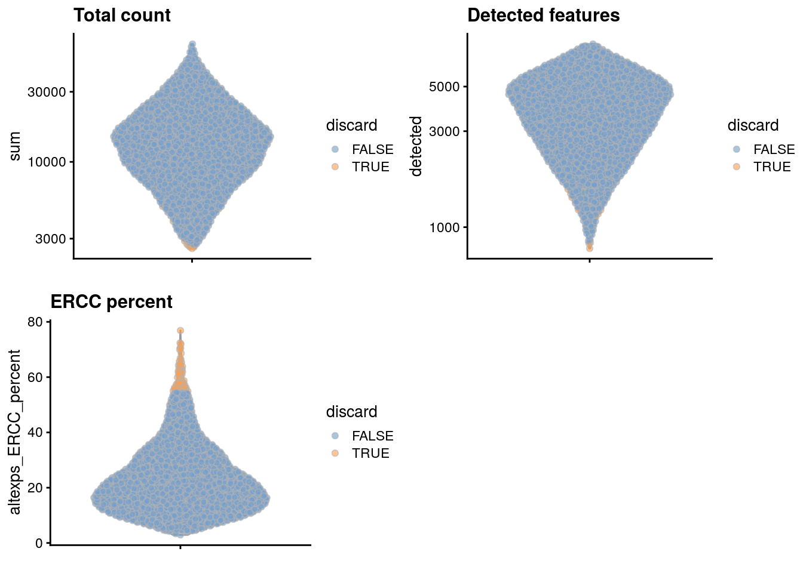
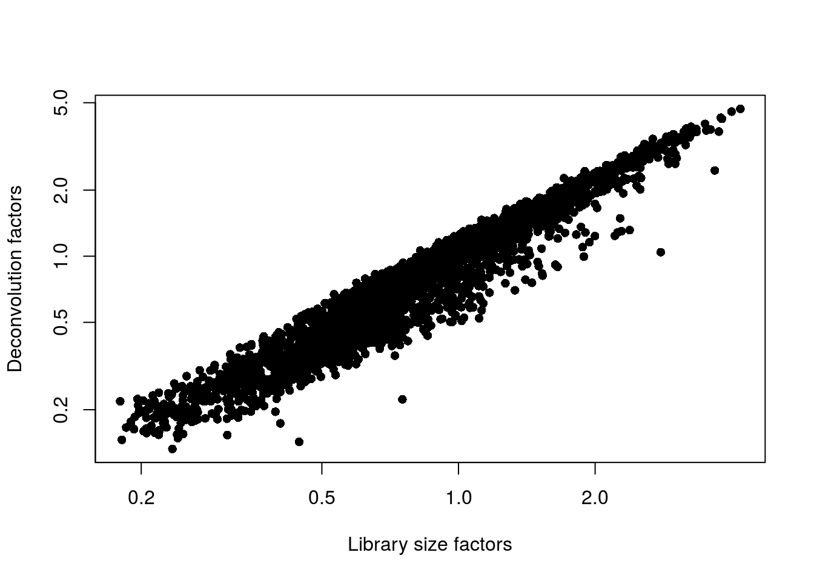
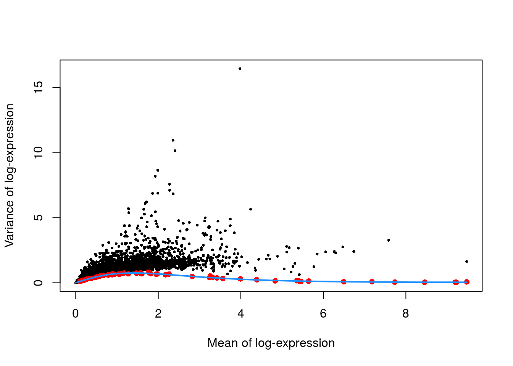
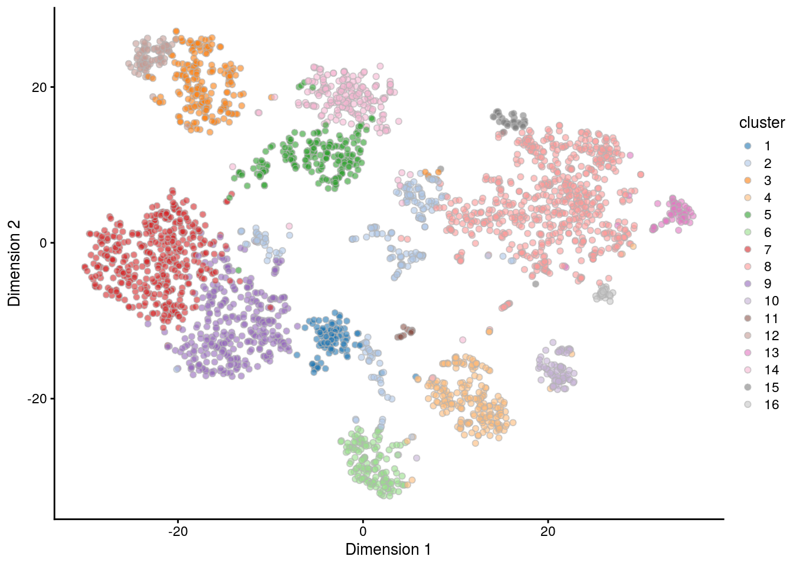

# Mouse brain dataset 


## Introduction

This performs an analysis of the @zeisel2015brain C1 dataset,
consisting of mouse brain cells.

## Analysis

### Data loading

We remove repeats and merge together redundant rows for the same gene.


```r
library(scRNAseq)
sce.zeisel <- ZeiselBrainData()
sce.zeisel <- sce.zeisel[rowData(sce.zeisel)$featureType!="repeat",]

library(scater)
sce.zeisel <- aggregateAcrossFeatures(sce.zeisel, 
    id=sub("_loc[0-9]+$", "", rownames(sce.zeisel)))
```

### Gene annotation


```r
library(org.Mm.eg.db)
ensembl <- mapIds(org.Mm.eg.db, keys=rownames(sce.zeisel), 
    keytype="SYMBOL", column="ENSEMBL")
rowData(sce.zeisel)$ENSEMBL <- ensembl
```

### Quality control


```r
unfiltered <- sce.zeisel
```


```r
stats <- perCellQCMetrics(sce.zeisel)
qc <- quickCellQC(stats, percent_subsets="altexps_ERCC_percent", nmads=3)
sce.zeisel <- sce.zeisel[,!qc$discard]
```

### Normalization


```r
library(scran)
set.seed(1000)
clusters <- quickCluster(sce.zeisel)
sce.zeisel <- computeSumFactors(sce.zeisel, cluster=clusters, min.mean=0.1)
sce.zeisel <- logNormCounts(sce.zeisel)
```

### Variance modelling


```r
dec.zeisel <- modelGeneVarWithSpikes(sce.zeisel, "ERCC")
```

### Dimensionality reduction

Note that `denoisePCA()` automatically selects for genes with positive components, 
so explicit specification of `subset.row=` is not required.


```r
library(BiocSingular)
set.seed(101011001)
sce.zeisel <- denoisePCA(sce.zeisel, technical=dec.zeisel, BSPARAM=IrlbaParam())
sce.zeisel <- runTSNE(sce.zeisel, dimred="PCA")
```

### Clustering


```r
snn.gr <- buildSNNGraph(sce.zeisel, use.dimred="PCA")
sce.zeisel$cluster <- factor(igraph::cluster_walktrap(snn.gr)$membership)
```

## Results

### Quality control statistics


```r
colData(unfiltered) <- cbind(colData(unfiltered), stats)
unfiltered$discard <- qc$discard

gridExtra::grid.arrange(
    plotColData(unfiltered, y="sum", colour_by="discard") +
        scale_y_log10() + ggtitle("Total count"),
    plotColData(unfiltered, y="detected", colour_by="discard") +
        scale_y_log10() + ggtitle("Detected features"),
    plotColData(unfiltered, y="altexps_ERCC_percent",
        colour_by="discard") + ggtitle("ERCC percent"),
    ncol=2
)
```




```r
colSums(as.matrix(qc))
```

```
##              low_lib_size            low_n_features 
##                         0                         3 
## high_altexps_ERCC_percent                   discard 
##                        65                        68
```

### Normalization


```r
summary(sizeFactors(sce.zeisel))
```

```
##    Min. 1st Qu.  Median    Mean 3rd Qu.    Max. 
##    0.13    0.47    0.82    1.00    1.32    4.69
```


```r
plot(librarySizeFactors(sce.zeisel), sizeFactors(sce.zeisel), pch=16,
    xlab="Library size factors", ylab="Deconvolution factors", log="xy")
```



### Variance modelling


```r
plot(dec.zeisel$mean, dec.zeisel$total, pch=16, cex=0.5,
    xlab="Mean of log-expression", ylab="Variance of log-expression")
curfit <- metadata(dec.zeisel)
points(curfit$mean, curfit$var, col="red", pch=16)
curve(curfit$trend(x), col='dodgerblue', add=TRUE, lwd=2)
```



### Dimensionality reduction


```r
ncol(reducedDim(sce.zeisel, "PCA"))
```

```
## [1] 100
```

### Clustering


```r
table(sce.zeisel$cluster)
```

```
## 
##   1   2   3   4   5   6   7   8   9  10  11  12  13  14  15  16 
## 108 198 206 216 208 148 415 619 318  77  16  83  65 196  38  26
```


```r
plotTSNE(sce.zeisel, colour_by="cluster")
```




