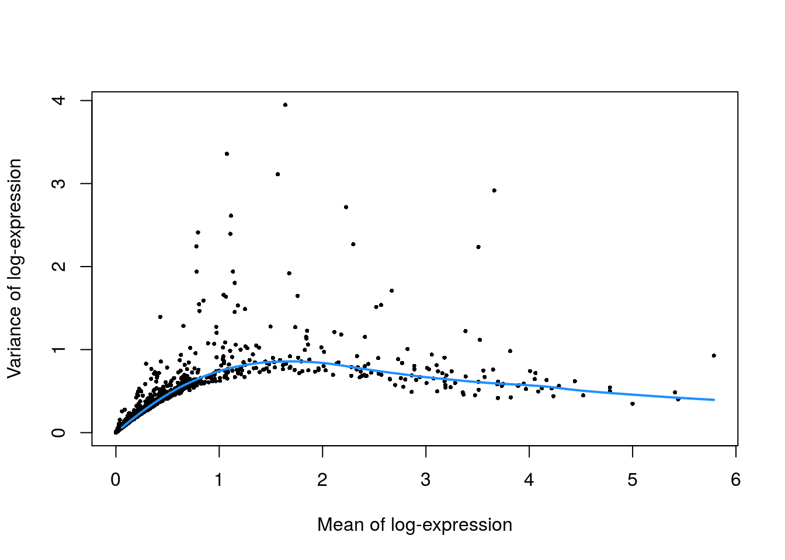

<!-- AUTOMATICALLY GENERATED, DO NOT EDIT! -->

# PBMC 3k 10X dataset (filtered)


## Introduction

This performs an analysis of the public PBMC 3k dataset generated by 10X Genomics [@zheng2017massively],
starting from the filtered count matrix.

## Analysis code

### Data loading


```r
library(TENxPBMCData)
pbmc3k <- TENxPBMCData('pbmc3k')
```

### Quality control


```r
unfiltered <- pbmc3k
```


```r
is.mito <- grep("MT", rowData(pbmc3k)$Symbol_TENx)

library(scater)
stats <- perCellQCMetrics(pbmc3k, subsets=list(Mito=is.mito))
high.mito <- isOutlier(stats$subsets_Mito_percent, nmads=3, type="higher")
pbmc3k <- pbmc3k[,!high.mito]
```

### Normalization


```r
pbmc3k <- logNormCounts(pbmc3k)
```

### Variance modelling


```r
library(scran)
dec3k <- modelGeneVar(pbmc3k)
```


```r
chosen.hvgs <- which(dec3k$bio > 0)
```

### Dimensionality reduction


```r
# Using randomized SVD, which is more efficient for file-backed matrices.
set.seed(10000)
pbmc3k <- runPCA(pbmc3k, subset_row=chosen.hvgs, ncomponents=25,
    BSPARAM=BiocSingular::RandomParam())

set.seed(100000)
pbmc3k <- runTSNE(pbmc3k, dimred="PCA")

set.seed(1000000)
pbmc3k <- runUMAP(pbmc3k, dimred="PCA")
```

### Clustering


```r
g <- buildSNNGraph(pbmc3k, k=10, use.dimred = 'PCA')
clust <- igraph::cluster_walktrap(g)$membership
pbmc3k$cluster <- factor(clust)
```

## Results

### Quality control statistics


```r
colData(unfiltered) <- cbind(colData(unfiltered), stats)
unfiltered$discard <- high.mito

gridExtra::grid.arrange(
    plotColData(unfiltered, y="sum", colour_by="discard") +
        scale_y_log10() + ggtitle("Total count"),
    plotColData(unfiltered, y="detected", colour_by="discard") +
        scale_y_log10() + ggtitle("Detected features"),
    plotColData(unfiltered, y="subsets_Mito_percent",
        colour_by="discard") + ggtitle("Mito percent"),
    ncol=2
)
```


```r
plotColData(unfiltered, x="sum", y="subsets_Mito_percent",
    colour_by="discard") + scale_x_log10()
```


```r
summary(high.mito)
```

```
##    Mode   FALSE    TRUE 
## logical    2609      91
```

### Normalization


```r
summary(sizeFactors(pbmc3k))
```

```
##    Min. 1st Qu.  Median    Mean 3rd Qu.    Max. 
##    0.23    0.75    0.93    1.00    1.16    6.60
```

### Variance modelling


```r
plot(dec3k$mean, dec3k$total, pch=16, cex=0.5,
    xlab="Mean of log-expression", ylab="Variance of log-expression")
curfit <- metadata(dec3k)
curve(curfit$trend(x), col='dodgerblue', add=TRUE, lwd=2)
```



### Clustering


```r
table(pbmc3k$cluster)
```

```
## 
##   1   2   3   4   5   6   7   8   9 
## 471 329 510 610  34 152 160 332  11
```


```r
plotTSNE(pbmc3k, colour_by="cluster")
```


