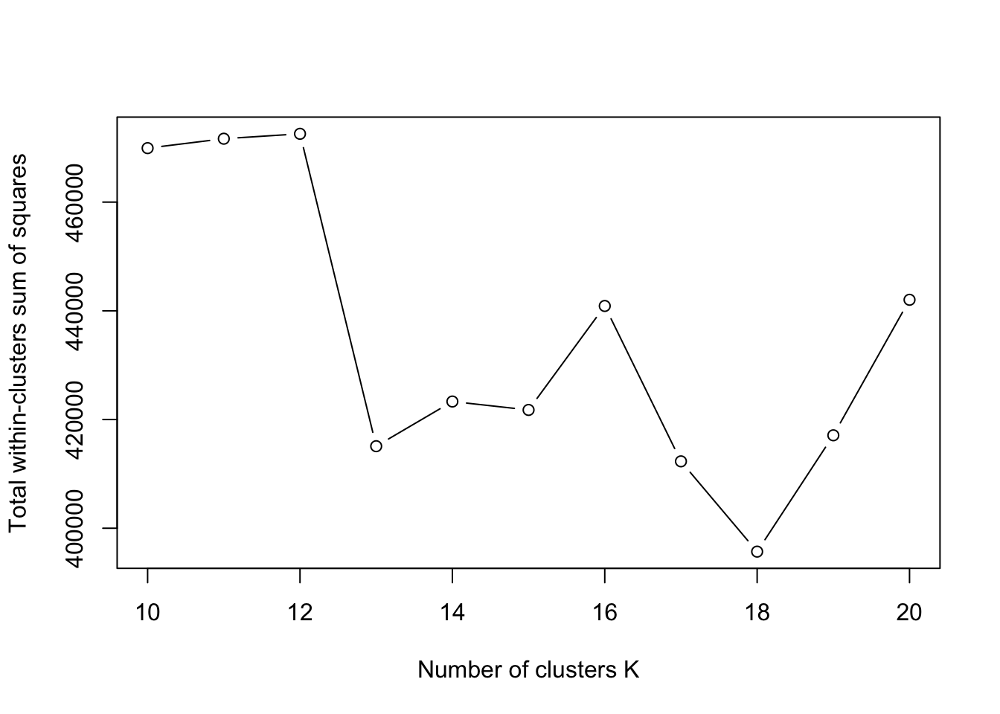
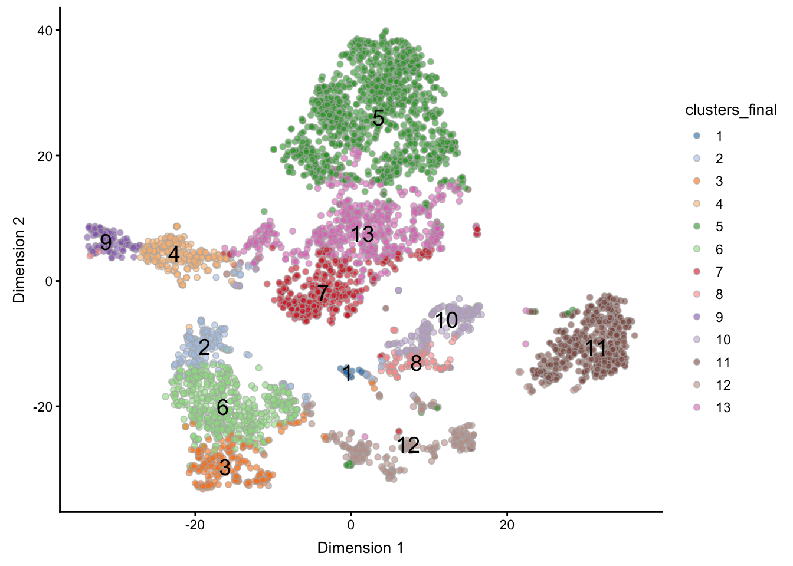
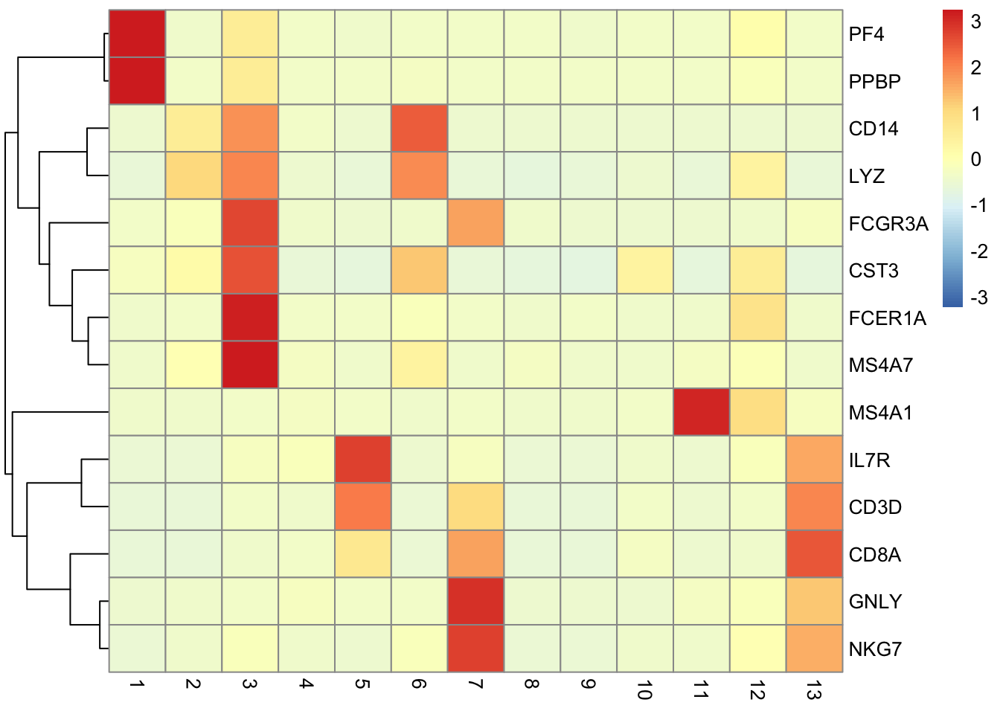
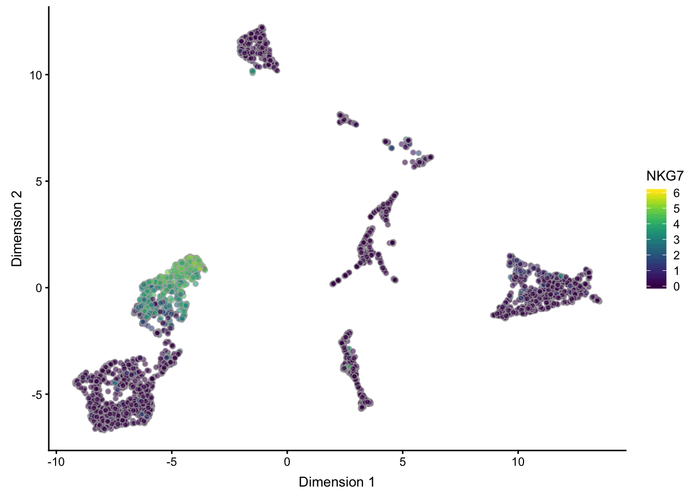
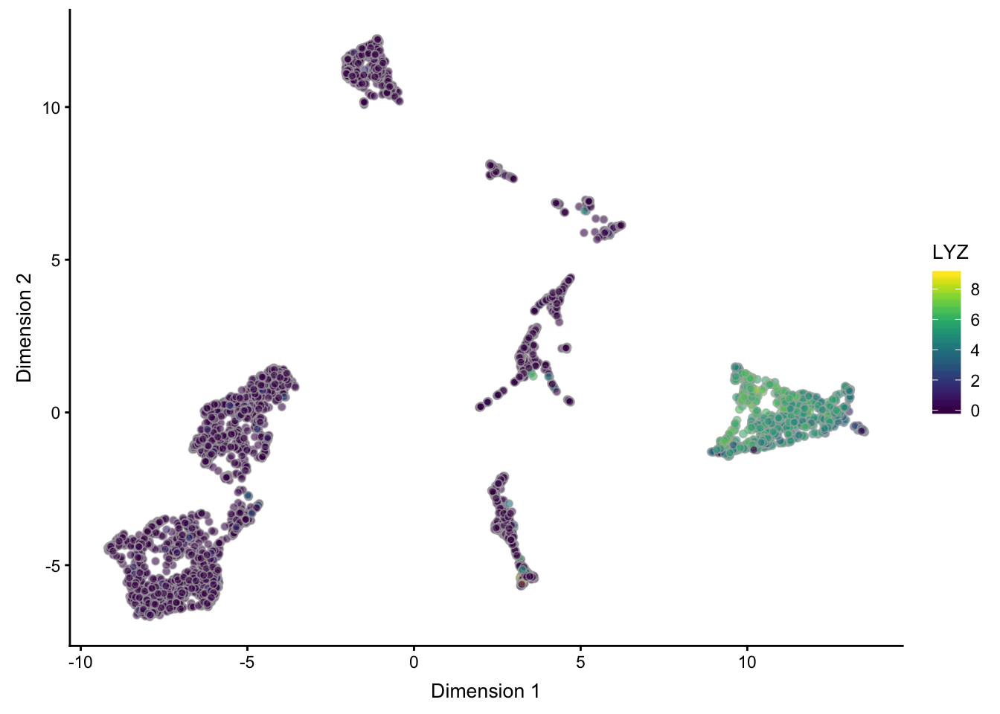

# Large-scale Data

_author: Davide Risso, Robert A. Amezquita_


This workflow illustrates the latest Bioconductor infrastructure to analyze large single-cell datasets that may not entirely fit in memory. We focus on the most common application in exploratory single-cell analysis, namely to find subpopulations of cells. The proposed workflow consists of the following steps:

1. Normalization
2. Dimensionality reduction
3. Clustering

We will exploit a number of Bioconductor packages able to interact with the HDF5 on-disk data representation, freeing us of the need to load the full dataset in memory.

This workflow was specially designed to handle large datasets such as the 1.3 million cell Human Cell Atlas in the [`HCAData`](https://bioconductor.org/packages/devel/data/experiment/html/HCAData.html) scRNA-seq dataset. However, in our workflow, we will subsample the `HCAData` object down to a more manageable number solely for the sake of (compilation) time.


## Package Requirements

These packages will be required for working through the vignette, and can be installed by running the code below:


```r
data_pkg <- c("HCAData", "ExperimentHub")
calc_pkg <- c("scater", "scran", "mbkmeans", "BiocSingular", "uwot")
visl_pkg <- c("RColorBrewer", "pheatmap", "ggplot2")
infr_pkg <- c("DelayedMatrixStats", "pryr", "BiocParallel")

BiocManager::install(c(data_pkg, calc_pkg, visl_pkg, infr_pkg))
```


```r
library(HCAData)
library(ExperimentHub)
library(scater)
library(scran)
library(uwot)
library(BiocSingular)
library(mbkmeans)
library(RColorBrewer)
library(pheatmap)
library(ggplot2)
library(DelayedMatrixStats)
library(pryr)
library(BiocParallel)
```

## Interacting with HDF5 files

At a low-level, the main interface between HDF5 and Bioconductor is implemented in the packages `rhdf5`, which provides read/write functionalities, `Rhdf5lib`, which provides C and C++ HDF5 libraries, and `beachmat`, which provides a consistent C++ class interface for a variety of commonly used matrix types, including sparse and HDF5-backed matrices.

These packages are useful for developers that want to develop methods able to interact with HDF5 data sets. However, for most Bioconductor users interested in the analysis of single-cell data, the entry point is represented by the high-level class `SingleCellExperiment` (implemented in the `SingleCellExperiment` package) and the lower level classes `HDF5Matrix` and `DelayedMatrix`, which can be stored in the `assay` slot of a `SingleCellExperiment` object. Once the data are stored in a `SingleCellExperiment` object with `HDF5Matrix` or `DelayedMatrix` as its assay, the packages `scater`, `scran`, `BiocSingular` and `mbkmeans` can be seamlessly used.
The package `DelayedMatrixStats` deserves a special mention: it implements the rich API of the CRAN package `matrixStats` for `HDF5Matrix` and `DelayedMatrix` objects.

We invite the reader to find more details on all the mentioned packages in their relative vignettes. In the remainder of this use case, we will use these methods to find cell sub-populations in a real datasets.


## Loading the Data

Here, we use one of the Human Cell Atlas preview datasets available in the `HCAData` Bioconductor package, the `ica_bone_marrow` dataset. 


```r
eh <- ExperimentHub()
query(eh, "HCAData")
##change to brain
sce <- HCAData("ica_bone_marrow")
```

In order to make the compilation time more manageable, here we will subsample the data to a more reasonable size. For our use, we will go down to 5000 cells.


```r
set.seed(1234)
subsample <- sample(ncol(sce), 5000) # super downsample temporary
sce <- sce[, subsample]
```

One small bit of housekeeping - the initial gene IDs used as `rownames` for `sce` are in Ensembl Gene ID format. To make the gene ids human-readable, we convert the rownames to gene symbol. In this case, the mapping between Ensembl Gene ID's and symbols is kept in the `rowData` slot of our `sce`, and so we overwrite the current rownames as follows:


```r
rownames(sce) <- rowData(sce)$Symbol
```

We can inspect the resulting `sce` object's key characteristics:


```r
sce[1:5, 1:5] # first 5x5 entries
```

```
## class: SingleCellExperiment 
## dim: 5 5 
## metadata(7): high_mito genes_keep ... wcss clusters_final
## assays(2): counts logcounts
## rownames(5): RP11-34P13.3 FAM138A OR4F5 RP11-34P13.7 RP11-34P13.8
## rowData names(3): ID Symbol scater_qc
## colnames(5): MantonBM1_HiSeq_8-AGGTCCGGTACCAGTT-1
##   MantonBM5_HiSeq_8-ATCTACTAGCTCCTTC-1
##   MantonBM5_HiSeq_7-CGATTGAGTCGAAAGC-1
##   MantonBM5_HiSeq_8-CAGAGAGAGTATTGGA-1
##   MantonBM7_HiSeq_8-CACAAACCAGCTGTTA-1
## colData names(4): Barcode scater_qc clusters_prenorm
##   clusters_final
## reducedDimNames(3): PCA TSNE UMAP
## spikeNames(0):
```

As well as the `assay` slot of `sce`, which we see below that the data is indeed stored in an object of the `DelayedMatrix` class, and that the Ensembl gene ID's have been replaced with gene symbols:


```r
assay(sce)[1:5, 1:5] # first 5x5 entries
```

```
## <5 x 5> DelayedMatrix object of type "integer":
##              MantonBM1_HiSeq_8-AGGTCCGGTACCAGTT-1 ...
## RP11-34P13.3                                    0   .
## FAM138A                                         0   .
## OR4F5                                           0   .
## RP11-34P13.7                                    0   .
## RP11-34P13.8                                    0   .
##              MantonBM7_HiSeq_8-CACAAACCAGCTGTTA-1
## RP11-34P13.3                                    0
## FAM138A                                         0
## OR4F5                                           0
## RP11-34P13.7                                    0
## RP11-34P13.8                                    0
```

## Preprocessing

First, we use the `scater` package to compute a set of QC measures and filter out the low-quality samples.


```r
ctrl <- list(Mito = grep("^MT", rowData(sce)$Symbol)) 

sce <- calculateQCMetrics(sce, 
                          feature_controls = ctrl,
                          compact = TRUE, # return as nested DF
                          BPPARAM = MulticoreParam(2))
```

### Remove Damaged Cells

Here we calculate which cells have a high proportion of mitocondrial reads, using it as a proxy for cell damage, and save the result into the `metadata` slot.


```r
high_mito <- isOutlier(colData(sce)$scater_qc$feature_control_Mito$pct_counts,
                       nmads = 3, type = "higher")
metadata(sce)$high_mito <- high_mito
```

The table below enumerates the cells which fail/pass this filter:


```r
table(metadata(sce)$high_mito)
```

```
## 
## FALSE  TRUE 
##  4496   504
```

We can then filter cells in our `sce` object on this basis.


```r
sce <- sce[, !metadata(sce)$high_mito]
```


### Determine Lowly Expressed Genes

Before proceding with the data analysis, we remove the lowly expressed genes. Here, we keep only those genes that have at least 1 UMI in at least 5% of the data. These threshold are dataset-specific and may need to be taylored to specific applications.


```r
num_reads <- 1
num_cells <- 0.05 * ncol(sce)
keep <- which(DelayedArray::rowSums(counts(sce) >= num_reads) >= num_cells)

metadata(sce)$genes_keep <- keep
```

We will use the `genes_keep` vector to subset our genespace in upcoming calculations.


## Normalization

Normalization is a crucial step in the preprocessing of the results. Here, we use the `scran` package to compute size factors that we will use to compute the normalized log-expression values.

It has been shown that the `scran` method works best if the size factors are computed within roughly homogeneous cell populations; hence, it is beneficial to run a quick clustering on the raw data to compute better size factors. This ensures that we do not pool cells that are very different. Note that this is not the final clustering to identify cell sub-populations. 

Here we use `mbkmeans` to perform an initial clustering based on the count data in the `sce` object. Note that given that this operates on counts rather than the principal components, and thus will take a longer amount of time to compute. A more thorough explanation of `mbkmeans` and its parameters will be covered in a subsequent section. 

Note that we use the `set.seed()` function to ensure the reproducibility of the results. 


```r
set.seed(1234)

## Subset down based on kept genes; use only 1000 genes
## to speed up prenorm clustering 
subsample <- sample(length(metadata(sce)$genes_keep), 1000)
genes_1k <- metadata(sce)$genes_keep[subsample]
counts_genes_1k <- counts(sce)[genes_1k, ]

## Cluster based on 1k genes x counts data
clusters_prenorm <- mbkmeans(counts_genes_1k,
                     max_iters = 1,   # reduced for faster clustering
                     clusters = 10,   # guesstimate
                     batch_size = 50)

## Save results into colData slot
colData(sce)$clusters_prenorm <- clusters_prenorm$Clusters

## Compute size factors w.r.t. prenorm clusters
sce <- computeSumFactors(sce,
                         min.mean = 0.1,
                         cluster = sce$clusters_prenorm,
                         BPPARAM = MulticoreParam(2))
```

Finally, we compute normalized log-expression values with the `normalize()` function from the `scater` package.


```r
sce <- normalize(sce)
```

Note that the log-normalized data are stored in the `logcounts` assay of the object. Since the `counts` assay is a `DelayedMatrix` and we have only one set of size factors in the object, the normalized data are also stored as a `DelayedMatrix`.


```r
## Verifying that our logcounts are also of DelayedMatrix class
logcounts(sce)
```

```
## <33694 x 4496> DelayedMatrix object of type "double":
##              MantonBM1_HiSeq_8-AGGTCCGGTACCAGTT-1 ...
## RP11-34P13.3                                    0   .
##      FAM138A                                    0   .
##        OR4F5                                    0   .
## RP11-34P13.7                                    0   .
## RP11-34P13.8                                    0   .
##          ...                                    .   .
##   AC233755.2                                    0   .
##   AC233755.1                                    0   .
##   AC240274.1                                    0   .
##   AC213203.1                                    0   .
##      FAM231B                                    0   .
##              MantonBM7_HiSeq_1-GTCTTCGTCTGTCCGT-1
## RP11-34P13.3                                    0
##      FAM138A                                    0
##        OR4F5                                    0
## RP11-34P13.7                                    0
## RP11-34P13.8                                    0
##          ...                                    .
##   AC233755.2                                    0
##   AC233755.1                                    0
##   AC240274.1                                    0
##   AC213203.1                                    0
##      FAM231B                                    0
```

This allows us to store in memory only the `colData` and `rowData`, resulting in a fairly small object. We can inspect the size of the object using the `pryr` package `object_size()` function. We leave it to the interested reader to compare the results to data that are fully loaded in-memory.


```r
pryr::object_size(sce)
```

```
## 15.8 MB
```

## Dimensionality reduction

Here, we perform dimensionality reduction by first identifying the top 1000 most variable genes and then running PCA on the normalized log counts. 

<!-- ## need to do this otherwise it takes forever -- ask Herve about this -->
<!-- setRealizationBackend("HDF5Array") -->
<!-- logcounts(sce) <- realize(logcounts(sce)) -->


```r
## Find most variable genes based on logcounts
vars_genes <- DelayedMatrixStats::rowVars(logcounts(sce))
names(vars_genes) <- rownames(sce)
vars_genes <- sort(vars_genes, decreasing = TRUE)

## save our genes variances into the metadata slot for safekeeping
metadata(sce)$vars_genes <- vars_genes

## Specify the top 1000 most highly variable genes (hvg) by name
metadata(sce)$hvg_genes <- names(metadata(sce)$vars_genes)[1:1000]
```


```r
## transpose and subset by hvg the logcounts
for_pca <- t(logcounts(sce)[metadata(sce)$hvg_genes, ])

## Run PCA with parallelization + random svd (via rsvd())
pca <- BiocSingular::runPCA(for_pca, rank = 20,
                            BSPARAM = RandomParam(deferred = FALSE),
                            BPPARAM = MulticoreParam(2))

## Save PCA result into the reducedDims slot
reducedDim(sce, "PCA") <- pca$x
```

## Clustering with Mini-batch k-means

To perform an exploration of optimal clustering, we run `mbkmeans()` through multiple iterations of `k`. Here in particular, we've set the `calc_wcss` parameter to true to determine where our optimal number of `k` occurs. Further, we save the overall results once again into our `metadata` slot.


```r
set.seed(1234)
wcss <- lapply(10:20, function(k) {
    cl <- mbkmeans(sce, reduceMethod = "PCA",
                   clusters = k,
                   batch_size = 50,
                   num_init = 10, max_iters = 100,
                   calc_wcss = TRUE)
})

metadata(sce)$wcss <- wcss
```

We can then plot the corresponding within-clusters sum of squares to determine our optimal `k`.


```r
plot(10:20, sapply(metadata(sce)$wcss, function(x) sum(x$WCSS_per_cluster)),
     type = "b",
     xlab = "Number of clusters K",
     ylab = "Total within-clusters sum of squares")
```



Following that, we can once again perform clustering, but this time changing our parametrization to improve our results by increasing batch size, setting the desired number of clusters, and increasing the number of initializations and max iterations the algorithm goes through.


```r
set.seed(1234)

## Perform final clustering on clustering with k=13
clusters_final <- mbkmeans(sce, reduceMethod = "PCA", clusters = 13, 
                           batch_size = 200,
                           num_init = 10, max_iters = 100)

## Save full results into metadata
metadata(sce)$clusters_final <- clusters_final

## Save the clusters into colData as a factor for plotting
colData(sce)$clusters_final <- as.factor(clusters_final$Clusters)
## alternately: sce$cluster_final
```


## Visualization

To visualize our final results, we can calculate the tSNE representation of our data, and then plot our final cluster designations. Note that here we use the `BNPARAM` argument of `runTSNE()` to supply a `BiocNeighbors` param, the `AnnoyParam()`


```r
set.seed(1234)

## Calculate TSNE representation
sce <- runTSNE(sce,
               use_dimred = "PCA",
               external_neighbors = TRUE, 
               BNPARAM = BiocNeighbors::AnnoyParam(),
               nthreads = 2,
               BPPARAM = BiocParallel::MulticoreParam(2))
```

We can then plot our resulting tSNE representation, here colouring by the final clustering assignment as well as adding a text overlay.


```r
## Plot the TSNE
plotTSNE(sce,
         colour_by = "clusters_final",
         text_by = "clusters_final")
```



Furthermore, we can calculate the UMAP representation, using the very speedy `uwot` package implementation, manually assigning the results into the `reducedDims` slot as before.


```r
set.seed(1234)

## Calculate umap representation and assign to reducedDims slot
um <- uwot::umap(reducedDim(sce, "PCA"), nn_method = "annoy",
                 approx_pow = TRUE, n_threads = 2)
reducedDim(sce, 'UMAP') <- um
```

And subsequently plot our UMAP representation as well:


```r
plotReducedDim(sce, "UMAP",
               colour_by = "clusters_final",
               text_by = "clusters_final")
```


### Marker genes

As a final exercise, we show some expression plots on key marker genes in the form of a heatmap and expression plots on the UMAP representation.


```r
markers <- c("IL7R", #CD4
             "CD14",
             "LYZ", #CD14
             "MS4A1", #B cells
             "CD8A", #CD8
             "FCGR3A", #Monocytes
             "MS4A7",
             "GNLY",
             "NKG7", #NK cells
             "FCER1A", #Dendritic
             "CST3",
             "PPBP",
             "PF4", #megakaryocyte
             "CD3D"
             )

## Calculate the mean expression of each marker w.r.t. cluster
means <- apply(counts(sce[which(rowData(sce)$Symbol %in% markers),]), 1,
               tapply, sce$clusters_final, mean)
colnames(means) <- rowData(sce[colnames(means),])$Symbol

## Plot the heatmap of all marker genes
pheatmap(log2(t(means)+1), scale = "row", cluster_cols = FALSE)
```



```r
## Plot expression of select genes on UMAP
plotReducedDim(sce, "UMAP", colour_by = "CD3D")
```


```r
plotReducedDim(sce, "UMAP", colour_by = "NKG7")
```



```r
plotReducedDim(sce, "UMAP", colour_by = "LYZ")
```




<!-- ## Session Info -->

<!-- ```{r} -->
<!-- sessionInfo() -->
<!-- ``` -->


<!-- Hidden code -->

