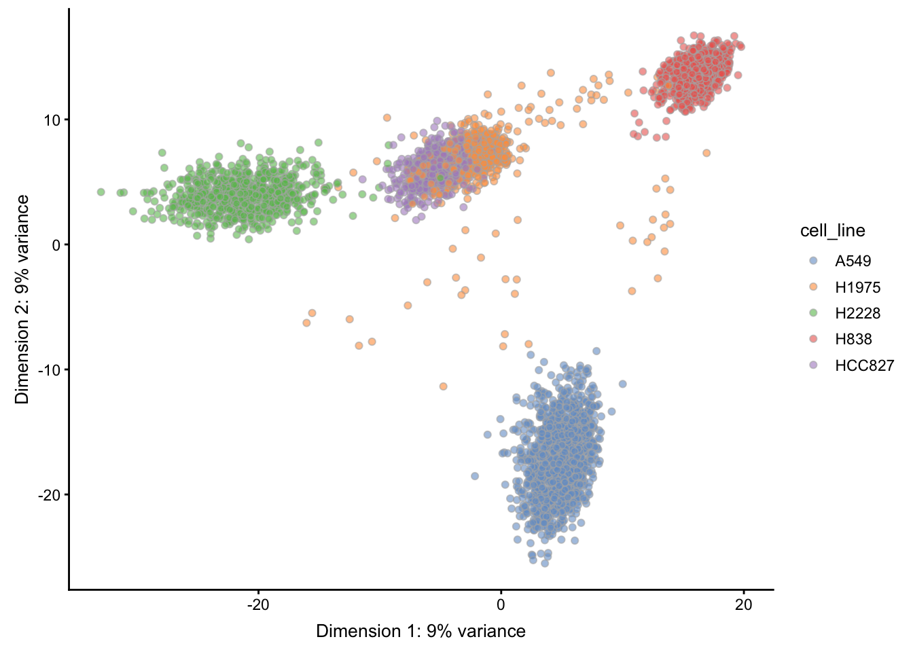
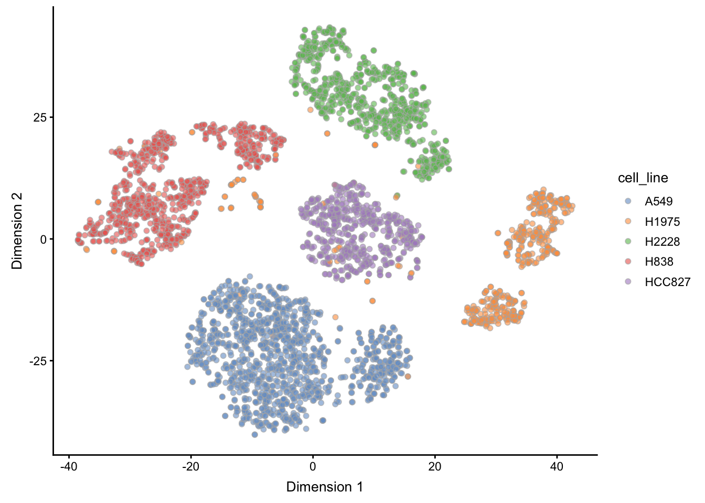
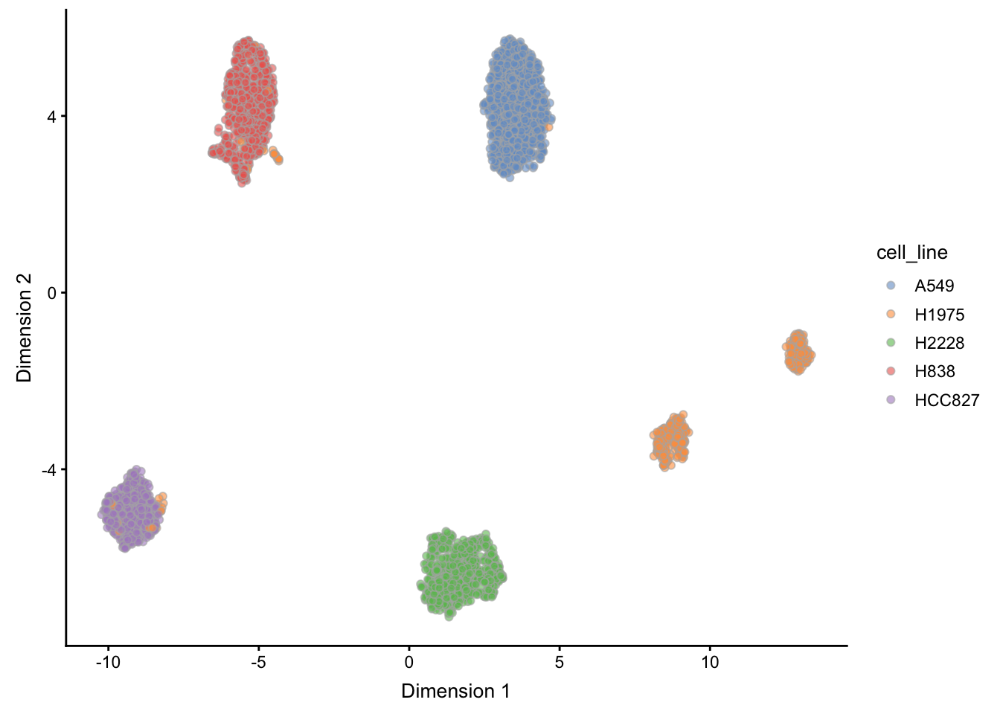
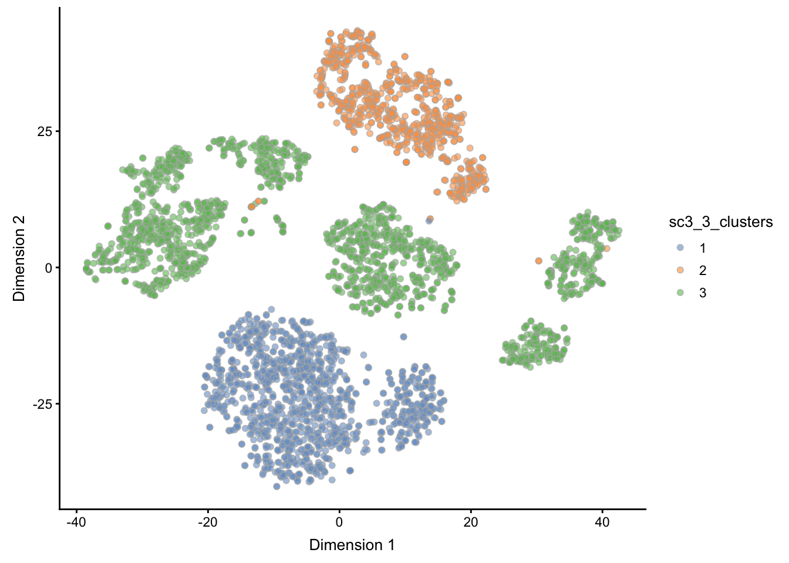
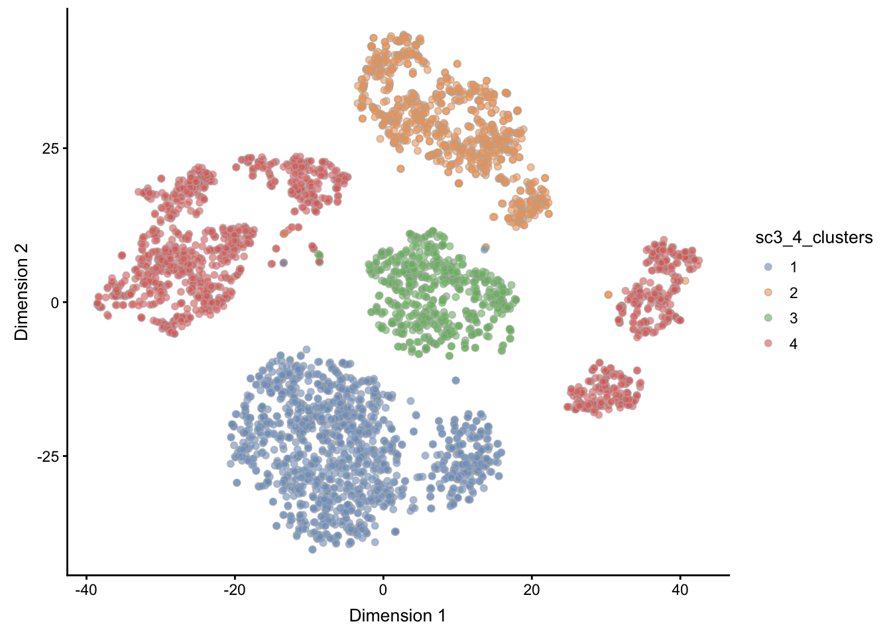
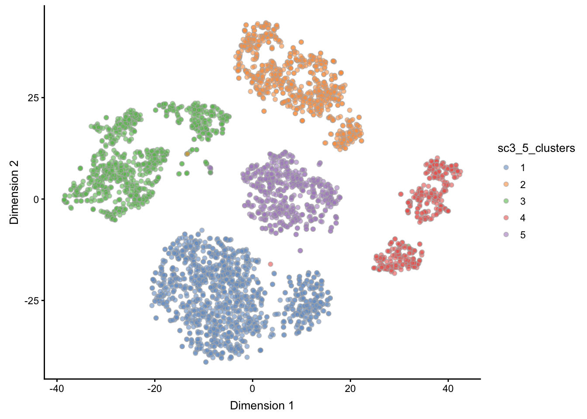
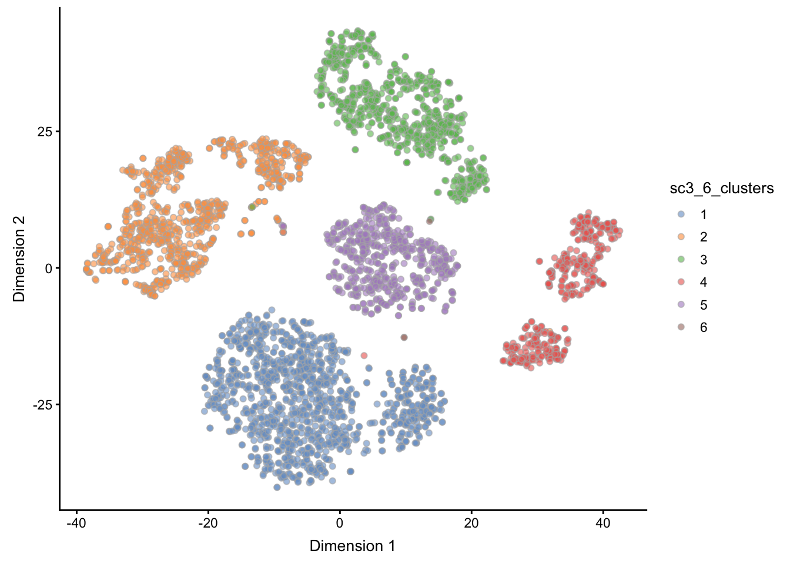
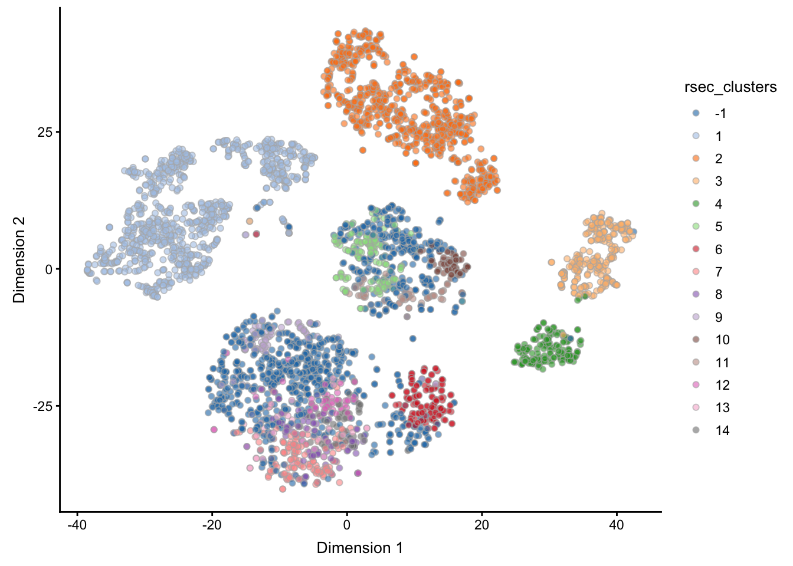
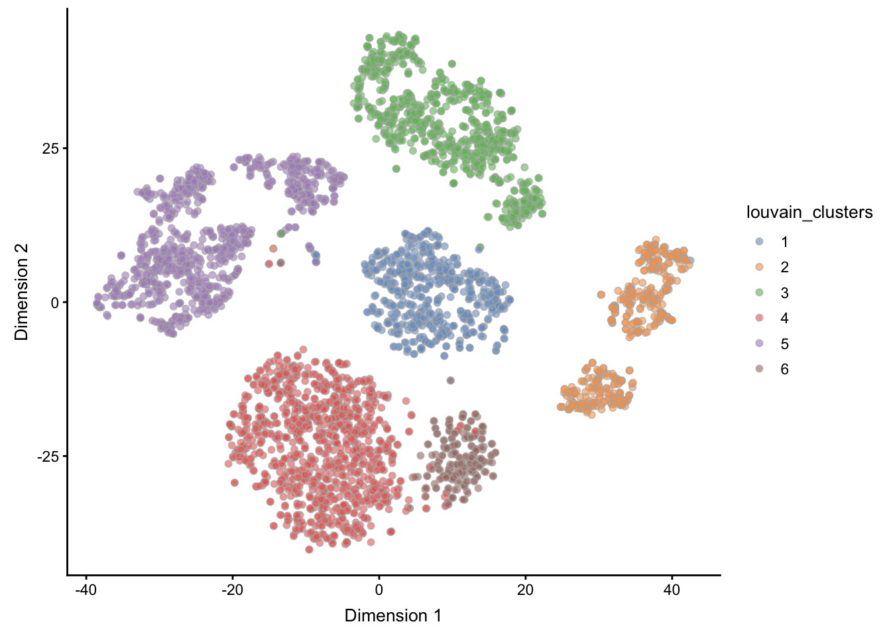

# Clustering

_author: Robert A. Amezquita_


The purpose of this case study is to demonstrate various approaches to clustering scRNA-seq datasets using R/Bioconductor packages. In this workflow, we go from preprocessing the data to clustering the data. Furthermore, we highlight methods which are especially suitable for large datasets. 

Here we will be working with a dataset from the [CellBench](https://github.com/LuyiTian/CellBench_data) scRNA-seq benchmarking dataset collection. Specifically, we will be working with the `sc_10x_5cl` dataset, which contains 5 sorted cell lines that were sequencing on the 10X Genomics platform. We will use this to showcase our different clustering strategies.


## Package Requirements

These packages will be required for working through the vignette, and can be installed by running the code below:


```r
BiocManager::install(c('scater', 'scran',
                      'SC3', 'clusterExperiment', 'BiocNeighbors',
                      'BiocParallel'))
```


```r
library(scater)
library(scran)
library(SC3)
library(clusterExperiment)
library(BiocParallel)
```

## Loading the Data

To follow along with the workflow, we use the [CellBench_data](https://github.com/LuyiTian/CellBench_data) Github repository `data` folder's `sincell_with_class_5cl.RData` workspace, which contains an object called `sc_10x_5cl_qc`. While this data will eventually be submitted to ExperimentHub, a central repository for datasets, it is currently as yet unavailable there. 

For the time being, the data can be found in this book's Github repo in the `_rfiles/_data` folder. The data arrives as a `SingleCellExperiment` class object.


```r
sce <- readRDS("_rfiles/_data/cellbench_sce_sc_10x_5cl_qc.rds")
```

## Understanding the Data

Within the cell metadata stored in the `colData` slot of our `sce` object, we see that information regarding the cell line of origin for each cell is stored under the column `cell_line`, and furthermore can count the number of instances of each cell line present in the dataset as follows:


```r
table(sce$cell_line)
```

```
## 
##   A549  H1975  H2228   H838 HCC827 
##   1244    515    751    840    568
```

We will be using this information to illustrate our dimensionality reduction by highlighting each of the cell lines, and furthermore using this information to verify our clustering performance. While ground truth is not often known in practice, such benchmarking datasets are essential for validation of methods. While simulations are another source of establishing ground truth, this dataset is particularly appealing as it is derived under realistic experimental conditions.

## Preprocessing

This dataset has already undergone cell quality control, so in this case we will skip this step (for this, we refer to the [Workflow on Integrating Datasets](#workflow-integrating-datasets). Thus, we will begin with the feature selection step and go on from there.

## Feature Selection

In order to improve performance in terms of both speed and quality of results, we will start with defining a set of highly variable genes based on the biological coefficient of variability (see the [scran vignette](https://bioconductor.org/packages/devel/bioc/vignettes/scran/inst/doc/scran.html#5_variance_modelling) for details).


```r
## Calculating highly variable genes -------------------
fit <- trendVar(sce, parametric=TRUE, use.spikes = FALSE)
dec <- decomposeVar(sce, fit)
hvg_genes <- rownames(dec[dec$FDR < 0.00001, ]) # 1874 genes

## remove uninteresting/unknown genes (ribosomal, mitochondrial)
bad_patterns <- 'RP[0-9]|^MT|[0-9][0-9][0-9][0-9]|^RPL|^RPS'
hvg_genes <- hvg_genes[!grepl(bad_patterns, hvg_genes)] # 1713 genes

## save the decomposed variance table and hvg_genes into metadata for safekeeping
metadata(sce)$hvg_genes <- hvg_genes
metadata(sce)$dec_var <- dec
```

## Dimensionality Reduction 

Here we will use PCA to calculate the first 20 principal components with our highly variable geneset, using the `irlba` method for a faster approximate version of the calculation. These PCs will then form the basis of our subsequent tSNE calculation.


```r
sce <- runPCA(sce, method = "irlba",
             ncomponents = 20,
             feature_set = metadata(sce)$hvg_genes)
sce <- runTSNE(sce,
              perplexity = 30,
              feature_set = metadata(sce)$hvg_genes)
sce <- runUMAP(sce,
              n_neighbors = 15,
              feature_set = metadata(sce)$hvg_genes)
```

Here, we see that PCA nicely separates most of the cell lines, with the exception of HCC827 and H1975. On the other hand, tSNE nicely manages to separate the 5 cell lines, but interestingly produces two separate clusters for cell line H1975. 

We leave it as an exercise to the interested reader to modify the essential tuning parameters, `perplexity`, and `n_neighbors` for TSNE and UMAP respectively to see how the dimensionality reduction embeddings change. Here we have used the default parameters, but simply made them explicit. Information on these and other parameters can be seen by accessing the help for each function.

Note that clustering performance is _not_ necessarily dependent on the dimensionality reduction results (to answer this, it will depend on the specific clustering technique at hand). 

However, clustering performance indeed _may_ be reflected in the dimensionality reduction results. For example, given the PCA result, we might expect some confusion between HCC827 and H1975, and based on the UMAP results, we might possibly even see two clusters within the H1975 cell line. Note however that these dimensionality reduction embeddings are also a function of the tuning parameters noted above.


```r
plotReducedDim(sce, "PCA", colour_by = "cell_line")
```



```r
plotReducedDim(sce, "TSNE", colour_by = "cell_line")
```



```r
plotReducedDim(sce, "UMAP", colour_by = "cell_line")
```



## Clustering 

Here we highlight different frameworks for clustering. The first two, using the `sc3` and `clusterExperiment` Bioconductor packages, are fuller implementations that can test across multiple parametrizations and furthermore inspect the quality of the clustering results. The `BiocNeighbors` package is briefly highlighted to show a minimal alternative to clustering that emphasizes speed.

### SC3

The `sc3` package provides a simple framework that allows users to test for many k's, e.g. numbers of clusters, and subsequently compare the results from these differing k's in both quantitative and qualitative ways to pick an optimal k result. Below, we first set an essential `rowData` feature required by the package to run. Subsequently, we run the `sc3()` function in this example using a subset of the data (only the highly variable genes, `hvg_genes`, testing k's 3 through 6. 


```r
## SC3 requires this column to be appended
rowData(sce)$feature_symbol <- rownames(sce) 

## SC3 will return an SCE object with appended "sc3_" columns
sce <- sc3(sce[metadata(sce)$hvg_genes, ],
           ks = 3:6,
           k_estimator = TRUE)
```

After using `sc3()`, the function returns the original `SingleCellExperiment` object, but with new columns in `colData(sce)` corresponding to the different `ks` supplied to the function, as well as a full representation of the analysis that is stored in `metadata(sce)$sc3`, which includes an estimate of the optimal `k` (as dictated by the `k_estimator = TRUE` argument above). 

Below, we show the clustering results of the `ks` we supplied, 3 through 6, shown on the TSNE representation of the data. We use the `scater` package function `plotReducedDim()` to produce the individual plots, and for the sake of this vignette, wrap them together into a single plot using the `patchwork` package.


```r
plotReducedDim(sce, use_dimred = "TSNE", colour_by = "sc3_3_clusters")
```



```r
plotReducedDim(sce, use_dimred = "TSNE", colour_by = "sc3_4_clusters")
```



```r
plotReducedDim(sce, use_dimred = "TSNE", colour_by = "sc3_5_clusters")
```



```r
plotReducedDim(sce, use_dimred = "TSNE", colour_by = "sc3_6_clusters")
```



The `sc3` package contains many more utilities for exploring the stability of clustering and can even produce differential expression analysis results using the `biology = TRUE` argument within the `sc3()` function. We leave it to the interested reader to [learn more about `sc3`](https://bioconductor.org/packages/release/bioc/html/SC3.html) via their vignette.


### clusterExperiment

The `clusterExperiment` package uses the function `RSEC()` to calculate clusters across various parametrizations, and contains multiple parameters to do so. Here, we specify the parametrizations to iterate over using the `alphas` and `k0s` arguments below. We refer the reader to the help page for `?RSEC` to learn more about the different parameters. In the end, this exhaustive exercise is used to ultimately determine a consensus clustering that combines the information learned from the various parametrizations. 

Note that `clusterExperiment` takes a long time to run, even with the reduced search space parametrized below. We recommend utilizing cluster resources for this job.


```r
rsec <- RSEC(sce[metadata(sce)$hvg_genes, ],
             reduceMethod = "PCA",
             nReducedDims = 20,
             alphas = c(0.1, 0.3), k0s = 4:6,
             consensusMinSize = 50,
             ncores = 8)
```

The `clusterExperiment` package contains many visualization tools for assessing the cluster assignment. Here we show two plots with the cluster assignments across our various parametrizations and a dendrogram showing the relatedness of the final consensus clustering. Note that white denotes unassigned cells that were not assigned to a cluster.


```r
plotClusters(rsec)
plotDendrogram(rsec)
```

Once again, we refer the interested reader to the [vignette for `clusterExperiment`](https://bioconductor.org/packages/release/bioc/html/clusterExperiment.html) to learn more about extended functionality for visualizing the data and about the specifics of the clustering workflow. 

To get our final, consensus clustering assignments out (as shown by the `plotDendrogram()` function) we use the `primaryCluster()` function to retrieve the labels. To save this result into our `sce` object, we add it to the `colData` slot as shown below.


```r
rsec_clusters <- primaryCluster(rsec)
rsec_clusters <- as.factor(rsec_clusters) # convert to a categorical variable

colData(sce)$rsec_clusters <- rsec_clusters
## sce$rsec_clusters <- rsec_clusters  # same as above
```

We can now use the `scater` function `plotReducedDim()` to visualize our results from `clusterExperiment` on a t-SNE plot. Note that the `-1` assignment denotes that a cell was not assigned a cluster. 


```r
plotReducedDim(sce, use_dimred = "TSNE", colour_by = "rsec_clusters")
```




### Manual Clustering

Low-level clustering relies on building the shared- or k-nearest neighbors graphs manually, and then applying a graph-based clustering algorithm based on the resulting graph. One such wrapper to construct the SNN/KNN graph comes from the `scran` package's `buildSNNGraph()` and `buildKNNGraph()` functions, respectively. The resulting `igraph` object from these functions can then be fed into any number of clustering algorithms provided by `igraph`. For example, louvain clustering is a popular algorithm that is implemented in the `cluster_louvain()` function.

Further, one additional parameter to note in the `buildSNNGraph()` function below is the `BNPARAM`, which provides even finer control over nearest-neighbors detection via the `BiocNeighbors` package. This parameter allows the user to specify an implementation from `BiocNeighbors` to use that has been designed for high-dimensional data. Here, we highlight the use of an approximate method via the Annoy algorithm by way of providing `AnnoyParam()`. 

Given the limited scope of the calculations and optimizations provided herein via the use of already calculated dimension reduction results (via `use.dimred`), the `BNPARAM` as explained above, and parallelization via `BPPARAM`, this manual clustering approach is quite speedy. We use the louvain clustering algorithm to cluster on the resulting graph and save the result into our sce object's `colData` slot.


```r
g <- buildSNNGraph(sce, k = 50,
                   use.dimred = 'PCA',
                   BNPARAM = AnnoyParam(),
                   BPPARAM = MulticoreParam(8))

louvain_clusters <- igraph::cluster_louvain(g)$membership

sce$louvain_clusters <- as.factor(louvain_clusters)
```

The results can then be plotted just as before:


```r
plotReducedDim(sce, use_dimred = "TSNE", colour_by = "louvain_clusters")
```



The `BiocNeighbors` package is especially designed for developers to enable a unified interface for clustering algorithm specification, allowing for the algorithm to be easily switched within a Bioconductor package or workflow. For more information, check out the [Bioconductor page for BiocNeighbors](https://bioconductor.org/packages/BiocNeighbors/).


<!-- ## Session Info -->

<!-- ```{r} -->
<!-- sessionInfo() -->
<!-- ``` -->
