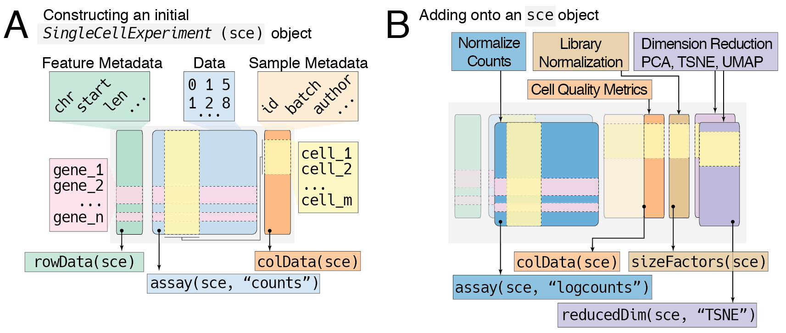
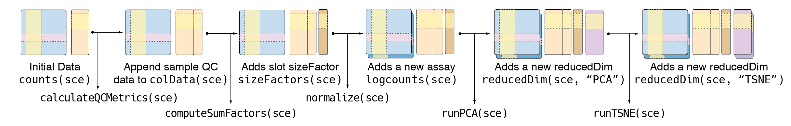

# Data Infrastructure {#data-infrastructure}

Bioconductor relies on implementing common data infrastructures.

## The _SingleCellExperiment_ Object

## Working with _SCE_

Transformations of the SCE.

