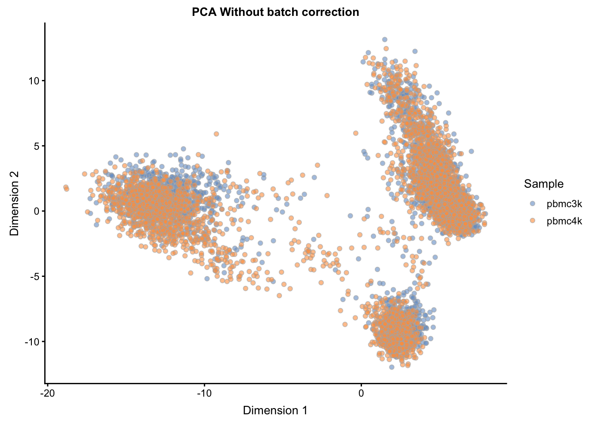
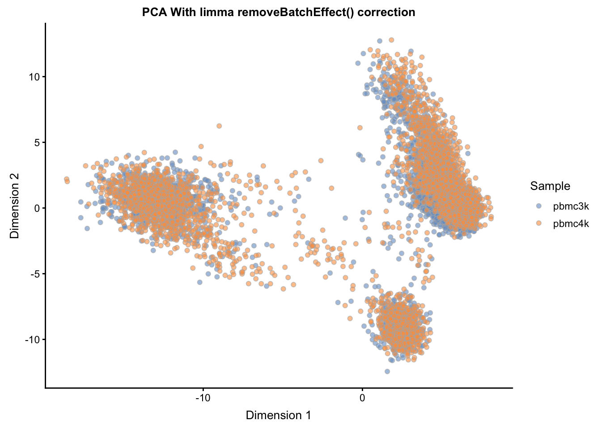
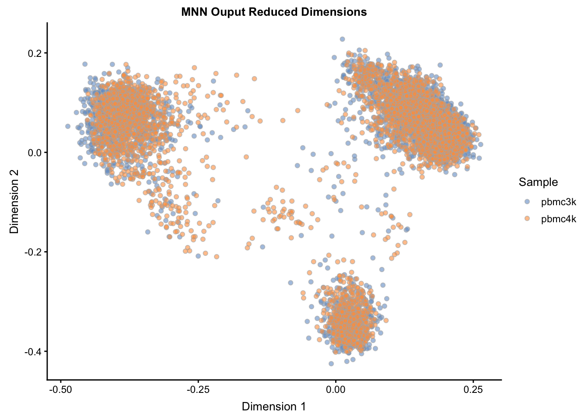

# Workflow: Integrating Datasets

_authors_: Stephanie C. Hicks, Robert A. Amezquita

The purpose of this case study is to demonstrate how to integrate multiple scRNA-seq datasets using R/Bioconductor packages. In this workflow, we go from preprocessing the data to integrating the data and visualizing it in a reduced dimensionality space to showcase the success of the integration approach using mutual nearest neighbors relative to a naive approach. This approach is helpful for ameliorating batch effects that can be introduced when combining data from different sequencing runs and/or platforms.

Here, we will be combining two datasets from 10X Genomics PBMC Data. One dataset is comprised of 3000 PBMCs from a healthy donor, and the other dataset is comprised of 4000 PBMCs from a different healthy donor. Our goal is to produce an integrated representation of this data to facilitate downstream analysis, such as clustering.


## Package Requirements

These packages will be required for working through the vignette, and can be installed by running the code below. The data that we will be using comes from the `TENxPBMCData` package.


```r
## required
BiocManager::install(c('scater', 'scran', 'limma', 'TENxPBMCData'))

## suggested
BiocManager::install(c('BiocParallel', 'BiocNeighbors'))
```


```r
library(scater)
library(scran)
library(limma)
library(TENxPBMCData)
library(BiocParallel)
library(BiocNeighbors)
```

## Loading the Data

Here we will be combining two different runs of scRNA-seq data - each from different healthy donors, and comprised of either 3000 cells (`pbmc3k`) or 4000 cells (`pbmc4k`). Note that these objects are already `SingleCellExperiment` objects.


```r
pbmc3k <- TENxPBMCData('pbmc3k')
pbmc4k <- TENxPBMCData('pbmc4k')
```


## Preprocessing

Here we walk through the steps required to produce a clean expression matrix, taking the raw count data through to a normalized representation.

### Working with Common Genes

First, we find intersection of gene names and keep only the entries that are in common between the two datasets. We then reduce each of the individual datasets down to these matching entries (`keep_genes`) by subsetting.


```r
keep_genes <- intersect(rownames(pbmc3k), rownames(pbmc4k))
pbmc3k <- pbmc3k[match(keep_genes, rownames(pbmc3k)), ]
pbmc4k <- pbmc4k[na.omit(match(keep_genes, rownames(pbmc4k))), ]
```


### Cell and Gene Quality Control

First, for the combined data `sce` and the individual datasets `pbmc3k` and `pbmc4k`, we calculate essential quality control characteristics using the `scater` function `calculateQCMetrics()`. We then determine cells low quality cells by finding outliers with uncharacteristically low total counts or total number of features (genes) detected. We automate this into a function.


```r
## For pbmc3k
pbmc3k <- calculateQCMetrics(pbmc3k)
low_lib_pbmc3k <- isOutlier(pbmc3k$log10_total_counts, type="lower", nmad=3)
low_genes_pbmc3k <- isOutlier(pbmc3k$log10_total_features_by_counts, type="lower", nmad=3)

## For pbmc4k
pbmc4k <- calculateQCMetrics(pbmc4k)
low_lib_pbmc4k <- isOutlier(pbmc4k$log10_total_counts, type="lower", nmad=3)
low_genes_pbmc4k <- isOutlier(pbmc4k$log10_total_features_by_counts, type="lower", nmad=3)
```

These results flag approximately 30 to 100 cells for removal from each of the datasets. We can then further subset our data to remove these cells by running the following:


```r
pbmc3k <- pbmc3k[,!(low_lib_pbmc3k | low_genes_pbmc3k)]
pbmc4k <- pbmc4k[,!(low_lib_pbmc4k | low_genes_pbmc4k)]
```

### Normalization

From here, we now compute the size factors using the `scran` package's `computeSumFactors()` function, and apply the size factors via the `scran` package's `normalize()` function to produce a new assay, `logcounts`, within each `SingleCellExperiment` object.


```r
## compute the sizeFactors
pbmc3k <- computeSumFactors(pbmc3k)
pbmc4k <- computeSumFactors(pbmc4k)

## Normalize (using already calculated size factors)
pbmc3k <- normalize(pbmc3k)
pbmc4k <- normalize(pbmc4k)
```

### Multibatch Normalization

We also rescale each batch to adjust for differences in sequencing depth between batches. The `multiBatchNorm()` function from the `scran` package recomputes log-normalized expression values after adjusting the size factors for systematic differences in coverage between `SingleCellExperiment` objects. The previously computed size factors only remove biases between cells within a single batch. This improves the quality of the correction step by removing one aspect of the technical differences between batches.


```r
rescaled <- multiBatchNorm(pbmc3k, pbmc4k)
pbmc3k <- rescaled[[1]]
pbmc4k <- rescaled[[2]]
```


## Feature Selection

A key step across many data integration methods is the selection of informative features across the different experiments. This helps to speed up computation and possibly improve the resulting integration.

Once again, we rely on the `scran` package to identify the genes with the highest biological coefficient of variation, using the `trendVar()` and `decomposeVar()` functions to calculate the per gene variance and separate it into technical versus biological components. We perform this for each individual dataset:


```r
fit_pbmc3k <- trendVar(pbmc3k, use.spikes=FALSE) 
dec_pbmc3k <- decomposeVar(pbmc3k, fit_pbmc3k)
dec_pbmc3k$Symbol_TENx <- rowData(pbmc3k)$Symbol_TENx
dec_pbmc3k <- dec_pbmc3k[order(dec_pbmc3k$bio, decreasing = TRUE), ]

fit_pbmc4k <- trendVar(pbmc4k, use.spikes=FALSE) 
dec_pbmc4k <- decomposeVar(pbmc4k, fit_pbmc4k)
dec_pbmc4k$Symbol_TENx <- rowData(pbmc4k)$Symbol_TENx
dec_pbmc4k <- dec_pbmc4k[order(dec_pbmc4k$bio, decreasing = TRUE), ]
```

Then select the most informative genes that are shared across _both_ datasets:


```r
universe <- intersect(rownames(dec_pbmc3k), rownames(dec_pbmc4k))
mean.bio <- (dec_pbmc3k[universe,"bio"] + dec_pbmc4k[universe,"bio"])/2
hvg_genes <- universe[mean.bio > 0]
```

## Combining the Datasets

Finally, we combine the datasets into a unified `SingleCellExperiment` object for the downstream integration approaches, now that the data has been normalized (both within and between datasets) and the shared most informative features have been identified.


```r
## total raw counts
counts_pbmc <- cbind(counts(pbmc3k), counts(pbmc4k))

## total normalized counts (with multibatch normalization)
logcounts_pbmc <- cbind(logcounts(pbmc3k), logcounts(pbmc4k))

sce <- SingleCellExperiment( 
    assays = list(counts = counts_pbmc, logcounts = logcounts_pbmc),  
    rowData = rowData(pbmc3k), # same as rowData(pbmc4k) 
    colData = rbind(colData(pbmc3k), colData(pbmc4k)) 
) 
```

For safekeeping, we will also store the `hvg_genes` from the prior section into the `sce` object via:


```r
metadata(sce)$hvg_genes <- hvg_genes
```


## Integrating Datasets

Here we will now be comparing the results of different approaches to integration. 

### Naive Approach

The naive approach simply entails visualizing the combined `sce` object post-normalization with no attempt at batch correction. Here we manually calculate the PCA on the normalized data (retrieved via `logcounts(sce)` or, similarly, via `assay(sce, "logcounts")`, and then assign the result into the `reducedDim` slot of `sce`, naming it `"PCA_naive"`.


```r
px <- prcomp(t(logcounts(sce)[hvg_genes, ]))
reducedDim(sce, "PCA_naive") <- px$x[, 1:20]
```


```r
plotReducedDim(sce, use_dimred = "PCA_naive",
               colour_by="Sample") + 
    ggtitle("PCA Without batch correction")
```



### Limma Batch Correction

The `limma` package, a popular framework for the statistical analysis of RNA-seq, has a function `removeBatchEffect()` which will be used here to correct the normalized expression matrix `logcounts` across the two batches. The result will be assigned into the `assays` slot of the `sce` object as `limma_corrected`, and then used for PCA, saving the result in the `reducedDim` slot as `"PCA_limma"`.


```r
limma_corrected <- limma::removeBatchEffect(logcounts(sce), batch = sce$Sample)
assay(sce, "logcounts_limma") <- limma_corrected ## add new assay

pl <- prcomp(t(assay(sce, 'logcounts_limma')[hvg_genes, ]))
reducedDim(sce, "PCA_limma") <- pl$x[, 1:20]
```


```r
plotReducedDim(sce, use_dimred = "PCA_limma",
               colour_by="Sample") + 
    ggtitle("PCA With limma removeBatchEffect() correction")
```



### MNN Approach

The mutual nearest neighbors (MNN) approach within the `scran` package utilizes a novel approach to adjust for batch effects. The `fastMNN()` function returns a representation of the data with reduced dimensionality, which can be used in a similar fashion to other lower-dimensional representations such as PCA. In particular, this representation can be used for downstream methods such as clustering. 

Where `fastMNN()` differs from other integration methods such as the limma approach above is that it does _not_ produce a batch-corrected expression matrix. Thus, the result from `fastMNN()` should solely be treated as a reduced dimensionality representation, suitable for direct plotting, TSNE/UMAP, clustering, and trajectory analysis that relies on such results. The already (batch) normalized (via `normalize()` and `multiBatchNorm()`) can be supplied to other statistical frameworks that are better suited to handle batch effects, such as in the case of differential expression. 


```r
## Basic method to run - not run
mnn_out <- fastMNN(sce[hvg_genes, sce$Sample == "pbmc3k"],
                  sce[hvg_genes, sce$Sample == "pbmc4k"],
                  ## subset.row = hvg_genes, ## same as subsetting above
                  k = 20, d = 50, approximate = TRUE,
                  BNPARAM = BiocNeighbors::AnnoyParam(),
                  BPPARAM = BiocParallel::multiCoreParam())
```


```r
## Adding parallelization and Annoy method for approximate nearest neighbors
## this makes fastMNN significantly faster on large data
mnn_out <- fastMNN(sce[hvg_genes, sce$Sample == "pbmc3k"],
                  sce[hvg_genes, sce$Sample == "pbmc4k"],
                  ## subset.row = hvg_genes, ## same as subsetting above
                  k = 20, d = 50, approximate = TRUE,
                  BNPARAM = BiocNeighbors::AnnoyParam(),
                  BPPARAM = BiocParallel::MulticoreParam(8))

reducedDim(sce, "MNN") <- mnn_out$correct
```


```r
plotReducedDim(sce, use_dimred = "MNN",
                    colour_by="Sample") + 
    ggtitle("MNN Ouput Reduced Dimensions")
```



## Session Info


```r
sessionInfo()
```

```
## R Under development (unstable) (2019-01-13 r75986)
## Platform: x86_64-apple-darwin18.2.0 (64-bit)
## Running under: macOS Mojave 10.14.3
## 
## Matrix products: default
## BLAS/LAPACK: /usr/local/Cellar/openblas/0.3.5/lib/libopenblasp-r0.3.5.dylib
## 
## locale:
## [1] en_US.UTF-8/en_US.UTF-8/en_US.UTF-8/C/en_US.UTF-8/en_US.UTF-8
## 
## attached base packages:
## [1] parallel  stats4    stats     graphics  grDevices utils     datasets 
## [8] methods   base     
## 
## other attached packages:
##  [1] BiocNeighbors_1.1.12        TENxPBMCData_1.1.0         
##  [3] HDF5Array_1.11.10           rhdf5_2.27.12              
##  [5] limma_3.39.12               scran_1.11.20              
##  [7] scater_1.11.12              ggplot2_3.1.0              
##  [9] SingleCellExperiment_1.5.2  SummarizedExperiment_1.13.0
## [11] DelayedArray_0.9.8          BiocParallel_1.17.17       
## [13] matrixStats_0.54.0          Biobase_2.43.1             
## [15] GenomicRanges_1.35.1        GenomeInfoDb_1.19.2        
## [17] IRanges_2.17.4              S4Vectors_0.21.10          
## [19] BiocGenerics_0.29.1        
## 
## loaded via a namespace (and not attached):
##  [1] bitops_1.0-6                  bit64_0.9-7                  
##  [3] httr_1.4.0                    dynamicTreeCut_1.63-1        
##  [5] tools_3.6.0                   R6_2.4.0                     
##  [7] irlba_2.3.3                   vipor_0.4.5                  
##  [9] DBI_1.0.0                     lazyeval_0.2.1               
## [11] colorspace_1.4-0              withr_2.1.2                  
## [13] tidyselect_0.2.5              gridExtra_2.3                
## [15] bit_1.1-14                    compiler_3.6.0               
## [17] labeling_0.3                  bookdown_0.9                 
## [19] scales_1.0.0                  stringr_1.4.0                
## [21] digest_0.6.18                 rmarkdown_1.11               
## [23] XVector_0.23.0                pkgconfig_2.0.2              
## [25] htmltools_0.3.6               rlang_0.3.1                  
## [27] RSQLite_2.1.1                 shiny_1.2.0                  
## [29] DelayedMatrixStats_1.5.2      dplyr_0.8.0.1                
## [31] RCurl_1.95-4.11               magrittr_1.5                 
## [33] BiocSingular_0.99.12          GenomeInfoDbData_1.2.0       
## [35] Matrix_1.2-15                 Rcpp_1.0.0                   
## [37] ggbeeswarm_0.6.0              munsell_0.5.0                
## [39] Rhdf5lib_1.5.1                viridis_0.5.1                
## [41] stringi_1.3.1                 yaml_2.2.0                   
## [43] edgeR_3.25.3                  zlibbioc_1.29.0              
## [45] plyr_1.8.4                    AnnotationHub_2.15.7         
## [47] grid_3.6.0                    blob_1.1.1                   
## [49] promises_1.0.1                ExperimentHub_1.9.1          
## [51] crayon_1.3.4                  lattice_0.20-38              
## [53] cowplot_0.9.4                 locfit_1.5-9.1               
## [55] knitr_1.21                    pillar_1.3.1                 
## [57] igraph_1.2.4                  glue_1.3.0                   
## [59] evaluate_0.13                 BiocManager_1.30.4           
## [61] httpuv_1.4.5.1                gtable_0.2.0                 
## [63] purrr_0.3.1                   assertthat_0.2.0             
## [65] xfun_0.5                      rsvd_1.0.0                   
## [67] mime_0.6                      xtable_1.8-3                 
## [69] later_0.8.0                   viridisLite_0.3.0            
## [71] tibble_2.0.1                  AnnotationDbi_1.45.0         
## [73] beeswarm_0.2.3                memoise_1.1.0                
## [75] statmod_1.4.30                interactiveDisplayBase_1.21.0
```


```r
saveRDS(sce, "_rfiles/_data/integration_sce.rds", compress = "xz")
```
