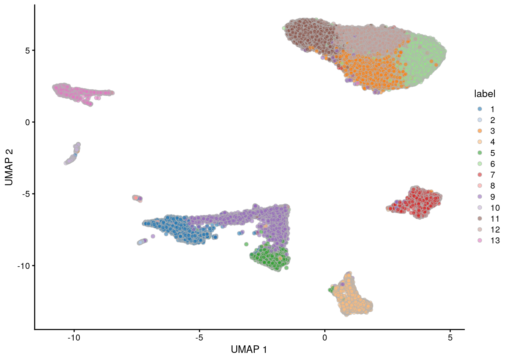

# (PART) Focus Topics {-}

<script>
document.addEventListener("click", function (event) {
    if (event.target.classList.contains("aaron-collapse")) {
        event.target.classList.toggle("active");
        var content = event.target.nextElementSibling;
        if (content.style.display === "block") {
          content.style.display = "none";
        } else {
          content.style.display = "block";
        }
    }
})
</script>

<style>
.aaron-collapse {
  background-color: #eee;
  color: #444;
  cursor: pointer;
  padding: 18px;
  width: 100%;
  border: none;
  text-align: left;
  outline: none;
  font-size: 15px;
}

.aaron-content {
  padding: 0 18px;
  display: none;
  overflow: hidden;
  background-color: #f1f1f1;
}
</style>

# Overview

## Introduction

This chapter provides an overview of the framework of a typical scRNA-seq analysis workflow, shown in the figure below. 
Subsequent chapters will describe each analysis step in more detail.


## Experimental Design

Before starting the analysis itself, some comments on experimental design may be helpful.
The most obvious question is the choice of technology, which can be roughly divided into:

- Droplet-based (10X Genomics, inDrop, Drop-seq)
- Plate-based with UMIs (CEL-seq, MARS-seq)
- Plate-based with reads (Smart-seq2)
- Other (sci-RNA-seq, seqWell)

Each of these methods have their own advantages and weaknesses that are discussed extensively elsewhere [@mereu2019benchmarking;@ziegenhain2017comparative].
In practical terms, droplet-based technologies are the current _de facto_ standard due to their throughput and low cost per cell.
Plate-based methods can capture other phenotypic information (e.g., morphology) and are more amenable to customization.
Read-based methods provide whole-transcript coverage, which is useful in some applications (e.g., splicing, exome mutations).
The choice of method is left to the reader's circumstances - we will simply note that most aspects of our analysis pipeline are technology-agnostic.

The next question is how many cells should be captured, and to what depth they should be sequenced.
The short answer is "as much as you can afford to spend".
The long answer is that it depends on the aim of the analysis.
If we are aiming to discover rare cell subpopulations, then we need more cells.
If we are aiming to characterize subtle differences, then we need more sequencing depth.
As of time of writing, an informal survey of the literature suggests that typical droplet-based experiments would capture anywhere from 10,000 to 100,000 cells, sequenced at anywhere from 1,000 to 10,000 UMIs per cell (usually in inverse proportion to the number of cells).
Droplet-based methods also have a trade-off between throughput and doublet rate that affects the true efficiency of sequencing.

For studies involving multiple samples or conditions, the design considerations are the same as those for bulk RNA-seq experiments.
There should be multiple biological replicates for each condition and conditions should not be confounded with batch.
Note that individual cells are not replicates; ratther, we are referring to samples derived from replicate donors or cultures.

## Preprocessing 

Sequencing data from scRNA-seq experiments must be converted into per-cell and per-gene expression values.
The exact procedure for doing so is usually run outside of R and tends to be technology-dependent:

* For 10X Genomics data, the `CellRanger` software suite provides a custom pipeline to obtain a count matrix.
This uses STAR to align reads to the reference genome, and then counts the number of unique UMIs mapped to each gene.
* Pseudo-alignment methods such as `alevin` can be used to obtain a count matrix from the same data with greater efficiency.
This avoids the need for explicit alignment, which reduces the compute time and memory usage.
* For other protocols, we can use the *[scPipe](https://bioconductor.org/packages/3.10/scPipe)* package, which provides a more general pipeline for processing scRNA-seq data.
This uses the *[Rsubread](https://bioconductor.org/packages/3.10/Rsubread)* aligner to align reads and then counts UMIs per gene.
* For CEL-seq or CEL-seq2 data, the *[scruff](https://bioconductor.org/packages/3.10/scruff)* package provides a dedicated pipeline for quantification.
* For read-based protocols, we can use the same pipelines for processing bulk RNA-seq data.

We import the count matrix into R and create a `SingleCellExperiment` object.
This can be done with base methods (e.g., `read.table()`) followed by applying the `SingleCellExperiment()` constructor.
Alternatively, for specific file formats, we can use dedicated methods from the *[DropletUtils](https://bioconductor.org/packages/3.10/DropletUtils)* (for 10X data) or *[tximeta](https://bioconductor.org/packages/3.10/tximeta)* packages (for pseudo-alignment methods).

## Data processing and downstream analysis

In the simplest case, the workflow has the following form:

1. We compute quality control metrics to remove low-quality cells that would interfere with downstream analyses.
These cells may have been damaged during processing or may not have been fully captured by the sequencing protocol.
Common metrics includes the total counts per cell, the proportion of spike-in or mitochondrial reads and the number of detected features.
2. We convert the counts into normalized expression values to eliminate cell-specific biases (e.g., in capture efficiency).
This allows us to perform explicit comparisons across cells in downstream steps like clustering.
We also apply a transformation, typically log, to adjust for the mean-variance relationship. 
3. We perform feature selection to pick a subset of interesting features for downstream analysis.
This is done by modelling the variance across cells for each gene and retaining genes that are highly variable.
The aim is to reduce computational overhead and noise from uninteresting genes.
4. We apply dimensionality reduction to compact the data and further reduce noise.
Principal components analysis is typically used to obtain an initial low-rank representation for more computational work,
followed by more aggressive methods like $t$-stochastic neighbor embedding for visualization purposes.
5. We cluster cells into groups according to similarities in their (normalized) expression profiles.
This aims to obtain groupings that serve as empirical proxies for distinct biological states.
We typically interpret these groupings by identifying differentially expressed marker genes between clusters.

Additional steps such as data integration and cell annotation will be discussed in their respective chapters.

## Quick start

Here, we use the a droplet-based retina dataset from @macosko2016highly, provided in the *[scRNAseq](https://bioconductor.org/packages/3.10/scRNAseq)* package.
This starts from a count matrix and finishes with clusters (Figure \@ref(fig:quick-start-umap)) in preparation for biological interpretation.
Similar workflows are available in abbreviated form in the Appendices.


```r
library(scRNAseq)
sce <- MacoskoRetinaData()

# Quality control.
library(scater)
is.mito <- grepl("^MT-", rownames(sce))
qcstats <- perCellQCMetrics(sce, subsets=list(Mito=is.mito))
filtered <- quickCellQC(qcstats, percent_subsets="subsets_Mito_percent")
sce <- sce[, !filtered$discard]

# Normalization.
sce <- logNormCounts(sce)

# Feature selection.
library(scran)
dec <- modelGeneVar(sce)
hvg <- rownames(dec)[dec$bio > 0] 

# Dimensionality reduction.
set.seed(1234)
library(BiocSingular)
sce <- runPCA(sce, subset_row=hvg, BSPARAM=IrlbaParam())
sce <- runUMAP(sce, dimred = 'PCA', external_neighbors=TRUE)

# Clustering.
g <- buildSNNGraph(sce, use.dimred = 'PCA')
sce$clusters <- factor(igraph::cluster_louvain(g)$membership)

# Visualization.
plotUMAP(sce, colour_by="clusters")
```

<div class="figure">

<p class="caption">(\#fig:quick-start-umap)UMAP plot of the retina dataset, where each point is a cell and is colored by the cluster identity.</p>
</div>

## Session Info {-}

<button class="aaron-collapse">View session info</button>
<div class="aaron-content">
```
R version 3.6.1 (2019-07-05)
Platform: x86_64-pc-linux-gnu (64-bit)
Running under: Ubuntu 14.04.5 LTS

Matrix products: default
BLAS/LAPACK: /app/easybuild/software/OpenBLAS/0.2.18-GCC-5.4.0-2.26-LAPACK-3.6.1/lib/libopenblas_prescottp-r0.2.18.so

locale:
 [1] LC_CTYPE=en_US.UTF-8       LC_NUMERIC=C              
 [3] LC_TIME=en_US.UTF-8        LC_COLLATE=C              
 [5] LC_MONETARY=en_US.UTF-8    LC_MESSAGES=en_US.UTF-8   
 [7] LC_PAPER=en_US.UTF-8       LC_NAME=C                 
 [9] LC_ADDRESS=C               LC_TELEPHONE=C            
[11] LC_MEASUREMENT=en_US.UTF-8 LC_IDENTIFICATION=C       

attached base packages:
[1] parallel  stats4    stats     graphics  grDevices utils     datasets 
[8] methods   base     

other attached packages:
 [1] BiocSingular_1.1.5          scran_1.13.16              
 [3] scater_1.13.18              ggplot2_3.2.1              
 [5] scRNAseq_1.99.2             SingleCellExperiment_1.7.7 
 [7] SummarizedExperiment_1.15.8 DelayedArray_0.11.4        
 [9] BiocParallel_1.19.2         matrixStats_0.54.0         
[11] Biobase_2.45.0              GenomicRanges_1.37.14      
[13] GenomeInfoDb_1.21.1         IRanges_2.19.14            
[15] S4Vectors_0.23.20           BiocGenerics_0.31.5        
[17] BiocStyle_2.13.2            Cairo_1.5-10               

loaded via a namespace (and not attached):
 [1] bitops_1.0-6                  bit64_0.9-7                  
 [3] httr_1.4.1                    tools_3.6.1                  
 [5] backports_1.1.4               R6_2.4.0                     
 [7] irlba_2.3.3                   vipor_0.4.5                  
 [9] uwot_0.1.3                    DBI_1.0.0                    
[11] lazyeval_0.2.2                colorspace_1.4-1             
[13] withr_2.1.2                   tidyselect_0.2.5             
[15] gridExtra_2.3                 bit_1.1-14                   
[17] curl_4.0                      compiler_3.6.1               
[19] BiocNeighbors_1.3.3           labeling_0.3                 
[21] bookdown_0.13                 scales_1.0.0                 
[23] rappdirs_0.3.1                stringr_1.4.0                
[25] digest_0.6.20                 rmarkdown_1.13               
[27] XVector_0.25.0                pkgconfig_2.0.2              
[29] htmltools_0.3.6               highr_0.8                    
[31] dbplyr_1.4.2                  limma_3.41.15                
[33] rlang_0.4.0                   RSQLite_2.1.2                
[35] shiny_1.3.2                   DelayedMatrixStats_1.7.1     
[37] dplyr_0.8.3                   RCurl_1.95-4.12              
[39] magrittr_1.5                  GenomeInfoDbData_1.2.1       
[41] Matrix_1.2-17                 Rcpp_1.0.2                   
[43] ggbeeswarm_0.6.0              munsell_0.5.0                
[45] viridis_0.5.1                 stringi_1.4.3                
[47] yaml_2.2.0                    edgeR_3.27.13                
[49] zlibbioc_1.31.0               BiocFileCache_1.9.1          
[51] AnnotationHub_2.17.7          grid_3.6.1                   
[53] blob_1.2.0                    promises_1.0.1               
[55] dqrng_0.2.1                   ExperimentHub_1.11.4         
[57] crayon_1.3.4                  lattice_0.20-38              
[59] cowplot_0.9.4                 locfit_1.5-9.1               
[61] zeallot_0.1.0                 knitr_1.24                   
[63] pillar_1.4.2                  igraph_1.2.4.1               
[65] glue_1.3.1                    evaluate_0.14                
[67] RcppParallel_4.4.3            BiocManager_1.30.4           
[69] vctrs_0.2.0                   httpuv_1.5.1                 
[71] gtable_0.3.0                  purrr_0.3.2                  
[73] assertthat_0.2.1              xfun_0.9                     
[75] rsvd_1.0.2                    mime_0.7                     
[77] xtable_1.8-4                  RSpectra_0.15-0              
[79] later_0.8.0                   viridisLite_0.3.0            
[81] tibble_2.1.3                  AnnotationDbi_1.47.1         
[83] beeswarm_0.2.3                memoise_1.1.0                
[85] statmod_1.4.32                interactiveDisplayBase_1.23.0
```
</div>

## References {-}
