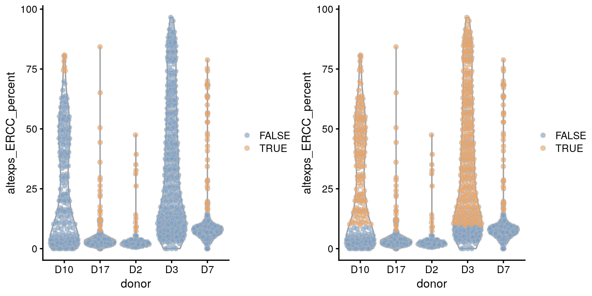
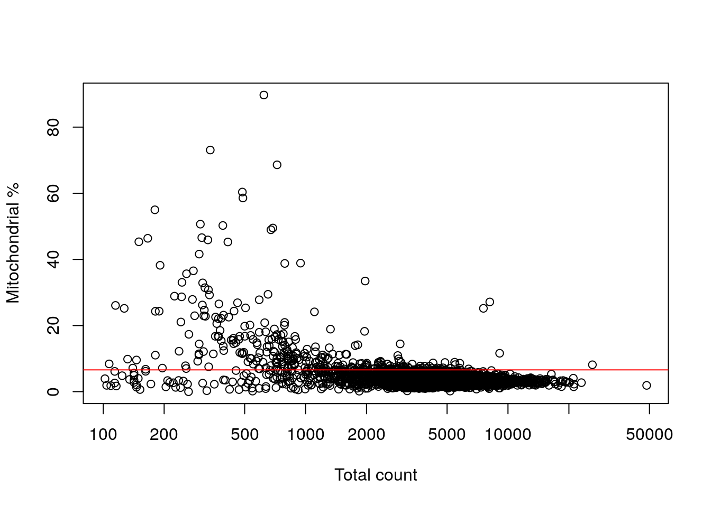

---
output:
  html_document
bibliography: ../ref.bib
---

# Quality Control

<script>
document.addEventListener("click", function (event) {
    if (event.target.classList.contains("aaron-collapse")) {
        event.target.classList.toggle("active");
        var content = event.target.nextElementSibling;
        if (content.style.display === "block") {
          content.style.display = "none";
        } else {
          content.style.display = "block";
        }
    }
})
</script>

<style>
.aaron-collapse {
  background-color: #eee;
  color: #444;
  cursor: pointer;
  padding: 18px;
  width: 100%;
  border: none;
  text-align: left;
  outline: none;
  font-size: 15px;
}

.aaron-content {
  padding: 0 18px;
  display: none;
  overflow: hidden;
  background-color: #f1f1f1;
}
</style>

## Motivation {#quality-control-motivation}

Low-quality libraries in scRNA-seq data can arise from a variety of sources such as cell damage during dissociation or failure in library preparation (e.g., inefficient reverse transcription or PCR amplification).
These usually manifest as "cells" with low total counts, few expressed genes and high mitochondrial or spike-in proportions.
These low-quality libraries are problematic as they can contribute to misleading results in downstream analyses:

- They form their own distinct cluster(s), complicating interpretation of the results.
This is most obviously driven by increased mitochondrial proportions or enrichment for nuclear RNAs after cell damage.
In the worst case, low-quality libraries generated from different cell types can cluster together based on similarities in the damage-induced expression profiles, creating artificial intermediate states or trajectories between otherwise distinct subpopulations. 
Additionally, very small libraries can form their own clusters due to shifts in the mean upon transformation [@lun2018overcoming].
- They distort the characterization of population heterogeneity during variance estimation or principal components analysis.
The first few principal components will capture differences in quality rather than biology, reducing the effectiveness of dimensionality reduction.
Similarly, genes with the largest variances will be driven by differences between low- and high-quality cells.
The most obvious example involves low-quality libraries with very low counts where scaling normalization inflates the apparent variance of genes that happen to have a non-zero count in those libraries.
- They contain genes that appear to be strongly "upregulated" due to aggressive scaling to normalize for small library sizes.
This is most problematic for contaminating transcripts (e.g., from the ambient solution) that are present in all libraries at low but constant levels.
Increased scaling in low-quality libraries transforms small counts for these transcripts in large normalized expression values, resulting in apparent upregulation compared to other cells.
This can be misleading as the affected genes are often biologically sensible but are actually expressed in another subpopulation.

To avoid - or at least mitigate - these problems, we need to remove these cells at the start of the analysis.
This step is commonly referred to as quality control (QC) on the cells.
(We will use "library" and "cell" rather interchangeably here, though the distinction will become important when dealing with droplet-based data.)
We will demonstrate using a small scRNA-seq dataset from @lun2017assessing, which is provided with no prior QC so that we can apply our own procedures.

<button class="aaron-collapse">View history</button>
<div class="aaron-content">
   
```r
#--- setup ---#
library(OSCAUtils)
chapterPreamble(use_cache = TRUE)

#--- loading ---#
library(scRNAseq)
sce.416b <- LunSpikeInData(which="416b") 
sce.416b$block <- factor(sce.416b$block)
```

</div>


```r
sce.416b
```

```
## class: SingleCellExperiment 
## dim: 46604 192 
## metadata(0):
## assays(1): counts
## rownames(46604): ENSMUSG00000102693 ENSMUSG00000064842 ...
##   ENSMUSG00000095742 CBFB-MYH11-mcherry
## rowData names(1): Length
## colnames(192): SLX-9555.N701_S502.C89V9ANXX.s_1.r_1
##   SLX-9555.N701_S503.C89V9ANXX.s_1.r_1 ...
##   SLX-11312.N712_S508.H5H5YBBXX.s_8.r_1
##   SLX-11312.N712_S517.H5H5YBBXX.s_8.r_1
## colData names(9): Source Name cell line ... spike-in addition
##   block
## reducedDimNames(0):
## spikeNames(0):
## altExpNames(2): ERCC SIRV
```

## Choice of QC metrics

We use several common QC metrics to identify low-quality cells based on their expression profiles.
These metrics are described below in terms of reads for SMART-seq2 data, but the same definitions apply to UMI data generated by other technologies like MARS-seq and droplet-based protocols.

- The library size is defined as the total sum of counts across all relevant features for each cell.
Here, we will consider the relevant features to be the endogenous genes.
Cells with small library sizes are of low quality as the RNA has been lost at some point during library preparation,
either due to cell lysis or inefficient cDNA capture and amplification.
- The number of expressed features in each cell is defined as the number of endogenous genes with non-zero counts for that cell.
Any cell with very few expressed genes is likely to be of poor quality as the diverse transcript population has not been successfully captured.
- The proportion of reads mapped to spike-in transcripts is calculated relative to the total count across all features (including spike-ins) for each cell.
As the same amount of spike-in RNA should have been added to each cell, any enrichment in spike-in counts is symptomatic of loss of endogenous RNA.
Thus, high proportions are indicative of poor-quality cells where endogenous RNA has been lost due to, e.g., partial cell lysis or RNA degradation during dissociation.
- In the absence of spike-in transcripts, the proportion of reads mapped to genes in the mitochondrial genome can be used.
High proportions are indicative of poor-quality cells [@islam2014quantitative;@ilicic2016classification], presumably because of loss of cytoplasmic RNA from perforated cells.
The reasoning is that, in the presence of modest damage, the holes in the cell membrane permit efflux of individual transcript molecules but are too small to allow mitochondria to escape, leading to a relative enrichment of mitochondrial transcripts.

For each cell, we calculate these QC metrics using the `perCellQCMetrics()` function from the *[scater](https://bioconductor.org/packages/3.10/scater)* package [@mccarthy2017scater].
The `sum` column contains the total count for each cell,
the `detected` column contains the number of detected genes,
`subsets_Mito_percent` contains the percentage of reads mapped to mitochondrial transcripts (based on Ensembl annotation)
and `altexps_ERCC_percent` contains the percentage of reads mapped to ERCC transcripts.


```r
# Identifying the mitochondrial transcripts:
library(AnnotationHub)
ens.mm.v97 <- AnnotationHub()[["AH73905"]]
location <- mapIds(ens.mm.v97, keys=rownames(sce.416b),
    keytype="GENEID", column="SEQNAME")
is.mito <- which(location=="MT")

# Computing the QC metrics.
library(scater)
df <- perCellQCMetrics(sce.416b, subsets=list(Mito=is.mito))
df
```

```
## DataFrame with 192 rows and 16 columns
##           sum  detected   percent_top_50  percent_top_100  percent_top_200
##     <integer> <integer>        <numeric>        <numeric>        <numeric>
## 1      865936      7618 26.7218362557972 32.2773276546997 39.7208338722492
## 2     1076277      7521 29.4043262097025 35.0354044544295  42.258080401235
## 3     1180138      8306 27.3453613052033 32.4769645583822 39.3295529844815
## 4     1342593      8143  35.809213961342 40.2666332984009 46.2459583805368
## 5     1668311      7154 34.1197774275899 39.0901336741171 45.6660059185607
## ...       ...       ...              ...              ...              ...
## 188    776622      8174  45.936246977294 49.7010128479492 54.6100934560185
## 189   1299950      8956 38.0829262663949 42.8929574214393 49.0621946997961
## 190   1800696      9530 30.6675307769885 35.5838520216627 41.8550382740896
## 191     46731      6649 32.2997581904945 37.9148744944469 44.5999443624147
## 192   1866692     10964 26.6632095707273 31.2583972074665 37.5607759608977
##      percent_top_500 subsets_Mito_sum subsets_Mito_detected
##            <numeric>        <integer>             <integer>
## 1   52.9037942757894            78790                    20
## 2   55.7454075484285            98613                    20
## 3   51.9336721637639           100341                    19
## 4   57.1209592184675           104882                    20
## 5   58.2004194661547           129559                    22
## ...              ...              ...                   ...
## 188 64.4249068401359            48126                    20
## 189 60.6674872110466           112225                    25
## 190 53.6780778099135           135693                    23
## 191 56.5235068798014             3505                    16
## 192 48.9489428357758           150375                    29
##     subsets_Mito_percent altexps_ERCC_sum altexps_ERCC_detected
##                <numeric>        <integer>             <integer>
## 1       9.09882485541657            65278                    39
## 2       9.16241822504801            74748                    40
## 3       8.50248021841514            60878                    42
## 4        7.8118983191481            60073                    42
## 5       7.76587818458309           136810                    44
## ...                  ...              ...                   ...
## 188     6.19683707131655            61575                    39
## 189     8.63302434709027            94982                    41
## 190      7.5355862399872           113707                    40
## 191     7.50037448374741             7580                    44
## 192     8.05569424414954            48664                    39
##     altexps_ERCC_percent altexps_SIRV_sum altexps_SIRV_detected
##                <numeric>        <integer>             <integer>
## 1       6.80658407035354            27828                     7
## 2       6.28029958040595            39173                     7
## 3       4.78949297995239            30058                     7
## 4       4.18566507433069            32542                     7
## 5       7.28887127185236            71850                     7
## ...                  ...              ...                   ...
## 188     7.17619705260214            19848                     7
## 189     6.65764326634008            31729                     7
## 190     5.81467119470586            41116                     7
## 191      13.488984589102             1883                     7
## 192     2.51930349520745            16289                     7
##     altexps_SIRV_percent     total
##                <numeric> <integer>
## 1        2.9016456005055    959042
## 2       3.29130111124368   1190198
## 3       2.36477183861837   1271074
## 4       2.26740653619545   1435208
## 5       3.82797603159559   1876971
## ...                  ...       ...
## 188     2.31316539342342    858045
## 189     2.22400416076419   1426661
## 190     2.10256203084705   1955519
## 191     3.35089155425846     56194
## 192    0.843270890872805   1931645
```

A key assumption here is that the QC metrics are independent of the biological state of each cell.
Poor values (e.g., low library sizes, high mitochondrial proportions) are presumed to be driven by technical factors rather than biological processes, meaning that the subsequent removal of cells will not misrepresent the biology in downstream analyses.
Major violations of this assumption would potentially result in the loss of cell types that have, say, systematically low RNA content or high numbers of mitochondria.
We can check for such violations using some diagnostics described in Sections \@ref(quality-control-plots) and \@ref(quality-control-discarded).

## Identifying low-quality cells

### With fixed thresholds

The simplest approach to identifying low-quality cells is to apply thresholds on the QC metrics.
For example, we might consider cells to be low quality if they have library sizes below 100,000 reads; express fewer than 5,000 genes; have spike-in proportions above 10%; or have mitochondrial proportions above 10%.


```r
qc.lib <- df$sum < 1e5
qc.nexprs <- df$detected < 5e3
qc.spike <- df$altexps_ERCC_percent > 10
qc.mito <- df$subsets_Mito_percent > 10
discard <- qc.lib | qc.nexprs | qc.spike | qc.mito

# Summarize the number of cells removed for each reason.
DataFrame(LibSize=sum(qc.lib), NExprs=sum(qc.nexprs),
    SpikeProp=sum(qc.spike), MitoProp=sum(qc.mito), Total=sum(discard))
```

```
## DataFrame with 1 row and 5 columns
##     LibSize    NExprs SpikeProp  MitoProp     Total
##   <integer> <integer> <integer> <integer> <integer>
## 1         3         0        19        14        33
```

While simple, this strategy requires considerable experience to determine appropriate thresholds for each experimental protocol and biological system.
Thresholds for read count-based data are simply not applicable for UMI-based data, and vice versa.
Differences in mitochondrial activity or total RNA content require constant adjustment of the mitochondrial and spike-in thresholds, respectively, for different biological systems.
Indeed, even with the same protocol and system, the appropriate threshold can vary from run to run due to the vagaries of cDNA capture efficiency and sequencing depth per cell.

### With adaptive thresholds {#quality-control-outlier}

#### Identifying outliers

To obtain an adaptive threshold, we assume that most of the dataset consists of high-quality cells.
We then identify cells that are outliers for the various QC metrics, based on the median absolute deviation (MAD) from the median value of each metric across all cells.
Specifically, a value is considered an outlier if it is more than 3 MADs from the median in the "problematic" direction.
This is loosely motivated by the fact that such a filter will retain 99% of non-outlier values that follow a normal distribution.

For the 416B data, we identify cells with log-transformed library sizes that are more than 3 MADs below the median. 
A log-transformation is used to improve resolution at small values when `type="lower"`.
In particular, it guarantees that the threshold is not a negative value, which would be meaningless for quality control on these metrics.
Moreover, these metrics can occasionally exhibit a heavy right tail, and the log-transformation makes the distribution seem more normal to justify the 99% rationale mentioned above.


```r
qc.lib2 <- isOutlier(df$sum, log=TRUE, type="lower")
```

We do the same for the log-transformed number of expressed genes. 


```r
qc.nexprs2 <- isOutlier(df$detected, log=TRUE, type="lower")
```

`isOutlier()` will also return the exact filter thresholds for each metric in the attributes of the output vector.
These is useful for checking whether the automatically selected thresholds are appropriate.


```r
attr(qc.lib2, "thresholds")
```

```
##  lower higher 
## 434083    Inf
```

```r
attr(qc.nexprs2, "thresholds")
```

```
##  lower higher 
##   5231    Inf
```

We identify outliers for the proportion-based metrics in a similar manner.
Here, no transformation is required as we are identifying large outliers that should already be clearly distinguishable from zero.


```r
qc.spike2 <- isOutlier(df$altexps_ERCC_percent, type="higher")
attr(qc.spike2, "thresholds")
```

```
##  lower higher 
##   -Inf  14.15
```

```r
qc.mito2 <- isOutlier(df$subsets_Mito_percent, type="higher")
attr(qc.mito2, "thresholds")
```

```
##  lower higher 
##   -Inf  11.92
```

A cell that is an outlier for any of these metrics is considered to be of low-quality and discarded.


```r
discard2 <- qc.lib2 | qc.nexprs2 | qc.spike2 | qc.mito2

# Summarize the number of cells removed for each reason.
DataFrame(LibSize=sum(qc.lib2), NExprs=sum(qc.nexprs2),
    SpikeProp=sum(qc.spike2), MitoProp=sum(qc.mito2), Total=sum(discard2))
```

```
## DataFrame with 1 row and 5 columns
##     LibSize    NExprs SpikeProp  MitoProp     Total
##   <integer> <integer> <integer> <integer> <integer>
## 1         4         0         1         2         6
```

Alternatively, this entire process can be done in a single step using the `quickPerCellQC()` function.
This is a wrapper that simply calls `isOutlier()` with the settings described above.


```r
reasons <- quickPerCellQC(df, percent_subsets=c("subsets_Mito_percent",
    "altexps_ERCC_percent"))
colSums(as.matrix(reasons))
```

```
##              low_lib_size            low_n_features 
##                         4                         0 
## high_subsets_Mito_percent high_altexps_ERCC_percent 
##                         2                         1 
##                   discard 
##                         6
```

With this strategy, the thresholds adapt to both the location and spread of the distribution of values for a given metric.
This allows the QC procedure to adjust to changes in sequencing depth, cDNA capture efficiency, mitochondrial content, etc. without requiring any user intervention or prior experience.
However, it does require some implicit assumptions that are discussed below in more detail.

#### Assumptions of outlier detection {#outlier-assumptions}

Outlier detection assumes that most cells are of acceptable quality.
This is usually reasonable and can be experimentally supported in some situations by visually checking that the cells are intact, e.g., on the microwell plate.
If most cells are of (unacceptably) low quality, the adaptive thresholds will obviously fail as they cannot remove the majority of cells.
Of course, what is acceptable or not is in the eye of the beholder - neurons, for example, are notoriously difficult to dissociate, and we would often retain cells in a neuronal scRNA-seq dataset with QC metrics that would be unacceptable in a more amenable system like embryonic stem cells.

Another assumption discussed earlier is that the QC metrics are independent of the biological state of each cell.
This assumption is most likely to be violated in highly heterogeneous cell populations where cell types that naturally have less RNA or more mitochondria are more likely to be considered outliers and removed, even if they are of high quality.
The use of the MAD mitigates this problem to some extent by accounting for biological variability in the QC metrics.
A heterogeneous population should have higher variability in the metrics among high-quality cells, increasing the MAD and reducing the chance of incorrectly removing particular cell types (at the cost of reducing power to remove low-quality cells).

In general, these assumptions are either reasonable or their violations have little effect on downstream conclusions.
Nonetheless, it is helpful to keep them in mind when interpreting the results.

#### Considering experimental factors {#qc-batch}

More complex studies may involve batches of cells generated with different experimental parameters (e.g., sequencing depth).
In such cases, the adaptive strategy should be applied to each batch separately. 
It makes little sense to compute medians and MADs from a mixture distribution containing samples from multiple batches.
For example, if the sequencing coverage is lower in one batch compared to the others, it will drag down the median and inflate the MAD.
This will reduce the suitability of the adaptive threshold for the other batches.

If each batch is represented by its own `SingleCellExperiment`, the `isOutlier()` function can be directly applied to each batch as shown above.
However, if cells from all batches have been merged into a single `SingleCellExperiment`, the `batch=` argument should be used to ensure that outliers are identified _within_ each batch.
This allows `isOutlier()` to accommodate systematic differences in the QC metrics across batches.

We will again illustrate using the 416B dataset, which contains two experimental factors - plate of origin and oncogene induction status.
We combine these factors together and use this in the `batch=` argument to `isOutlier()` via `quickPerCellQC()`.
This results in the removal of more cells as the MAD is no longer inflated by (i) systematic differences in sequencing depth between batches and (ii) differences in number of genes expressed upon oncogene induction.


```r
batch <- paste0(sce.416b$phenotype, "-", sce.416b$Plate)
batch.reasons <- quickPerCellQC(df, percent_subsets=c("subsets_Mito_percent",
    "altexps_ERCC_percent"), batch=batch)
colSums(as.matrix(batch.reasons))
```

```
##              low_lib_size            low_n_features 
##                         4                         2 
## high_subsets_Mito_percent high_altexps_ERCC_percent 
##                         2                         4 
##                   discard 
##                         7
```

That said, the use of `batch=` involves the stronger assumption that most cells in each batch are of high quality.
If an entire batch failed, outlier detection will not be able to act as an appropriate QC filter for that batch.
For example, two batches in the @grun2016denovo human pancreas dataset contain a substantial proportion of putative damaged cells with higher ERCC content than the other batches (Figure \@ref(fig:qc-plot-pancreas)).
This inflates the median and MAD within those batches, resulting in a failure to remove the assumed low-quality cells.
In such cases, it is better to either not use `batch=` or to apply a custom filter to the problematic batches (possibly based on the thresholds for the other batches in `attr(discard.ercc, "thresholds")`).


```r
library(scRNAseq)
sce.grun <- GrunPancreasData()
sce.grun <- addPerCellQC(sce.grun)
discard.ercc <- isOutlier(sce.grun$altexps_ERCC_percent,
    type="higher", batch=sce.grun$donor)
plotColData(sce.grun, x="donor", y="altexps_ERCC_percent",
    colour_by=I(discard.ercc))
```

<div class="figure">

<p class="caption">(\#fig:qc-plot-pancreas)Distribution of the proportion of ERCC transcripts in each donor of the Grun pancreas dataset. Each point represents a cell and is coloured according to whether it was identified as an outlier within each batch.</p>
</div>

### Other approaches

Another strategy is to identify outliers in high-dimensional space based on the QC metrics for each cell.
We use methods from *[robustbase](https://CRAN.R-project.org/package=robustbase)* to quantify the "outlyingness" of each cells based on their QC metrics, and then use `isOutlier()` to identify low-quality cells that exhibit unusually high levels of outlyingness.


```r
stats <- cbind(log10(df$sum), log10(df$detected),
    df$subsets_Mito_percent, df$altexps_ERCC_percent)

library(robustbase)
outlying <- adjOutlyingness(stats, only.outlyingness = TRUE)
multi.outlier <- isOutlier(outlying, type = "higher")
summary(multi.outlier)
```

```
##    Mode   FALSE    TRUE 
## logical     183       9
```

This and related approaches like PCA-based outlier detection and support vector machines can provide more power to distinguish low-quality cells from high-quality counterparts [@ilicic2016classification] as they can exploit patterns across many QC metrics. 
However, this comes at some cost to interpretability, as the reason for removing a given cell may not always be obvious.

For completeness, we note that outliers can also be identified from the gene expression profiles, rather than QC metrics.
We consider this to be a risky strategy as it can remove high-quality cells in rare populations.

## Checking diagnostic plots {#quality-control-plots}

It is good practice to inspect the distributions of QC metrics (Figure \@ref(fig:qc-dist-416b)) to identify possible problems.
In the most ideal case, we would see normal distributions that would justify the 3 MAD threshold used in outlier detection.
A large proportion of cells in another mode suggests that the QC metrics might be correlated with some biological state, potentially leading to the loss of distinct cell types during filtering.
Batches with systematically poor values for any metric can also be quickly identified for further troubleshooting or outright removal.


```r
colData(sce.416b) <- cbind(colData(sce.416b), df)
sce.416b$block <- factor(sce.416b$block)
sce.416b$phenotype <- ifelse(grepl("induced", sce.416b$phenotype),
    "induced", "wild type")
sce.416b$discard <- reasons$discard

gridExtra::grid.arrange(
    plotColData(sce.416b, x="block", y="sum", colour_by="discard",
        other_fields="phenotype") + facet_wrap(~phenotype) + 
        scale_y_log10() + ggtitle("Total count"),
    plotColData(sce.416b, x="block", y="detected", colour_by="discard", 
        other_fields="phenotype") + facet_wrap(~phenotype) + 
        scale_y_log10() + ggtitle("Detected features"),
    plotColData(sce.416b, x="block", y="subsets_Mito_percent", 
        colour_by="discard", other_fields="phenotype") + 
        facet_wrap(~phenotype) + ggtitle("Mito percent"),
    plotColData(sce.416b, x="block", y="altexps_ERCC_percent", 
        colour_by="discard", other_fields="phenotype") + 
        facet_wrap(~phenotype) + ggtitle("ERCC percent"),
    ncol=1
)
```

<div class="figure">

<p class="caption">(\#fig:qc-dist-416b)Distribution of QC metrics for each batch and phenotype in the 416B dataset. Each point represents a cell and is colored according to whether it was discarded, respectively.</p>
</div>

Another useful diagnostic involves plotting the proportion of mitochondrial counts against some of the other QC metrics.
The aim is to confirm that there are no cells with both large total counts and large mitochondrial counts, to ensure that we are not inadvertently removing high-quality cells that happen to be highly metabolically active (e.g., hepatocytes).
In this case, we do not observe any points in the top-right corner in Figure \@ref(fig:qc-mito-416b).


```r
plotColData(sce.416b, x="sum", y="subsets_Mito_percent", 
    colour_by="discard", other_fields=c("block", "phenotype")) +
    facet_grid(block~phenotype) +
    theme(panel.border = element_rect(color = "grey"))
```

<div class="figure">

<p class="caption">(\#fig:qc-mito-416b)Percentage of reads assigned to mitochondrial transcripts, plotted against the library size for each phenotype and batch.</p>
</div>

Comparison of the ERCC and mitochondrial percentages can also be informative (Figure \@ref(fig:qc-mito2-416b)).
Low-quality cells with small mitochondrial percentages, large spike-in percentages and small library sizes are likely to be stripped nuclei, i.e., they have been so extensively damaged that they have lost all cytoplasmic content.
Conversely, cells with high mitochondrial percentages and low ERCC percentages may represent undamaged cells that are metabolically active. 


```r
plotColData(sce.416b, x="altexps_ERCC_percent", y="subsets_Mito_percent",
    colour_by="discard", other_fields=c("block", "phenotype")) +
    facet_grid(block~phenotype) + 
    theme(panel.border = element_rect(color = "grey"))
```

<div class="figure">

<p class="caption">(\#fig:qc-mito2-416b)Percentage of reads assigned to mitochondrial transcripts, plotted against the percentage of reads assigned to ERCC transcripts for each phenotype and batch.</p>
</div>

## Cell calling for droplet data {#qc-droplets}

### Background

An unique aspect of droplet-based data is that we have no prior knowledge about whether a particular library (i.e., cell barcode) corresponds to cell-containing or empty droplets.
Thus, we need to call cells from empty droplets based on the observed expression profiles.
This is not entirely straightforward as empty droplets can contain ambient (i.e., extracellular) RNA that can be captured and sequenced, resulting in non-zero counts for libraries that do not contain any cell.
To demonstrate, we obtain the **unfiltered** count matrix for the PBMC dataset from 10X Genomics.


```r
library(BiocFileCache)
bfc <- BiocFileCache("raw_data", ask = FALSE)
raw.path <- bfcrpath(bfc, file.path("http://cf.10xgenomics.com/samples",
    "cell-exp/2.1.0/pbmc4k/pbmc4k_raw_gene_bc_matrices.tar.gz"))
untar(raw.path, exdir=file.path(tempdir(), "pbmc4k"))

library(DropletUtils)
library(Matrix)
fname <- file.path(tempdir(), "pbmc4k/raw_gene_bc_matrices/GRCh38")
sce.pbmc <- read10xCounts(fname, col.names=TRUE)
sce.pbmc
```

```
## class: SingleCellExperiment 
## dim: 33694 737280 
## metadata(1): Samples
## assays(1): counts
## rownames(33694): ENSG00000243485 ENSG00000237613 ...
##   ENSG00000277475 ENSG00000268674
## rowData names(2): ID Symbol
## colnames(737280): AAACCTGAGAAACCAT-1 AAACCTGAGAAACCGC-1 ...
##   TTTGTCATCTTTAGTC-1 TTTGTCATCTTTCCTC-1
## colData names(2): Sample Barcode
## reducedDimNames(0):
## spikeNames(0):
## altExpNames(0):
```

The distribution of total counts exhibits a sharp transition between barcodes with large and small total counts (Figure \@ref(fig:rankplot)), probably corresponding to cell-containing and empty droplets respectively.
A simple approach would be to apply a threshold on the total count to only retain those barcodes with large totals.
However, this unnecessarily discards libraries derived from cell types with low RNA content.


```r
bcrank <- barcodeRanks(counts(sce.pbmc))

# Only showing unique points for plotting speed.
uniq <- !duplicated(bcrank$rank)
plot(bcrank$rank[uniq], bcrank$total[uniq], log="xy",
    xlab="Rank", ylab="Total UMI count", cex.lab=1.2)

abline(h=metadata(bcrank)$inflection, col="darkgreen", lty=2)
abline(h=metadata(bcrank)$knee, col="dodgerblue", lty=2)

legend("bottomleft", legend=c("Inflection", "Knee"), 
        col=c("darkgreen", "dodgerblue"), lty=2, cex=1.2)
```

<div class="figure">

<p class="caption">(\#fig:rankplot)Total UMI count for each barcode in the PBMC dataset, plotted against its rank (in decreasing order of total counts). The inferred locations of the inflection and knee points are also shown.</p>
</div>

### Testing for empty droplets

We use the `emptyDrops()` function to test whether the expression profile for each cell barcode is significantly different from the ambient RNA pool [@lun2018distinguishing].
Any significant deviation indicates that the barcode corresponds to a cell-containing droplet.
This allows us to discriminate between well-sequenced empty droplets and droplets derived from cells with little RNA, both of which would have similar total counts in Figure \@ref(fig:rankplot).
We call cells at a false discovery rate (FDR) of 0.1%, meaning that no more than 0.1% of our called barcodes should be empty droplets on average.


```r
# emptyDrops performs Monte Carlo simulations to compute p-values,
# so we need to set the seed to obtain reproducible results.
set.seed(100)
e.out <- emptyDrops(counts(sce.pbmc))

# See ?emptyDrops for an explanation of why there are NA values.
summary(e.out$FDR <= 0.001)
```

```
##    Mode   FALSE    TRUE    NA's 
## logical    1056    4233  731991
```

`emptyDrops()` uses Monte Carlo simulations to compute $p$-values for the multinomial sampling transcripts from the ambient pool.
The number of Monte Carlo iterations determines the lower bound for the $p$-values [@phipson2010permutation].
The `Limited` field in the output indicates whether or not the computed $p$-value for a particular barcode is bounded by the number of iterations.
If any non-significant barcodes are `TRUE` for `Limited`, we may need to increase the number of iterations.
A larger number of iterations will result in a lower $p$-value for these barcodes, which may allow them to be detected after correcting for multiple testing.


```r
table(Sig=e.out$FDR <= 0.001, Limited=e.out$Limited)
```

```
##        Limited
## Sig     FALSE TRUE
##   FALSE  1056    0
##   TRUE   1661 2572
```

As mentioned above, `emptyDrops()` assumes that barcodes with low total UMI counts are empty droplets.
Thus, the null hypothesis should be true for all of these barcodes. 
We can check whether the hypothesis testing procedure holds its size by examining the distribution of $p$-values for low-total barcodes with `test.ambient=TRUE`.
Ideally, the distribution should be close to uniform (Figure \@ref(fig:ambientpvalhist)).
Large peaks near zero indicate that barcodes with total counts below `lower` are not all ambient in origin.
This can be resolved by decreasing `lower` further to ensure that barcodes corresponding to droplets with very small cells are not used to estimate the ambient profile.


```r
set.seed(100)
limit <- 100   
all.out <- emptyDrops(counts(sce.pbmc), lower=limit, test.ambient=TRUE)
hist(all.out$PValue[all.out$Total <= limit & all.out$Total > 0],
    xlab="P-value", main="", col="grey80") 
```

<div class="figure">

<p class="caption">(\#fig:ambientpvalhist)Distribution of $p$-values for the assumed empty droplets.</p>
</div>

Once we are satisfied with the performance of `emptyDrops()`, we subset our `SingleCellExperiment` object to retain only the detected cells.
Discerning readers will notice the use of `which()`, which conveniently removes the `NA`s prior to the subsetting.
 

```r
sce.pbmc <- sce.pbmc[,which(e.out$FDR <= 0.001)]
```

It is worth pointing out that, at this point, we do not attempt to remove the ambient contamination from each library.
Accurate quantification of the contamination rate in each cell is difficult as it generally requires some prior biological knowledge about genes that are expected to have mutually exclusive expression profiles _and_ are highly abundant in the ambient solution [@young2018soupx].
Fortunately, ambient contamination usually has little effect on the downstream conclusions for routine analyses; cell type identities are usually easy enough to determine from the affected genes, notwithstanding a (mostly harmless) low background level of expression for marker genes that should be unique to a cell type.
However, more susceptible analyses may require specific remedies like those discussed in Section \@ref(ambient-problems).

### Relationship with other QC metrics

While `emptyDrops()` will distinguish cells from empty droplets, it makes no statement about the quality of the cells.
It is entirely possible for droplets to contain damaged or dying cells, which need to be removed prior to downstream analysis.
This is achieved using the same outlier-based strategy described in Section \@ref(quality-control-outlier).
Filtering on the mitochondrial proportion provides the most additional benefit in this situation, provided that we check that we are not removing a subpopulation of metabolically active cells (Figure \@ref(fig:qc-mito-pbmc)). 


```r
is.mito <- grep("^MT-", rowData(sce.pbmc)$Symbol)
pbmc.qc <- perCellQCMetrics(sce.pbmc, subsets=list(MT=is.mito))
discard.mito <- isOutlier(pbmc.qc$subsets_MT_percent, type="higher")
summary(discard.mito)
```

```
##    Mode   FALSE    TRUE 
## logical    3922     311
```

```r
plot(pbmc.qc$sum, pbmc.qc$subsets_MT_percent, log="x",
    xlab="Total count", ylab='Mitochondrial %')
abline(h=attr(discard.mito, "thresholds")["higher"], col="red")
```

<div class="figure">

<p class="caption">(\#fig:qc-mito-pbmc)Percentage of reads assigned to mitochondrial transcripts, plotted against the library size. The red line represents the upper threshold used for QC filtering.</p>
</div>

`emptyDrops()` already removes cells with very low library sizes or (by association) low numbers of expressed genes.
Thus, further filtering on these metrics is not strictly necessary.
It may still be desirable to filter on both of these metrics to remove non-empty droplets containing cell fragments or stripped nuclei that were not caught by the mitochondrial filter.
However, this should be weighed against the risk of losing genuine cell types as discussed in Section \@ref(outlier-assumptions).

Note that _CellRanger_ version 3 automatically performs cell calling using an algorithm similar to `emptyDrops()`.
If we had started our analysis with the **filtered** count matrix, we could go straight to computing other QC metrics.
We would not need to run `emptyDrops()` manually as shown here, and indeed, attempting to do so would lead to nonsensical results if not outright software errors.
Nonetheless, it may still be desirable to load the **unfiltered** matrix and apply `emptyDrops()` ourselves, on occasions where more detailed inspection or control of the cell-calling statistics is desired.

## Removing low-quality cells

Once low-quality cells have been identified, we can choose to either remove them or mark them.
Removal is the most straightforward option and is achieved by subsetting the `SingleCellExperiment` by column.
In this case, we use the low-quality calls from Section \@ref(qc-batch) to generate a subsetted `SingleCellExperiment` that we would use for downstream analyses.


```r
# Keeping the columns we DON'T want to discard.
filtered <- sce.416b[,!reasons$discard]
```

The biggest practical concern during QC is whether an entire cell type is inadvertently discarded.
There is always some risk of this occurring as the QC metrics are never fully independent of biological state.
We can diagnose cell type loss by looking for systematic differences in gene expression between the discarded and retained cells.
To demonstrate, we compute the average count across the discarded and retained pools in the 416B data set, and we compute the log-fold change between the pool averages.


```r
# Using the 'discard' vector for demonstration, 
# as it has more cells for stable calculation of 'lost'.
lost <- calculateAverage(counts(sce.416b)[,!discard])
kept <- calculateAverage(counts(sce.416b)[,discard])

library(edgeR)
logged <- cpm(cbind(lost, kept), log=TRUE, prior.count=2)
logFC <- logged[,1] - logged[,2]
abundance <- rowMeans(logged)
```

If the discarded pool is enriched for a certain cell type, we should observe increased expression of the corresponding marker genes.
No systematic upregulation of genes is apparent in the discarded pool in Figure \@ref(fig:discardplot416b), suggesting that the QC step did not inadvertently filter out a cell type in the 416B dataset.


```r
plot(abundance, logFC, xlab="Average count", ylab="Log-FC (lost/kept)", pch=16)
points(abundance[is.mito], logFC[is.mito], col="dodgerblue", pch=16)
```

<div class="figure">

<p class="caption">(\#fig:discardplot416b)Log-fold change in expression in the discarded cells compared to the retained cells in the 416B dataset. Each point represents a gene with mitochondrial transcripts in blue.</p>
</div>

For comparison, let's pretend that we applied a fixed threshold on the library size to filter cells in the PBMC data set.
Specifically, we remove all libraries with a library size below 500.


```r
alt.discard <- colSums(counts(sce.pbmc)) < 500
lost <- calculateAverage(counts(sce.pbmc)[,alt.discard])
kept <- calculateAverage(counts(sce.pbmc)[,!alt.discard])

logged <- edgeR::cpm(cbind(lost, kept), log=TRUE, prior.count=2)
logFC <- logged[,1] - logged[,2]
abundance <- rowMeans(logged)
```

The presence of a distinct population in the discarded pool manifests in Figure \@ref(fig:discardplotpbmc) as a set of genes that are strongly upregulated in `lost`.
This includes _PF4_, _PPBP_ and _CAVIN2_, which (spoiler alert!) indicates that there is a platelet population that has been discarded by `alt.discard`.


```r
plot(abundance, logFC, xlab="Average count", ylab="Log-FC (lost/kept)", pch=16)
platelet <- c("PF4", "PPBP", "CAVIN2")

library(org.Hs.eg.db)
ids <- mapIds(org.Hs.eg.db, keys=platelet, column="ENSEMBL", keytype="SYMBOL")
points(abundance[ids], logFC[ids], col="orange", pch=16)
```

<div class="figure">

<p class="caption">(\#fig:discardplotpbmc)Average counts across all discarded and retained cells in the PBMC dataset, after using a more stringent filter on the total UMI count. Each point represents a gene, with platelet-related genes highlighted in orange.</p>
</div>

If we suspect that cell types have been incorrectly discarded by our QC procedure, the most direct solution is to relax the QC filters for metrics that are associated with genuine biological differences.
For example, outlier detection can be relaxed by increasing `nmads=` in the `isOutlier()` calls.
Of course, this increases the risk of retaining more low-quality cells and encountering the problems discussed in Section \@ref(quality-control-motivation).
The logical endpoint of this line of reasoning is to avoid filtering altogether, as discussed in Section \@ref(marking-qc).

As an aside, it is worth mentioning that the true technical quality of a cell may also be correlated with its type.
(This differs from a correlation between the cell type and the QC metrics, as the latter are our imperfect proxies for quality.)
This can arise if some cell types are not amenable to dissociation or microfluidics handling during the scRNA-seq protocol.
In such cases, it is possible to "correctly" discard an entire cell type during QC if all of its cells are damaged.
Indeed, concerns over the computational removal of cell types during QC are probably minor compared to losses in the experimental protocol.

## Marking low-quality cells {#marking-qc}

The other option is to simply mark the low-quality cells as such and retain them in the downstream analysis.
The aim here is to allow clusters of low-quality cells to form, and then to identify and ignore such clusters during interpretation of the results.
This approach avoids discarding cell types that have poor values for the QC metrics, giving users an opportunity to decide whether a cluster of such cells represents a genuine biological state.


```r
marked <- sce.416b
marked$discard <- batch.reasons$discard
```

The downside is that it shifts the burden of QC to the interpretation of the clusters, which is already the bottleneck in scRNA-seq data analysis (Chapters \@ref(clustering), \@ref(marker-detection) and \@ref(cell-type-annotation)).
Indeed, if we do not trust the QC metrics, we would have to distinguish between genuine cell types and low-quality cells based only on marker genes, and this is not always easy due to the tendency of the latter to "express" interesting genes (Section \@ref(quality-control-motivation)).
Retention of low-quality cells also compromises the accuracy of the variance modelling, requiring, e.g., use of more PCs to offset the fact that the early PCs are driven by differences between low-quality and other cells.

For routine analyses, we suggest performing removal by default to avoid complications from low-quality cells.
This allows most of the population structure to be characterized with no - or, at least, fewer - concerns about its validity.
Once the initial analysis is done, and if there are any concerns about discarded cell types (Section \@ref(quality-control-discarded)), a more thorough re-analysis can be performed where the low-quality cells are only marked.
This recovers cell types with low RNA content, high mitochondrial proportions, etc. that only need to be interpreted insofar as they "fill the gaps" in the initial analysis.

## Session Info {-}

<button class="aaron-collapse">View session info</button>
<div class="aaron-content">
```
R version 3.6.1 (2019-07-05)
Platform: x86_64-pc-linux-gnu (64-bit)
Running under: Ubuntu 14.04.5 LTS

Matrix products: default
BLAS:   /home/ramezqui/Rbuild/danbuild/R-3.6.1/lib/libRblas.so
LAPACK: /home/ramezqui/Rbuild/danbuild/R-3.6.1/lib/libRlapack.so

locale:
 [1] LC_CTYPE=en_US.UTF-8       LC_NUMERIC=C              
 [3] LC_TIME=en_US.UTF-8        LC_COLLATE=C              
 [5] LC_MONETARY=en_US.UTF-8    LC_MESSAGES=en_US.UTF-8   
 [7] LC_PAPER=en_US.UTF-8       LC_NAME=C                 
 [9] LC_ADDRESS=C               LC_TELEPHONE=C            
[11] LC_MEASUREMENT=en_US.UTF-8 LC_IDENTIFICATION=C       

attached base packages:
[1] parallel  stats4    stats     graphics  grDevices utils     datasets 
[8] methods   base     

other attached packages:
 [1] org.Hs.eg.db_3.10.0         edgeR_3.28.0               
 [3] limma_3.42.0                Matrix_1.2-17              
 [5] DropletUtils_1.6.1          robustbase_0.93-5          
 [7] scRNAseq_1.99.8             scater_1.14.0              
 [9] ggplot2_3.2.1               ensembldb_2.10.0           
[11] AnnotationFilter_1.10.0     GenomicFeatures_1.38.0     
[13] AnnotationDbi_1.48.0        AnnotationHub_2.18.0       
[15] BiocFileCache_1.10.0        dbplyr_1.4.2               
[17] SingleCellExperiment_1.8.0  SummarizedExperiment_1.16.0
[19] DelayedArray_0.12.0         BiocParallel_1.20.0        
[21] matrixStats_0.55.0          Biobase_2.46.0             
[23] GenomicRanges_1.38.0        GenomeInfoDb_1.22.0        
[25] IRanges_2.20.0              S4Vectors_0.24.0           
[27] BiocGenerics_0.32.0         Cairo_1.5-10               
[29] BiocStyle_2.14.0            OSCAUtils_0.0.1            

loaded via a namespace (and not attached):
 [1] ggbeeswarm_0.6.0              colorspace_1.4-1             
 [3] XVector_0.26.0                BiocNeighbors_1.4.0          
 [5] bit64_0.9-7                   interactiveDisplayBase_1.24.0
 [7] R.methodsS3_1.7.1             knitr_1.25                   
 [9] zeallot_0.1.0                 Rsamtools_2.2.0              
[11] R.oo_1.22.0                   HDF5Array_1.14.0             
[13] shiny_1.4.0                   BiocManager_1.30.9           
[15] compiler_3.6.1                httr_1.4.1                   
[17] dqrng_0.2.1                   backports_1.1.5              
[19] assertthat_0.2.1              fastmap_1.0.1                
[21] lazyeval_0.2.2                later_1.0.0                  
[23] BiocSingular_1.2.0            htmltools_0.4.0              
[25] prettyunits_1.0.2             tools_3.6.1                  
[27] rsvd_1.0.2                    gtable_0.3.0                 
[29] glue_1.3.1                    GenomeInfoDbData_1.2.2       
[31] reshape2_1.4.3                dplyr_0.8.3                  
[33] rappdirs_0.3.1                Rcpp_1.0.2                   
[35] vctrs_0.2.0                   Biostrings_2.54.0            
[37] ExperimentHub_1.12.0          rtracklayer_1.46.0           
[39] DelayedMatrixStats_1.8.0      xfun_0.10                    
[41] stringr_1.4.0                 mime_0.7                     
[43] irlba_2.3.3                   XML_3.98-1.20                
[45] DEoptimR_1.0-8                zlibbioc_1.32.0              
[47] scales_1.0.0                  hms_0.5.2                    
[49] promises_1.1.0                ProtGenerics_1.18.0          
[51] rhdf5_2.30.0                  yaml_2.2.0                   
[53] curl_4.2                      memoise_1.1.0                
[55] gridExtra_2.3                 biomaRt_2.42.0               
[57] stringi_1.4.3                 RSQLite_2.1.2                
[59] BiocVersion_3.10.1            highr_0.8                    
[61] rlang_0.4.1                   pkgconfig_2.0.3              
[63] bitops_1.0-6                  evaluate_0.14                
[65] lattice_0.20-38               Rhdf5lib_1.8.0               
[67] purrr_0.3.3                   GenomicAlignments_1.22.0     
[69] labeling_0.3                  cowplot_1.0.0                
[71] bit_1.1-14                    tidyselect_0.2.5             
[73] plyr_1.8.4                    magrittr_1.5                 
[75] bookdown_0.14                 R6_2.4.0                     
[77] DBI_1.0.0                     pillar_1.4.2                 
[79] withr_2.1.2                   RCurl_1.95-4.12              
[81] tibble_2.1.3                  crayon_1.3.4                 
[83] rmarkdown_1.16                viridis_0.5.1                
[85] progress_1.2.2                locfit_1.5-9.1               
[87] grid_3.6.1                    blob_1.2.0                   
[89] digest_0.6.22                 xtable_1.8-4                 
[91] httpuv_1.5.2                  R.utils_2.9.0                
[93] openssl_1.4.1                 munsell_0.5.0                
[95] beeswarm_0.2.3                viridisLite_0.3.0            
[97] vipor_0.4.5                   askpass_1.1                  
```
</div>
