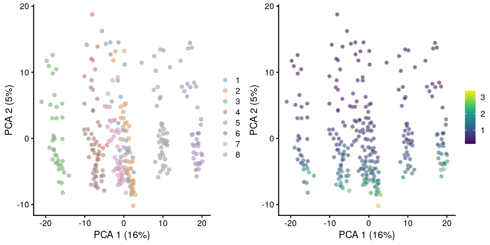

---
output:
  html_document
bibliography: ../ref.bib
---

# Normalization 

<script>
document.addEventListener("click", function (event) {
    if (event.target.classList.contains("aaron-collapse")) {
        event.target.classList.toggle("active");
        var content = event.target.nextElementSibling;
        if (content.style.display === "block") {
          content.style.display = "none";
        } else {
          content.style.display = "block";
        }
    }
})
</script>

<style>
.aaron-collapse {
  background-color: #eee;
  color: #444;
  cursor: pointer;
  padding: 18px;
  width: 100%;
  border: none;
  text-align: left;
  outline: none;
  font-size: 15px;
}

.aaron-content {
  padding: 0 18px;
  display: none;
  overflow: hidden;
  background-color: #f1f1f1;
}
</style>

## Motivation

Systematic differences in sequencing coverage between libraries are often observed in single-cell RNA sequencing data [@stegle2015computational].
They typically arise from technical differences in cDNA capture or PCR amplification efficiency across cells, attributable to the difficulty of achieving consistent library preparation with minimal starting material.
Normalization aims to remove these differences such that they do not interfere with comparisons of the expression profiles between cells.
This ensures that any observed heterogeneity or differential expression within the cell population are driven by biology and not technical biases.

At this point, it is worth noting the difference between normalization and batch correction (Chapter \@ref(data-integration)).
Normalization occurs regardless of the batch structure and only considers technical biases, while batch correction - as the name suggests - only occurs across batches and must consider both technical biases and biological differences.
Technical biases tend to affect genes in a similar manner, or at least in a manner related to their biophysical properties (e.g., length, GC content), while biological differences between batches can be highly unpredictable.
As such, these two tasks involve different assumptions and generally involve different computational methods (though some packages aim to perform both steps at once, e.g., *[zinbwave](https://bioconductor.org/packages/3.11/zinbwave)*).
Thus, it is important to avoid conflating "normalized" and "batch-corrected" data, as these usually refer to different things.

We will mostly focus our attention on scaling normalization, which is the simplest and most commonly used class of normalization strategies. 
This involves dividing all counts for each cell by a cell-specific scaling factor, often called a "size factor" [@anders2010differential].
The assumption here is that any cell-specific bias (e.g., in capture or amplification efficiency) affects all genes equally via scaling of the expected mean count for that cell.
The size factor for each cell represents the estimate of the relative bias in that cell, so division of its counts by its size factor should remove that bias.
The resulting "normalized expression values" can then be used for downstream analyses such as clustering and dimensionality reduction.
To demonstrate, we will use the @zeisel2015brain dataset from the *[scRNAseq](https://bioconductor.org/packages/3.11/scRNAseq)* package.

<button class="aaron-collapse">View history</button>
<div class="aaron-content">
   
```r
#--- setup ---#
library(OSCAUtils)
chapterPreamble(use_cache = TRUE)

#--- loading ---#
library(scRNAseq)
sce.zeisel <- ZeiselBrainData()
sce.zeisel <- sce.zeisel[rowData(sce.zeisel)$featureType!="repeat",]

library(scater)
sce.zeisel <- aggregateAcrossFeatures(sce.zeisel, 
    id=sub("_loc[0-9]+$", "", rownames(sce.zeisel)))

#--- gene-annotation ---#
library(org.Mm.eg.db)
ensembl <- mapIds(org.Mm.eg.db, keys=rownames(sce.zeisel), 
    keytype="SYMBOL", column="ENSEMBL")
rowData(sce.zeisel)$ENSEMBL <- ensembl

#--- quality-control ---#
stats <- perCellQCMetrics(sce.zeisel, subsets=list(
    Mt=rowData(sce.zeisel)$featureType=="mito"))
qc <- quickPerCellQC(stats, percent_subsets=c("altexps_ERCC_percent", 
    "subsets_Mt_percent"))
sce.zeisel <- sce.zeisel[,!qc$discard]
```

</div>


```r
sce.zeisel 
```

```
## class: SingleCellExperiment 
## dim: 19839 2816 
## metadata(0):
## assays(1): counts
## rownames(19839): 0610005C13Rik 0610007N19Rik ... mt-Tw mt-Ty
## rowData names(2): featureType ENSEMBL
## colnames(2816): 1772071015_C02 1772071017_G12 ... 1772063068_D01 1772066098_A12
## colData names(10): tissue group # ... level1class level2class
## reducedDimNames(0):
## spikeNames(0):
## altExpNames(2): ERCC repeat
```

## Library size normalization

Library size normalization is the simplest strategy for performing scaling normalization.
We define the library size as the total sum of counts across all genes for each cell, the expected value of which is assumed to scale with any cell-specific biases.
The "library size factor" for each cell is then directly proportional to its library size where the proportionality constant is defined such that the mean size factor across all cells is equal to 1.
This definition ensures that the normalized expression values are on the same scale as the original counts, which is useful for interpretation - especially when dealing with transformed data (see Section \@ref(normalization-transformation)).


```r
library(scater)
lib.sf.zeisel <- librarySizeFactors(sce.zeisel)
summary(lib.sf.zeisel)
```

```
##    Min. 1st Qu.  Median    Mean 3rd Qu.    Max. 
##   0.176   0.568   0.868   1.000   1.278   4.084
```

In the Zeisel brain data, the library size factors differ by up to 10-fold across cells (Figure \@ref(fig:histlib)).
This is typical of the variability in coverage in scRNA-seq data. 


```r
hist(log10(lib.sf.zeisel), xlab="Log10[Size factor]", col='grey80')
```

<div class="figure">

<p class="caption">(\#fig:histlib)Distribution of size factors derived from the library size in the Zeisel brain dataset.</p>
</div>

Strictly speaking, the use of library size factors assumes that there is no "imbalance" in the differentially expressed (DE) genes between any pair of cells.
That is, any upregulation for a subset of genes is cancelled out by the same magnitude of downregulation in a different subset of genes.
This ensures that the library size is an unbiased estimate of the relative cell-specific bias by avoiding composition effects [@robinson2010scaling].
However, balanced DE is not generally present in scRNA-seq applications, which means that library size normalization may not yield accurate normalized expression values for downstream analyses.

In practice, normalization accuracy is not a major consideration for exploratory scRNA-seq data analyses.
Composition biases do not usually affect the separation of clusters, only the magnitude - and to a lesser extent, direction - of the log-fold changes between clusters or cell types.
As such, library size normalization is usually sufficient in many applications where the aim is to identify clusters and the top markers that define each cluster.

## Normalization by deconvolution

As previously mentioned, composition biases will be present when any unbalanced differential expression exists between samples.
Consider the simple example of two cells where a single gene $X$ is upregulated in one cell $A$ compared to the other cell $B$.
This upregulation means that either (i) more sequencing resources are devoted to $X$ in $A$, thus decreasing coverage of all other non-DE genes when the total library size of each cell is experimentally fixed (e.g., due to library quantification);
or (ii) the library size of $A$ increases when $X$ is assigned more reads or UMIs, increasing the library size factor and yielding smaller normalized expression values for all non-DE genes.
In both cases, the net effect is that non-DE genes in $A$ will incorrectly appear to be downregulated compared to $B$.

The removal of composition biases is a well-studied problem for bulk RNA sequencing data analysis.
Normalization can be performed with the `estimateSizeFactorsFromMatrix()` function in the *[DESeq2](https://bioconductor.org/packages/3.11/DESeq2)* package [@anders2010differential;@love2014moderated] or with the `calcNormFactors()` function [@robinson2010scaling] in the *[edgeR](https://bioconductor.org/packages/3.11/edgeR)* package.
These assume that most genes are not DE between cells.
Any systematic difference in count size across the non-DE majority of genes between two cells is assumed to represent bias that is used to compute an appropriate size factor for its removal.

However, single-cell data can be problematic for these bulk normalization methods due to the dominance of low and zero counts.
To overcome this, we pool counts from many cells to increase the size of the counts for accurate size factor estimation [@lun2016pooling].
Pool-based size factors are then "deconvolved" into cell-based factors for normalization of each cell's expression profile.
This is performed using the `calculateSumFactors()` function from *[scran](https://bioconductor.org/packages/3.11/scran)*, as shown below.


```r
library(scran)
set.seed(100)
clust.zeisel <- quickCluster(sce.zeisel) 
table(clust.zeisel)
```

```
## clust.zeisel
##   1   2   3   4   5   6   7   8   9  10  11  12  13  14 
## 170 254 441 178 393 148 219 240 189 123 112 103 135 111
```

```r
deconv.sf.zeisel <- calculateSumFactors(sce.zeisel, cluster=clust.zeisel)
summary(deconv.sf.zeisel)
```

```
##    Min. 1st Qu.  Median    Mean 3rd Qu.    Max. 
##   0.119   0.486   0.831   1.000   1.321   4.509
```

We use a pre-clustering step with `quickCluster()` where cells in each cluster are normalized separately and the size factors are rescaled to be comparable across clusters.
This avoids the assumption that most genes are non-DE across the entire population - only a non-DE majority is required between pairs of clusters, which is a weaker assumption for highly heterogeneous populations.
By default, `quickCluster()` will use an approximate algorithm for PCA based on methods from the *[irlba](https://CRAN.R-project.org/package=irlba)* package.
The approximation relies on stochastic initialization so we need to set the random seed (via `set.seed()`) for reproducibility.

We see that the deconvolution size factors exhibit cell type-specific deviations from the library size factors in Figure \@ref(fig:deconv-zeisel).
This is consistent with the presence of composition biases that are introduced by strong differential expression between cell types.
Use of the deconvolution size factors adjusts for these biases to improve normalization accuracy for downstream applications.


```r
plot(lib.sf.zeisel, deconv.sf.zeisel, xlab="Library size factor",
    ylab="Deconvolution size factor", log='xy', pch=16,
    col=as.integer(factor(sce.zeisel$level1class)))
abline(a=0, b=1, col="red")
```

<div class="figure">

<p class="caption">(\#fig:deconv-zeisel)Deconvolution size factor for each cell in the Zeisel brain dataset, compared to the equivalent size factor derived from the library size. The red line corresponds to identity between the two size factors.</p>
</div>

Accurate normalization is most important for procedures that involve estimation and interpretation of per-gene statistics.
For example, composition biases can compromise DE analyses by systematically shifting the log-fold changes in one direction or another.
However, it tends to provide less benefit over simple library size normalization for cell-based analyses such as clustering.
The presence of composition biases already implies strong differences in expression profiles, so changing the normalization strategy is unlikely to affect the outcome of a clustering procedure.

## Normalization by spike-ins {#spike-norm}

Spike-in normalization is based on the assumption that the same amount of spike-in RNA was added to each cell [@lun2017assessing].
Systematic differences in the coverage of the spike-in transcripts can only be due to cell-specific biases, e.g., in capture efficiency or sequencing depth.
To remove these biases, we equalize spike-in coverage across cells by scaling with "spike-in size factors".
Compared to the previous methods, spike-in normalization requires no assumption about the biology of the system (i.e., the absence of many DE genes).
Instead, it assumes that the spike-in transcripts were (i) added at a constant level to each cell, and (ii) respond to biases in the same relative manner as endogenous genes.

Practically, spike-in normalization should be used if differences in the total RNA content of individual cells are of interest and must be preserved in downstream analyses.
For a given cell, an increase in its overall amount of endogenous RNA will not increase its spike-in size factor.
This ensures that the effects of total RNA content on expression across the population will not be removed upon scaling.
By comparison, the other normalization methods described above will simply interpret any change in total RNA content as part of the bias and remove it.

We demonstrate the use of spike-in normalization on a different dataset involving T cell activation after stimulation with T cell recepter ligands of varying affinity [@richard2018tcell].


```r
library(scRNAseq)
sce.richard <- RichardTCellData()
sce.richard <- sce.richard[,sce.richard$`single cell quality`=="OK"]
sce.richard
```

```
## class: SingleCellExperiment 
## dim: 46603 528 
## metadata(0):
## assays(1): counts
## rownames(46603): ENSMUSG00000102693 ENSMUSG00000064842 ... ENSMUSG00000096730
##   ENSMUSG00000095742
## rowData names(0):
## colnames(528): SLX-12611.N701_S502. SLX-12611.N702_S502. ... SLX-12612.i712_i522.
##   SLX-12612.i714_i522.
## colData names(13): age individual ... stimulus time
## reducedDimNames(0):
## spikeNames(0):
## altExpNames(1): ERCC
```

We apply the `computeSpikeFactors()` method to estimate spike-in size factors for all cells.
This is defined by converting the total spike-in count per cell into a size factor, using the same reasoning as in `librarySizeFactors()`.
Scaling will subsequently remove any differences in spike-in coverage across cells.


```r
sce.richard <- computeSpikeFactors(sce.richard, "ERCC")
summary(sizeFactors(sce.richard))
```

```
##    Min. 1st Qu.  Median    Mean 3rd Qu.    Max. 
##   0.125   0.428   0.627   1.000   1.070  23.316
```

We observe a positive correlation between the spike-in size factors and deconvolution size factors within each treatment condition (Figure \@ref(fig:norm-spike-t)), indicating that they are capturing similar technical biases in sequencing depth and capture efficiency.
However, we also observe that increasing stimulation of the T cell receptor - in terms of increasing affinity or time - results in a decrease in the spike-in factors relative to the library size factors.
This is consistent with an increase in biosynthetic activity and total RNA content during stimulation, which reduces the relative spike-in coverage in each library (thereby decreasing the spike-in size factors) but increases the coverage of endogenous genes (thus increasing the library size factors).


```r
to.plot <- data.frame(
    DeconvFactor=calculateSumFactors(sce.richard),
    SpikeFactor=sizeFactors(sce.richard),
    Stimulus=sce.richard$stimulus, 
    Time=sce.richard$time
)

ggplot(to.plot, aes(x=DeconvFactor, y=SpikeFactor, color=Time)) +
    geom_point() + facet_wrap(~Stimulus) + scale_x_log10() + 
    scale_y_log10() + geom_abline(intercept=0, slope=1, color="red")
```

<div class="figure">

<p class="caption">(\#fig:norm-spike-t)Size factors from spike-in normalization, plotted against the library size factors for all cells in the T cell dataset. Each plot represents a different ligand treatment and each point is a cell coloured according by time from stimulation.</p>
</div>

The differences between these two sets of size factors have real consequences for downstream interpretation.
If the spike-in size factors were applied to the counts, the expression values in unstimulated cells would be scaled up while expression in stimulated cells would be scaled down.
However, the opposite would occur if the deconvolution size factors were used. 
This can manifest as shifts in the magnitude and direction of DE between conditions when we switch between normalization strategies, as shown below for _Malat1_ (Figure \@ref(fig:norm-effect-malat)).


```r
# See below for explanation of logNormCounts().
sce.richard.deconv <- logNormCounts(sce.richard, size_factors=to.plot$DeconvFactor)
sce.richard.spike <- logNormCounts(sce.richard, size_factors=to.plot$SpikeFactor)

gridExtra::grid.arrange(
    plotExpression(sce.richard.deconv, x="stimulus", 
        colour_by="time", features="ENSMUSG00000092341") + 
        theme(axis.text.x = element_text(angle = 90)) + 
        ggtitle("After deconvolution"),
    plotExpression(sce.richard.spike, x="stimulus", 
        colour_by="time", features="ENSMUSG00000092341") + 
        theme(axis.text.x = element_text(angle = 90)) +
        ggtitle("After spike-in normalization"),
    ncol=2
)
```

<div class="figure">

<p class="caption">(\#fig:norm-effect-malat)Distribution of log-normalized expression values for _Malat1_ after normalization with the deconvolution size factors (left) or spike-in size factors (right). Cells are stratified by the ligand affinity and colored by the time after stimulation.</p>
</div>


Whether or not total RNA content is relevant -- and thus, the choice of normalization strategy -- depends on the biological hypothesis. 
In most cases, changes in total RNA content are not interesting and can be normalized out by applying the library size or deconvolution factors. 
However, this may not always be appropriate if differences in total RNA are associated with a biological process of interest, e.g., cell cycle activity or T cell activation.
Spike-in normalization will preserve these differences such that any changes in expression between biological groups have the correct sign.

**However!** 
Regardless of whether we care about total RNA content, it is critical that the spike-in transcripts are normalized using the spike-in size factors.
Size factors computed from the counts for endogenous genes should not be applied to the spike-in transcripts, precisely because the former captures differences in total RNA content that are not experienced by the latter.
Attempting to normalize the spike-in counts with the gene-based size factors will lead to over-normalization and incorrect quantification.
Thus, if normalized spike-in data is required, we must compute a separate set of size factors for the spike-in transcripts; this is automatically performed by functions such as `modelGeneVarWithSpikes()`.

## Applying the size factors

### Scaling and log-transforming {#normalization-transformation}

Once we have computed the size factors, we use the `logNormCounts()` function from *[scater](https://bioconductor.org/packages/3.11/scater)* to compute normalized expression values for each cell.
This is done by dividing the count for each gene/spike-in transcript with the appropriate size factor for that cell.
The function also log-transforms the normalized values, creating a new assay called `"logcounts"`.
(Technically, these are "log-transformed normalized expression values", but that's too much of a mouthful to fit into the assay name.)
These log-values will be the basis of our downstream analyses in the following chapters.


```r
set.seed(100)
clust.zeisel <- quickCluster(sce.zeisel) 
sce.zeisel <- computeSumFactors(sce.zeisel, cluster=clust.zeisel, min.mean=0.1)
sce.zeisel <- logNormCounts(sce.zeisel)
assayNames(sce.zeisel)
```

```
## [1] "counts"    "logcounts"
```

The log-transformation is useful as differences in the log-values represent log-fold changes in expression.
This is important in downstream procedures based on Euclidean distances, which includes many forms of clustering and dimensionality reduction.
By operating on log-transformed data, we ensure that these procedures are measuring distances between cells based on log-fold changes in expression.
Or in other words, which is more interesting - a gene that is expressed at an average count of 50 in cell type $A$ and 10 in cell type $B$, or a gene that is expressed at an average count of 1100 in $A$ and 1000 in $B$?
Log-transformation focuses on the former by promoting contributions from genes with strong relative differences.

When log-transforming, we typically add a pseudo-count to avoid undefined values at zero.
Larger pseudo-counts will effectively shrink the log-fold changes between cells towards zero for low-abundance genes, meaning that downstream high-dimensional analyses will be driven more by differences in expression for high-abundance genes.
Conversely, smaller pseudo-counts will increase the relative contribution of low-abundance genes.
Common practice is to use a pseudo-count of 1, for the simple pragmatic reason that it preserves sparsity in the original matrix (i.e., zeroes in the input remain zeroes after transformation).
This works well in all but the most pathological scenarios [@lun2018overcoming].

Incidentally, the addition of the pseudo-count is the motivation for the centering of the size factors at unity.
This ensures that both the pseudo-count and the normalized expression values are on the same scale; a pseudo-count of 1 can be interpreted as an extra read or UMI for each gene.
In practical terms, centering means that the shrinkage effect of the pseudo-count diminishes as sequencing depth improves.
This correctly ensures that estimates of the log-fold change in expression (e.g., from differences in the log-values between groups of cells) become increasingly accurate with deeper coverage.
In contrast, if we applied a constant pseudo-count to some count-per-million-like measure, accuracy of the subsequent log-fold changes would never improve regardless of how much additional sequencing we performed.

### Downsampling and log-transforming

In rare cases, direct scaling of the counts is not appropriate due to the effect described by @lun2018overcoming.
Briefly, this is caused by the fact that the mean of the log-normalized counts is not the same as the log-transformed mean of the normalized counts.
The difference between them depends on the mean and variance of the original counts, such that there is a systematic trend in the mean of the log-counts with respect to the count size.
This typically manifests as trajectories correlated strongly with library size even after library size normalization, as shown in Figure \@ref(fig:cellbench-lognorm-fail) for synthetic scRNA-seq data generated with a pool-and-split approach [@tian2019benchmarking].


```r
# TODO: move to scRNAseq.
library(BiocFileCache)
bfc <- BiocFileCache(ask=FALSE)
qcdata <- bfcrpath(bfc, "https://github.com/LuyiTian/CellBench_data/blob/master/data/mRNAmix_qc.RData?raw=true")

env <- new.env()
load(qcdata, envir=env)
sce.8qc <- env$sce8_qc

# Library size normalization and log-transformation.
sce.8qc <- logNormCounts(sce.8qc)
sce.8qc <- runPCA(sce.8qc)
gridExtra::grid.arrange(
    plotPCA(sce.8qc, colour_by=I(factor(sce.8qc$mix))),
    plotPCA(sce.8qc, colour_by=I(librarySizeFactors(sce.8qc))),
    ncol=2
)
```

<div class="figure">

<p class="caption">(\#fig:cellbench-lognorm-fail)PCA plot of all pool-and-split libraries in the SORT-seq CellBench data, computed from the log-normalized expression values with library size-derived size factors. Each point represents a library and is colored by the mixing ratio used to construct it (left) or by the size factor (right).</p>
</div>

As the problem arises from differences in the sizes of the counts, the most straightforward solution is to downsample the counts of the high-coverage cells to match those of low-coverage cells.
This uses the size factors to determine the amount of downsampling for each cell required to reach the 1st percentile of size factors.
(The small minority of cells with smaller size factors are simply scaled up.
We do not attempt to downsample to the smallest size factor, as this would result in excessive loss of information for one aberrant cell with very low size factors.)
We can see that this eliminates the library size factor-associated trajectories from the first two PCs, improving resolution of the known differences based on mixing ratios (Figure \@ref(fig:cellbench-lognorm-downsample)).
The log-transformation is still necessary but no longer introduces a shift in the means when the sizes of the counts are similar across cells.


```r
sce.8qc2 <- logNormCounts(sce.8qc, downsample=TRUE)
sce.8qc2 <- runPCA(sce.8qc2)
gridExtra::grid.arrange(
    plotPCA(sce.8qc2, colour_by=I(factor(sce.8qc2$mix))),
    plotPCA(sce.8qc2, colour_by=I(librarySizeFactors(sce.8qc2))),
    ncol=2
)
```

<div class="figure">

<p class="caption">(\#fig:cellbench-lognorm-downsample)PCA plot of pool-and-split libraries in the SORT-seq CellBench data, computed from the log-transformed counts after downsampling in proportion to the library size factors. Each point represents a library and is colored by the mixing ratio used to construct it (left) or by the size factor (right).</p>
</div>


While downsampling is an expedient solution, it is statistically inefficient as it needs to increase the noise of high-coverage cells in order to avoid differences with low-coverage cells.
It is also slower than simple scaling.
Thus, we would only recommend using this approach after an initial analysis with scaled counts reveals suspicious trajectories that are strongly correlated with the size factors.
In such cases, it is a simple matter to re-normalize by downsampling to determine whether the trajectory is an artifact of the log-transformation.

### Other options

Of course, log-transformation is not the only possible transformation. 
More sophisticated approaches can be used such as dedicated variance stabilizing transformations (e.g., from the *[DESeq2](https://bioconductor.org/packages/3.11/DESeq2)* or *[sctransform](https://CRAN.R-project.org/package=sctransform)* packages), which out-perform the log-transformation for removal of the mean-variance trend.
In practice, though, the log-transformation is a good default choice due to its simplicity (a.k.a., reliability, predictability and computational efficiency) and interpretability.

## Session Info {-}

<button class="aaron-collapse">View session info</button>
<div class="aaron-content">
```
R Under development (unstable) (2019-12-29 r77627)
Platform: x86_64-pc-linux-gnu (64-bit)
Running under: Ubuntu 14.04.6 LTS

Matrix products: default
BLAS/LAPACK: /app/easybuild/software/OpenBLAS/0.2.18-GCC-5.4.0-2.26-LAPACK-3.6.1/lib/libopenblas_prescottp-r0.2.18.so

locale:
 [1] LC_CTYPE=en_US.UTF-8       LC_NUMERIC=C               LC_TIME=en_US.UTF-8       
 [4] LC_COLLATE=C               LC_MONETARY=en_US.UTF-8    LC_MESSAGES=en_US.UTF-8   
 [7] LC_PAPER=en_US.UTF-8       LC_NAME=C                  LC_ADDRESS=C              
[10] LC_TELEPHONE=C             LC_MEASUREMENT=en_US.UTF-8 LC_IDENTIFICATION=C       

attached base packages:
[1] parallel  stats4    stats     graphics  grDevices utils     datasets  methods   base     

other attached packages:
 [1] BiocFileCache_1.11.4        dbplyr_1.4.2                scRNAseq_2.1.5             
 [4] scran_1.15.14               scater_1.15.12              ggplot2_3.2.1              
 [7] SingleCellExperiment_1.9.1  SummarizedExperiment_1.17.1 DelayedArray_0.13.2        
[10] BiocParallel_1.21.2         matrixStats_0.55.0          Biobase_2.47.2             
[13] GenomicRanges_1.39.1        GenomeInfoDb_1.23.1         IRanges_2.21.2             
[16] S4Vectors_0.25.8            BiocGenerics_0.33.0         Cairo_1.5-10               
[19] BiocStyle_2.15.3            OSCAUtils_0.0.1            

loaded via a namespace (and not attached):
 [1] ggbeeswarm_0.6.0              colorspace_1.4-1              XVector_0.27.0               
 [4] BiocNeighbors_1.5.1           farver_2.0.1                  bit64_0.9-7                  
 [7] interactiveDisplayBase_1.25.0 AnnotationDbi_1.49.0          R.methodsS3_1.7.1            
[10] knitr_1.26                    zeallot_0.1.0                 R.oo_1.23.0                  
[13] shiny_1.4.0                   HDF5Array_1.15.2              BiocManager_1.30.10          
[16] compiler_4.0.0                httr_1.4.1                    dqrng_0.2.1                  
[19] backports_1.1.5               assertthat_0.2.1              Matrix_1.2-18                
[22] fastmap_1.0.1                 lazyeval_0.2.2                limma_3.43.0                 
[25] later_1.0.0                   BiocSingular_1.3.1            htmltools_0.4.0              
[28] tools_4.0.0                   rsvd_1.0.2                    igraph_1.2.4.2               
[31] gtable_0.3.0                  glue_1.3.1                    GenomeInfoDbData_1.2.2       
[34] dplyr_0.8.3                   rappdirs_0.3.1                Rcpp_1.0.3                   
[37] vctrs_0.2.1                   ExperimentHub_1.13.5          DelayedMatrixStats_1.9.0     
[40] xfun_0.11                     stringr_1.4.0                 ps_1.3.0                     
[43] mime_0.8                      lifecycle_0.1.0               irlba_2.3.3                  
[46] statmod_1.4.32                AnnotationHub_2.19.3          edgeR_3.29.0                 
[49] zlibbioc_1.33.0               scales_1.1.0                  promises_1.1.0               
[52] rhdf5_2.31.1                  yaml_2.2.0                    curl_4.3                     
[55] memoise_1.1.0                 gridExtra_2.3                 stringi_1.4.3                
[58] RSQLite_2.2.0                 BiocVersion_3.11.1            highr_0.8                    
[61] rlang_0.4.2                   pkgconfig_2.0.3               bitops_1.0-6                 
[64] evaluate_0.14                 lattice_0.20-38               purrr_0.3.3                  
[67] Rhdf5lib_1.9.0                labeling_0.3                  cowplot_1.0.0                
[70] bit_1.1-14                    processx_3.4.1                tidyselect_0.2.5             
[73] magrittr_1.5                  bookdown_0.16                 R6_2.4.1                     
[76] DBI_1.1.0                     pillar_1.4.3                  withr_2.1.2                  
[79] RCurl_1.95-4.12               tibble_2.1.3                  crayon_1.3.4                 
[82] DropletUtils_1.7.1            rmarkdown_2.0                 viridis_0.5.1                
[85] locfit_1.5-9.1                grid_4.0.0                    blob_1.2.0                   
[88] callr_3.4.0                   digest_0.6.23                 xtable_1.8-4                 
[91] httpuv_1.5.2                  R.utils_2.9.2                 munsell_0.5.0                
[94] beeswarm_0.2.3                viridisLite_0.3.0             vipor_0.4.5                  
```
</div>
