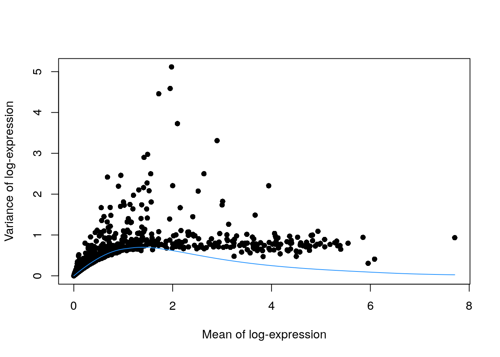

---
output:
  html_document
bibliography: ../ref.bib
---

# Feature selection 

<script>
document.addEventListener("click", function (event) {
    if (event.target.classList.contains("aaron-collapse")) {
        event.target.classList.toggle("active");
        var content = event.target.nextElementSibling;
        if (content.style.display === "block") {
          content.style.display = "none";
        } else {
          content.style.display = "block";
        }
    }
})
</script>

<style>
.aaron-collapse {
  background-color: #eee;
  color: #444;
  cursor: pointer;
  padding: 18px;
  width: 100%;
  border: none;
  text-align: left;
  outline: none;
  font-size: 15px;
}

.aaron-content {
  padding: 0 18px;
  display: none;
  overflow: hidden;
  background-color: #f1f1f1;
}
</style>

## Motivation

We often use scRNA-seq data in exploratory analyses to characterize heterogeneity across cells.
Procedures like clustering and dimensionality reduction compare cells based on their gene expression profiles, which involves aggregating per-gene differences into a single (dis)similarity metric between a pair of cells.
The choice of genes to use in this calculation has a major impact on the behavior of the metric and the performance of downstream methods.
We want to select genes that contain useful information about the biology of the system while removing genes that contain random noise.
This aims to preserve interesting biological structure without the variance that obscures that structure, and to reduce the size of the data to improve computational efficiency of later steps.

The simplest approach to feature selection is to select the most variable genes based on their expression across the population.
This assumes that genuine biological differences will manifest as increased variation in the affected genes, compared to other genes that are only affected by technical noise or a baseline level of "uninteresting" biological variation (e.g., from transcriptional bursting).
Several methods are available to quantify the variation per gene and to select an appropriate set of highly variable genes (HVGs).
We will discuss these below using the 10X PBMC dataset for demonstration:

<button class="aaron-collapse">View history</button>
<div class="aaron-content">
   
```r
#--- setup ---#
library(OSCAUtils)
chapterPreamble(use_cache = TRUE)

#--- loading ---#
library(BiocFileCache)
bfc <- BiocFileCache("raw_data", ask = FALSE)
raw.path <- bfcrpath(bfc, file.path("http://cf.10xgenomics.com/samples",
    "cell-exp/2.1.0/pbmc4k/pbmc4k_raw_gene_bc_matrices.tar.gz"))
untar(raw.path, exdir=file.path(tempdir(), "pbmc4k"))

library(DropletUtils)
fname <- file.path(tempdir(), "pbmc4k/raw_gene_bc_matrices/GRCh38")
sce.pbmc <- read10xCounts(fname, col.names=TRUE)

#--- gene-annotation ---#
library(scater)
rownames(sce.pbmc) <- uniquifyFeatureNames(
    rowData(sce.pbmc)$ID, rowData(sce.pbmc)$Symbol)

library(EnsDb.Hsapiens.v86)
location <- mapIds(EnsDb.Hsapiens.v86, keys=rowData(sce.pbmc)$ID, 
    column="SEQNAME", keytype="GENEID")

#--- cell-detection ---#
set.seed(100)
e.out <- emptyDrops(counts(sce.pbmc))
sce.pbmc <- sce.pbmc[,which(e.out$FDR <= 0.001)]

#--- quality-control ---#
stats <- perCellQCMetrics(sce.pbmc, subsets=list(Mito=which(location=="MT")))
high.mito <- isOutlier(stats$subsets_Mito_percent, type="higher")
sce.pbmc <- sce.pbmc[,!high.mito]

#--- normalization ---#
library(scran)
set.seed(1000)
clusters <- quickCluster(sce.pbmc)
sce.pbmc <- computeSumFactors(sce.pbmc, cluster=clusters)
sce.pbmc <- logNormCounts(sce.pbmc)
```

</div>


```r
sce.pbmc
```

```
## class: SingleCellExperiment 
## dim: 33694 3922 
## metadata(1): Samples
## assays(2): counts logcounts
## rownames(33694): RP11-34P13.3 FAM138A ... AC213203.1 FAM231B
## rowData names(2): ID Symbol
## colnames(3922): AAACCTGAGAAGGCCT-1 AAACCTGAGACAGACC-1 ...
##   TTTGTCACAGGTCCAC-1 TTTGTCATCCCAAGAT-1
## colData names(2): Sample Barcode
## reducedDimNames(0):
## spikeNames(0):
## altExpNames(0):
```

As well as the 416B dataset:

<button class="aaron-collapse">View history</button>
<div class="aaron-content">
   
```r
#--- setup ---#
library(OSCAUtils)
chapterPreamble(use_cache = TRUE)

#--- loading ---#
library(scRNAseq)
sce.416b <- LunSpikeInData(which="416b") 
sce.416b$block <- factor(sce.416b$block)

#--- gene-annotation ---#
library(AnnotationHub)
ens.mm.v97 <- AnnotationHub()[["AH73905"]]
rowData(sce.416b)$ENSEMBL <- rownames(sce.416b)
rowData(sce.416b)$SYMBOL <- mapIds(ens.mm.v97, keys=rownames(sce.416b),
    keytype="GENEID", column="SYMBOL")
rowData(sce.416b)$SEQNAME <- mapIds(ens.mm.v97, keys=rownames(sce.416b),
    keytype="GENEID", column="SEQNAME")

library(scater)
rownames(sce.416b) <- uniquifyFeatureNames(rowData(sce.416b)$ENSEMBL, 
    rowData(sce.416b)$SYMBOL)

#--- quality-control ---#
mito <- which(rowData(sce.416b)$SEQNAME=="MT")
stats <- perCellQCMetrics(sce.416b, subsets=list(Mt=mito))
qc <- quickPerCellQC(stats, percent_subsets=c("subsets_Mt_percent",
    "altexps_ERCC_percent"), batch=sce.416b$block)
sce.416b <- sce.416b[,!qc$discard]

#--- normalization ---#
library(scran)
sce.416b <- computeSumFactors(sce.416b)
sce.416b <- logNormCounts(sce.416b)
```

</div>


```r
sce.416b
```

```
## class: SingleCellExperiment 
## dim: 46604 185 
## metadata(0):
## assays(2): counts logcounts
## rownames(46604): 4933401J01Rik Gm26206 ... CAAA01147332.1
##   CBFB-MYH11-mcherry
## rowData names(4): Length ENSEMBL SYMBOL SEQNAME
## colnames(185): SLX-9555.N701_S502.C89V9ANXX.s_1.r_1
##   SLX-9555.N701_S503.C89V9ANXX.s_1.r_1 ...
##   SLX-11312.N712_S507.H5H5YBBXX.s_8.r_1
##   SLX-11312.N712_S517.H5H5YBBXX.s_8.r_1
## colData names(9): Source Name cell line ... spike-in addition
##   block
## reducedDimNames(0):
## spikeNames(0):
## altExpNames(2): ERCC SIRV
```

## Quantifying per-gene variation

### Variance of the log-counts

The simplest approach to quantifying per-gene variation is to simply compute the variance of the log-normalized expression values (referred to as "log-counts" for simplicity) for each gene across all cells in the population [@lun2016step].
This has an advantage in that the feature selection is based on the same log-values that are used for later downstream steps.
In particular, genes with the largest variances in log-values will contribute the most to the Euclidean distances between cells.
By using log-values here, we ensure that our quantitative definition of heterogeneity is consistent throughout the entire analysis.

Calculation of the per-gene variance is simple but feature selection requires modelling of the mean-variance relationship. 
As discussed briefly in Section \@ref(normalization-transformation), the log-transformation does not achieve perfect variance stabilization, which means that the variance of a gene is driven more by its abundance than its underlying biological heterogeneity. 
To account for this effect, we use the `modelGeneVar()` function to fit a trend to the variance with respect to abundance across all genes (Figure \@ref(fig:trend-plot-pbmc)).


```r
library(scran)
dec.pbmc <- modelGeneVar(sce.pbmc)

# Visualizing the fit:
fit.pbmc <- metadata(dec.pbmc)
plot(fit.pbmc$mean, fit.pbmc$var, xlab="Mean of log-expression",
    ylab="Variance of log-expression")
curve(fit.pbmc$trend(x), col="dodgerblue", add=TRUE, lwd=2)
```

<div class="figure">

<p class="caption">(\#fig:trend-plot-pbmc)Variance in the PBMC data set as a function of the mean. Each point represents a gene while the blue line represents the trend fitted to all genes.</p>
</div>

At any given abundance, we assume that the expression profiles of most genes are dominated by random technical noise (see Section \@ref(sec:spikeins) for details).
Under this assumption, our trend represents an estimate of the technical noise as a function of abundance.
We then break down the total variance of each gene into the technical component, i.e., the fitted value of the trend at that gene's abundance;
and the biological component, defined as the difference between the total variance and the technical component.
This biological component represents the "interesting" variation for each gene and can be used as the metric for HVG selection.


```r
# Ordering by most interesting genes for inspection.
dec.pbmc[order(dec.pbmc$bio, decreasing=TRUE),] 
```

```
## DataFrame with 33694 rows and 6 columns
##                     mean             total              tech
##                <numeric>         <numeric>         <numeric>
## LYZ     1.97769673707568   5.1159500611095 0.827276642503728
## S100A9  1.94950920785793  4.58859014766227 0.827542441573362
## S100A8  1.71827632030156  4.45723403089262 0.819401991166403
## HLA-DRA 2.09694376970247   3.7268983984442 0.823662581878885
## CD74    2.89839753243019  3.30912153093723 0.793202988436368
## ...                  ...               ...               ...
## PTMA    3.83013315155046 0.471105138449811 0.740524978138555
## HLA-B   4.50160947331388 0.475347815893854 0.755806549657769
## EIF1     3.2426121173403 0.478352466438016 0.771315503705751
## TMSB4X  6.08482790661183 0.408393742972349 0.742839897041566
## B2M     5.95481007289176 0.304436638362183 0.714660547316676
##                        bio               p.value                   FDR
##                  <numeric>             <numeric>             <numeric>
## LYZ       4.28867341860577 7.03213018447814e-271 6.90906790624978e-267
## S100A9    3.76104770608891 9.35449482145626e-209 6.12719410805385e-205
## S100A8    3.63783203972622 2.60466998758649e-199 1.27954413140186e-195
## HLA-DRA   2.90323581656531 1.69875162807628e-126 2.38431924940706e-123
## CD74      2.51591854250087 7.30209839426977e-103 6.83267778320957e-100
## ...                    ...                   ...                   ...
## PTMA    -0.269419839688743     0.993177414140068     0.999999999531493
## HLA-B   -0.280458733763915     0.994058786199678     0.999999999531493
## EIF1    -0.292963037267734     0.994987111952843     0.999999999531493
## TMSB4X  -0.334446154069217     0.998864257664794     0.999999999531493
## B2M     -0.410223908954493     0.999950168965873     0.999999999531493
```

(Careful readers will notice that some genes have negative biological components, which have no obvious interpretation and can be ignored in most applications.
They are inevitable when fitting a trend to the per-gene variances as approximately half of the genes will lie below the trend.)

### Coefficient of variation

An alternative approach to quantification uses the squared coefficient of variation (CV^2^) of the normalized expression values prior to log-transformation.
The CV^2^ is a widely used metric for describing variation in non-negative data and is closely related to the dispersion parameter of the negative binomial distribution in packages like *[edgeR](https://bioconductor.org/packages/3.10/edgeR)* and *[DESeq2](https://bioconductor.org/packages/3.10/DESeq2)*.
We compute the CV^2^ for each gene in the PBMC dataset using the `modelGeneCV2()` function, which provides a robust implementation of the approach described by @brennecke2013accounting.


```r
dec.cv2.pbmc <- modelGeneCV2(sce.pbmc)
```

This allows us to model the mean-variance relationship when considering the relevance of each gene (Figure \@ref(fig:cv2-pbmc)).
Again, our assumption is that most genes contain random noise and that the trend captures mostly technical variation.
Large CV^2^ values that deviate strongly from the trend are likely to represent genes affected by biological structure.


```r
fit.cv2.pbmc <- metadata(dec.cv2.pbmc)
plot(fit.cv2.pbmc$mean, fit.cv2.pbmc$cv2, log="xy")
curve(fit.cv2.pbmc$trend(x), col="dodgerblue", add=TRUE, lwd=2)
```

<div class="figure">

<p class="caption">(\#fig:cv2-pbmc)CV^2^ in the PBMC data set as a function of the mean. Each point represents a gene while the blue line represents the fitted trend.</p>
</div>

For each gene, we quantify the deviation from the trend in terms of the ratio of its CV^2^ to the fitted value of trend at its abundance.
This is more appropriate than the directly subtracting the trend from the CV^2^, as the magnitude of the ratio is not affected by the mean.


```r
dec.cv2.pbmc[order(dec.cv2.pbmc$ratio, decreasing=TRUE),]
```

```
## DataFrame with 33694 rows and 6 columns
##                         mean            total            trend
##                    <numeric>        <numeric>        <numeric>
## HIST1H2AC  0.904516934666557 267.718236577368 1.55979164081405
## GNG11      0.690568836016836 219.322909957405 1.98063874706952
## PRTFDC1    0.041251143542588 3034.95248349643 29.9868177679901
## TNNC2      0.102157654693312 1210.58511395578 12.2287213946739
## PF4         1.10837584898308 128.809452421799 1.30994958632595
## ...                      ...              ...              ...
## AC023491.2                 0              NaN              Inf
## AC233755.2                 0              NaN              Inf
## AC233755.1                 0              NaN              Inf
## AC213203.1                 0              NaN              Inf
## FAM231B                    0              NaN              Inf
##                       ratio   p.value       FDR
##                   <numeric> <numeric> <numeric>
## HIST1H2AC  171.637178692435         0         0
## GNG11      110.733423892624         0         0
## PRTFDC1    101.209555044422         0         0
## TNNC2      98.9952321984404         0         0
## PF4        98.3316104424093         0         0
## ...                     ...       ...       ...
## AC023491.2              NaN       NaN       NaN
## AC233755.2              NaN       NaN       NaN
## AC233755.1              NaN       NaN       NaN
## AC213203.1              NaN       NaN       NaN
## FAM231B                 NaN       NaN       NaN
```

Both the CV^2^ and the variance of log-counts are effective metrics for quantifying variation in gene expression.
The CV^2^ tends to give higher rank to low-abundance HVGs driven by upregulation in rare subpopulations, for which the increase in variance on the raw scale is stronger than that on the log-scale.
However, the variation described by the CV^2^ is less directly relevant to downstream procedures operating on the log-counts, and the reliance on the ratio can assign high rank to uninteresting genes with low absolute variance.
We generally prefer the use of the variance of log-counts and will use it in the following sections, though the many of the same principles apply to procedures based on the CV^2^.

### Quantifying technical noise {#sec:spikeins}

Strictly speaking, the use of a trend fitted to endogenous genes assumes that the expression profiles of most genes are dominated by random technical noise.
In practice, all expressed genes will exhibit some non-zero level of biological variability due to events like transcriptional bursting.
This suggests that our estimates of the technical component are likely to be inflated. 
It would be more appropriate to consider these estimates as technical noise plus "uninteresting" biological variation, under the assumption that most genes are unaffected by the relevant heterogeneity in the population.

This revised assumption is generally reasonable but may be problematic in some scenarios where many genes at a particular abundance are affected by a biological process.
For example, strong upregulation of cell type-specific genes may result in an enrichment of HVGs at high abundances.
This would inflate the fitted trend in that abundance interval and compromise the detection of the relevant genes.
We can avoid this problem by fitting a mean-dependent trend to the variance of the spike-in transcripts (Figure \@ref(fig:spike-416b)), if they are available.
The premise here is that spike-ins should not be affected by biological variation, so the fitted value of the spike-in trend should represent a better estimate of the technical component for each gene.


```r
dec.spike.416b <- modelGeneVarWithSpikes(sce.416b, "ERCC")
dec.spike.416b[order(dec.spike.416b$bio, decreasing=TRUE),]
```

```
## DataFrame with 46604 rows and 6 columns
##                      mean             total             tech
##                 <numeric>         <numeric>        <numeric>
## Lyz2     6.61096803891878  13.8497201762179 1.57130530159628
## Ccl9     6.67845998360554  13.1869005745724 1.50034784951575
## Top2a    5.81023942468506  14.1787245984925 2.54775542207223
## Cd200r3  4.83179821635761  15.5612599938701 4.22984247867865
## Ccnb2    5.97776034107469  13.1392817339087 2.30176764474006
## ...                   ...               ...              ...
## Rpl5-ps2 3.60625401733281 0.612623344818866 6.32852660729456
## Gm11942  3.38767658515201 0.798570319939665 6.51473011137326
## Gm12816  2.91276213414496  0.83866968433397 6.57363560699119
## Gm13623  2.72843841213055 0.708071335002565 6.45448378131385
## Rps12l1  3.15419890541469 0.746615468755298   6.593316320265
##                        bio               p.value                   FDR
##                  <numeric>             <numeric>             <numeric>
## Lyz2      12.2784148746216 1.48992982137285e-186 1.54155912866129e-183
## Ccl9      11.6865527250566 2.21855297819158e-185 2.19978771758437e-182
## Top2a     11.6309691764202  3.80015396614872e-65  1.13040329915551e-62
## Cd200r3   11.3314175151915   9.4622094003004e-24  6.08573505672834e-22
## Ccnb2     10.8375140891687  3.68706024719105e-69  1.20193113290966e-66
## ...                    ...                   ...                   ...
## Rpl5-ps2 -5.71590326247569     0.999616247009411     0.999726145748132
## Gm11942   -5.7161597914336     0.999458916367196     0.999726145748132
## Gm12816  -5.73496592265722     0.999422192516362     0.999726145748132
## Gm13623  -5.74641244631128      0.99954376258778     0.999726145748132
## Rps12l1   -5.8467008515097     0.999521783342308     0.999726145748132
```

```r
plot(dec.spike.416b$mean, dec.spike.416b$total, xlab="Mean of log-expression",
    ylab="Variance of log-expression")
fit.spike.416b <- metadata(dec.spike.416b)
points(fit.spike.416b$mean, fit.spike.416b$var, col="red", pch=16)
curve(fit.spike.416b$trend(x), col="dodgerblue", add=TRUE, lwd=2)
```

<div class="figure">

<p class="caption">(\#fig:spike-416b)Variance in the 416B data set as a function of the mean. Each point represents a gene (black) or spike-in transcript (red) and the blue line represents the trend fitted to all spike-ins.</p>
</div>

In the absence of spike-in data, one can attempt to create a trend by making some distributional assumptions about the noise.
For example, UMI counts typically exhibit near-Poisson variation if we only consider technical noise from library preparation and sequencing.
This can be used to construct a mean-variance trend in the log-counts (Figure \@ref(fig:tech-pbmc)) with the `modelGeneVarByPoisson()` function.
Note the increased residuals of the high-abundance genes, which can be interpreted as the amount of biological variation that was assumed to be "uninteresting" when fitting the gene-based trend in Figure \@ref(fig:trend-plot-pbmc).


```r
set.seed(0010101)
dec.pois.pbmc <- modelGeneVarByPoisson(sce.pbmc)
dec.pois.pbmc <- dec.pois.pbmc[order(dec.pois.pbmc$bio, decreasing=TRUE),]
head(dec.pois.pbmc)
```

```
## DataFrame with 6 rows and 6 columns
##                     mean            total              tech
##                <numeric>        <numeric>         <numeric>
## LYZ     1.97769673707568  5.1159500611095 0.621547116744493
## S100A9  1.94950920785793 4.58859014766227 0.627306158840199
## S100A8  1.71827632030156 4.45723403089262 0.669427971485891
## HLA-DRA 2.09694376970247  3.7268983984442 0.596371862329539
## CD74    2.89839753243019 3.30912153093723 0.422623998344518
## CST3    1.49284939321847 2.97369478511548 0.695366744016425
##                      bio   p.value       FDR
##                <numeric> <numeric> <numeric>
## LYZ       4.494402944365         0         0
## S100A9  3.96128398882207         0         0
## S100A8  3.78780605940673         0         0
## HLA-DRA 3.13052653611466         0         0
## CD74    2.88649753259271         0         0
## CST3    2.27832804109905         0         0
```

```r
plot(dec.pois.pbmc$mean, dec.pois.pbmc$total, pch=16, xlab="Mean of log-expression",
    ylab="Variance of log-expression")
curve(metadata(dec.pois.pbmc)$trend(x), col="dodgerblue", add=TRUE)
```

<div class="figure">

<p class="caption">(\#fig:tech-pbmc)Variance of normalized log-expression values for each gene in the PBMC dataset, plotted against the mean log-expression. The blue line represents represents the mean-variance relationship corresponding to Poisson noise.</p>
</div>

Interestingly, trends based purely on technical noise tend to yield large biological components for highly-expressed genes.
This often includes so-called "house-keeping" genes coding for essential cellular components such as ribosomal proteins, which are considered uninteresting for characterizing cellular heterogeneity.
These observations suggest that a more accurate noise model does not necessarily yield a better ranking of HVGs, though one should keep an open mind - house-keeping genes are regularly DE in a variety of conditions [@glare2002betaactin;@nazari2015gapdh;@guimaraes2016patterns], and the fact that they have large biological components indicates that there is strong variation across cells that may not be completely irrelevant.

### Accounting for blocking factors

#### Fitting block-specific trends {#variance-batch}

Data containing multiple batches will often exhibit batch effects (see Chapter \@ref(data-integration) for more details).
We are usually not interested in HVGs that are driven by batch effects.
Rather, we want to focus on genes that are highly variable within each batch.
This is naturally achieved by performing trend fitting and variance decomposition separately for each batch.
We demonstrate this approach by treating each plate (`block`) in the 416B dataset as a different batch, using the `modelGeneVarWithSpikes()` function.
(The same argument is available in all other variance-modelling functions.)


```r
dec.block.416b <- modelGeneVarWithSpikes(sce.416b, "ERCC", block=sce.416b$block)
head(dec.block.416b[order(dec.block.416b$bio, decreasing=TRUE),1:6])
```

```
## DataFrame with 6 rows and 6 columns
##                     mean            total             tech
##                <numeric>        <numeric>        <numeric>
## Lyz2    6.61235092956153 13.8618988024144 1.58416440878876
## Ccl9    6.67841214065115 13.2598761518269 1.44553397965825
## Top2a   5.81274666129111 14.0191605357462 2.74571164328693
## Cd200r3 4.83305175110888 15.5908569933105 4.31892122926251
## Ccnb2   5.97999269432625 13.0256084334992 2.46646680409343
## Hbb-bt  4.91682531222784 14.6538670496416 4.12156477107562
##                      bio               p.value                   FDR
##                <numeric>             <numeric>             <numeric>
## Lyz2    12.2777343936257                     0                     0
## Ccl9    11.8143421721686                     0                     0
## Top2a   11.2734488924592 3.89854825869685e-137 8.43397753747354e-135
## Cd200r3  11.271935764048  1.17783174428153e-54  7.00721550466689e-53
## Ccnb2   10.5591416294057 1.20380000061177e-151 2.98404464734982e-149
## Hbb-bt   10.532302278566   2.5263862540857e-49  1.34197351983209e-47
```

The use of a batch-specific trend fit is useful as it accommodates differences in the mean-variance trends between batches.
This is especially important if batches exhibit systematic technical differences, e.g., differences in coverage or in the amount of spike-in RNA added.
In this case, there are only minor differences between the trends in Figure \@ref(fig:blocked-fit), which indicates that the experiment was tightly replicated across plates.
The analysis of each plate yields estimates of the biological and technical components for each gene, which are averaged across plates to take advantage of information from multiple batches. 


```r
par(mfrow=c(1,2))
blocked.stats <- dec.block.416b$per.block
for (i in colnames(blocked.stats)) {
    current <- blocked.stats[[i]]
    plot(current$mean, current$total, main=i, pch=16, cex=0.5,
        xlab="Mean of log-expression", ylab="Variance of log-expression")
    curfit <- metadata(current)
    points(curfit$mean, curfit$var, col="red", pch=16)
    curve(curfit$trend(x), col='dodgerblue', add=TRUE, lwd=2) 
}
```

<div class="figure">

<p class="caption">(\#fig:blocked-fit)Variance in the 416B data set as a function of the mean after blocking on the plate of origin. Each plot represents the results for a single plate, each point represents a gene (black) or spike-in transcript (red) and the blue line represents the trend fitted to all spike-ins.</p>
</div>

As an aside, the wave-like shape observed above is typical of the mean-variance trend for log-expression values.
(The same wave is present but much less pronounced for UMI data.)
A linear increase in the variance is observed as the mean increases from zero, as larger variances are obviously possible when the counts are not all equal to zero.
In contrast, the relative contribution of sampling noise decreases at high abundances, resulting in a downward trend.
The peak represents the point at which these two competing effects cancel each other out.

#### Using a design matrix

The use of block-specific trends is the recommended approach for experiments with a single blocking factor.
However, this is not practical for studies involving a large number of blocking factors and/or covariates.
In such cases, we can use the `design=` argument to specify a design matrix with uninteresting factors of variation.
We illustrate again with the 416B data set, blocking on the plate of origin and oncogene induction.
(The same argument is available in `modelGeneVar()` when spike-ins are not available.)


```r
design <- model.matrix(~factor(block) + phenotype, colData(sce.416b))
dec.design.416b <- modelGeneVarWithSpikes(sce.416b, "ERCC", design=design)
dec.design.416b[order(dec.design.416b$bio, decreasing=TRUE),]
```

```
## DataFrame with 46604 rows and 6 columns
##                      mean             total             tech
##                 <numeric>         <numeric>        <numeric>
## Lyz2     6.61096803891878  8.90512635193215 1.50405193582095
## Ccnb2    5.97776034107469  9.54372612545439 2.24180423717101
## Gem      5.90224546535998  9.54358133115793 2.35175324142717
## Cenpa    5.81348980307671  8.65621880001792    2.48791803297
## Idh1     5.99343230026856  8.32112833403297 2.21964586481642
## ...                   ...               ...              ...
## Gm5054   2.90433859612123 0.463698403028673 6.76999876266688
## Gm12191  3.55920216241565 0.170709357430238 6.53284597878746
## Gm7429   3.45394451046348 0.248350912621566 6.63457982170964
## Gm16378  2.83987048016898 0.208215208521281 6.74662681328272
## Rps2-ps2 3.11324156219337 0.202307294410046 6.78483536857142
##                        bio               p.value                   FDR
##                  <numeric>             <numeric>             <numeric>
## Lyz2      7.40107441611121 1.78185058463941e-172 1.28493025341406e-169
## Ccnb2     7.30192188828338  7.77223320238053e-77  1.44496744935195e-74
## Gem       7.19182808973075  5.49586828733217e-68  8.12330295861141e-66
## Cenpa     6.16830076704792  2.08034584949453e-45  1.52796265988954e-43
## Idh1      6.10148246921656  2.42818909044647e-55  2.41772450984748e-53
## ...                    ...                   ...                   ...
## Gm5054   -6.30630035963821     0.999999940536335     0.999999984861416
## Gm12191  -6.36213662135722     0.999999984522185     0.999999984861416
## Gm7429   -6.38622890908807     0.999999977712902     0.999999984861416
## Gm16378  -6.53841160476144     0.999999981961201     0.999999984861416
## Rps2-ps2 -6.58252807416138      0.99999998255976     0.999999984861416
```

This strategy is simple but somewhat inaccurate as it does not consider the mean expression in each blocking level.
Recall that the technical component is estimated as the fitted value of the trend at the average abundance for each gene.
However, the true technical component is the average of the fitted values at the per-block means, which may be quite different for strong batch effects and non-linear mean-variance relationships.
The `block=` approach is safer and should be preferred in all situations where it is applicable.

## Selecting highly variable genes {#hvg-selection}

### Overview

Once we have quantified the per-gene variation, the next step is to select the subset of HVGs to use in downstream analyses.
A larger subset will reduce the risk of discarding interesting biological signal by retaining more potentially relevant genes, at the cost of increasing noise from irrelevant genes that might obscure said signal.
It is difficult to determine the optimal trade-off for any given application as noise in one context may be useful signal in another.
For example, heterogeneity in T cell activation responses is an interesting phenomena [@richard2018tcell] but may be irrelevant noise in studies that only care about distinguishing the major immunophenotypes.
That said, there are several common strategies that are routinely used to guide HVG selection, which we shall discuss here.

### Based on the largest metrics

The simplest HVG selection strategy is to take the top $X$ genes with the largest values for the relevant variance metric.
The main advantage of this approach is that the user can directly control the number of genes retained, which ensures that the computational complexity of downstream calculations is easily predicted.
For `modelGeneVar()` and `modelGeneVarWithSpikes()`, we would select the genes with the largest biological components:


```r
# Taking the top 1000 genes here:
hvg.pbmc.var <- getTopHVGs(dec.pbmc, n=1000)
str(hvg.pbmc.var)
```

```
##  chr [1:1000] "LYZ" "S100A9" "S100A8" "HLA-DRA" "CD74" "CST3" "TYROBP" ...
```

For `modelGeneCV2()` (and its relative, `modelGeneCV2WithSpikes()`), this would instead be the genes with the largest ratios:


```r
hvg.pbmc.cv2 <- getTopHVGs(dec.cv2.pbmc, var.field="ratio", n=1000)
str(hvg.pbmc.cv2)
```

```
##  chr [1:1000] "HIST1H2AC" "GNG11" "PRTFDC1" "TNNC2" "PF4" "HGD" "PPBP" ...
```

The choice of $X$ also has a fairly straightforward biological interpretation.
Recall our trend-fitting assumption that most genes do not exhibit biological heterogeneity; this implies that they are not differentially expressed between cell types or states in our population.
If we quantify this assumption into a statement that, e.g., no more than 5% of genes are differentially expressed, we can naturally set $X$ to 5% of the number of genes.
In practice, we usually do not know the proportion of DE genes beforehand so this interpretation just exchanges one unknown for another.
Nonetheless, it is still useful as it implies that we should lower $X$ for less heterogeneous datasets, retaining most of the biological signal without unnecessary noise from irrelevant genes.
Conversely, more heterogeneous datasets should use larger values of $X$ to preserve secondary factors of variation beyond those driving the most obvious HVGs.

The main disadvantage of this approach that it turns HVG selection into a competition between genes, whereby a subset of very highly variable genes can push other informative genes out of the top set.
This can be problematic for analyses of highly heterogeneous populations if the loss of important markers prevents the resolution of certain subpopulations.
In the most extreme example, consider a situation where a single subpopulation is very different from the others.
In such cases, the top set will be dominated by differentially expressed genes involving that distinct subpopulation, compromising resolution of heterogeneity between the other populations.
(This can salvaged with a nested analysis, as discussed in Section \@ref(subclustering), but we would prefer to avoid the problem in the first place.)

<!--
Similarly, abundance-dependent changes in the magnitude of the chosen variance metric can introduce unexpected biases in competitive gene selection. 
For example, the wave shape in Figure \@ref(fig:blocked-fit) means that the largest biological components usually occur around the peak and will be preferentially selected, while an upper bound on the CV^2^ discriminates against selection of low-abundance genes.
-->

Another possible concern with this approach is the fact that the choice of $X$ is fairly arbitrary, with any value from 500 to 5000 considered "reasonable". 
We have chosen $X=1000$ in the code above though there is no particular _a priori_ reason for doing so.
Our recommendation is to simply pick an arbitrary $X$ and proceed with the rest of the analysis, with the intention of testing other choices later, rather than spending much time worrying about obtaining the "optimal" value.

### Based on significance

Another approach to feature selection is to set a fixed threshold of one of the metrics.
This is most commonly done with the (adjusted) $p$-value reported by each of the above methods.
The $p$-value for each gene is generated by testing against the null hypothesis that the variance is equal to the trend.
For example, we might define our HVGs as all genes that have adjusted $p$-values below 0.05.


```r
hvg.pbmc.var.2 <- getTopHVGs(dec.pbmc, fdr.threshold=0.05)
length(hvg.pbmc.var.2)
```

```
## [1] 651
```

This approach is simple to implement and - if the test holds its size - it controls the false discovery rate (FDR).
That is, it returns a subset of genes where the proportion of false positives is expected to be below the specified threshold.
This can occasionally be useful in applications where the HVGs themselves are of interest.
For example, if we were to use the list of HVGs in further experiments to verify the existence of heterogeneous expression for some of the genes, we would want to control the FDR in that list.

The downside of this approach is that it is less predictable than the top $X$ strategy.
The number of genes returned depends on the type II error rate of the test and the severity of the multiple testing correction.
One might obtain no genes or every gene at a given FDR threshold, depending on the circumstances.
Moreover, control of the FDR is usually not helpful at this stage of the analysis.
We are not interpreting the individual HVGs themselves but are only using them for feature selection prior to downstream steps.
There is no reason to think that a 5% threshold on the FDR yields a more suitable compromise between bias and noise compared to the top $X$ selection.

As an aside, we might consider ranking genes by the $p$-value instead of the biological component for use in a top $X$ approach.
This results in some counterintuitive behavior due to the nature of the underlying hypothesis test, which is based on the ratio of the total variance to the expected technical variance.
Ranking based on $p$-value tends to prioritize HVGs that are more likely to be true positives but, at the same time, less likely to be biologically interesting.
Many of the largest ratios are observed in high-abundance genes and are driven by very low technical variance; the total variance is typically modest for such genes, and they do not contribute much to population heterogeneity in absolute terms.
(Note that the same can be said of the ratio of CV^2^ values, as briefly discussed above.)

### Keeping all genes above the trend {#feature-selection-positive}

Here, the aim is to only remove the obviously uninteresting genes with variances below the trend.
By doing so, we avoid the need to make any judgement calls regarding what level of variation is interesting enough to retain.
This approach represents one extreme of the bias-variance trade-off where bias is minimized at the cost of maximizing noise.
For `modelGeneVar()`, it equates to keeping all positive biological components:


```r
hvg.pbmc.var.3 <- getTopHVGs(dec.pbmc, var.threshold=0)
length(hvg.pbmc.var.3)
```

```
## [1] 12791
```

For `modelGeneCV2()`, this involves keeping all ratios above 1:


```r
hvg.pbmc.cv2.3 <- getTopHVGs(dec.cv2.pbmc, var.field="ratio", var.threshold=1)
length(hvg.pbmc.cv2.3)
```

```
## [1] 9295
```

By retaining all potential biological signal, we give secondary population structure the chance to manifest.
This is most useful for rare subpopulations where the relevant markers will not exhibit strong overdispersion owing to the small number of affected cells.
It will also preserve a weak but consistent effect across many genes with small biological components; admittedly, though, this is not of major interest in most scRNA-seq studies given the difficulty of experimentally validating population structure in the absence of strong marker genes.

The obvious cost is that more noise is also captured, which can reduce the resolution of otherwise well-separated populations and mask the secondary signal that we were trying to preserve.
The use of more genes also introduces more computational work in each downstream step.
This strategy is thus best suited to very heterogeneous populations containing many different cell types (possibly across many datasets that are to be merged, as in Chapter \@ref(integrating-datasets)) where there is a justified fear of ignoring marker genes for low-abundance subpopulations under a competitive top $X$ approach.

### Based on _a priori_ genes of interest

A blunt yet effective feature selection strategy is to use pre-defined sets of interesting genes.
The aim is to focus on specific aspects of biological heterogeneity that may be masked by other factors when using unsupervised methods for HVG selection.
One example application lies in the dissection of transcriptional changes during the earliest stages of cell fate commitment [@messmer2019transcriptional], which may be modest relative to activity in other pathways (e.g., cell cycle, metabolism).
Indeed, if our aim is to show that there is no meaningful heterogeneity in a given pathway, we would - at the very least - be obliged to repeat our analysis using only the genes in that pathway to maximize power for detecting such heterogeneity.

Using scRNA-seq data in this manner is conceptually equivalent to a fluorescence activated cell sorting (FACS) experiment, with the convenience of being able to (re)define the features of interest at any time.
For example, in the PBMC dataset, we might use some of the C7 immunologic signatures from MSigDB [@godec2016compendium] to improve resolution of the various T cell subtypes.
We stress that there is no shame in leveraging prior biological knowledge to address specific hypotheses in this manner.
We say this because a common refrain in genomics is that the data analysis should be "unbiased", i.e., free from any biological preconceptions.
Attempting to derive biological insight _ab initio_ is admirable but such "biases" are already present at every stage, starting from experimental design (why are we interested in this cell population in the first place?) and continuing through to interpretation of marker genes (Section \@ref(marker-detection)).

The downside of focusing on pre-defined genes is that it will limit our capacity to detect novel or unexpected aspects of variation.
Thus, this kind of focused analysis should be complementary to (rather than a replacement for) the unsupervised feature selection strategies discussed previously.

## Putting it all together

The few lines of code below will select the top 10% of genes with the highest biological components.


```r
dec.pbmc <- modelGeneVar(sce.pbmc)
chosen <- getTopHVGs(dec.pbmc, prop=0.1)
str(chosen)
```

```
##  chr [1:1279] "LYZ" "S100A9" "S100A8" "HLA-DRA" "CD74" "CST3" "TYROBP" ...
```

We then have several options to enforce our HVG selection on the rest of the analysis.

1. We can subset the `SingleCellExperiment` to only retain our selection of HVGs.
This ensures that downstream methods will only use these genes for their calculations.
The downside is that the non-HVGs are discarded from the new `SingleCellExperiment`, making it slightly more inconvenient to interrogate the full dataset for interesting genes that are not HVGs.

    
    ```r
    sce.pbmc.hvg <- sce.pbmc[chosen,]
    dim(sce.pbmc.hvg)
    ```
    
    ```
    ## [1] 1279 3922
    ```

2. We can keep the original `SingleCellExperiment` object and specify the genes to use for downstream functions via an extra argument like `subset.row=`.
This is useful if the analysis uses multiple sets of HVGs at different steps, whereby one set of HVGs can be easily swapped for another in specific steps.
However, it can be inconvenient to repeatedly specify the same HVG set across steps.

    
    ```r
    # Performing PCA only on the chosen HVGs.
    library(scater)
    sce.pbmc <- runPCA(sce.pbmc, subset_row=chosen)
    reducedDimNames(sce.pbmc)
    ```
    
    ```
    ## [1] "PCA"
    ```

3. We can have our cake and eat it too by (ab)using the "alternative Experiment" system in the `SingleCellExperiment` class.
Initially designed for storing alternative features like spike-ins or antibody tags, we can instead use it to hold our full dataset while we perform our downstream operations conveniently on the HVG subset.
This avoids book-keeping problems in long analyses when the original dataset is not synchronized with the HVG subsetted data. 

    
    ```r
    # Recycling the class above.
    altExp(sce.pbmc.hvg, "original") <- sce.pbmc
    altExpNames(sce.pbmc.hvg)
    ```
    
    ```
    ## [1] "original"
    ```
    
    ```r
    # No need for explicit subset_row= specification in downstream operations.
    sce.pbmc.hvg <- runPCA(sce.pbmc.hvg)
    
    # Recover original data:
    sce.pbmc.original <- altExp(sce.pbmc.hvg, "original", withColData=TRUE)
    ```

## Session Info {-}

<button class="aaron-collapse">View session info</button>
<div class="aaron-content">
```
R version 3.6.1 (2019-07-05)
Platform: x86_64-pc-linux-gnu (64-bit)
Running under: Ubuntu 14.04.6 LTS

Matrix products: default
BLAS:   /home/ramezqui/Rbuild/danbuild/R-3.6.1/lib/libRblas.so
LAPACK: /home/ramezqui/Rbuild/danbuild/R-3.6.1/lib/libRlapack.so

locale:
 [1] LC_CTYPE=en_US.UTF-8       LC_NUMERIC=C              
 [3] LC_TIME=en_US.UTF-8        LC_COLLATE=C              
 [5] LC_MONETARY=en_US.UTF-8    LC_MESSAGES=en_US.UTF-8   
 [7] LC_PAPER=en_US.UTF-8       LC_NAME=C                 
 [9] LC_ADDRESS=C               LC_TELEPHONE=C            
[11] LC_MEASUREMENT=en_US.UTF-8 LC_IDENTIFICATION=C       

attached base packages:
[1] parallel  stats4    stats     graphics  grDevices utils     datasets 
[8] methods   base     

other attached packages:
 [1] scater_1.14.0               ggplot2_3.2.1              
 [3] scran_1.14.0                SingleCellExperiment_1.8.0 
 [5] SummarizedExperiment_1.16.0 DelayedArray_0.12.0        
 [7] BiocParallel_1.20.0         matrixStats_0.55.0         
 [9] Biobase_2.46.0              GenomicRanges_1.38.0       
[11] GenomeInfoDb_1.22.0         IRanges_2.20.0             
[13] S4Vectors_0.24.0            BiocGenerics_0.32.0        
[15] Cairo_1.5-10                BiocStyle_2.14.0           
[17] OSCAUtils_0.0.1            

loaded via a namespace (and not attached):
 [1] Rcpp_1.0.2               rsvd_1.0.2              
 [3] locfit_1.5-9.1           lattice_0.20-38         
 [5] assertthat_0.2.1         digest_0.6.22           
 [7] R6_2.4.0                 evaluate_0.14           
 [9] highr_0.8                pillar_1.4.2            
[11] zlibbioc_1.32.0          rlang_0.4.1             
[13] lazyeval_0.2.2           irlba_2.3.3             
[15] Matrix_1.2-17            rmarkdown_1.16          
[17] BiocNeighbors_1.4.0      statmod_1.4.32          
[19] stringr_1.4.0            igraph_1.2.4.1          
[21] RCurl_1.95-4.12          munsell_0.5.0           
[23] vipor_0.4.5              compiler_3.6.1          
[25] BiocSingular_1.2.0       xfun_0.10               
[27] pkgconfig_2.0.3          ggbeeswarm_0.6.0        
[29] htmltools_0.4.0          tidyselect_0.2.5        
[31] gridExtra_2.3            tibble_2.1.3            
[33] GenomeInfoDbData_1.2.2   bookdown_0.14           
[35] edgeR_3.28.0             viridisLite_0.3.0       
[37] withr_2.1.2              crayon_1.3.4            
[39] dplyr_0.8.3              bitops_1.0-6            
[41] grid_3.6.1               gtable_0.3.0            
[43] magrittr_1.5             scales_1.0.0            
[45] dqrng_0.2.1              stringi_1.4.3           
[47] XVector_0.26.0           viridis_0.5.1           
[49] limma_3.42.0             DelayedMatrixStats_1.8.0
[51] tools_3.6.1              beeswarm_0.2.3          
[53] glue_1.3.1               purrr_0.3.3             
[55] yaml_2.2.0               colorspace_1.4-1        
[57] BiocManager_1.30.9       knitr_1.25              
```
</div>
