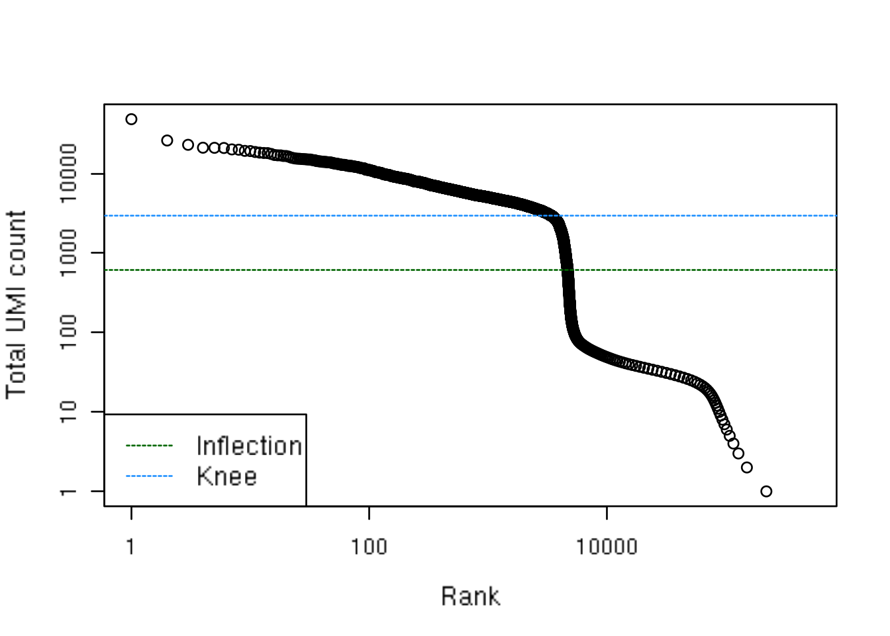
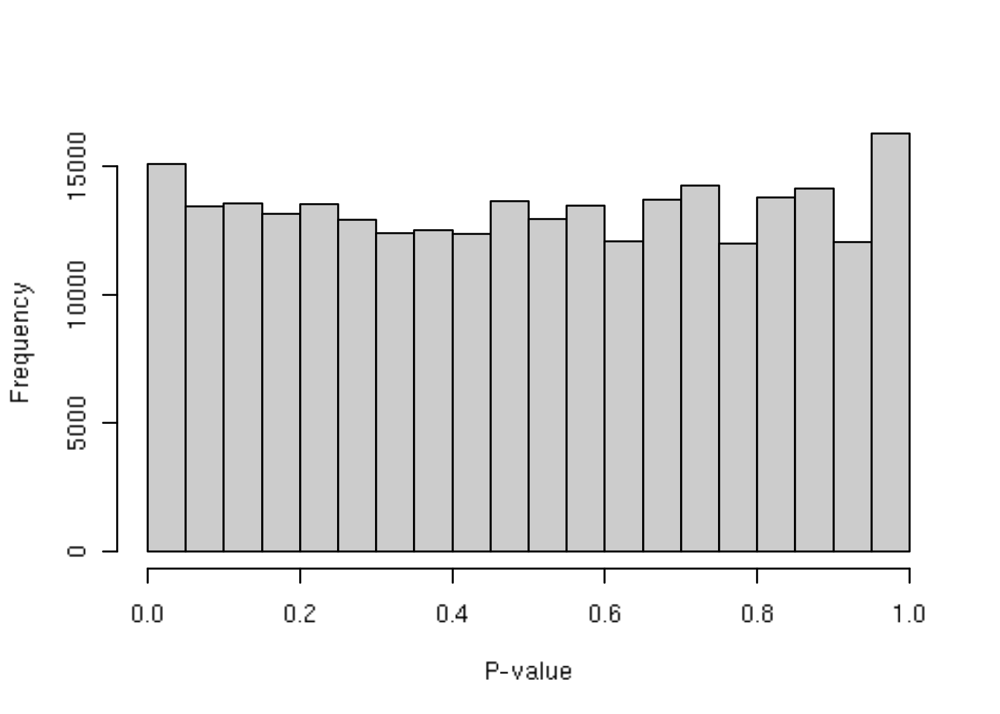
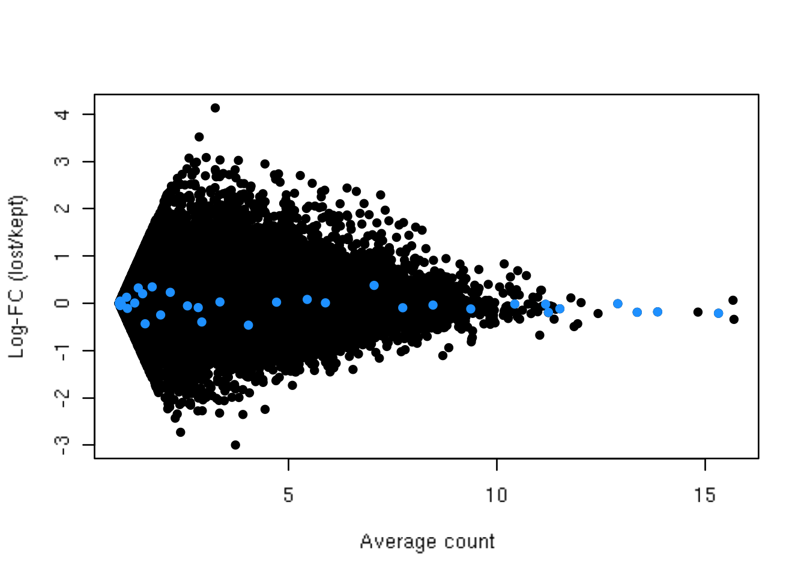
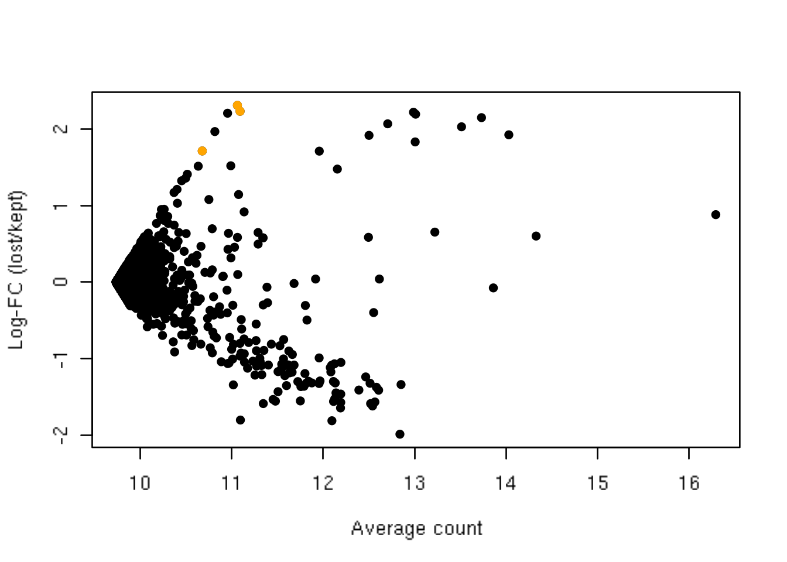

---
output:
  html_document
bibliography: ../ref.bib
---

# Quality Control

<script>
document.addEventListener("click", function (event) {
    if (event.target.classList.contains("aaron-collapse")) {
        event.target.classList.toggle("active");
        var content = event.target.nextElementSibling;
        if (content.style.display === "block") {
          content.style.display = "none";
        } else {
          content.style.display = "block";
        }
    }
})
</script>

<style>
.aaron-collapse {
  background-color: #eee;
  color: #444;
  cursor: pointer;
  padding: 18px;
  width: 100%;
  border: none;
  text-align: left;
  outline: none;
  font-size: 15px;
}

.aaron-content {
  padding: 0 18px;
  display: none;
  overflow: hidden;
  background-color: #f1f1f1;
}
</style>

## Motivation

Low-quality libraries in scRNA-seq data can arise from a variety of sources such as cell damage during dissociation or failure in library preparation (e.g., inefficient reverse transcription or PCR amplification).
These usually manifest as "cells" with low total counts, few expressed genes and high mitochondrial or spike-in proportions.
These low-quality libraries are problematic as they can contribute to misleading results in downstream analyses:

- They form their own distinct cluster(s), complicating interpretation of the results.
This can be most obviously driven by increased mitochondrial proportions or enrichment for nuclear RNAs after cell damage.
However, very small libraries can also form their own clusters due to shifts in the mean upon transformation [@lun2018overcoming].
- They contain genes that appear to be strongly "upregulated" due to aggressive scaling to normalize for small library sizes.
This is most problematic for contaminating transcripts (e.g., from the ambient solution) that are present in all libraries at low but constant levels.
Increased scaling in low-quality libraries transforms small counts for these transcripts in large normalized expression values, resulting in apparent upregulation compared to other cells.
- They distort the characterization of population heterogeneity during variance estimation or principal components analysis.
The first few principal components will capture differences in quality rather than biology, reducing the effectiveness of dimensionality reduction.
Similarly, genes with the largest variances will be driven by differences between low- and high-quality cells.

To avoid - or at least mitigate - these problems, we need to remove these cells at the start of the analysis.
This step is commonly referred to as quality control (QC) on the cells.
(We will use "library" and "cell" rather interchangeably here, though the distinction will become important when dealing with droplet-based data.)
We will demonstrate using a small scRNA-seq dataset from @lun2017assessing, which is provided with no prior QC so that we can apply our own procedures.

<button class="aaron-collapse">View history</button>
<div class="aaron-content">
   
```r
### loading ###
library(scRNAseq)
sce.416b <- LunSpikeInData(which="416b") 
```

</div>


```r
sce.416b
```

```
## class: SingleCellExperiment 
## dim: 46604 192 
## metadata(0):
## assays(1): counts
## rownames(46604): ENSMUSG00000102693 ENSMUSG00000064842 ...
##   ENSMUSG00000095742 CBFB-MYH11-mcherry
## rowData names(1): Length
## colnames(192): SLX-9555.N701_S502.C89V9ANXX.s_1.r_1
##   SLX-9555.N701_S503.C89V9ANXX.s_1.r_1 ...
##   SLX-11312.N712_S508.H5H5YBBXX.s_8.r_1
##   SLX-11312.N712_S517.H5H5YBBXX.s_8.r_1
## colData names(9): Source Name cell line ... spike-in addition
##   block
## reducedDimNames(0):
## spikeNames(0):
## altExpNames(2): ERCC SIRV
```

## Choice of QC metrics

We use several common QC metrics to identify low-quality cells based on their expression profiles.
These metrics are described below in terms of reads for SMART-seq2 data, but the same definitions apply to UMI data generated by other technologies like MARS-seq and droplet-based protocols.

- The library size is defined as the total sum of counts across all relevant features for each cell.
Here, we will consider the relevant features to be the endogenous genes.
Cells with small library sizes are of low quality as the RNA has been lost at some point during library preparation,
either due to cell lysis or inefficient cDNA capture and amplification.
- The number of expressed features in each cell is defined as the number of endogenous genes with non-zero counts for that cell.
Any cell with very few expressed genes is likely to be of poor quality as the diverse transcript population has not been successfully captured.
- The proportion of reads mapped to spike-in transcripts is calculated relative to the total count across all features (including spike-ins) for each cell.
As the same amount of spike-in RNA should have been added to each cell, any enrichment in spike-in counts is symptomatic of loss of endogenous RNA.
Thus, high proportions are indicative of poor-quality cells where endogenous RNA has been lost due to, e.g., partial cell lysis or RNA degradation during dissociation.
- In the absence of spike-in transcripts, the proportion of reads mapped to genes in the mitochondrial genome can be used.
High proportions are indicative of poor-quality cells [@islam2014quantitative;@ilicic2016classification], possibly because of loss of cytoplasmic RNA from perforated cells.
The reasoning is that mitochondria are larger than individual transcript molecules and less likely to escape through holes in the cell membrane.

For each cell, we calculate these QC metrics using the `perCellQCMetrics()` function from the *[scater](https://bioconductor.org/packages/3.10/scater)* package [@mccarthy2017scater].
The `sum` column contains the total count for each cell,
the `detected` column contains the number of detected genes,
`subsets_Mito_percent` contains the percentage of reads mapped to mitochondrial transcripts (based on Ensembl annotation)
and `altexps_ERCC_percent` contains the percentage of reads mapped to ERCC transcripts.


```r
# Identifying the mitochondrial transcripts:
library(AnnotationHub)
ens.mm.v97 <- AnnotationHub()[["AH73905"]]
location <- mapIds(ens.mm.v97, keys=rownames(sce.416b),
    keytype="GENEID", column="SEQNAME")
is.mito <- which(location=="MT")

# Computing the QC metrics.
library(scater)
df <- perCellQCMetrics(sce.416b, subsets=list(Mito=is.mito))
df
```

```
## DataFrame with 192 rows and 16 columns
##           sum  detected   percent_top_50  percent_top_100  percent_top_200
##     <integer> <integer>        <numeric>        <numeric>        <numeric>
## 1      865936      7618 26.7218362557972 32.2773276546997 39.7208338722492
## 2     1076277      7521 29.4043262097025 35.0354044544295  42.258080401235
## 3     1180138      8306 27.3453613052033 32.4769645583822 39.3295529844815
## 4     1342593      8143  35.809213961342 40.2666332984009 46.2459583805368
## 5     1668311      7154 34.1197774275899 39.0901336741171 45.6660059185607
## ...       ...       ...              ...              ...              ...
## 188    776622      8174  45.936246977294 49.7010128479492 54.6100934560185
## 189   1299950      8956 38.0829262663949 42.8929574214393 49.0621946997961
## 190   1800696      9530 30.6675307769885 35.5838520216627 41.8550382740896
## 191     46731      6649 32.2997581904945 37.9148744944469 44.5999443624147
## 192   1866692     10964 26.6632095707273 31.2583972074665 37.5607759608977
##      percent_top_500 subsets_Mito_sum subsets_Mito_detected
##            <numeric>        <integer>             <integer>
## 1   52.9037942757894            78790                    20
## 2   55.7454075484285            98613                    20
## 3   51.9336721637639           100341                    19
## 4   57.1209592184675           104882                    20
## 5   58.2004194661547           129559                    22
## ...              ...              ...                   ...
## 188 64.4249068401359            48126                    20
## 189 60.6674872110466           112225                    25
## 190 53.6780778099135           135693                    23
## 191 56.5235068798014             3505                    16
## 192 48.9489428357758           150375                    29
##     subsets_Mito_percent altexps_ERCC_sum altexps_ERCC_detected
##                <numeric>        <integer>             <integer>
## 1       9.09882485541657            65278                    39
## 2       9.16241822504801            74748                    40
## 3       8.50248021841514            60878                    42
## 4        7.8118983191481            60073                    42
## 5       7.76587818458309           136810                    44
## ...                  ...              ...                   ...
## 188     6.19683707131655            61575                    39
## 189     8.63302434709027            94982                    41
## 190      7.5355862399872           113707                    40
## 191     7.50037448374741             7580                    44
## 192     8.05569424414954            48664                    39
##     altexps_ERCC_percent altexps_SIRV_sum altexps_SIRV_detected
##                <numeric>        <integer>             <integer>
## 1       6.80658407035354            27828                     7
## 2       6.28029958040595            39173                     7
## 3       4.78949297995239            30058                     7
## 4       4.18566507433069            32542                     7
## 5       7.28887127185236            71850                     7
## ...                  ...              ...                   ...
## 188     7.17619705260214            19848                     7
## 189     6.65764326634008            31729                     7
## 190     5.81467119470586            41116                     7
## 191      13.488984589102             1883                     7
## 192     2.51930349520745            16289                     7
##     altexps_SIRV_percent     total
##                <numeric> <integer>
## 1        2.9016456005055    959042
## 2       3.29130111124368   1190198
## 3       2.36477183861837   1271074
## 4       2.26740653619545   1435208
## 5       3.82797603159559   1876971
## ...                  ...       ...
## 188     2.31316539342342    858045
## 189     2.22400416076419   1426661
## 190     2.10256203084705   1955519
## 191     3.35089155425846     56194
## 192    0.843270890872805   1931645
```

```
## <integer>

## 865936

## 1076277

## 1180138

## 1342593

## 1668311

## ...

## 776622

## 1299950

## 1800696

## 46731

## 1866692

## <integer>

## 7618

## 7521

## 8306

## 8143

## 7154

## ...

## 8174

## 8956

## 9530

## 6649

## 10964

## <numeric>

## 26.7218362557972

## 29.4043262097025

## 27.3453613052033

## 35.809213961342

## 34.1197774275899

## ...

## 45.936246977294

## 38.0829262663949

## 30.6675307769885

## 32.2997581904945

## 26.6632095707273

## <numeric>

## 32.2773276546997

## 35.0354044544295

## 32.4769645583822

## 40.2666332984009

## 39.0901336741171

## ...

## 49.7010128479492

## 42.8929574214393

## 35.5838520216627

## 37.9148744944469

## 31.2583972074665

## <numeric>

## 39.7208338722492

## 42.258080401235

## 39.3295529844815

## 46.2459583805368

## 45.6660059185607

## ...

## 54.6100934560185

## 49.0621946997961

## 41.8550382740896

## 44.5999443624147

## 37.5607759608977

## <numeric>

## 52.9037942757894

## 55.7454075484285

## 51.9336721637639

## 57.1209592184675

## 58.2004194661547

## ...

## 64.4249068401359

## 60.6674872110466

## 53.6780778099135

## 56.5235068798014

## 48.9489428357758

## <integer>

## 78790

## 98613

## 100341

## 104882

## 129559

## ...

## 48126

## 112225

## 135693

## 3505

## 150375

## <integer>

## 20

## 20

## 19

## 20

## 22

## ...

## 20

## 25

## 23

## 16

## 29

## <numeric>

## 9.09882485541657

## 9.16241822504801

## 8.50248021841514

## 7.8118983191481

## 7.76587818458309

## ...

## 6.19683707131655

## 8.63302434709027

## 7.5355862399872

## 7.50037448374741

## 8.05569424414954

## <integer>

## 65278

## 74748

## 60878

## 60073

## 136810

## ...

## 61575

## 94982

## 113707

## 7580

## 48664

## <integer>

## 39

## 40

## 42

## 42

## 44

## ...

## 39

## 41

## 40

## 44

## 39

## <numeric>

## 6.80658407035354

## 6.28029958040595

## 4.78949297995239

## 4.18566507433069

## 7.28887127185236

## ...

## 7.17619705260214

## 6.65764326634008

## 5.81467119470586

## 13.488984589102

## 2.51930349520745

## <integer>

## 27828

## 39173

## 30058

## 32542

## 71850

## ...

## 19848

## 31729

## 41116

## 1883

## 16289

## <integer>

## 7

## 7

## 7

## 7

## 7

## ...

## 7

## 7

## 7

## 7

## 7

## <numeric>

## 2.9016456005055

## 3.29130111124368

## 2.36477183861837

## 2.26740653619545

## 3.82797603159559

## ...

## 2.31316539342342

## 2.22400416076419

## 2.10256203084705

## 3.35089155425846

## 0.843270890872805

## <integer>

## 959042

## 1190198

## 1271074

## 1435208

## 1876971

## ...

## 858045

## 1426661

## 1955519

## 56194

## 1931645
```

## Identifying low-quality cells

### With fixed thresholds

The simplest approach to identifying low-quality cells is to apply thresholds on the QC metrics.
For example, we might discard all cells that have library sizes below 100,000 reads; express fewer than 5,000 genes; have spike-in proportions above 10%; or have mitochondrial proportions above 10%^[These numbers were rectally derived.].


```r
qc.lib <- df$sum < 1e5
qc.nexprs <- df$detected < 5e3
qc.spike <- df$altexps_ERCC_percent > 10
qc.mito <- df$subsets_Mito_percent > 10
discard <- qc.lib | qc.nexprs | qc.spike | qc.mito

# Summarize the number of cells removed for each reason.
DataFrame(LibSize=sum(qc.lib), NExprs=sum(qc.nexprs),
    SpikeProp=sum(qc.spike), MitoProp=sum(qc.mito), Total=sum(discard))
```

```
## DataFrame with 1 row and 5 columns
##     LibSize    NExprs SpikeProp  MitoProp     Total
##   <integer> <integer> <integer> <integer> <integer>
## 1         3         0        19        14        33
```

```
## <integer>

## 3

## <integer>

## 0

## <integer>

## 19

## <integer>

## 14

## <integer>

## 33
```

```r
# Retain only high-quality cells in the SingleCellExperiment.
filtered <- sce.416b[,!discard]
dim(filtered)
```

```
## [1] 46604   159
```

While simple, this strategy generally requires considerable experience to determine appropriate thresholds for each experimental protocol and biological system.
For example, thresholds for read count-based data are simply not applicable for UMI-based data, and vice versa.
Indeed, even with the same protocol and system, the appropriate threshold can vary from run to run due to the vagaries of cDNA capture efficiency and sequencing depth.

### With adaptive thresholds {#quality-control-outlier}

To obtain an adaptive threshold, we assume that most of the dataset consists of high-quality cells.
We then identify cells that are outliers for the various QC metrics, based on the median absolute deviation (MAD) from the median value of each metric across all cells.
Specifically, a value is considered an outlier if it is more than 3 MADs from the median in the "problematic" direction.
This is loosely motivated by the fact that such a filter will retain 99% of non-outlier values that follow a normal distribution.

For the 416B data, we identify cells with log-transformed library sizes that are more than 3 MADs below the median. 
A log-transformation is used to improve resolution at small values when `type="lower"`.
In particular, it guarantees that the threshold is not a negative value, which would be meaningless for quality control on these metrics.
Moreover, these metrics can occasionally exhibit a heavy right tail, and the log-transformation makes the distribution seem more normal to justify the 99% rationale mentioned above.


```r
qc.lib2 <- isOutlier(df$sum, log=TRUE, nmads=3, type="lower")
```

We do the same for the log-transformed number of expressed genes. 


```r
qc.nexprs2 <- isOutlier(df$detected, nmads=3, log=TRUE, type="lower")
```

`isOutlier()` will also return the exact filter thresholds for each metric.
These is useful for checking whether the automatically selected thresholds are appropriate.


```r
attr(qc.lib2, "thresholds")
```

```
##  lower higher 
## 434083    Inf
```

```r
attr(qc.nexprs2, "thresholds")
```

```
##  lower higher 
##   5231    Inf
```

We identify outliers for the proportion-based metrics in a similar manner.
Here, no transformation is required as we are identifying large outliers that should already be clearly distinguishable from zero.


```r
qc.spike2 <- isOutlier(df$altexps_ERCC_percent, nmads=3, type="higher")
qc.mito2 <- isOutlier(df$subsets_Mito_percent, nmads=3, type="higher")
```

A cell that is an outlier for any of these metrics is considered to be of low-quality and discarded.


```r
discard2 <- qc.lib2 | qc.nexprs2 | qc.spike2 | qc.mito2

# Summarize the number of cells removed for each reason.
DataFrame(LibSize=sum(qc.lib2), NExprs=sum(qc.nexprs2),
    SpikeProp=sum(qc.spike2), MitoProp=sum(qc.mito2), Total=sum(discard2))
```

```
## DataFrame with 1 row and 5 columns
##     LibSize    NExprs SpikeProp  MitoProp     Total
##   <integer> <integer> <integer> <integer> <integer>
## 1         4         0         1         2         6
```

```
## <integer>

## 4

## <integer>

## 0

## <integer>

## 1

## <integer>

## 2

## <integer>

## 6
```

Alternatively, this entire process can be done in a single step using the `quickCellQC()` function.
This is a convenient wrapper function that simply calls `isOutlier()` with the settings demonstrated above.


```r
reasons <- quickCellQC(df, percent_subsets=c("subsets_Mito_percent",
    "altexps_ERCC_percent"), nmads=3)
colSums(as.matrix(reasons))
```

```
##              low_lib_size            low_n_features 
##                         4                         0 
## high_subsets_Mito_percent high_altexps_ERCC_percent 
##                         2                         1 
##                   discard 
##                         6
```

The actual filtering is achieved simply by subsetting the `SingleCellExperiment` as previously shown.


```r
filtered2 <- sce.416b[,!discard2]
```

With this strategy, the thresholds adapt to both the location and spread of the distribution of values for a given metric.
This allows the QC procedure to adjust to changes in sequencing depth, cDNA capture efficiency, mitochondrial content, etc. without requiring any user intervention or prior experience.
However, it does require some implicit assumptions that are discussed below in more detail.

### Considering experimental factors 

More complex studies may involve batches of cells generated at different times or in different systems.
In such cases, the adaptive strategy should be applied to each batch separately. 
It makes little sense to compute medians and MADs from a mixture distribution containing samples from multiple batches.
For example, if the sequencing coverage is lower in one batch compared to the others, it will drag down the median and inflate the MAD.
This will reduce the suitability of the adaptive threshold for the other batches.

If each batch is represented by its own `SingleCellExperiment`, the `isOutlier()` function can be directly applied to each batch as shown above.
However, if cells from all batches have been merged into a single `SingleCellExperiment`, the `batch=` argument should be used to ensure that outliers are identified _within_ each batch.
This allows `isOutlier()` to accommodate systematic differences in the QC metrics across batches.

We will again illustrate using the 416B dataset, which actually contains two experimental factors - plate of origin and oncogene induction status.
(We had been ignoring this in the previous section for simplicity, but no longer.)
We combine these factors together and use this in the `batch=` argument to `isOutlier()` via `quickCellQC()`.
This results in the removal of more cells as the MAD is no longer inflated by (i) systematic differences in sequencing depth between batches and (ii) differences in number of genes expressed upon oncogene induction.


```r
batch <- paste0(sce.416b$phenotype, "-", sce.416b$Plate)
batch.reasons <- quickCellQC(df, percent_subsets=c("subsets_Mito_percent",
    "altexps_ERCC_percent"), nmads=3, batch=batch)

colSums(as.matrix(batch.reasons))
```

```
##              low_lib_size            low_n_features 
##                         4                         2 
## high_subsets_Mito_percent high_altexps_ERCC_percent 
##                         2                         4 
##                   discard 
##                         7
```

```r
# Retain only high-quality cells in the SingleCellExperiment.
filtered3 <- sce.416b[,!batch.reasons$discard]
```
## Checking diagnostic plots

TODO.

## Droplet-specific procedures

### Background

An interesting aspect of droplet-based data is that we have no prior knowledge about whether a particular library (i.e., cell barcode) corresponds to cell-containing or empty droplets.
Thus, we need to call cells from empty droplets based on the observed expression profiles.
This is not entirely straightforward as empty droplets can contain ambient (i.e., extracellular) RNA that can be captured and sequenced, resulting in non-zero counts for libraries that do not contain any cell.

To demonstrate, we obtain the **unfiltered** count matrix for the PBMC dataset from 10X Genomics.
This has not been subjected to the cell filtering algorithm method in the _CellRanger_ software suite, allowing us to apply our own algorithms for identifying the libraries that correspond to cells.


```r
# Hoping to shovel this code into TENxPBMCData.
# Just bear with it for now.
library(BiocFileCache)
bfc <- BiocFileCache("raw_data", ask = FALSE)
raw.path <- bfcrpath(bfc, file.path("http://cf.10xgenomics.com/samples",
    "cell-exp/2.1.0/pbmc4k/pbmc4k_raw_gene_bc_matrices.tar.gz"))
untar(raw.path, exdir=file.path(tempdir(), "pbmc4k"))

library(DropletUtils)
library(Matrix)
fname <- file.path(tempdir(), "pbmc4k/raw_gene_bc_matrices/GRCh38")
sce.pbmc <- read10xCounts(fname, col.names=TRUE)
sce.pbmc
```

```
## class: SingleCellExperiment 
## dim: 33694 737280 
## metadata(0):
## assays(1): counts
## rownames(33694): ENSG00000243485 ENSG00000237613 ...
##   ENSG00000277475 ENSG00000268674
## rowData names(2): ID Symbol
## colnames(737280): AAACCTGAGAAACCAT-1 AAACCTGAGAAACCGC-1 ...
##   TTTGTCATCTTTAGTC-1 TTTGTCATCTTTCCTC-1
## colData names(2): Sample Barcode
## reducedDimNames(0):
## spikeNames(0):
## altExpNames(0):
```

The distribution of total counts exhibits a sharp transition between barcodes with large and small total counts (Figure \@ref(fig:rankplot)), probably corresponding to cell-containing and empty droplets respectively.


```r
bcrank <- barcodeRanks(counts(sce.pbmc))

# Only showing unique points for plotting speed.
uniq <- !duplicated(bcrank$rank)
plot(bcrank$rank[uniq], bcrank$total[uniq], log="xy",
    xlab="Rank", ylab="Total UMI count", cex.lab=1.2)

abline(h=metadata(bcrank)$inflection, col="darkgreen", lty=2)
abline(h=metadata(bcrank)$knee, col="dodgerblue", lty=2)

legend("bottomleft", legend=c("Inflection", "Knee"), 
        col=c("darkgreen", "dodgerblue"), lty=2, cex=1.2)
```

<div class="figure">

<p class="caption">(\#fig:rankplot)Total UMI count for each barcode in the PBMC dataset, plotted against its rank (in decreasing order of total counts). The inferred locations of the inflection and knee points are also shown.</p>
</div>

### Testing for empty droplets

We use the `emptyDrops()` function to test whether the expression profile for each cell barcode is significantly different from the ambient RNA pool [@lun2018distinguishing].
Any significant deviation indicates that the barcode corresponds to a cell-containing droplet.
We call cells at a false discovery rate (FDR) of 0.1%, meaning that no more than 0.1% of our called barcodes should be empty droplets on average.


```r
set.seed(100)
e.out <- emptyDrops(counts(sce.pbmc))
sum(e.out$FDR <= 0.001, na.rm=TRUE)
```

```
## [1] 4233
```

`emptyDrops()` computes Monte Carlo $p$-values based on a Dirichlet-multinomial model of sampling molecules into droplets.
These $p$-values are stochastic so it is important to set the random seed to obtain reproducible results.
The stability of the Monte Carlo $p$-values depends on the number of iterations used to compute them. 
This is controlled using the `niters=` argument in `emptyDrops()`, set to a default of 10000 for speed.
Larger values improve stability with the only cost being that of time, so users should set `niters=` to the largest value they are willing to wait for.

`emptyDrops()` assumes that libraries with total UMI counts below a certain threshold (`lower=100` by default) correspond to empty droplets.
These are used to estimate the ambient expression profile against which the remaining libraries are tested.
Under this definition, these low-count libraries cannot be cell-containing droplets and are excluded from the hypothesis testing - hence the `NA`s in the output of the function.

To retain only the detected cells, we subset our `SingleCellExperiment` object.
Discerning readers will notice the use of `which()`, which conveniently removes the `NA`s prior to the subsetting.


```r
# using which() to automatically remove NAs.
sce.pbmc <- sce.pbmc[,which(e.out$FDR <= 0.001)]
```

Users wanting to use the cell calling algorithm from the _CellRanger_ pipeline (version 2) can call `defaultDrops()` instead.
This tends to be quite conservative as it often discards genuine cells with low RNA content (and thus low total counts).
It also requires an _a priori_ estimate of the expected number of cells in the experiment, which may or may not be accurate.

(As an aside, _CellRanger_ version 3 automatically performs cell calling using an algorithm similar to `emptyDrops()`.
If we had started our analysis with the **filtered** count matrix, we would not need to run `emptyDrops()` manually as shown here.
Nonetheless, it may be desirable on occasions where more detailed inspection or control of the cell-calling statistics is desired.)

### Examining cell-calling diagnostics

The number of Monte Carlo iterations determines the lower bound for the $p$-values [@phipson2010permutation].
The `Limited` field in the output indicates whether or not the computed $p$-value for a particular barcode is bounded by the number of iterations.
If any non-significant barcodes are `TRUE` for `Limited`, we may need to increase the number of iterations.
A larger number of iterations will result in a lower $p$-value for these barcodes, which may allow them to be detected after correcting for multiple testing.


```r
table(Sig=e.out$FDR <= 0.001, Limited=e.out$Limited)
```

```
##        Limited
## Sig     FALSE TRUE
##   FALSE  1056    0
##   TRUE   1661 2572
```

As mentioned above, `emptyDrops()` assumes that barcodes with low total UMI counts are empty droplets.
Thus, the null hypothesis should be true for all of these barcodes. 
We can check whether the hypothesis testing procedure holds its size by examining the distribution of $p$-values for low-total barcodes with `test.ambient=TRUE`.
Ideally, the distribution should be close to uniform.


```r
full.data <- read10xCounts(fname, col.names=TRUE)

set.seed(100)
limit <- 100   
all.out <- emptyDrops(counts(full.data), lower=limit, test.ambient=TRUE)
hist(all.out$PValue[all.out$Total <= limit & all.out$Total > 0],
    xlab="P-value", main="", col="grey80") 
```

<div class="figure">

<p class="caption">(\#fig:ambientpvalhist)Distribution of $p$-values for the assumed empty droplets.</p>
</div>

Large peaks near zero indicate that barcodes with total counts below `lower` are not all ambient in origin.
This can be resolved by decreasing `lower` further to ensure that barcodes corresponding to droplets with very small cells are not used to estimate the ambient profile.

While `emptyDrops()` will distinguish cells from empty droplets, it makes no statement about the quality of the cells.
It is entirely possible for droplets to contain damaged or dying cells, which need to be removed prior to downstream analysis.
This can be done using the outlier-based strategy to set data-adaptive thresholds on the mitochondrial proportion.
(`emptyDrops()` will already remove cells with low library sizes or number of expressed genes, so further filtering on these metrics is generally not necessary.)

## Assumptions of outlier detection

### Overview

The use of `isOutlier()` (Section \@ref(quality-control-outlier)) is a general and effective strategy for identifying and removing low-quality cells.
However, it involves a number of assumptions about the experiment and biological system, and while these assumptions are mostly reasonable, users should still keep them in mind when interpreting the results^["Be alert, not alarmed" - for those who remember the Australian Government's indoctrination - uh, I mean, counter-terror campaign.].

An outlier-based definition for low-quality cells assumes that most cells are of acceptable quality.
This is usually a reasonable expectation and can be experimentally supported in some situations by visually checking that the cells are intact, e.g., on the microwell plate.
If most cells are of (unacceptably) low quality, the adaptive thresholds will fail as they cannot remove the majority of cells.
Of course, what is acceptable or not is in the eye of the beholder - neurons, for example, are notoriously difficult to dissociate, and we would often retain cells in a neuronal scRNA-seq dataset with QC metrics that would be unacceptable in a more amenable system like embryonic stem cells.

Another assumption is that the QC metrics are independent of the biological state of each cell.
This implies that any outlier values for these metrics are driven by technical factors rather than biological processes.
Thus, removing cells based on the metrics will not misrepresent the biology in downstream analyses.
This assumption is most likely to be violated in highly heterogeneous cell populations.
For example, some cell types may naturally have less RNA or express fewer genes than other cell types.
These cell types are more likely to be considered outliers and removed, even if they are of high quality.
QC filtering based on outliers may not be appropriate in such cases. 

The use of the MAD mitigates this problem by accounting for biological variability in the QC metrics.
A heterogeneous population should have higher variability in the metrics among high-quality cells, increasing the MAD and reducing the chance of incorrectly removing particular cell types (at the cost of reducing power to remove low-quality cells).
Systematic differences in the QC metrics can be handled to some extent using the `batch=` argument in the `isOutlier()` function.
However, this is not applicable in experiments where the relevant factors (e.g., cell type) are not known in advance.

### Checking for discarded cell types

The biggest practical concern with the assumptions is whether a cell type is lost during the QC procedure.
We can diagnose this by looking for differences in gene expression between the discarded and retained cells.
To demonstrate, we compute the average count across the discarded and retained pools in the 416B data set, and we compute the log-fold change between the averages.


```r
lost <- calculateAverage(counts(sce.416b)[,!discard])
kept <- calculateAverage(counts(sce.416b)[,discard])

library(edgeR)
logged <- cpm(cbind(lost, kept), log=TRUE, prior.count=2)
logFC <- logged[,1] - logged[,2]
abundance <- rowMeans(logged)
```

If the discarded pool is enriched for a certain cell type, we should observe increased expression of the corresponding marker genes.
No systematic upregulation of genes is apparent in the discarded pool in Figure \@ref(fig:discardplot416b), suggesting that the QC step did not inadvertently filter out a cell type in the 416B dataset.


```r
plot(abundance, logFC, xlab="Average count", ylab="Log-FC (lost/kept)", pch=16)
points(abundance[is.mito], logFC[is.mito], col="dodgerblue", pch=16)
```

<div class="figure">

<p class="caption">(\#fig:discardplot416b)Log-fold change in expression in the discarded cells compared to the retained cells in the 416B dataset. Each point represents a gene with mitochondrial transcripts in blue.</p>
</div>

For comparison, let's pretend that we applied a fixed threshold on the library size to filter cells in the PBMC data set.
Specifically, we remove all libraries with a library size below 500.


```r
alt.discard <- colSums(counts(sce.pbmc)) < 500
lost <- calculateAverage(counts(sce.pbmc)[,alt.discard])
kept <- calculateAverage(counts(sce.pbmc)[,!alt.discard])

logged <- edgeR::cpm(cbind(lost, kept), log=TRUE, prior.count=2)
logFC <- logged[,1] - logged[,2]
abundance <- rowMeans(logged)
```

The presence of a distinct population in the discarded pool manifests in Figure \@ref(fig:discardplotpbmc) as a set of genes that are strongly upregulated in `lost`.
This includes _PF4_, _PPBP_ and _CAVIN2_, which (spoiler alert!) indicates that there is a platelet population that has been discarded by `alt.discard`.


```r
plot(abundance, logFC, xlab="Average count", ylab="Log-FC (lost/kept)", pch=16)
platelet <- c("PF4", "PPBP", "CAVIN2")

library(org.Hs.eg.db)
ids <- mapIds(org.Hs.eg.db, keys=platelet, column="ENSEMBL", keytype="SYMBOL")
points(abundance[ids], logFC[ids], col="orange", pch=16)
```

<div class="figure">

<p class="caption">(\#fig:discardplotpbmc)Average counts across all discarded and retained cells in the PBMC dataset, after using a more stringent filter on the total UMI count. Each point represents a gene, with platelet-related genes highlighted in orange.</p>
</div>

If we suspect that cell types have been incorrectly discarded by our QC procedure, the most direct solution is to relax the QC filters by increasing `nmads=` in the `isOutlier()` calls.
We can also avoid filtering on metrics that are associated with genuine biological differences between cell types.

As an aside, it is worth mentioning that the true technical quality of a cell may also be correlated with its type.
(This differs from a correlation between the cell type and the QC metrics, as the latter are our imperfect proxies for quality.)
This can arise if some cell types are not amenable to dissociation or microfluidics handling during the scRNA-seq protocol.
In such cases, it is possible to "correctly" discard an entire cell type during QC if all of its cells are damaged.
Indeed, concerns over the computational removal of cell types during QC are probably minor compared to losses in the experimental protocol.

## Session Info {-}

<button class="aaron-collapse">View session info</button>
<div class="aaron-content">
```
R version 3.6.1 (2019-07-05)
Platform: x86_64-pc-linux-gnu (64-bit)
Running under: Ubuntu 14.04.5 LTS

Matrix products: default
BLAS/LAPACK: /app/easybuild/software/OpenBLAS/0.2.18-GCC-5.4.0-2.26-LAPACK-3.6.1/lib/libopenblas_prescottp-r0.2.18.so

locale:
 [1] LC_CTYPE=en_US.UTF-8       LC_NUMERIC=C              
 [3] LC_TIME=en_US.UTF-8        LC_COLLATE=en_US.UTF-8    
 [5] LC_MONETARY=en_US.UTF-8    LC_MESSAGES=en_US.UTF-8   
 [7] LC_PAPER=en_US.UTF-8       LC_NAME=C                 
 [9] LC_ADDRESS=C               LC_TELEPHONE=C            
[11] LC_MEASUREMENT=en_US.UTF-8 LC_IDENTIFICATION=C       

attached base packages:
[1] parallel  stats4    stats     graphics  grDevices utils     datasets 
[8] methods   base     

other attached packages:
 [1] org.Hs.eg.db_3.8.2          edgeR_3.27.12              
 [3] limma_3.41.15               Matrix_1.2-17              
 [5] DropletUtils_1.5.7          scater_1.13.17             
 [7] ggplot2_3.2.1               ensembldb_2.9.5            
 [9] AnnotationFilter_1.9.0      GenomicFeatures_1.37.4     
[11] AnnotationDbi_1.47.1        AnnotationHub_2.17.7       
[13] BiocFileCache_1.9.1         dbplyr_1.4.2               
[15] SingleCellExperiment_1.7.7  SummarizedExperiment_1.15.8
[17] DelayedArray_0.11.4         BiocParallel_1.19.2        
[19] matrixStats_0.54.0          Biobase_2.45.0             
[21] GenomicRanges_1.37.14       GenomeInfoDb_1.21.1        
[23] IRanges_2.19.14             S4Vectors_0.23.20          
[25] BiocGenerics_0.31.5         BiocStyle_2.13.2           
[27] Cairo_1.5-10               

loaded via a namespace (and not attached):
 [1] ProtGenerics_1.17.4           bitops_1.0-6                 
 [3] bit64_0.9-7                   progress_1.2.2               
 [5] httr_1.4.1                    tools_3.6.1                  
 [7] backports_1.1.4               R6_2.4.0                     
 [9] irlba_2.3.3                   HDF5Array_1.13.5             
[11] vipor_0.4.5                   DBI_1.0.0                    
[13] lazyeval_0.2.2                colorspace_1.4-1             
[15] withr_2.1.2                   gridExtra_2.3                
[17] tidyselect_0.2.5              prettyunits_1.0.2            
[19] bit_1.1-14                    curl_4.0                     
[21] compiler_3.6.1                BiocNeighbors_1.3.3          
[23] rtracklayer_1.45.4            bookdown_0.13                
[25] scales_1.0.0                  askpass_1.1                  
[27] rappdirs_0.3.1                stringr_1.4.0                
[29] digest_0.6.20                 Rsamtools_2.1.4              
[31] R.utils_2.9.0                 rmarkdown_1.13               
[33] XVector_0.25.0                pkgconfig_2.0.2              
[35] htmltools_0.3.6               highr_0.8                    
[37] rlang_0.4.0                   RSQLite_2.1.2                
[39] shiny_1.3.2                   DelayedMatrixStats_1.7.1     
[41] R.oo_1.22.0                   dplyr_0.8.3                  
[43] RCurl_1.95-4.12               magrittr_1.5                 
[45] BiocSingular_1.1.5            GenomeInfoDbData_1.2.1       
[47] Rhdf5lib_1.7.4                Rcpp_1.0.2                   
[49] ggbeeswarm_0.6.0              munsell_0.5.0                
[51] viridis_0.5.1                 R.methodsS3_1.7.1            
[53] stringi_1.4.3                 yaml_2.2.0                   
[55] zlibbioc_1.31.0               rhdf5_2.29.0                 
[57] grid_3.6.1                    blob_1.2.0                   
[59] dqrng_0.2.1                   promises_1.0.1               
[61] crayon_1.3.4                  lattice_0.20-38              
[63] Biostrings_2.53.2             hms_0.5.1                    
[65] locfit_1.5-9.1                zeallot_0.1.0                
[67] knitr_1.24                    pillar_1.4.2                 
[69] biomaRt_2.41.8                XML_3.98-1.20                
[71] glue_1.3.1                    evaluate_0.14                
[73] BiocManager_1.30.4            vctrs_0.2.0                  
[75] httpuv_1.5.1                  gtable_0.3.0                 
[77] openssl_1.4.1                 purrr_0.3.2                  
[79] assertthat_0.2.1              xfun_0.9                     
[81] rsvd_1.0.2                    mime_0.7                     
[83] xtable_1.8-4                  later_0.8.0                  
[85] viridisLite_0.3.0             tibble_2.1.3                 
[87] beeswarm_0.2.3                GenomicAlignments_1.21.5     
[89] memoise_1.1.0                 interactiveDisplayBase_1.23.0
```
</div>

## References {-}
