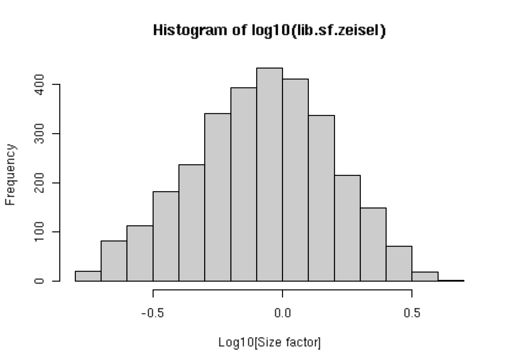
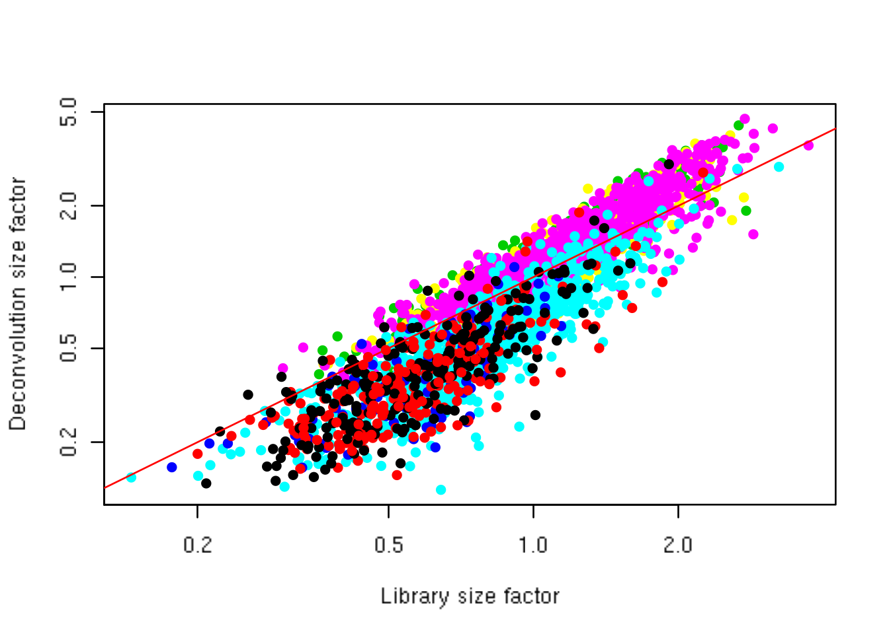
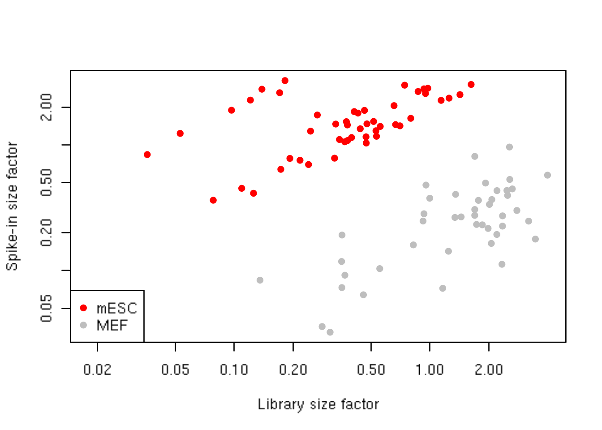

---
output:
  html_document
bibliography: ../ref.bib
---

# Normalization 

<script>
document.addEventListener("click", function (event) {
    if (event.target.classList.contains("aaron-collapse")) {
        event.target.classList.toggle("active");
        var content = event.target.nextElementSibling;
        if (content.style.display === "block") {
          content.style.display = "none";
        } else {
          content.style.display = "block";
        }
    }
})
</script>

<style>
.aaron-collapse {
  background-color: #eee;
  color: #444;
  cursor: pointer;
  padding: 18px;
  width: 100%;
  border: none;
  text-align: left;
  outline: none;
  font-size: 15px;
}

.aaron-content {
  padding: 0 18px;
  display: none;
  overflow: hidden;
  background-color: #f1f1f1;
}
</style>

## Motivation

Systematic differences in coverage between libraries are often observed in single-cell RNA sequencing data.
This typically arises from differences in cDNA capture or PCR amplification efficiency across cells, attributable to the difficulty of achieving consistent library preparation with minimal starting material^["Back in my day, we needed a million cells to get a single sample! Kids these days, with their microfluidics... Hey! Get off my lawn!"].
Normalization aims to remove these systematic differences such that they do not interfere with comparisons of the expression profiles between cells, e.g., during clustering or differential expression analyses.

At this point, it is worth being clear on what we mean by "systematic differences".
For the purposes of this chaper, systematic differences refer to biases that affect all genes in a similar manner.
This includes, for example, a change in sequencing depth that scales the expected coverage of all genes by a certain factor.
One can also consider more complex scaling effects, e.g., with respect to gene abundance, which would require non-linear normalization methods reminiscent of microarray^[For the younger readers, this is an old-school technology where oligos were attached to a solid surface and hybridized to cDNA that was labelled with a fluorescent dye. The fluorescence intensity at the attchment point was then used as a measure of expression.] analyses.
In contrast, general batch correction methods aim to remove gene-specific differences between batches that may not follow any predictable pattern across genes, and thus will not be considered in this chapter.

## Setting up the data

To demonstrate a range of normalization strategies in this section, we will be using the @zeisel2015brain dataset from the *[scRNAseq](https://bioconductor.org/packages/3.10/scRNAseq)* package.
This dataset was generated using the STRT/C1 protocol and contains UMI count data for 3005 cells from the mouse brain. 
ERCC spike-in transcripts were also added to each cell.
For the sake of brevity, we will trust that sufficient quality control on the cells has already been performed by the original authors.


```r
library(scRNAseq)
sce.zeisel <- ZeiselBrainData()
sce.zeisel 
```

```
## class: SingleCellExperiment 
## dim: 20006 3005 
## metadata(0):
## assays(1): counts
## rownames(20006): Tspan12 Tshz1 ... mt-Rnr1 mt-Nd4l
## rowData names(1): featureType
## colnames(3005): 1772071015_C02 1772071017_G12 ... 1772066098_A12
##   1772058148_F03
## colData names(10): tissue group # ... level1class level2class
## reducedDimNames(0):
## spikeNames(0):
## altExpNames(2): ERCC repeat
```

## Library size normalization

Scaling normalization is the simplest and most commonly used class of normalization strategies. 
This involves dividing all counts for each cell by a cell-specific scaling factor, often called a "size factor".
The assumption here is that any cell-specific bias (e.g., in capture or amplification efficiency) affects all genes equally via scaling of the expected mean count for that cell.
The size factor for each cell represents the estimate of the relative bias in that cell, so division of its counts by its size factor should remove that bias.
The resulting "normalized expression values" can then be used for downstream analyses such as clustering and dimensionality reduction.

Library size normalization is the simplest strategy for performing scaling normalization.
We define the library size as the total sum of counts across all genes for each cell.
The "library size factor" for each cell is then directly proportional to its library size, where the proportionality constant is defined such that the mean size factor across all cells is equal to 1.
This ensures that the normalized expression values are on the same scale as the original counts, which is useful for interpretation
 - especially when dealing with transformed data (see Section \@ref(normalization-transformation)).


```r
library(scater)
lib.sf.zeisel <- librarySizeFactors(sce.zeisel)
summary(lib.sf.zeisel)
```

```
##    Min. 1st Qu.  Median    Mean 3rd Qu.    Max. 
##   0.172   0.544   0.864   1.000   1.290   4.247
```

In the Zeisel brain data, the library size factors differ by up to 10-fold across cells (Figure \@ref(fig:histlib)).
This is typical of the variability in coverage in scRNA-seq data. 


```r
hist(log10(lib.sf.zeisel), xlab="Log10[Size factor]", col='grey80')
```

<div class="figure">

<p class="caption">(\#fig:histlib)Distribution of size factors derived from the library size in the Zeisel brain dataset.</p>
</div>

Strictly speaking, the use of library size factors assumes that there is no "imbalance" in the differentially expressed (DE) genes between any pair of cells.
That is, any upregulation for a subset of genes is cancelled out by the same magnitude of downregulation in a different subset of genes.
This ensures that the library size is an unbiased estimate of the relative cell-specific bias^[Yes, "unbiased bias" is a bit Rumsfeldian.].
(Otherwise, the estimate would be compromised by composition biases, as discussed in @robinson2010scaling.)
This may not be true in scRNA-seq applications, which means that library size normalization may not yield accurate normalized expression values for downstream analyses.

In practice, normalization accuracy is not a major consideration for exploratory scRNA-seq data analyses.
Composition biases do not usually affect the separation of clusters, only the magnitude - and to a lesser extent, direction - of the log-fold changes between clusters or cell types.
As such, library size normalization is usually sufficient in many applications where the aim is to identify clusters and the top markers that define each cluster.

## Normalization by deconvolution

As previously mentioned, composition biases will be present when any unbalanced differential expression exists between samples.
Consider the simple example of two cells where a single gene $X$ is upregulated in one cell $A$ compared to the other cell $B$.
This upregulation means that either (i) more sequencing resources are devoted to $X$ in $A$, thus decreasing coverage of all other non-DE genes when the total library size of each cell is experimentally fixed (e.g., due to library quantification);
or (ii) the library size of $A$ increases when $X$ is assigned more reads or UMIs, increasing the library size factor and yielding smaller normalized expression values for all non-DE genes.
In both cases, the net effect is that non-DE genes in $A$ will incorrectly appear to be downregulated compared to $B$.

The removal of composition biases is a well-studied problem for bulk RNA sequencing data analysis.
Normalization can be performed with the `estimateSizeFactorsFromMatrix()` function in the *[DESeq2](https://bioconductor.org/packages/3.10/DESeq2)* package [@anders2010differential;@love2014moderated] or with the `calcNormFactors()` function [@robinson2010scaling] in the *[edgeR](https://bioconductor.org/packages/3.10/edgeR)* package.
These assume that most genes are not DE between cells.
Any systematic difference in count size across the non-DE majority of genes between two cells is assumed to represent bias that is used to compute an appropriate size factor for its removal.

However, single-cell data can be problematic for these bulk normalization methods due to the dominance of low and zero counts.
To overcome this, we pool counts from many cells to increase the size of the counts for accurate size factor estimation [@lun2016pooling].
Pool-based size factors are then "deconvolved" into cell-based factors for normalization of each cell's expression profile.
This is performed using the `computeSumFactors()` function from *[scran](https://bioconductor.org/packages/3.10/scran)*, as shown below.


```r
library(scran)
set.seed(100)
clust.zeisel <- quickCluster(sce.zeisel) 
table(clust.zeisel)
```

```
## clust.zeisel
##   1   2   3   4   5   6   7   8   9  10  11 
## 425 256 368 379 159 189 155 304 283 196 291
```

```r
deconv.sf.zeisel <- computeSumFactors(sce.zeisel, 
    cluster=clust.zeisel, sf.out=TRUE, min.mean=0.1)
summary(deconv.sf.zeisel)
```

```
##    Min. 1st Qu.  Median    Mean 3rd Qu.    Max. 
##   0.115   0.468   0.812   1.000   1.315   4.878
```

The above code contains several points worth elaborating on:

- We use a pre-clustering step with `quickCluster()` where cells in each cluster are normalized separately and the size factors are rescaled to be comparable across clusters.
This avoids the assumption that most genes are non-DE across the entire population - only a non-DE majority is required between pairs of clusters, which is a weaker assumption for highly heterogeneous populations.
- By default, `quickCluster()` will use an approximate algorithm for PCA based on methods from the *[irlba](https://CRAN.R-project.org/package=irlba)* package.
The approximation relies on stochastic initialization so we need to set the random seed (via `set.seed()`) for reproducibility.
- `sf.out=TRUE` simply instructs the function to return the size factors directly, rather than a `SingleCellExperiment` containing the size factors.
In the latter case, the size factors can be easily extracted with the `sizeFactors()` function.
- The deconvolution approach will eventually fail if too many counts are zero, manifesting as nonsensical negative size factors.
To avoid this, `computeSumFactors()` will automatically remove low-abundance genes with average counts below `min.mean`. 
For read count data, the default value of 1 is usually satisfactory, but UMI counts are naturally lower so we set `min.mean=0.1`.

We see that the deconvolution size factors exhibit cell type-specific deviations from the library size factors in Figure \@ref(fig:deconv-zeisel).
This is consistent with the presence of composition biases that are introduced by strong differential expression between cell types.
Use of the deconvolution size factors adjusts for these biases to improve normalization accuracy for downstream applications.


```r
plot(lib.sf.zeisel, deconv.sf.zeisel, xlab="Library size factor",
    ylab="Deconvolution size factor", log='xy', pch=16,
    col=as.integer(factor(sce.zeisel$level1class)))
abline(a=0, b=1, col="red")
```

<div class="figure">

<p class="caption">(\#fig:deconv-zeisel)Deconvolution size factor for each cell in the Zeisel brain dataset, compared to the equivalent size factor derived from the library size. The red line corresponds to identity between the two size factors.</p>
</div>

Accurate normalization is most important for procedures that involve estimation and interpretation of per-gene statistics.
For example, composition biases can compromise DE analyses by systematically shifting the log-fold changes in one direction or another.
However, it tends to provide less benefit over simple library size normalization for cell-based analyses such as clustering.
The presence of composition biases already implies strong differences in expression profiles, so changing the normalization strategy is unlikely to affect the outcome of a clustering procedure.

## Normalization by spike-ins

Spike-in normalization is based on the assumption that the same amount of spike-in RNA was added to each cell [@lun2017assessing].
Systematic differences in the coverage of the spike-in transcripts can only be due to cell-specific biases, e.g., in capture efficiency or sequencing depth.
To remove these biases, we equalize spike-in coverage across cells by scaling with "spike-in size factors".
Compared to the previous methods, spike-in normalization requires no assumption about the biology of the system (i.e., the absence of many DE genes).
Isntead, it assumes that the spike-in transcripts were (i) added at a constant level to each cell, and (ii) respond to biases in the same relative manner as endogenous genes.

Practically, spike-in normalization should be used if differences in the total RNA content of individual cells are of interest and must be preserved in downstream analyses.
For a given cell, an increase in its overall amount of endogenous RNA will not increase its spike-in size factor.
This ensures that the effects of total RNA content on expression across the population will not be removed upon scaling.
By comparison, the other normalization methods described above will simply interpret any change in total RNA content as part of the bias and remove it.

We demonstrate the use of spike-in normalization on a different dataset involving mouse embryonic stem cells (mESCs) and mouse embryonic fibroblasts (MEFs) [@islam2011characterization].


```r
library(BiocFileCache)
bfc <- BiocFileCache("raw_data", ask=FALSE)
islam.fname <- bfcrpath(bfc, file.path("ftp://ftp.ncbi.nlm.nih.gov/geo/series",
    "GSE29nnn/GSE29087/suppl/GSE29087_L139_expression_tab.txt.gz"))

counts <- read.table(islam.fname,
    colClasses=c(list("character", NULL, NULL, NULL, NULL, NULL, NULL),
    rep("integer", 96)), skip=6, sep='\t', row.names=1)

is.spike <- grep("SPIKE", rownames(counts))
sce.islam <- SingleCellExperiment(list(counts=as.matrix(counts)))
isSpike(sce.islam, "spike") <- is.spike
sce.islam$grouping <- rep(c("mESC", "MEF", "Neg"), c(48, 44, 4))

sce.islam
```

```
## class: SingleCellExperiment 
## dim: 22936 96 
## metadata(0):
## assays(1): counts
## rownames(22936): RNA_SPIKE_1 RNA_SPIKE_2 ... r_U14 r_(CGTAG)n
## rowData names(0):
## colnames(96): V8 V9 ... V102 V103
## colData names(1): grouping
## reducedDimNames(0):
## spikeNames(1): spike
## altExpNames(0):
```

We apply the `computeSpikeFactors()` method to estimate size factors for all cells.
This method computes the total count over all spike-in transcripts in each cell, and calculates size factors to equalize the total spike-in count across cells.
It assumes that the relevant rows of the `SingleCellExperiment` have been marked as spike-ins with the `isSpike()<-` function.
Again, we set `sf.out=TRUE` to return the spike-in size factors directly for simplicity.


```r
spike.sf.islam <- computeSpikeFactors(sce.islam, sf.out=TRUE)
```

We observe a negative correlation between the two sets of size factors (Figure \@ref(fig:normplotspikemef)).
This is because MEFs contain more endogenous RNA, which reduces the relative spike-in coverage in each library (thereby decreasing the spike-in size factors) but increases the coverage of endogenous genes (thus increasing the library size factors).
If the spike-in size factors were applied to the counts, the expression values in MEFs would be scaled up while expression in mESCs would be scaled down.
However, the opposite would occur if library size factors were used. 


```r
lib.sf.islam <- librarySizeFactors(sce.islam)
colours <- c(mESC="red", MEF="grey")
plot(lib.sf.islam, spike.sf.islam, col=colours[sce.islam$grouping], pch=16, 
    log="xy", xlab="Library size factor", ylab="Spike-in size factor")
legend("bottomleft", col=colours, legend=names(colours), pch=16)
```

<div class="figure">

<p class="caption">(\#fig:normplotspikemef)Size factors from spike-in normalization, plotted against the library size factors for all cells in the mESC/MEF dataset. Each point is a cells, coloured according to its type.</p>
</div>

Whether or not total RNA content is relevant -- and thus, the choice of normalization strategy -- depends on the biological hypothesis. 
In most cases, changes in total RNA content are not interesting and can be normalized out by applying the library size or deconvolution factors. 
However, this may not always be appropriate if differences in total RNA are associated with a biological process of interest, e.g., cell cycle activity or T cell activation [@richard2018tcell].
Spike-in normalization will preserve these differences such that any changes in expression between biological groups have the correct sign.

**However!** 
Regardless of whether we care about total RNA content, it is critical that the spike-in transcripts are normalized using the spike-in size factors.
Size factors computed from the counts for endogenous genes should not be applied to the spike-in transcripts, precisely because the former captures differences in total RNA content that are not experienced by the latter.
Attempting to normalize the spike-in counts with the gene-based size factors will lead to over-normalization and incorrect quantification.
Thus, whenever spike-in data is present, we must compute a separate set of size factors for the spike-in set.
This is discussed below for the Zeisel dataset.

## Putting it all together

We calculate all necessary size factors as shown below.
Each of the `compute*Factors()` functions now returns a `SingleCellExperiment` containing the computed size factors.
We set `general.use=FALSE` in `computeSpikeFactors()` to indicate that the spike-in size factors are only to be used for the spike-in transcripts and not for all genes in `sce.zeisel`.


```r
# TODO: no need for a separate computeSpikeFactors() call when
# we switch over to altExp().
set.seed(100)
clust.zeisel <- quickCluster(sce.zeisel) 
sce.zeisel <- computeSumFactors(sce.zeisel, cluster=clust.zeisel, min.mean=0.1)
sce.zeisel <- computeSpikeFactors(sce.zeisel, 'ERCC', general.use=FALSE)
```

Inspection of the `SingleCellExperiment` indicates that, indeed, two different sets of spike-ins have been added.


```r
summary(sizeFactors(sce.zeisel))
```

```
##    Min. 1st Qu.  Median    Mean 3rd Qu.    Max. 
##   0.157   0.770   0.984   1.000   1.181   3.417
```

```r
summary(sizeFactors(sce.zeisel, "ERCC")) # for spike-ins.
```

```
## Length  Class   Mode 
##      0   NULL   NULL
```

We then use the `normalize()` function from *[scater](https://bioconductor.org/packages/3.10/scater)* to compute normalized expression values for each cell.
This is done by dividing the count for each gene/spike-in transcript with the appropriate size factor for that cell.
The function also log-transforms the normalized values, creating a new assay called `"logcounts"`^[Technically, these are "log-transformed normalized expression values", but that's too much of a mouthful to fit into the assay name.].
These log-values will be the basis of our downstream analyses in the following chapters.


```r
sce.zeisel <- normalize(sce.zeisel)
assayNames(sce.zeisel)
```

```
## [1] "counts"    "logcounts"
```

## Why (log-)transform? {#normalization-transformation}

The log-transformation is useful as differences in the log-values represent log-fold changes in expression.
This is important in downstream procedures based on Euclidean distances, which includes many forms of clustering and dimensionality reduction.
By operating on log-transformed data, we ensure that these procedures are measuring distances between cells based on log-fold changes in expression.
Or in other words, which is more interesting - a gene that is expressed at an average count of 50 in cell type $A$ and 10 in cell type $B$, or a gene that is expressed at an average count of 1100 in $A$ and 1000 in $B$?
Log-transformation focuses on the former by promoting contributions from genes with strong relative differences.

When log-transforming, we need to consider the pseudo-count that is added to avoid undefined values at zero.
Larger pseudo-counts will effectively shrink the log-fold changes between cells towards zero for low-abundance genes, meaning that downstream analyses will be driven more by differences in expression for high-abundance genes.
Conversely, smaller pseudo-counts will increase the contribution of low-abundance genes.
Common practice is to use a pseudo-count of 1, for the simple pragmatic reason^[It's also easy to remember.] that it preserves sparsity in the original matrix (i.e., zeroes in the input remain zeroes after transformation).
This works well in all but the most pathological scenarios [@lun2018pseudocount].

(Incidentally, the addition of the pseudo-count is the motivation for the centering of the size factors at unity.
This ensures that both the pseudo-count and the normalized expression values are on the same scale.
A pseudo-count of 1 can then be interpreted as an extra read or UMI for each gene.
In practical terms, this means that the shrinkage effect of the pseudo-count diminishes as sequencing depth improves.
This is the correct behavior as it allows log-fold change estimates to become increasingly accurate with deeper coverage.
In contrast, if we had simply divided each cell's counts by its library size before log-transformation, accuracy of the log-fold changes would never improve regardless of how much additional sequencing we performed.)

Of course, log-transformation is not the only possible transformation. 
More sophisticated approaches can be used such as dedicated variance stabilizing transformations (e.g., from the *[DESeq2](https://bioconductor.org/packages/3.10/DESeq2)* or *[sctransform](https://CRAN.R-project.org/package=sctransform)* packages), which out-perform the log-transformation for removal of the mean-variance trend.
In practice, though, the log-transformation is a good default choice due its simplicity (a.k.a., reliability^[If a log-transformation is giving you errors, there's probably something seriously wrong with your system's math libraries.], predictability and computational efficiency) and interpretability.


## Session Info {-}

<button class="aaron-collapse">View session info</button>
<div class="aaron-content">
```
R version 3.6.1 (2019-07-05)
Platform: x86_64-pc-linux-gnu (64-bit)
Running under: Ubuntu 14.04.5 LTS

Matrix products: default
BLAS/LAPACK: /app/easybuild/software/OpenBLAS/0.2.18-GCC-5.4.0-2.26-LAPACK-3.6.1/lib/libopenblas_prescottp-r0.2.18.so

locale:
 [1] LC_CTYPE=en_US.UTF-8       LC_NUMERIC=C              
 [3] LC_TIME=en_US.UTF-8        LC_COLLATE=en_US.UTF-8    
 [5] LC_MONETARY=en_US.UTF-8    LC_MESSAGES=en_US.UTF-8   
 [7] LC_PAPER=en_US.UTF-8       LC_NAME=C                 
 [9] LC_ADDRESS=C               LC_TELEPHONE=C            
[11] LC_MEASUREMENT=en_US.UTF-8 LC_IDENTIFICATION=C       

attached base packages:
[1] parallel  stats4    stats     graphics  grDevices utils     datasets 
[8] methods   base     

other attached packages:
 [1] BiocFileCache_1.9.1         dbplyr_1.4.2               
 [3] scran_1.13.13               scater_1.13.17             
 [5] ggplot2_3.2.1               scRNAseq_1.99.2            
 [7] SingleCellExperiment_1.7.7  SummarizedExperiment_1.15.8
 [9] DelayedArray_0.11.4         BiocParallel_1.19.2        
[11] matrixStats_0.54.0          Biobase_2.45.0             
[13] GenomicRanges_1.37.14       GenomeInfoDb_1.21.1        
[15] IRanges_2.19.14             S4Vectors_0.23.20          
[17] BiocGenerics_0.31.5         BiocStyle_2.13.2           
[19] Cairo_1.5-10               

loaded via a namespace (and not attached):
 [1] bitops_1.0-6                  bit64_0.9-7                  
 [3] httr_1.4.1                    tools_3.6.1                  
 [5] backports_1.1.4               R6_2.4.0                     
 [7] irlba_2.3.3                   vipor_0.4.5                  
 [9] DBI_1.0.0                     lazyeval_0.2.2               
[11] colorspace_1.4-1              withr_2.1.2                  
[13] tidyselect_0.2.5              gridExtra_2.3                
[15] bit_1.1-14                    curl_4.0                     
[17] compiler_3.6.1                BiocNeighbors_1.3.3          
[19] bookdown_0.13                 scales_1.0.0                 
[21] rappdirs_0.3.1                stringr_1.4.0                
[23] digest_0.6.20                 rmarkdown_1.13               
[25] XVector_0.25.0                pkgconfig_2.0.2              
[27] htmltools_0.3.6               limma_3.41.15                
[29] highr_0.8                     rlang_0.4.0                  
[31] RSQLite_2.1.2                 shiny_1.3.2                  
[33] DelayedMatrixStats_1.7.1      dplyr_0.8.3                  
[35] RCurl_1.95-4.12               magrittr_1.5                 
[37] BiocSingular_1.1.5            GenomeInfoDbData_1.2.1       
[39] Matrix_1.2-17                 Rcpp_1.0.2                   
[41] ggbeeswarm_0.6.0              munsell_0.5.0                
[43] viridis_0.5.1                 stringi_1.4.3                
[45] yaml_2.2.0                    edgeR_3.27.12                
[47] zlibbioc_1.31.0               AnnotationHub_2.17.7         
[49] grid_3.6.1                    blob_1.2.0                   
[51] promises_1.0.1                dqrng_0.2.1                  
[53] ExperimentHub_1.11.4          crayon_1.3.4                 
[55] lattice_0.20-38               locfit_1.5-9.1               
[57] zeallot_0.1.0                 knitr_1.24                   
[59] pillar_1.4.2                  igraph_1.2.4.1               
[61] glue_1.3.1                    evaluate_0.14                
[63] BiocManager_1.30.4            vctrs_0.2.0                  
[65] httpuv_1.5.1                  gtable_0.3.0                 
[67] purrr_0.3.2                   assertthat_0.2.1             
[69] xfun_0.9                      rsvd_1.0.2                   
[71] mime_0.7                      xtable_1.8-4                 
[73] later_0.8.0                   viridisLite_0.3.0            
[75] tibble_2.1.3                  AnnotationDbi_1.47.1         
[77] beeswarm_0.2.3                memoise_1.1.0                
[79] statmod_1.4.32                interactiveDisplayBase_1.23.0
```
</div>
