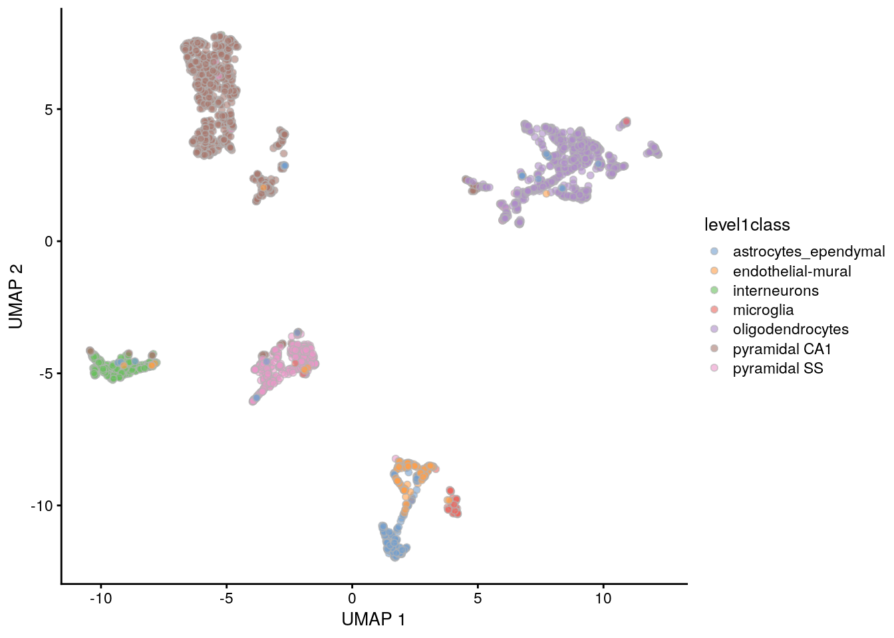

---
output:
  html_document
bibliography: ../ref.bib
---

# Dimensionality reduction

<script>
document.addEventListener("click", function (event) {
    if (event.target.classList.contains("aaron-collapse")) {
        event.target.classList.toggle("active");
        var content = event.target.nextElementSibling;
        if (content.style.display === "block") {
          content.style.display = "none";
        } else {
          content.style.display = "block";
        }
    }
})
</script>

<style>
.aaron-collapse {
  background-color: #eee;
  color: #444;
  cursor: pointer;
  padding: 18px;
  width: 100%;
  border: none;
  text-align: left;
  outline: none;
  font-size: 15px;
}

.aaron-content {
  padding: 0 18px;
  display: none;
  overflow: hidden;
  background-color: #f1f1f1;
}
</style>

## Overview

Many scRNA-seq analysis procedures involve comparing cells based on their expression values across multiple genes.
For example, clustering aims to identify cells with similar transcriptomic profiles by computing Euclidean distances across genes.
In these applications, each individual gene represents a dimension of the data.
More intuitively, if we had a scRNA-seq data set with two genes, we could make a two-dimensional plot where each axis represents the expression of one gene and each point in the plot represents a cell.
This concept can be extended to data sets with thousands of genes where each cell's expression profile defines its location in the high-dimensional expression space.

As the name suggests, dimensionality reduction aims to reduce the number of separate dimensions in the data.
This is possible because different genes are correlated if they are affected by the same biological process.
Thus, we do not need to store separate information for individual genes, but can instead compress multiple features into a single dimension, e.g., an "eigengene" [@langfelder2007eigengene].
This reduces computational work in downstream analyses like clustering, as calculations only need to be performed for a few dimensions rather than thousands of genes;
reduces noise by averaging across multiple genes to obtain a more precise representation of the patterns in the data;
and enables effective plotting of the data, for those of us who are not capable of visualizing more than 3 dimensions.

We will use the @zeisel2015brain dataset to demonstrate the applications of various dimensionality reduction methods in this chapter.

<button class="aaron-collapse">View history</button>
<div class="aaron-content">
   
```r
#--- loading ---#
library(scRNAseq)
sce.zeisel <- ZeiselBrainData()
sce.zeisel <- sce.zeisel[rowData(sce.zeisel)$featureType!="repeat",]

library(scater)
sce.zeisel <- aggregateAcrossFeatures(sce.zeisel, 
    id=sub("_loc[0-9]+$", "", rownames(sce.zeisel)))

#--- gene-annotation ---#
library(org.Mm.eg.db)
ensembl <- mapIds(org.Mm.eg.db, keys=rownames(sce.zeisel), 
    keytype="SYMBOL", column="ENSEMBL")
rowData(sce.zeisel)$ENSEMBL <- ensembl

#--- quality-control ---#
stats <- perCellQCMetrics(sce.zeisel, subsets=list(
    Mt=rowData(sce.zeisel)$featureType=="mito"))
qc <- quickPerCellQC(stats, percent_subsets=c("altexps_ERCC_percent", 
    "subsets_Mt_percent"))
sce.zeisel <- sce.zeisel[,!qc$discard]

#--- normalization ---#
library(scran)
set.seed(1000)
clusters <- quickCluster(sce.zeisel)
sce.zeisel <- computeSumFactors(sce.zeisel, cluster=clusters) 
sce.zeisel <- logNormCounts(sce.zeisel)

#--- variance-modelling ---#
dec.zeisel <- modelGeneVarWithSpikes(sce.zeisel, "ERCC")
top.hvgs <- getTopHVGs(dec.zeisel, prop=0.1)
```

</div>


```r
sce.zeisel
```

```
## class: SingleCellExperiment 
## dim: 19839 2816 
## metadata(0):
## assays(2): counts logcounts
## rownames(19839): 0610005C13Rik 0610007N19Rik ... Zzef1 Zzz3
## rowData names(2): featureType ENSEMBL
## colnames(2816): 1772071015_C02 1772071017_G12 ... 1772063068_D01
##   1772066098_A12
## colData names(11): tissue group # ... level2class sizeFactor
## reducedDimNames(0):
## altExpNames(2): ERCC repeat
```

## Principal components analysis

Principal components analysis (PCA) discovers axes in high-dimensional space that capture the largest amount of variation.
This is best understood by imagining each axis as a line.
Say we draw a line anywhere, and we move all cells in our data set onto this line by the shortest path.
The variance captured by this axis is defined as the variance across cells along that line.
In PCA, the first axis (or "principal component", PC) is chosen such that it captures the greatest variance across cells.
The next PC is chosen such that it is orthogonal to the first and captures the greatest remaining amount of variation, and so on.

By definition, the top PCs capture the dominant factors of heterogeneity in the data set.
Thus, we can perform dimensionality reduction by restricting downstream analyses to the top PCs.
This strategy is simple, highly effective and widely used throughout the data sciences.
It takes advantage of the well-studied theoretical properties of the PCA - namely, that a low-rank approximation formed from the top PCs is the optimal approximation of the original data for a given matrix rank.
It also allows us to use a wide range of fast PCA implementations for scalable and efficient data analysis.

When applying PCA to scRNA-seq data, our assumption is that biological processes affect multiple genes in a coordinated manner.
This means that the earlier PCs are likely to represent biological structure as more variation can be captured by considering the correlated behavior of many genes.
By comparison, random technical or biological noise is expected to affect each gene independently.
There is unlikely to be an axis that can capture random variation across many genes, meaning that noise should mostly be concentrated in the later PCs.
This motivates the use of the earlier PCs in our downstream analyses, which concentrates the biological signal to simultaneously reduce computational work and remove noise. 

We perform the PCA on the log-normalized expression values using the `runPCA()` function from *[scater](https://bioconductor.org/packages/3.11/scater)*.
By default, `runPCA()` will compute the first 50 PCs and store them in the `reducedDims()` of the output `SingleCellExperiment` object, as shown below.
Here, we use only the top 2000 genes with the largest biological components to reduce both computational work and high-dimensional random noise.
In particular, while PCA is robust to random noise, an excess of it may cause the earlier PCs to capture noise instead of biological structure [@johnstone2009consistency].
This effect can be mitigated by restricting the PCA to a subset of HVGs, for which we can use any of the strategies described in Chapter \@ref(feature-selection).


```r
library(scran)
top.zeisel <- getTopHVGs(dec.zeisel, n=2000)

library(scater)
set.seed(100) # See below.
sce.zeisel <- runPCA(sce.zeisel, subset_row=top.zeisel) 
reducedDimNames(sce.zeisel)
```

```
## [1] "PCA"
```

```r
dim(reducedDim(sce.zeisel, "PCA"))
```

```
## [1] 2816   50
```

For large data sets, greater efficiency is obtained by using approximate SVD algorithms that only compute the top PCs.
By default, most PCA-related functions in *[scater](https://bioconductor.org/packages/3.11/scater)* and *[scran](https://bioconductor.org/packages/3.11/scran)* will use methods from the *[irlba](https://CRAN.R-project.org/package=irlba)* or *[rsvd](https://CRAN.R-project.org/package=rsvd)* packages to perform the SVD.
We can explicitly specify the SVD algorithm to use by passing an `BiocSingularParam` object (from the *[BiocSingular](https://bioconductor.org/packages/3.11/BiocSingular)* package) to the `BSPARAM=` argument (see Section \@ref(big-data-svd) for more details).
Many of these approximate algorithms are based on randomization and thus require `set.seed()` to obtain reproducible results.


```r
library(BiocSingular)
set.seed(1000)
sce.zeisel <- runPCA(sce.zeisel, subset_row=top.zeisel, 
    BSPARAM=RandomParam(), name="IRLBA")
reducedDimNames(sce.zeisel)
```

```
## [1] "PCA"   "IRLBA"
```

## Choosing the number of PCs

### Motivation

How many of the top PCs should we retain for downstream analyses?
The choice of the number of PCs $d$ is a decision that is analogous to the choice of the number of HVGs to use.
Using more PCs will avoid discarding biological signal in later PCs, at the cost of retaining more noise.
Most practitioners will simply set $d$ to a "reasonable" but arbitrary value, typically ranging from 10 to 50.
This is often satisfactory provided it is coupled with sufficient testing of alternative values to explore other perspectives of the data at a different bias-variance trade-off.
Nonetheless, we will describe some more data-driven strategies to guide a suitable choice of $d$.

### Using the elbow point

A simple heuristic for choosing $d$ involves identifying the elbow point in the percentage of variance explained by successive PCs.
This refers to the "elbow" in the curve of a scree plot as shown in Figure \@ref(fig:elbow).


```r
# Percentage of variance explained is tucked away in the attributes.
percent.var <- attr(reducedDim(sce.zeisel), "percentVar")
chosen.elbow <- PCAtools::findElbowPoint(percent.var)
chosen.elbow
```

```
## [1] 7
```

```r
plot(percent.var, xlab="PC", ylab="Variance explained (%)")
abline(v=chosen.elbow, col="red")
```

<div class="figure">

<p class="caption">(\#fig:elbow)Percentage of variance explained by successive PCs in the Zeisel brain data. The identified elbow point is marked with a red line.</p>
</div>

Our assumption is that each of the top PCs capturing biological signal should explain much more variance than the remaining PCs.
Thus, there should be a sharp drop in the percentage of variance explained when we move past the last "biological" PC.
This manifests as an elbow in the scree plot, the location of which serves as a natural choice for $d$.

From a practical perspective, the use of the elbow point tends to retain fewer PCs compared to other methods.
The definition of "much more variance" is relative so, in order to be retained, later PCs must explain a amount of variance that is comparable to that explained by the first few PCs.
Strong biological variation in the early PCs will shift the elbow to the left, potentially excluding weaker (but still interesting) variation in the next PCs immediately following the elbow.

### Using the technical noise

#### Method description

Another strategy is to retain all PCs until the percentage of total variation explained reaches some threshold $T$.
For example, we might retain the top set of PCs that explains 80% of the total variation in the data.
Of course, it would be pointless to swap one arbitrary parameter $d$ for another $T$.
Instead, we derive a suitable value for $T$ by calculating the proportion of variance in the data that is attributed to the biological component.
This is done using the `denoisePCA()` function with the variance modelling results from `modelGeneVarWithSpikes()` or related functions, where $T$ is defined as the ratio of the sum of the biological components to the sum of total variances.
To illustrate, we use this strategy to pick the number of PCs in the 10X PBMC dataset.

<button class="aaron-collapse">View history</button>
<div class="aaron-content">
   
```r
#--- loading ---#
library(BiocFileCache)
bfc <- BiocFileCache("raw_data", ask = FALSE)
raw.path <- bfcrpath(bfc, file.path("http://cf.10xgenomics.com/samples",
    "cell-exp/2.1.0/pbmc4k/pbmc4k_raw_gene_bc_matrices.tar.gz"))
untar(raw.path, exdir=file.path(tempdir(), "pbmc4k"))

library(DropletUtils)
fname <- file.path(tempdir(), "pbmc4k/raw_gene_bc_matrices/GRCh38")
sce.pbmc <- read10xCounts(fname, col.names=TRUE)

#--- gene-annotation ---#
library(scater)
rownames(sce.pbmc) <- uniquifyFeatureNames(
    rowData(sce.pbmc)$ID, rowData(sce.pbmc)$Symbol)

library(EnsDb.Hsapiens.v86)
location <- mapIds(EnsDb.Hsapiens.v86, keys=rowData(sce.pbmc)$ID, 
    column="SEQNAME", keytype="GENEID")

#--- cell-detection ---#
set.seed(100)
e.out <- emptyDrops(counts(sce.pbmc))
sce.pbmc <- sce.pbmc[,which(e.out$FDR <= 0.001)]

#--- quality-control ---#
stats <- perCellQCMetrics(sce.pbmc, subsets=list(Mito=which(location=="MT")))
high.mito <- isOutlier(stats$subsets_Mito_percent, type="higher")
sce.pbmc <- sce.pbmc[,!high.mito]

#--- normalization ---#
library(scran)
set.seed(1000)
clusters <- quickCluster(sce.pbmc)
sce.pbmc <- computeSumFactors(sce.pbmc, cluster=clusters)
sce.pbmc <- logNormCounts(sce.pbmc)

#--- variance-modelling ---#
set.seed(1001)
dec.pbmc <- modelGeneVarByPoisson(sce.pbmc)
top.pbmc <- getTopHVGs(dec.pbmc, prop=0.1)
```

</div>


```r
library(scran)
set.seed(111001001)
denoised.pbmc <- denoisePCA(sce.pbmc, technical=dec.pbmc, subset.row=top.pbmc)
ncol(reducedDim(denoised.pbmc))
```

```
## [1] 8
```


The dimensionality of the output represents the lower bound on the number of PCs required to retain all biological variation.
This choice of $d$ is motivated by the fact that any fewer PCs will definitely discard some aspect of biological signal.
(Of course, the converse is not true; there is no guarantee that the retained PCs capture all of the signal, which is only generally possible if no dimensionality reduction is performed at all.)
From a practical perspective, the `denoisePCA()` approach usually retains more PCs than the elbow point method as the former does not compare PCs to each other and is less likely to discard PCs corresponding to secondary factors of variation.
The downside is that many minor aspects of variation may not be interesting (e.g., transcriptional bursting) and their retention would only add irrelevant noise.
Thus, whether this is a "better" approach depends on the our willingness to increase noise in order to preserve weaker biological signals.

#### Additional comments

`denoisePCA()` imposes internal caps on the number of PCs that can be chosen in this manner.
By default, the number is bounded within the "reasonable" limits of 5 and 50 to avoid selection of too few PCs (when technical noise is high relative to biological variation) or too many PCs (when technical noise is very low).
For example, applying this function to the Zeisel brain data hits the upper limit:


```r
set.seed(001001001)
denoised.zeisel <- denoisePCA(sce.zeisel, technical=dec.zeisel, 
    subset.row=top.zeisel)
ncol(reducedDim(denoised.zeisel))
```

```
## [1] 50
```

This method also tends to perform best when the mean-variance trend reflects the actual technical noise, i.e., estimated by `modelGeneVarByPoisson()` or `modelGeneVarWithSpikes()` instead of `modelGeneVar()` (Chapter \@ref(feature-selection)).
Variance modelling results from `modelGeneVar()` tend to understate the actual biological variation, especially in highly heterogeneous datasets where secondary factors of variation inflate the fitted values of the trend.
Fewer PCs are subsequently retained because $T$ is artificially lowered, as evidenced by `denoisePCA()` returning the lower limit of 5 PCs for the PBMC dataset:


```r
dec.pbmc2 <- modelGeneVar(sce.pbmc)
denoised.pbmc2 <- denoisePCA(sce.pbmc, technical=dec.pbmc2, subset.row=top.pbmc)
ncol(reducedDim(denoised.pbmc2))
```

```
## [1] 5
```


### Based on population structure

Yet another method to choose $d$ uses information about the number of subpopulations in the data.
Consider a situation where each subpopulation differs from the others along a different axis in the high-dimensional space
(e.g., because it is defined by a unique set of marker genes).
This suggests that we should set $d$ to the number of unique subpopulations minus 1,
which guarantees separation of all subpopulations while retaining as few dimensions (and noise) as possible.
We can use this reasoning to loosely motivate an _a priori_ choice for $d$ -
for example, if we expect around 10 different cell types in our population, we would set $d \approx 10$.

In practice, the number of subpopulations is usually not known in advance.
Rather, we use a heuristic approach that uses the number of clusters as a proxy for the number of subpopulations.
We perform clustering (graph-based by default, see Chapter \@ref(clustering)) on the first $d^*$ PCs and only consider the values of $d^*$ that yield no more than $d^*+1$ clusters.
If we detect more clusters with fewer dimensions, we consider this to represent overclustering rather than distinct subpopulations, assuming that multiple subpopulations should not be distinguishable on the same axes.
We test a range of $d^*$ and set $d$ to the value that maximizes the number of clusters while satisfying the above condition.
This attempts to capture as many distinct (putative) subpopulations as possible by retaining biological signal in later PCs, up until the point that the additional noise reduces resolution.


```r
pcs <- reducedDim(sce.zeisel)
choices <- getClusteredPCs(pcs)
metadata(choices)$chosen
```

```
## [1] 17
```

```r
plot(choices$n.pcs, choices$n.clusters,
    xlab="Number of PCs", ylab="Number of clusters")
abline(a=1, b=1, col="red")
abline(v=metadata(choices)$chosen, col="grey80", lty=2)
```

<div class="figure">

<p class="caption">(\#fig:cluster-pc-choice)Number of clusters detected in the Zeisel brain dataset as a function of the number of PCs. The red unbroken line represents the theoretical upper constraint on the number of clusters, while the grey dashed line is the number of PCs suggested by `getClusteredPCs()`.</p>
</div>

This strategy is the most pragmatic as it directly addresses the role of the bias-variance trade-off in downstream analyses, specifically clustering.
There is no need to preserve biological signal beyond what is distinguishable in later steps.
However, it involves strong assumptions about the nature of the biological differences between subpopulations - and indeed, discrete subpopulations may not even exist in studies of continuous processes like differentiation.

### Putting it together

Once we have chosen $d$, applying it is as simple as subsetting the PC matrix by column.
We then use the `reducedDim()<-` command to reassign the subsetted matrix back into the `SingleCellExperiment` object.
For example, if we were to take the top 20 PCs, we would do:


```r
reducedDim(sce.zeisel, "PCA") <- reducedDim(sce.zeisel, "PCA")[,1:20]
ncol(reducedDim(sce.zeisel, "PCA"))
```

```
## [1] 20
```

Downstream applications that use the `"PCA"` dimensionality reduction results in `sce.zeisel` will subsequently operate on the first 20 PCs only.
Alternatively, some users may prefer to keep the full set of PCs, in which case the top set can be assigned to another name:


```r
reducedDim(sce.zeisel, "PCA_20") <- reducedDim(sce.zeisel, "PCA")[,1:20]
reducedDimNames(sce.zeisel)
```

```
## [1] "PCA"    "IRLBA"  "PCA_20"
```

Note that this is not necessary if the desired number of PCs is directly specified in the initial call to `runPCA()`.
Similarly, `denoisePCA()` will return its chosen number of PCs without requiring further user intervention.

## Non-negative matrix factorization

Non-negative matrix factorization (NMF) involves approximating a matrix by the product of two lower-rank matrices $W$ and $H$,
all of which can only contain non-negative entries.
This is conceptually similar to PCA in that we are aiming to summarize the major features in our matrix with a smaller matrix,
reducing noise and compacting the data.
However, the NMF coordinates are more interpretable as larger values unambiguously represent greater expression of genes in the corresponding factor; 
the same cannot be said of PCA coordinates, for which negative values could be caused by higher expression if the corresponding entry of the rotation vector is negative.

scRNA-seq expression data is a popular use case for NMF [@shao2017robust;@kotliar2019identifying] as sequencing counts are always non-negative - even after log-transformation, provided that the pseudo-count is greater than 1.
We demonstrate the application of NMF on the @zeisel2015brain dataset using the `runNMF()` function from *[scater](https://bioconductor.org/packages/3.11/scater)* (powered by the *[NNLM](https://CRAN.R-project.org/package=NNLM)* package).
As with the PCA results, `runNMF()` stores the per-cell coordinates in the `"NMF"` entry of the `reducedDims()` of the output, which we could then use directly for downstream steps like clustering.
However, the main benefit of NMF over PCA is that we can directly interpret the individual factors based on the identity of the highly weighted genes in the basis matrix $W$ and the affected cells in the coordinate matrix $H$ (Figure \@ref(fig:heat-nmf-zeisel)).


```r
set.seed(101001)
nmf.zeisel <- runNMF(sce.zeisel, ncomponents=10, subset_row=top.zeisel)

# Extracting the basis matrix of per-gene contributions to each factor.
nmf.out <- reducedDim(nmf.zeisel, "NMF")
nmf.basis <- attr(nmf.out, "basis")
colnames(nmf.out) <- colnames(nmf.basis) <- 1:10

# Creating a heatmap where each row is a cell:
per.cell <- pheatmap::pheatmap(nmf.out, silent=TRUE, 
    main="By cell", show_rownames=FALSE,
    color=rev(viridis::magma(100)), cluster_cols=FALSE) 

# Creating a heatmap where each row is a gene:
per.gene <- pheatmap::pheatmap(nmf.basis, silent=TRUE, 
    main="By gene", cluster_cols=FALSE, show_rownames=FALSE,
    color=rev(viridis::magma(100)))

gridExtra::grid.arrange(per.cell[[4]], per.gene[[4]], ncol=2)
```

Specifically, we examine the top ranking genes for each factor to attempt to assign biological meaning to them.
There are at least a few marker genes here that will be familiar to readers who have studied neuronal cell types,
e.g., _Mog_ for oligodendrocytes and _Gad1_ for interneurons.
A factor with a high basis value for _Mog_ can be treated as a proxy for oligodendrocyte identity;
cells with high NMF coordinates for that factor (Figure \@ref(fig:heat-nmf-zeisel)) are likely to be oligodendrocytes.
Indeed, the concept of "cell type identity" is particularly amenable for NMF as the upregulation of marker genes manifests as large positive values in both $H$ and $W$ matrices, simplifying the process of interpretation for the affected factor.


```r
by.factor <- list()
for (x in colnames(nmf.basis)) {
    by.factor[[x]] <- sort(nmf.basis[,x], decreasing=TRUE)
}
lapply(by.factor, head, n=10)
```


For characterizing population heterogeneity, NMF provides a fast alternative to the relatively circuitous process of clustering (Chapter \@ref(clustering)) and marker gene detection (Chapter \@ref(marker-detection)) 
The continuous nature of the NMF output also lends itself to describing gradients of biological state that are not easily captured by discrete clusters, while the availability of multiple factors allows simultaneous examination of many such gradients compared to a single trajectory.
Of course, we do not entirely avoid clustering in Figure \@ref(fig:heat-nmf-zeisel), but at least the heatmap retains more information about the structure within and between clusters that is usually lost in pure cluster-based interpretations.

On the other hand, NMF output is arguably more difficult to interpret than a conventional list of marker genes for distinguishing between subpopulations.
There is no guarantee that each factor represents an orthogonal biological process, meaning that some care is required to ensure that the interpretation of one factor is not invalidated by other factors affecting the same genes.
NMF also tends to assign higher weight to high-abundance genes to reduce approximation error - as evidenced by the recurrence of _Malat1_ in multiple factors above - even though such genes may not exhibit strong DE between populations.

We tend to prefer PCA for general-purpose dimensionality reduction given that the interpretability of NMF is not a critical feature for most scRNA-seq workflows.
That said, NMF can provide another perspective on our high-dimensional data that can serve as a sanity check for more complicated downstream procedures.
For example, we would hope that any identified clusters and marker genes would correspond to large values in the $W$ and $H$ matrices for the relevant factors.

## Dimensionality reduction for visualization

### Motivation

Another application of dimensionality reduction is to compress the data into 2 (sometimes 3) dimensions for plotting.
This serves a separate purpose to the PCA-based dimensionality reduction described above.
Algorithms are more than happy to operate on 10-50 PCs, but these are still too many dimensions for human comprehension.
Further dimensionality reduction strategies are required to pack the most salient features of the data into 2 or 3 dimensions, which we will discuss below.

### Visualizing with PCA

The simplest visualization approach is to plot the top 2 PCs (Figure \@ref(fig:zeisel-pca)):


```r
plotReducedDim(sce.zeisel, dimred="PCA", colour_by="level1class")
```

<div class="figure">

<p class="caption">(\#fig:zeisel-pca)PCA plot of the first two PCs in the Zeisel brain data. Each point is a cell, coloured according to the annotation provided by the original authors.</p>
</div>

The problem is that PCA is a linear technique, i.e., only variation along a line in high-dimensional space is captured by each PC.
As such, it cannot efficiently pack differences in $d$ dimensions into the first 2 PCs.
This is demonstrated in Figure \@ref(fig:zeisel-pca) where the top two PCs fail to resolve some subpopulations identified by @zeisel2015brain.
If the first PC is devoted to resolving the biggest difference between subpopulations, and the second PC is devoted to resolving the next biggest difference, then the remaining differences will not be visible in the plot.

One workaround is to plot several of the top PCs against each other in pairwise plots (Figure \@ref(fig:zeisel-pca-multi)).
However, it is difficult to interpret multiple plots simultaneously, and even this approach is not sufficient to separate some of the annotated subpopulations.


```r
plotReducedDim(sce.zeisel, dimred="PCA", ncomponents=4,
    colour_by="level1class")
```

<div class="figure">

<p class="caption">(\#fig:zeisel-pca-multi)PCA plot of the first two PCs in the Zeisel brain data. Each point is a cell, coloured according to the annotation provided by the original authors.</p>
</div>

There are some advantages to the PCA for visualization.
It is predictable and will not introduce artificial structure in the visualization.
It is also deterministic and robust to small changes in the input values.
However, as shown above, PCA is usually not satisfactory for visualization of complex populations.

### $t$-stochastic neighbor embedding

The _de facto_ standard for visualization of scRNA-seq data is the $t$-stochastic neighbor embedding ($t$-SNE) method [@van2008visualizing].
This attempts to find a low-dimensional representation of the data that preserves the distances between each point and its neighbors in the high-dimensional space. 
Unlike PCA, it is not restricted to linear transformations, nor is it obliged to accurately represent distances between distant populations.
This means that it has much more freedom in how it arranges cells in low-dimensional space, enabling it to separate many distinct clusters in a complex population (Figure \@ref(fig:tsne-brain)).


```r
set.seed(00101001101)

# runTSNE() stores the t-SNE coordinates in the reducedDims
# for re-use across multiple plotReducedDim() calls.
sce.zeisel <- runTSNE(sce.zeisel, dimred="PCA")
plotReducedDim(sce.zeisel, dimred="TSNE", colour_by="level1class")
```

<div class="figure">

<p class="caption">(\#fig:tsne-brain)$t$-SNE plots constructed from the top PCs in the Zeisel brain dataset. Each point represents a cell, coloured according to the published annotation.</p>
</div>

One of the main disadvantages of $t$-SNE is that it is much more computationally intensive than other visualization methods.
We mitigate this effect by setting `dimred="PCA"` in `runtTSNE()`, which instructs the function to perform the $t$-SNE calculations on the top PCs to exploit the data compaction and noise removal provided by the PCA.
It is possible to run $t$-SNE on the original expression matrix but this is less efficient.

Another issue with $t$-SNE is that it requires the user to be aware of additional parameters (discussed [here](http://distill.pub/2016/misread-tsne/) in some depth).
It involves a random initialization so we need to (i) repeat the visualization several times to ensure that the results are representative and (ii) set the seed to ensure that the chosen results are reproducible.
The "perplexity" is another important parameter that determines the granularity of the visualization (Figure \@ref(fig:tsne-perplexity)).
Low perplexities will favor resolution of finer structure, possibly to the point that the visualization is compromised by random noise.
Thus, it is advisable to test different perplexity values to ensure that the choice of perplexity does not drive the interpretation of the plot.


```r
set.seed(100)
sce.zeisel <- runTSNE(sce.zeisel, dimred="PCA", perplexity=5)
out5 <- plotReducedDim(sce.zeisel, dimred="TSNE",
    colour_by="level1class") + ggtitle("perplexity = 5")

set.seed(100)
sce.zeisel <- runTSNE(sce.zeisel, dimred="PCA", perplexity=20)
out20 <- plotReducedDim(sce.zeisel, dimred="TSNE",
    colour_by="level1class") + ggtitle("perplexity = 20")

set.seed(100)
sce.zeisel <- runTSNE(sce.zeisel, dimred="PCA", perplexity=80)
out80 <- plotReducedDim(sce.zeisel, dimred="TSNE", 
    colour_by="level1class") + ggtitle("perplexity = 80")

multiplot(out5, out20, out80, cols=3)
```

<div class="figure">

<p class="caption">(\#fig:tsne-perplexity)$t$-SNE plots constructed from the top PCs in the Zeisel brain dataset, using a range of perplexity values. Each point represents a cell, coloured according to its annotation.</p>
</div>

Finally, it is tempting to interpret the $t$-SNE results as a "map" of single-cell identities.
This is generally unwise as any such interpretation is easily misled by the size and positions of the visual clusters.
Specifically, $t$-SNE will inflate dense clusters and compress sparse ones, such that we cannot use the size as a measure of subpopulation heterogeneity.
Similarly, $t$-SNE is not obliged to preserve the relative locations of non-neighboring clusters, such that we cannot use their positions to determine relationships between distant clusters.
We provide some suggestions on how to interpret these plots in Section \@ref(visualization-interpretation).

Despite its shortcomings, $t$-SNE is proven tool for general-purpose visualization of scRNA-seq data and remains a popular choice in many analysis pipelines.

### Uniform manifold approximation and projection

The uniform manifold approximation and projection (UMAP) method [@mcInnes2018umap] is an alternative to $t$-SNE for non-linear dimensionality reduction.
It is roughly similar to $t$-SNE in that it also tries to find a low-dimensional representation that preserves relationships between neighbors in high-dimensional space.
However, the two methods are based on different theory, represented by differences in the various graph weighting equations.
This manifests as a different visualization as shown in Figure \@ref(fig:umap-brain).


```r
set.seed(1100101001)
sce.zeisel <- runUMAP(sce.zeisel, dimred="PCA")
plotReducedDim(sce.zeisel, dimred="UMAP", colour_by="level1class")
```

<div class="figure">

<p class="caption">(\#fig:umap-brain)UMAP plots constructed from the top PCs in the Zeisel brain dataset. Each point represents a cell, coloured according to the published annotation.</p>
</div>

Compared to $t$-SNE, the UMAP visualization tends to have more compact visual clusters with more empty space between them.
It also attempts to preserve more of the global structure than $t$-SNE.
From a practical perspective, UMAP is much faster than $t$-SNE, which may be an important consideration for large datasets.
(Nonetheless, we have still run UMAP on the top PCs here for consistency.)
UMAP also involves a series of randomization steps so setting the seed is critical.

Like $t$-SNE, UMAP has its own suite of hyperparameters that affect the visualization.
Of these, the number of neighbors (`n_neighbors`) and the minimum distance between embedded points (`min_dist`) have the greatest effect on the granularity of the output.
If these values are too low, random noise will be incorrectly treated as high-resolution structure, while values that are too high will discard fine structure altogether in favor of obtaining an accurate overview of the entire dataset.
Again, it is a good idea to test a range of values for these parameters to ensure that they do not compromise any conclusions drawn from a UMAP plot.

It is arguable whether the UMAP or $t$-SNE visualizations are more useful or aesthetically pleasing.
UMAP aims to preserve more global structure but this necessarily reduces resolution within each visual cluster.
However, UMAP is unarguably much faster, and for that reason alone, it is increasingly displacing $t$-SNE as the method of choice for visualizing large scRNA-seq data sets.

### Interpreting the plots {#visualization-interpretation}

Dimensionality reduction for visualization necessarily involves discarding information and distorting the distances between cells in order to fit high-dimensional data into a 2-dimensional space.
One might wonder whether the results of such extreme data compression can be trusted.
Some of our more quantitative colleagues consider such visualizations to be more artistic than scientific, fit for little but impressing collaborators and reviewers.
Perhaps this perspective is not entirely invalid, but we suggest that there is some value to be extracted from them provided that they are accompanied by an analysis of a higher-rank representation. 

To illustrate, consider the interaction between clustering and $t$-SNE.
As a general rule, we would not perform clustering on the $t$-SNE coordinates.
Rather, we would cluster on the first 10-50 PCs (Chapter \ref(clustering)) and then visualize the cluster identities on the $t$-SNE plot.
This ensures that clustering makes use of the information that was lost during compression into two dimensions for visualization.
The plot can then be used for a diagnostic inspection of the clustering output, e.g., to check which clusters are close neighbors or whether a cluster can be split into further subclusters; such interpretations of $t$-SNE coordinates are generally safe.

From a naive perspective, using the $t$-SNE coordinates directly for clustering is tempting as it ensures that any results are immediately consistent with the visualization.
Given that clustering is rather arbitrary anyway, there is nothing inherently wrong with this strategy - it can be treated as a rather circuitous implementation of graph-based clustering (Section \@ref(clustering-graph)).
However, the enforced consistency can actually be considered a disservice as it masks the ambiguity of the conclusions, either due to the loss of information from dimensionality reduction or the uncertainty of the clustering.
Rather than being errors, major discrepancies can instead be useful for motivating further investigation into the less obvious aspects of the dataset; conversely, the lack of discrepancies increases trust in the conclusions.

Or perhaps more bluntly: do not let the tail (of visualization) wag the dog (of quantitative analysis).

## Session Info {-}

<button class="aaron-collapse">View session info</button>
<div class="aaron-content">
```
R Under development (unstable) (2020-03-23 r78035)
Platform: x86_64-pc-linux-gnu (64-bit)
Running under: Ubuntu 18.04.4 LTS

Matrix products: default
BLAS:   /home/luna/Software/R/trunk/lib/libRblas.so
LAPACK: /home/luna/Software/R/trunk/lib/libRlapack.so

locale:
 [1] LC_CTYPE=en_US.UTF-8       LC_NUMERIC=C              
 [3] LC_TIME=en_US.UTF-8        LC_COLLATE=en_US.UTF-8    
 [5] LC_MONETARY=en_US.UTF-8    LC_MESSAGES=en_US.UTF-8   
 [7] LC_PAPER=en_US.UTF-8       LC_NAME=C                 
 [9] LC_ADDRESS=C               LC_TELEPHONE=C            
[11] LC_MEASUREMENT=en_US.UTF-8 LC_IDENTIFICATION=C       

attached base packages:
[1] parallel  stats4    stats     graphics  grDevices utils     datasets 
[8] methods   base     

other attached packages:
 [1] BiocSingular_1.3.2          scater_1.15.28             
 [3] ggplot2_3.3.0               scran_1.15.22              
 [5] SingleCellExperiment_1.9.2  SummarizedExperiment_1.17.3
 [7] DelayedArray_0.13.7         BiocParallel_1.21.2        
 [9] matrixStats_0.56.0          Biobase_2.47.3             
[11] GenomicRanges_1.39.2        GenomeInfoDb_1.23.13       
[13] IRanges_2.21.5              S4Vectors_0.25.13          
[15] BiocGenerics_0.33.2         BiocStyle_2.15.6           
[17] OSCAUtils_0.0.2            

loaded via a namespace (and not attached):
 [1] viridis_0.5.1            edgeR_3.29.1             viridisLite_0.3.0       
 [4] DelayedMatrixStats_1.9.0 assertthat_0.2.1         statmod_1.4.34          
 [7] highr_0.8                BiocManager_1.30.10      dqrng_0.2.1             
[10] GenomeInfoDbData_1.2.2   vipor_0.4.5              ggrepel_0.8.2           
[13] yaml_2.2.1               pillar_1.4.3             lattice_0.20-40         
[16] glue_1.3.2               limma_3.43.5             digest_0.6.25           
[19] XVector_0.27.1           colorspace_1.4-1         plyr_1.8.6              
[22] cowplot_1.0.0            htmltools_0.4.0          Matrix_1.2-18           
[25] pkgconfig_2.0.3          bookdown_0.18            zlibbioc_1.33.1         
[28] purrr_0.3.3              scales_1.1.0             processx_3.4.2          
[31] RSpectra_0.16-0          Rtsne_0.15               tibble_2.1.3            
[34] farver_2.0.3             withr_2.1.2              magrittr_1.5            
[37] crayon_1.3.4             evaluate_0.14            ps_1.3.2                
[40] FNN_1.1.3                beeswarm_0.2.3           tools_4.0.0             
[43] lifecycle_0.2.0          stringr_1.4.0            munsell_0.5.0           
[46] locfit_1.5-9.2           irlba_2.3.3              callr_3.4.2             
[49] compiler_4.0.0           rsvd_1.0.3               rlang_0.4.5             
[52] grid_4.0.0               RCurl_1.98-1.1           BiocNeighbors_1.5.2     
[55] igraph_1.2.5             labeling_0.3             bitops_1.0-6            
[58] rmarkdown_2.1            gtable_0.3.0             reshape2_1.4.3          
[61] PCAtools_1.99.4          R6_2.4.1                 gridExtra_2.3           
[64] knitr_1.28               dplyr_0.8.5              uwot_0.1.8              
[67] stringi_1.4.6            ggbeeswarm_0.6.0         Rcpp_1.0.4              
[70] tidyselect_1.0.0         xfun_0.12               
```
</div>
