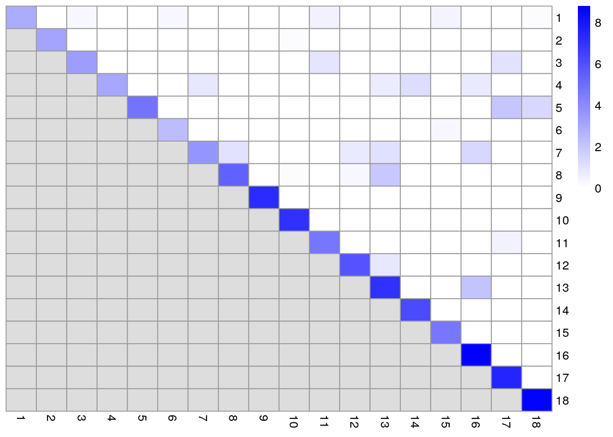
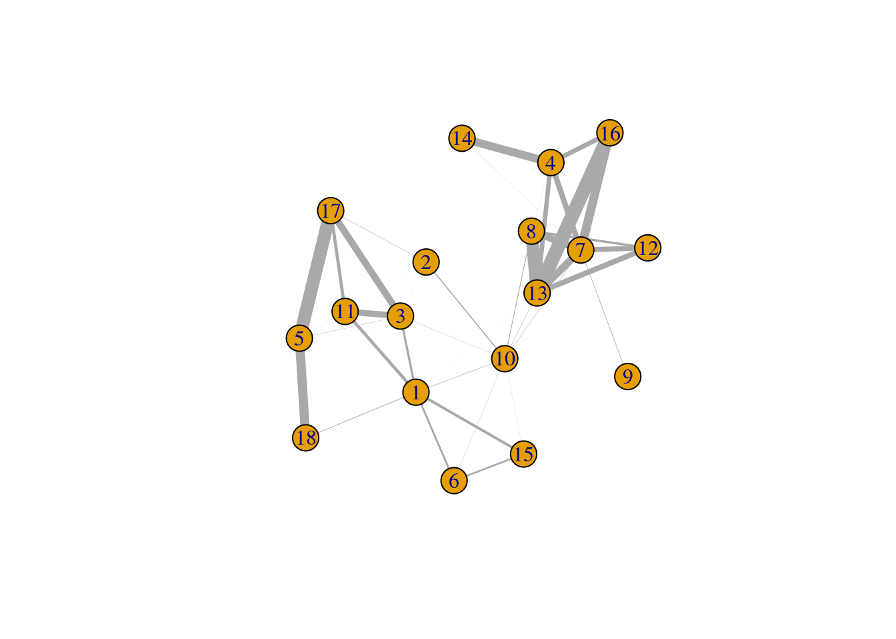
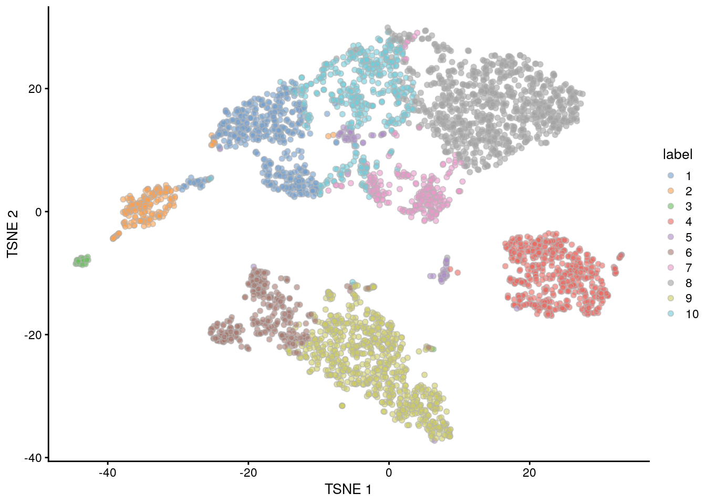
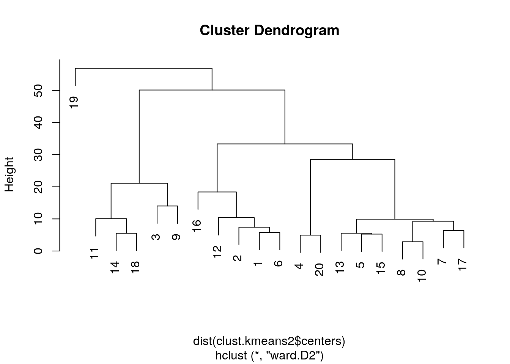
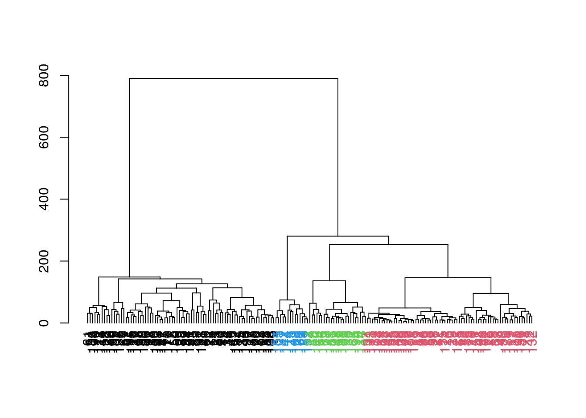
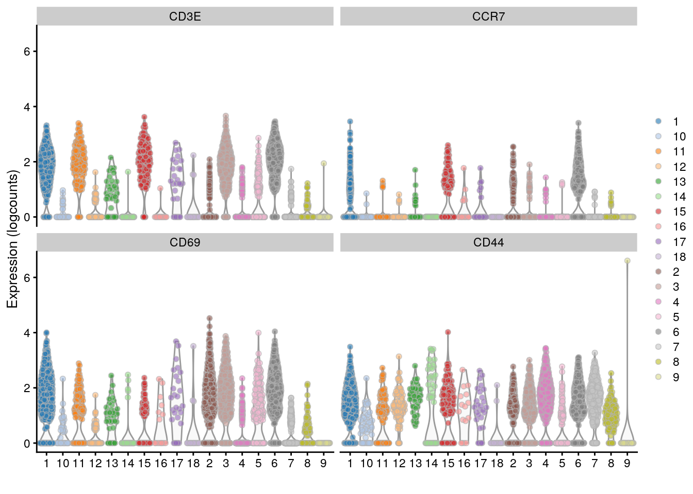

---
output:
  html_document
bibliography: ../ref.bib
---

# Clustering

<script>
document.addEventListener("click", function (event) {
    if (event.target.classList.contains("aaron-collapse")) {
        event.target.classList.toggle("active");
        var content = event.target.nextElementSibling;
        if (content.style.display === "block") {
          content.style.display = "none";
        } else {
          content.style.display = "block";
        }
    }
})
</script>

<style>
.aaron-collapse {
  background-color: #eee;
  color: #444;
  cursor: pointer;
  padding: 18px;
  width: 100%;
  border: none;
  text-align: left;
  outline: none;
  font-size: 15px;
}

.aaron-content {
  padding: 0 18px;
  display: none;
  overflow: hidden;
  background-color: #f1f1f1;
}
</style>

## Motivation

Clustering is an unsupervised learning procedure that is used in scRNA-seq data analysis to empirically define groups of cells with similar expression profiles.
Its primary purpose is to summarize the data in a digestible format for human interpretation. 
This allows us to describe population heterogeneity in terms of discrete labels that are easily understood, rather than attempting to comprehend the high-dimensional manifold on which the cells truly reside.
After annotation based on marker genes, the clusters can be treated as proxies for more abstract biological concepts such as cell types or states.
Clustering is thus a critical step for extracting biological insights from scRNA-seq data.
Here, we demonstrate the application of several commonly used methods with the 10X PBMC dataset. 

<button class="aaron-collapse">View history</button>
<div class="aaron-content">
   
```r
### setup ###
library(OSCAUtils)
chapterPreamble(use_cache = TRUE)

### loading ###
library(BiocFileCache)
bfc <- BiocFileCache("raw_data", ask = FALSE)
raw.path <- bfcrpath(bfc, file.path("http://cf.10xgenomics.com/samples",
    "cell-exp/2.1.0/pbmc4k/pbmc4k_raw_gene_bc_matrices.tar.gz"))
untar(raw.path, exdir=file.path(tempdir(), "pbmc4k"))

library(DropletUtils)
fname <- file.path(tempdir(), "pbmc4k/raw_gene_bc_matrices/GRCh38")
sce.pbmc <- read10xCounts(fname, col.names=TRUE)

### gene-annotation ###
library(scater)
rownames(sce.pbmc) <- uniquifyFeatureNames(
    rowData(sce.pbmc)$ID, rowData(sce.pbmc)$Symbol)

library(EnsDb.Hsapiens.v86)
location <- mapIds(EnsDb.Hsapiens.v86, keys=rowData(sce.pbmc)$ID, 
    column="SEQNAME", keytype="GENEID")

### cell-detection ###
set.seed(100)
e.out <- emptyDrops(counts(sce.pbmc))
sce.pbmc <- sce.pbmc[,which(e.out$FDR <= 0.001)]

### quality-control ###
stats <- perCellQCMetrics(sce.pbmc, subsets=list(Mito=which(location=="MT")))
high.mito <- isOutlier(stats$subsets_Mito_percent, nmads=3, type="higher")
sce.pbmc <- sce.pbmc[,!high.mito]

### normalization ###
library(scran)
set.seed(1000)
clusters <- quickCluster(sce.pbmc)
sce.pbmc <- computeSumFactors(sce.pbmc, cluster=clusters)
sce.pbmc <- logNormCounts(sce.pbmc)

### variance-modelling ###
set.seed(1001)
dec.pbmc <- modelGeneVarByPoisson(sce.pbmc)

### dimensionality-reduction ###
set.seed(10000)
sce.pbmc <- denoisePCA(sce.pbmc, technical=dec.pbmc)

set.seed(100000)
sce.pbmc <- runTSNE(sce.pbmc, use_dimred="PCA")

set.seed(1000000)
sce.pbmc <- runUMAP(sce.pbmc, use_dimred="PCA")
```

</div>


```r
sce.pbmc
```

```
## class: SingleCellExperiment 
## dim: 33694 3922 
## metadata(1): Samples
## assays(2): counts logcounts
## rownames(33694): RP11-34P13.3 FAM138A ... AC213203.1 FAM231B
## rowData names(2): ID Symbol
## colnames(3922): AAACCTGAGAAGGCCT-1 AAACCTGAGACAGACC-1 ...
##   TTTGTCACAGGTCCAC-1 TTTGTCATCCCAAGAT-1
## colData names(2): Sample Barcode
## reducedDimNames(3): PCA TSNE UMAP
## spikeNames(0):
## altExpNames(0):
```

## What is the "true clustering"?

At this point, it is worth stressing the distinction between clusters and cell types.
The former is an empirical construct while the latter is a biological truth (albeit a vaguely defined one).
For this reason, questions like "what is the true number of clusters?" are usually meaningless.
We can define as many clusters as we like, with whatever algorithm we like - each clustering will represent its own partitioning of the high-dimensional expression space, and is as "real" as any other clustering.

A more relevant question is "how well do the clusters approximate the cell types?"
Unfortunately, this is difficult to answer given the context-dependent interpretation of biological truth.
Some analysts will be satisfied with resolution of the major cell types; other analysts may want resolution of subtypes; and others still may require resolution of different states (e.g., metabolic activity, stress) within those subtypes.
Moreover, two clusterings can be highly inconsistent yet both valid, simply partitioning the cells based on different aspects of biology.
Indeed, asking for an unqualified "best" clustering is akin to asking for the best magnification on a microscope without any context.

It is helpful to realize that clustering, like a microscope, is simply a tool to explore the data.
We can zoom in and out by changing the resolution of the clustering parameters, and we can experiment with different clustering algorithms to obtain alternative perspectives of the data.
This iterative approach is entirely permissible for data exploration, which constitutes the majority of all scRNA-seq data analysis.
   
## Graph-based clustering {#clustering-graph}

### Background

Popularized by its use in *[Seurat](https://CRAN.R-project.org/package=Seurat)*, graph-based clustering is a flexible and scalable technique for clustering large scRNA-seq datasets.
We first build a graph where each node is a cell that is connected to its nearest neighbours in the high-dimensional space.
Edges are weighted based on the similarity between the cells involved, with higher weight given to cells that are more closely related.
We then apply algorithms to identify "communities" of cells that are more connected to cells in the same community than they are to cells of different communities.
Each community represents a cluster that we can use for downstream interpretation.

The major advantage of graph-based clustering lies in its scalability.
It only requires a $k$-nearest neighbor search that can be done in log-linear time on average, in contrast to hierachical clustering methods with runtimes that are quadratic with respect to the number of cells.
Graph construction avoids making strong assumptions about the shape of the clusters or the distribution of cells within each cluster, compared to other methods like $k$-means (that favor spherical clusters) or Gaussian mixture models (that require normality).
From a practical perspective, each cell is forcibly connected to a minimum number of neighboring cells, which reduces the risk of generating many uninformative clusters consisting of one or two outlier cells.

The main drawback of graph-based methods is that, after graph construction, no information is retained about relationships beyond the neighbouring cells^[Sten Linarrsson talked about this in SCG2018, but I don't know where that work ended up. So this is what passes as a reference for the time being.].
This has some practical consequences in datasets that exhibit differences in cell density, as more steps through the graph are required to move the same distance through a region of higher cell density.
From the perspective of community detection algorithms, this effect "inflates" the high-density regions such that any internal substructure or noise is more likely to cause formation of subclusters.
The resolution of clustering thus becomes dependent on the density of cells, which can occasionally be misleading if it overstates the heterogeneity in the data.


### Implementation

There are several considerations in the practical execution of a graph-based clustering method:

- How many neighbors are considered when constructing the graph.
- What scheme is used to weight the edges.
- Which community detection algorithm is used to define the clusters.

For example, the following code uses the 10 nearest neighbors of each cell to construct a shared nearest neighbor graph.
Two cells are connected by an edge if any of their nearest neighbors are shared,
with the edge weight defined from the highest average rank of the shared neighbors [@xu2015identification].
The Walktrap method from the *[igraph](https://CRAN.R-project.org/package=igraph)* package is then used to identify communities.
All calculations are performed using the top PCs to take advantage of data compression and denoising.


```r
library(scran)
g <- buildSNNGraph(sce.pbmc, k=10, use.dimred = 'PCA')
clust <- igraph::cluster_walktrap(g)$membership
table(clust)
```

```
## clust
##   1   2   3   4   5   6   7   8   9  10  11  12  13 
## 785 198  56 541 529 516 128 824  45 151  92  21  36
```

We assign the cluster assignments back into our `SingleCellExperiment` object as a factor in the column metadata.
This allows us to conveniently visualize the distribution of clusters in a $t$-SNE plot (Figure \@ref(fig:tsne-clust-graph)).


```r
library(scater)
sce.pbmc$cluster <- factor(clust)
plotReducedDim(sce.pbmc, "TSNE", colour_by="cluster")
```

<div class="figure">

<p class="caption">(\#fig:tsne-clust-graph)$t$-SNE plot of the 10X PBMC dataset, where each point represents a cell and is coloured according to the identity of the assigned cluster from graph-based clustering.</p>
</div>

One of the most important parameters is `k`, the number of nearest neighbors used to construct the graph.
This controls the resolution of the clustering where higher `k` yields a more inter-connected graph and broader clusters.
Users can exploit this by experimenting with different values of `k` to obtain a satisfactory resolution.


```r
# More resolved.
g.5 <- buildSNNGraph(sce.pbmc, k=5, use.dimred = 'PCA')
clust.5 <- igraph::cluster_walktrap(g.5)$membership
table(clust.5)
```

```
## clust.5
##   1   2   3   4   5   6   7   8   9  10  11  12  13  14  15  16  17  18 
##  40  45 499 487 335 121 171 620  18 825 202  55  73 142  81  41  54  29 
##  19  20  21  22 
##  21  17  10  36
```

```r
# Less resolved.
g.50 <- buildSNNGraph(sce.pbmc, k=50, use.dimred = 'PCA')
clust.50 <- igraph::cluster_walktrap(g.50)$membership
table(clust.50)
```

```
## clust.50
##    1    2    3    4    5    6    7    8    9 
##  553  832  198  121 1114  455  498  106   45
```

The graph itself can be visualized using a force-directed layout (Figure \@ref(fig:pbmc-force)).
This yields a dimensionality reduction result that is closely related to $t$-SNE and UMAP, though which of these is the most aesthetically pleasing is left to the eye of the beholder.


```r
set.seed(2000)
reducedDim(sce.pbmc, "force") <- igraph::layout_with_fr(g)
plotReducedDim(sce.pbmc, colour_by="cluster", use_dimred="force")
```

<div class="figure">

<p class="caption">(\#fig:pbmc-force)Force-directed layout for the shared nearest-neighbour graph of the PBMC dataset. Each point represents a cell and is coloured according to its assigned cluster identity.</p>
</div>

### Other parameters

Further tweaking can be performed by changing the edge weighting scheme during graph construction.
Setting `type="number"` will weight edges based on the number of nearest neighbors that are shared between two cells.
Similarly, `type="jaccard"` will weight edges according to the Jaccard index of the two sets of neighbors.
We can also disable weighting altogether by using `buildKNNGraph()`, which is occasionally useful for downstream graph operations that do not support weights.


```r
g.num <- buildSNNGraph(sce.pbmc, use.dimred="PCA", type="number")
g.jaccard <- buildSNNGraph(sce.pbmc, use.dimred="PCA", type="jaccard")
g.none <- buildKNNGraph(sce.pbmc, use.dimred="PCA")
```

All of these `g` variables are `graph` objects from the *[igraph](https://CRAN.R-project.org/package=igraph)* package and can be used with any of the community detection algorithms provided by *[igraph](https://CRAN.R-project.org/package=igraph)*.
We have already mentioned the Walktrap approach, but many others are available to choose from:


```r
clust.louvain <- igraph::cluster_louvain(g)$membership
clust.infomap <- igraph::cluster_infomap(g)$membership
clust.fast <- igraph::cluster_fast_greedy(g)$membership
clust.labprop <- igraph::cluster_label_prop(g)$membership
clust.eigen <- igraph::cluster_leading_eigen(g)$membership
```

It is then straightforward to compare two clustering strategies to see how they differ.
For example, the results below suggest that Louvain is similar to Walktrap;
fast-greedy yields coarser clusters; and Infomap provides higher resolution.


```r
table(Louvain=clust.louvain, Walktrap=clust)
```

```
##        Walktrap
## Louvain   1   2   3   4   5   6   7   8   9  10  11  12  13
##      1    0 198   0   1   0   0   0   0   0   0   0   0   0
##      2    0   0   0   0   3   0   0 810   0   9   0   0   0
##      3    1   0   0 516   4   0   0   0   0   0   0   0   0
##      4    0   0   0   1 400   0   0  14   0   1   0   0   0
##      5    0   0   0  23 122   0   0   0   0 141   0   0   0
##      6    0   0   0   0   0   0   0   0   0   0   0   0  36
##      7    0   0   0   0   0 516   0   0   0   0   0   0   0
##      8    0   0   0   0   0   0   0   0   0   0   0  21   0
##      9   29   0  37   0   0   0   0   0   0   0  92   0   0
##      10   1   0   0   0   0   0   0   0  45   0   0   0   0
##      11   1   0   0   0   0   0 128   0   0   0   0   0   0
##      12 753   0  19   0   0   0   0   0   0   0   0   0   0
```

```r
table(Infomap=clust.infomap, Walktrap=clust)
```

```
##        Walktrap
## Infomap   1   2   3   4   5   6   7   8   9  10  11  12  13
##      1    0   0   0   0   0   0   0 503   0   7   0   0   0
##      2    0   0   0   0   1   0   0 303   0   1   0   0   0
##      3    0   0   0   0   0 231   0   0   0   0   0   0   0
##      4  210   0   0   0   0   0   0   0   0   0   0   0   0
##      5    0   0   0   0   0 199   0   0   0   0   0   0   0
##      6    0   0   0 183   0   0   0   0   0   0   0   0   0
##      7  164   0   0   0   0   0   0   0   0   0   0   0   0
##      8    0 169   0   0   0   0   0   0   0   0   0   0   0
##      9    0   0   0 149   0   0   0   0   0   0   0   0   0
##      10 135   0   0   0   0   0   0   0   0   0   0   0   0
##      11   0   0   0   0   6   0   0   0   0 137   0   0   0
##      12   0   0   0  27  99   0   0   0   0   2   0   0   0
##      13   0   0   0   0   0   0 128   0   0   0   0   0   0
##      14 130   0   0   0   0   0   0   0   0   0   0   0   0
##      15   0   0   0   0 114   0   0   0   0   0   0   0   0
##  [ reached getOption("max.print") -- omitted 22 rows ]
```

```r
table(Fast=clust.fast, Walktrap=clust)
```

```
##     Walktrap
## Fast   1   2   3   4   5   6   7   8   9  10  11  12  13
##    1   0   0   0   0   0   0   0 771   0   0   0   0   0
##    2   0   0   0   0   0   0   0   0   0   0   0   0  36
##    3   0   0   0   0   0   0   0   0  45   0   0   0   0
##    4   0   0   0   0   0 515   0   0   0   0   0   0   0
##    5   0 194   0   0   0   1   0   0   0   0   0  21   0
##    6   0   4   0 541 529   0   0  53   0 151   0   0   0
##    7 785   0  56   0   0   0 128   0   0   0  92   0   0
```

Pipelines involving *[scran](https://bioconductor.org/packages/3.10/scran)* default to rank-based weights followed by Walktrap clustering.
In contrast, *[Seurat](https://CRAN.R-project.org/package=Seurat)* uses Jaccard-based weights followed by Louvain clustering.
Both of these strategies work well, and it is likely that the same could be said for many other combinations of weighting schemes and community detection algorithms.

### Assessing cluster separation

When dealing with graphs, the modularity is a natural metric for evaluating the separation between communities/clusters.
This is defined as the (scaled) difference between the observed total weight of edges between nodes in the same cluster and the expected total weight if edge weights were randomly distributed across all pairs of nodes.
Larger modularity values indicate that there most edges occur within clusters, suggesting that the clusters are sufficiently well separated to avoid edges forming between neighboring cells in different clusters.

The standard approach is to report a single modularity value for a clustering on a given graph.
This is useful for comparing different clusterings on the same graph - and indeed, some community detection algorithms are designed with the aim of maximizing the modularity - but it is less helpful for interpreting a given clustering.
Rather, we use the `clusterModularity()` function with `as.ratio=TRUE`, which returns the ratio of the observed to expected sum of weights between each pair of clusters.
We use the ratio instead of the difference as the former is less dependent on the number of cells in each cluster.


```r
ratio <- clusterModularity(g, clust, as.ratio=TRUE)
ratio
```

```
##        1     2        3        4         5         6         7         8
## 1  4.747  0.00   0.9718 0.001922 0.0006179 0.0005444  0.182848 0.0000000
## 2    NaN 24.15   0.0000 0.100412 0.0082216 0.0054301  0.000000 0.0003150
## 3    NaN   NaN 110.8276 0.000000 0.0000000 0.0000000  0.655614 0.0035376
## 4    NaN   NaN      NaN 7.499941 0.3127186 0.0019267  0.000000 0.0006704
## 5    NaN   NaN      NaN      NaN 7.2359911 0.0051028  0.007241 0.2307472
## 6    NaN   NaN      NaN      NaN       NaN 7.3736323  0.000000 0.0000000
## 7    NaN   NaN      NaN      NaN       NaN       NaN 44.094696 0.0000000
## 8    NaN   NaN      NaN      NaN       NaN       NaN       NaN 3.5142511
## 9    NaN   NaN      NaN      NaN       NaN       NaN       NaN       NaN
## 10   NaN   NaN      NaN      NaN       NaN       NaN       NaN       NaN
## 11   NaN   NaN      NaN      NaN       NaN       NaN       NaN       NaN
## 12   NaN   NaN      NaN      NaN       NaN       NaN       NaN       NaN
## 13   NaN   NaN      NaN      NaN       NaN       NaN       NaN       NaN
##            9        10      11        12        13
## 1    0.02839  0.000000  0.1947   0.00000 4.357e-03
## 2    0.00000  0.004791  0.0000   0.54527 0.000e+00
## 3    0.00000  0.000000  0.9157   0.00000 0.000e+00
## 4    0.00000  0.103582  0.0000   0.00000 0.000e+00
## 5    0.00000  0.393945  0.0000   0.08774 1.040e-02
## 6    0.00000  0.000000  0.0000   0.00000 0.000e+00
## 7    0.00000  0.000000  0.0000   0.00000 0.000e+00
## 8    0.00000  0.320243  0.0000   0.00000 0.000e+00
## 9  171.65490  0.000000  0.0000   0.00000 0.000e+00
## 10       NaN 23.689777  0.0000   0.00000 0.000e+00
## 11       NaN       NaN 57.8148   0.00000 0.000e+00
## 12       NaN       NaN     NaN 514.42466 0.000e+00
## 13       NaN       NaN     NaN       NaN 1.887e+02
```

In each matrix, each row/column corresponds to a cluster, and each entry of the matrix contains the ratio of the observed to total weight of edges between cells in the respective clusters.
A dataset containing well-separated clusters should contain most of the observed total weight on the diagonal entries, i.e., most edges occur between cells in the same cluster.
Indeed, concentration of the weight on the diagonal of (Figure \@ref(fig:cluster-mod)) indicates that most of the clusters are well-separated, while some modest off-diagonal entries represent closely related clusters with more inter-connecting edges.


```r
library(pheatmap)
pheatmap(log2(ratio+1), cluster_rows=FALSE, cluster_cols=FALSE,
    color=colorRampPalette(c("white", "blue"))(100))
```

<div class="figure">

<p class="caption">(\#fig:cluster-mod)Heatmap of the log~2~-ratio of the total weight between nodes in the same cluster or in different clusters, relative to the total weight expected under a null model of random links.</p>
</div>

One useful approach is to use the `ratio` matrix to form another graph where the nodes are clusters rather than cells.
Edges between nodes are weighted according to the ratio of observed to expected edge weights between cells in those clusters.
We can then repeat our graph operations on this new cluster-level graph.
For example, we could obtain clusters of clusters, or we could simply create a new cluster-based layout for visualization (Figure \@ref(fig:cluster-graph)).
This is analogous to the "graph abstraction" approach described by @wolf2017graph.


```r
cluster.gr <- igraph::graph_from_adjacency_matrix(ratio, 
    mode="upper", weighted=TRUE, diag=FALSE)

set.seed(11001010)
plot(cluster.gr, edge.width=igraph::E(cluster.gr)$weight*20)
```

<div class="figure">

<p class="caption">(\#fig:cluster-graph)Force-directed layout showing the relationships between clusters based on the log-ratio of observed to expected total weights between nodes in different clusters. The thickness of the edge between a pair of clusters is proportional to the corresponding log-ratio.</p>
</div>

Incidentally, some readers may have noticed that all *[igraph](https://CRAN.R-project.org/package=igraph)* commands were prefixed with `igraph::`.
We have done this deliberately to avoid bringing `igraph::normalize` into the global namespace.
Rather unfortunately, this `normalize` function accepts any argument and returns `NULL`, which causes difficult-to-diagnose bugs when it overwrites our intended `normalize` from *[scater](https://bioconductor.org/packages/3.10/scater)*.

## $k$-means clustering 

### Background

$k$-means clustering is a classic technique that aims to partition cells into $k$ clusters.
Each cell is assigned to the cluster with the closest centroid, which is done by minimizing the within-cluster sum of squares using a random starting configuration for the $k$ centroids.
The main advantage of this approach lies in its speed, given the simplicity and ease of implementation of the algorithm.
However, it suffers from a number of serious shortcomings that reduce its appeal for obtaining interpretable clusters:

- It implicitly favours spherical clusters of equal radius.
This can lead to unintuitive partitionings on real datasets that contain groupings with irregular sizes and shapes.
- The number of clusters $k$ must be specified beforehand and represents a hard cap on the resolution of the clustering..
For example, setting $k$ to be below the number of cell types will always lead to co-clustering of two cell types, regardless of how well separated they are.
In contrast, other methods like graph-based clustering will respect strong separation even if the relevant resolution parameter is set to a low value.
- It is dependent on the randomly chosen initial coordinates.
This requires multiple runs to verify that the clustering is stable.

That said, $k$-means clustering is still one of the best approaches for sample-based data compression. 
In this application, we set $k$ to a large value such as the square root of the number of cells to obtain fine-grained clusters.
These are not meant to be interpreted directly, but rather, the centroids are treated as "samples" for further analyses.
The idea here is to obtain a single representative of each region of the expression space, reducing the number of samples and computational work in later steps like, e.g., trajectory reconstruction [@ji2016tscan].
This approach will also eliminate differences in cell density across the expression space, ensuring that the most abundant cell type does not dominate downstream results. 

### Base implementation 

Base R provides the `kmeans()` function that does as its name suggests.
We call this on our top PCs to obtain a clustering for a specified number of clusters in the `centers=` argument, after setting the random seed to ensure that the results are reproducible.
In general, the $k$-means clusters correspond to the visual clusters on the $t$-SNE plot in Figure \@ref(fig:tsne-clust-kmeans), though there are some divergences that are not observed in, say, Figure \@ref(fig:tsne-clust-graph).
(This is at least partially due to the fact that $t$-SNE is itself graph-based and so will naturally agree more with a graph-based clustering strategy.)


```r
set.seed(100)
clust.kmeans <- kmeans(reducedDim(sce.pbmc, "PCA"), centers=10)
table(clust.kmeans$cluster)
```

```
## 
##    1    2    3    4    5    6    7    8    9   10 
##  539  188   59  515   39  375  191  605 1054  357
```

```r
sce.pbmc$cluster <- factor(clust.kmeans$cluster)
plotReducedDim(sce.pbmc, "TSNE", colour_by="cluster")
```

<div class="figure">

<p class="caption">(\#fig:tsne-clust-kmeans)$t$-SNE plot of the 10X PBMC dataset, where each point represents a cell and is coloured according to the identity of the assigned cluster from $k$-means clustering.</p>
</div>

If we were so inclined, we could obtain a "reasonable" choice of $k$ by computing the gap statistic using methods from the *[cluster](https://CRAN.R-project.org/package=cluster)* package.
This is the log-ratio of the expected to observed within-cluster sum of squares, where the expected value is computed by randomly distributing cells within the minimum bounding box of the original data.
A larger gap statistic represents a lower observed sum of squares - and thus better clustering - compared to a population with no structure.
Ideally, we would choose the $k$ that maximizes the gap statistic, but this is often unhelpful as the tendency of $k$-means to favour spherical clusters results in a large choice $k$ to capture different cluster shapes.
Instead, we choose the most parsimonious $k$ beyond which the increases in the gap statistic are considered insignificant (Figure \@ref(fig:kmeans-gap)).


```r
library(cluster)
set.seed(110010101)
gaps <- clusGap(reducedDim(sce.pbmc, "PCA"), kmeans, K.max=20)
best.k <- maxSE(gaps$Tab[,"gap"], gaps$Tab[,"SE.sim"])
best.k
```

```
## [1] 8
```

```r
plot(gaps$Tab[,"gap"], xlab="Number of clusters", ylab="Gap statistic")
abline(v=best.k, col="red")
```

<div class="figure">

<p class="caption">(\#fig:kmeans-gap)Gap statistic with respect to increasing number of $k$-means clusters in the 10X PBMC dataset. The red line represents the chosen $k$.</p>
</div>


A more practical use of $k$-means is to deliberately set $k$ to a large value to achieve overclustering.
This will forcibly partition cells inside broad clusters that do not have well-defined internal structure.
For example, we might be interested in the change in expression from one "side" of a cluster to the other, but the lack of any clear separation within the cluster makes it difficult to separate with graph-based methods, even at the highest resolution.
$k$-means has no such problems and will readily split these broad clusters for greater resolution, though obviously one must be prepared for the additional work involved in interpreting a greater number of clusters.


```r
set.seed(100)
clust.kmeans2 <- kmeans(reducedDim(sce.pbmc, "PCA"), centers=20)
table(clust.kmeans2$cluster)
```

```
## 
##   1   2   3   4   5   6   7   8   9  10  11  12  13  14  15  16  17  18 
## 114 177  36 209 266 186 150 317 126  83 225  47 318 128 190 182 224 579 
##  19  20 
##  59 306
```

```r
sce.pbmc$cluster <- factor(clust.kmeans2$cluster)
plotReducedDim(sce.pbmc, "TSNE", colour_by="cluster", text_by="cluster")
```

<div class="figure">

<p class="caption">(\#fig:tsne-clust-kmeans-best)$t$-SNE plot of the 10X PBMC dataset, where each point represents a cell and is coloured according to the identity of the assigned cluster from $k$-means clustering with $k=20$.</p>
</div>

### Assessing cluster separation

The within-cluster sum of squares (WCSS) for each cluster is the most relevant diagnostic for $k$-means, given that the algorithm aims to find a clustering that minimizes the WCSS.
Specifically, we use the WCSS to compute the root-mean-squared deviation (RMSD) that represents the spread of cells within each cluster.
A cluster is more likely to have a low RMSD if it has no internal structure and is separated from other clusters (such that there are not many cells on the boundaries between clusters, which would result in a higher sum of squares from the centroid).


```r
ncells <- tabulate(clust.kmeans2$cluster)
tab <- data.frame(wcss=clust.kmeans2$withinss, ncells=ncells)
tab$rms <- sqrt(tab$wcss/tab$ncells)
tab
```

```
##       wcss ncells    rms
## 1   2935.0    114  5.074
## 2   5668.2    177  5.659
## 3    760.4     36  4.596
## 4   5487.7    209  5.124
## 5   4464.8    266  4.097
## 6   7006.3    186  6.137
## 7   2903.3    150  4.399
## 8   4023.6    317  3.563
## 9   4024.9    126  5.652
## 10  4724.4     83  7.545
## 11  8740.7    225  6.233
## 12  2449.3     47  7.219
## 13  4551.5    318  3.783
## 14  4728.0    128  6.078
## 15  5106.8    190  5.184
## 16  9818.2    182  7.345
## 17  5044.2    224  4.745
## 18 19913.4    579  5.865
## 19 15070.1     59 15.982
## 20  7704.8    306  5.018
```

(As an aside, the cluster with the largest RMSD also appears to be the least dispersed in Figure \@ref(fig:tsne-clust-kmeans-best).
This highlights the risks of attempting to quantitatively interpret the shape of visual clusters in $t$-SNE plots.)


To explore the relationships between $k$-means clusters, a natural approach is to compute distances between their centroids.
This directly lends itself to visualization as a tree after hierarchical clustering (Figure \@ref(fig:kmeans-tree)). 


```r
cent.tree <- hclust(dist(clust.kmeans2$centers), "ward.D2")
plot(cent.tree)
```

<div class="figure">

<p class="caption">(\#fig:kmeans-tree)Hierarchy of $k$-means cluster centroids, using Ward's minimum variance method.</p>
</div>

## Hierarchical clustering

### Background

Hierarchical clustering is an ancient technique that aims to generate a dendrogram containing a hierarchy of samples.
This is most commonly done by greedily agglomerating samples into clusters, then agglomerating those clusters into larger clusters, and so on until all samples belong to a single cluster. 
Variants of hierarchical clustering methods primarily differ in how they choose to perform the agglomerations.
For example, complete linkage aims to merge clusters with the smallest maximum distance between their elements, while Ward's method aims to minimize the increase in within-cluster variance.

In the context of scRNA-seq, the main advantage of hierarchical clustering lies in the production of the dendrogram.
This is a rich summary that describes not only the relationships between cells but also the relationships between clusters at varying resolution.
Users can easily "cut" the tree at different heights to define clusters with different granularity, where clusters defined at high resolution are guaranteed to be nested within those defined at a lower resolution.
The dendrogram is also a natural representation of the data in situations where cells have descended from a relatively recent common ancestor.

In practice, hierachical clustering is too slow to be used for anything but the smallest scRNA-seq datasets.
Most variants require a cell-cell distance matrix that is prohibitively expensive to compute for many cells.
Greedy agglomeration is also likely to result in a quantitatively suboptimal partitioning (as defined by the agglomeration measure) at higher levels of the dendrogram when the number of cells and merge steps is high.
Nonetheless, we will still demonstrate the application of hierarchical clustering here, as it can occasionally be useful for squeezing more information out of datasets with very few cells.

### Implementation

As the PBMC dataset is too large, we will demonstrate on the 416B dataset instead.

<button class="aaron-collapse">View history</button>
<div class="aaron-content">
   
```r
### setup ###
library(OSCAUtils)
chapterPreamble(use_cache = TRUE)

### loading ###
library(scRNAseq)
sce.416b <- LunSpikeInData(which="416b") 
sce.416b$block <- factor(sce.416b$block)

### gene-annotation ###
library(AnnotationHub)
ens.mm.v97 <- AnnotationHub()[["AH73905"]]
rowData(sce.416b)$ENSEMBL <- rownames(sce.416b)
rowData(sce.416b)$SYMBOL <- mapIds(ens.mm.v97, keys=rownames(sce.416b),
    keytype="GENEID", column="SYMBOL")
rowData(sce.416b)$SEQNAME <- mapIds(ens.mm.v97, keys=rownames(sce.416b),
    keytype="GENEID", column="SEQNAME")

library(scater)
rownames(sce.416b) <- uniquifyFeatureNames(rowData(sce.416b)$ENSEMBL, 
    rowData(sce.416b)$SYMBOL)

### quality-control ###
mito <- which(rowData(sce.416b)$SEQNAME=="MT")
stats <- perCellQCMetrics(sce.416b, subsets=list(Mt=mito))
qc <- quickCellQC(stats, percent_subsets=c("subsets_Mt_percent",
    "altexps_ERCC_percent"), nmads=3, batch=sce.416b$block)
sce.416b <- sce.416b[,!qc$discard]

### normalization ###
library(scran)
sce.416b <- computeSumFactors(sce.416b)
sce.416b <- logNormCounts(sce.416b)

### variance-modelling ###
dec.416b <- modelGeneVarWithSpikes(sce.416b, "ERCC", block=sce.416b$block)

### batch-correction ###
library(limma)
assay(sce.416b, "corrected") <- removeBatchEffect(logcounts(sce.416b), 
    design=model.matrix(~sce.416b$phenotype), batch=sce.416b$block)

### dimensionality-reduction ###
sce.416b <- denoisePCA(sce.416b, technical=dec.416b, 
    assay.type="corrected", BSPARAM=BiocSingular::ExactParam())

set.seed(1010)
sce.416b <- runTSNE(sce.416b, dimred="PCA", perplexity=10)
```

</div>


```r
sce.416b
```

```
## class: SingleCellExperiment 
## dim: 46604 185 
## metadata(0):
## assays(3): counts logcounts corrected
## rownames(46604): 4933401J01Rik Gm26206 ... CAAA01147332.1
##   CBFB-MYH11-mcherry
## rowData names(4): Length ENSEMBL SYMBOL SEQNAME
## colnames(185): SLX-9555.N701_S502.C89V9ANXX.s_1.r_1
##   SLX-9555.N701_S503.C89V9ANXX.s_1.r_1 ...
##   SLX-11312.N712_S507.H5H5YBBXX.s_8.r_1
##   SLX-11312.N712_S517.H5H5YBBXX.s_8.r_1
## colData names(9): Source Name cell line ... spike-in addition
##   block
## reducedDimNames(2): PCA TSNE
## spikeNames(0):
## altExpNames(2): ERCC SIRV
```

We compute a cell-cell distance matrix using the top PCs and we apply hierarchical clustering with Ward's method.
The resulting tree in Figure \@ref(fig:dend-416b) shows a clear split in the population caused by oncogene induction. 
While both Ward's method and complete linkage (`hclust()`'s default) yield compact clusters, we prefer the former it is less affected by differences in variance between clusters.


```r
dist.416b <- dist(reducedDim(sce.416b, "PCA"))
tree.416b <- hclust(dist.416b, "ward.D2")

# Making a prettier dendrogram.
library(dendextend)
tree.416b$labels <- seq_along(tree.416b$labels)
dend <- as.dendrogram(tree.416b, hang=0.1)

combined.fac <- paste0(sce.416b$block, ".", 
    sub(" .*", "", sce.416b$phenotype))
labels_colors(dend) <- c(
    `20160113.wild`="blue",
    `20160113.induced`="red",
    `20160325.wild`="dodgerblue",
    `20160325.induced`="salmon"
)[combined.fac][order.dendrogram(dend)]

plot(dend)
```

<div class="figure">

<p class="caption">(\#fig:dend-416b)Hierarchy of cells in the 416B data set after hierarchical clustering, where each leaf node is a cell that is coloured according to its oncogene induction status (red is induced, blue is control) and plate of origin (light or dark).</p>
</div>


To obtain explicit clusters, we "cut" the tree by removing internal branches such that every subtree represents a distinct cluster.
This is most simply done by removing internal branches above a certain height of the tree, as performed by the `cutree()` function.
We generally prefer to use the *[dynamicTreeCut](https://CRAN.R-project.org/package=dynamicTreeCut)* package, which uses the shape of the branches to obtain a more suitable partitioning for complex dendrograms (Figure \@ref(fig:dend-cluster)).


```r
library(dynamicTreeCut)

# minClusterSize needs to be turned down for small datasets.
# deepSplit controls the resolution of the partitioning.
clust.416b <- cutreeDynamic(tree.416b, distM=as.matrix(dist.416b),
    minClusterSize=10, deepSplit=1)
```

```
##  ..cutHeight not given, setting it to 1280  ===>  99% of the (truncated) height range in dendro.
##  ..done.
```

```r
table(clust.416b)
```

```
## clust.416b
##  1  2  3  4  5 
## 80 36 32 24 13
```

```r
labels_colors(dend) <- clust.416b[order.dendrogram(dend)]
plot(dend)
```

<div class="figure">

<p class="caption">(\#fig:dend-cluster)Hierarchy of cells in the 416B data set after hierarchical clustering, where each leaf node is a cell that is coloured according to its assigned cluster identity from a dynamic tree cut.</p>
</div>

This generally corresponds well to the grouping of cells on a $t$-SNE plot (Figure \@ref(fig:tsne-416b)).


```r
sce.416b$cluster <- factor(clust.416b)
plotReducedDim(sce.416b, "TSNE", colour_by="cluster")
```

<div class="figure">

<p class="caption">(\#fig:tsne-416b)$t$-SNE plot of the 416B dataset, where each point represents a cell and is coloured according to the identity of the assigned cluster from hierarchical clustering.</p>
</div>

### Assessing cluster separation

We check the separation of the clusters using the silhouette width (Figure \@ref(fig:silhouette416b)).
For each cell, we compute the average distance to cells in each other cluster.
We then compute the minimum of these average distances across all clusters, as well as the average distance to cells in the same cluster.
The silhouette width for each cell is defined as the difference between these two values divided by their maximum.
Cells with large positive silhouette widths are closer to other cells in the same cluster than to cells in different clusters.

Each cluster would ideally contain large positive silhouette widths, indicating that it is well-separated from other clusters.
In Figure \@ref(fig:silhouette416b), some clusters are well-separated while others have a substantial proportion of negative widths.
These can arise from the presence of internal subclusters, which inflates the within-cluster distance; or overclustering, where cells at the boundary of a partition are closer to the neighboring cluster than their own cluster.


```r
sil <- silhouette(clust.416b, dist = dist.416b)
plot(sil)
```

<div class="figure">

<p class="caption">(\#fig:silhouette416b)Silhouette widths for cells in each cluster in the 416B dataset. Each bar represents a cell, grouped by the cluster to which it is assigned.</p>
</div>

For a more detailed examination, we identify the closest neighboring cluster for cells with negative widths.
This provides a perspective on the relationships between clusters that is closer to the raw data than the dendrogram in Figure \@ref(fig:dend-cluster).


```r
neg.widths <- sil[,3] < 0
table(Cluster=sil[neg.widths,1], Neighbor=sil[neg.widths,2])
```

```
##        Neighbor
## Cluster  2  3  4  5
##       1  0  1 17 10
##       3  5  0  0  0
##       4  5  2  0  0
```

The average silhouette width across all cells can also be used to choose clustering parameters.
The aim is to maximize the average silhouette width in order to obtain well-separated clusters.
This can be helpful to automatically obtain a "reasonable" clustering, though in practice, the clustering that yields the strongest separation often does not provide the most biological insight.

## Nested clustering {#clustering-nested}

Another simple approach to improving resolution is to repeat the feature selection and clustering _within_ a single cluster.
This aims to select HVGs and PCs that are more relevant to internal structure, improving resolution by avoiding noise from unnecessary features.
Subsetting also encourages clustering methods to separate cells according to more modest heterogeneity in the absence of distinct subpopulations.
We demonstrate with a cluster of putative memory T cells from the PBMC dataset, identified according to several markers (Figure \@ref(fig:ccr7-dist-memory)).


```r
g.full <- buildSNNGraph(sce.pbmc, k=10, use.dimred = 'PCA')
clust.full <- igraph::cluster_walktrap(g.full)$membership
plotExpression(sce.pbmc, features=c("CD3E", "CCR7", "CD69", "CD44"),
    x=I(factor(clust.full)), colour_by=I(factor(clust.full)))
```

<div class="figure">

<p class="caption">(\#fig:ccr7-dist-memory)Distribution of log-normalized expression values for several T cell markers within each cluster in the 10X PBMC dataset. Each cluster is color-coded for convenience.</p>
</div>

```r
# Repeating modelling and PCA on the subset.
memory <- 8L
sce.memory <- sce.pbmc[,clust.full==memory]
dec.memory <- modelGeneVar(sce.memory)
sce.memory <- denoisePCA(sce.memory, technical=dec.memory,
    BSPARAM=BiocSingular::IrlbaParam())
sce.memory <- runTSNE(sce.memory)
```


We apply graph-based clustering within this memory subset to obtain CD4^+^ and CD8^+^ subclusters (Figure \@ref(fig:cd48-memory-expression)).
Admittedly, the expression of CD4 is so low that the change is rather modest, but the interpretation is clear enough.


```r
g.memory <- buildSNNGraph(sce.memory, use.dimred="PCA")
clust.memory <- igraph::cluster_walktrap(g.memory)$membership
plotExpression(sce.memory, features=c("CD8A", "CD4"),
    x=I(factor(clust.memory)))
```

<div class="figure">

<p class="caption">(\#fig:cd48-memory-expression)Distribution of _CD4_ and _CD8A_ log-normalized expression values within each cluster in the memory T cell subset of the 10X PBMC dataset.</p>
</div>


Nested clustering is a general and conceptually straightforward procedure for increasing resolution. 
It also simplifies the interpretation of the subclusters, which only need to be considered in the context of the parent cluster's identity.
On the other hand, it tends to encourage the construction of a "house of cards" of cell type assignments, simply because it is difficult for practitioners to consider the uncertainty of identification for parent clusters when working with deep nesting.
We tend to avoid nested clustering as a routine procedure, though it has its uses when the parent clusters can be well-defined.

## Session Info {-}

<button class="aaron-collapse">View session info</button>
<div class="aaron-content">
```
R version 3.6.1 (2019-07-05)
Platform: x86_64-pc-linux-gnu (64-bit)
Running under: Ubuntu 14.04.6 LTS

Matrix products: default
BLAS:   /home/ramezqui/Rbuild/danbuild/R-3.6.1/lib/libRblas.so
LAPACK: /home/ramezqui/Rbuild/danbuild/R-3.6.1/lib/libRlapack.so

locale:
 [1] LC_CTYPE=en_US.UTF-8       LC_NUMERIC=C              
 [3] LC_TIME=en_US.UTF-8        LC_COLLATE=en_US.UTF-8    
 [5] LC_MONETARY=en_US.UTF-8    LC_MESSAGES=en_US.UTF-8   
 [7] LC_PAPER=en_US.UTF-8       LC_NAME=C                 
 [9] LC_ADDRESS=C               LC_TELEPHONE=C            
[11] LC_MEASUREMENT=en_US.UTF-8 LC_IDENTIFICATION=C       

attached base packages:
[1] parallel  stats4    stats     graphics  grDevices utils     datasets 
[8] methods   base     

other attached packages:
 [1] dynamicTreeCut_1.63-1       dendextend_1.12.0          
 [3] cluster_2.1.0               pheatmap_1.0.12            
 [5] scater_1.13.24              ggplot2_3.2.1              
 [7] scran_1.13.25               SingleCellExperiment_1.7.11
 [9] SummarizedExperiment_1.15.9 DelayedArray_0.11.6        
[11] BiocParallel_1.19.3         matrixStats_0.55.0         
[13] Biobase_2.45.1              GenomicRanges_1.37.16      
[15] GenomeInfoDb_1.21.2         IRanges_2.19.16            
[17] S4Vectors_0.23.24           BiocGenerics_0.31.6        
[19] Cairo_1.5-10                BiocStyle_2.13.2           
[21] OSCAUtils_0.0.1            

loaded via a namespace (and not attached):
 [1] viridis_0.5.1            edgeR_3.27.13           
 [3] BiocSingular_1.1.7       viridisLite_0.3.0       
 [5] DelayedMatrixStats_1.7.2 assertthat_0.2.1        
 [7] statmod_1.4.32           BiocManager_1.30.4      
 [9] highr_0.8                dqrng_0.2.1             
[11] GenomeInfoDbData_1.2.1   vipor_0.4.5             
[13] yaml_2.2.0               pillar_1.4.2            
[15] lattice_0.20-38          glue_1.3.1              
[17] limma_3.41.17            digest_0.6.21           
[19] RColorBrewer_1.1-2       XVector_0.25.0          
[21] colorspace_1.4-1         cowplot_1.0.0           
[23] htmltools_0.3.6          Matrix_1.2-17           
[25] pkgconfig_2.0.3          bookdown_0.14           
[27] zlibbioc_1.31.0          purrr_0.3.2             
[29] scales_1.0.0             Rtsne_0.15              
[31] tibble_2.1.3             withr_2.1.2             
[33] lazyeval_0.2.2           magrittr_1.5            
[35] crayon_1.3.4             evaluate_0.14           
[37] beeswarm_0.2.3           tools_3.6.1             
[39] stringr_1.4.0            munsell_0.5.0           
[41] locfit_1.5-9.1           irlba_2.3.3             
[43] compiler_3.6.1           rsvd_1.0.2              
[45] rlang_0.4.0              grid_3.6.1              
[47] RCurl_1.95-4.12          BiocNeighbors_1.3.5     
[49] igraph_1.2.4.1           bitops_1.0-6            
[51] labeling_0.3             rmarkdown_1.16          
[53] gtable_0.3.0             R6_2.4.0                
[55] gridExtra_2.3            knitr_1.25              
[57] dplyr_0.8.3              stringi_1.4.3           
[59] ggbeeswarm_0.6.0         Rcpp_1.0.2              
[61] tidyselect_0.2.5         xfun_0.10               
```
</div>
