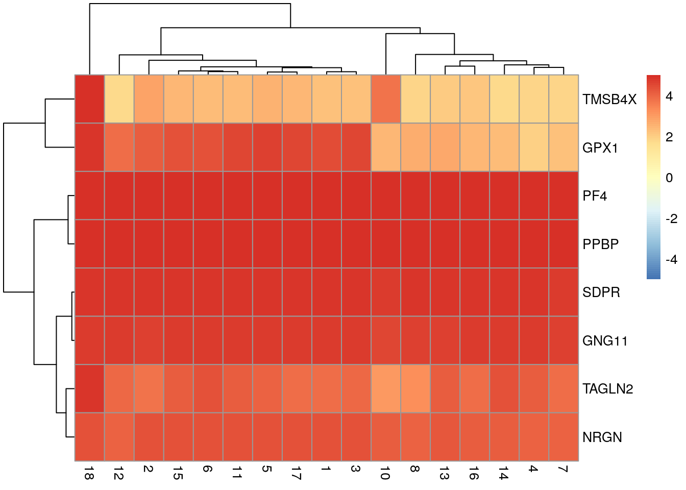
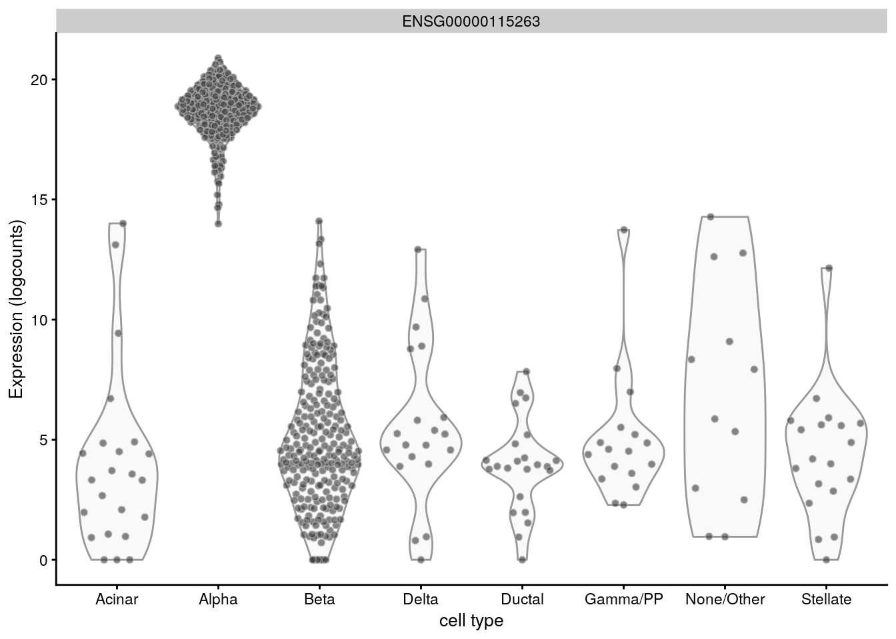

---
output:
  html_document
bibliography: ../ref.bib
---

# Marker gene detection

<script>
document.addEventListener("click", function (event) {
    if (event.target.classList.contains("aaron-collapse")) {
        event.target.classList.toggle("active");
        var content = event.target.nextElementSibling;
        if (content.style.display === "block") {
          content.style.display = "none";
        } else {
          content.style.display = "block";
        }
    }
})
</script>

<style>
.aaron-collapse {
  background-color: #eee;
  color: #444;
  cursor: pointer;
  padding: 18px;
  width: 100%;
  border: none;
  text-align: left;
  outline: none;
  font-size: 15px;
}

.aaron-content {
  padding: 0 18px;
  display: none;
  overflow: hidden;
  background-color: #f1f1f1;
}
</style>

## Motivation

To interpret our clustering results from Chapter \@ref(clustering), we identify the genes that drive separation between clusters.
These marker genes allow us to assign biological meaning to each cluster based on their functional annotation.
In the most obvious case, the marker genes for each cluster are _a priori_ associated with particular cell types, allowing us to treat the clustering as a proxy for cell type identity.
The same principle can be applied to discover more subtle differences between clusters (e.g., changes in activation or differentiation state) based on the behavior of genes in the affected pathways.

Identification of marker genes is usually based around the retrospective detection of differential expression between clusters.
Genes that are more strongly DE are more likely to have caused separate clustering of cells in the first place.
Several different statistical tests are available to quantify the differences in expression profiles, and different approaches can be used to consolidate test results into a single ranking of genes for each cluster.
These choices parametrize the theoretical differences between the various marker detection strategies presented in this chapter.
We will demonstrate using the 10X PBMC dataset:

<button class="aaron-collapse">View history</button>
<div class="aaron-content">
   
```r
### setup ###
library(OSCAUtils)
chapterPreamble(use_cache = TRUE)

### loading ###
library(BiocFileCache)
bfc <- BiocFileCache("raw_data", ask = FALSE)
raw.path <- bfcrpath(bfc, file.path("http://cf.10xgenomics.com/samples",
    "cell-exp/2.1.0/pbmc4k/pbmc4k_raw_gene_bc_matrices.tar.gz"))
untar(raw.path, exdir=file.path(tempdir(), "pbmc4k"))

library(DropletUtils)
fname <- file.path(tempdir(), "pbmc4k/raw_gene_bc_matrices/GRCh38")
sce.pbmc <- read10xCounts(fname, col.names=TRUE)

### gene-annotation ###
library(scater)
rownames(sce.pbmc) <- uniquifyFeatureNames(
    rowData(sce.pbmc)$ID, rowData(sce.pbmc)$Symbol)

library(EnsDb.Hsapiens.v86)
location <- mapIds(EnsDb.Hsapiens.v86, keys=rowData(sce.pbmc)$ID, 
    column="SEQNAME", keytype="GENEID")

### cell-detection ###
set.seed(100)
e.out <- emptyDrops(counts(sce.pbmc))
sce.pbmc <- sce.pbmc[,which(e.out$FDR <= 0.001)]

### quality-control ###
stats <- perCellQCMetrics(sce.pbmc, subsets=list(Mito=which(location=="MT")))
high.mito <- isOutlier(stats$subsets_Mito_percent, nmads=3, type="higher")
sce.pbmc <- sce.pbmc[,!high.mito]

### normalization ###
library(scran)
set.seed(1000)
clusters <- quickCluster(sce.pbmc)
sce.pbmc <- computeSumFactors(sce.pbmc, cluster=clusters)
sce.pbmc <- logNormCounts(sce.pbmc)

### variance-modelling ###
set.seed(1001)
dec.pbmc <- modelGeneVarByPoisson(sce.pbmc)

### dimensionality-reduction ###
set.seed(10000)
sce.pbmc <- denoisePCA(sce.pbmc, technical=dec.pbmc)

set.seed(100000)
sce.pbmc <- runTSNE(sce.pbmc, use_dimred="PCA")

set.seed(1000000)
sce.pbmc <- runUMAP(sce.pbmc, use_dimred="PCA")

### clustering ###
g <- buildSNNGraph(sce.pbmc, k=10, use.dimred = 'PCA')
clust <- igraph::cluster_walktrap(g)$membership
sce.pbmc$cluster <- factor(clust)
```

</div>


```r
sce.pbmc
```

```
## class: SingleCellExperiment 
## dim: 33694 3922 
## metadata(1): Samples
## assays(2): counts logcounts
## rownames(33694): RP11-34P13.3 FAM138A ... AC213203.1 FAM231B
## rowData names(2): ID Symbol
## colnames(3922): AAACCTGAGAAGGCCT-1 AAACCTGAGACAGACC-1 ...
##   TTTGTCACAGGTCCAC-1 TTTGTCATCCCAAGAT-1
## colData names(3): Sample Barcode cluster
## reducedDimNames(3): PCA TSNE UMAP
## spikeNames(0):
## altExpNames(0):
```

## Using pairwise $t$-tests

### Standard application

The Welch $t$-test is an obvious choice of statistical method to test for differences in expression between clusters.
It is quickly computed and has good statistical properties for large numbers of cells [@soneson2018bias].
We use the `findMarkers()` function to perform pairwise comparisons between clusters for each gene.
This yields a list of `DataFrame`s containing ranked candidate markers for each cluster.


```r
library(scran)
markers.pbmc <- findMarkers(sce.pbmc, sce.pbmc$cluster)
markers.pbmc
```

```
## List of length 13
## names(13): 1 2 3 4 5 6 7 8 9 10 11 12 13
```


To demonstrate, we use cluster 9 as our cluster of interest for this section.
The relevant `DataFrame` contains log~2~-fold changes of expression in cluster 9 over each other cluster, along with several statistics obtained by combining $p$-values [@simes1986improved] across the pairwise comparisons involving 9.


```r
chosen <- "9"
interesting <- markers.pbmc[[chosen]]
colnames(interesting)
```

```
##  [1] "Top"      "p.value"  "FDR"      "logFC.1"  "logFC.2"  "logFC.3" 
##  [7] "logFC.4"  "logFC.5"  "logFC.6"  "logFC.7"  "logFC.8"  "logFC.10"
## [13] "logFC.11" "logFC.12" "logFC.13"
```

Of particular interest is the `Top` field, which contains the highest^[That is, the lowest rank value. So 1st is 1, and 2nd is 2, so 1 is higher than 2. Geez.] rank for each gene across all pairwise comparisons involving cluster 9.
The set of genes with `Top` values of 1 contains the gene with the lowest $p$-value from each comparison.
Similarly, the set of genes with `Top` values less than or equal to 10 contains the top 10 genes from each comparison.
Each `DataFrame` produced by `findMarkers()` will order genes based on the `Top` value.


```r
interesting[1:10,1:3]
```

```
## DataFrame with 10 rows and 3 columns
##                Top               p.value                   FDR
##          <integer>             <numeric>             <numeric>
## RPL17            1                     0                     0
## FCN1             1                     0                     0
## CD79A            1 4.94065645841247e-324 3.10026192765382e-320
## GZMA             1 1.37083742804146e-182 1.44340613438842e-179
## HLA-DQA1         1 5.35073483016649e-102  1.33546414346393e-99
## SERPINA1         1  3.25017479146583e-70  3.52126654095339e-68
## RPS21            1   2.1210843180971e-59  1.60963547328749e-57
## PF4              1   1.5228760366009e-34  4.54488796963955e-33
## TAGLN2           1  1.17809170326906e-24  2.12497975642118e-23
## TRAC             2                     0                     0
```


We use the `Top` value to identify a set of genes that is guaranteed to distinguish cluster 9 from any other cluster.
Here, we examine the top 6 genes from each pairwise comparison (Figure \@ref(fig:heat-basic-pbmc)).
Some inspection of the most upregulated genes suggest that cluster 9 contains platelets or their precursors, based on the expression of platelet factor 4 (_PF4_) and pro-platelet basic protein (_PPBP_).


```r
best.set <- interesting[interesting$Top <= 6,]
logFCs <- as.matrix(best.set[,-(1:3)])
colnames(logFCs) <- sub("logFC.", "", colnames(logFCs))

library(pheatmap)
pheatmap(logFCs, breaks=seq(-5, 5, length.out=101))
```

<div class="figure">

<p class="caption">(\#fig:heat-basic-pbmc)Heatmap of log-fold changes for cluster 9 over all other clusters. Colours are capped at -5 and 5 to preserve dynamic range.</p>
</div>


We intentionally use pairwise comparisons between clusters rather than comparing each cluster to the average of all other cells.
The latter approach is sensitive to the population composition, potentially resulting in substantially different sets of markers when cell type abundances change in different contexts.
In the worst case, the presence of a single dominant subpopulation will drive the selection of top markers for every other cluster, pushing out useful genes that can resolve the various minor subpopulations.
Moreover, pairwise comparisons naturally provide more information to interpret of the utility of a marker, e.g., by providing log-fold changes to indicate which clusters are distinguished by each gene.

### Using the log-fold change 

Our previous `findMarkers()` call considers both up- and downregulated genes to be potential markers.
However, downregulated genes are less appealing as markers as it is more difficult to interpret and experimentally validate an absence of expression.
To focus on up-regulated markers, we can instead perform a one-sided $t$-test to identify genes that are upregulated in each cluster compared to the others.
This is achieved by setting `direction="up"` in the `findMarkers()` call.


```r
markers.pbmc.up <- findMarkers(sce.pbmc, sce.pbmc$cluster, direction="up")
interesting.up <- markers.pbmc.up[[chosen]]
interesting.up[1:10,1:3]
```

```
## DataFrame with 10 rows and 3 columns
##                 Top              p.value                  FDR
##           <integer>            <numeric>            <numeric>
## PF4               1 7.61438018300447e-35 2.56558925886152e-30
## TAGLN2            1 5.89045851634529e-25 6.61577030832462e-21
## TMSB4X            2 9.43069564959555e-29 1.58878929608736e-24
## SDPR              2 2.29014386984465e-21 1.92910268876363e-17
## GPX1              2 1.26846364063111e-20  8.5479227814849e-17
## NRGN              3 1.52237314064039e-20  8.5491401001229e-17
## PPBP              3 2.51604788284947e-20   1.211081676639e-16
## CCL5              5 2.89814903962753e-18 1.08500259712455e-14
## GNG11             6 2.14726740611927e-18 9.04375349772286e-15
## HIST1H2AC         8 1.20139521482573e-17 4.04798103683381e-14
```

The $t$-test also allows us to specify a non-zero log-fold change as the null hypothesis.
This allows us to consider the magnitude of the log-fold change in our $p$-value calculations, in a manner that is more rigorous than simply filtering directly on the log-fold changes [@mccarthy2009treat].
(Specifically, a simple threshold does not consider the variance and can enrich for genes that have both large log-fold changes and large variances.) 
We perform this by setting `lfc=` in our `findMarkers()` call - when combined with `direction=`, this tests for genes with log-fold changes that are significantly greater than 1:


```r
markers.pbmc.up2 <- findMarkers(sce.pbmc, sce.pbmc$cluster, 
    direction="up", lfc=1)
interesting.up2 <- markers.pbmc.up2[[chosen]]
interesting.up2[1:10,1:3]
```

```
## DataFrame with 10 rows and 3 columns
##                 Top              p.value                  FDR
##           <integer>            <numeric>            <numeric>
## PF4               1 2.47914071210112e-30 8.35321671535349e-26
## TAGLN2            1 3.53618505519327e-20 3.97160730832274e-16
## TMSB4X            2 9.05483585111072e-21 1.52546819583662e-16
## SDPR              2 1.24358967592959e-17 1.04753776351929e-13
## PPBP              3 3.25906892859222e-17 2.19622136959972e-13
## NRGN              4 2.36955118201336e-16  1.3306609587793e-12
## GPX1              5 2.97170317345641e-16   1.430408096092e-12
## GNG11             5  1.0126662067301e-14 4.26509689619549e-11
## CCL5              6 1.74016687637855e-14 6.51479808141098e-11
## HIST1H2AC         7  4.0112914785935e-14  1.3515645507973e-10
```

These two settings yield a more focused set of candidate marker genes that are upregulated in cluster 9 (Figure \@ref(fig:heat-focused-pbmc)).


```r
best.set <- interesting.up2[interesting.up2$Top <= 5,]
logFCs <- as.matrix(best.set[,-(1:3)])
colnames(logFCs) <- sub("logFC.", "", colnames(logFCs))

library(pheatmap)
pheatmap(logFCs, breaks=seq(-5, 5, length.out=101))
```

<div class="figure">

<p class="caption">(\#fig:heat-focused-pbmc)Heatmap of log-fold changes for cluster 9 over all other clusters. Colours are capped at -5 and 5 to preserve dynamic range.</p>
</div>

Of course, this increased stringency is not without cost.
If only upregulated genes are requested from `findMarkers()`, any cluster defined by downregulation of a marker gene will not contain that gene among the top set of features in its `DataFrame`.
This is occasionally relevant for subtypes or other states that are distinguished by high versus low expression of particular genes^[Standard operating procedure is to (i) experience a brief but crushing bout of disappointment due to the poor quality of upregulated candidate markers, (ii) rage-quit, and (iii) remember to check the genes that are changing in the other direction.].
Similarly, setting an excessively high log-fold change threshold may discard otherwise useful genes.
For example, a gene upregulated in a small proportion of cells of a cluster will have a small log-fold change but can still be an effective marker if the focus is on specificity rather than sensitivity.

### Finding cluster-specific markers 

By default, `findMarkers()` will give a high ranking to genes that are differentially expressed in any pairwise comparison.
This is because a gene only needs a very low $p$-value in a single pairwise comparison to achieve a low `Top` value.
A more stringent approach would only consider genes that are differentially expressed in all pairwise comparisons involving the cluster of interest.
To achieve this, we set `pval.type="all"` in `findMarkers()` to use an intersection-union test [@berger1996bioequivalence] where the combined $p$-value for each gene is the maximum of the $p$-values from all pairwise comparisons.
A gene will only achieve a low combined $p$-value if it is strongly DE in all comparisons to other clusters.


```r
# We can combine this with 'direction='.
markers.pbmc.up3 <- findMarkers(sce.pbmc, sce.pbmc$cluster, 
    pval.type="all", direction="up")
interesting.up3 <- markers.pbmc.up3[[chosen]]
interesting.up3[1:10,1:2]
```

```
## DataFrame with 10 rows and 2 columns
##                        p.value                  FDR
##                      <numeric>            <numeric>
## SDPR      2.64542208645325e-21 8.91348517809558e-17
## PF4       5.78149277110587e-21 9.74008087148203e-17
## PPBP      3.96127718259098e-20 4.44904244634069e-16
## NRGN      7.15349687737025e-20 6.02574809465284e-16
## GNG11     2.16841693101845e-18 1.46125280147471e-14
## HIST1H2AC 1.35678204552313e-17 7.61923570697606e-14
## TUBB1     1.97176194003573e-17 9.49093525822337e-14
## TAGLN2    3.60037071481044e-16 1.51638613581029e-12
## CLU       3.32361900613728e-12 1.24428909769766e-08
## MAP3K7CL  9.64255913249957e-11 3.24896387410441e-07
```

This strategy will only report genes that are highly specific to the cluster of interest.
When it works, it can be highly effective as it generates a small focused set of candidate markers. 
However, any gene that is expressed at the same level in two or more clusters will simply not be detected. 
This is likely to discard many interesting genes, especially if the clusters are finely resolved with weak separation.
To give a concrete example, consider a mixed population of CD4^+^-only, CD8^+^-only, double-positive and double-negative T cells.
With `pval.type="all"`, neither _Cd4_ or _Cd8_ would be detected as subpopulation-specific markers because each gene is expressed in two subpopulations.
In comparison, `pval.type="any"` will detect both of these genes as they will be DE between at least one pair of subpopulations.

If `pval.type="all"` is too stringent yet `pval.type="any"` is too generous, a compromise is to set `pval.type="some"`.
For each gene, we apply the Holm-Bonferroni correction across its $p$-values and take the middle-most value as the combined $p$-value.
This effectively tests the global null hypothesis that at least 50% of the individual pairwise comparisons exhibit no DE.
We then rank the genes by their combined $p$-values to obtain an ordered set of marker candidates.
The aim is to improve the conciseness of the top markers for defining a cluster while mitigating the risk of discarding useful genes that are not DE to all other clusters.
The downside is that taking this compromise position sacrifices the theoretical guarantees offered at the other two extremes.


```r
markers.pbmc.up4 <- findMarkers(sce.pbmc, sce.pbmc$cluster, 
    pval.type="some", direction="up")
interesting.up4 <- markers.pbmc.up4[[chosen]]
interesting.up4[1:10,1:2]
```

```
## DataFrame with 10 rows and 2 columns
##                        p.value                  FDR
##                      <numeric>            <numeric>
## PF4       1.34171594707859e-30  4.5207777120866e-26
## TAGLN2    1.70785368525785e-20 2.21374764917867e-16
## SDPR      1.97104616475812e-20 2.21374764917867e-16
## NRGN      9.53525684636241e-20 8.03202360453334e-16
## PPBP       2.0785213983819e-19 1.40067399994159e-15
## TMSB4X    2.17861222131455e-18 1.22343600308287e-14
## CCL5      1.22167377577338e-17 5.88043945727261e-14
## GNG11     1.64141245721697e-17 6.91321891668358e-14
## GPX1        3.062257061009e-17 1.14644099348486e-13
## HIST1H2AC 7.11952649219183e-17 2.39885325627912e-13
```

## Alternative testing regimes

### Using the Wilcoxon rank sum test

The Wilcoxon rank sum test (also known as the Wilcoxon-Mann-Whitney test, or WMW test) is another widely used method for pairwise comparisons between groups of observations.
Its strength lies in the fact that it directly assesses separation between the expression distributions of different clusters.
The WMW test statistic is proportional to the area-under-the-curve (AUC), i.e., the concordance probability, which is the probability of a random cell from one cluster having higher expression than a random cell from another cluster.
In a pairwise comparison, AUCs of 1 or 0 indicate that the two clusters have perfectly separated expression distributions.
Thus, the WMW test directly addresses the most desirable property of a candidate marker gene, while the $t$ test only does so indirectly via the difference in the means and the intra-group variance.

We perform WMW tests using the `findMarkers()` function, with `test="wilcox"`.
This returns a list of `DataFrame`s containing ranked candidate markers for each cluster.
The `direction=`, `lfc=` and `pval.type=` arguments can be specified and have the same interpretation as described for $t$ tests.
We demonstrate below by detecting upregulated genes in each cluster with `direction="up"`.


```r
markers.pbmc.wmw <- findMarkers(sce.pbmc, test="wilcox",
    sce.pbmc$cluster, direction="up")
names(markers.pbmc.wmw)
```

```
##  [1] "1"  "2"  "3"  "4"  "5"  "6"  "7"  "8"  "9"  "10" "11" "12" "13"
```

To explore the results in more detail, we focus on the `DataFrame` for cluster 9.
The interpretation of `Top` is the same as described for $t$ tests, and Simes' method is again used to combine $p$-values across pairwise comparisons.


```r
interesting.wmw <- markers.pbmc.wmw[[chosen]]
interesting.wmw[1:10,1:3]
```

```
## DataFrame with 10 rows and 3 columns
##                 Top               p.value                   FDR
##           <integer>             <numeric>             <numeric>
## PF4               1 8.08836814327471e-171 2.72529476219502e-166
## TMSB4X            1  4.35567099549791e-27  1.78975583563788e-24
## SDPR              2 2.22549729387729e-154 3.74929529099511e-150
## NRGN              2 1.23257738444852e-134 8.30609247832188e-131
## TUBB1             3 2.51972786764474e-141 2.82999035908077e-137
## PPBP              3 1.32349036700182e-139 1.11484211064399e-135
## TAGLN2            3  6.93330922792726e-29  3.03390806656859e-26
## GNG11             4 1.91716980133711e-131 1.07661865477089e-127
## CLU               5 1.36333326086643e-125 6.56230727023318e-122
## HIST1H2AC         5  3.49987765494615e-95  9.82707314214643e-92
```

The `DataFrame` contains the AUCs from comparing cluster 9 to every other cluster (Figure \@ref(fig:heat-wmw-pbmc)).
A value greater than 0.5 indicates that the gene is upregulated in the current cluster compared to the other cluster,
while values less than 0.5 correspond to downregulation.
We would typically expect AUCs of 0.7-0.8 for a strongly upregulated candidate marker.


```r
best.set <- interesting.wmw[interesting.wmw$Top <= 5,]
AUCs <- as.matrix(best.set[,-(1:3)])
colnames(AUCs) <- sub("AUC.", "", colnames(AUCs))

library(pheatmap)
pheatmap(AUCs, breaks=seq(0, 1, length.out=21),
    color=viridis::viridis(21))
```

<div class="figure">

<p class="caption">(\#fig:heat-wmw-pbmc)Heatmap of AUCs for cluster 9 compared to all other clusters.</p>
</div>

The main disadvantage of the WMW test is that the AUCs are much slower to compute compared to $t$-statistics.
This may be inconvenient for interactive analyses involving multiple iterations of marker detection.
We can mitigate this to some extent by parallelizing these calculations using the `BPPARAM=` argument in `findMarkers()`.

### Using a binomial test

The binomial test identifies genes that differ in the proportion of expressing cells between clusters.
(For the purposes of this section, a cell is considered to express a gene simply if it has non-zero expression for that gene.)
This represents a much more stringent definition of marker genes compared to the other methods, as differences in expression between clusters are effectively ignored if both distributions of expression values are not near zero.
The premise is that genes are more likely to contribute to important biological decisions if they were active in one cluster and silent in another, compared to more subtle "tuning" effects from changing the expression of an active gene.
From a practical perspective, a binary measure of presence/absence is easier to validate.

We perform pairwise binomial tests between clusters using the `findMarkers()` function, with `test="binom`.
This returns a list of `DataFrame`s containing marker statistics for each cluster, such as the `Top` rank and its $p$-value.
Here, the effect size is reported as the log-fold change in this proportion between each pair of clusters.
Large positive log-fold changes indicate that the gene is more frequently expressed in one cluster compared to the other.
Here, we focus on genes that are upregulated in each cluster compared to the others by setting `direction="up"`.


```r
markers.pbmc.binom <- findMarkers(sce.pbmc, test="binom",
    sce.pbmc$cluster, direction="up")
names(markers.pbmc.binom)
```

```
##  [1] "1"  "2"  "3"  "4"  "5"  "6"  "7"  "8"  "9"  "10" "11" "12" "13"
```

```r
interesting.binom <- markers.pbmc.binom[[chosen]]
colnames(interesting.binom)
```

```
##  [1] "Top"      "p.value"  "FDR"      "logFC.1"  "logFC.2"  "logFC.3" 
##  [7] "logFC.4"  "logFC.5"  "logFC.6"  "logFC.7"  "logFC.8"  "logFC.10"
## [13] "logFC.11" "logFC.12" "logFC.13"
```

Figure \@ref(fig:viol-de-binom) confirms that the top genes exhibit strong differences in the proportion of expressing cells in cluster 9 compared to the others. 


```r
library(scater)
top.genes <- head(rownames(interesting.binom))
plotExpression(sce.pbmc, x="cluster", features=top.genes)
```

<div class="figure">

<p class="caption">(\#fig:viol-de-binom)Distribution of log-normalized expression values for the top 10 DE genes involving cluster 9 with the binomial test, stratified by cluster assignment and coloured by the plate of origin for each cell.</p>
</div>

The disadvantage of the binomial test is that its increased stringency can lead to the loss of good candidate markers.
For example, _GCG_ is a known marker for pancreatic alpha cells but is expressed in almost every other cell of the @lawlor2017singlecell pancreas data (Figure \@ref(fig:viol-gcg-lawlor)) and would not be highly ranked by the binomial test.

<button class="aaron-collapse">View history</button>
<div class="aaron-content">
   
```r
### setup ###
library(OSCAUtils)
chapterPreamble(use_cache = TRUE)

### loading ###
library(scRNAseq)
sce.lawlor <- LawlorPancreasData()

### gene-annotation ###
library(AnnotationHub)
edb <- AnnotationHub()[["AH73881"]]
anno <- select(edb, keys=rownames(sce.lawlor), keytype="GENEID", 
    columns=c("SYMBOL", "SEQNAME"))
rowData(sce.lawlor) <- anno[match(rownames(sce.lawlor), anno[,1]),-1]

### quality-control ###
library(scater)
stats <- perCellQCMetrics(sce.lawlor, 
    subsets=list(Mito=which(rowData(sce.lawlor)$SEQNAME=="MT")))
qc <- quickPerCellQC(stats, percent_subsets="subsets_Mito_percent", nmads=3)
sce.lawlor <- sce.lawlor[,!qc$discard]

### normalization ###
library(scran)
set.seed(1000)
clusters <- quickCluster(sce.lawlor)
sce.lawlor <- computeSumFactors(sce.lawlor, clusters=clusters)
sce.lawlor <- logNormCounts(sce.lawlor)
```

</div>


```r
plotExpression(sce.lawlor, x="cell type", features="ENSG00000115263")
```

<div class="figure">

<p class="caption">(\#fig:viol-gcg-lawlor)Distribution of log-normalized expression values for _GCG_ across different pancreatic cell types in GSE86469.</p>
</div>

Another property of the binomial test is that it will not respond to scaling normalization.
Systematic differences in library size between clusters will not be considered when computing $p$-values or effect sizes.
This is not necessarily problematic for marker gene detection -
users can treat this as retaining information about the total RNA content, analogous to spike-in normalization.

### Using custom DE methods

It is possible to perform marker gene detection based on precomputed DE statistics.
This allows us to take advantage of more sophisticated tests in dedicated DE analysis packages.
To demonstrate, consider the `voom()` approach from the *[limma](https://bioconductor.org/packages/3.10/limma)* package [@law2014voom].
We first process our `SingleCellExperiment` to obtain a `fit` object as shown below.


```r
library(limma)
design <- model.matrix(~0 + cluster, data=colData(sce.pbmc))
colnames(design)
```

```
##  [1] "cluster1"  "cluster2"  "cluster3"  "cluster4"  "cluster5" 
##  [6] "cluster6"  "cluster7"  "cluster8"  "cluster9"  "cluster10"
## [11] "cluster11" "cluster12" "cluster13"
```

```r
# Removing very low-abundance genes.
keep <- calculateAverage(sce.pbmc) > 0.1 
summary(keep)
```

```
##    Mode   FALSE    TRUE 
## logical   29480    4214
```

```r
y <- convertTo(sce.pbmc, subset.row=keep)
v <- voom(y, design)
fit <- lmFit(v, design)
```

We then perform pairwise comparisons between clusters using the TREAT strategy [@mccarthy2009treat] to test for log-fold changes that are significantly greater than 0.5.
For each comparison, we store the corresponding data frame of statistics in `all.results`, along with the identities of the clusters involved in `all.pairs`.


```r
nclust <- length(unique(sce.pbmc$cluster))
all.results <- all.pairs <- list()
counter <- 1L

# Iterating across the first 'nclust' coefficients in design,
# and comparing them to each other in a pairwise manner.
for (x in seq_len(nclust)) {
    for (y in seq_len(x-1L)) {
        con <- integer(ncol(design))
        con[x] <- 1
        con[y] <- -1
        fit2 <- contrasts.fit(fit, con)
        fit2 <- treat(fit2, robust=TRUE, lfc=0.5)

        res <- topTreat(fit2, n=Inf, sort.by="none")
        all.results[[counter]] <- res
        all.pairs[[counter]] <- colnames(design)[c(x, y)]
        counter <- counter+1L

        # Also filling the reverse comparison.
        res$logFC <- -res$logFC
        all.results[[counter]] <- res
        all.pairs[[counter]] <- colnames(design)[c(y, x)]
        counter <- counter+1L
    }
}
```

These custom results are consolidated into a single marker list for each cluster with the `combineMarkers()` function.
This combines test statistics across all pairwise comparisons involving a single cluster,
yielding a per-cluster `DataFrame` that can be interpreted in the same manner as discussed previously.


```r
all.pairs <- do.call(rbind, all.pairs)
combined <- combineMarkers(all.results, all.pairs, pval.field="P.Value")

# Inspecting results for our cluster of interest again.
interesting.voom <- combined[[paste0("cluster", chosen)]] 
colnames(interesting.voom)
```

```
##  [1] "Top"             "p.value"         "FDR"            
##  [4] "logFC.cluster1"  "logFC.cluster2"  "logFC.cluster3" 
##  [7] "logFC.cluster4"  "logFC.cluster5"  "logFC.cluster6" 
## [10] "logFC.cluster7"  "logFC.cluster8"  "logFC.cluster10"
## [13] "logFC.cluster11" "logFC.cluster12" "logFC.cluster13"
```

```r
head(interesting.voom[,1:3])
```

```
## DataFrame with 6 rows and 3 columns
##                 Top   p.value       FDR
##           <integer> <numeric> <numeric>
## CD160             1         0         0
## RGS18             1         0         0
## C2orf88           1         0         0
## SDPR              1         0         0
## PPBP              1         0         0
## HIST2H2BE         2         0         0
```

By default, we do not use custom DE methods to perform marker detection, for several reasons.
Many of these methods rely on empirical Bayes shrinkage to share information across genes in the presence of limited replication. 
However, this is unnecessary when there are large numbers of "replicate" cells in each group (Section \@ref(false-replicates)).
These methods also make stronger assumptions about the data (e.g., equal variances for linear models, the distribution of variances during empirical Bayes) that are more likely to be violated in noisy scRNA-seq contexts.
From a practical perspective, they require more work to set up and take more time to run.
Nonetheless, some custom methods (e.g., *[MAST](https://bioconductor.org/packages/3.10/MAST)*) may provide a useful point of difference from the simpler tests, in which case they can be converted into a marker detection scheme as described above.

## Handling blocking factors {#marker-batch}

## Using the `block=` argument

Large studies may contain factors of variation that are known and not interesting (e.g., batch effects, sex differences).
If these are not modelled, they can interfere with marker gene detection - most obviously by inflating the variance within each cluster, but also by distorting the log-fold changes if the cluster composition varies across levels of the blocking factor.
To avoid these issues, we set the `block=` argument in the `findMarkers()` call, as demonstrated below for the 416B data set.

<button class="aaron-collapse">View history</button>
<div class="aaron-content">
   
```r
### setup ###
library(OSCAUtils)
chapterPreamble(use_cache = TRUE)

### loading ###
library(scRNAseq)
sce.416b <- LunSpikeInData(which="416b") 
sce.416b$block <- factor(sce.416b$block)

### gene-annotation ###
library(AnnotationHub)
ens.mm.v97 <- AnnotationHub()[["AH73905"]]
rowData(sce.416b)$ENSEMBL <- rownames(sce.416b)
rowData(sce.416b)$SYMBOL <- mapIds(ens.mm.v97, keys=rownames(sce.416b),
    keytype="GENEID", column="SYMBOL")
rowData(sce.416b)$SEQNAME <- mapIds(ens.mm.v97, keys=rownames(sce.416b),
    keytype="GENEID", column="SEQNAME")

library(scater)
rownames(sce.416b) <- uniquifyFeatureNames(rowData(sce.416b)$ENSEMBL, 
    rowData(sce.416b)$SYMBOL)

### quality-control ###
mito <- which(rowData(sce.416b)$SEQNAME=="MT")
stats <- perCellQCMetrics(sce.416b, subsets=list(Mt=mito))
qc <- quickPerCellQC(stats, percent_subsets=c("subsets_Mt_percent",
    "altexps_ERCC_percent"), nmads=3, batch=sce.416b$block)
sce.416b <- sce.416b[,!qc$discard]

### normalization ###
library(scran)
sce.416b <- computeSumFactors(sce.416b)
sce.416b <- logNormCounts(sce.416b)

### variance-modelling ###
dec.416b <- modelGeneVarWithSpikes(sce.416b, "ERCC", block=sce.416b$block)

### batch-correction ###
library(limma)
assay(sce.416b, "corrected") <- removeBatchEffect(logcounts(sce.416b), 
    design=model.matrix(~sce.416b$phenotype), batch=sce.416b$block)

### dimensionality-reduction ###
sce.416b <- denoisePCA(sce.416b, technical=dec.416b, 
    assay.type="corrected", BSPARAM=BiocSingular::ExactParam())

set.seed(1010)
sce.416b <- runTSNE(sce.416b, dimred="PCA", perplexity=10)

### clustering ###
my.dist <- dist(reducedDim(sce.416b, "PCA"))
my.tree <- hclust(my.dist, method="ward.D2")

library(dynamicTreeCut)
my.clusters <- unname(cutreeDynamic(my.tree, distM=as.matrix(my.dist),
    minClusterSize=10, verbose=0))
sce.416b$cluster <- factor(my.clusters)
```

</div>


```r
m.out <- findMarkers(sce.416b, sce.416b$cluster, 
                     block=sce.416b$block, direction="up") 
```

For each gene, each pairwise comparion between clusters is performed separately in each level of the blocking factor - in this case, the plate of origin.
The function will then combine $p$-values from different plates using Stouffer's Z method to obtain a single $p$-value per pairwise comparison.
(These $p$-values are further combined across comparisons to obtain a single $p$-value per gene, using either Simes' method or an intersection-union test depending on the value of `pval.type=`.)
This approach favours genes that exhibit consistent DE in the same direction in each plate.


```r
demo <- m.out[["1"]] 
demo[demo$Top <= 5,1:3]
```

```
## DataFrame with 13 rows and 3 columns
##               Top              p.value                  FDR
##         <integer>            <numeric>            <numeric>
## Myh11           1 8.70379353665452e-50 4.05631593982246e-45
## Foxs1           1 5.70065284566248e-12 2.45993727054865e-09
## Pirb            2  3.9893384208383e-35 9.29595638823736e-31
## Pi16            2 5.87787756676202e-30 9.13108687071258e-26
## Ctsd            2 8.79649054278078e-25 5.12439556569694e-21
## ...           ...                  ...                  ...
## Tob1            3  1.2226704656241e-08 2.57834092216949e-06
## Capn3           4 4.02212797192888e-08 7.65090824505198e-06
## Cd200r3         5 9.59924230550639e-29 7.45605147343032e-25
## Actb            5 1.58583399956683e-24 8.21180085731251e-21
## Ftl1            5  2.3909682109594e-21 6.96429265647197e-18
```

The `block=` argument works with all tests shown above and is robust to difference in the log-fold changes or variance between batches.
However, it assumes that each pair of clusters is present in at least one batch.
In scenarios where cells from two clusters never co-occur in the same batch, the comparison will be impossible and `NA`s will be reported in the output.

## Using the `design=` argument

Another approach is to define a design matrix containing the batch of origin as the sole factor.
`findMarkers()` will then fit a linear model to the log-expression values, similar to the use of *[limma](https://bioconductor.org/packages/3.10/limma)* for bulk RNA sequencing data [@ritchie2015limma].
This handles situations where multiple batches contain unique clusters, as comparisons can be implicitly performed via shared cell types in each batch.
There is also a slight increase in power when information is shared across clusters for variance estimation.


```r
# Setting up the design matrix (we remove intercept for full rank
# in the final design matrix with the cluster-specific terms).
design <- model.matrix(~sce.416b$block)
design <- design[,-1,drop=FALSE]

m.alt <- findMarkers(sce.416b, sce.416b$cluster, 
    design=design, direction="up")
demo <- m.alt[["1"]]
demo[demo$Top <= 5,1:3]
```

```
## DataFrame with 13 rows and 3 columns
##                          Top              p.value                  FDR
##                    <integer>            <numeric>            <numeric>
## Myh11                      1  3.2940708772022e-54 1.53516879161131e-49
## Cd63-ps                    1 9.88458944329352e-13 4.47244083898302e-10
## Cd200r3                    2  1.6929567812913e-40 3.94492789176498e-36
## Tmsb4x                     2 5.95298117666367e-40 9.24775782524113e-36
## Cd63                       2 2.35199836630095e-13 1.17862937487193e-10
## ...                      ...                  ...                  ...
## Itga6                      4 3.31744129988919e-30 2.20865763342909e-26
## Pirb                       4 3.44940547083215e-27 1.14825780401901e-23
## CBFB-MYH11-mcherry         5 1.64972827264699e-33  1.5376787283688e-29
## Capg                       5 4.93283561269364e-28 2.29889870893975e-24
## Fth1                       5 8.32037154463142e-20 1.10789312990286e-16
```

The use of a linear model makes some strong assumptions, necessitating some caution when interpreting the results.
If the batch effect is not consistent across clusters, the variance will be inflated and the log-fold change estimates will be distorted.
Variances are also assumed to be equal across groups, which is not true in general.
In particular, the presence of clusters in which a gene is silent will shrink the residual variance towards zero, preventing the model from penalizing genes with high variance in other clusters.
Thus, we generally recommend the use of `block=` where possible.

## Invalidity of $p$-values

### From data snooping

All of our DE strategies for detecting marker genes between clusters are statistically flawed to some extent.
The DE analysis is performed on the same data used to obtain the clusters, which represents "data dredging" (also known as fishing or data snooping).
The hypothesis of interest - are there differences between clusters? - is formulated from the data, so we are more likely to get a positive result when we re-use the data set to test that hypothesis.

The practical effect of data dredging is best illustrated with a simple simulation.
We simulate i.i.d. normal values, perform $k$-means clustering and test for DE between clusters of cells with `findMarkers()`.
The resulting distribution of $p$-values is heavily skewed towards low values (Figure \@ref(fig:pval-dist)).
Thus, we can detect "significant" differences between clusters even in the absence of any real substructure in the data.
This effect arises from the fact that clustering, by definition, yields groups of cells that are separated in expression space.
Testing for DE genes between clusters will inevitably yield some significant results as that is how the clusters were defined.


```r
library(scran)
set.seed(0)
y <- matrix(rnorm(100000), ncol=200)
clusters <- kmeans(t(y), centers=2)$cluster
out <- findMarkers(y, clusters)
hist(out[[1]]$p.value, col="grey80", xlab="p-value")
```

<div class="figure">

<p class="caption">(\#fig:pval-dist)Distribution of $p$-values from a DE analysis between two clusters in a simulation with no true subpopulation structure.</p>
</div>

For marker gene detection, this effect is largely harmless as the $p$-values are used only for ranking.
However, it becomes an issue when the $p$-values are used to define "significant differences" between clusters with respect to an error rate threshold.
Meaningful interpretation of error rates require consideration of the long-run behaviour, i.e., the rate of incorrect rejections if the experiment were repeated many times.
The concept of statistical significance for differences between clusters is not applicable if clusters and their interpretations are not stably reproducible across (hypothetical) replicate experiments.

### Nature of replication {#false-replicates}

The naive application of DE analysis methods will treat counts from the same cluster of cells as replicate observations.
This is not the most relevant level of replication when cells are derived from the same biological sample (i.e., cell culture, animal or patient).
DE analyses that treat cells as replicates fail to properly model the sample-to-sample variability [@lun2017overcoming].
The latter is arguably the more important level of replication as different samples will necessarily be generated if the experiment is to be replicated.
Indeed, the use of cells as replicates only masks the fact that the sample size is actually one in an experiment involving a single biological sample.
This reinforces the inappropriateness of using the marker gene $p$-values to perform statistical inference.

We strongly recommend selecting some markers for use in validation studies with an independent replicate population of cells.
A typical strategy is to identify a corresponding subset of cells that express the upregulated markers and do not express the downregulated markers.
Ideally, a different technique for quantifying expression would also be used during validation, e.g., fluorescent _in situ_ hybridisation or quantitative PCR.
This confirms that the subpopulation genuinely exists and is not an artifact of the scRNA-seq protocol or the computational analysis.

## Further comments

One consequence of the DE analysis strategy is that markers are defined relative to subpopulations in the same dataset.
Biologically meaningful genes will not be detected if they are expressed uniformly throughout the population, e.g., T cell markers will not be detected if only T cells are present in the dataset.
In practice, this is usually only a problem when the experimental data are provided without any biological context - certainly, we would hope to have some _a priori_ idea about what cells have been captured.
For most applications, it is actually desirable to avoid detecting such genes as we are interested in characterizing heterogeneity  within the context of a known cell population.
Continuing from the example above, the failure to detect T cell markers is of little consequence if we already know we are working with T cells.
Nonetheless, if "absolute" identification of cell types is necessary, we discuss some strategies for doing so in Chapter \@ref(cell-type-annotation).

Alternatively, marker detection can be performed by treating gene expression as a predictor variable for cluster assignment.
For a pair of clusters, we can find genes that discriminate between them by performing inference with a logistic model where the outcome for each cell is whether it was assigned to the first cluster and the lone predictor is the expression of each gene.
Treating the cluster assignment as the dependent variable is more philosophically pleasing in some sense, as the clusters are indeed defined from the expression data rather than being known in advance.
(Note that this does not solve the data snooping problem.)
In practice, this approach effectively does the same task as a Wilcoxon rank sum test in terms of quantifying separation between clusters.
Logistic models have the advantage in that they can easily be extended to block on multiple nuisance variables, though this is not typically necessary in most use cases.
Even more complex strategies use machine learning methods to determine which features contribute most to successful cluster classification, but this is probably unnecessary for routine analyses.

## Session Info {-}

<button class="aaron-collapse">View session info</button>
<div class="aaron-content">
```
R version 3.6.1 (2019-07-05)
Platform: x86_64-pc-linux-gnu (64-bit)
Running under: Ubuntu 14.04.5 LTS

Matrix products: default
BLAS:   /home/ramezqui/Rbuild/danbuild/R-3.6.1/lib/libRblas.so
LAPACK: /home/ramezqui/Rbuild/danbuild/R-3.6.1/lib/libRlapack.so

locale:
 [1] LC_CTYPE=en_US.UTF-8       LC_NUMERIC=C              
 [3] LC_TIME=en_US.UTF-8        LC_COLLATE=en_US.UTF-8    
 [5] LC_MONETARY=en_US.UTF-8    LC_MESSAGES=en_US.UTF-8   
 [7] LC_PAPER=en_US.UTF-8       LC_NAME=C                 
 [9] LC_ADDRESS=C               LC_TELEPHONE=C            
[11] LC_MEASUREMENT=en_US.UTF-8 LC_IDENTIFICATION=C       

attached base packages:
[1] parallel  stats4    stats     graphics  grDevices utils     datasets 
[8] methods   base     

other attached packages:
 [1] limma_3.41.17               scater_1.13.25             
 [3] ggplot2_3.2.1               pheatmap_1.0.12            
 [5] scran_1.13.26               SingleCellExperiment_1.7.11
 [7] SummarizedExperiment_1.15.9 DelayedArray_0.11.8        
 [9] BiocParallel_1.19.3         matrixStats_0.55.0         
[11] Biobase_2.45.1              GenomicRanges_1.37.16      
[13] GenomeInfoDb_1.21.2         IRanges_2.19.16            
[15] S4Vectors_0.23.25           BiocGenerics_0.31.6        
[17] Cairo_1.5-10                BiocStyle_2.13.2           
[19] OSCAUtils_0.0.1            

loaded via a namespace (and not attached):
 [1] viridis_0.5.1            edgeR_3.27.13           
 [3] BiocSingular_1.1.7       viridisLite_0.3.0       
 [5] DelayedMatrixStats_1.7.2 assertthat_0.2.1        
 [7] statmod_1.4.32           BiocManager_1.30.7      
 [9] highr_0.8                dqrng_0.2.1             
[11] GenomeInfoDbData_1.2.1   vipor_0.4.5             
[13] yaml_2.2.0               pillar_1.4.2            
[15] lattice_0.20-38          glue_1.3.1              
[17] digest_0.6.21            RColorBrewer_1.1-2      
[19] XVector_0.25.0           colorspace_1.4-1        
[21] cowplot_1.0.0            htmltools_0.4.0         
[23] Matrix_1.2-17            pkgconfig_2.0.3         
[25] bookdown_0.14            zlibbioc_1.31.0         
[27] purrr_0.3.2              scales_1.0.0            
[29] tibble_2.1.3             withr_2.1.2             
[31] lazyeval_0.2.2           magrittr_1.5            
[33] crayon_1.3.4             evaluate_0.14           
[35] beeswarm_0.2.3           tools_3.6.1             
[37] stringr_1.4.0            munsell_0.5.0           
[39] locfit_1.5-9.1           irlba_2.3.3             
[41] compiler_3.6.1           rsvd_1.0.2              
[43] rlang_0.4.0              grid_3.6.1              
[45] RCurl_1.95-4.12          BiocNeighbors_1.3.5     
[47] igraph_1.2.4.1           labeling_0.3            
[49] bitops_1.0-6             rmarkdown_1.16          
[51] gtable_0.3.0             R6_2.4.0                
[53] gridExtra_2.3            knitr_1.25              
[55] dplyr_0.8.3              stringi_1.4.3           
[57] ggbeeswarm_0.6.0         Rcpp_1.0.2              
[59] tidyselect_0.2.5         xfun_0.10               
```
</div>
