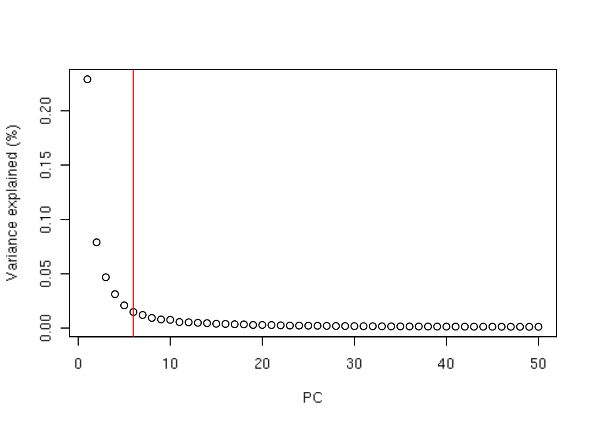
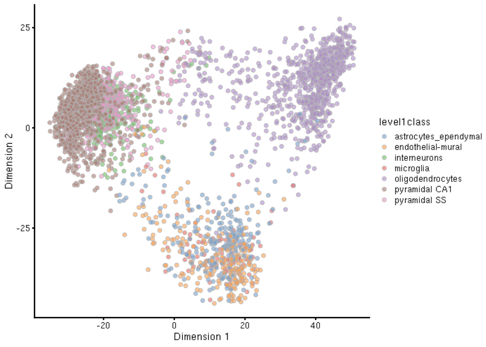
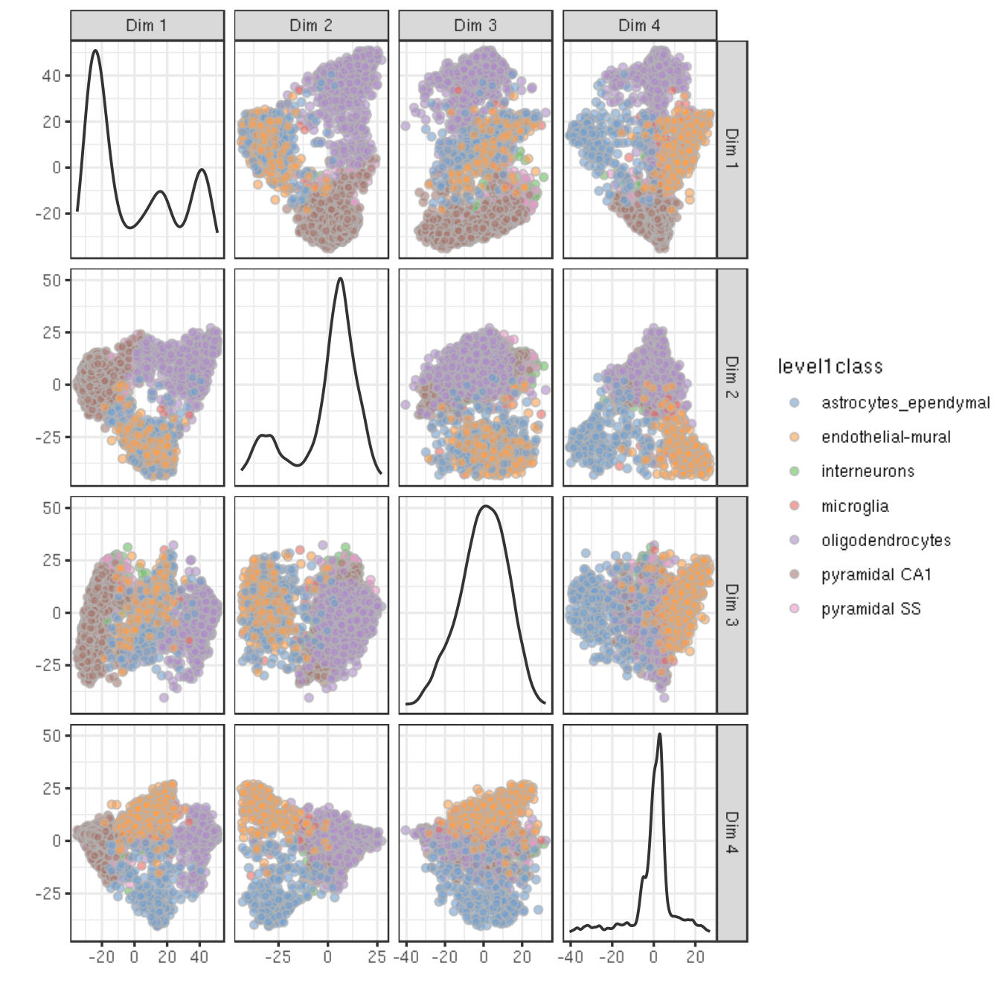
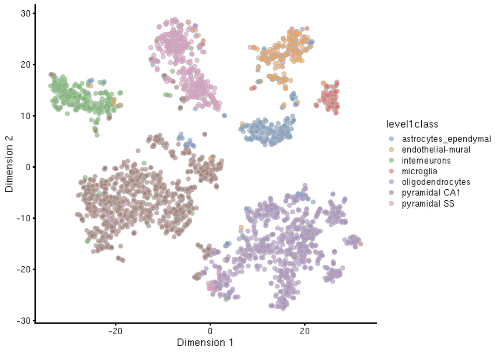
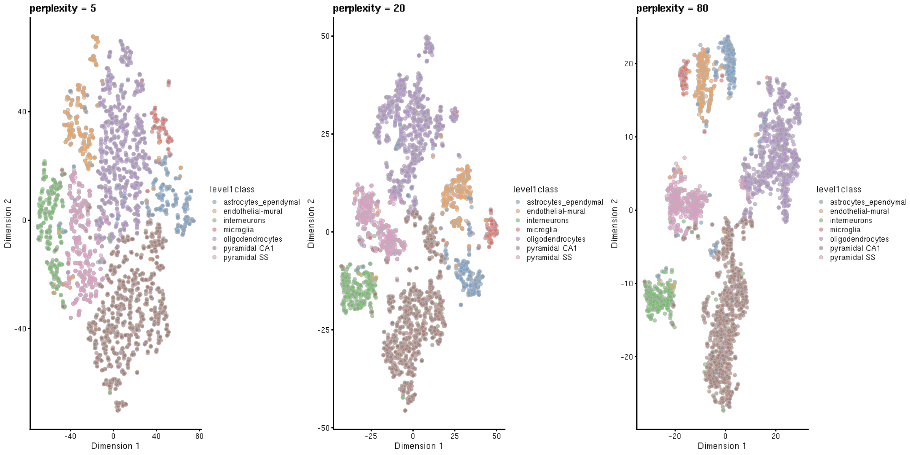
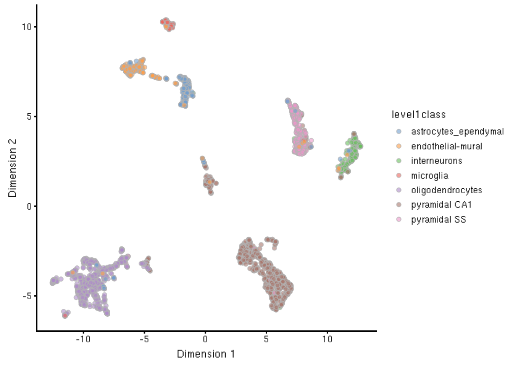

---
output:
  html_document
bibliography: ../ref.bib
---

# Dimensionality reduction

<script>
document.addEventListener("click", function (event) {
    if (event.target.classList.contains("aaron-collapse")) {
        event.target.classList.toggle("active");
        var content = event.target.nextElementSibling;
        if (content.style.display === "block") {
          content.style.display = "none";
        } else {
          content.style.display = "block";
        }
    }
})
</script>

<style>
.aaron-collapse {
  background-color: #eee;
  color: #444;
  cursor: pointer;
  padding: 18px;
  width: 100%;
  border: none;
  text-align: left;
  outline: none;
  font-size: 15px;
}

.aaron-content {
  padding: 0 18px;
  display: none;
  overflow: hidden;
  background-color: #f1f1f1;
}
</style>

## Overview

Many scRNA-seq analysis procedures involve comparing cells based on their expression values across multiple genes.
For example, clustering aims to identify cells with similar transcriptomic profiles by computing Euclidean distances across genes.
In these applications, each individual gene represents a dimension of the data.
More intuitively, if we had a scRNA-seq data set with two genes, we could make a two-dimensional plot where each axis represents the expression of one gene and each point in the plot represents a cell.
This concept can be extended to data sets with thousands of genes where each cell's expression profile defines its location in the high-dimensional expression space.

Dimensionality reduction aims to reduce the number of separate dimensions^[Duh.] in the data.
This is possible because different genes are correlated if they are affected by the same biological process.
Thus, we do not need to store separate information for individual genes, but can instead compress multiple features into a single dimension, e.g., an "eigengene" [@langfelder2007eigengene].
This reduces computational work in downstream analyses, as calculations only need to be performed for a few dimensions rather than thousands of genes;
reduces noise by averaging across multiple genes to obtain a more precise representation of the patterns in the data;
and enables effective plotting of the data, for those of us who are not capable of visualizing more than 3 dimensions.

We will use the @zeisel2015brain dataset to demonstrate the applications of various dimensionality reduction methods in this chapter.

<button class="aaron-collapse">View history</button>
<div class="aaron-content">
   
```r
### loading ###
library(scRNAseq)
sce.zeisel <- ZeiselBrainData()

# Removing repeats.
sce.zeisel <- sce.zeisel[rowData(sce.zeisel)$featureType!="repeat",]

# Merging together redundant rows for the same gene.
raw.names <- sub("_loc[0-9]+$", "", rownames(sce.zeisel))
new.counts <- rowsum(counts(sce.zeisel), group=raw.names, reorder=FALSE)
sce.zeisel <- sce.zeisel[match(rownames(new.counts), raw.names),]
counts(sce.zeisel) <- new.counts
rownames(sce.zeisel) <- rownames(new.counts)

### gene-annotation ###
# Adding Ensembl IDs.
library(org.Mm.eg.db)
ensembl <- mapIds(org.Mm.eg.db, keys=rownames(sce.zeisel), 
    keytype="SYMBOL", column="ENSEMBL")
rowData(sce.zeisel)$ENSEMBL <- ensembl

### quality-control ###
# Skipping: assuming that QC was performed by the original authors.

### normalization ###
library(scran)
set.seed(1000)
clusters <- quickCluster(sce.zeisel)
sce.zeisel <- computeSumFactors(sce.zeisel, cluster=clusters, min.mean=0.1)
sce.zeisel <- computeSpikeFactors(sce.zeisel, general.use=FALSE)
sce.zeisel <- normalize(sce.zeisel)

### variance-modelling ###
fit.zeisel <- trendVar(sce.zeisel)
dec.zeisel <- decomposeVar(sce.zeisel, fit.zeisel)

# Taking 10% of the genes with the top biological components.
ordered.genes <- rownames(dec.zeisel)[order(dec.zeisel$bio, decreasing=TRUE)]
chosen.hvgs <- head(ordered.genes, 0.1 * nrow(dec.zeisel))
```

</div>


```r
sce.zeisel
```

```
## class: SingleCellExperiment 
## dim: 19896 3005 
## metadata(1): log.exprs.offset
## assays(2): counts logcounts
## rownames(19896): Tspan12 Tshz1 ... ERCC-00170 ERCC-00171
## rowData names(2): featureType ENSEMBL
## colnames(3005): 1772071015_C02 1772071017_G12 ... 1772066098_A12
##   1772058148_F03
## colData names(10): tissue group # ... level1class level2class
## reducedDimNames(0):
## spikeNames(1): ERCC
```

## Principal components analysis

### Background

Principal components analysis (PCA) discovers axes in high-dimensional space that capture the largest amount of variation.
This is best understood by imagining each axis as a line.
Say we draw a line anywhere, and we move all cells in our data set onto this line by the shortest path.
The variance captured by this axis is defined as the variance across cells along that line.
In PCA, the first axis (or "principal component", PC) is chosen such that it captures the greatest variance across cells.
The next PC is chosen such that it is orthogonal to the first and captures the greatest remaining amount of variation, and so on.

By definition, the top PCs capture the dominant factors of heterogeneity in the data set.
Thus, we can perform dimensionality reduction by restricting downstream analyses to the top PCs.
This strategy is simple, highly effective and widely used throughout the data sciences.
It takes advantage of the well-studied theoretical properties of the PCA - namely, that a low-rank approximation formed from the top PCs is the optimal approximation of the original data for a given matrix rank.
It also allows us to use a wide range of fast PCA implementations for scalable and efficient data analysis.

When applying PCA to scRNA-seq data, our assumption is that biological processes affect multiple genes in a coordinated manner.
This means the the earlier PCs are likely to represent biological structure as more variation can be captured by considering the correlated behaviour of many genes.
By comparison, random (technical) noise is expected to affect each gene independently.
There is unlikely to be an axis that can capture random variation across many genes, suggesting that noise is mostly concentrated in the later PCs.
This motivates the use of the earlier PCs in our downstream analyses, which concentrates the biological signal to simultaneously reduce computational work and remove noise. 

### Performing the PCA

We perform the PCA on the log-normalized expression values using the HVGs we selected earlier.
By restricting to the HVGs, we reduce computational work and noise to improve the performance of the PCA.
(While PCA is robust to noise, an excess of it may cause the earlier PCs to capture noise instead of biological structure.)
The `runPCA()` function from *[scater](https://bioconductor.org/packages/3.10/scater)* will compute the PCA and store the coordinates in the output object.


```r
library(scater)
sce.zeisel <- runPCA(sce.zeisel, feature_set=chosen.hvgs, scale=FALSE)
reducedDimNames(sce.zeisel)
```

```
## [1] "PCA"
```

The PCA is based on a mathematical technique called the singular decomposition decomposition (SVD).
By default, `runPCA()` will use an exact SVD based on base R's `svd()` function.
It then only keeps the first 50 PCs for downstream analysis.


```r
dim(reducedDim(sce.zeisel, "PCA"))
```

```
## [1] 3005   50
```

For large data sets, greater efficiency is obtained by using approximate SVD algorithms that only compute the top PCs.
For example, we can use methods from the *[irlba](https://CRAN.R-project.org/package=irlba)* package:


```r
library(BiocSingular)
set.seed(1000)
sce.zeisel <- runPCA(sce.zeisel, feature_set=chosen.hvgs, scale=FALSE,
    BSPARAM=IrlbaParam(), name="IRLBA")
reducedDimNames(sce.zeisel)
```

```
## [1] "PCA"   "IRLBA"
```

The `BSPARAM=` argument from *[BiocSingular](https://bioconductor.org/packages/3.10/BiocSingular)* provides a flexible interface for specifying different SVD algorithms. 
Any function that accepts a `BSPARAM=` argument can often be sped up by using an alternative SVD algorithm.
Another strategy is to perform the SVD using methods from the *[rsvd](https://CRAN.R-project.org/package=rsvd)* package:


```r
set.seed(1001) # Slightly different seed to add some variety!
sce.zeisel <- runPCA(sce.zeisel, feature_set=chosen.hvgs, scale=FALSE,
    BSPARAM=RandomParam(), name="RSVD")
reducedDimNames(sce.zeisel)
```

```
## [1] "PCA"   "IRLBA" "RSVD"
```

The majority of these approximate methods are based on randomization and thus require `set.seed()` to obtain reproducible results^[Some of us leave coded messages in binary via the seeds. Just so you know.].

### Choosing the number of PCs

#### Motivation

How many of the top PCs should we retain for downstream analyses?
The choice of the number of PCs $d$ is a decision that is analogous to the choice of the number of HVGs to use.
Using more PCs will avoid discarding biological signal in later PCs, at the cost of retaining more noise.
Most practitioners will simply set $d$ to a "reasonable" but arbitrary value, typically ranging from 10 to 50.
This is often satisfactory^[Or in other words: if the choice of $d$ is your biggest concern, you must lead a blessed life.] provided it is coupled with sufficient testing of alternative values to explore other perspectives of the data at a different bias-variance trade-off.
Nonetheless, we will describe some more data-driven strategies to guide a suitable choice of $d$.

#### Using the elbow point

A simple heuristic for choosing $d$ involves identifying the elbow point in the percentage of variance explained by successive PCs.
This refers to the "elbow" in the curve of a scree plot as shown in Figure \@ref(fig:elbow).


```r
# Hoping to find this guy a better home.
elbowFinder <- function(var.exp) {
    var.exp <- sort(var.exp, decreasing=TRUE)

    dy <- -diff(range(var.exp))
    dx <- length(var.exp) - 1
    l2 <- sqrt(dx^2 + dy^2)
    dx <- dx/l2
    dy <- dy/l2

    dy0 <- var.exp - var.exp[1]
    dx0 <- seq_along(var.exp) - 1

    parallel.l2 <- sqrt((dx0 * dx)^2 + (dy0 * dy)^2)
    normal.x <- dx0 - dx * parallel.l2
    normal.y <- dy0 - dy * parallel.l2
    normal.l2 <- sqrt(normal.x^2 + normal.y^2)

    which.max(normal.l2)
}

# Percentage of variance explained is tucked away in the attributes.
percent.var <- attr(reducedDim(sce.zeisel), "percentVar")
chosen.elbow <- elbowFinder(percent.var)
chosen.elbow
```

```
## [1] 6
```

```r
plot(percent.var, xlab="PC", ylab="Variance explained (%)")
abline(v=chosen.elbow, col="red")
```

<div class="figure">

<p class="caption">(\#fig:elbow)Percentage of variance explained by successive PCs in the Zeisel brain data. The identified elbow point is marked with a red line.</p>
</div>

Our assumption is that each of the top PCs capturing biological signal should explain much more variance than the remaining PCs.
Thus, there should be a sharp drop in the percentage of variance explained when we move past the last "biological" PC.
This manifests as an elbow in the scree plot, the location of which serves as a natural choice for $d$.

From a practical perspective, the use of the elbow point tends to retain fewer PCs compared to other methods.
The definition of "much more variance" is relative so, in order to be retained, later PCs must explain a amount of variance that is comparable to that explained by the first few PCs.
Strong biological variation in the early PCs will shift the elbow to the left, potentially excluding weaker (but still interesting) variation in the next PCs immediately following the elbow.

#### Using the technical noise

Another strategy is to retain all PCs until the percentage of total variation explained reaches some threshold $T$.
For example, one might retain the top set of PCs that explains 80% of the total variation in the data.
Of course, it would be pointless to swap one arbitrary parameter $d$ for another $T$.
Instead, we define $T$ as the proportion of variance in the data that is attributed to the biological component.
This is done using the `denoisePCA()` function, which uses our estimates from `decomposeVar()` to determine $d$.


```r
library(scran)
set.seed(001001001)

# Setting value="n" to just report the number of PCs.
# Setting max.rank=200 to circumvent the default max of 100.
# Also setting BSPARAM to perform a fast SVD with IRLBA.
denoised.n <- denoisePCA(sce.zeisel, technical=dec.zeisel, value='n',
    subset.row=chosen.hvgs, BSPARAM=IrlbaParam(), max.rank=200)
as.integer(denoised.n)
```

```
## [1] 133
```

This choice of $d$ represents the lower bound on the number of PCs required to retain all biological variation.
Any fewer PCs will definitely discard variance in the biological component.
In reality, the choice returned by `denoisePCA()` will only be optimal if the early PCs capture all the biological signal with minimal noise.
This is unlikely to be true as the PCA cannot distinguish between technical noise and weak biological signal in the later PCs.

From a practical perspective, the `denoisePCA()` approach retains more PCs than the elbow point method.
This is because the former does not compare PCs to each other and thus does not discard PCs corresponding to secondary factors of variation.
Whether this is a "better" outcome depends on the analyst's willingness to increase noise in order to preserve weaker biological signals.

#### Based on population structure

Yet another choice for $d$ uses information about the number of subpopulations in the data.
We assume that each subpopulation differs from the others along a different axis in the high-dimensional space.
This suggests that we should set $d$ to the number of unique subpopulations minus 1.
By doing so, we guarantee separation of all subpopulations while retaining as few dimensions (and noise) as possible.

The number of subpopulations is usually not known in advance so instead we use the number of clusters as a proxy.
However, this is itself dependent on the choice of $d$ as clustering is often performed on the PCs (see Chapter ???).
To handle this circularity, we test multiple choices for $d$ and we pick a value that is closest to the number of clusters minus 1.
This aims to achieve self-consistency in the number of PCs and clusters based on the reasoning above.


```r
pcs <- reducedDim(sce.zeisel)
n <- seq(10, 20, by=1)
collected <- integer(0)

# Using graph-based clustering here, but this can be
# replaced with any clustering method of choice, provided
# that the method determines the number of clusters by itself.
for (i in n) {
    g <- buildSNNGraph(pcs[,seq_len(i)], transposed=TRUE)
    clust <- igraph::cluster_walktrap(g)$membership
    collected <- c(collected, length(unique(clust)))
}

data.frame(n.pcs=n, n.clusters=collected)
```

```
##    n.pcs n.clusters
## 1     10         18
## 2     11         15
## 3     12         17
## 4     13         14
## 5     14         14
## 6     15         14
## 7     16         15
## 8     17         15
## 9     18         14
## 10    19         15
## 11    20         14
```

```r
n[collected-1==n]
```

```
## [1] 13
```

This strategy is the most pragmatic as it directly addresses the role of the bias-variance trade-off in downstream analyses.
There is no need to preserve biological signal beyond what is distinguishable in later steps.
However, it involves strong assumptions about the nature of the biological differences between subpopulations - and indeed, discrete subpopulations may not even exist in studies of continuous processes like differentiation.

### Putting it together

Once we have chosen $d$, enforcing it is as simple as subsetting the PC matrix by column.
We then use the `reducedDim()<-` command to reassign the subsetted matrix back into the `SingleCellExperiment` object.
For example, if we were to take the top 20 PCs, we would do:


```r
reducedDim(sce.zeisel, "PCA") <- reducedDim(sce.zeisel, "PCA")[,1:20]
ncol(reducedDim(sce.zeisel, "PCA"))
```

```
## [1] 20
```

Downstream applications that use the `"PCA"` dimensionality reduction results in `sce.zeisel` will subsequently operate on the first 20 PCs only.
Alternatively, some users may prefer to keep the full set of PCs, in which case the top set can be assigned to another name:


```r
reducedDim(sce.zeisel, "PCA_20") <- reducedDim(sce.zeisel, "PCA")[,1:20]
reducedDimNames(sce.zeisel)
```

```
## [1] "PCA"    "IRLBA"  "RSVD"   "PCA_20"
```

## Dimensionality reduction for visualization

### Motivation

Another application of dimensionality reduction is to compress the data into 2 (sometimes 3) dimensions for plotting.
This serves a separate purpose to the PCA-based dimensionality reduction described above.
Algorithms are more than happy to operate on 10-50 PCs, but these are still too many dimensions for human comprehension.
Further dimensionality reduction strategies are required to pack the most salient features of the data into 2 or 3 dimensions, which we will discuss below.

### Visualizating with PCA

The simplest visualization approach is to plot the top 2 PCs (Figure \@ref(fig:zeisel-pca)):


```r
plotReducedDim(sce.zeisel, use_dimred="PCA", colour_by="level1class")
```

<div class="figure">

<p class="caption">(\#fig:zeisel-pca)PCA plot of the first two PCs in the Zeisel brain data. Each point is a cell, coloured according to the annotation provided by the original authors.</p>
</div>

The problem is that PCA is a linear technique, i.e., only variation along a line in high-dimensional space is captured by each PC.
As such, it cannot efficiently pack differences in $d$ dimensions into the first 2 PCs.
This is demonstrated in Figure \@ref(fig:zeisel-pca) where the top two PCs fail to resolve some subpopulations identified by @zeisel2015brain.
If the first PC is devoted to resolving the biggest difference between subpopulations, and the second PC is devoted to resolving the next biggest difference, then the remaining differences will not be visible in the plot.

One workaround is to plot several of the top PCs against each other in pairwise plots (Figure \@ref(fig:zeisel-pca-multi)).
However, it is difficult to interpret multiple plots simultaneously, and even this approach is not sufficient to separate some of the annotated subpopulations.


```r
plotReducedDim(sce.zeisel, use_dimred="PCA", ncomponents=4,
    colour_by="level1class")
```

<div class="figure">

<p class="caption">(\#fig:zeisel-pca-multi)PCA plot of the first two PCs in the Zeisel brain data. Each point is a cell, coloured according to the annotation provided by the original authors.</p>
</div>

There are some advantages to the PCA for visualization.
It is predictable and will not introduce artificial structure in the visualization.
It is also deterministic and robust to small changes in the input values.
However, as shown above, PCA is usually not satisfactory for visualization of complex populations.

### t-stochastic neighbor embedding

The _de facto_ standard for visualization of scRNA-seq data is the $t$-stochastic neighbour embedding ($t$-SNE) method [@van2008visualizing].
This attempts to find a low-dimensional representation of the data that preserves the distances between each point and its neighbours in the high-dimensional space. 
Unlike PCA, it is not restricted to linear transformations, nor is it obliged to accurately represent distances between distance populations.
This means that it has much more freedom in how it arranges cells in low-dimensional space, enabling it to separate many distinct clusters in a complex population (Figure \@ref(fig:tsne-brain)).


```r
set.seed(00101001101)
sce.zeisel <- runTSNE(sce.zeisel, use_dimred="PCA")
plotReducedDim(sce.zeisel, use_dimred="TSNE", colour_by="level1class")
```

<div class="figure">

<p class="caption">(\#fig:tsne-brain)$t$-SNE plots constructed from the top PCs in the Zeisel brain dataset. Each point represents a cell, coloured according to the published annotation.</p>
</div>

One of the main disadvantages of $t$-SNE is that it is much more computationally intensive than other visualization methods.
We mitigate this effect by performing the calculations on the top PCs with `use_dimred="PCA"` in `runtTSNE()`.
This takes advantage of the PCA to compact the data and remove noise, followed by $t$-SNE to create the visualization.
It is possible to run $t$-SNE on the original expression matrix but this is less efficient.

Another issue with $t$-SNE is that it requires the user to be aware of additional parameters (discussed [here](http://distill.pub/2016/misread-tsne/) in some depth).
It involves a random initialization so we need to set the seed to ensure that the chosen results are reproducible.
The "perplexity" is another important parameter that determines the granularity of the visualization (Figure \@ref(fig:tsne-perplexity)).
Low perplexities will favour resolution of finer structure, possibly to the point that the visualization is compromised by random noise.
Thus, it is advisable to test different perplexity values to ensure that the choice of perplexity does not drive the interpretation of the plot.


```r
set.seed(100)
sce.zeisel <- runTSNE(sce.zeisel, use_dimred="PCA", perplexity=5)
out5 <- plotReducedDim(sce.zeisel, use_dimred="TSNE",
    colour_by="level1class") + ggtitle("perplexity = 5")

set.seed(100)
sce.zeisel <- runTSNE(sce.zeisel, use_dimred="PCA", perplexity=20)
out20 <- plotReducedDim(sce.zeisel, use_dimred="TSNE",
    colour_by="level1class") + ggtitle("perplexity = 20")

set.seed(100)
sce.zeisel <- runTSNE(sce.zeisel, use_dimred="PCA", perplexity=80)
out80 <- plotReducedDim(sce.zeisel, use_dimred="TSNE", 
    colour_by="level1class") + ggtitle("perplexity = 80")

multiplot(out5, out20, out80, cols=3)
```

<div class="figure">

<p class="caption">(\#fig:tsne-perplexity)$t$-SNE plots constructed from the top PCs in the Zeisel brain dataset, using a range of perplexity values. Each point represents a cell, coloured according to its annotation.</p>
</div>

Despite its shortcomings, $t$-SNE is proven tool for general-purpose visualization of scRNA-seq data.
It sees routine use in many analysis pipelines and will likely continue to do so for some time.

### Uniform manifold approximation and projection

The uniform manifold approximation and projection (UMAP) method [@mcinnes2018umap] is an alternative to $t$-SNE for non-linear dimensionality reduction.
It is roughly similar to $t$-SNE in that it also tries to find a low-dimensional representation that preserves relationships between neighbors in high-dimensional space.
However, the two methods are based on different theory, represented by differences in the various graph weighting equations^[That we will not discuss here, thank god.].
This manifests as a different visualization as shown in Figure \@ref(fig:umap-brain).


```r
set.seed(1100101001)
sce.zeisel <- runUMAP(sce.zeisel, use_dimred="PCA")
plotReducedDim(sce.zeisel, use_dimred="UMAP", colour_by="level1class")
```

<div class="figure">

<p class="caption">(\#fig:umap-brain)UMAP plots constructed from the top PCs in the Zeisel brain dataset. Each point represents a cell, coloured according to the published annotation.</p>
</div>

Compared to $t$-SNE, the UMAP visualization tends to have more compact visual clusters with more empty space between them.
It also attempts to preserve more of the global structure than $t$-SNE.
From a practical perspective, UMAP is much faster than $t$-SNE, which may be an important consideration for large datasets.
(Nonetheless, we have still run UMAP on the top 20 PCs here for consistency.)
UMAP also involves a series of randomization steps so setting the seed is critical.

Like $t$-SNE, UMAP has its own suite of hyperparameters that affect the visualization.
Of these, the number of neighbours (`n_neighbors`) and the minimum distance between embedded points (`min_dist`) have the greatest effect on the granularity of the output.
If these values are too low, random noise will be incorrectly treated as high-resolution structure, while values that are too high will discard fine structure altogether in favour of obtaining an accurate overview of the entire dataset.
Again, it is a good idea to test a range of values for these parameters to ensure that they do not compromise any conclusions drawn from a UMAP plot.

It is arguable whether the UMAP or $t$-SNE visualizations are more useful or aesthetically pleasing.
However, it is clear that UMAP is much faster.
For that reason alone, it is increasingly displacing $t$-SNE as the method of choice for visualizing large scRNA-seq data sets.

### Interpreting the plots

Dimensionality reduction for visualization necessarily involves discarding information and distorting the distances between cells.
One might then ask whether the results of such extreme data compression can be trusted.
Indeed, it would probably be unwise to directly analyze the low-dimensional coordinates used for plotting.
Rather, the plots should be used to interpret/communicate the results of quantitative analyses based on a more accurate higher-rank representation of the data.

To illustrate, consider the interaction between clustering and $t$-SNE.
As a general rule, we would not perform clustering on the $t$-SNE coordinates.
Rather, we would cluster on the first 10-50 PCs (see Chapter ???) and then visualize the cluster identities on the $t$-SNE plot.
This ensures that clustering makes use of the information that was lost during compression into two dimensions.
Given a discrepancy between the visible clusters on a $t$-SNE plot and those identified by our clustering, we would be inclined to favour the latter.


## Session Info


```
## <button class="aaron-collapse">View session info</button>
## <div class="aaron-content">
## ```
## R version 3.6.0 (2019-04-26)
## Platform: x86_64-pc-linux-gnu (64-bit)
## Running under: Ubuntu 14.04.6 LTS
## 
## Matrix products: default
## BLAS/LAPACK: /app/easybuild/software/OpenBLAS/0.2.18-GCC-5.4.0-2.26-LAPACK-3.6.1/lib/libopenblas_prescottp-r0.2.18.so
## 
## locale:
##  [1] LC_CTYPE=en_US.UTF-8       LC_NUMERIC=C              
##  [3] LC_TIME=en_US.UTF-8        LC_COLLATE=en_US.UTF-8    
##  [5] LC_MONETARY=en_US.UTF-8    LC_MESSAGES=en_US.UTF-8   
##  [7] LC_PAPER=en_US.UTF-8       LC_NAME=C                 
##  [9] LC_ADDRESS=C               LC_TELEPHONE=C            
## [11] LC_MEASUREMENT=en_US.UTF-8 LC_IDENTIFICATION=C       
## 
## attached base packages:
## [1] stats4    parallel  stats     graphics  grDevices utils     datasets 
## [8] methods   base     
## 
## other attached packages:
##  [1] scran_1.13.9                BiocSingular_1.1.5         
##  [3] scater_1.13.9               ggplot2_3.2.0              
##  [5] SingleCellExperiment_1.7.0  SummarizedExperiment_1.15.5
##  [7] DelayedArray_0.11.4         BiocParallel_1.19.0        
##  [9] matrixStats_0.54.0          Biobase_2.45.0             
## [11] GenomicRanges_1.37.14       GenomeInfoDb_1.21.1        
## [13] IRanges_2.19.10             S4Vectors_0.23.17          
## [15] BiocGenerics_0.31.5         BiocStyle_2.13.2           
## [17] Cairo_1.5-10               
## 
## loaded via a namespace (and not attached):
##  [1] viridis_0.5.1            dynamicTreeCut_1.63-1   
##  [3] edgeR_3.27.9             viridisLite_0.3.0       
##  [5] DelayedMatrixStats_1.7.1 RcppParallel_4.4.3      
##  [7] assertthat_0.2.1         statmod_1.4.32          
##  [9] BiocManager_1.30.4       highr_0.8               
## [11] dqrng_0.2.1              GenomeInfoDbData_1.2.1  
## [13] vipor_0.4.5              yaml_2.2.0              
## [15] pillar_1.4.2             lattice_0.20-38         
## [17] glue_1.3.1               limma_3.41.15           
## [19] digest_0.6.20            XVector_0.25.0          
## [21] colorspace_1.4-1         plyr_1.8.4              
## [23] cowplot_1.0.0            htmltools_0.3.6         
## [25] Matrix_1.2-17            pkgconfig_2.0.2         
## [27] bookdown_0.12            zlibbioc_1.31.0         
## [29] purrr_0.3.2              scales_1.0.0            
## [31] RSpectra_0.15-0          Rtsne_0.15              
## [33] tibble_2.1.3             withr_2.1.2             
## [35] lazyeval_0.2.2           magrittr_1.5            
## [37] crayon_1.3.4             evaluate_0.14           
## [39] FNN_1.1.3                beeswarm_0.2.3          
## [41] tools_3.6.0              stringr_1.4.0           
## [43] munsell_0.5.0            locfit_1.5-9.1          
## [45] irlba_2.3.3              compiler_3.6.0          
## [47] rsvd_1.0.2               rlang_0.4.0             
## [49] grid_3.6.0               RCurl_1.95-4.12         
## [51] BiocNeighbors_1.3.3      igraph_1.2.4.1          
## [53] labeling_0.3             bitops_1.0-6            
## [55] rmarkdown_1.14           gtable_0.3.0            
## [57] codetools_0.2-16         reshape2_1.4.3          
## [59] R6_2.4.0                 gridExtra_2.3           
## [61] knitr_1.23               dplyr_0.8.3             
## [63] uwot_0.1.3               stringi_1.4.3           
## [65] ggbeeswarm_0.6.0         Rcpp_1.0.2              
## [67] tidyselect_0.2.5         xfun_0.8                
## ```
## </div>
```
