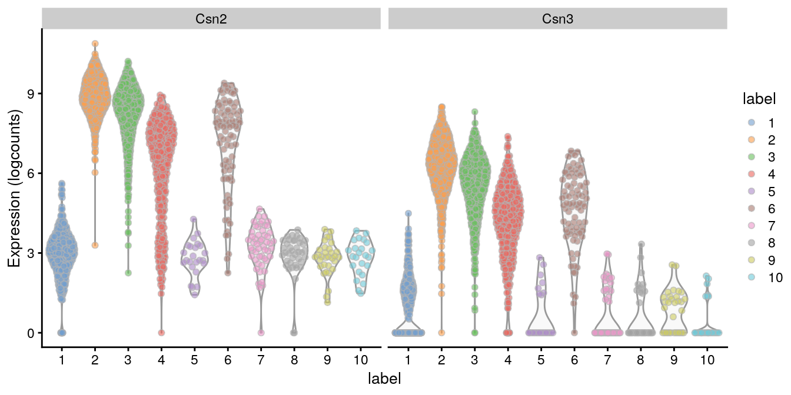

---
output:
  html_document
bibliography: ../ref.bib
---

# Cell type annotation

<script>
document.addEventListener("click", function (event) {
    if (event.target.classList.contains("aaron-collapse")) {
        event.target.classList.toggle("active");
        var content = event.target.nextElementSibling;
        if (content.style.display === "block") {
          content.style.display = "none";
        } else {
          content.style.display = "block";
        }
    }
})
</script>

<style>
.aaron-collapse {
  background-color: #eee;
  color: #444;
  cursor: pointer;
  padding: 18px;
  width: 100%;
  border: none;
  text-align: left;
  outline: none;
  font-size: 15px;
}

.aaron-content {
  padding: 0 18px;
  display: none;
  overflow: hidden;
  background-color: #f1f1f1;
}
</style>

## Motivation

The most challenging task in scRNA-seq data analysis is arguably the interpretation of the results.
Obtaining clusters of cells is fairly straightforward, but it is more difficult to determine what biological state is represented by each of those clusters. 
Doing so requires us to bridge the gap between the current dataset and prior biological knowledge, and the latter is not always available in a consistent and quantitative manner^[For example, it may be somewhere in your bench collaborator's head. Try `ssh`ing into _that_.].
Indeed, even the concept of a "cell type" is [not clearly defined](https://doi.org/10.1016/j.cels.2017.03.006), with most practitioners possessing a "I'll know it when I see it" intuition that is not amenable to computational analysis.
As such, intepretation of scRNA-seq data is often manual and a common bottleneck in the analysis workflow.

To expedite this step, we can use various computational approaches that exploit prior information to assign meaning to an uncharacterized scRNA-seq dataset.
The most obvious sources of prior information are the curated gene sets associated with particular biological processes, e.g., from the Gene Ontology (GO) or the Kyoto Encyclopedia of Genes and Genomes (KEGG) collections.
Alternatively, we can directly compare our expression profiles to published reference datasets where each sample or cell has already been annotated with its putative biological state by domain experts.
Here, we will demonstrate both approaches with several different scRNA-seq datasets.

## Assigning cell labels from reference data

### Overview

A conceptually straightforward annotation approach is to compare the single-cell expression profiles with previously annotated reference datasets.
Labels can then be assigned to each cell in our uncharacterized test dataset based on the most similar reference sample(s), for some definition of "similar".
This is a standard classification challenge that can be tackled by standard machine learning techniques such as random forests and support vector machines.
Any published and labelled RNA-seq dataset (bulk or single-cell) can be used as a reference, though its reliability depends greatly on the expertise of the original authors who assigned the labels in the first place. 

In this section, we will demonstrate the use of the *[SingleR](https://bioconductor.org/packages/3.10/SingleR)* method for cell type annotation.
This method assigns labels to cells based on the reference samples with the highest Spearman rank correlations, and thus can be considered a rank-based variant of $k$-nearest-neighbor classification.
To reduce noise, *[SingleR](https://bioconductor.org/packages/3.10/SingleR)* identifies marker genes between pairs of labels and computes the correlation using only those markers.
It also performs a fine-tuning step for each cell where calculation of the correlations is repeated with just the marker genes for the top-scoring labels.
This aims to resolve any ambiguity between those labels by removing noise from irrelevant markers for other labels. 

## Assigning cell labels from gene sets

A related strategy is to explicitly identify sets of marker genes that are highly expressed in each individual cell.
This does not require matching of individual cells to the expression values of the reference dataset, which is faster and more convenient when only the identities of the markers are available.
We demonstrate this approach using neuronal cell type markers derived from the @zeisel2015brain study.

<button class="aaron-collapse">View history</button>
<div class="aaron-content">
   
```r
### loading ###
library(scRNAseq)
sce.zeisel <- ZeiselBrainData()
sce.zeisel <- sce.zeisel[rowData(sce.zeisel)$featureType!="repeat",]

library(scater)
sce.zeisel <- aggregateAcrossFeatures(sce.zeisel, 
    id=sub("_loc[0-9]+$", "", rownames(sce.zeisel)))

### gene-annotation ###
library(org.Mm.eg.db)
ensembl <- mapIds(org.Mm.eg.db, keys=rownames(sce.zeisel), 
    keytype="SYMBOL", column="ENSEMBL")
rowData(sce.zeisel)$ENSEMBL <- ensembl

### quality-control ###
stats <- perCellQCMetrics(sce.zeisel)
qc <- quickCellQC(stats, percent_subsets="altexps_ERCC_percent", nmads=3)
sce.zeisel <- sce.zeisel[,!qc$discard]

### normalization ###
library(scran)
set.seed(1000)
clusters <- quickCluster(sce.zeisel)
sce.zeisel <- computeSumFactors(sce.zeisel, cluster=clusters, min.mean=0.1)
sce.zeisel <- logNormCounts(sce.zeisel)
```

</div>


```r
library(scran)
wilcox.z <- pairwiseWilcox(logcounts(sce.zeisel), 
    sce.zeisel$level1class, lfc=1, direction="up")
markers.z <- getTopMarkers(wilcox.z$statistics, wilcox.z$pairs,
    pairwise=FALSE, n=50)
lengths(markers.z)
```

```
## astrocytes_ependymal    endothelial-mural         interneurons 
##                   74                   88                  121 
##            microglia     oligodendrocytes        pyramidal CA1 
##                   70                   80                  124 
##         pyramidal SS 
##                  155
```

Our test dataset will be another brain scRNA-seq experiment from @tasic2016adult.


```r
library(scRNAseq)
sce.tasic <- TasicBrainData()
sce.tasic
```

```
## class: SingleCellExperiment 
## dim: 24058 1809 
## metadata(0):
## assays(1): counts
## rownames(24058): 0610005C13Rik 0610007C21Rik ... mt_X57780
##   tdTomato
## rowData names(0):
## colnames(1809): Calb2_tdTpositive_cell_1 Calb2_tdTpositive_cell_2
##   ... Rbp4_CTX_250ng_2 Trib2_CTX_250ng_1
## colData names(13): sample_title mouse_line ... secondary_type
##   aibs_vignette_id
## reducedDimNames(0):
## spikeNames(0):
## altExpNames(1): ERCC
```

We use the *[AUCell](https://bioconductor.org/packages/3.10/AUCell)* package to identify marker sets that are highly expressed in each cell.
This method ranks genes by their expression values within each cell, and constructs a response curve detailing the number of genes from each marker set that are present with increasing rank.
It then computes the area under the curve (AUC) for each marker set, quantifying the enrichment of those markers among the most highly expressed genes in that cell.
This is roughly similar to performing a Wilcoxon rank sum test between genes in and outside of the set, but involving only the top ranking genes by expression in each cell.


```r
library(GSEABase)
all.sets <- lapply(names(markers.z), function(x) {
    GeneSet(markers.z[[x]], setName=x)        
})
all.sets <- GeneSetCollection(all.sets)

library(AUCell)
rankings <- AUCell_buildRankings(counts(sce.tasic))
```


```
##   min    1%    5%   10%   50%  100% 
##  1826  3743  4842  5982  7843 18492
```

```r
cell.aucs <- AUCell_calcAUC(all.sets, rankings)
results <- t(assay(cell.aucs))
head(results)
```

```
##                           gene sets
## cells                      astrocytes_ependymal endothelial-mural
##   Calb2_tdTpositive_cell_1               0.1353           0.04777
##   Calb2_tdTpositive_cell_2               0.1328           0.04763
##   Calb2_tdTpositive_cell_3               0.1084           0.08739
##   Calb2_tdTpositive_cell_4               0.1285           0.04869
##   Calb2_tdTpositive_cell_5               0.1612           0.06984
##   Calb2_tdTpositive_cell_6               0.1302           0.09979
##                           gene sets
## cells                      interneurons microglia oligodendrocytes
##   Calb2_tdTpositive_cell_1       0.5247   0.05451           0.1444
##   Calb2_tdTpositive_cell_2       0.4417   0.02645           0.1226
##   Calb2_tdTpositive_cell_3       0.3412   0.03533           0.1518
##   Calb2_tdTpositive_cell_4       0.5052   0.05313           0.1499
##   Calb2_tdTpositive_cell_5       0.4769   0.07673           0.1347
##   Calb2_tdTpositive_cell_6       0.3346   0.03157           0.1568
##                           gene sets
## cells                      pyramidal CA1 pyramidal SS
##   Calb2_tdTpositive_cell_1        0.2242       0.3452
##   Calb2_tdTpositive_cell_2        0.1939       0.2760
##   Calb2_tdTpositive_cell_3        0.3009       0.5137
##   Calb2_tdTpositive_cell_4        0.2357       0.3487
##   Calb2_tdTpositive_cell_5        0.2032       0.3046
##   Calb2_tdTpositive_cell_6        0.3892       0.5244
```

We assign cell type identity to each cell in the test dataset by taking the marker set with the top AUC as the label for that cell.
Our new labels mostly agree with the original annotation from @tasic2016adult, which is encouraging.
The only exception involves miassignment of oligodendrocyte precusors to astrocytes, which may be acceptable given that they are derived from a common lineage.
In the absence of prior annotation, a more general diagnostic check is to compare the assigned labels to cluster identities, under the expectation that most cells of a single cluster would have the same label (or, if multiple labels are present, they should at least represent closely related cell states).


```r
new.labels <- colnames(results)[max.col(results)]
tab <- table(new.labels, sce.tasic$broad_type)
tab
```

```
##                       
## new.labels             Astrocyte Endothelial Cell GABA-ergic Neuron
##   astrocytes_ependymal        43                2                 0
##   endothelial-mural            0               27                 0
##   interneurons                 0                0               759
##   microglia                    0                0                 0
##   oligodendrocytes             0                0                 1
##   pyramidal SS                 0                0                 1
##                       
## new.labels             Glutamatergic Neuron Microglia Oligodendrocyte
##   astrocytes_ependymal                    0         0               0
##   endothelial-mural                       0         0               0
##   interneurons                            2         0               0
##   microglia                               0        22               0
##   oligodendrocytes                        0         0              38
##   pyramidal SS                          810         0               0
##                       
## new.labels             Oligodendrocyte Precursor Cell Unclassified
##   astrocytes_ependymal                             21            4
##   endothelial-mural                                 0            2
##   interneurons                                      0           15
##   microglia                                         0            1
##   oligodendrocytes                                  1            0
##   pyramidal SS                                      0           60
```


Another simple diagnostic metric is the difference $\Delta$ between the maximum and median AUCs for each cell.
An umambiguous assignment should manifest as a large $\Delta$ for that cell (Figure \@ref(fig:aucell-boxplots)), while small differences indicate that the assignment is uncertain.
If necessary, we can remove uncertain assignments by applying a minimum threshold on the $\Delta$, e.g., to achieve greater agreement with the clustering results or prior annotation.
The example below removes small outlier $\Delta$ values under the assumption that most cells are correctly assigned and that there is only modest heterogeneity within each label.


```r
deltas <- rowMaxs(results) - rowMedians(results)
boxplot(split(deltas, new.labels))
```

<div class="figure">

<p class="caption">(\#fig:aucell-boxplots)Distribution of differences between the maximum and median AUCs for each cell, stratified by the assigned label.</p>
</div>

```r
library(scater)
discard <- isOutlier(deltas, nmads=3, type="lower", batch=new.labels)
table(new.labels[!discard], sce.tasic$broad_type[!discard])
```

```
##                       
##                        Astrocyte Endothelial Cell GABA-ergic Neuron
##   astrocytes_ependymal        43                0                 0
##   endothelial-mural            0               24                 0
##   interneurons                 0                0               756
##   microglia                    0                0                 0
##   oligodendrocytes             0                0                 0
##   pyramidal SS                 0                0                 0
##                       
##                        Glutamatergic Neuron Microglia Oligodendrocyte
##   astrocytes_ependymal                    0         0               0
##   endothelial-mural                       0         0               0
##   interneurons                            0         0               0
##   microglia                               0        22               0
##   oligodendrocytes                        0         0              31
##   pyramidal SS                          803         0               0
##                       
##                        Unclassified
##   astrocytes_ependymal            2
##   endothelial-mural               2
##   interneurons                   13
##   microglia                       1
##   oligodendrocytes                0
##   pyramidal SS                   48
```

Interpretation of the *[AUCell](https://bioconductor.org/packages/3.10/AUCell)* results is most straightforward when the marker sets are mutually exclusive, as shown above for the cell type markers.
In other applications, one might consider computing AUCs for gene sets associated with signalling or metabolic pathways.
It is likely that multiple pathways will be active in any given cell, and it is tempting to use the AUCs to quantify this activity for comparison across cells.
However, such comparisons must be interpreted with much caution as the AUCs are competitive values - any increase in one pathway's activity will naturally reduce the AUCs for all other pathways, potentially resulting in spurious differences across the population.

As we mentioned previously, the advantage of the *[AUCell](https://bioconductor.org/packages/3.10/AUCell)* approach is that it does not require reference expression values.
This is particularly useful when dealing with gene sets derived from the literature or other qualitative forms of biological knowledge.
(In this particular example, we _do_ have the original expression values, so we could have used *[SingleR](https://bioconductor.org/packages/3.10/SingleR)* directly.
However, this may not always be the case.)
The flipside is that information on relative expression is lost when only the marker identities are used.
The net effect of ignoring expression values is difficult to predict - it may reduce performance for resolving more subtle cell types, but may also improve performance if the per-cell expression was too noisy to be useful. 

## Assigning cluster labels from markers

Yet another strategy for annotation is to perform a gene set enrichment analysis on the marker genes defining each cluster.
This identifies the pathways and processes that are (relatively) active in each cluster based on upregulation of the associated genes compared to other clusters.
We demonstrate on the mouse mammary dataset from @bach2017differentiation, using markers that are identified by `findMarkers()` as being upregulated at a log-fold change threshold of 1.

<button class="aaron-collapse">View history</button>
<div class="aaron-content">
   
```r
### loading ###
library(BiocFileCache)
bfc <- BiocFileCache()
base.path <- "ftp://ftp.ncbi.nlm.nih.gov/geo/samples/GSM2834nnn/GSM2834500/suppl"
barcode.fname <- bfcrpath(bfc, file.path(base.path, 
    "GSM2834500%5FG%5F1%5Fbarcodes%2Etsv%2Egz"))
gene.fname <- bfcrpath(bfc, file.path(base.path,
    "GSM2834500%5FG%5F1%5Fgenes%2Etsv%2Egz"))
counts.fname <- bfcrpath(bfc, file.path(base.path,
    "GSM2834500%5FG%5F1%5Fmatrix%2Emtx%2Egz"))

library(Matrix)
library(SingleCellExperiment)
gene.info <- read.table(gene.fname, stringsAsFactors=FALSE)
colnames(gene.info) <- c("Ensembl", "Symbol")
sce.mam <- SingleCellExperiment(
    list(counts=as(readMM(counts.fname), "dgCMatrix")), 
    rowData=DataFrame(gene.info),
    colData=DataFrame(Barcode=readLines(barcode.fname))
)

### gene-annotation ###
library(scater)
rownames(sce.mam) <- uniquifyFeatureNames(
    rowData(sce.mam)$Ensembl, rowData(sce.mam)$Symbol)

library(AnnotationHub)
ens.mm.v97 <- AnnotationHub()[["AH73905"]]
rowData(sce.mam)$SEQNAME <- mapIds(ens.mm.v97, keys=rowData(sce.mam)$Ensembl,
    keytype="GENEID", column="SEQNAME")

### quality-control ###
is.mito <- rowData(sce.mam)$SEQNAME == "MT"
stats <- perCellQCMetrics(sce.mam, subsets=list(Mito=which(is.mito)))
qc <- quickCellQC(stats, percent_subsets="subsets_Mito_percent", nmads=3)
sce.mam <- sce.mam[,!qc$discard]

### normalization ###
library(scran)
set.seed(101000110)
clusters <- quickCluster(sce.mam)
sce.mam <- computeSumFactors(sce.mam, clusters=clusters, min.mean=0.1) 
sce.mam <- logNormCounts(sce.mam)

### variance-modelling ###
set.seed(00010101)
dec.mam <- modelGeneVarByPoisson(sce.mam)

### dimensionality-reduction ###
library(BiocSingular)
set.seed(101010011)
sce.mam <- denoisePCA(sce.mam, technical=dec.mam, BSPARAM=IrlbaParam())
sce.mam <- runTSNE(sce.mam, dimred="PCA")

### clustering ###
snn.gr <- buildSNNGraph(sce.mam, use.dimred="PCA", k=25)
sce.mam$cluster <- factor(igraph::cluster_walktrap(snn.gr)$membership)

### marker-detection ###
markers.mam <- findMarkers(sce.mam, cluster=sce.mam$cluster,
    direction="up", lfc=1)
```

</div>


```r
markers.mam
```

```
## DataFrameList of length 11
## names(11): 1 2 3 4 5 6 7 8 9 10 11
```


As an example, we obtain annotations for the marker genes that define cluster 4.
We will use gene sets defined by the Gene Ontology (GO) project, which describe a comprehensive range of biological processes and functions.
We define our subset of relevant marker genes at a FDR of 5% and apply the `goana()` function from the *[limma](https://bioconductor.org/packages/3.10/limma)* package.
This performs a hypergeometric test to identify GO terms that are overrepresented in our marker subset.
(The log-fold change threshold mentioned above is useful here, as it avoids including an excessive number of genes from the overpowered nature of per-cell DE comparisons.)


```r
chosen <- "4"
cur.markers <- markers.mam[[chosen]]
is.de <- cur.markers$FDR <= 0.05 
summary(is.de)
```

```
##    Mode   FALSE    TRUE 
## logical   27824     174
```

```r
# goana() requires Entrez IDs, some of which map to multiple
# symbols - hence the unique() in the call below.
library(org.Mm.eg.db)
entrez.ids <- mapIds(org.Mm.eg.db, keys=rownames(cur.markers), 
    column="ENTREZID", keytype="SYMBOL")

library(limma)
go.out <- goana(unique(entrez.ids[is.de]), species="Mm", 
    universe=unique(entrez.ids))

# Only keeping biological process terms that are not overly general.
go.out <- go.out[order(go.out$P.DE),]
go.useful <- go.out[go.out$Ont=="BP" & go.out$N <= 200,]
head(go.useful, 20)
```

```
##                                                                                    Term
## GO:0022408                                    negative regulation of cell-cell adhesion
## GO:0006119                                                    oxidative phosphorylation
## GO:0006641                                               triglyceride metabolic process
## GO:0035148                                                               tube formation
## GO:0050729                                 positive regulation of inflammatory response
## GO:0042775                       mitochondrial ATP synthesis coupled electron transport
## GO:0042773                                     ATP synthesis coupled electron transport
## GO:0006639                                               acylglycerol metabolic process
## GO:0006638                                              neutral lipid metabolic process
## GO:0071404               cellular response to low-density lipoprotein particle stimulus
## GO:0019432                                            triglyceride biosynthetic process
## GO:0032760                      positive regulation of tumor necrosis factor production
## GO:1903557 positive regulation of tumor necrosis factor superfamily cytokine production
## GO:0046460                                           neutral lipid biosynthetic process
## GO:0046463                                            acylglycerol biosynthetic process
## GO:0019915                                                                lipid storage
## GO:0045333                                                         cellular respiration
## GO:0022904                                         respiratory electron transport chain
## GO:0042098                                                         T cell proliferation
## GO:0001838                                          embryonic epithelial tube formation
##            Ont   N DE      P.DE
## GO:0022408  BP 183 11 6.782e-08
## GO:0006119  BP  85  8 1.424e-07
## GO:0006641  BP  95  8 3.391e-07
## GO:0035148  BP 172 10 3.709e-07
## GO:0050729  BP 135  9 4.572e-07
## GO:0042775  BP  51  6 1.446e-06
## GO:0042773  BP  52  6 1.625e-06
## GO:0006639  BP 118  8 1.782e-06
## GO:0006638  BP 120  8 2.023e-06
## GO:0071404  BP  15  4 2.913e-06
## GO:0019432  BP  34  5 3.640e-06
## GO:0032760  BP  92  7 3.725e-06
## GO:1903557  BP  93  7 4.005e-06
## GO:0046460  BP  37  5 5.606e-06
## GO:0046463  BP  37  5 5.606e-06
## GO:0019915  BP  68  6 7.970e-06
## GO:0045333  BP 148  8 9.619e-06
## GO:0022904  BP  71  6 1.025e-05
## GO:0042098  BP 197  9 1.037e-05
## GO:0001838  BP 151  8 1.114e-05
```

We see an enrichment for genes involved lipid synthesis, cell adhesion and tube formation.
Given that this is a mammary gland experiment, we might guess that cluster 4 contains luminal epithelial cells responsible for milk production and secretion.
Indeed, a closer examination of the marker list indicates that this cluster upregulates milk proteins _Csn2_ and _Csn3_ (Figure \@ref(fig:violin-milk)).


```r
# Checking that the above statements are correct.
stopifnot(c("GO:0035148", "GO:0022408", "GO:0019432") %in% head(rownames(go.useful), 20))
chosen <- cur.markers[c("Csn2", "Csn3"), -c(1:3)]
stopifnot(all(as.matrix(chosen)>0))
```


```r
library(scater)
plotExpression(sce.mam, features=c("Csn2", "Csn3"), 
    x="cluster", colour_by="cluster")
```



Further inspection of interesting GO terms is achieved by extracting the relevant genes. 
This is usually desirable to confirm that the interpretation of the annotated biological process is appropriate.
Many terms have overlapping gene sets, so a term may only be highly ranked because it shares genes with a more relevant term that represents the active pathway.


```r
# Extract symbols for each GO term; done once.
tab <- select(org.Mm.eg.db, keytype="SYMBOL", 
    keys=rownames(sce.mam), columns="GOALL")
by.go <- split(tab[,1], tab[,2])

# Identify genes associated with an interesting term.
adhesion <- unique(by.go[["GO:0022408"]])
head(cur.markers[adhesion,1:3], 10)
```

```
## DataFrame with 10 rows and 3 columns
##                Top   p.value       FDR
##          <integer> <numeric> <numeric>
## Ctla4         4207         1         1
## Ihh           8151         1         1
## Serpine2      2518         1         1
## Epb41l5       3822         1         1
## Il10          3251         1         1
## Lax1          7074         1         1
## Abl2          3078         1         1
## Tnr           8556         1         1
## Rc3h1         1646         1         1
## Tnfsf4        8693         1         1
```

```
## <integer>

## 4207

## 8151

## 2518

## 3822

## 3251

## 7074

## 3078

## 8556

## 1646

## 8693

## <numeric>

## 1

## 1

## 1

## 1

## 1

## 1

## 1

## 1

## 1

## 1

## <numeric>

## 1

## 1

## 1

## 1

## 1

## 1

## 1

## 1

## 1

## 1
```

Gene set testing of marker lists is a reliable approach for determining if pathways are up- or down-regulated between clusters.
As the top marker genes are simply DEGs, we can directly apply well-established procedures for testing gene enrichment in DEG lists (see [here](https://bioconductor.org/packages/release/BiocViews.html#___GeneSetEnrichment) for relevant packages).
This contrasts with the *[AUCell](https://bioconductor.org/packages/3.10/AUCell)* approach where scores are not easily comparable across cells.
The downside is that all conclusions are made relative to the other clusters, making it more difficult to determine cell identity if an "outgroup" is not present in the same study.

## References {-}
