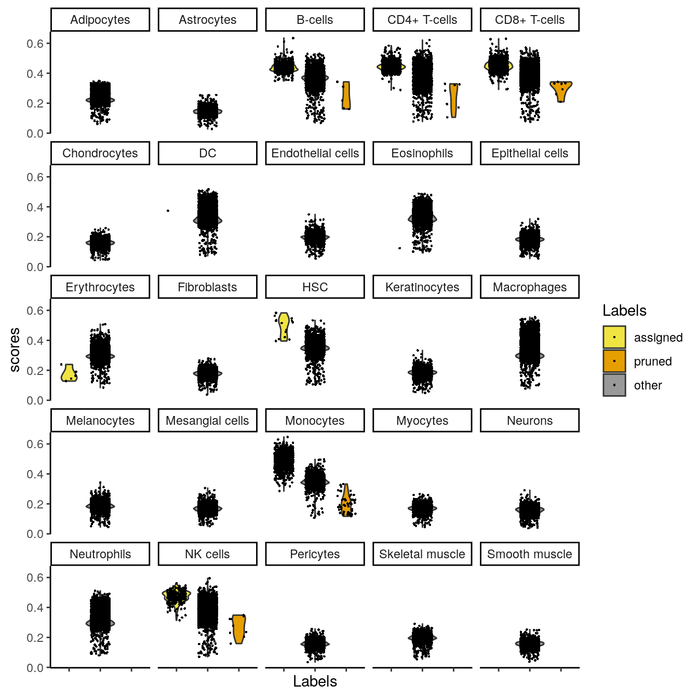
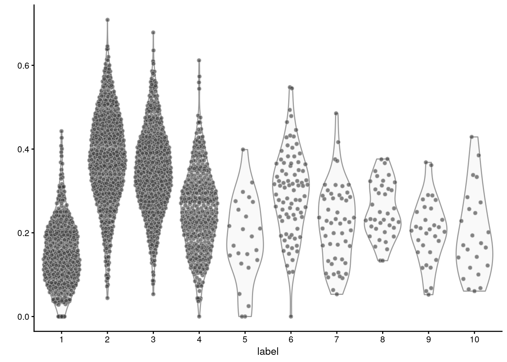

---
output:
  html_document
bibliography: ../ref.bib
---

# Cell type annotation

<script>
document.addEventListener("click", function (event) {
    if (event.target.classList.contains("aaron-collapse")) {
        event.target.classList.toggle("active");
        var content = event.target.nextElementSibling;
        if (content.style.display === "block") {
          content.style.display = "none";
        } else {
          content.style.display = "block";
        }
    }
})
</script>

<style>
.aaron-collapse {
  background-color: #eee;
  color: #444;
  cursor: pointer;
  padding: 18px;
  width: 100%;
  border: none;
  text-align: left;
  outline: none;
  font-size: 15px;
}

.aaron-content {
  padding: 0 18px;
  display: none;
  overflow: hidden;
  background-color: #f1f1f1;
}
</style>

## Motivation

The most challenging task in scRNA-seq data analysis is arguably the interpretation of the results.
Obtaining clusters of cells is fairly straightforward, but it is more difficult to determine what biological state is represented by each of those clusters. 
Doing so requires us to bridge the gap between the current dataset and prior biological knowledge, and the latter is not always available in a consistent and quantitative manner^[For example, it may be somewhere in your bench collaborator's head. Try `ssh`ing into _that_.].
Indeed, even the concept of a "cell type" is [not clearly defined](https://doi.org/10.1016/j.cels.2017.03.006), with most practitioners possessing a "I'll know it when I see it" intuition that is not amenable to computational analysis.
As such, interpretation of scRNA-seq data is often manual and a common bottleneck in the analysis workflow.

To expedite this step, we can use various computational approaches that exploit prior information to assign meaning to an uncharacterized scRNA-seq dataset.
The most obvious sources of prior information are the curated gene sets associated with particular biological processes, e.g., from the Gene Ontology (GO) or the Kyoto Encyclopedia of Genes and Genomes (KEGG) collections.
Alternatively, we can directly compare our expression profiles to published reference datasets where each sample or cell has already been annotated with its putative biological state by domain experts.
Here, we will demonstrate both approaches with several different scRNA-seq datasets.

## Assigning cell labels from reference data

### Overview

A conceptually straightforward annotation approach is to compare the single-cell expression profiles with previously annotated reference datasets.
Labels can then be assigned to each cell in our uncharacterized test dataset based on the most similar reference sample(s), for some definition of "similar".
This is a standard classification challenge that can be tackled by standard machine learning techniques such as random forests and support vector machines.
Any published and labelled RNA-seq dataset (bulk or single-cell) can be used as a reference, though its reliability depends greatly on the expertise of the original authors who assigned the labels in the first place. 

In this section, we will demonstrate the use of the *[SingleR](https://bioconductor.org/packages/3.11/SingleR)* method [@aran2019reference] for cell type annotation.
This method assigns labels to cells based on the reference samples with the highest Spearman rank correlations, and thus can be considered a rank-based variant of $k$-nearest-neighbor classification.
To reduce noise, *[SingleR](https://bioconductor.org/packages/3.11/SingleR)* identifies marker genes between pairs of labels and computes the correlation using only those markers.
It also performs a fine-tuning step for each cell where calculation of the correlations is repeated with just the marker genes for the top-scoring labels.
This aims to resolve any ambiguity between those labels by removing noise from irrelevant markers for other labels.

### Using the in-built references

*[SingleR](https://bioconductor.org/packages/3.11/SingleR)* contains a number of built-in reference datasets, mostly assembled from bulk RNA-seq or microarray data of sorted cell types.
These built-in references are often good enough for most applications, provided that they contain the cell types that are expected in the test population.
We will demonstrate on the 10X PBMC dataset using a reference constructed from Blueprint and ENCODE data [@martens2013blueprint;@encode2012integrated].

<button class="aaron-collapse">View history</button>
<div class="aaron-content">
   
```r
#--- loading ---#
library(BiocFileCache)
bfc <- BiocFileCache("raw_data", ask = FALSE)
raw.path <- bfcrpath(bfc, file.path("http://cf.10xgenomics.com/samples",
    "cell-exp/2.1.0/pbmc4k/pbmc4k_raw_gene_bc_matrices.tar.gz"))
untar(raw.path, exdir=file.path(tempdir(), "pbmc4k"))

library(DropletUtils)
fname <- file.path(tempdir(), "pbmc4k/raw_gene_bc_matrices/GRCh38")
sce.pbmc <- read10xCounts(fname, col.names=TRUE)

#--- gene-annotation ---#
library(scater)
rownames(sce.pbmc) <- uniquifyFeatureNames(
    rowData(sce.pbmc)$ID, rowData(sce.pbmc)$Symbol)

library(EnsDb.Hsapiens.v86)
location <- mapIds(EnsDb.Hsapiens.v86, keys=rowData(sce.pbmc)$ID, 
    column="SEQNAME", keytype="GENEID")

#--- cell-detection ---#
set.seed(100)
e.out <- emptyDrops(counts(sce.pbmc))
sce.pbmc <- sce.pbmc[,which(e.out$FDR <= 0.001)]

#--- quality-control ---#
stats <- perCellQCMetrics(sce.pbmc, subsets=list(Mito=which(location=="MT")))
high.mito <- isOutlier(stats$subsets_Mito_percent, type="higher")
sce.pbmc <- sce.pbmc[,!high.mito]

#--- normalization ---#
library(scran)
set.seed(1000)
clusters <- quickCluster(sce.pbmc)
sce.pbmc <- computeSumFactors(sce.pbmc, cluster=clusters)
sce.pbmc <- logNormCounts(sce.pbmc)

#--- variance-modelling ---#
set.seed(1001)
dec.pbmc <- modelGeneVarByPoisson(sce.pbmc)
top.pbmc <- getTopHVGs(dec.pbmc, prop=0.1)

#--- dimensionality-reduction ---#
set.seed(10000)
sce.pbmc <- denoisePCA(sce.pbmc, subset.row=top.pbmc, technical=dec.pbmc)

set.seed(100000)
sce.pbmc <- runTSNE(sce.pbmc, dimred="PCA")

set.seed(1000000)
sce.pbmc <- runUMAP(sce.pbmc, dimred="PCA")

#--- clustering ---#
g <- buildSNNGraph(sce.pbmc, k=10, use.dimred = 'PCA')
clust <- igraph::cluster_walktrap(g)$membership
colLabels(sce.pbmc) <- factor(clust)
```

</div>


```r
sce.pbmc
```

```
## class: SingleCellExperiment 
## dim: 33694 3922 
## metadata(1): Samples
## assays(2): counts logcounts
## rownames(33694): RP11-34P13.3 FAM138A ... AC213203.1 FAM231B
## rowData names(2): ID Symbol
## colnames(3922): AAACCTGAGAAGGCCT-1 AAACCTGAGACAGACC-1 ...
##   TTTGTCACAGGTCCAC-1 TTTGTCATCCCAAGAT-1
## colData names(4): Sample Barcode sizeFactor label
## reducedDimNames(3): PCA TSNE UMAP
## altExpNames(0):
```

We label our PBMCs using the `SingleR()` function with the main cell type labels in the reference.
This returns a `DataFrame` where each row corresponds to a cell in the test dataset and contains its label assignments.
Alternatively, we could use the labels in `ref$label.fine`, which provide more resolution at the cost of speed and increased ambiguity in the assignments.


```r
library(SingleR)
ref <- BlueprintEncodeData()
pred <- SingleR(test=sce.pbmc, ref=ref, labels=ref$label.main)
table(pred$labels)
```

```
## 
##      B-cells CD4+ T-cells CD8+ T-cells           DC  Eosinophils Erythrocytes 
##          525          755         1254            1            1            5 
##          HSC    Monocytes     NK cells 
##           14         1116          251
```

We inspect the results using a heatmap of the per-cell and label scores (Figure \@ref(fig:singler-heat-pbmc)).
Ideally, each cell should exhibit a high score in one label relative to all of the others, indicating that the assignment to that label was unambiguous.
This is largely the case for monocytes and B cells, whereas we see more ambiguity between CD4^+^ and CD8^+^ T cells (and to a lesser extent, NK cells).


```r
plotScoreHeatmap(pred)
```

<div class="figure">

<p class="caption">(\#fig:singler-heat-pbmc)Heatmap of the assignment score for each cell (column) and label (row). Scores are shown before any fine-tuning and are normalized to [0, 1] within each cell.</p>
</div>

`SingleR()` will attempt to prune out low-quality assignments by marking them as `NA`.
This is done based on the difference $\Delta_{med}$ of the assigned label's score from the median score within each cell.
Small $\Delta_{med}$ values indicate that the cell assignment was so uncertain that the reported label is not much better than the bulk of other labels in the reference.
We set a minimum threshold on the acceptable $\Delta_{med}$ using an outlier-based approach for each label, where labels with $\Delta_{med}$ that are substantially lower than the majority of values for a given label are marked as `NA` (Figure \@ref(fig:singler-dist-pbmc)).
If necessary, more control over the pruning can be achieved by supplying custom parameters to the `pruneScores()` function.


```r
sum(is.na(pred$pruned.labels))
```

```
## [1] 76
```

```r
plotScoreDistribution(pred)
```

<div class="figure">

<p class="caption">(\#fig:singler-dist-pbmc)Distribution of the per-cell $\Delta_{med}$ for each label. Each panel corresponds to one label and stratifies the population into cells that were assigned to that label and not pruned; cells that were assigned to that label and pruned out; and cells that were not assigned to that label.</p>
</div>

We compare the assignments with the clustering results to determine the identity of each cluster.
Ideally, clusters and labels would have a 1:1 relationship, though some nesting is likely depending on the resolution of the clustering algorithm.
For example, several clusters are nested within the monocyte and B cell labels (Figure \@ref(fig:singler-cluster)), suggesting the the former represent finer subdivisions within the latter.
Interestingly, our clustering does not effectively distinguish between CD4^+^ and CD8^+^ T cell labels.
We attribute this to the presence of other factors of heterogeneity within the T cell subpopulation that have a stronger influence on unsupervised methods than the _a priori_ expected CD4/CD8 distinction.


```r
tab <- table(Assigned=pred$pruned.labels, Cluster=colLabels(sce.pbmc))

# Adding a pseudo-count of 10 to avoid strong color jumps with just 1 cell.
library(pheatmap)
pheatmap(log2(tab+10), color=colorRampPalette(c("white", "blue"))(101))
```

<div class="figure">

<p class="caption">(\#fig:singler-cluster)Heatmap of the distribution of cells across labels and clusters in the 10X PBMC dataset. Color scale is reported in the log~10~-number of cells for each cluster-label combination.</p>
</div>


This episode highlights some of the differences between reference-based annotation and unsupervised clustering.
The former explicitly focuses on aspects of the data that are known to be interesting, simplifying the process of biological interpretation.
However, the cost is that the downstream analysis is restricted by the diversity and resolution of the available labels.
We suggest applying both strategies and, if major disagreements are present between reference label and cluster assignments, using those discrepancies as the basis for further investigation to discover novel effects.

### Using custom references

It is also straightforward to apply *[SingleR](https://bioconductor.org/packages/3.11/SingleR)* to user-supplied reference datasets.
This is most obviously useful when we have an existing dataset that was previously (manually) annotated,
and we want to use that knowledge to annotate a new dataset in an automated manner.
To illustrate, we will use the @muraro2016singlecell human pancreas dataset as our reference.

<button class="aaron-collapse">View history</button>
<div class="aaron-content">
   
```r
#--- loading ---#
library(scRNAseq)
sce.muraro <- MuraroPancreasData()

#--- gene-annotation ---#
library(AnnotationHub)
edb <- AnnotationHub()[["AH73881"]]
gene.symb <- sub("__chr.*$", "", rownames(sce.muraro))
gene.ids <- mapIds(edb, keys=gene.symb, 
    keytype="SYMBOL", column="GENEID")

# Removing duplicated genes or genes without Ensembl IDs.
keep <- !is.na(gene.ids) & !duplicated(gene.ids)
sce.muraro <- sce.muraro[keep,]
rownames(sce.muraro) <- gene.ids[keep]

#--- quality-control ---#
library(scater)
stats <- perCellQCMetrics(sce.muraro)
qc <- quickPerCellQC(stats, percent_subsets="altexps_ERCC_percent",
    batch=sce.muraro$donor, subset=sce.muraro$donor!="D28")
sce.muraro <- sce.muraro[,!qc$discard]

#--- normalization ---#
library(scran)
set.seed(1000)
clusters <- quickCluster(sce.muraro)
sce.muraro <- computeSumFactors(sce.muraro, clusters=clusters)
sce.muraro <- logNormCounts(sce.muraro)
```

</div>


```r
sce.muraro
```

```
## class: SingleCellExperiment 
## dim: 16940 2299 
## metadata(0):
## assays(2): counts logcounts
## rownames(16940): ENSG00000268895 ENSG00000121410 ... ENSG00000159840
##   ENSG00000074755
## rowData names(2): symbol chr
## colnames(2299): D28-1_1 D28-1_2 ... D30-8_93 D30-8_94
## colData names(4): label donor plate sizeFactor
## reducedDimNames(0):
## altExpNames(1): ERCC
```

```r
sce.muraro <- sce.muraro[,!is.na(sce.muraro$label) & 
    sce.muraro$label!="unclear"]
table(sce.muraro$label)
```

```
## 
##      acinar       alpha        beta       delta        duct endothelial 
##         217         795         442         189         239          18 
##     epsilon mesenchymal          pp 
##           3          80          96
```

Our aim is to assign labels to our test dataset from @segerstolpe2016singlecell.
We use the same call to `SingleR()` but with `de.method="wilcox"` to identify markers via pairwise Wilcoxon ranked sum tests between labels in the reference dataset.
This re-uses the same machinery from Chapter \@ref(marker-detection), and indeed, further options to fine-tune the test procedure can be passed via the `de.args` argument.

<button class="aaron-collapse">View history</button>
<div class="aaron-content">
   
```r
#--- loading ---#
library(scRNAseq)
sce.seger <- SegerstolpePancreasData()

#--- gene-annotation ---#
library(AnnotationHub)
edb <- AnnotationHub()[["AH73881"]]
symbols <- rowData(sce.seger)$symbol
ens.id <- mapIds(edb, keys=symbols, keytype="SYMBOL", column="GENEID")
ens.id <- ifelse(is.na(ens.id), symbols, ens.id)

# Removing duplicated rows.
keep <- !duplicated(ens.id)
sce.seger <- sce.seger[keep,]
rownames(sce.seger) <- ens.id[keep]

#--- sample-annotation ---#
emtab.meta <- colData(sce.seger)[,c("cell type", 
    "individual", "single cell well quality")]
colnames(emtab.meta) <- c("CellType", "Donor", "Quality")
colData(sce.seger) <- emtab.meta

sce.seger$CellType <- gsub(" cell", "", sce.seger$CellType)
sce.seger$CellType <- paste0(
    toupper(substr(sce.seger$CellType, 1, 1)),
    substring(sce.seger$CellType, 2))

#--- quality-control ---#
low.qual <- sce.seger$Quality == "low quality cell"

library(scater)
stats <- perCellQCMetrics(sce.seger)
qc <- quickPerCellQC(stats, percent_subsets="altexps_ERCC_percent",
    batch=sce.seger$Donor,
    subset=!sce.seger$Donor %in% c("HP1504901", "HP1509101"))

sce.seger <- sce.seger[,!(qc$discard | low.qual)]

#--- normalization ---#
library(scran)
clusters <- quickCluster(sce.seger)
sce.seger <- computeSumFactors(sce.seger, clusters=clusters)
sce.seger <- logNormCounts(sce.seger) 
```

</div>


```r
pred.seger <- SingleR(test=sce.seger, ref=sce.muraro, 
    labels=sce.muraro$label, de.method="wilcox")
table(pred.seger$labels)
```

```
## 
##      acinar       alpha        beta       delta        duct endothelial 
##         188         889         279         105         385          17 
##     epsilon mesenchymal          pp 
##           5          53         169
```

As it so happens, we are in the fortunate position where our test dataset also contains independently defined labels.
We see strong consistency between the two sets of labels (Figure \@ref(fig:singler-comp-pancreas)), indicating that our automatic annotation is comparable to that generated manually by domain experts.


```r
tab <- table(pred.seger$pruned.labels, sce.seger$CellType)
library(pheatmap)
pheatmap(log2(tab+10), color=colorRampPalette(c("white", "blue"))(101))
```

<div class="figure">

<p class="caption">(\#fig:singler-comp-pancreas)Heatmap of the confusion matrix between the predicted labels (rows) and the independently defined labels (columns) in the Segerstolpe dataset. The color is proportinal to the log-transformed number of cells with a given combination of labels from each set.</p>
</div>


An interesting question is - given a single-cell reference dataset, is it better to use it directly or convert it to pseudo-bulk values?
A single-cell reference preserves the "shape" of the subpopulation in high-dimensional expression space, potentially yielding more accurate predictions when the differences between labels are subtle (or at least capturing ambiguity more accurately to avoid grossly incorrect predictions).
However, it also requires more computational work to assign each cell in the test dataset.
We tend to prefer using a single-cell reference directly when one is available, though it is unlikely to make much difference when the labels are well-separated.

## Assigning cell labels from gene sets

A related strategy is to explicitly identify sets of marker genes that are highly expressed in each individual cell.
This does not require matching of individual cells to the expression values of the reference dataset, which is faster and more convenient when only the identities of the markers are available.
We demonstrate this approach using neuronal cell type markers derived from the @zeisel2015brain study.

<button class="aaron-collapse">View history</button>
<div class="aaron-content">
   
```r
#--- loading ---#
library(scRNAseq)
sce.zeisel <- ZeiselBrainData()

library(scater)
sce.zeisel <- aggregateAcrossFeatures(sce.zeisel, 
    id=sub("_loc[0-9]+$", "", rownames(sce.zeisel)))

#--- gene-annotation ---#
library(org.Mm.eg.db)
rowData(sce.zeisel)$Ensembl <- mapIds(org.Mm.eg.db, 
    keys=rownames(sce.zeisel), keytype="SYMBOL", column="ENSEMBL")

#--- quality-control ---#
stats <- perCellQCMetrics(sce.zeisel, subsets=list(
    Mt=rowData(sce.zeisel)$featureType=="mito"))
qc <- quickPerCellQC(stats, percent_subsets=c("altexps_ERCC_percent", 
    "subsets_Mt_percent"))
sce.zeisel <- sce.zeisel[,!qc$discard]

#--- normalization ---#
library(scran)
set.seed(1000)
clusters <- quickCluster(sce.zeisel)
sce.zeisel <- computeSumFactors(sce.zeisel, cluster=clusters) 
sce.zeisel <- logNormCounts(sce.zeisel)
```

</div>


```r
library(scran)
wilcox.z <- pairwiseWilcox(sce.zeisel, sce.zeisel$level1class, 
    lfc=1, direction="up")
markers.z <- getTopMarkers(wilcox.z$statistics, wilcox.z$pairs,
    pairwise=FALSE, n=50)
lengths(markers.z)
```

```
## astrocytes_ependymal    endothelial-mural         interneurons 
##                   79                   83                  118 
##            microglia     oligodendrocytes        pyramidal CA1 
##                   69                   81                  125 
##         pyramidal SS 
##                  149
```

Our test dataset will be another brain scRNA-seq experiment from @tasic2016adult.


```r
library(scRNAseq)
sce.tasic <- TasicBrainData()
sce.tasic
```

```
## class: SingleCellExperiment 
## dim: 24058 1809 
## metadata(0):
## assays(1): counts
## rownames(24058): 0610005C13Rik 0610007C21Rik ... mt_X57780 tdTomato
## rowData names(0):
## colnames(1809): Calb2_tdTpositive_cell_1 Calb2_tdTpositive_cell_2 ...
##   Rbp4_CTX_250ng_2 Trib2_CTX_250ng_1
## colData names(13): sample_title mouse_line ... secondary_type
##   aibs_vignette_id
## reducedDimNames(0):
## altExpNames(1): ERCC
```

We use the *[AUCell](https://bioconductor.org/packages/3.11/AUCell)* package to identify marker sets that are highly expressed in each cell.
This method ranks genes by their expression values within each cell and constructs a response curve of the number of genes from each marker set that are present with increasing rank.
It then computes the area under the curve (AUC) for each marker set, quantifying the enrichment of those markers among the most highly expressed genes in that cell.
This is roughly similar to performing a Wilcoxon rank sum test between genes in and outside of the set, but involving only the top ranking genes by expression in each cell.


```r
library(GSEABase)
all.sets <- lapply(names(markers.z), function(x) {
    GeneSet(markers.z[[x]], setName=x)        
})
all.sets <- GeneSetCollection(all.sets)

library(AUCell)
rankings <- AUCell_buildRankings(counts(sce.tasic),
    plotStats=FALSE, verbose=FALSE)
cell.aucs <- AUCell_calcAUC(all.sets, rankings)
results <- t(assay(cell.aucs))
head(results)
```

```
##                           gene sets
## cells                      astrocytes_ependymal endothelial-mural interneurons
##   Calb2_tdTpositive_cell_1            0.1386528        0.04264310    0.5306093
##   Calb2_tdTpositive_cell_2            0.1366283        0.04884635    0.4538357
##   Calb2_tdTpositive_cell_3            0.1087323        0.07269892    0.3458998
##   Calb2_tdTpositive_cell_4            0.1321658        0.04993108    0.5112665
##   Calb2_tdTpositive_cell_5            0.1512892        0.07161420    0.4929771
##   Calb2_tdTpositive_cell_6            0.1342012        0.09161375    0.3378310
##                           gene sets
## cells                       microglia oligodendrocytes pyramidal CA1
##   Calb2_tdTpositive_cell_1 0.04845394        0.1317958     0.2317668
##   Calb2_tdTpositive_cell_2 0.02682648        0.1211293     0.2062570
##   Calb2_tdTpositive_cell_3 0.03583482        0.1567204     0.3218726
##   Calb2_tdTpositive_cell_4 0.05387632        0.1480893     0.2546714
##   Calb2_tdTpositive_cell_5 0.06655747        0.1385766     0.2088478
##   Calb2_tdTpositive_cell_6 0.03201310        0.1552946     0.4010508
##                           gene sets
## cells                      pyramidal SS
##   Calb2_tdTpositive_cell_1    0.3476778
##   Calb2_tdTpositive_cell_2    0.2762466
##   Calb2_tdTpositive_cell_3    0.5244492
##   Calb2_tdTpositive_cell_4    0.3505890
##   Calb2_tdTpositive_cell_5    0.3009582
##   Calb2_tdTpositive_cell_6    0.5392798
```

We assign cell type identity to each cell in the test dataset by taking the marker set with the top AUC as the label for that cell.
Our new labels mostly agree with the original annotation from @tasic2016adult, which is encouraging.
The only exception involves misassignment of oligodendrocyte precursors to astrocytes, which may be understandable given that they are derived from a common lineage.
In the absence of prior annotation, a more general diagnostic check is to compare the assigned labels to cluster identities, under the expectation that most cells of a single cluster would have the same label (or, if multiple labels are present, they should at least represent closely related cell states).


```r
new.labels <- colnames(results)[max.col(results)]
tab <- table(new.labels, sce.tasic$broad_type)
tab
```

```
##                       
## new.labels             Astrocyte Endothelial Cell GABA-ergic Neuron
##   astrocytes_ependymal        43                2                 0
##   endothelial-mural            0               27                 0
##   interneurons                 0                0               759
##   microglia                    0                0                 0
##   oligodendrocytes             0                0                 1
##   pyramidal SS                 0                0                 1
##                       
## new.labels             Glutamatergic Neuron Microglia Oligodendrocyte
##   astrocytes_ependymal                    0         0               0
##   endothelial-mural                       0         0               0
##   interneurons                            2         0               0
##   microglia                               0        22               0
##   oligodendrocytes                        0         0              38
##   pyramidal SS                          810         0               0
##                       
## new.labels             Oligodendrocyte Precursor Cell Unclassified
##   astrocytes_ependymal                             20            4
##   endothelial-mural                                 0            2
##   interneurons                                      0           15
##   microglia                                         0            1
##   oligodendrocytes                                  2            0
##   pyramidal SS                                      0           60
```


Another simple diagnostic metric is the difference $\Delta_{AUC}$ between the maximum and median AUCs for each cell.
An umambiguous assignment should manifest as a large $\Delta_{AUC}$ for that cell (Figure \@ref(fig:aucell-boxplots)), while small differences indicate that the assignment is uncertain.
If necessary, we can remove uncertain assignments by applying a minimum threshold on the $\Delta_{AUC}$, e.g., to achieve greater agreement with the clustering results or prior annotation.
The example below identifies small outlier $\Delta_{AUC}$ values under the assumption that most cells are correctly assigned and that there is only modest heterogeneity within each label.


```r
library(scater)
library(DelayedMatrixStats)
deltas <- rowMaxs(results) - rowMedians(results)
discard <- isOutlier(deltas, type="lower", batch=new.labels)
table(new.labels[discard])
```

```
## 
## astrocytes_ependymal    endothelial-mural         interneurons 
##                   24                    1                    7 
##     oligodendrocytes         pyramidal SS 
##                   10                   16
```

```r
par(mar=c(10,4,1,1))
boxplot(split(deltas, new.labels), las=2)
points(attr(discard, "thresholds")[1,], col="red", pch=4, cex=2)
```

<div class="figure">

<p class="caption">(\#fig:aucell-boxplots)Distribution of differences between the maximum and median AUCs for each cell, stratified by the assigned label. The red cross indicates the threshold below which outliers are pruned.</p>
</div>

Interpretation of the *[AUCell](https://bioconductor.org/packages/3.11/AUCell)* results is most straightforward when the marker sets are mutually exclusive, as shown above for the cell type markers.
In other applications, one might consider computing AUCs for gene sets associated with signalling or metabolic pathways.
It is likely that multiple pathways will be active in any given cell, and it is tempting to use the AUCs to quantify this activity for comparison across cells.
However, such comparisons must be interpreted with much caution as the AUCs are competitive values - any increase in one pathway's activity will naturally reduce the AUCs for all other pathways, potentially resulting in spurious differences across the population.

As we mentioned previously, the advantage of the *[AUCell](https://bioconductor.org/packages/3.11/AUCell)* approach is that it does not require reference expression values.
This is particularly useful when dealing with gene sets derived from the literature or other qualitative forms of biological knowledge.
For example, we might instead use single-cell signatures defined from MSigDB, obtained as shown below.


```r
# Downloading the signatures and caching them locally.
library(BiocFileCache)
bfc <- BiocFileCache(ask=FALSE)
scsig.path <- bfcrpath(bfc, file.path("http://software.broadinstitute.org",
    "gsea/msigdb/supplemental/scsig.all.v1.0.symbols.gmt"))
scsigs <- getGmt(scsig.path)
```

The flipside is that information on relative expression is lost when only the marker identities are used.
The net effect of ignoring expression values is difficult to predict; for example, it may reduce performance for resolving more subtle cell types, but may also improve performance if the per-cell expression was too noisy to be useful.
Performance is also highly dependent on the gene sets themselves, which may not be defined in the same context in which they are used.
For example, applying all of the MSigDB signatures on the Muraro dataset is rather disappointing (Figure \@ref(fig:aucell-muraro-heat)), while restricting to the subset of pancreas signatures is more promising.


```r
muraro.mat <- counts(sce.muraro)
rownames(muraro.mat) <- rowData(sce.muraro)$symbol
muraro.rankings <- AUCell_buildRankings(muraro.mat,
    plotStats=FALSE, verbose=FALSE)

# Applying MsigDB to the Muraro dataset, because it's human:
scsig.aucs <- AUCell_calcAUC(scsigs, muraro.rankings)
scsig.results <- t(assay(scsig.aucs))
full.labels <- colnames(scsig.results)[max.col(scsig.results)]
tab <- table(full.labels, sce.muraro$label)
fullheat <- pheatmap(log10(tab+10), color=viridis::viridis(100), silent=TRUE)

# Restricting to the subset of Muraro-derived gene sets:
scsigs.sub <- scsigs[grep("Pancreas", names(scsigs))]
sub.aucs <- AUCell_calcAUC(scsigs.sub, muraro.rankings)
sub.results <- t(assay(sub.aucs))
sub.labels <- colnames(sub.results)[max.col(sub.results)]
tab <- table(sub.labels, sce.muraro$label)
subheat <- pheatmap(log10(tab+10), color=viridis::viridis(100), silent=TRUE)

gridExtra::grid.arrange(fullheat[[4]], subheat[[4]])
```

<div class="figure">

<p class="caption">(\#fig:aucell-muraro-heat)Heatmaps of the log-number of cells with each combination of known labels (columns) and assigned MSigDB signatures (rows) in the Muraro data set. The signature assigned to each cell was defined as that with the highest AUC across all (top) or all pancreas-related signatures (bottom).</p>
</div>


## Assigning cluster labels from markers

Yet another strategy for annotation is to perform a gene set enrichment analysis on the marker genes defining each cluster.
This identifies the pathways and processes that are (relatively) active in each cluster based on upregulation of the associated genes compared to other clusters.
We demonstrate on the mouse mammary dataset from @bach2017differentiation, using markers that are identified by `findMarkers()` as being upregulated at a log-fold change threshold of 1.

<button class="aaron-collapse">View history</button>
<div class="aaron-content">
   
```r
#--- loading ---#
library(scRNAseq)
sce.mam <- BachMammaryData(samples="G_1")

#--- gene-annotation ---#
library(scater)
rownames(sce.mam) <- uniquifyFeatureNames(
    rowData(sce.mam)$Ensembl, rowData(sce.mam)$Symbol)

library(AnnotationHub)
ens.mm.v97 <- AnnotationHub()[["AH73905"]]
rowData(sce.mam)$SEQNAME <- mapIds(ens.mm.v97, keys=rowData(sce.mam)$Ensembl,
    keytype="GENEID", column="SEQNAME")

#--- quality-control ---#
is.mito <- rowData(sce.mam)$SEQNAME == "MT"
stats <- perCellQCMetrics(sce.mam, subsets=list(Mito=which(is.mito)))
qc <- quickPerCellQC(stats, percent_subsets="subsets_Mito_percent")
sce.mam <- sce.mam[,!qc$discard]

#--- normalization ---#
library(scran)
set.seed(101000110)
clusters <- quickCluster(sce.mam)
sce.mam <- computeSumFactors(sce.mam, clusters=clusters)
sce.mam <- logNormCounts(sce.mam)

#--- variance-modelling ---#
set.seed(00010101)
dec.mam <- modelGeneVarByPoisson(sce.mam)
top.mam <- getTopHVGs(dec.mam, prop=0.1)

#--- dimensionality-reduction ---#
library(BiocSingular)
set.seed(101010011)
sce.mam <- denoisePCA(sce.mam, technical=dec.mam, subset.row=top.mam)
sce.mam <- runTSNE(sce.mam, dimred="PCA")

#--- clustering ---#
snn.gr <- buildSNNGraph(sce.mam, use.dimred="PCA", k=25)
colLabels(sce.mam) <- factor(igraph::cluster_walktrap(snn.gr)$membership)
```

</div>


```r
markers.mam <- findMarkers(sce.mam, direction="up", lfc=1)
```


As an example, we obtain annotations for the marker genes that define cluster 2.
We will use gene sets defined by the Gene Ontology (GO) project, which describe a comprehensive range of biological processes and functions.
We define our subset of relevant marker genes at a FDR of 5% and apply the `goana()` function from the *[limma](https://bioconductor.org/packages/3.11/limma)* package.
This performs a hypergeometric test to identify GO terms that are overrepresented in our marker subset.
(The log-fold change threshold mentioned above is useful here, as it avoids including an excessive number of genes from the overpowered nature of per-cell DE comparisons.)


```r
chosen <- "2"
cur.markers <- markers.mam[[chosen]]
is.de <- cur.markers$FDR <= 0.05 
summary(is.de)
```

```
##    Mode   FALSE    TRUE 
## logical   27819     179
```

```r
# goana() requires Entrez IDs, some of which map to multiple
# symbols - hence the unique() in the call below.
library(org.Mm.eg.db)
entrez.ids <- mapIds(org.Mm.eg.db, keys=rownames(cur.markers), 
    column="ENTREZID", keytype="SYMBOL")

library(limma)
go.out <- goana(unique(entrez.ids[is.de]), species="Mm", 
    universe=unique(entrez.ids))

# Only keeping biological process terms that are not overly general.
go.out <- go.out[order(go.out$P.DE),]
go.useful <- go.out[go.out$Ont=="BP" & go.out$N <= 200,]
head(go.useful, 20)
```

```
##                                                                      Term Ont
## GO:0006641                                 triglyceride metabolic process  BP
## GO:0006119                                      oxidative phosphorylation  BP
## GO:0006639                                 acylglycerol metabolic process  BP
## GO:0006638                                neutral lipid metabolic process  BP
## GO:0042775         mitochondrial ATP synthesis coupled electron transport  BP
## GO:0042773                       ATP synthesis coupled electron transport  BP
## GO:0022408                      negative regulation of cell-cell adhesion  BP
## GO:0035148                                                 tube formation  BP
## GO:0050729                   positive regulation of inflammatory response  BP
## GO:0022904                           respiratory electron transport chain  BP
## GO:0022900                                       electron transport chain  BP
## GO:0045333                                           cellular respiration  BP
## GO:0071404 cellular response to low-density lipoprotein particle stimulus  BP
## GO:0019432                              triglyceride biosynthetic process  BP
## GO:0046460                             neutral lipid biosynthetic process  BP
## GO:0046463                              acylglycerol biosynthetic process  BP
## GO:1903707                             negative regulation of hemopoiesis  BP
## GO:0019915                                                  lipid storage  BP
## GO:2001198                   regulation of dendritic cell differentiation  BP
## GO:0042098                                           T cell proliferation  BP
##              N DE         P.DE
## GO:0006641  96 10 1.954065e-09
## GO:0006119  86  9 1.233049e-08
## GO:0006639 119 10 1.598370e-08
## GO:0006638 121 10 1.877364e-08
## GO:0042775  51  7 8.011490e-08
## GO:0042773  52  7 9.201752e-08
## GO:0022408 184 11 1.036530e-07
## GO:0035148 173 10 5.459943e-07
## GO:0050729 134  9 5.819025e-07
## GO:0022904  71  7 8.152195e-07
## GO:0022900  75  7 1.187579e-06
## GO:0045333 151  9 1.584658e-06
## GO:0071404  15  4 3.364151e-06
## GO:0019432  34  5 4.344000e-06
## GO:0046460  37  5 6.686910e-06
## GO:0046463  37  5 6.686910e-06
## GO:1903707 145  8 1.077922e-05
## GO:0019915  70  6 1.160121e-05
## GO:2001198   7  3 1.266611e-05
## GO:0042098 197  9 1.385193e-05
```

We see an enrichment for genes involved in lipid synthesis, cell adhesion and tube formation.
Given that this is a mammary gland experiment, we might guess that cluster 2 contains luminal epithelial cells responsible for milk production and secretion.
Indeed, a closer examination of the marker list indicates that this cluster upregulates milk proteins _Csn2_ and _Csn3_ (Figure \@ref(fig:violin-milk)).


```r
plotExpression(sce.mam, features=c("Csn2", "Csn3"), 
    x="label", colour_by="label")
```

<div class="figure">

<p class="caption">(\#fig:violin-milk)Distribution of log-expression values for _Csn2_ and _Csn3_ in each cluster.</p>
</div>

Further inspection of interesting GO terms is achieved by extracting the relevant genes. 
This is usually desirable to confirm that the interpretation of the annotated biological process is appropriate.
Many terms have overlapping gene sets, so a term may only be highly ranked because it shares genes with a more relevant term that represents the active pathway.


```r
# Extract symbols for each GO term; done once.
tab <- select(org.Mm.eg.db, keytype="SYMBOL", 
    keys=rownames(sce.mam), columns="GOALL")
by.go <- split(tab[,1], tab[,2])

# Identify genes associated with an interesting term.
adhesion <- unique(by.go[["GO:0022408"]])
head(cur.markers[rownames(cur.markers) %in% adhesion,1:4], 10)
```

```
## DataFrame with 10 rows and 4 columns
##               Top     p.value         FDR summary.logFC
##         <integer>   <numeric>   <numeric>     <numeric>
## Spint2         11 3.28234e-34 1.37163e-31       2.39280
## Epcam          17 8.86978e-94 7.09531e-91       2.32968
## Cebpb          21 6.76957e-16 2.03800e-13       1.80192
## Cd24a          21 3.24195e-33 1.29669e-30       1.72318
## Btn1a1         24 2.16574e-13 6.12488e-11       1.26343
## Cd9            51 1.41373e-11 3.56592e-09       2.73785
## Ceacam1        52 1.66948e-38 7.79034e-36       1.56912
## Sdc4           59 9.15001e-07 1.75467e-04       1.84014
## Anxa1          68 2.58840e-06 4.76777e-04       1.29724
## Cdh1           69 1.73658e-07 3.54897e-05       1.31265
```

Gene set testing of marker lists is a reliable approach for determining if pathways are up- or down-regulated between clusters.
As the top marker genes are simply DEGs, we can directly apply well-established procedures for testing gene enrichment in DEG lists (see [here](https://bioconductor.org/packages/release/BiocViews.html#___GeneSetEnrichment) for relevant packages).
This contrasts with the *[AUCell](https://bioconductor.org/packages/3.11/AUCell)* approach where scores are not easily comparable across cells.
The downside is that all conclusions are made relative to the other clusters, making it more difficult to determine cell identity if an "outgroup" is not present in the same study.

## Computing gene set activities

For the sake of completeness, we should mention that we can also quantify gene set activity on a per-cell level and test for differences in activity.
This inverts the standard gene set testing procedure by combining information across genes first and then testing for differences afterwards.
To avoid the pitfalls mentioned previously for the AUCs, we simply compute the average of the log-expression values across all genes in the set for each cell.
This is less sensitive to the behavior of other genes in that cell (aside from composition biases, as discussed in Chapter \@ref(normalization)).


```r
aggregated <- sumCountsAcrossFeatures(sce.mam, by.go,
    exprs_values="logcounts", average=TRUE)
dim(aggregated) # rows are gene sets, columns are cells
```

```
## [1] 22547  2772
```

```r
aggregated[1:10,1:5]
```

```
##                  [,1]      [,2]       [,3]      [,4]      [,5]
## GO:0000002 0.39076554 0.2717466 0.09952105 0.2352755 0.2875358
## GO:0000003 0.26368320 0.2700428 0.21231721 0.1855926 0.2140160
## GO:0000009 0.00000000 0.0000000 0.00000000 0.0000000 0.0000000
## GO:0000010 0.00000000 0.0000000 0.00000000 0.0000000 0.0000000
## GO:0000012 0.36291414 0.4777945 0.18489379 0.0000000 0.3582459
## GO:0000014 0.07068301 0.3256203 0.11093628 0.3549672 0.3539329
## GO:0000015 0.53680346 0.3006211 0.33280883 0.3549672 0.5629899
## GO:0000016 0.00000000 0.0000000 0.00000000 0.0000000 0.0000000
## GO:0000018 0.26146000 0.2755616 0.06163126 0.1352633 0.1520237
## GO:0000019 0.00000000 0.2220139 0.00000000 0.1613487 0.2413179
```

We can then identify "differential gene set activity" between clusters by looking for significant differences in the per-set averages of the relevant cells.
For example, we observe that cluster 2 has the highest average expression for the triacylglycerol biosynthesis GO term (Figure \@ref(fig:lipid-synth-violin)), consistent with the proposed identity of those cells.


```r
plotColData(sce.mam, y=I(aggregated["GO:0019432",]), x="label")
```

<div class="figure">

<p class="caption">(\#fig:lipid-synth-violin)Distribution of average log-normalized expression for genes involved in triacylglycerol biosynthesis, for all cells in each cluster of the mammary gland dataset.</p>
</div>


The obvious disadvantage of this approach is that not all genes in the set may exhibit the same pattern of differences.
Non-DE genes will add noise to the per-set average, "diluting" the strength of any differences compared to an analysis that focuses directly on the DE genes (Figure \@ref(fig:thrsp-violin)).
At worst, a gene set may contain subsets of DE genes that change in opposite directions, cancelling out any differences in the per-set average.
This is not uncommon for gene sets that contain both positive and negative regulators of a particular biological process or pathway.


```r
# Choose the top-ranking gene in GO:0019432.
plotExpression(sce.mam, "Thrsp", x="label")
```

<div class="figure">

<p class="caption">(\#fig:thrsp-violin)Distribution of log-normalized expression values for _Thrsp_ across all cells in each cluster of the mammary gland dataset.</p>
</div>


We could attempt to use the per-set averages to identify gene sets of interest via differential testing across all possible sets, e.g., with `findMarkers()`.
However, the highest ranking gene sets in this approach tend to be very small and uninteresting because - by definition - the pitfalls mentioned above are avoided when there is only one gene in the set.
This is compounded by the fact that the log-fold changes in the per-set averages are difficult to interpret.
For these reasons, we generally reserve the use of this gene set summary statistic for visualization rather than any real statistical analysis.

## Session Info {-}

<button class="aaron-collapse">View session info</button>
<div class="aaron-content">
```
R version 4.0.0 Patched (2020-05-01 r78341)
Platform: x86_64-pc-linux-gnu (64-bit)
Running under: Ubuntu 18.04.4 LTS

Matrix products: default
BLAS:   /home/luna/Software/R/R-4-0-branch/lib/libRblas.so
LAPACK: /home/luna/Software/R/R-4-0-branch/lib/libRlapack.so

locale:
 [1] LC_CTYPE=en_US.UTF-8       LC_NUMERIC=C              
 [3] LC_TIME=en_US.UTF-8        LC_COLLATE=en_US.UTF-8    
 [5] LC_MONETARY=en_US.UTF-8    LC_MESSAGES=en_US.UTF-8   
 [7] LC_PAPER=en_US.UTF-8       LC_NAME=C                 
 [9] LC_ADDRESS=C               LC_TELEPHONE=C            
[11] LC_MEASUREMENT=en_US.UTF-8 LC_IDENTIFICATION=C       

attached base packages:
[1] parallel  stats4    stats     graphics  grDevices utils     datasets 
[8] methods   base     

other attached packages:
 [1] limma_3.44.1                org.Mm.eg.db_3.11.1        
 [3] BiocFileCache_1.12.0        dbplyr_1.4.3               
 [5] DelayedMatrixStats_1.10.0   scater_1.16.0              
 [7] ggplot2_3.3.0               AUCell_1.10.0              
 [9] GSEABase_1.50.0             graph_1.66.0               
[11] annotate_1.66.0             XML_3.99-0.3               
[13] AnnotationDbi_1.50.0        scRNAseq_2.2.0             
[15] scran_1.16.0                fossil_0.4.0               
[17] shapefiles_0.7              foreign_0.8-79             
[19] maps_3.3.0                  sp_1.4-1                   
[21] pheatmap_1.0.12             SingleR_1.2.2              
[23] SingleCellExperiment_1.10.1 SummarizedExperiment_1.18.1
[25] DelayedArray_0.14.0         matrixStats_0.56.0         
[27] Biobase_2.48.0              GenomicRanges_1.40.0       
[29] GenomeInfoDb_1.24.0         IRanges_2.22.1             
[31] S4Vectors_0.26.0            BiocGenerics_0.34.0        
[33] OSCAUtils_0.0.2             BiocStyle_2.16.0           

loaded via a namespace (and not attached):
 [1] ggbeeswarm_0.6.0              colorspace_1.4-1             
 [3] ellipsis_0.3.1                XVector_0.28.0               
 [5] BiocNeighbors_1.6.0           farver_2.0.3                 
 [7] bit64_0.9-7                   interactiveDisplayBase_1.26.0
 [9] R.methodsS3_1.8.0             codetools_0.2-16             
[11] knitr_1.28                    GO.db_3.11.1                 
[13] R.oo_1.23.0                   shiny_1.4.0.2                
[15] BiocManager_1.30.10           compiler_4.0.0               
[17] httr_1.4.1                    dqrng_0.2.1                  
[19] assertthat_0.2.1              Matrix_1.2-18                
[21] fastmap_1.0.1                 later_1.0.0                  
[23] BiocSingular_1.4.0            htmltools_0.4.0              
[25] tools_4.0.0                   rsvd_1.0.3                   
[27] igraph_1.2.5                  gtable_0.3.0                 
[29] glue_1.4.1                    GenomeInfoDbData_1.2.3       
[31] dplyr_0.8.5                   rappdirs_0.3.1               
[33] Rcpp_1.0.4.6                  vctrs_0.3.0                  
[35] ExperimentHub_1.14.0          xfun_0.13                    
[37] stringr_1.4.0                 ps_1.3.3                     
[39] mime_0.9                      lifecycle_0.2.0              
[41] irlba_2.3.3                   statmod_1.4.34               
[43] AnnotationHub_2.20.0          edgeR_3.30.0                 
[45] zlibbioc_1.34.0               scales_1.1.1                 
[47] promises_1.1.0                RColorBrewer_1.1-2           
[49] yaml_2.2.1                    curl_4.3                     
[51] memoise_1.1.0                 gridExtra_2.3                
[53] stringi_1.4.6                 RSQLite_2.2.0                
[55] BiocVersion_3.11.1            highr_0.8                    
[57] BiocParallel_1.22.0           rlang_0.4.6                  
[59] pkgconfig_2.0.3               bitops_1.0-6                 
[61] evaluate_0.14                 lattice_0.20-41              
[63] purrr_0.3.4                   labeling_0.3                 
[65] cowplot_1.0.0                 bit_1.1-15.2                 
[67] processx_3.4.2                tidyselect_1.1.0             
[69] magrittr_1.5                  bookdown_0.19                
[71] R6_2.4.1                      DBI_1.1.0                    
[73] pillar_1.4.4                  withr_2.2.0                  
[75] RCurl_1.98-1.2                tibble_3.0.1                 
[77] crayon_1.3.4                  rmarkdown_2.1                
[79] viridis_0.5.1                 locfit_1.5-9.4               
[81] grid_4.0.0                    data.table_1.12.8            
[83] blob_1.2.1                    callr_3.4.3                  
[85] digest_0.6.25                 xtable_1.8-4                 
[87] httpuv_1.5.2                  R.utils_2.9.2                
[89] munsell_0.5.0                 beeswarm_0.2.3               
[91] viridisLite_0.3.0             vipor_0.4.5                  
```
</div>
