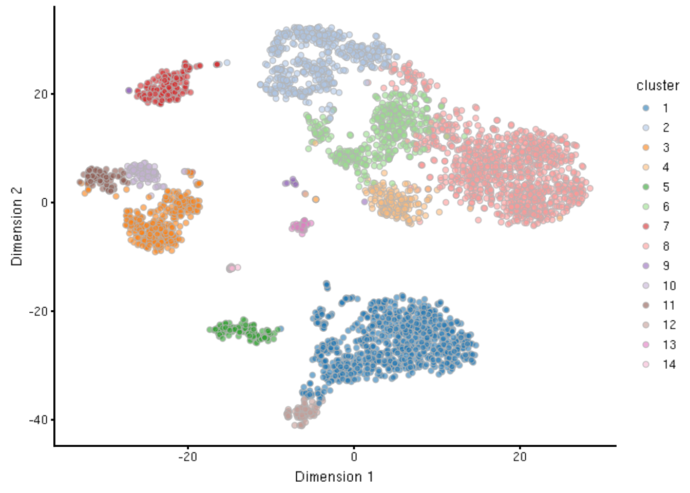
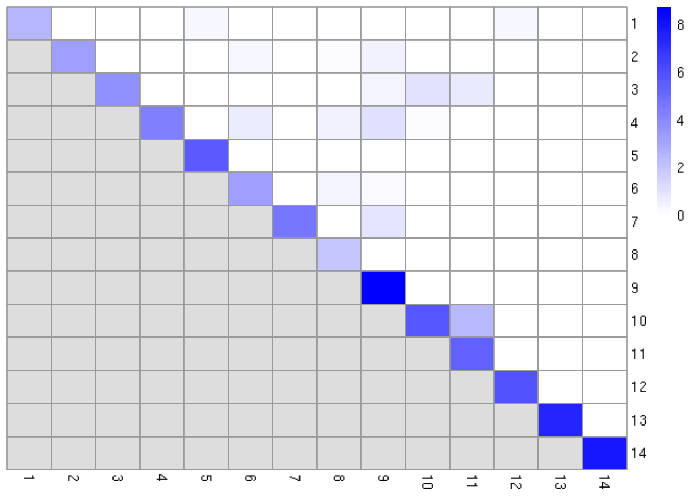
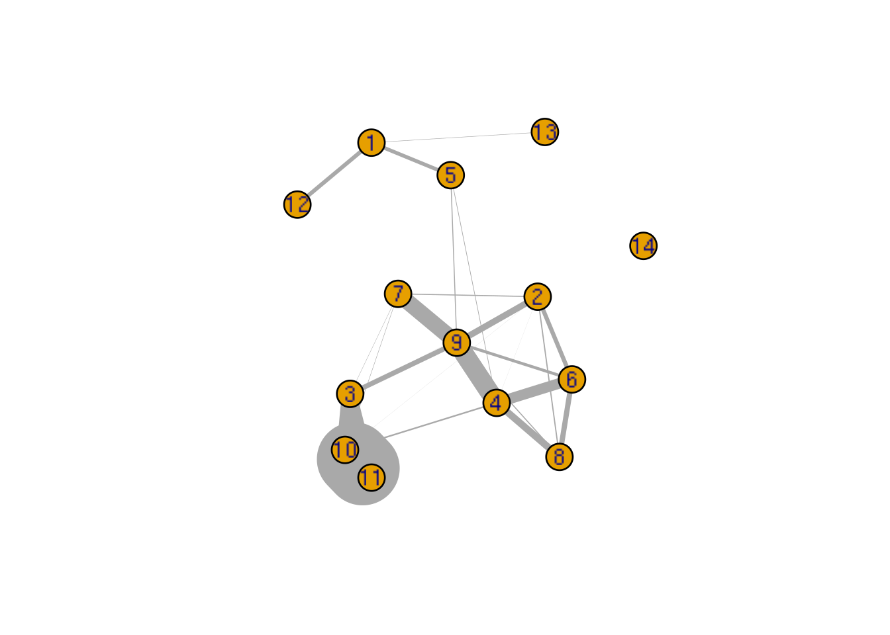
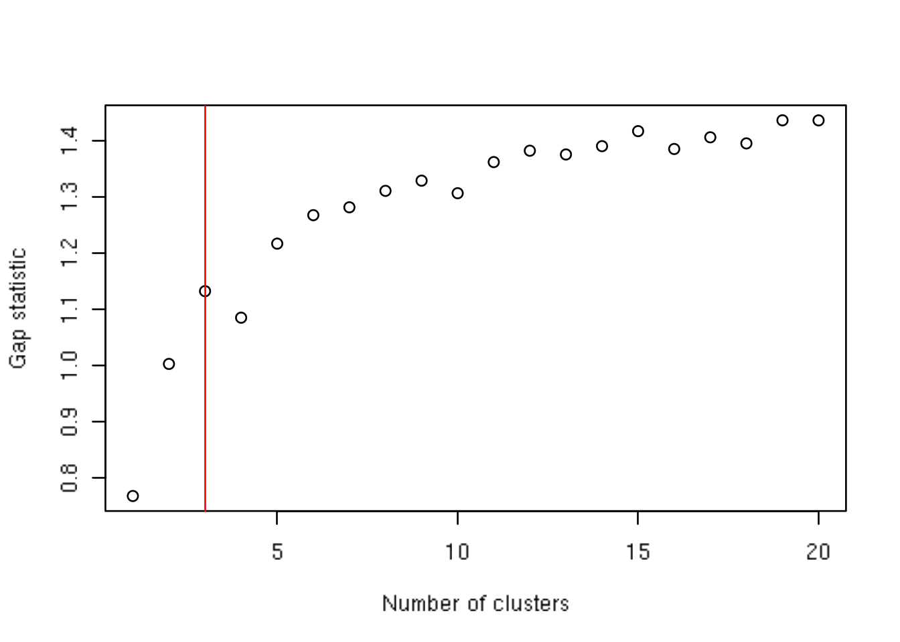
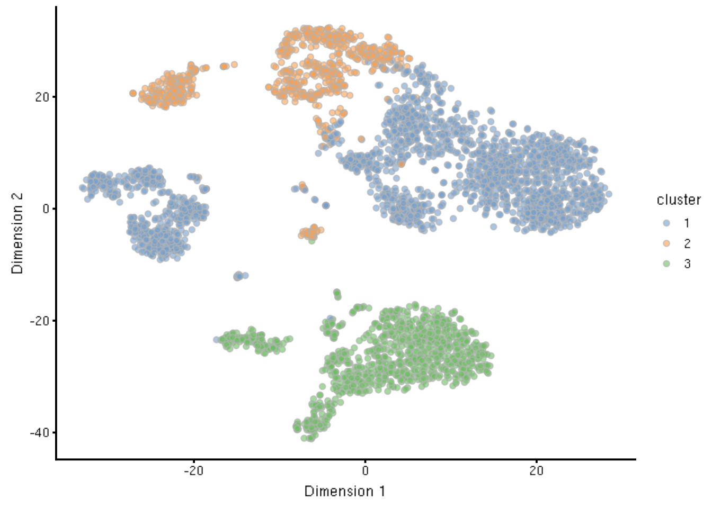
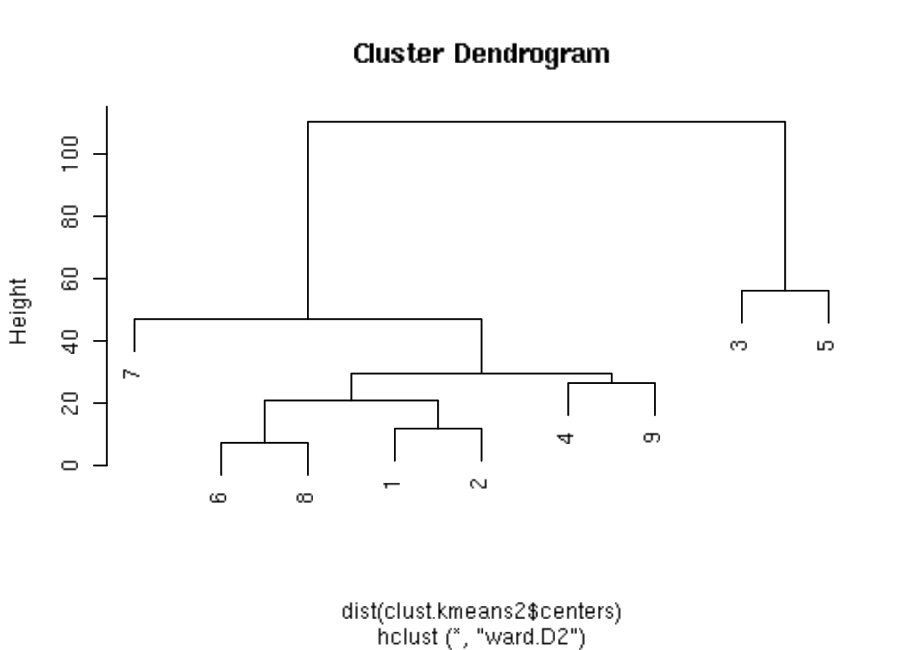
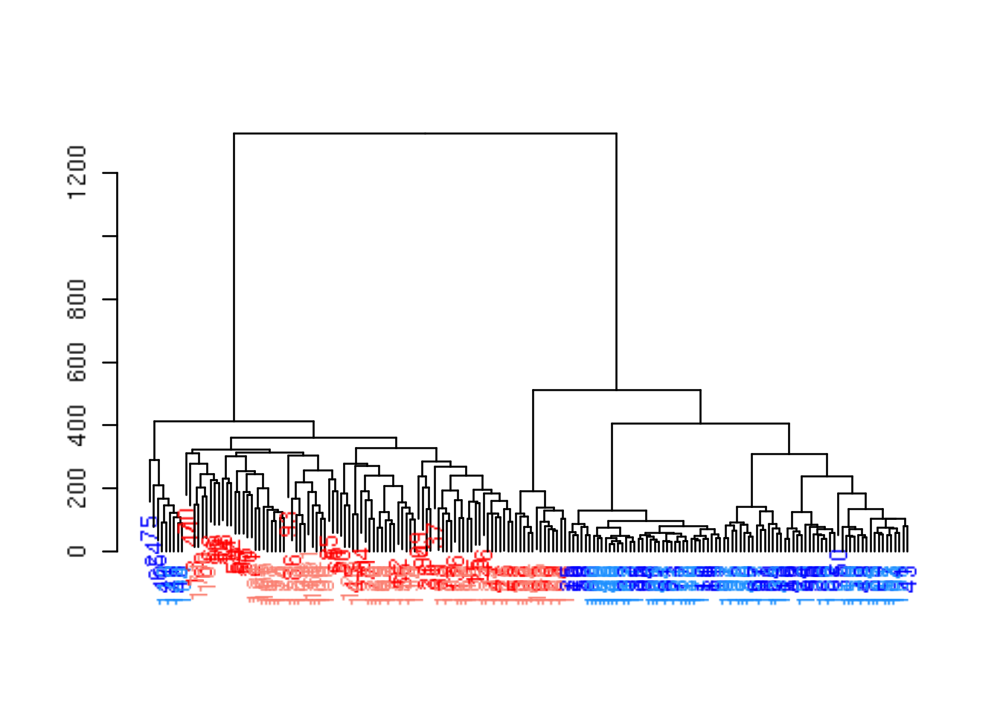
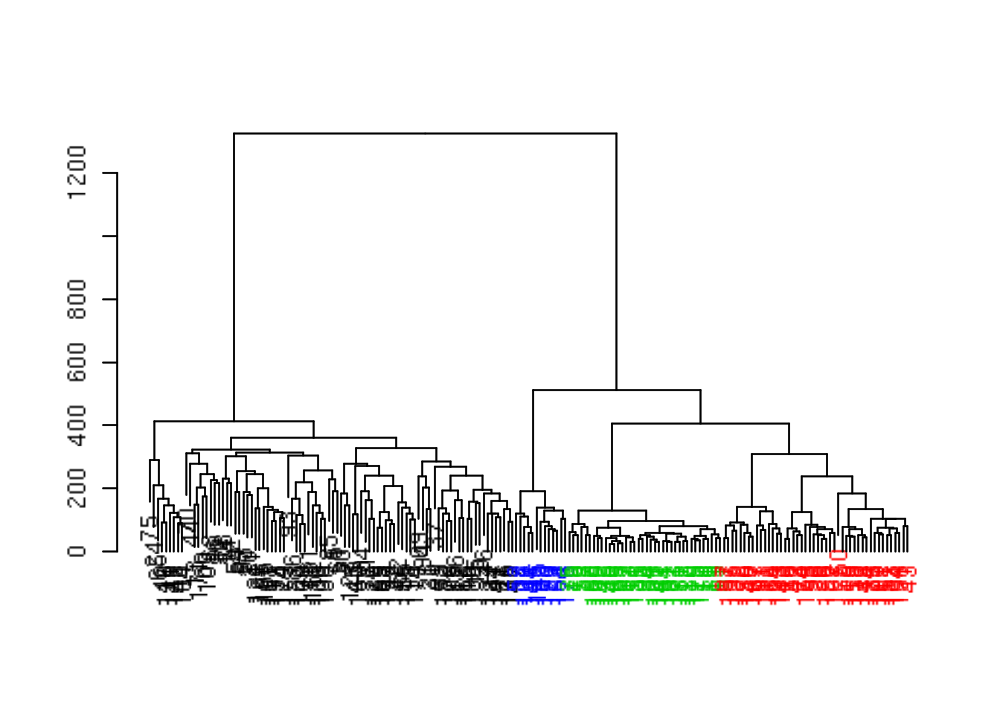
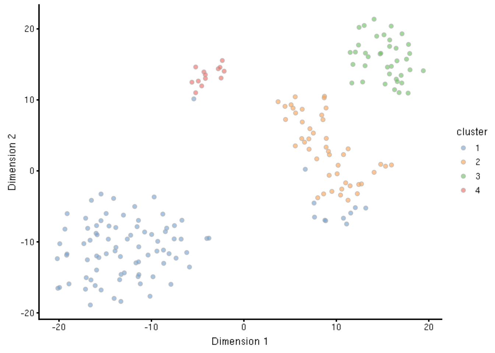

---
output:
  html_document
bibliography: ../ref.bib
---

# Clustering

<script>
document.addEventListener("click", function (event) {
    if (event.target.classList.contains("aaron-collapse")) {
        event.target.classList.toggle("active");
        var content = event.target.nextElementSibling;
        if (content.style.display === "block") {
          content.style.display = "none";
        } else {
          content.style.display = "block";
        }
    }
})
</script>

<style>
.aaron-collapse {
  background-color: #eee;
  color: #444;
  cursor: pointer;
  padding: 18px;
  width: 100%;
  border: none;
  text-align: left;
  outline: none;
  font-size: 15px;
}

.aaron-content {
  padding: 0 18px;
  display: none;
  overflow: hidden;
  background-color: #f1f1f1;
}
</style>

## Motivation

Clustering is an unsupervised learning procedure that is used in scRNA-seq data analysis to empirically define groups of cells with similar expression profiles.
Its primary purpose is to summarize the data in a digestible format for human interpretation. 
This allows us to describe population heterogeneity in terms of discrete labels that are easily understood, rather than attempting to comprehend the high-dimensional manifold on which the cells truly reside.
After annotation based on marker genes, the clusters can be treated as proxies for more abstract biological concepts such as cell types or states.
Clustering is thus a critical step for extracting biological insights from scRNA-seq data.
Here, we demonstrate the application of several commonly used methods with the 10X PBMC dataset. 

<button class="aaron-collapse">View history</button>
<div class="aaron-content">
   
```r
### loading ###
library(BiocFileCache)
bfc <- BiocFileCache("raw_data", ask = FALSE)
raw.path <- bfcrpath(bfc, file.path("http://cf.10xgenomics.com/samples",
    "cell-exp/2.1.0/pbmc4k/pbmc4k_raw_gene_bc_matrices.tar.gz"))
untar(raw.path, exdir=file.path(tempdir(), "pbmc4k"))

library(DropletUtils)
fname <- file.path(tempdir(), "pbmc4k/raw_gene_bc_matrices/GRCh38")
sce.pbmc <- read10xCounts(fname, col.names=TRUE)

### gene-annotation ###
library(scater)
rownames(sce.pbmc) <- uniquifyFeatureNames(rowData(sce.pbmc)$ID, rowData(sce.pbmc)$Symbol)

library(EnsDb.Hsapiens.v86)
location <- mapIds(EnsDb.Hsapiens.v86, keys=rowData(sce.pbmc)$ID, 
    column="SEQNAME", keytype="GENEID")

### cell-detection ###
set.seed(100)
e.out <- emptyDrops(counts(sce.pbmc))
sce.pbmc <- sce.pbmc[,which(e.out$FDR <= 0.001)]

### quality-control ###
sce.pbmc <- calculateQCMetrics(sce.pbmc, feature_controls=list(Mito=which(location=="MT")))
high.mito <- isOutlier(sce.pbmc$pct_counts_Mito, nmads=3, type="higher")
sce.pbmc <- sce.pbmc[,!high.mito]

### normalization ###
library(scran)
set.seed(1000)
clusters <- quickCluster(sce.pbmc)
sce.pbmc <- computeSumFactors(sce.pbmc, min.mean=0.1, cluster=clusters)
sce.pbmc <- normalize(sce.pbmc)

### feature-selection ###
fit.pbmc <- trendVar(sce.pbmc, use.spikes=FALSE)
dec.pbmc <- decomposeVar(fit=fit.pbmc)
o <- order(dec.pbmc$bio, decreasing=TRUE)
chosen.hvgs <- rownames(dec.pbmc)[head(o, 2000)]

### dimensionality-reduction ###
set.seed(10000)
sce.pbmc <- runPCA(sce.pbmc, feature_set=chosen.hvgs, ncomponents=25,
    BSPARAM=BiocSingular::IrlbaParam())

set.seed(100000)
sce.pbmc <- runTSNE(sce.pbmc, use_dimred="PCA")

set.seed(1000000)
sce.pbmc <- runUMAP(sce.pbmc, use_dimred="PCA")
```

</div>


```r
sce.pbmc
```

```
## class: SingleCellExperiment 
## dim: 33694 3922 
## metadata(1): log.exprs.offset
## assays(2): counts logcounts
## rownames(33694): RP11-34P13.3 FAM138A ... AC213203.1 FAM231B
## rowData names(10): ID Symbol ... total_counts log10_total_counts
## colnames(3922): AAACCTGAGAAGGCCT-1 AAACCTGAGACAGACC-1 ...
##   TTTGTCACAGGTCCAC-1 TTTGTCATCCCAAGAT-1
## colData names(38): Sample Barcode ...
##   pct_counts_in_top_200_features_Mito
##   pct_counts_in_top_500_features_Mito
## reducedDimNames(3): PCA TSNE UMAP
## spikeNames(0):
```

## Comments on Truth

At this point^[Pretty deep title here. I'm not a Doctor of Philosophy for nothing, y'know.], it is worth stressing the distinction between clusters and cell types.
The former is an empirical construct while the latter is a biological truth (albeit a vaguely defined one).
For this reason, questions like "what is the true number of clusters?" are usually meaningless.
We can define as many clusters as we like, with whatever algorithm we like - each clustering will represent its own partitioning of the high-dimensional expression space, and is as "real" as any other clustering.

A more relevant question is "how well do the clusters approximate the cell types?"
Unfortunately, this is difficult to answer given the context-dependent interpretation of biological truth.
Some analysts will be satisfied with resolution of the major cell types; other analysts may want resolution of subtypes; and others still may require resolution of different states (e.g., metabolic activity, stress) within those subtypes.
Two clusterings can also be highly inconsistent yet both valid, simply partitioning the cells based on different aspects of biology.
Indeed, asking for an unqualified "best" clustering is akin to asking for the best magnification on a microscope without any context.

It is helpful to realize that clustering, like a microscope, is simply a tool to explore the data.
We can zoom in and out by changing the resolution of the clustering parameters, and we can experiment with different clustering algorithms to obtain alternative perspectives of the data.
This iterative approach is entirely permissible for data exploration, which constitutes the majority of all scRNA-seq data analysis.
   
## Graph-based clustering

### Background

Popularized by its use in *[Seurat](https://CRAN.R-project.org/package=Seurat)*, graph-based clustering is a flexible and scalable technique for clustering large scRNA-seq datasets.
We first build a graph where each node is a cell that is connected to its nearest neighbours in the high-dimensional space.
Edges are weighted based on the similarity between the cells involved, with higher weight given to cells that are more closely related.
We then apply algorithms to identify "communities" of cells that are more connected to cells in the same community than they are to cells of different communities.
Each community represents a cluster that we can use for downstream interpretation.

The major advantage of graph-based clustering lies in its scalability.
It only requires a $k$-nearest neighbor search that can be done in log-linear time on average, in contrast to hierachical clustering methods with runtimes that are quadratic with respect to the number of cells.
Graph construction avoids making strong assumptions about the shape of the clusters or the distribution of cells within each cluster, compared to other methods like $k$-means (that favor spherical clusters) or Gaussian mixture models (that require normality).
From a practical perspective, each cell is forcibly connected to a minimum number of neighboring cells, which reduces the risk of generating many uninformative clusters consisting of one or two outlier cells.

The main drawback of graph-based methods is that, after graph construction, no information is retained about relationships beyond the neighbouring cells^[Sten Linarrsson talked about this in SCG2018, but I don't know where that work ended up. So this is what passes as a reference for the time being.].
This has some practical consequences in datasets that exhibit differences in cell density, as more steps through the graph are required to move the same distance through a region of higher cell density.
From the perspective of community detection algorithms, this effect "inflates" the high-density regions such that any internal substructure or noise is more likely to cause formation of subclusters.
The resolution of clustering thus becomes dependent on the density of cells, which can occasionally be misleading if it overstates the heterogeneity in the data.


### Implementation

There are several considerations in the practical execution of a graph-based clustering method:

- How many neighbors are considered when constructing the graph.
- What scheme is used to weight the edges.
- Which community detection algorithm is used to define the clusters.

For example, the following code uses the 10 nearest neighbors of each cell to construct a shared nearest neighbor graph.
Two cells are connected by an edge if any of their nearest neighbors are shared,
with the edge weight defined from the highest average rank of the shared neighbors [@xu2015identification].
The Walktrap method from the *[igraph](https://CRAN.R-project.org/package=igraph)* package is then used to identify communities.
All calculations are performed using the top PCs to take advantage of data compression and denoising.


```r
library(scran)
g <- buildSNNGraph(sce.pbmc, k=10, use.dimred = 'PCA')
clust <- igraph::cluster_walktrap(g)$membership
table(clust)
```

```
## clust
##   1   2   3   4   5   6   7   8   9  10  11  12 
## 792 519 568 549 117 202  89 943  55  35  17  36
```

We assign the cluster assignments back into our `SingleCellExperiment` object as a factor in the column metadata.
This allows us to conveniently visualize the distribution of clusters in a $t$-SNE plot (Figure \@ref(fig:tsne-clust-graph)).


```r
library(scater)
sce.pbmc$cluster <- factor(clust)
plotReducedDim(sce.pbmc, "TSNE", colour_by="cluster")
```

<div class="figure">

<p class="caption">(\#fig:tsne-clust-graph)$t$-SNE plot of the 10X PBMC dataset, where each point represents a cell and is coloured according to the identity of the assigned cluster from graph-based clustering.</p>
</div>

The most important parameter is `k`, the number of nearest neighbors used to construct the graph.
This controls the resolution of the clustering with higher `k` yielding a more inter-connected graph and larger clusters.
Users can exploit this by experimenting with different values of `k` to obtain a satisfactory resolution.


```r
# More resolved.
g.5 <- buildSNNGraph(sce.pbmc, k=5, use.dimred = 'PCA')
clust.5 <- igraph::cluster_walktrap(g.5)$membership
table(clust.5)
```

```
## clust.5
##   1   2   3   4   5   6   7   8   9  10  11  12  13  14  15  16 
## 123 798  26 559 505 200  91 505 986  27  50   9  10   9   7  17
```

```r
# Less resolved.
g.50 <- buildSNNGraph(sce.pbmc, k=50, use.dimred = 'PCA')
clust.50 <- igraph::cluster_walktrap(g.50)$membership
table(clust.50)
```

```
## clust.50
##    1    2    3    4    5    6    7    8 
##  181  839  572  116  173  518  488 1035
```

### Other parameters

Further tweaking can be performed by changing the edge weighting scheme during graph construction.
Setting `type="number"` will weight edges based on the number of nearest neighbors that are shared between two cells.
Similarly, `type="jaccard"` will weight edges according to the Jaccard index of the two sets of neighbors.
We can also disable weighting altogether by using `buildKNNGraph()`, which is occasionally useful for downstream graph operations that do not support weights.


```r
g.num <- buildSNNGraph(sce.pbmc, use.dimred="PCA", type="number")
g.jaccard <- buildSNNGraph(sce.pbmc, use.dimred="PCA", type="jaccard")
g.none <- buildKNNGraph(sce.pbmc, use.dimred="PCA")
```

All of these `g` variables are `graph` objects from the *[igraph](https://CRAN.R-project.org/package=igraph)* package and can be used with any of the community detection algorithms provided by *[igraph](https://CRAN.R-project.org/package=igraph)*.
We have already mentioned the Walktrap approach, but many others are available to choose from:


```r
clust.louvain <- igraph::cluster_louvain(g)$membership
clust.infomap <- igraph::cluster_infomap(g)$membership
clust.fast <- igraph::cluster_fast_greedy(g)$membership
clust.labprop <- igraph::cluster_label_prop(g)$membership
clust.eigen <- igraph::cluster_leading_eigen(g)$membership
```

It is then straightforward to compare two clustering strategies to see how they differ.
For example, the results below suggest that Louvain is similar to Walktrap;
fast-greedy yields coarser clusters; and Infomap provides higher resolution.


```r
table(Louvain=clust.louvain, Walktrap=clust)
```

```
##        Walktrap
## Louvain   1   2   3   4   5   6   7   8   9  10  11  12
##      1    0   0   0   0   0   0   0   0   0   0   0  36
##      2    0   0   0   0   0 187   0   0   0   0   0   0
##      3    0   0 546   2   0  15   0   0   0   0   0   0
##      4    0   0   8  23   0   0   0 943   0   0   0   0
##      5   32   0   0   1   0   0  89   0   0  35   0   0
##      6    0 519   0   0   0   0   0   0   0   0   0   0
##      7  760   0   0   0   4   0   0   0   1   0   0   0
##      8    0   0   0   0 113   0   0   0   0   0   0   0
##      9    0   0   0   0   0   0   0   0   0   0  17   0
##      10   0   0  13   8   0   0   0   0  54   0   0   0
##      11   0   0   1 515   0   0   0   0   0   0   0   0
```

```r
table(Infomap=clust.infomap, Walktrap=clust)
```

```
##        Walktrap
## Infomap   1   2   3   4   5   6   7   8   9  10  11  12
##      1    0   0   2  24   0   0   0 943   0   0   0   0
##      2  483   0   0   0   0   0   0   0   0   0   0   0
##      3    0   0   1 375   0   0   0   0   0   0   0   0
##      4    0 295   0   0   0   0   0   0   0   0   0   0
##      5    0   0 254   0   0   2   0   0   0   0   0   0
##      6  246   0   0   0   0   0   0   0   0   0   0   0
##      7    0 211   0   0   0   0   0   0   0   0   0   0
##      8    0   0   0   0   0 187   0   0   0   0   0   0
##      9    0   0 168   4   0   0   0   0   0   0   0   0
##      10   0   0 120   0   0  13   0   0   0   0   0   0
##      11   0   0   0 137   0   0   0   0   0   0   0   0
##      12   0   0   0   0  94   0   0   0   0   0   0   0
##      13   0   0   0   0   0   0  89   0   0   0   0   0
##      14   0   0   0   0   0   0   0   0  55   0   0   0
##      15   0   0   0   0   0   0   0   0   0   0   0  36
##      16  20   0   0   0  23   0   0   0   0   0   0   0
##  [ reached getOption("max.print") -- omitted 6 rows ]
```

```r
table(Fast=clust.fast, Walktrap=clust)
```

```
##     Walktrap
## Fast   1   2   3   4   5   6   7   8   9  10  11  12
##    1   0   0   0   4   0   0   0 880   0   0   0   0
##    2   0   0   0   0  88   0   0   0   0   0   0   0
##    3   0   0   0   0   0   0   0   0   0   0  17   0
##    4   3   3 568 545   0 202   0  63  55   1   0   0
##    5 789   0   0   0  29   0  89   0   0  34   0   0
##    6   0   0   0   0   0   0   0   0   0   0   0  36
##    7   0 516   0   0   0   0   0   0   0   0   0   0
```

Pipelines involving *[scran](https://bioconductor.org/packages/3.10/scran)* default to rank-based weights followed by Walktrap clustering.
In contrast, *[Seurat](https://CRAN.R-project.org/package=Seurat)* uses Jaccard-based weights followed by Louvain clustering.
Both of these strategies work well, and it is likely that the same could be said for many other combinations of weighting schemes and community detection algorithms.

### Assessing cluster separation

When dealing with graphs, the modularity is a natural metric for evaluating the separation between communities/clusters.
This is defined as the (scaled) difference between the observed total weight of edges between nodes in the same cluster and the expected total weight if edge weights were randomly distributed across all pairs of nodes.
Larger modularity values indicate that there most edges occur within clusters, suggesting that the clusters are sufficiently well separated to avoid edges forming between neighboring cells in different clusters.

The standard approach is to report a single modularity value for a clustering on a given graph.
This is useful for comparing different clusterings on the same graph - and indeed, some community detection algorithms are designed with the aim of maximizing the modularity - but it is less helpful for interpreting a given clustering.
Rather, we use the `clusterModularity()` function with `get.values=TRUE`, which returns the observed and expected sum of weights between each pair of clusters.


```r
mod <- clusterModularity(g, clust, get.values=TRUE)
names(mod)
```

```
## [1] "observed" "expected"
```

```r
mod$observed
```

```
##           1        2        3        4       5     6       7        8
## 1  486858.0      0.0      0.0      0.0  1399.0     0  1470.5      0.0
## 2       0.0 312166.0    194.0     77.5     0.0    50     0.0      0.0
## 3       0.0    194.0 312796.0   9462.0     0.0  4147     0.0   1342.0
## 4       0.0     77.5   9462.0 300918.0     0.0    30    68.0  20263.5
## 5    1399.0      0.0      0.0      0.0 36086.0     0    23.5      0.0
## 6       0.0     50.0   4147.0     30.0     0.0 91979     0.0      0.0
## 7    1470.5      0.0      0.0     68.0    23.5     0 28203.0      0.0
## 8       0.0      0.0   1342.0  20263.5     0.0     0     0.0 783454.0
## 9     400.0     56.5    284.5    112.0    40.0     7     5.5     22.5
## 10   1240.0      0.0      0.0     20.5    82.0     0   250.0     52.0
## 11    121.5      0.0      0.0      0.0     0.0     0    33.5      0.0
## 12      0.0      0.0      0.0      0.0     0.0     0     0.0      0.0
##          9     10     11     12
## 1    400.0 1240.0  121.5    0.0
## 2     56.5    0.0    0.0    0.0
## 3    284.5    0.0    0.0    0.0
## 4    112.0   20.5    0.0    0.0
## 5     40.0   82.0    0.0    0.0
## 6      7.0    0.0    0.0    0.0
## 7      5.5  250.0   33.5    0.0
## 8     22.5   52.0    0.0    0.0
## 9  15243.0   70.0    0.0    5.5
## 10    70.0 5497.0    1.0    0.0
## 11     0.0    1.0 2170.0    0.0
## 12     5.5    0.0    0.0 6849.0
```

In each matrix, each row/column corresponds to a cluster, and each entry of the matrix contains the total weight of edges between cells in the respective clusters.
A dataset containing well-separated clusters should contain most of the observed total weight on the diagonal entries, i.e., most edges occur between cells in the same cluster.
We visualize this by computing the log-ratio of observed to expected weights (Figure \@ref(fig:cluster-mod)).
Concentration of the weight on the diagonal indicates that most of the clusters are well-separated, while some modest off-diagonal entries represent closely related clusters with more inter-connecting edges.
(We use the log-ratio instead of the difference as the latter's scale depends on the number of cells in each cluster, meaning that any visualization would be dominated by large differences for large clusters.)


```r
ratio <- mod$observed/mod$expected

library(pheatmap)
pheatmap(log2(ratio+1), cluster_rows=FALSE, cluster_cols=FALSE,
    color=colorRampPalette(c("white", "blue"))(100))
```

<div class="figure">

<p class="caption">(\#fig:cluster-mod)Heatmap of the log~2~-ratio of the total weight between nodes in the same cluster or in different clusters, relative to the total weight expected under a null model of random links.</p>
</div>

One useful approach is to use the `ratio` matrix to form another graph where the nodes are clusters rather than cells.
Edges between nodes are weighted according to the ratio of observed to expected edge weights between cells in those clusters.
We can then repeat our graph operations on this new cluster-level graph.
For example, we could obtain clusters of clusters, or we could simply create a new cluster-based layout for visualization (Figure \@ref(fig:cluster-graph)).
This is analogous to the "graph abstraction" approach described by @wolf2017graph.


```r
cluster.gr <- igraph::graph_from_adjacency_matrix(ratio, 
    mode="undirected", weighted=TRUE, diag=FALSE)
plot(cluster.gr, edge.width=igraph::E(cluster.gr)$weight*10)  
```

<div class="figure">

<p class="caption">(\#fig:cluster-graph)Force-directed layout showing the relationships between clusters based on the ratio of observed to expected total weights between nodes in different clusters. The thickness of the edge between a pair of clusters is proportional to the corresponding ratio.</p>
</div>

Incidentally, some readers may have noticed that all *[igraph](https://CRAN.R-project.org/package=igraph)* commands were prefixed with `igraph::`.
We have done this deliberately to avoid bringing `igraph::normalize` into the global namespace.
Rather unfortunately, this `normalize` function accepts any argument and returns `NULL`, which causes difficult-to-diagnose bugs when it overwrites our intended `normalize` from *[scater](https://bioconductor.org/packages/3.10/scater)*.

## $k$-means clustering 

### Background

$k$-means clustering is a classic technique that aims to partition cells into $k$ clusters.
Each cell is assigned to the cluster with the closest centroid, which is done by minimizing the within-cluster sum of squares using a random starting configuration for the $k$ centroids.
The main advantage of this approach lies in its speed, given the simplicity and ease of implementation of the algorithm.
However, it suffers from a number of serious shortcomings:

- It implicitly favours spherical clusters of equal radius.
This can result in inappropriate partitionings on real datasets that contain groupings with irregular sizes and shapes.
- The number of clusters $k$ must be specified beforehand and represents a hard cap on the resolution of the clustering..
For example, setting $k$ to be below the number of cell types will always lead to co-clustering of two cell types, regardless of how well separated they are.
In contrast, other methods like graph-based clustering will respect strong separation even if the relevant resolution parameter is set to a low value.
- It is dependent on the randomly chosen initial coordinates.
This requires multiple runs to verify that the clustering is stable.

These issues reduce the appeal of $k$-means clustering for scRNA-seq data analysis.
Despite this, it is still used widely as it is fast and - frankly - often good enough.

Even if we were to forgo $k$-means for obtaining clusters to interpret, it is still one of the best approaches for sample-based data compression. 
In this application, we set $k$ to a large value such as the square root of the number of cells to obtain fine-grained clusters.
These are not meant to be interpreted directly, but rather, the centroids are treated as "samples" for further analyses.
The idea here is to obtain a single representative of each region of the expression space, reducing the number of samples and computational work in later steps like, e.g., trajectory reconstruction [@ji2016tscan].
This approach will also eliminate differences in cell density across the expression space, ensuring that the most abundant cell type does not dominate downstream results. 

### Base implementation 

Base R provides the `kmeans()` function that does as its name suggests.
We call this on our top PCs to obtain a clustering for a specified number of clusters in the `centers=` argument, after setting the random seed to ensure that the results are reproducible.
In general, the $k$-means clusters correspond to the visual clusters on the $t$-SNE plot in Figure \@ref(fig:tsne-clust-kmeans), though there are some divergences that are not observed in, say, Figure \@ref(fig:tsne-clust-graph).
(This is at least partially due to the fact that $t$-SNE is itself graph-based and so will naturally agree more with a graph-based clustering strategy.)


```r
set.seed(100)
clust.kmeans <- kmeans(reducedDim(sce.pbmc, "PCA"), centers=10)
table(clust.kmeans$cluster)
```

```
## 
##    1    2    3    4    5    6    7    8    9   10 
##  458  207   23  517    1  568   36 1033 1057   22
```

```r
sce.pbmc$cluster <- factor(clust.kmeans$cluster)
plotReducedDim(sce.pbmc, "TSNE", colour_by="cluster")
```

<div class="figure">

<p class="caption">(\#fig:tsne-clust-kmeans)$t$-SNE plot of the 10X PBMC dataset, where each point represents a cell and is coloured according to the identity of the assigned cluster from $k$-means clustering.</p>
</div>

We obtain a "reasonable" choice of $k$ by computing the gap statistic using methods from the *[cluster](https://CRAN.R-project.org/package=cluster)* package.
This is the log-ratio of the expected to observed within-cluster sum of squares, where the expected value is computed by randomly distributingn cells throughout high-dimensional space using the bounding box of the original data.
A larger gap statistic represents a lower observed sum of squares - and thus better clustering - compared to a population with no structure.
Ideally, we would choose the $k$ that maximizes the gap statistic, but this is often unhelpful as the tendency of $k$-means to favour spherical clusters results in a large choice $k$ to capture different cluster shapes.
Instead, we choose the most parsimonious $k$ beyond which the increases in the gap statistic are considered insignificant (Figure \@ref(fig:kmeans-gap)).


```r
library(cluster)
gaps <- clusGap(reducedDim(sce.pbmc, "PCA"), kmeans, K.max=20)
best.k <- maxSE(gaps$Tab[,"gap"], gaps$Tab[,"SE.sim"])
best.k
```

```
## [1] 9
```

```r
plot(gaps$Tab[,"gap"], xlab="Number of clusters", ylab="Gap statistic")
abline(v=best.k, col="red")
```

<div class="figure">

<p class="caption">(\#fig:kmeans-gap)Gap statistic with respect to increasing number of $k$-means clusters in the 10X PBMC dataset. The red line represents the chosen $k$.</p>
</div>

It is then straightforwad to repeat the clustering with the `best.k` (Figure \@ref(fig:tsne-clust-kmeans-best).


```r
set.seed(100)
clust.kmeans2 <- kmeans(reducedDim(sce.pbmc, "PCA"), centers=best.k)
table(clust.kmeans2$cluster)
```

```
## 
##    1    2    3    4    5    6    7    8    9 
##  458  207   24  517   22  568   36 1033 1057
```

```r
sce.pbmc$cluster <- factor(clust.kmeans2$cluster)
plotReducedDim(sce.pbmc, "TSNE", colour_by="cluster")
```

<div class="figure">

<p class="caption">(\#fig:tsne-clust-kmeans-best)$t$-SNE plot of the 10X PBMC dataset, where each point represents a cell and is coloured according to the identity of the assigned cluster from $k$-means clustering. Here, $k$ is chosen based on the gap statistic.</p>
</div>

### Assessing cluster separation

The within-cluster sum of squares (WCSS) for each cluster is the relevant diagnostic for $k$-means, given that the algorithm aims to find a clustering that minimizes the WCSS.
Specifically, we use the WCSS to compute the root-mean-squared deviation (RMSD) that represents the spread of cells within each cluster.
A cluster is more likely to have a low RMSD if it has no internal structure and is separated from other clusters (such that there are not many cells on the boundaries between clusters, which results in a higher sum of squares from the centroid).


```r
ncells <- tabulate(clust.kmeans2$cluster)
tab <- data.frame(wcss=clust.kmeans2$withinss, ncells=ncells)
tab$rms <- sqrt(tab$wcss/tab$ncells)
tab
```

```
##     wcss ncells     rms
## 1  11113    458   4.926
## 2   5715    207   5.254
## 3 291364     24 110.182
## 4  15365    517   5.452
## 5 276270     22 112.061
## 6  18199    568   5.660
## 7   1533     36   6.525
## 8  15074   1033   3.820
## 9  73975   1057   8.366
```

As an aside, clusters with the largest RMSD appear to be the least dispersed in Figure \@ref(fig:pbmc-kmeans-best).
This highlights the risks of attempting to quantitatively interpret $t$-SNE plots.


To explore the relationships between $k$-means clusters, a natural approach is to compute distances between their centroids.
This directly lends itself to visualization as a tree after hierarchical clustering (Figure \@ref(fig:kmeans-tree)). 


```r
cent.tree <- hclust(dist(clust.kmeans2$centers), "ward.D2")
plot(cent.tree)
```

<div class="figure">

<p class="caption">(\#fig:kmeans-tree)Hierarchy of $k$-means cluster centroids, using Ward's minimum variance method.</p>
</div>

## Hierarchical clustering

### Background

Hierarchical clustering is an ancient technique that aims to generate a dendrogram containing a hierarchy of samples.
This is most commonly done by greedily agglomerating samples into clusters, then agglomerating those clusters into larger clusters, and so on until all samples belong to a single cluster. 
Variants of hierarchical clustering methods primarily differ in how they choose to perform the agglomerations.
For example, complete linkage aims to merge clusters with the smallest maximum distance between their elements, while Ward's method aims to minimize the increase in within-cluster variance.

In the context of scRNA-seq, the main advantage of hierarchical clustering lies in the production of the dendrogram.
This is a rich summary that describes not only the relationships between cells but also the relationships between clusters at varying resolution.
Users can easily "cut" the tree at different heights to define clusters with different granularity, where clusters defined at high resolution are guaranteed to be nested within those defined at a lower resolution.
The dendrogram is also a natural representation of the data in situations where cells have descended from a relatively recent common ancestor.

In practice, hierachical clustering is too slow to be used for anything but the smallest scRNA-seq datasets.
Most variants require a cell-cell distance matrix that is prohibitively expensive to compute for many cells.
Greedy agglomeration is also likely to result in a quantitatively suboptimal partitioning (as defined by the agglomeration measure) at higher levels of the dendrogram when the number of cells and merge steps is high.
Nonetheless, we will still demonstrate the application of hierarchical clustering here, as it is useful for squeezing more information out of datasets with very few cells^[And, hey, this book isn't going to add padding to itself. Gotta write something to look productive.].

### Implementation

As the PBMC dataset is too large, we will demonstrate on the 416B dataset instead.

<button class="aaron-collapse">View history</button>
<div class="aaron-content">
   
```r
### loading ###
library(scRNAseq)
sce.416b <- LunSpikeInData(which="416b") 

### gene-annotation ###
library(AnnotationHub)
ens.mm.v97 <- AnnotationHub()[["AH73905"]]
rowData(sce.416b)$ENSEMBL <- rownames(sce.416b)
rowData(sce.416b)$SYMBOL <- mapIds(ens.mm.v97, keys=rownames(sce.416b),
    keytype="GENEID", column="SYMBOL")
rowData(sce.416b)$SEQNAME <- mapIds(ens.mm.v97, keys=rownames(sce.416b),
    keytype="GENEID", column="SEQNAME")

library(scater)
rownames(sce.416b) <- uniquifyFeatureNames(rowData(sce.416b)$ENSEMBL, 
    rowData(sce.416b)$SYMBOL)

### quality-control ###
mito <- which(rowData(sce.416b)$SEQNAME=="MT")
sce.416b <- calculateQCMetrics(sce.416b, feature_controls=list(Mt=mito))

combined <- paste0(sce.416b$block, ":", sce.416b$phenotype)
libsize.drop <- isOutlier(sce.416b$total_counts, nmads=3, type="lower", 
    log=TRUE, batch=combined)
feature.drop <- isOutlier(sce.416b$total_features_by_counts, nmads=3, 
    type="lower", log=TRUE, batch=combined)
spike.drop <- isOutlier(sce.416b$pct_counts_ERCC, nmads=3, type="higher",
    batch=combined)

keep <- !(libsize.drop | feature.drop | spike.drop)
sce.416b <- sce.416b[,keep]

### normalization ###
library(scran)
sce.416b <- computeSumFactors(sce.416b)
sce.416b <- computeSpikeFactors(sce.416b, general.use=FALSE)
sce.416b <- normalize(sce.416b)

### variance-modelling ###
fit.416b <- trendVar(sce.416b, block=sce.416b$block)
dec.416b <- decomposeVar(sce.416b, fit.416b)

# Taking all of the genes with positive biological components.
chosen.hvgs <- rownames(dec.416b)[dec.416b$bio > 0]

### batch-correction ###
# Composition of the plates is expected to be the same,
# hence the use of a simple 'removeBatchEffect'.
library(limma)
assay(sce.416b, "corrected") <- removeBatchEffect(logcounts(sce.416b), 
    design=model.matrix(~sce.416b$phenotype), batch=sce.416b$block)

### dimensionality-reduction ###
sce.416b <- denoisePCA(sce.416b, technical=dec.416b, 
    subset.row=chosen.hvgs, assay.type="corrected")

set.seed(1010)
sce.416b <- runTSNE(sce.416b, use_dimred="PCA", perplexity=10)
```

</div>


```r
sce.416b
```

```
## class: SingleCellExperiment 
## dim: 46703 188 
## metadata(1): log.exprs.offset
## assays(3): counts logcounts corrected
## rownames(46703): ENSMUSG00000102693 ENSMUSG00000064842 ... SIRV7
##   CBFB-MYH11-mcherry
## rowData names(14): Length ENSEMBL ... total_counts
##   log10_total_counts
## colnames(188): SLX-9555.N701_S502.C89V9ANXX.s_1.r_1
##   SLX-9555.N701_S503.C89V9ANXX.s_1.r_1 ...
##   SLX-11312.N712_S507.H5H5YBBXX.s_8.r_1
##   SLX-11312.N712_S517.H5H5YBBXX.s_8.r_1
## colData names(63): Source Name cell line ...
##   pct_counts_in_top_200_features_SIRV
##   pct_counts_in_top_500_features_SIRV
## reducedDimNames(2): PCA TSNE
## spikeNames(2): ERCC SIRV
```

We compute a cell-cell distance matrix using the top PCs and we apply hierarchical clustering with Ward's method.
This aims to minimize the increase in the intra-cluster variance at each merge step.
The resulting tree in Figure \@ref(fig:dend-416b) shows a clear split in the population caused by oncogene induction. 


```r
dist.416b <- dist(reducedDim(sce.416b, "PCA"))
tree.416b <- hclust(dist.416b, "ward.D2")

# Making a prettier plot.
library(dendextend)
tree.416b$labels <- seq_along(tree.416b$labels)
dend <- as.dendrogram(tree.416b, hang=0.1)

combined.fac <- paste0(sce.416b$block, ".", 
    sub(" .*", "", sce.416b$phenotype))
labels_colors(dend) <- c(
    `20160113.wild`="blue",
    `20160113.induced`="red",
    `20160325.wild`="dodgerblue",
    `20160325.induced`="salmon"
)[combined.fac][order.dendrogram(dend)]

plot(dend)
```

<div class="figure">

<p class="caption">(\#fig:dend-416b)Hierarchy of cells in the 416B data set after hierarchical clustering, where each leaf node is a cell that is coloured according to its oncogene induction status (red is induced, blue is control) and plate of origin (light or dark).</p>
</div>

To obtain explicit clusters, we "cut" the tree by removing internal branches such that every subtree represents a distinct cluster.
This is most simply done by removing internal branches above a certain height of the tree, as performed by the `cutree()` function.
We generally prefer to use the *[dynamicTreeCut](https://CRAN.R-project.org/package=dynamicTreeCut)* package, which uses the shape of the tree to choose a suitable partitioning (Figure \@ref(dend-cluster)).


```r
library(dynamicTreeCut)

# minClusterSize needs to be turned down for small datasets.
# deepSplit controls the resolution of the partitioning.
clust.416b <- cutreeDynamic(tree.416b, distM=as.matrix(dist.416b),
    minClusterSize=10, deepSplit=1)
```

```
##  ..cutHeight not given, setting it to 1300  ===>  99% of the (truncated) height range in dendro.
##  ..done.
```

```r
table(clust.416b)
```

```
## clust.416b
##  1  2  3  4  5  6 
## 45 44 37 36 13 13
```

```r
labels_colors(dend) <- clust.416b[order.dendrogram(dend)]
plot(dend)
```

<div class="figure">

<p class="caption">(\#fig:dend-cluster)Hierarchy of cells in the 416B data set after hierarchical clustering, where each leaf node is a cell that is coloured according to its assigned cluster identity from a dynamic tree cut.</p>
</div>

This generally corresponds well to the grouping of cells on a $t$-SNE plot (Figure \@ref(fig:tsne-416b)).


```r
sce.416b$cluster <- factor(clust.416b)
plotReducedDim(sce.416b, "TSNE", colour_by="cluster")
```

<div class="figure">

<p class="caption">(\#fig:tsne-416b)$t$-SNE plot of the 416B dataset, where each point represents a cell and is coloured according to the identity of the assigned cluster from hierarchical clustering.</p>
</div>

### Assessing cluster separation

We check the separation of the clusters using the silhouette width (Figure \@ref(fig:silhouette416b)).
For each cell, we compute the average distance to cells in each other cluster.
We then compute the minimum of these average distances across all clusters, as well as the average distance to cells in the same cluster.
The silhouette width for each cell is defined as the difference between these two values divided by their maximum.
Cells with large positive silhouette widths are closer to other cells in the same cluster than to cells in different clusters.

Each cluster would ideally contain large positive silhouette widths, indicating that it is well-separated from other clusters.
In Figure \@ref(fig:silhouette416b), some clusters are well-separated while others have a substantial proportion of negative widths.
These can arise from the presence of internal subclusters, which inflates the within-cluster distance; or overclustering, where cells at the boundary of a partition are closer to the neighboring cluster than their own cluster.


```r
sil <- silhouette(clust.416b, dist = dist.416b)
plot(sil)
```

<div class="figure">

<p class="caption">(\#fig:silhouette416b)Silhouette widths for cells in each cluster in the 416B dataset. Each bar represents a cell, grouped by the cluster to which it is assigned.</p>
</div>

For a more detailed examination, we identify the closest neighboring cluster for cells with negative widths.
This provides a perspective on the relationships between clusters that is closer to the raw data than the dendrogram in Figure \@ref(fig:dend-cluster).


```r
neg.widths <- sil[,3] < 0
table(Cluster=sil[neg.widths,1], Neighbor=sil[neg.widths,2])
```

```
##        Neighbor
## Cluster  1  2  4  5  6
##       1  0  0  1  0  0
##       2  0  0  0  4  0
##       3  0 32  0  0  5
##       6  1  0  2  0  0
```

The average silhouette width across all cells can also be used to choose clustering parameters.
The aim is to maximize the average silhouette width in order to obtain well-separated clusters.
This can be helpful to automatically obtain a "reasonable" clustering, though in practice, the clustering that yields the strongest separation is usually trivial and not biologically informative.


## Session Info

<button class="aaron-collapse">View session info</button>
<div class="aaron-content">
```
R version 3.6.0 (2019-04-26)
Platform: x86_64-pc-linux-gnu (64-bit)
Running under: Ubuntu 14.04.6 LTS

Matrix products: default
BLAS/LAPACK: /app/easybuild/software/OpenBLAS/0.2.18-GCC-5.4.0-2.26-LAPACK-3.6.1/lib/libopenblas_prescottp-r0.2.18.so

locale:
 [1] LC_CTYPE=en_US.UTF-8       LC_NUMERIC=C              
 [3] LC_TIME=en_US.UTF-8        LC_COLLATE=en_US.UTF-8    
 [5] LC_MONETARY=en_US.UTF-8    LC_MESSAGES=en_US.UTF-8   
 [7] LC_PAPER=en_US.UTF-8       LC_NAME=C                 
 [9] LC_ADDRESS=C               LC_TELEPHONE=C            
[11] LC_MEASUREMENT=en_US.UTF-8 LC_IDENTIFICATION=C       

attached base packages:
[1] stats4    parallel  stats     graphics  grDevices utils     datasets 
[8] methods   base     

other attached packages:
 [1] dynamicTreeCut_1.63-1       dendextend_1.12.0          
 [3] cluster_2.1.0               pheatmap_1.0.12            
 [5] scater_1.13.9               ggplot2_3.2.0              
 [7] scran_1.13.9                SingleCellExperiment_1.7.0 
 [9] SummarizedExperiment_1.15.5 DelayedArray_0.11.4        
[11] BiocParallel_1.19.0         matrixStats_0.54.0         
[13] Biobase_2.45.0              GenomicRanges_1.37.14      
[15] GenomeInfoDb_1.21.1         IRanges_2.19.10            
[17] S4Vectors_0.23.17           BiocGenerics_0.31.5        
[19] BiocStyle_2.13.2            Cairo_1.5-10               

loaded via a namespace (and not attached):
 [1] viridis_0.5.1            edgeR_3.27.9            
 [3] BiocSingular_1.1.5       viridisLite_0.3.0       
 [5] DelayedMatrixStats_1.7.1 assertthat_0.2.1        
 [7] statmod_1.4.32           BiocManager_1.30.4      
 [9] dqrng_0.2.1              GenomeInfoDbData_1.2.1  
[11] vipor_0.4.5              yaml_2.2.0              
[13] pillar_1.4.2             lattice_0.20-38         
[15] glue_1.3.1               limma_3.41.15           
[17] digest_0.6.20            RColorBrewer_1.1-2      
[19] XVector_0.25.0           colorspace_1.4-1        
[21] htmltools_0.3.6          Matrix_1.2-17           
[23] pkgconfig_2.0.2          bookdown_0.12           
[25] zlibbioc_1.31.0          purrr_0.3.2             
[27] scales_1.0.0             tibble_2.1.3            
[29] withr_2.1.2              lazyeval_0.2.2          
[31] magrittr_1.5             crayon_1.3.4            
[33] evaluate_0.14            beeswarm_0.2.3          
[35] tools_3.6.0              stringr_1.4.0           
[37] munsell_0.5.0            locfit_1.5-9.1          
[39] irlba_2.3.3              compiler_3.6.0          
[41] rsvd_1.0.2               rlang_0.4.0             
[43] grid_3.6.0               RCurl_1.95-4.12         
[45] BiocNeighbors_1.3.3      igraph_1.2.4.1          
[47] bitops_1.0-6             rmarkdown_1.14          
[49] gtable_0.3.0             R6_2.4.0                
[51] gridExtra_2.3            knitr_1.23              
[53] dplyr_0.8.3              stringi_1.4.3           
[55] ggbeeswarm_0.6.0         Rcpp_1.0.2              
[57] tidyselect_0.2.5         xfun_0.8                
```
</div>
