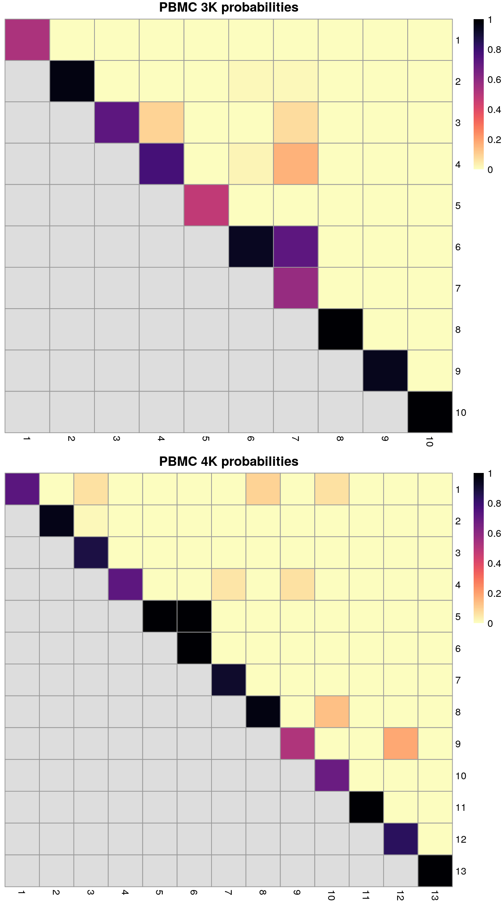
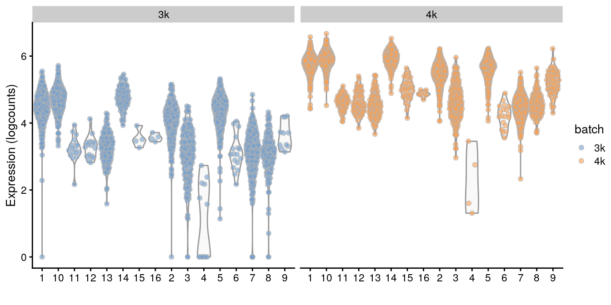

---
output:
  html_document
bibliography: ../ref.bib
---

# Integrating Datasets

<script>
document.addEventListener("click", function (event) {
    if (event.target.classList.contains("aaron-collapse")) {
        event.target.classList.toggle("active");
        var content = event.target.nextElementSibling;
        if (content.style.display === "block") {
          content.style.display = "none";
        } else {
          content.style.display = "block";
        }
    }
})
</script>

<style>
.aaron-collapse {
  background-color: #eee;
  color: #444;
  cursor: pointer;
  padding: 18px;
  width: 100%;
  border: none;
  text-align: left;
  outline: none;
  font-size: 15px;
}

.aaron-content {
  padding: 0 18px;
  display: none;
  overflow: hidden;
  background-color: #f1f1f1;
}
</style>

## Motivation

Large single-cell RNA sequencing (scRNA-seq) projects usually need to generate data across multiple batches due to logistical constraints.
However, the processing of different batches is often subject to uncontrollable differences, e.g., changes in operator, differences in reagent quality.
This results in systematic differences in the observed expression in cells from different batches, which we refer to as "batch effects".
Batch effects are problematic as they can be major drivers of heterogeneity in the data, masking the relevant biological differences and complicating interpretation of the results.

Computational correction of these effects is critical for eliminating batch-to-batch variation, allowing data across multiple batches to be combined for common downstream analysis.
However, existing methods based on linear models [@ritchie2015limma;@leek2012sva] assume that the composition of cell populations are either known or the same across batches.
To overcome these limitations, bespoke methods have been developed for batch correction of single-cell data [@haghverdi2018batch;@butler2018integrating;@lin2019scmerge] that do not require _a priori_ knowledge about the composition of the population.
This allows them to be used in workflows for exploratory analyses of scRNA-seq data where such knowledge is usually unavailable.

## Setting up the data

To demonstrate, we will use two separate 10X Genomics PBMC datasets generated in two different batches.
Each dataset was obtained from the *[TENxPBMCData](https://bioconductor.org/packages/3.11/TENxPBMCData)* package and separately subjected to basic processing steps.
Separate processing prior to the batch correction step is more convenient, scalable and (on occasion) more reliable.
For example, outlier-based QC on the cells is more effective when performed within a batch (Section \@ref(qc-batch)).
The same can also be said for trend fitting when modelling the mean-variance relationship (Section \@ref(variance-batch)).

<button class="aaron-collapse">View history</button>
<div class="aaron-content">
   
```r
#--- loading ---#
library(TENxPBMCData)
all.sce <- list(
    pbmc3k=TENxPBMCData('pbmc3k'),
    pbmc4k=TENxPBMCData('pbmc4k'),
    pbmc8k=TENxPBMCData('pbmc8k')
)

#--- quality-control ---#
library(scater)
stats <- high.mito <- list()
for (n in names(all.sce)) {
    current <- all.sce[[n]]
    is.mito <- grep("MT", rowData(current)$Symbol_TENx)
    stats[[n]] <- perCellQCMetrics(current, subsets=list(Mito=is.mito))
    high.mito[[n]] <- isOutlier(stats[[n]]$subsets_Mito_percent, type="higher")
    all.sce[[n]] <- current[,!high.mito[[n]]]
}

#--- normalization ---#
all.sce <- lapply(all.sce, logNormCounts)

#--- variance-modelling ---#
library(scran)
all.dec <- lapply(all.sce, modelGeneVar)
all.hvgs <- lapply(all.dec, getTopHVGs, prop=0.1)

#--- dimensionality-reduction ---#
library(BiocSingular)
set.seed(10000)
all.sce <- mapply(FUN=runPCA, x=all.sce, subset_row=all.hvgs, 
    MoreArgs=list(ncomponents=25, BSPARAM=RandomParam()), 
    SIMPLIFY=FALSE)

set.seed(100000)
all.sce <- lapply(all.sce, runTSNE, dimred="PCA")

set.seed(1000000)
all.sce <- lapply(all.sce, runUMAP, dimred="PCA")

#--- clustering ---#
for (n in names(all.sce)) {
    g <- buildSNNGraph(all.sce[[n]], k=10, use.dimred='PCA')
    clust <- igraph::cluster_walktrap(g)$membership
    colLabels(all.sce[[n]])  <- factor(clust)
}
```

</div>


```r
pbmc3k <- all.sce$pbmc3k
dec3k <- all.dec$pbmc3k
pbmc3k
```

```
## class: SingleCellExperiment 
## dim: 32738 2609 
## metadata(0):
## assays(2): counts logcounts
## rownames(32738): ENSG00000243485 ENSG00000237613 ... ENSG00000215616
##   ENSG00000215611
## rowData names(3): ENSEMBL_ID Symbol_TENx Symbol
## colnames: NULL
## colData names(13): Sample Barcode ... sizeFactor label
## reducedDimNames(3): PCA TSNE UMAP
## altExpNames(0):
```

```r
pbmc4k <- all.sce$pbmc4k
dec4k <- all.dec$pbmc4k
pbmc4k
```

```
## class: SingleCellExperiment 
## dim: 33694 4182 
## metadata(0):
## assays(2): counts logcounts
## rownames(33694): ENSG00000243485 ENSG00000237613 ... ENSG00000277475
##   ENSG00000268674
## rowData names(3): ENSEMBL_ID Symbol_TENx Symbol
## colnames: NULL
## colData names(13): Sample Barcode ... sizeFactor label
## reducedDimNames(3): PCA TSNE UMAP
## altExpNames(0):
```

To prepare for the batch correction:

1. We subset all batches to the common "universe" of features.
In this case, it is straightforward as both batches use Ensembl gene annotation.

    
    ```r
    universe <- intersect(rownames(pbmc3k), rownames(pbmc4k))
    length(universe)
    ```
    
    ```
    ## [1] 31232
    ```
    
    ```r
    # Subsetting the SingleCellExperiment object.
    pbmc3k <- pbmc3k[universe,]
    pbmc4k <- pbmc4k[universe,]
    
    # Also subsetting the variance modelling results, for convenience.
    dec3k <- dec3k[universe,]
    dec4k <- dec4k[universe,]
    ```

2. We rescale each batch to adjust for differences in sequencing depth between batches.
The `multiBatchNorm()` function recomputes log-normalized expression values after adjusting the size factors for systematic differences in coverage between `SingleCellExperiment` objects.
(Size factors only remove biases between cells _within_ a single batch.)
This improves the quality of the correction by removing one aspect of the technical differences between batches.

    
    ```r
    library(batchelor)
    rescaled <- multiBatchNorm(pbmc3k, pbmc4k)
    pbmc3k <- rescaled[[1]]
    pbmc4k <- rescaled[[2]]
    ```

3. We perform feature selection by averaging the variance components across all batches with the `combineVar()` function.
We compute the average as it is responsive to batch-specific HVGs while still preserving the within-batch ranking of genes.
This allows us to use the same strategies described in Section \@ref(hvg-selection) to select genes of interest.
In contrast, approaches based on taking the intersection or union of HVGs across batches become increasingly conservative or liberal, respectively, with an increasing number of batches.

    
    ```r
    library(scran)
    combined.dec <- combineVar(dec3k, dec4k)
    chosen.hvgs <- combined.dec$bio > 0
    sum(chosen.hvgs)
    ```
    
    ```
    ## [1] 13431
    ```

    When integrating datasets of variable composition, it is generally safer to err on the side of including more genes than are used in a single dataset analysis, to ensure that markers are retained for any dataset-specific subpopulations that might be present.
    For a top $X$ selection, this means using a larger $X$ (say, ~5000), or in this case, we simply take all genes above the trend.
    That said, many of the signal-to-noise considerations described in Section \@ref(hvg-selection) still apply here, so some experimentation may be necessary for best results.

    Alternatively, a more forceful approach to feature selection can be used based on marker genes from within-batch comparisons; this is discussed in more detail in Section \@ref(integration-with-markers). 

## Diagnosing batch effects {#batch-diagnosis}

Before we actually perform any correction, it is worth examining whether there is any batch effect in this dataset.
We combine the two `SingleCellExperiment`s and perform a PCA on the log-expression values for all genes with positive (average) biological components.


```r
# Synchronizing the metadata for cbind()ing.
rowData(pbmc3k) <- rowData(pbmc4k)
pbmc3k$batch <- "3k"
pbmc4k$batch <- "4k"
uncorrected <- cbind(pbmc3k, pbmc4k)

# Using RandomParam() as it is more efficient for file-backed matrices.
library(scater)
set.seed(0010101010)
uncorrected <- runPCA(uncorrected, subset_row=chosen.hvgs,
    BSPARAM=BiocSingular::RandomParam())
```

We use graph-based clustering on the components to obtain a summary of the population structure.
As our two PBMC populations should be replicates, each cluster should ideally consist of cells from both batches.
However, we instead see clusters that are comprised of cells from a single batch.
This indicates that cells of the same type are artificially separated due to technical differences between batches.


```r
library(scran)
snn.gr <- buildSNNGraph(uncorrected, use.dimred="PCA")
clusters <- igraph::cluster_walktrap(snn.gr)$membership
tab <- table(Cluster=clusters, Batch=uncorrected$batch)
tab
```

```
##        Batch
## Cluster   3k   4k
##      1     1  781
##      2     0 1309
##      3     0  535
##      4    14   51
##      5     0  605
##      6   489    0
##      7     0  184
##      8  1272    0
##      9     0  414
##      10  151    0
##      11    0   50
##      12  155    0
##      13    0   65
##      14    0   61
##      15    0   88
##      16   30    0
##      17  339    0
##      18  145    0
##      19   11    3
##      20    2   36
```


We can also visualize the corrected coordinates using a $t$-SNE plot (Figure \@ref(fig:tsne-pbmc-uncorrected)).
The strong separation between cells from different batches is consistent with the clustering results.


```r
set.seed(1111001)
uncorrected <- runTSNE(uncorrected, dimred="PCA")
plotTSNE(uncorrected, colour_by="batch")
```

<div class="figure">

<p class="caption">(\#fig:tsne-pbmc-uncorrected)$t$-SNE plot of the PBMC datasets without any batch correction. Each point is a cell that is colored according to its batch of origin.</p>
</div>

Of course, the other explanation for batch-specific clusters is that there are cell types that are unique to each batch.
The degree of intermingling of cells from different batches is not an effective diagnostic when the batches involved might actually contain unique cell subpopulations (which is not a consideration in the PBMC dataset, but the same cannot be said in general).
If a cluster only contains cells from a single batch, one can always debate whether that is caused by a failure of the correction method or if there is truly a batch-specific subpopulation.
For example, do batch-specific metabolic or differentiation states represent distinct subpopulations? 
Or should they be merged together?
We will not attempt to answer this here, only noting that each batch correction algorithm will make different (and possibly inappropriate) decisions on what constitutes "shared" and "unique" populations.

## Linear regression

Batch effects in bulk RNA sequencing studies are commonly removed with linear regression.
This involves fitting a linear model to each gene's expression profile, setting the undesirable batch term to zero and recomputing the observations _sans_ the batch effect, yielding a set of corrected expression values for downstream analyses.
Linear modelling is the basis of the `removeBatchEffect()` function from the *[limma](https://bioconductor.org/packages/3.11/limma)* package [@ritchie2015limma] as well the `comBat()` function from the *[sva](https://bioconductor.org/packages/3.11/sva)* package [@leek2012sva].

To use this approach in a scRNA-seq context, we assume that the composition of cell subpopulations is the same across batches.
We also assume that the batch effect is additive, i.e., any batch-induced fold-change in expression is the same across different cell subpopulations for any given gene.
These are strong assumptions as batches derived from different individuals will naturally exhibit variation in cell type abundances and expression.
Nonetheless, they may be acceptable when dealing with batches that are technical replicates generated from the same population of cells.
(In fact, when its assumptions hold, linear regression is the most statistically efficient as it uses information from all cells to compute the common batch vector.)
Linear modelling can also accommodate situations where the composition is known _a priori_ by including the cell type as a factor in the linear model, but this situation is even less common.

We use the `rescaleBatches()` function from the *[batchelor](https://bioconductor.org/packages/3.11/batchelor)* package to remove the batch effect.
This is roughly equivalent to applying a linear regression to the log-expression values per gene, with some adjustments to improve performance and efficiency.
For each gene, the mean expression in each batch is scaled down until it is equal to the lowest mean across all batches.
We deliberately choose to scale all expression values down as this mitigates differences in variance when batches lie at different positions on the mean-variance trend.
(Specifically, the shrinkage effect of the pseudo-count is greater for smaller counts, suppressing any differences in variance across batches.)
An additional feature of `rescaleBatches()` is that it will preserve sparsity in the input matrix for greater efficiency, whereas other methods like `removeBatchEffect()` will always return a dense matrix.


```r
library(batchelor)
rescaled <- rescaleBatches(pbmc3k, pbmc4k)
rescaled
```

```
## class: SingleCellExperiment 
## dim: 31232 6791 
## metadata(0):
## assays(1): corrected
## rownames(31232): ENSG00000243485 ENSG00000237613 ... ENSG00000198695
##   ENSG00000198727
## rowData names(0):
## colnames: NULL
## colData names(1): batch
## reducedDimNames(0):
## altExpNames(0):
```

After clustering, we observe that most clusters consist of mixtures of cells from the two replicate batches, consistent with the removal of the batch effect.
This conclusion is supported by the apparent mixing of cells from different batches in Figure \@ref(fig:tsne-pbmc-rescaled).
However, at least one batch-specific cluster is still present, indicating that the correction is not entirely complete.
This is attributable to violation of one of the aforementioned assumptions, even in this simple case involving replicated batches. 


```r
set.seed(1010101010) # To ensure reproducibility of IRLBA.
rescaled <- runPCA(rescaled, subset_row=chosen.hvgs, exprs_values="corrected")

snn.gr <- buildSNNGraph(rescaled, use.dimred="PCA")
clusters.resc <- igraph::cluster_walktrap(snn.gr)$membership
tab.resc <- table(Cluster=clusters.resc, Batch=rescaled$batch)
tab.resc
```

```
##        Batch
## Cluster    1    2
##      1   278  525
##      2    16   23
##      3   337  606
##      4    43  748
##      5   604  529
##      6    22   71
##      7   188   48
##      8    25   49
##      9   263    0
##      10  123  135
##      11   16   85
##      12   11   57
##      13  116    6
##      14  455 1035
##      15    6   31
##      16   89  187
##      17    3   36
##      18    3    8
##      19   11    3
```


```r
rescaled <- runTSNE(rescaled, dimred="PCA")
rescaled$batch <- factor(rescaled$batch)
plotTSNE(rescaled, colour_by="batch")
```

<div class="figure">

<p class="caption">(\#fig:tsne-pbmc-rescaled)$t$-SNE plot of the PBMC datasets after correction with `rescaleBatches()`. Each point represents a cell and is colored according to the batch of origin.</p>
</div>

Alternatively, we could use the `regressBatches()` function to perform a more conventional linear regression for batch correction.
This is subject to the same assumptions as described above for `rescaleBatches()`, though it has the additional disadvantage of discarding sparsity in the matrix of residuals.
(We do put in some effort to mitigate the loss of efficiency by avoiding explicit calculation of the residuals, see `?ResidualMatrix` for details.)

## Performing MNN correction

### Algorithm overview

Consider a cell $a$ in batch $A$, and identify the cells in batch $B$ that are nearest neighbors to $a$ in the expression space defined by the selected features.
Repeat this for a cell $b$ in batch $B$, identifying its nearest neighbors in $A$.
Mutual nearest neighbors are pairs of cells from different batches that belong in each other's set of nearest neighbors.
The reasoning is that MNN pairs represent cells from the same biological state prior to the application of a batch effect - see @haghverdi2018batch for full theoretical details.
Thus, the difference between cells in MNN pairs can be used as an estimate of the batch effect, the subtraction of which yields batch-corrected values.

Compared to linear regression, MNN correction does not assume that the population composition is the same or known beforehand.
This is because it learns the shared population structure via identification of MNN pairs and uses this information to obtain an appropriate estimate of the batch effect.
Instead, the key assumption of MNN-based approaches is that the batch effect is orthogonal to the biology in high-dimensional expression space.
Violations reduce the effectiveness and accuracy of the correction, with the most common case arising from variations in the direction of the batch effect between clusters.
Nonetheless, the assumption is usually reasonable as a random vector is very likely to be orthogonal in high-dimensional space.

### Application to the PBMC data

The *[batchelor](https://bioconductor.org/packages/3.11/batchelor)* package provides an implementation of the MNN approach via the `fastMNN()` function.
(Unlike the MNN method originally described by @haghverdi2018batch, the `fastMNN()` function performs PCA to reduce the dimensions beforehand and speed up the downstream neighbor detection steps.)
We apply it to our two PBMC batches to remove the batch effect across the highly variable genes in `chosen.hvgs`.
To reduce computational work and technical noise, all cells in all batches are projected into the low-dimensional space defined by the top `d` principal components.
Identification of MNNs and calculation of correction vectors are then performed in this low-dimensional space.


```r
# Using randomized SVD here, as this is faster than 
# irlba for file-backed matrices.
set.seed(1000101001)
mnn.out <- fastMNN(pbmc3k, pbmc4k, d=50, k=20, subset.row=chosen.hvgs,
    BSPARAM=BiocSingular::RandomParam(deferred=TRUE))
mnn.out
```

```
## class: SingleCellExperiment 
## dim: 13431 6791 
## metadata(1): merge.info
## assays(1): reconstructed
## rownames(13431): ENSG00000239945 ENSG00000228463 ... ENSG00000198695
##   ENSG00000198727
## rowData names(1): rotation
## colnames: NULL
## colData names(1): batch
## reducedDimNames(1): corrected
## altExpNames(0):
```

The function returns a `SingleCellExperiment` object containing corrected values for downstream analyses like clustering or visualization.
Each column of `mnn.out` corresponds to a cell in one of the batches, while each row corresponds to an input gene in `chosen.hvgs`.
The `batch` field in the column metadata contains a vector specifying the batch of origin of each cell. 


```r
head(mnn.out$batch) 
```

```
## [1] 1 1 1 1 1 1
```

The `corrected` matrix in the `reducedDims()` contains the low-dimensional corrected coordinates for all cells, which we will use in place of the PCs in our downstream analyses.


```r
dim(reducedDim(mnn.out, "corrected"))
```

```
## [1] 6791   50
```

A `reconstructed` matrix in the `assays()` contains the corrected expression values for each gene in each cell, obtained by projecting the low-dimensional coordinates in `corrected` back into gene expression space.
We do not recommend using this for anything other than visualization (Section \@ref(using-corrected-values)).


```r
assay(mnn.out, "reconstructed")
```

```
## <13431 x 6791> matrix of class LowRankMatrix and type "double":
##                       [,1]       [,2]       [,3] ...    [,6790]    [,6791]
## ENSG00000239945 -2.522e-06 -1.851e-06 -1.199e-05   .  1.832e-06 -3.641e-06
## ENSG00000228463 -6.627e-04 -6.724e-04 -4.820e-04   . -8.531e-04 -3.999e-04
## ENSG00000237094 -8.077e-05 -8.038e-05 -9.631e-05   .  7.261e-06 -4.094e-05
## ENSG00000229905  3.838e-06  6.180e-06  5.432e-06   .  8.534e-06  3.485e-06
## ENSG00000237491 -4.527e-04 -3.178e-04 -1.510e-04   . -3.491e-04 -2.082e-04
##             ...          .          .          .   .          .          .
## ENSG00000198840 -0.0296508 -0.0340101 -0.0502385   . -0.0362884 -0.0183084
## ENSG00000212907 -0.0041681 -0.0056570 -0.0106420   . -0.0083837  0.0005996
## ENSG00000198886  0.0145358  0.0200517 -0.0307131   . -0.0109254 -0.0070064
## ENSG00000198695  0.0014427  0.0013490  0.0001493   . -0.0009826 -0.0022712
## ENSG00000198727  0.0152570  0.0106167 -0.0256450   . -0.0227962 -0.0022898
```

The most relevant parameter for tuning `fastMNN()` is `k`, which specifies the number of nearest neighbors to consider when defining MNN pairs.
This can be interpreted as the minimum anticipated frequency of any shared cell type or state in each batch.
Increasing `k` will generally result in more aggressive merging as the algorithm is more generous in matching subpopulations across batches.
It can occasionally be desirable to increase `k` if one clearly sees that the same cell types are not being adequately merged across batches.

See Chapter \@ref(merged-pancreas) for an example of a more complex `fastMNN()` merge involving several human pancreas datasets generated by different authors on different patients with different technologies.

### Correction diagnostics 

We cluster on the low-dimensional corrected coordinates to obtain a partitioning of the cells that serves as a proxy for the population structure.
If the batch effect is successfully corrected, clusters corresponding to shared cell types or states should contain cells from multiple batches.
We see that all clusters contain contributions from each batch after correction, consistent with our expectation that the two batches are replicates of each other.


```r
library(scran)
snn.gr <- buildSNNGraph(mnn.out, use.dimred="corrected")
clusters.mnn <- igraph::cluster_walktrap(snn.gr)$membership
tab.mnn <- table(Cluster=clusters.mnn, Batch=mnn.out$batch)
tab.mnn
```

```
##        Batch
## Cluster    1    2
##      1   337  606
##      2   289  542
##      3   152  181
##      4    12    4
##      5   517  467
##      6    17   19
##      7   313  661
##      8   162  118
##      9    11   56
##      10  547 1083
##      11   17   59
##      12   16   58
##      13  144   93
##      14   67  191
##      15    4   36
##      16    4    8
```


We can also visualize the corrected coordinates using a $t$-SNE plot (Figure \@ref(fig:tsne-pbmc-corrected)).
The presence of visual clusters containing cells from both batches provides a comforting illusion that the correction was successful.


```r
library(scater)
set.seed(0010101010)
mnn.out <- runTSNE(mnn.out, dimred="corrected")

mnn.out$batch <- factor(mnn.out$batch)
plotTSNE(mnn.out, colour_by="batch")
```

<div class="figure">

<p class="caption">(\#fig:tsne-pbmc-corrected)$t$-SNE plot of the PBMC datasets after MNN correction. Each point is a cell that is colored according to its batch of origin.</p>
</div>

For `fastMNN()`, one useful diagnostic is the proportion of variance within each batch that is lost during MNN correction.
Specifically, this refers to the within-batch variance that is removed during orthogonalization with respect to the average correction vector at each merge step. 
This is returned via the `lost.var` field in the metadata of `mnn.out`, which contains a matrix of the variance lost in each batch (column) at each merge step (row).


```r
metadata(mnn.out)$merge.info$lost.var
```

```
##          [,1]     [,2]
## [1,] 0.006617 0.003315
```

Large proportions of lost variance (>10%) suggest that correction is removing genuine biological heterogeneity.
This would occur due to violations of the assumption of orthogonality between the batch effect and the biological subspace [@haghverdi2018batch].
In this case, the proportion of lost variance is small, indicating that non-orthogonality is not a major concern.

## Preserving biological heterogeneity

### Comparison to within-batch clusters

Another useful diagnostic check is to compare the clustering within each batch to the clustering of the merged data.
Accurate data integration should preserve variance within each batch as there should be nothing to remove between cells in the same batch.
This check complements the previously mentioned diagnostics that only focus on the removal of differences between batches.
Specifically, it protects us against cases where the correction method simply aggregates all cells together, which would achieve perfect mixing but also discard the biological heterogeneity of interest.

Ideally, we should see a many-to-1 mapping where the across-batch clustering is nested inside the within-batch clusterings.
This indicates that any within-batch structure was preserved after correction while acknowledging that greater resolution is possible with more cells.
In practice, more discrepancies can be expected even when the correction is perfect, due to the existence of closely related clusters that were arbitrarily separated in the within-batch clustering.
As a general rule, we can be satisfied with the correction if the vast majority of entries in Figure \@ref(fig:heat-after-mnn) are zero, though this may depend on whether specific clusters of interest are gained or lost.


```r
library(pheatmap)

# For the first batch (adding +10 for a smoother color transition
# from zero to non-zero counts for any given matrix entry).
tab <- table(paste("after", clusters.mnn[rescaled$batch==1]),
    paste("before", colLabels(pbmc3k)))
heat3k <- pheatmap(log10(tab+10), cluster_row=FALSE, cluster_col=FALSE,
    main="PBMC 3K comparison", silent=TRUE)

# For the second batch.
tab <- table(paste("after", clusters.mnn[rescaled$batch==2]),
    paste("before", colLabels(pbmc4k)))
heat4k <- pheatmap(log10(tab+10), cluster_row=FALSE, cluster_col=FALSE,
    main="PBMC 4K comparison", silent=TRUE)

gridExtra::grid.arrange(heat3k[[4]], heat4k[[4]])
```

<div class="figure">

<p class="caption">(\#fig:heat-after-mnn)Comparison between the within-batch clusters and the across-batch clusters obtained after MNN correction. One heatmap is generated for each of the PBMC 3K and 4K datasets, where each entry is colored according to the number of cells with each pair of labels (before and after correction).</p>
</div>

Another evaluation approach is to compute the coassignment probabilities (Section \@ref(cluster-bootstrapping)), i.e., the probability that cells from two within-batch clusters are clustered together in the across-batch clustering. 
High probabilities off the diagonal in Figure \@ref(fig:coassign-after-mnn) indicate that within-batch clusters are merged in the across-batch analysis.
We would generally expect low off-diagonal probabilities for most pairs of clusters, though this may not be reasonably possible if the within-batch clusters were poorly separated in the first place.


```r
# For the first batch.
tab <- coassignProb(colLabels(pbmc3k), clusters.mnn[rescaled$batch==1])
heat3k <- pheatmap(tab, cluster_row=FALSE, cluster_col=FALSE,
    col=rev(viridis::magma(100)), main="PBMC 3K probabilities", silent=TRUE)

# For the second batch.
tab <- coassignProb(colLabels(pbmc4k), clusters.mnn[rescaled$batch==2])
heat4k <- pheatmap(tab, cluster_row=FALSE, cluster_col=FALSE,
    col=rev(viridis::magma(100)), main="PBMC 4K probabilities", silent=TRUE)

gridExtra::grid.arrange(heat3k[[4]], heat4k[[4]])
```

<div class="figure">

<p class="caption">(\#fig:coassign-after-mnn)Coassignment probabilities for the within-batch clusters, based on coassignment of cells in the across-batch clusters obtained after MNN correction. One heatmap is generated for each of the PBMC 3K and 4K datasets, where each entry is colored according to the coassignment probability between each pair of within-batch clusters.</p>
</div>

Finally, we can summarize the agreement between clusterings by computing the Rand index.
This provides a simple metric that we can use to assess the preservation of variation by different correction methods.
Larger rand indices (i.e., closer to 1) are more desirable, though this must be balanced against the ability of each method to actually remove the batch effect.


```r
library(fossil)
ri3k <- rand.index(as.integer(clusters.mnn[rescaled$batch==1]),
    as.integer(colLabels(pbmc3k)))
ri3k
```

```
## [1] 0.9335
```

```r
ri4k <- rand.index(as.integer(clusters.mnn[rescaled$batch==2]),
    as.integer(colLabels(pbmc4k)))
ri4k
```

```
## [1] 0.9576
```


### Encouraging consistency with marker genes {#integration-with-markers}

In some situations, we will already have performed within-batch analyses to characterize salient aspects of population heterogeneity.
This is not uncommon when merging datasets from different sources where each dataset has already been analyzed, annotated and interpreted separately.
It is subsequently desirable for the integration procedure to retain these "known interesting" aspects of each dataset in the merged dataset.
We can encourage this outcome by using the marker genes within each dataset as our selected feature set for `fastMNN()` and related methods.
This focuses on the relevant heterogeneity and represents a semi-supervised approach that is a natural extension of the strategy described in Section \@ref(apriori-hvgs).

To illustrate, we apply this strategy to our PBMC datasets.
We identify the top marker genes from pairwise Wilcoxon ranked sum tests between every pair of clusters _within_ each batch, analogous to the method used by *[SingleR](https://bioconductor.org/packages/3.11/SingleR)* (Chapter \@ref(cell-type-annotation)).
In this case, we use the top 10 marker genes but any value can be used depending on the acceptable trade-off between signal and noise (and speed).
We then take the union across all comparisons in all batches and use that in place of our HVG set in `fastMNN()`.


```r
# Recall that groups for marker detection
# are automatically defined from 'colLabels()'. 
stats3 <- pairwiseWilcox(pbmc3k, direction="up")
markers3 <- getTopMarkers(stats3[[1]], stats3[[2]], n=10)

stats4 <- pairwiseWilcox(pbmc4k, direction="up")
markers4 <- getTopMarkers(stats4[[1]], stats4[[2]], n=10)

marker.set <- unique(unlist(c(unlist(markers3), unlist(markers4))))
length(marker.set) # getting the total number of genes selected in this manner.
```

```
## [1] 314
```

```r
set.seed(1000110)
mnn.out2 <- fastMNN(pbmc3k, pbmc4k, subset.row=marker.set,
    BSPARAM=BiocSingular::RandomParam(deferred=TRUE))
```

A quick inspection of Figure \@ref(fig:tsne-pbmc-corrected-markers) indicates that the original within-batch structure is indeed preserved in the corrected data.
This highlights the utility of a marker-based feature set for integrating datasets that have already been characterized separately in a manner that preserves existing interpretations of each dataset.
We note that some within-batch clusters have merged, most likely due to the lack of robust separation in the first place, though this may also be treated as a diagnostic on the appropriateness of the integration depending on the context.


```r
mnn.out2 <- runTSNE(mnn.out2, dimred="corrected")
gridExtra::grid.arrange(
    plotTSNE(mnn.out2[,mnn.out2$batch==1], colour_by=I(colLabels(pbmc3k))),
    plotTSNE(mnn.out2[,mnn.out2$batch==2], colour_by=I(colLabels(pbmc4k))),
    ncol=2
)
```

<div class="figure">

<p class="caption">(\#fig:tsne-pbmc-corrected-markers)$t$-SNE plots of the merged PBMC datasets, where the merge was performed using only marker genes identified within each batch. Each point represents a cell that is colored by the assigned cluster from the within-batch analysis for the 3K (left) and 4K dataset (right).</p>
</div>


## Using the corrected values {#using-corrected-values}

The greatest value of batch correction lies in facilitating cell-based analysis of population heterogeneity in a consistent manner across batches.
Cluster 1 in batch A is the same as cluster 1 in batch B when the clustering is performed on the merged data.
There is no need to identify mappings between separate clusterings, which might not even be possible when the clusters are not well-separated.
The burden of interpretation is consolidated by generating a single set of clusters for all batches, rather than requiring separate examination of each batch's clusters.
Another benefit is that the available number of cells is increased when all batches are combined, which allows for greater resolution of population structure in downstream analyses.
We previously demonstrated the application of clustering methods to the batch-corrected data, but the same principles apply for other analyses like trajectory reconstruction. 

At this point, it is also tempting to use the corrected expression values for gene-based analyses like DE-based marker gene detection. 
This is not generally recommended as an arbitrary correction algorithm is not obliged to preserve the magnitude (or even direction) of differences in per-gene expression when attempting to align multiple batches.
For example, cosine normalization in `fastMNN()` shrinks the magnitude of the expression values so that the computed log-fold changes have no obvious interpretation.
Of greater concern is the possibility that the correction introduces artificial agreement across batches.
To illustrate:

1. Consider a dataset (first batch) with two cell types, $A$ and $B$. 
Consider a second batch with the same cell types, denoted as $A'$ and $B'$. 
Assume that, for some reason, gene $X$ is expressed in $A$ but not in $A'$, $B$ or $B'$ - 
possibly due to some difference in how the cells were treated, or maybe due to a donor effect.
2. We then merge the batches together based on the shared cell types.
This yields a result where $A$ and $A'$ cells are intermingled and the difference due to $X$ is eliminated.
One can debate whether this _should_ be the case, but in general,
it is necessary for batch correction methods to smooth over small biological differences (as discussed in Section \@ref(batch-diagnosis)).
3. Now, if we corrected the second batch to the first, we must have coerced the expression values of $X$ in $A'$ to non-zero values to align with those of $A$, while leaving the expression of $X$ in $B'$ and $B$ at zero. 
Thus, we have artificially introduced DE between $A'$ and $B'$ for $X$ in the second batch to align with the DE between $A$ and $B$ in the first batch.
(The converse is also possible where DE in the first batch is artificially removed to align with the second batch, depending on the order of merges.)
4. The artificial DE has implications for the identification of the cell types and interpretation of the results.
We would be misled into believing that both $A$ and $A'$ are $X$-positive, when in fact this is only true for $A$.
At best, this is only a minor error - after all, we do actually have $X$-positive cells of that overall type, we simply do not see that $A'$ is $X$-negative.
At worst, this can compromise the conclusions, e.g., if the first batch was drug treated and the second batch was a control,
we might mistakenly think that a $X$-positive population exists in the latter and conclude that our drug has no effect.

<!--
There are also some statistical considerations:

- It is usually inappropriate to perform DE analyses on batch-corrected values, due to the failure to model the uncertainty of the correction.
This usually results in loss of type I error control, i.e., more false positives than expected.
- The correction does not preserve the mean-variance relationship.
Applications of common DE methods like *[edgeR](https://bioconductor.org/packages/3.11/edgeR)* or *[limma](https://bioconductor.org/packages/3.11/limma)* are unlikely to be valid.

However, these are probably minor given that the marker gene procedure is not particularly rigorous in the first place!
-->

Rather, it is preferable to perform DE analyses using the uncorrected expression values with blocking on the batch, as discussed in Section \@ref(marker-batch).
This strategy is based on the expectation that any genuine DE between clusters should still be present in a within-batch comparison where batch effects are absent.
It penalizes genes that exhibit inconsistent DE across batches, thus protecting against misleading conclusions when a population in one batch is aligned to a similar-but-not-identical population in another batch.
We demonstrate this approach below using a blocked $t$-test to detect markers in the PBMC dataset, where the presence of the same pattern across clusters within each batch (Figure \@ref(fig:pbmc-marker-blocked)) is reassuring.
If integration is performed across multiple conditions, it is even more important to use the uncorrected expression values for downstream analyses - see Section \@ref(sacrificing-differences) for a discussion.


```r
m.out <- findMarkers(uncorrected, clusters.mnn, block=uncorrected$batch,
    direction="up", lfc=1, row.data=rowData(uncorrected)[,3,drop=FALSE])

# A (probably activated?) T cell subtype of some sort:
demo <- m.out[["10"]]
as.data.frame(demo[1:20,c("Symbol", "Top", "p.value", "FDR")]) 
```

```
##                 Symbol Top    p.value        FDR
## ENSG00000177954  RPS27   1 3.399e-168 1.061e-163
## ENSG00000227507    LTB   1 1.238e-157 1.934e-153
## ENSG00000167286   CD3D   1  9.136e-89  4.076e-85
## ENSG00000111716   LDHB   1  8.699e-44  1.811e-40
## ENSG00000008517   IL32   1  4.880e-31  6.928e-28
## ENSG00000172809  RPL38   1 8.727e-143 6.814e-139
## ENSG00000171223   JUNB   1  8.762e-72  2.737e-68
## ENSG00000071082  RPL31   2  8.612e-78  2.989e-74
## ENSG00000121966  CXCR4   2  2.370e-07  1.322e-04
## ENSG00000251562 MALAT1   2  3.618e-33  5.650e-30
## ENSG00000133639   BTG1   2  6.847e-12  4.550e-09
## ENSG00000170345    FOS   2  2.738e-46  6.108e-43
## ENSG00000129824 RPS4Y1   2 1.075e-108 6.713e-105
## ENSG00000177606    JUN   3  1.039e-37  1.910e-34
## ENSG00000112306  RPS12   3  1.656e-33  2.722e-30
## ENSG00000110700  RPS13   3  7.600e-18  7.657e-15
## ENSG00000198851   CD3E   3  1.058e-36  1.836e-33
## ENSG00000213741  RPS29   3 1.494e-148 1.555e-144
## ENSG00000116251  RPL22   4  3.992e-25  4.796e-22
## ENSG00000144713  RPL32   4  1.224e-32  1.820e-29
```

```r
plotExpression(uncorrected, x=I(factor(clusters.mnn)), 
    features="ENSG00000177954", colour_by="batch") + facet_wrap(~colour_by)
```

<div class="figure">

<p class="caption">(\#fig:pbmc-marker-blocked)Distributions of RPSA uncorrected log-expression values within each cluster in each batch of the merged PBMC dataset.</p>
</div>


We suggest limiting the use of per-gene corrected values to visualization, e.g., when coloring points on a $t$-SNE plot by per-cell expression.
This can be more aesthetically pleasing than uncorrected expression values that may contain large shifts on the colour scale between cells in different batches.
Use of the corrected values in any quantitative procedure should be treated with caution, and should be backed up by similar results from an analysis on the uncorrected values.

## Session Info {-}

<button class="aaron-collapse">View session info</button>
<div class="aaron-content">
```
R Under development (unstable) (2020-03-23 r78035)
Platform: x86_64-pc-linux-gnu (64-bit)
Running under: Ubuntu 18.04.4 LTS

Matrix products: default
BLAS:   /home/luna/Software/R/trunk/lib/libRblas.so
LAPACK: /home/luna/Software/R/trunk/lib/libRlapack.so

locale:
 [1] LC_CTYPE=en_US.UTF-8       LC_NUMERIC=C              
 [3] LC_TIME=en_US.UTF-8        LC_COLLATE=en_US.UTF-8    
 [5] LC_MONETARY=en_US.UTF-8    LC_MESSAGES=en_US.UTF-8   
 [7] LC_PAPER=en_US.UTF-8       LC_NAME=C                 
 [9] LC_ADDRESS=C               LC_TELEPHONE=C            
[11] LC_MEASUREMENT=en_US.UTF-8 LC_IDENTIFICATION=C       

attached base packages:
[1] parallel  stats4    stats     graphics  grDevices utils     datasets 
[8] methods   base     

other attached packages:
 [1] fossil_0.4.0                shapefiles_0.7             
 [3] foreign_0.8-77              maps_3.3.0                 
 [5] sp_1.4-1                    pheatmap_1.0.12            
 [7] scater_1.15.29              ggplot2_3.3.0              
 [9] scran_1.15.26               batchelor_1.3.14           
[11] SingleCellExperiment_1.9.3  SummarizedExperiment_1.17.5
[13] Biobase_2.47.3              GenomicRanges_1.39.3       
[15] GenomeInfoDb_1.23.16        HDF5Array_1.15.13          
[17] rhdf5_2.31.9                DelayedArray_0.13.8        
[19] IRanges_2.21.8              S4Vectors_0.25.14          
[21] BiocGenerics_0.33.3         matrixStats_0.56.0         
[23] OSCAUtils_0.0.2             BiocStyle_2.15.6           

loaded via a namespace (and not attached):
 [1] bitops_1.0-6             RColorBrewer_1.1-2       tools_4.0.0             
 [4] R6_2.4.1                 irlba_2.3.3              vipor_0.4.5             
 [7] colorspace_1.4-1         withr_2.1.2              tidyselect_1.0.0        
[10] gridExtra_2.3            processx_3.4.2           compiler_4.0.0          
[13] cli_2.0.2                BiocNeighbors_1.5.2      labeling_0.3            
[16] bookdown_0.18            scales_1.1.0             callr_3.4.3             
[19] stringr_1.4.0            digest_0.6.25            rmarkdown_2.1           
[22] XVector_0.27.2           pkgconfig_2.0.3          htmltools_0.4.0         
[25] limma_3.43.5             highr_0.8                rlang_0.4.5             
[28] DelayedMatrixStats_1.9.1 farver_2.0.3             BiocParallel_1.21.2     
[31] dplyr_0.8.5              RCurl_1.98-1.1           magrittr_1.5            
[34] BiocSingular_1.3.2       GenomeInfoDbData_1.2.2   Matrix_1.2-18           
[37] Rcpp_1.0.4               ggbeeswarm_0.6.0         munsell_0.5.0           
[40] Rhdf5lib_1.9.2           fansi_0.4.1              viridis_0.5.1           
[43] lifecycle_0.2.0          stringi_1.4.6            yaml_2.2.1              
[46] edgeR_3.29.1             zlibbioc_1.33.1          Rtsne_0.15              
[49] grid_4.0.0               dqrng_0.2.1              crayon_1.3.4            
[52] lattice_0.20-40          beachmat_2.3.2           cowplot_1.0.0           
[55] locfit_1.5-9.4           knitr_1.28               ps_1.3.2                
[58] pillar_1.4.3             igraph_1.2.5             codetools_0.2-16        
[61] glue_1.3.2               evaluate_0.14            BiocManager_1.30.10     
[64] vctrs_0.2.4              gtable_0.3.0             purrr_0.3.3             
[67] assertthat_0.2.1         xfun_0.12                rsvd_1.0.3              
[70] viridisLite_0.3.0        tibble_3.0.0             beeswarm_0.2.3          
[73] statmod_1.4.34           ellipsis_0.3.0          
```
</div>
