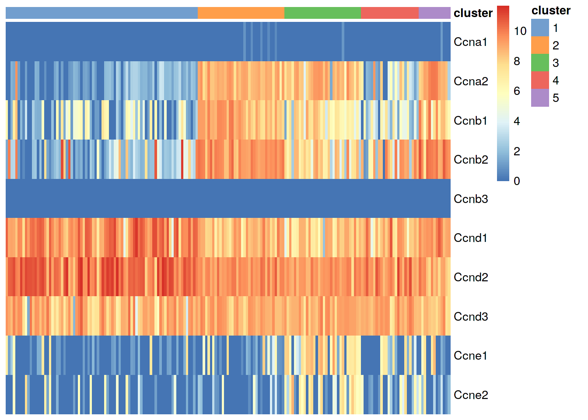
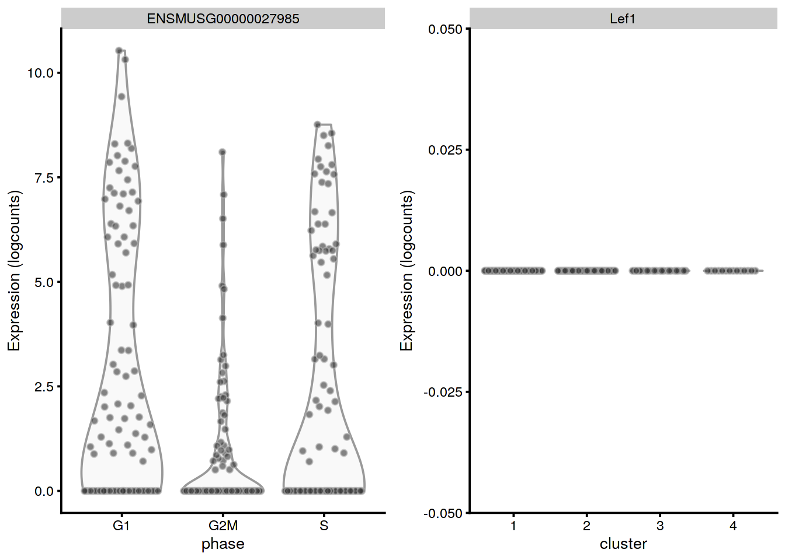
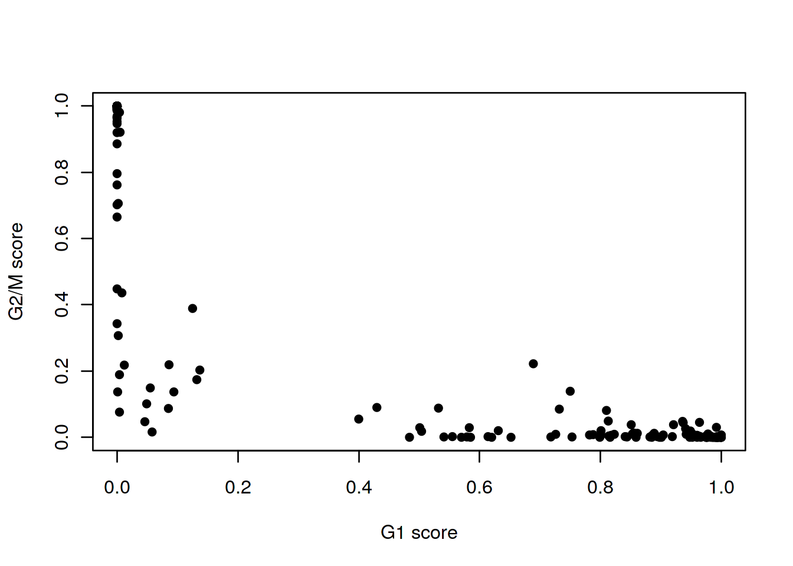

---
output:
  html_document
bibliography: ../ref.bib
---

# Cell cycle assignment

<script>
document.addEventListener("click", function (event) {
    if (event.target.classList.contains("aaron-collapse")) {
        event.target.classList.toggle("active");
        var content = event.target.nextElementSibling;
        if (content.style.display === "block") {
          content.style.display = "none";
        } else {
          content.style.display = "block";
        }
    }
})
</script>

<style>
.aaron-collapse {
  background-color: #eee;
  color: #444;
  cursor: pointer;
  padding: 18px;
  width: 100%;
  border: none;
  text-align: left;
  outline: none;
  font-size: 15px;
}

.aaron-content {
  padding: 0 18px;
  display: none;
  overflow: hidden;
  background-color: #f1f1f1;
}
</style>

## Motivation

On occasion, it can be desirable to determine cell cycle activity from scRNA-seq data.
In and of itself, the distribution of cells across phases of the cell cycle is not usually informative, but we can use this to determine if there are differences in proliferation between subpopulations or across treatment conditions.
Many of the key events in the cell cycle (e.g., passage through checkpoints) are post-translational and thus not directly visible in transcriptomic data; nonetheless, there are enough changes in expression that can be exploited to determine cell cycle phase.
We demonstrate using the 416B dataset, which is known to contain actively cycling cells after oncogene induction.

<button class="aaron-collapse">View history</button>
<div class="aaron-content">
   
```r
#--- loading ---#
library(scRNAseq)
sce.416b <- LunSpikeInData(which="416b") 
sce.416b$block <- factor(sce.416b$block)

#--- gene-annotation ---#
library(AnnotationHub)
ens.mm.v97 <- AnnotationHub()[["AH73905"]]
rowData(sce.416b)$ENSEMBL <- rownames(sce.416b)
rowData(sce.416b)$SYMBOL <- mapIds(ens.mm.v97, keys=rownames(sce.416b),
    keytype="GENEID", column="SYMBOL")
rowData(sce.416b)$SEQNAME <- mapIds(ens.mm.v97, keys=rownames(sce.416b),
    keytype="GENEID", column="SEQNAME")

library(scater)
rownames(sce.416b) <- uniquifyFeatureNames(rowData(sce.416b)$ENSEMBL, 
    rowData(sce.416b)$SYMBOL)

#--- quality-control ---#
mito <- which(rowData(sce.416b)$SEQNAME=="MT")
stats <- perCellQCMetrics(sce.416b, subsets=list(Mt=mito))
qc <- quickPerCellQC(stats, percent_subsets=c("subsets_Mt_percent",
    "altexps_ERCC_percent"), batch=sce.416b$block)
sce.416b <- sce.416b[,!qc$discard]

#--- normalization ---#
library(scran)
sce.416b <- computeSumFactors(sce.416b)
sce.416b <- logNormCounts(sce.416b)

#--- variance-modelling ---#
dec.416b <- modelGeneVarWithSpikes(sce.416b, "ERCC", block=sce.416b$block)
chosen.hvgs <- getTopHVGs(dec.416b, prop=0.1)

#--- batch-correction ---#
library(limma)
assay(sce.416b, "corrected") <- removeBatchEffect(logcounts(sce.416b), 
    design=model.matrix(~sce.416b$phenotype), batch=sce.416b$block)

#--- dimensionality-reduction ---#
sce.416b <- runPCA(sce.416b, ncomponents=10, subset_row=chosen.hvgs,
    exprs_values="corrected", BSPARAM=BiocSingular::ExactParam())

set.seed(1010)
sce.416b <- runTSNE(sce.416b, dimred="PCA", perplexity=10)

#--- clustering ---#
my.dist <- dist(reducedDim(sce.416b, "PCA"))
my.tree <- hclust(my.dist, method="ward.D2")

library(dynamicTreeCut)
my.clusters <- unname(cutreeDynamic(my.tree, distM=as.matrix(my.dist),
    minClusterSize=10, verbose=0))
colLabels(sce.416b) <- factor(my.clusters)
```

</div>


```r
sce.416b
```

```
## class: SingleCellExperiment 
## dim: 46604 185 
## metadata(0):
## assays(3): counts logcounts corrected
## rownames(46604): 4933401J01Rik Gm26206 ... CAAA01147332.1
##   CBFB-MYH11-mcherry
## rowData names(4): Length ENSEMBL SYMBOL SEQNAME
## colnames(185): SLX-9555.N701_S502.C89V9ANXX.s_1.r_1
##   SLX-9555.N701_S503.C89V9ANXX.s_1.r_1 ...
##   SLX-11312.N712_S507.H5H5YBBXX.s_8.r_1
##   SLX-11312.N712_S517.H5H5YBBXX.s_8.r_1
## colData names(11): Source Name cell line ... sizeFactor label
## reducedDimNames(2): PCA TSNE
## altExpNames(2): ERCC SIRV
```

## Using the cyclins

The cyclins control progression through the cell cycle and have well-characterized patterns of expression across cell cycle phases.
Cyclin D is expressed throughout but peaks at G1; cyclin E is expressed highest in the G1/S transition; cyclin A is expressed across S and G2; and cyclin B is expressed highest in late G2 and mitosis.
Inspection of the relative expression of cyclins across the population can often be sufficient to determine the relative cell cycle activity in each cluster (Figure \@ref(fig:heat-cyclin)).
For example, cluster 1 is likely to be in G1 while the other clusters are scattered across the later phases.


```r
cyclin.genes <- grep("^Ccn[abde][0-9]$", rowData(sce.416b)$SYMBOL)
cyclin.genes <- rownames(sce.416b)[cyclin.genes]
cyclin.genes
```

```
##  [1] "Ccnb3" "Ccna2" "Ccna1" "Ccne2" "Ccnd2" "Ccne1" "Ccnd1" "Ccnb2" "Ccnb1"
## [10] "Ccnd3"
```

```r
library(scater)
plotHeatmap(sce.416b, order_columns_by="label", 
    cluster_rows=FALSE, features=sort(cyclin.genes))
```

<div class="figure">

<p class="caption">(\#fig:heat-cyclin)Heatmap of the log-normalized expression values of the cyclin genes in the 416B dataset.</p>
</div>


The 416B dataset is somewhat unusual as each cluster maps cleanly onto a distinct phase of the cell cycle.
This separation is not typically seen in more heterogeneous datasets where the cell cycle is only a secondary factor of variation.
Fortunately, it is not strictly necessary to know the exact phase of each cell or cluster to answer most cycle-related questions.
For example, we can use standard DE methods (Chapter \@ref(marker-detection)) to look for upregulation of each cyclin, which would imply that a subpopulation contains more cells in the corresponding cell cycle phase.
The same logic applies to comparisons between treatment conditions, as described in Chapter \@ref(multi-sample-comparisons).


```r
library(scran)
markers <- findMarkers(sce.416b, subset.row=cyclin.genes, 
    test.type="wilcox", direction="up")

# We can infer that cluster 4 has more cells in G2/M than the other clusters,
# based on higher expression of the cyclin B's.
markers[[4]]
```

```
## DataFrame with 10 rows and 7 columns
##             Top     p.value         FDR summary.AUC     AUC.1     AUC.2
##       <integer>   <numeric>   <numeric>   <numeric> <numeric> <numeric>
## Ccna2         1 4.47082e-09 4.47082e-08    0.996337  0.996337  0.641822
## Ccnd1         1 2.27713e-04 5.69283e-04    0.822981  0.368132  0.822981
## Ccnb1         1 1.19027e-07 5.95137e-07    0.949634  0.949634  0.519669
## Ccnb2         2 3.87799e-07 1.29266e-06    0.934066  0.934066  0.781573
## Ccna1         4 2.96992e-02 5.93985e-02    0.535714  0.535714  0.495342
## Ccne2         5 6.56983e-02 1.09497e-01    0.641941  0.641941  0.447205
## Ccne1         6 5.85979e-01 8.37113e-01    0.564103  0.564103  0.366460
## Ccnd3         7 9.94578e-01 1.00000e+00    0.402930  0.402930  0.283644
## Ccnd2         8 9.99993e-01 1.00000e+00    0.306548  0.134615  0.327122
## Ccnb3        10 1.00000e+00 1.00000e+00    0.500000  0.500000  0.500000
##           AUC.3
##       <numeric>
## Ccna2  0.925595
## Ccnd1  0.776786
## Ccnb1  0.934524
## Ccnb2  0.898810
## Ccna1  0.535714
## Ccne2  0.455357
## Ccne1  0.473214
## Ccnd3  0.273810
## Ccnd2  0.306548
## Ccnb3  0.500000
```


Direct examination of cyclin expression is easily to understand, interpret and experimentally validate.
However, it is best suited for statements about relative cell cycle activity; for example, we would find it difficult to assign cell cycle phase in Figure \@ref(fig:heat-cyclin) without the presence of clusters spanning all phases to provide benchmarks for "high" and "low" expression of each cyclin.
We also assume that cyclin expression is not affected by biological processes other than the cell cycle, which may be a strong assumption in some cases, e.g., malignant cells.
This strategy is strongly dependent on having good sequencing coverage of the cyclins, which is less of an issue for the whole-of-transcriptome methods described below that use information from more genes.

## Using reference profiles

Cell cycle assignment can be considered a specialized case of cell annotation, which suggests that the strategies described in Chapter \@ref(cell-type-annotation) can be applied here.
For example, given a reference dataset containing mouse ESCs with known cell cycle phases [@buettner2015computational], we could use *[SingleR](https://bioconductor.org/packages/3.11/SingleR)* to determine the phase of each cell in a test dataset.


```r
library(scRNAseq)
sce.ref <- BuettnerESCData()
sce.ref
```

```
## class: SingleCellExperiment 
## dim: 38293 288 
## metadata(0):
## assays(1): counts
## rownames(38293): ENSMUSG00000000001 ENSMUSG00000000003 ...
##   ENSMUSG00000097934 ENSMUSG00000097935
## rowData names(3): EnsemblTranscriptID AssociatedGeneName GeneLength
## colnames(288): G1_cell1_count G1_cell2_count ... G2M_cell95_count
##   G2M_cell96_count
## colData names(1): phase
## reducedDimNames(0):
## altExpNames(1): ERCC
```

We use the reference dataset to identify phase-specific markers from genes with annotated roles in cell cycle.
The use of prior annotation aims to avoid detecting markers for other biological processes that happen to be correlated with the cell cycle in the reference dataset, which would reduce classification performance if those processes are absent or uncorrelated in the test dataset.


```r
# Find genes that are present in both datasets and are cell cycle-related.
library(org.Mm.eg.db)
cycle.anno <- select(org.Mm.eg.db, keytype="GOALL", keys="GO:0007049", 
    columns="ENSEMBL")[,"ENSEMBL"]
candidates <- Reduce(intersect, 
    list(rownames(sce.ref), rowData(sce.416b)$ENSEMBL, cycle.anno))
str(candidates)
```

```
##  chr [1:1606] "ENSMUSG00000000001" "ENSMUSG00000000028" ...
```

```r
# Identifying markers between cell cycle phases.
sce.ref <- logNormCounts(sce.ref)
phase.stats <- pairwiseWilcox(logcounts(sce.ref), sce.ref$phase, 
    direction="up", subset.row=candidates)
cycle.markers <- getTopMarkers(phase.stats[[1]], phase.stats[[2]])
```

We use the identified markers to assign labels to the 416B data with the `SingleR()` function.
Cluster 1 mostly consists of G1 cells while the other clusters have more cells in the other phases, which is broadly consistent with our conclusions from the cyclin-based analysis.
Unlike the cyclin-based analysis, this approach yields "absolute" assignments of cell cycle phase that do not need to be interpreted relative to other cells in the same dataset.


```r
# Switching row names back to Ensembl to match the reference.
test.data <- logcounts(sce.416b)
rownames(test.data) <- rowData(sce.416b)$ENSEMBL

library(SingleR)
assignments <- SingleR(test.data, ref=sce.ref,
    label=sce.ref$phase, genes=cycle.markers)
tab <- table(assignments$labels, colLabels(sce.416b))
tab
```

```
##      
##        1  2  3  4
##   G1  71  7 19  1
##   G2M  2 60  1 13
##   S    5  2  4  0
```


The key assumption here is that the cell cycle is orthogonal to cell type and other aspects of cell behavior.
This justifies the use of a reference involving cell types that are quite different from the cells in the test dataset, provided that the cell cycle transcriptional program is conserved across datasets [@bertoli2013control;@conboy2007cell].
However, it is not difficult to find routine violations of this assumption - for example, _Lef1_ is detected as one of the top markers to distinguish between G1 from G2/M in the reference but has no detectable expression in the 416B dataset (Figure \@ref(fig:dist-lef1)).


```r
gridExtra::grid.arrange(
    plotExpression(sce.ref, features="ENSMUSG00000027985", x="phase"),
    plotExpression(sce.416b, features="Lef1", x="label"),
    ncol=2)
```

<div class="figure">

<p class="caption">(\#fig:dist-lef1)Distribution of log-normalized expression values for _Lef1_ in the reference dataset (left) and in the 416B dataset (right).</p>
</div>


Thus, a healthy dose of skepticism is required when interpreting these assignments.
Our hope is that any systematic assignment error is consistent across clusters and conditions such that they cancel out in comparisons of phase frequencies, which is the more interesting analysis anyway. 
Indeed, while the availability of absolute phase calls may be more appealing, it may not make much practical difference to the conclusions if the frequencies are ultimately interpreted in a relative sense (e.g., using a chi-squared test). 


```r
# Test for differences in phase distributions between clusters 1 and 2.
chisq.test(tab[,1:2])
```

```
## 
## 	Pearson's Chi-squared test
## 
## data:  tab[, 1:2]
## X-squared = 108, df = 2, p-value <2e-16
```

## Using the `cyclone()` classifier

The prediction method described by @scialdone2015computational is another approach for classifying cells into cell cycle phases.
Using a reference dataset, we first compute the sign of the difference in expression between each pair of genes.
Pairs with changes in the sign across cell cycle phases are chosen as markers.
Cells in a test dataset can then be classified into the appropriate phase, based on whether the observed sign for each marker pair is consistent with one phase or another.
This approach is implemented in the `cyclone()` function from the *[scran](https://bioconductor.org/packages/3.11/scran)* package, which also contains pre-trained set of marker pairs for mouse and human data.


```r
set.seed(100)
library(scran)
mm.pairs <- readRDS(system.file("exdata", "mouse_cycle_markers.rds", 
    package="scran"))

# Using Ensembl IDs to match up with the annotation in 'mm.pairs'.
assignments <- cyclone(sce.416b, mm.pairs, gene.names=rowData(sce.416b)$ENSEMBL)
```

The phase assignment result for each cell in the 416B dataset is shown in Figure \@ref(fig:phaseplot416b).
For each cell, a higher score for a phase corresponds to a higher probability that the cell is in that phase.
We focus on the G1 and G2/M scores as these are the most informative for classification.


```r
plot(assignments$score$G1, assignments$score$G2M,
    xlab="G1 score", ylab="G2/M score", pch=16)
```

<div class="figure">

<p class="caption">(\#fig:phaseplot416b)Cell cycle phase scores from applying the pair-based classifier on the 416B dataset. Each point represents a cell, plotted according to its scores for G1 and G2/M phases.</p>
</div>

Cells are classified as being in G1 phase if the G1 score is above 0.5 and greater than the G2/M score;
    in G2/M phase if the G2/M score is above 0.5 and greater than the G1 score;
    and in S phase if neither score is above 0.5.
We see that the results are quite similar to those from `SingleR()`, which is reassuring.


```r
table(assignments$phases, colLabels(sce.416b))
```

```
##      
##        1  2  3  4
##   G1  74  8 20  0
##   G2M  1 48  0 13
##   S    3 13  4  1
```


The same considerations and caveats described for the *[SingleR](https://bioconductor.org/packages/3.11/SingleR)*-based approach are also applicable here.
From a practical perspective, `cyclone()` takes much longer but does not require an explicit reference as the marker pairs are already computed.

## Regressing out cell cycle phase

For some time, it was popular to regress out the cell cycle phase prior to downstream analyses.
The aim was to remove uninteresting variation due to cell cycle, thus improving resolution of other biological processes of interest.
We could implement this by performing cell cycle phase assignment as described above, treating each phase as a separate batch and applying any of the batch correction strategies described in Chapter \@ref(data-integration).
The most common approach is to use a linear model to simply regress out the phase effect, e.g., via `regressBatches()`.


```r
library(batchelor)
sce.nocycle <- regressBatches(sce.416b, batch=assignments$phases)

# Similar use in related functions that support blocking:
dec.nocycle <- modelGeneVarWithSpikes(sce.416b, "ERCC", 
    block=assignments$phases)
marker.nocycle <- findMarkers(sce.416b, block=assignments$phases)
```

That said, we do not consider adjusting for cell cycle to be a necessary step in routine scRNA-seq analyses.
In most applications, the cell cycle is a minor factor of variation, secondary to differences between cell types.
Any attempt at removal would also need to assume that the cell cycle effect is orthogonal to other biological processes.
For example, regression would potentially remove interesting signal if cell cycle activity varied across clusters or conditions, with a prime example being the increased proliferation of activated T cells [@richard2018tcell]. 
We suggest only performing cell cycle adjustment on an as-needed basis in populations with clear cell cycle effects.

Alternatively, users may consider just excluding cell cycle-related genes from downstream analysis.
This should remove most of the cell cycle effect without making strong assumptions about orthogonality.
Of course, this will not remove the effect of the cell cycle in genes with no annotated role in the cell cycle, but in such cases, there is ambiguity over whether that effect is truly due to the cell cycle or from some other (interesting) biological process that happens to be correlated with the cell cycle.


```r
library(org.Mm.eg.db)
cc.genes <- select(org.Mm.eg.db, keys="GO:0007049", keytype="GOALL", column="ENSEMBL")
sce.416b.uncycle <- sce.416b[!rowData(sce.416b)$ENSEMBL %in% cc.genes$ENSEMBL,]

# Proceed with the rest of the analysis. Note that in this case, oncogene
# induction is quite strongly associated with the cell cycle but is considered
# to be a separate effect, so removal of the cell cycle-related genes does not
# change the clustering much.
```

## Session Info {-}

<button class="aaron-collapse">View session info</button>
<div class="aaron-content">
```
R Under development (unstable) (2020-03-23 r78035)
Platform: x86_64-pc-linux-gnu (64-bit)
Running under: Ubuntu 18.04.4 LTS

Matrix products: default
BLAS:   /home/luna/Software/R/trunk/lib/libRblas.so
LAPACK: /home/luna/Software/R/trunk/lib/libRlapack.so

locale:
 [1] LC_CTYPE=en_US.UTF-8       LC_NUMERIC=C              
 [3] LC_TIME=en_US.UTF-8        LC_COLLATE=en_US.UTF-8    
 [5] LC_MONETARY=en_US.UTF-8    LC_MESSAGES=en_US.UTF-8   
 [7] LC_PAPER=en_US.UTF-8       LC_NAME=C                 
 [9] LC_ADDRESS=C               LC_TELEPHONE=C            
[11] LC_MEASUREMENT=en_US.UTF-8 LC_IDENTIFICATION=C       

attached base packages:
[1] parallel  stats4    stats     graphics  grDevices utils     datasets 
[8] methods   base     

other attached packages:
 [1] batchelor_1.3.14            fossil_0.4.0               
 [3] shapefiles_0.7              foreign_0.8-77             
 [5] maps_3.3.0                  sp_1.4-1                   
 [7] SingleR_1.1.14              org.Mm.eg.db_3.10.0        
 [9] ensembldb_2.11.3            AnnotationFilter_1.11.0    
[11] GenomicFeatures_1.39.7      AnnotationDbi_1.49.1       
[13] scRNAseq_2.1.7              scran_1.15.26              
[15] scater_1.15.29              ggplot2_3.3.0              
[17] SingleCellExperiment_1.9.3  SummarizedExperiment_1.17.5
[19] DelayedArray_0.13.8         matrixStats_0.56.0         
[21] Biobase_2.47.3              GenomicRanges_1.39.3       
[23] GenomeInfoDb_1.23.16        IRanges_2.21.8             
[25] S4Vectors_0.25.14           BiocGenerics_0.33.3        
[27] OSCAUtils_0.0.2             BiocStyle_2.15.6           

loaded via a namespace (and not attached):
  [1] AnnotationHub_2.19.8          BiocFileCache_1.11.4         
  [3] igraph_1.2.5                  lazyeval_0.2.2               
  [5] BiocParallel_1.21.2           digest_0.6.25                
  [7] htmltools_0.4.0               viridis_0.5.1                
  [9] fansi_0.4.1                   magrittr_1.5                 
 [11] memoise_1.1.0                 limma_3.43.5                 
 [13] Biostrings_2.55.7             askpass_1.1                  
 [15] prettyunits_1.1.1             colorspace_1.4-1             
 [17] blob_1.2.1                    rappdirs_0.3.1               
 [19] xfun_0.12                     dplyr_0.8.5                  
 [21] callr_3.4.3                   crayon_1.3.4                 
 [23] RCurl_1.98-1.1                glue_1.3.2                   
 [25] gtable_0.3.0                  zlibbioc_1.33.1              
 [27] XVector_0.27.2                BiocSingular_1.3.2           
 [29] scales_1.1.0                  pheatmap_1.0.12              
 [31] DBI_1.1.0                     edgeR_3.29.1                 
 [33] Rcpp_1.0.4                    viridisLite_0.3.0            
 [35] xtable_1.8-4                  progress_1.2.2               
 [37] dqrng_0.2.1                   bit_1.1-15.2                 
 [39] rsvd_1.0.3                    httr_1.4.1                   
 [41] RColorBrewer_1.1-2            ellipsis_0.3.0               
 [43] pkgconfig_2.0.3               XML_3.99-0.3                 
 [45] farver_2.0.3                  dbplyr_1.4.2                 
 [47] locfit_1.5-9.4                tidyselect_1.0.0             
 [49] labeling_0.3                  rlang_0.4.5                  
 [51] later_1.0.0                   munsell_0.5.0                
 [53] BiocVersion_3.11.1            tools_4.0.0                  
 [55] cli_2.0.2                     RSQLite_2.2.0                
 [57] ExperimentHub_1.13.5          evaluate_0.14                
 [59] stringr_1.4.0                 fastmap_1.0.1                
 [61] yaml_2.2.1                    processx_3.4.2               
 [63] knitr_1.28                    bit64_0.9-7                  
 [65] purrr_0.3.3                   mime_0.9                     
 [67] biomaRt_2.43.4                compiler_4.0.0               
 [69] beeswarm_0.2.3                curl_4.3                     
 [71] interactiveDisplayBase_1.25.0 tibble_3.0.0                 
 [73] statmod_1.4.34                stringi_1.4.6                
 [75] highr_0.8                     ps_1.3.2                     
 [77] lattice_0.20-40               ProtGenerics_1.19.3          
 [79] Matrix_1.2-18                 vctrs_0.2.4                  
 [81] pillar_1.4.3                  lifecycle_0.2.0              
 [83] BiocManager_1.30.10           BiocNeighbors_1.5.2          
 [85] cowplot_1.0.0                 bitops_1.0-6                 
 [87] irlba_2.3.3                   httpuv_1.5.2                 
 [89] rtracklayer_1.47.0            R6_2.4.1                     
 [91] bookdown_0.18                 promises_1.1.0               
 [93] gridExtra_2.3                 vipor_0.4.5                  
 [95] codetools_0.2-16              assertthat_0.2.1             
 [97] openssl_1.4.1                 withr_2.1.2                  
 [99] GenomicAlignments_1.23.2      Rsamtools_2.3.7              
[101] GenomeInfoDbData_1.2.2        hms_0.5.3                    
[103] grid_4.0.0                    rmarkdown_2.1                
[105] DelayedMatrixStats_1.9.1      shiny_1.4.0.2                
[107] ggbeeswarm_0.6.0             
```
</div>
