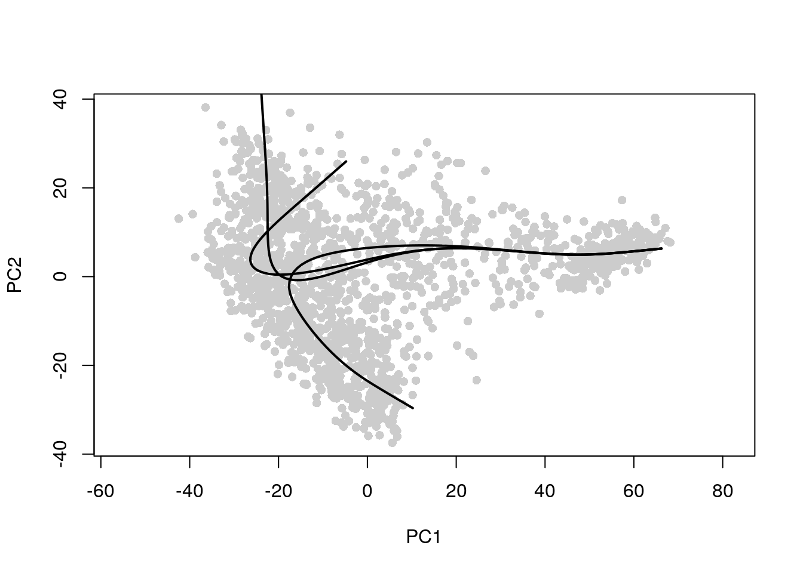

---
output:
  html_document
bibliography: ../ref.bib
---

# Trajectory Analysis

<script>
document.addEventListener("click", function (event) {
    if (event.target.classList.contains("aaron-collapse")) {
        event.target.classList.toggle("active");
        var content = event.target.nextElementSibling;
        if (content.style.display === "block") {
          content.style.display = "none";
        } else {
          content.style.display = "block";
        }
    }
})
</script>

<style>
.aaron-collapse {
  background-color: #eee;
  color: #444;
  cursor: pointer;
  padding: 18px;
  width: 100%;
  border: none;
  text-align: left;
  outline: none;
  font-size: 15px;
}

.aaron-content {
  padding: 0 18px;
  display: none;
  overflow: hidden;
  background-color: #f1f1f1;
}
</style>

<div class="figure">

<p class="caption">(\#fig:dio-fail)Waiting for Stephanie to finish her PR.</p>
</div>

## Overview

Many biological processes manifest as a continuum of dynamic changes in the cellular state.
The most obvious example is that of differentiation into increasingly specialized cell subtypes, but we might also consider phenomena like the cell cycle or immune cell activation that are accompanied by gradual changes in the cell's transcriptome.
We characterize these processes from single-cell expression data by identifying a "trajectory", i.e., a path through the high-dimensional expression space that traverses the various cellular states associated with a continuous process like differentiation.
In the simplest case, a trajectory will be a simple path from one point to another,
but we can also observe more complex trajectories involve branching to multiple endpoints.

A related concept is that of "pseudotime", defined as the positioning of cells along the trajectory that quantifies the relative activity of the underlying biological process.
For example, the pseudotime for a differentiation trajectory might represent the degree of differentiation from a pluripotent cell to a terminal state.
This metric allows us to tackle questions related to the global population structure in a more quantitative manner.
(It is worth noting that pseudotime is rather poorly named as it may or may not have much to do with actual time.
For example, one can imagine a continuum of stress states with cells moving in either direction over time, 
but the pseudotime will only increase in one direction.)

In this section, we will demonstrate several different approaches to trajectory analysis using the haematopoietic stem cell (HSC) dataset from @nestorowa2016singlecell.

<button class="aaron-collapse">View history</button>
<div class="aaron-content">
   
```r
#--- data-loading ---#
library(scRNAseq)
sce.nest <- NestorowaHSCData()

#--- gene-annotation ---#
library(AnnotationHub)
ens.mm.v97 <- AnnotationHub()[["AH73905"]]
anno <- select(ens.mm.v97, keys=rownames(sce.nest), 
    keytype="GENEID", columns=c("SYMBOL", "SEQNAME"))
rowData(sce.nest) <- anno[match(rownames(sce.nest), anno$GENEID),]

#--- quality-control-grun ---#
library(scater)
stats <- perCellQCMetrics(sce.nest)
qc <- quickPerCellQC(stats, percent_subsets="altexps_ERCC_percent")
sce.nest <- sce.nest[,!qc$discard]

#--- normalization ---#
library(scran)
set.seed(101000110)
clusters <- quickCluster(sce.nest)
sce.nest <- computeSumFactors(sce.nest, clusters=clusters)
sce.nest <- logNormCounts(sce.nest)

#--- variance-modelling ---#
set.seed(00010101)
dec.nest <- modelGeneVarWithSpikes(sce.nest, "ERCC")
top.nest <- getTopHVGs(dec.nest, prop=0.1)

#--- dimensionality-reduction ---#
set.seed(101010011)
sce.nest <- denoisePCA(sce.nest, technical=dec.nest, subset.row=top.nest)
sce.nest <- runTSNE(sce.nest, dimred="PCA")

#--- clustering ---#
snn.gr <- buildSNNGraph(sce.nest, use.dimred="PCA")
sce.nest$cluster <- factor(igraph::cluster_walktrap(snn.gr)$membership)
```

</div>


```r
sce.nest
```

```
## class: SingleCellExperiment 
## dim: 46078 1656 
## metadata(0):
## assays(2): counts logcounts
## rownames(46078): ENSMUSG00000000001 ENSMUSG00000000003 ...
##   ENSMUSG00000107391 ENSMUSG00000107392
## rowData names(3): GENEID SYMBOL SEQNAME
## colnames(1656): HSPC_025 HSPC_031 ... Prog_852 Prog_810
## colData names(4): cell.type FACS sizeFactor cluster
## reducedDimNames(3): diffusion PCA TSNE
## altExpNames(1): ERCC
```

## Obtaining pseudo-times

### Cluster-based minimum spanning tree

The *[TSCAN](https://bioconductor.org/packages/3.11/TSCAN)* package employs a simple yet effective approach to trajectory reconstruction.
It clusters cells to summarize the data into a smaller set of discrete units, computes cluster centroids by averaging the cell coordinates and then forms the minimum spanning tree (MST) across centroids.
The MST is simply an undirected acyclic graph that passes through each centroid exactly once and can be thought of as the most parsimonious structure that captures the transitions between clusters.
We demonstrate below on the Nestorowa dataset (Figure \@ref(fig:tscan-nest-mst)), computing the centroids in the low-dimensional space to take advantage of data compaction and denoising (Chapter \@ref(reduced-dimensions)).


```r
# TODO: get the TSCAN authors to allow me to plug in existing
# dimensionality reduction and clustering results, rather than
# forcing users to go along with their defaults.
library(scater)
by.cluster <- aggregateAcrossCells(sce.nest, ids=sce.nest$cluster)
centroids <- reducedDim(by.cluster, "PCA")

dmat <- dist(centroids)
dmat <- as.matrix(dmat)
g <- igraph::graph.adjacency(dmat, mode = "undirected", weighted = TRUE)
mst <- igraph::minimum.spanning.tree(g)

set.seed(1000)
plot(mst)
```

<div class="figure">

<p class="caption">(\#fig:tscan-nest-mst)Minimum spanning tree constructed using a _TSCAN_-like algorithm in the Nestorowa HSC dataset. Each node represents a cluster and is labelled according to the cluster number.</p>
</div>

For reference, we can draw the same lines between the centroids in a $t$-SNE plot (Figure \@ref(fig:tscan-nest-tsne)).
It is then straightforward to identify interesting clusters such as those at bifurcations or endpoints.
Keep in mind that the MST is generated from distances in the PC space and is merely being visualized in the $t$-SNE space;
its interpretation is not compromised by the distortions required to obtain a two-dimensional visualization.


```r
# TODO: stuff this into a function somewhere.
pairs <- Matrix::which(mst[] > 0, arr.ind=TRUE)
coords <- reducedDim(by.cluster, "TSNE")
group <- rep(seq_len(nrow(pairs)), 2)
stuff <- data.frame(rbind(coords[pairs[,1],], coords[pairs[,2],]), group)

plotTSNE(sce.nest, colour_by="cluster") + 
    geom_line(data=stuff, mapping=aes(x=X1, y=X2, group=group))
```

<div class="figure">

<p class="caption">(\#fig:tscan-nest-tsne)$t$-SNE plot of the Nestorowa HSC dataset, where each point is a cell and is colored according to its cluster assignment. The MST obtained using a _TSCAN_-like algorithm is overlaid on top.</p>
</div>

We obtain a pseudotime ordering by projecting the cells onto the MST.
In other words, we move each cell onto the edge of the MST to which it is closest;
the pseudotime is then calculated as the distance along the MST from this new position to a "root node".
For our purposes, we will arbitrarily pick one of the endpoint nodes as the root,
though a more careful choice based on the biological annotation of each node may yield more relevant orderings
(e.g., picking a node corresponding to a more pluripotent state).


```r
# Figure out how to plug into TSCAN's ordering system.
```

*[TSCAN](https://bioconductor.org/packages/3.11/TSCAN)* gains several advantages from using clusters to form the MST.
The most obvious is that of computational speed as calculations are performed over clusters rather than cells.
The relative coarseness of clusters protects against the per-cell noise that would otherwise reduce the stability of the MST.
The interpretation of the MST is also relatively straightforward as it uses the same clusters as the rest of the analysis,
allowing us to recycle previous knowledge about the biological annotations assigned to each cluster.

However, the reliance on clustering is also a double-edged sword.
If the clusters are not sufficiently granular, it is possible for *[TSCAN](https://bioconductor.org/packages/3.11/TSCAN)* to overlook a trajectory if the entirety of the trajectory occurs in a single cluster.
In addition, the MST does poorly at handling more complex events like cycles (e.g., the cell cycle, obviously) or bubbles (e.g., multiple differentation paths to the same terminal cell type).
Whether or not this is a problem depends on the complexity of the global structure of the population of interest. 

### Principal curves

To identify a trajectory, one might imagine simply "fitting" a one-dimensional curve so that it passes through the cloud of cells in the high-dimensional expression space.
This is the idea behind principal curves [@hastie1989principal], effectively a non-linear generalization of PCA where the axes of most variation are allowed to bend.
We use the *[slingshot](https://bioconductor.org/packages/3.11/slingshot)* package [@street2018slingshot] to fit a principal curve to the PC coordinates,
which yields a pseudotime ordering of cells based on their relative positions when projected onto the curve.


```r
library(slingshot)
sce.sling <- slingshot(sce.nest, reducedDim='PCA')
head(sce.sling$slingPseudotime_1)
```

```
## [1] 89.44 76.34 87.88 76.93 82.41 72.10
```

Here, we fitted the principal curve to the PC space for the same reasons as described above.
We can then visualize the literal path taken by the fitted curve in that space (Figure \@ref(fig:traj-princurve-pca-nest)). 


```r
# Setting up the colors.
library(RColorBrewer)
colors <- colorRampPalette(brewer.pal(11,'Spectral')[-6])(100)
plotcol <- colors[cut(sce.sling$slingPseudotime_1, breaks=100)]

# Creating a PCA plot.
plot(reducedDim(sce.sling, "PCA"), col = plotcol, pch=16, asp = 1)
lines(SlingshotDataSet(sce.sling), lwd=2, col='black')
```

<div class="figure">

<p class="caption">(\#fig:traj-princurve-pca-nest)Plot of the first 2 PCs in the Nestorowa HSC dataset, where each point is a cell and is colored by the _slingshot_ pseudotime ordering. The path taken by the fitted principal curve is shown in black.</p>
</div>

For other dimensionality reduction results, we color by the pseudotime ordering to identify the direction of the trajectory (Figure \@ref(traj-princurve-umap-nest)).
This is effectively a continuous generalization of the coloring by cluster assignment observed in other chapters.


```r
library(scater)
sce.sling <- runUMAP(sce.sling, dimred="PCA")

# TODO: make ggcells robust to random crap in the colData().
# Also need to add a function to auto-generate a path.
sce.sling$cell.type <- sce.sling$FACS <- NULL

library(viridis)
gg <- ggcells(sce.sling, mapping=aes(x=UMAP.1, 
        y=UMAP.2, col=slingPseudotime_1)) +
     geom_point() + scale_color_viridis()
```

The previous `slingshot()` call assumed that all cells in the dataset were part of a single one-dimensional trajectory,
which fails to consider more complex events like bifurcations.
To accommodate this, we use our previously computed cluster assignments to build a rough sketch for the global structure in the form of a MST across the cluster centroids.
Each path through the MST from a designated root node is treated as a lineage;
principal curves are then simultaneously fitted to all lineages, with some averaging across curves to encourage consistency in regions that are common to multiple lineages.
This allows `slingshot()` to capture branching events based on divergence in the principal curves (Figure \@ref(fig:traj-princurve-clustered-nest)).


```r
sce.sling2 <- slingshot(sce.nest, cluster=sce.nest$cluster, reducedDim='PCA')

plot(reducedDim(sce.sling2, "PCA"), col="grey80", pch=16, asp = 1)
lines(SlingshotDataSet(sce.sling2), lwd=2, col='black')
```

<div class="figure">

<p class="caption">(\#fig:traj-princurve-clustered-nest)Plot of the first 2 PCs in the Nestorowa HSC dataset, where the paths taken by the fitted principal curves are shown in black.</p>
</div>

When operating in this mode, `slingshot()` produces one pseudotime ordering for each principal curve.
Cells not assigned to a particular curve will be assigned `NA` values for that curve's ordering.
It is straightforward to determine whether a particular cell is shared across multiple curves or is unique to a subset of curves (i.e., occurs after branching).


```r
curve.data <- colData(sce.sling2)
curve.data <- curve.data[,grepl("slingPseudotime", colnames(curve.data))]

# Converting to integer codes: 1 for present, 0 for absent.
is.present <- lapply(curve.data, function(x) as.integer(!is.na(x)))
assignments <- do.call(paste0, is.present)
table(assignments)
```

```
## assignments
## 001 010 011 100 101 110 111 
##  39 222  12 428   2   1 952
```

For larger datasets, we can speed up the algorithm by approximating each principal curve with a fixed number of points.
By default, `slingshot()` uses one point per cell to define the curve, which is unnecessarily precise when the number of cells is large.
Indeed, the approximated curves in Figure \@ref(fig:traj-princurve-clustered-nest-approx) are quite similar to those in Figure \@ref(fig:traj-princurve-clustered-nest).


```r
sce.sling3 <- slingshot(sce.nest, cluster=sce.nest$cluster, 
    reducedDim='PCA', approx_points=100)

plot(reducedDim(sce.sling3, "PCA"), col="grey80", pch=16, asp = 1)
lines(SlingshotDataSet(sce.sling3), lwd=2, col='black')
```

<div class="figure">

<p class="caption">(\#fig:traj-princurve-clustered-nest-approx)Plot of the first 2 PCs in the Nestorowa HSC dataset, where the paths taken by the fitted principal curves are shown in black.</p>
</div>

### Whatever monocle does nowadays

## Characterizing trajectories

### Changes along a trajectory

### Changes between lineages

## Finding the root

### Overview

### Entropy-based methods

### RNA velocity

## Session information {-}

<button class="aaron-collapse">View session info</button>
<div class="aaron-content">
```
R Under development (unstable) (2020-03-23 r78035)
Platform: x86_64-pc-linux-gnu (64-bit)
Running under: Ubuntu 18.04.4 LTS

Matrix products: default
BLAS:   /home/luna/Software/R/trunk/lib/libRblas.so
LAPACK: /home/luna/Software/R/trunk/lib/libRlapack.so

locale:
 [1] LC_CTYPE=en_US.UTF-8       LC_NUMERIC=C              
 [3] LC_TIME=en_US.UTF-8        LC_COLLATE=en_US.UTF-8    
 [5] LC_MONETARY=en_US.UTF-8    LC_MESSAGES=en_US.UTF-8   
 [7] LC_PAPER=en_US.UTF-8       LC_NAME=C                 
 [9] LC_ADDRESS=C               LC_TELEPHONE=C            
[11] LC_MEASUREMENT=en_US.UTF-8 LC_IDENTIFICATION=C       

attached base packages:
[1] parallel  stats4    stats     graphics  grDevices utils     datasets 
[8] methods   base     

other attached packages:
 [1] viridis_0.5.1               viridisLite_0.3.0          
 [3] RColorBrewer_1.1-2          slingshot_1.5.1            
 [5] princurve_2.1.4             scater_1.15.28             
 [7] ggplot2_3.3.0               SingleCellExperiment_1.9.2 
 [9] SummarizedExperiment_1.17.3 DelayedArray_0.13.7        
[11] BiocParallel_1.21.2         matrixStats_0.56.0         
[13] Biobase_2.47.3              GenomicRanges_1.39.2       
[15] GenomeInfoDb_1.23.13        IRanges_2.21.5             
[17] S4Vectors_0.25.13           BiocGenerics_0.33.2        
[19] BiocStyle_2.15.6            OSCAUtils_0.0.2            

loaded via a namespace (and not attached):
 [1] BiocSingular_1.3.2       DelayedMatrixStats_1.9.0 assertthat_0.2.1        
 [4] BiocManager_1.30.10      highr_0.8                GenomeInfoDbData_1.2.2  
 [7] vipor_0.4.5              yaml_2.2.1               pillar_1.4.3            
[10] lattice_0.20-40          glue_1.3.2               digest_0.6.25           
[13] XVector_0.27.1           colorspace_1.4-1         cowplot_1.0.0           
[16] htmltools_0.4.0          Matrix_1.2-18            pkgconfig_2.0.3         
[19] bookdown_0.18            zlibbioc_1.33.1          purrr_0.3.3             
[22] scales_1.1.0             processx_3.4.2           RSpectra_0.16-0         
[25] tibble_2.1.3             farver_2.0.3             withr_2.1.2             
[28] magrittr_1.5             crayon_1.3.4             evaluate_0.14           
[31] ps_1.3.2                 nlme_3.1-145             FNN_1.1.3               
[34] beeswarm_0.2.3           tools_4.0.0              lifecycle_0.2.0         
[37] stringr_1.4.0            munsell_0.5.0            irlba_2.3.3             
[40] callr_3.4.2              compiler_4.0.0           rsvd_1.0.3              
[43] rlang_0.4.5              grid_4.0.0               RCurl_1.98-1.1          
[46] BiocNeighbors_1.5.2      igraph_1.2.5             bitops_1.0-6            
[49] labeling_0.3             rmarkdown_2.1            gtable_0.3.0            
[52] R6_2.4.1                 gridExtra_2.3            knitr_1.28              
[55] dplyr_0.8.5              uwot_0.1.8               ape_5.3                 
[58] stringi_1.4.6            ggbeeswarm_0.6.0         Rcpp_1.0.4              
[61] tidyselect_1.0.0         xfun_0.12               
```
</div>
