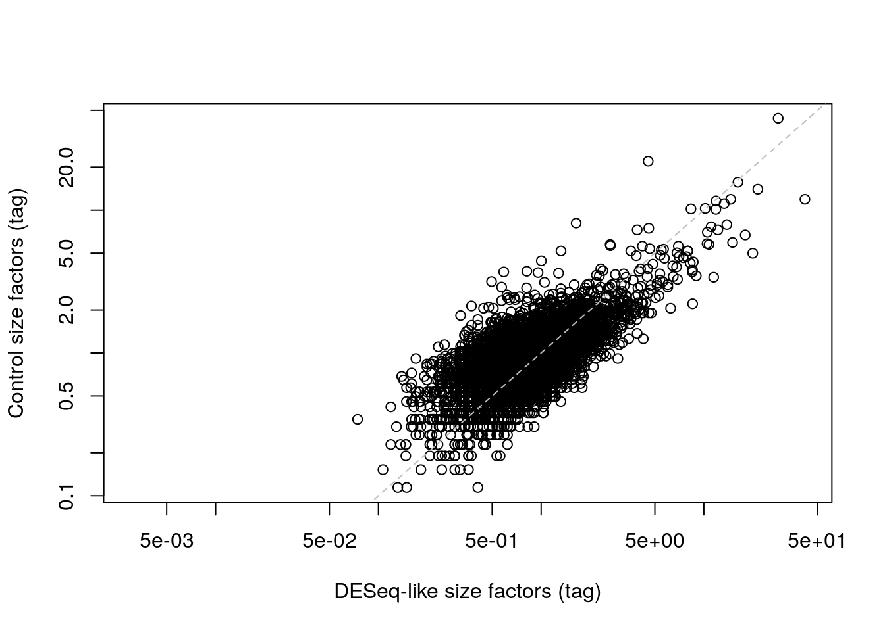
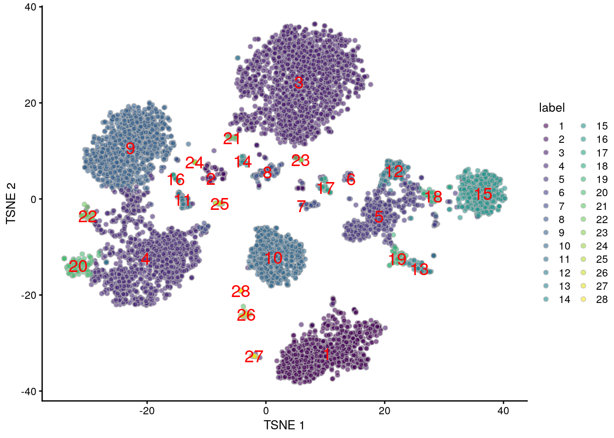
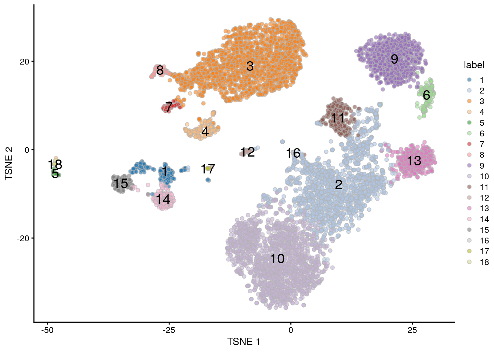

---
output:
  html_document
bibliography: ../ref.bib
---

# Integrating with protein abundance

<script>
document.addEventListener("click", function (event) {
    if (event.target.classList.contains("aaron-collapse")) {
        event.target.classList.toggle("active");
        var content = event.target.nextElementSibling;
        if (content.style.display === "block") {
          content.style.display = "none";
        } else {
          content.style.display = "block";
        }
    }
})
</script>

<style>
.aaron-collapse {
  background-color: #eee;
  color: #444;
  cursor: pointer;
  padding: 18px;
  width: 100%;
  border: none;
  text-align: left;
  outline: none;
  font-size: 15px;
}

.aaron-content {
  padding: 0 18px;
  display: none;
  overflow: hidden;
  background-color: #f1f1f1;
}
</style>

## Motivation

Cellular indexing of transcriptomes and epitopes by sequencing (CITE-seq) is a technique that quantifies both gene expression and the abundance of selected surface proteins in each cell simultaneously [@stoeckius2017simultaneous].
In this approach, cells are first labelled with antibodies that have been conjugated to synthetic RNA tags.
A cell with a higher abundance of a target protein will be bound by more antibodies, causing more molecules of the corresponding antibody-derived tag (ADT) to be attached to that cell.
Cells are then separated into their own reaction chambers using droplet-based microfluidics [@zheng2017massively].
Both the ADTs and endogenous transcripts are reverse-transcribed and captured into a cDNA library; the abundance of each protein or expression of each gene is subsequently quantified by sequencing of each set of features.
This provides a powerful tool for interrogating aspects of the proteome (such as post-translational modifications) and other cellular features that would normally be invisible to transcriptomic studies.

How should the ADT data be incorporated into the analysis?
While we have counts for both ADTs and transcripts, there are fundamental differences in nature of the data that make it difficult to treat the former as additional features in the latter.
Most experiments involve only a small number of antibodies (<20) that are chosen by the researcher because they are of _a priori_ interest, in contrast to gene expression data that captures the entire transcriptome regardless of the study.
The coverage of the ADTs is also much deeper as they are sequenced separately from the transcripts, allowing the sequencing resources to be concentrated into a smaller number of features.
And, of course, the use of antibodies against protein targets involves consideration of separate biases compared to those observed for transcripts.

In this chapter, we will describe some strategies for integrated analysis of ADT and transcript data in CITE-seq experiments.
We will demonstrate using a PBMC dataset from 10X Genomics that contains quantified abundances for a number of interesting surface proteins.


```r
# Caching it locally with BiocFileCache to avoid repeating the download.
library(BiocFileCache)
bfc <- BiocFileCache(ask=FALSE)
stuff <- bfcrpath(bfc, file.path("http://cf.10xgenomics.com",
    "samples/cell-exp/3.0.0/pbmc_10k_protein_v3",
    "pbmc_10k_protein_v3_filtered_feature_bc_matrix.tar.gz"))
untar(stuff, exdir=tempdir())

# Loading it in as a SingleCellExperiment object.
library(DropletUtils)
sce <- read10xCounts(file.path(tempdir(), "filtered_feature_bc_matrix"))
sce
```

```
## class: SingleCellExperiment 
## dim: 33555 7865 
## metadata(1): Samples
## assays(1): counts
## rownames(33555): ENSG00000243485 ENSG00000237613 ... IgG1 IgG2b
## rowData names(3): ID Symbol Type
## colnames: NULL
## colData names(2): Sample Barcode
## reducedDimNames(0):
## altExpNames(0):
```

## Preprocessing 

### Setting up the data

The `SingleCellExperiment` class provides the concept of an "alternative Experiment" to store data for different sets of features but the same cells.
This involves storing another `SummarizedExperiment` (or an instance of a subclass) _inside_ our `SingleCellExperiment` where the rows (features) can differ but the columns (cells) are the same.
In previous chapters, we were using the alternative Experiments to store spike-in data, but here we will use the concept to split off the ADT data.
This isolates the two sets of features to ensure that analyses on one set do not inadvertently use data from the other set, and vice versa.


```r
sce <- splitAltExps(sce, rowData(sce)$Type)
altExpNames(sce)
```

```
## [1] "Antibody Capture"
```

```r
altExp(sce) # Can be used like any other SingleCellExperiment. 
```

```
## class: SingleCellExperiment 
## dim: 17 7865 
## metadata(1): Samples
## assays(1): counts
## rownames(17): CD3 CD4 ... IgG1 IgG2b
## rowData names(3): ID Symbol Type
## colnames: NULL
## colData names(0):
## reducedDimNames(0):
## altExpNames(0):
```

At this point, it is also helpful to coerce the sparse matrix for ADTs into a dense matrix.
The ADT counts are usually not sparse so storage as a sparse matrix provides no advantage; in fact, it actually increases memory usage and computational time as the indices of non-zero entries must be unnecessarily stored and processed.
From a practical perspective, this avoids unnecessary incompatibilities with downstream applications that do not accept sparse inputs.


```r
counts(altExp(sce)) <- as.matrix(counts(altExp(sce)))
counts(altExp(sce))[,1:10] # sneak peek
```

```
##        [,1] [,2] [,3] [,4] [,5] [,6] [,7] [,8] [,9] [,10]
## CD3      18   30   18   18    5   21   34   48 4522  2910
## CD4     138  119  207   11   14 1014  324 1127 3479  2900
## CD8a     13   19   10   17   14   29   27   43   38    28
## CD14    491  472 1289   20   19 2428 1958 2189   55    41
## CD15     61  102  128  124  156  204  607  128  111   130
## CD16     17  155   72 1227 1873  148  676   75   44    37
## CD56     17  248   26  491  458   29   29   29   30    15
## CD19      3    3    8    5    4    7   15    4    6     6
## CD25      9    5   15   15   16   52   85   17   13    18
## CD45RA  110  125 5268 4743 4108  227  175  523 4044  1081
## CD45RO   74  156   28   28   21  492  517  316   26    43
## PD-1      9    9   20   25   28   16   26   16   28    16
## TIGIT     4    9   11   59   76   11   12   12    9     8
## CD127     7    8   12   16   17   15   11   10  231   179
## IgG2a     5    4   12   12    7    9    6    3   19    14
## IgG1      2    8   19   16   14   10   12    7   16    10
## IgG2b     3    3    6    4    9    8   50    2    8     2
```

### Quality control

For most part, our quality control for this dataset still depends on the endogenous transcripts to remove empty droplets and low-quality cells.
Any failure in cDNA capture for a particular cell will affect the coverage of both transcripts and ADTs, and changes in mitochondrial RNA content are only reflected in the transcriptomic data; as a result, the ADTs provide little additional information for QC.
For this dataset, the count matrix has already been filtered in _CellRanger_ to remove empty droplets so we only filter on the mitochondrial proportions to remove putative low-quality cells.


```r
library(scater)
mito <- grep("^MT-", rowData(sce)$Symbol)
df <- perCellQCMetrics(sce, subsets=list(Mito=mito))
mito.discard <- isOutlier(df$subsets_Mito_percent, type="higher")
summary(mito.discard)
```

```
##    Mode   FALSE    TRUE 
## logical    7569     296
```

If we want to combine transcript and ADT data, it is prudent to ensure that we only retain cells that actually have ADT counts.
Recall that droplet-based libraries will contain contamination from ambient solution (Section \@ref(qc-droplets)), in this case containing containing conjugated antibodies that are either free in solution or bound to cell fragments.
As the ADTs are (relatively) deeply sequenced, we can expect non-zero counts for most ADTs in each cell due to contamination (Figure \@ref(fig:detected-ab-hist); if this is not the case, we may suspect some failure of ADT processing for that cell.
We thus remove cells that have unusually low numbers of detected ADTs, defined here as half of the median across all cells.
(We could use the MAD-based default behavior of `isOutlier()`, but the MAD is zero in this case and filtering would discard useful cells with almost all ADTs detected.)


```r
# Require a minimum fold-change of 2 from the median (converted into log2).
ab.discard <- isOutlier(df$`altexps_Antibody Capture_detected`,
    log=TRUE, type="lower", min_diff=1)
summary(ab.discard)
```

```
##    Mode   FALSE    TRUE 
## logical    7864       1
```

```r
hist(df$`altexps_Antibody Capture_detected`, col='grey', 
    main="", xlab="Number of detected ADTs")
abline(v=attr(ab.discard, "thresholds")["lower"], col="red", lty=2)
```

<div class="figure">

<p class="caption">(\#fig:detected-ab-hist)Distribution of the number of detected ADTs across all cells in the PBMC dataset. The red dotted line indicates the threshold below which cells were removed.</p>
</div>

By comparison, the total ADT count is less useful as a QC metric because it is heavily correlated with the biological state of the cell.
The presence of a targeted protein can lead to a several-fold increase in the total ADT count given the binary nature of most surface protein markers.
Removing cells with low total ADTs would strongly penalize cell types that do not exhibit many (or any) of the selected protein targets, and would represent an extreme case of the issues discussed in Section \@ref(outlier-assumptions).

Finally, to remove the low-quality cells, we subset the `SingleCellExperiment` as previously described.
This automatically applies the filtering to both the transcript and ADT data; such coordination is one of the advantages of storing both datasets in a single object.


```r
discard <- ab.discard | mito.discard
sce <- sce[,!discard]
```

### Normalization

Counts for the ADTs are subject to several biases that must be normalized prior to further analysis.
Capture efficiency varies from cell to cell though the differences in biophysical properties between endogenous transcripts and the (much shorter) ADTs means that the capture-related biases for the two sets of features are unlikely to be identical.
Composition biases are also much more pronounced in ADT data due to (i) the binary nature of target protein abundances, where any increase in protein abundance manifests as a large increase to the total tag count; and (ii) the _a priori_ selection of interesting protein targets, which enriches for features that are more likely to be differentially abundant across the population.
As in Chapter \@ref(normalization), we assume that these are scaling biases and compute ADT-specific size factors to remove them.
To this end, several strategies are again available to calculate a size factor for each cell:

1. The simplest approach is to normalize on the total ADT counts, effectively the library size for the ADTs.
Like in Section \@ref(library-size-normalization), these "ADT library size factors" are adequate for clustering but will introduce composition biases that interfere with interpretation of the fold-changes between clusters.
While composition biases are unlikely to compromise exploratory analyses like clustering, they may complicate interpretation of log-fold changes between clusters, especially for relatively subtle (e.g., ~2-fold) changes in the abundances of markers associated with functional activity rather than cell type.

    
    ```r
    sf.lib <- librarySizeFactors(altExp(sce))
    summary(sf.lib)
    ```
    
    ```
    ##     Min.  1st Qu.   Median     Mean  3rd Qu.     Max. 
    ##  0.02668  0.52418  0.90485  1.00000  1.26625 22.81740
    ```

    If we interpret the total count as the arithmetic mean of counts in each cell, we might instead consider the related approach of taking the geometric mean of all counts as the size factor for each cell [@stoeckius2017simultaneous].
    The geometric mean is a reasonable estimator of the scaling biases for large counts with the added benefit that it mitigates the effects of composition biases by dampening the effects of one or two highly abundant proteins.
    While more robust than the ADT library size factors, these geometric mean-based factors are still not entirely correct and will progressively become less accurate as upregulation increases in strength.

    
    ```r
    sf.geo <- librarySizeFactors(altExp(sce), geometric=TRUE)
    summary(sf.geo)
    ```
    
    ```
    ##     Min.  1st Qu.   Median     Mean  3rd Qu.     Max. 
    ##  0.06928  0.65857  0.84750  1.00000  1.07244 45.48399
    ```

2. Ideally, we would like to compute size factors that adjust for the composition biases.
This usually requires an assumption that most ADTs are not differentially expressed between cell types/states.
At first glance, this appears to be a strong assumption - the target proteins were specifically chosen as they exhibit interesting heterogeneity across the population, meaning that a non-differential majority across ADTs would be unlikely.
However, we can still make it work by assuming that (i) each cell only expresses a minority of the targeted proteins and (ii) the ambient contamination in each library is the same in terms of the number of molecules captured by each droplet.
We can then compute size factors to equalize the coverage of these contaminating ADTs, thus eliminating cell-to-cell differences in capture efficiency.
This is loosely based on a similar approach for normalization of ChIP-seq data based on background enrichment [@lun2016csaw].

    If possible, we would prefer to obtain an estimate of the ambient profile from the barcodes that were identified as empty droplets (Section \@ref(qc-droplets)).
    In this case, though, this information has already been discarded from the provided dataset; we instead use a proxy profile constructed from the average of all cells, under the assumption that all cell types are equally likely to contribute to the ambient profile.
    We define size factors using a *[DESeq](https://bioconductor.org/packages/3.11/DESeq)*-like approach based on the median of the ratio of each cell's counts to the ambient profile.

    
    ```r
    # Replace 'ambient' with actual ambient profile, if available.
    ambient <- rowMeans(counts(altExp(sce)))
    sf.amb <- medianSizeFactors(altExp(sce), reference=ambient)
    summary(sf.amb)
    ```
    
    ```
    ##    Min. 1st Qu.  Median    Mean 3rd Qu.    Max. 
    ##  0.0030  0.5927  0.8282  1.0000  1.1439 41.7972
    ```

    In one subpopulation, the DESeq-like size factors are consistently larger than the ADT library size factors, whereas the opposite is true for most of the other subpopulations (Figure \@ref(fig:comp-bias-norm)).
    This is consistent with the presence of composition biases due to differential abundance of the targeted proteins between subpopulations.
    Here, composition biases would introduce a spurious 2-fold change in normalized ADT abundance if the library size factors were used.

    
    ```r
    # Coloring by cluster to highlight the composition biases.
    # We set k=20 to get fewer, broader clusters for a clearer picture.
    library(scran)
    tagdata <- logNormCounts(altExp(sce)) # library size factors by default.
    g <- buildSNNGraph(tagdata, k=20, d=NA) # no need for PCA, see below.
    clusters <- igraph::cluster_walktrap(g)$membership
    
    plot(sf.lib, sf.amb, log="xy", col=clusters, 
        xlab="Library size factors (tag)",
        ylab="DESeq-like size factors (tag)")
    abline(0, 1, col="grey", lty=2)
    ```
    
    <div class="figure">
    
    <p class="caption">(\#fig:comp-bias-norm)DESeq-like size factors for each cell in the PBMC dataset, compared to ADT library size factors. Each point is a cell and is colored according to the cluster identity defined from normalized ADT data.</p>
    </div>

    

3. Some experiments will include isotype control antibodies that have similar properties to a primary antibody but lack a specific target in the cell, thus providing a measure of non-specific binding.
As with spike-in normalization (Section \@ref(spike-norm)), we could make the assumption that these control ADTs should not be differentially abundant between cells. 
Any difference thus represents some bias that should be normalized by defining control-based size factors from the sum of counts over all control ADTs.
We demonstrate this approach below by computing size factors from the immunoglobulin (IgG) controls (Figure \@ref(fig:control-bias-norm)).

    
    ```r
    controls <- grep("^Ig", rownames(altExp(sce)))
    sf.control <- librarySizeFactors(altExp(sce), subset_row=controls) 
    summary(sf.control)
    ```
    
    ```
    ##    Min. 1st Qu.  Median    Mean 3rd Qu.    Max. 
    ##  0.0000  0.6854  0.8757  1.0000  1.1423 44.0155
    ```
    
    ```r
    plot(sf.amb, sf.control, log="xy", 
        xlab="DESeq-like size factors (tag)",
        ylab="Control size factors (tag)")
    abline(0, 1, col="grey", lty=2)
    ```
    
    <div class="figure">
    
    <p class="caption">(\#fig:control-bias-norm)IgG control-derived size factors for each cell in the PBMC dataset, compared to the DESeq-like size factors.</p>
    </div>

    This approach exchanges the previous assumption of a non-differential majority for another assumption about the lack of differential abundance in the control tags.
    We might feel that the latter is a generally weaker assumption, but it is possible for non-specific binding to vary due to biology (e.g., when the cell surface area increases), at which point this normalization strategy may not be appropriate.
   
We suggest using the DESeq-like size factors by default, as these are the most general and eliminate the major problems with composition biases.
Running `logNormCounts()` will then perform scaling normalization and log-transformation for both the endogenous transcripts and the ADTs using their respective size factors.


```r
sizeFactors(altExp(sce)) <- sf.amb
sce <- logNormCounts(sce, use_altexps=TRUE)

# Checking that we have normalized values:
assayNames(sce)
```

```
## [1] "counts"    "logcounts"
```

```r
assayNames(altExp(sce))
```

```
## [1] "counts"    "logcounts"
```

## Clustering and interpretation

Unlike transcript-based counts, feature selection is largely unnecessary for analyzing ADT data.
This is because feature selection has already occurred during experimental design where the manual choice of target proteins means that all ADTs correspond to interesting features by definition.
From a practical perspective, the ADT count matrix is already small so there is no need for data compaction from using HVGs or PCs.
Moreover, each ADT is often chosen to capture some orthogonal biological signal, so there is not much extraneous noise in higher dimensions that can be readily removed.
This suggests we should directly apply downstream procedures like clustering and visualization on the log-normalized abundance matrix for the ADTs (Figure \@ref(fig:tsne-tags)).


```r
# Set d=NA so that the function does not perform PCA.
g.adt <- buildSNNGraph(altExp(sce), d=NA) 
clusters.adt <- igraph::cluster_walktrap(g.adt)$membership

# Generating a t-SNE plot.
set.seed(1010010)
altExp(sce) <- runTSNE(altExp(sce))
colLabels(altExp(sce)) <- factor(clusters.adt)
plotTSNE(altExp(sce), colour_by="label", text_by="label", text_col="red")
```

<div class="figure">

<p class="caption">(\#fig:tsne-tags)$t$-SNE plot generated from the log-normalized abundance of each ADT in the PBMC dataset. Each point is a cell and is labelled according to its assigned cluster.</p>
</div>

With only a few ADTs, characterization of each cluster is most efficiently achieved by creating a heatmap of the average log-abundance of each tag (Figure \@ref(fig:heat-tags)).
For this experiment, we can easily identify B cells (CD19^+^), various subsets of T cells (CD3^+^, CD4^+^, CD8^+^), monocytes and macrophages (CD14^+^, CD16^+^), to name a few.
More detailed examination of the distribution of abundances within each cluster is easily performed with `plotExpression()` where strong bimodality may indicate that finer clustering is required to resolve cell subtypes.


```r
se.averaged <- sumCountsAcrossCells(altExp(sce), clusters.adt,
    exprs_values="logcounts", average=TRUE)

library(pheatmap)
averaged <- assay(se.averaged)
pheatmap(averaged - rowMeans(averaged),
    breaks=seq(-3, 3, length.out=101))
```

<div class="figure">

<p class="caption">(\#fig:heat-tags)Heatmap of the average log-normalized abundance of each ADT in each cluster of the PBMC dataset. Colors represent the log~2~-fold change from the grand average across all clusters.</p>
</div>

Of course, this provides little information beyond what we could have obtained from a mass cytometry experiment; the real value of this data lies in the integration of protein abundance with gene expression.

## Integration with gene expression data

### By subclustering

In the simplest approach to integration, we take cells in each of the ADT-derived clusters and perform subclustering using the transcript data.
This is an _in silico_ equivalent to an experiment that performs FACS to isolate cell types followed by scRNA-seq for further characterization.
We exploit the fact that the ADT abundances are cleaner (larger counts, stronger signal) for more robust identification of broad cell types, and use the gene expression data to identify more subtle structure that manifests in the transcriptome. 
We demonstrate below by using `quickSubCluster()` to loop over all of the ADT-derived clusters and subcluster on gene expression (Figure \@ref(fig:subcluster-stats)).


```r
set.seed(101010)
all.sce <- quickSubCluster(sce, clusters.adt,
    prepFUN=function(x) {
        dec <- modelGeneVar(x)
        top <- getTopHVGs(dec, prop=0.1)
        x <- runPCA(x, subset_row=top, ncomponents=25)
    },
    clusterFUN=function(x) {
        g.trans <- buildSNNGraph(x, use.dimred="PCA")
        igraph::cluster_walktrap(g.trans)$membership
    }
)

# Summarizing the number of subclusters in each tag-derived parent cluster,
# compared to the number of cells in that parent cluster.
ncells <- vapply(all.sce, ncol, 0L)
nsubclusters <- vapply(all.sce, FUN=function(x) length(unique(x$subcluster)), 0L)
plot(ncells, nsubclusters, xlab="Number of cells", type="n",
    ylab="Number of subclusters", log="xy")
text(ncells, nsubclusters, names(all.sce))
```

<div class="figure">

<p class="caption">(\#fig:subcluster-stats)Number of subclusters identified from the gene expression data within each ADT-derived parent cluster.</p>
</div>


Another benefit of subclustering is that we can use the annotation on the ADT-derived clusters to facilitate annotation of each subcluster.
If we knew that cluster `X` contained T cells from the ADT-derived data, there is no need to identify subclusters `X.1`, `X.2`, etc. as T cells from scratch; rather, we can focus on the more subtle (and interesting) differences between the subclusters using `findMarkers()`.
For example, cluster 12 contains CD8^+^ T cells according to Figure \@ref(fig:heat-tags), in which we further identify internal subclusters based on granzyme expression (Figure \@ref(fig:gzmh-cd8-t)).
Subclustering is also conceptually appealing as it avoids comparing log-fold changes in protein abundances with log-fold changes in gene expression.
This ensures that variation (or noise) from the transcript counts does not compromise cell type/state identification from the relatively cleaner ADT counts.


```r
of.interest <- "12"
plotExpression(all.sce[[of.interest]], x="subcluster",
    features=c("ENSG00000100450", "ENSG00000113088"))
```

<div class="figure">

<p class="caption">(\#fig:gzmh-cd8-t)Distribution of log-normalized expression values of _GZMH_ (left) and _GZHK_ (right) in transcript-derived subclusters of a ADT-derived subpopulation of CD8^+^ T cells.</p>
</div>


The downside is that relying on previous results increases the risk of misleading conclusions when ambiguities in those results are not considered, as previously discussed in Section \@ref(subclustering).
It is a good idea to perform some additional checks to ensure that each subcluster has similar protein abundances, e.g., using a heatmap as in Figure \@ref(fig:heat-tags) or with a series of plots like in Figure \@ref(fig:subcluster-tag-dist).
If so, this allows the subcluster to "inherit" the annotation attached to the parent cluster for easier interpretation.


```r
sce.cd8 <- all.sce[[of.interest]]
plotExpression(altExp(sce.cd8), x=I(sce.cd8$subcluster),
    features=c("CD3", "CD8a"))
```

<div class="figure">

<p class="caption">(\#fig:subcluster-tag-dist)Distribution of log-normalized abundances of ADTs for CD3 and CD8a in each subcluster of the CD8^+^ T cell population.</p>
</div>

### By combined clustering

Alternatively, we can combine the information from both sets of features into a single matrix for use in downstream analyses.
This is logistically convenient as the combined structure is compatible with routine analysis workflows for transcript-only data.
To illustrate, we first perform some standard steps on the transcript count matrix:


```r
sce.main <- logNormCounts(sce)
dec.main <- modelGeneVar(sce.main)
top.main <- getTopHVGs(dec.main, prop=0.1)
sce.main <- runPCA(sce.main, subset_row=top.main, ncomponents=25)
```

The simplest version of this idea involves literally combining the log-normalized abundance matrix for the ADTs with the log-expression matrix (or its compacted form, the matrix of PCs) to obtain a single matrix for use in downstream procedures.
This requires some reweighting to balance the contribution of the transcript and ADT data to the total variance in the combined matrix, especially given that the former has around 100-fold more features than the latter.
We see that the number of clusters is slightly higher than that from the ADT data alone, consistent with the introduction of additional heterogeneity when the two feature sets are combined.


```r
# TODO: push this into a function somewhere.
library(DelayedMatrixStats)
transcript.data <- logcounts(sce.main)[top.main,,drop=FALSE]
transcript.var <- sum(rowVars(DelayedArray(transcript.data)))
tag.data <- logcounts(altExp(sce.main))
tag.var <- sum(rowVars(DelayedArray(tag.data)))

reweight <- sqrt(transcript.var/tag.var)
combined <- rbind(transcript.data, tag.data*reweight)

# 'buildSNNGraph' conveniently performs the PCA for us if requested. We use
# more PCs in 'd' to capture more variance in both sets of features. Note that
# this uses IRLBA by default so we need to set the seed.
set.seed(100010)
g.com <- buildSNNGraph(combined, d=50) 
clusters.com <- igraph::cluster_walktrap(g.com)$membership
table(clusters.com)
```

```
## clusters.com
##    1    2    3    4    5    6    7    8    9   10   11   12   13   14   15   16 
##   51  347  134   49  849   73 1028   75  503 1150   81 1693   52  344   12   46 
##   17   18   19   20   21   22   23   24   25   26   27   28   29   30   31   32 
##   19   25   26   41   66   36   72  126   16   78  384   68   48   27   32   17
```


A more sophisticated approach uses the UMAP algorithm [@mcInnes2018umap] to integrate information from the two sets of features.
Very loosely speaking, we can imagine this as an intersection of the nearest neighbor graphs formed from each set, which effectively encourages the formation of communities of cells that are close in both feature spaces.
Here, we perform two rounds of UMAP; one round retains high dimensionality for a faithful representation of the data during clustering, while the other performs dimensionality reduction for a pretty visualization.
This yields an extremely fine-grained clustering in Figure \@ref(fig:combined-umap), which is attributable to the stringency of intersection operations for defining the local neighborhood.


```r
# See https://umap-learn.readthedocs.io/en/latest/clustering.html
# for the choice of umap parameters.
set.seed(1001010)
combined2 <- runMultiUMAP(
    list(reducedDim(sce.main, "PCA"), 
        t(logcounts(altExp(sce.main)))),
    n_components=20, n_neighbors=30, min_dist=0
)

g.com2 <- buildSNNGraph(combined2, d=NA, transposed=TRUE)
clusters.com2 <- igraph::cluster_walktrap(g.com2)$membership
table(clusters.com2)
```

```
## clusters.com2
##   1   2   3   4   5   6   7   8   9  10  11  12  13  14  15  16  17  18  19  20 
## 271 783 287  92 420  71  71 674 115 187 175  84 390  63  35  80 251 340  66 124 
##  21  22  23  24  25  26  27  28  29  30  31  32  33  34  35  36  37  38  39  40 
## 144 367 740  43  80 172  78  35  30  42 111 102  44  47  46  72  64  67  42  28 
##  41  42  43  44  45  46  47  48  49  50  51  52  53  54  55  56  57  58  59  60 
##  24  42  27  28  20  42  17  19  28  21  24  20  34  20  24  13  18  20  12  23 
##  61  62  63  64  65  66  67  68 
##  23  26  18  21  19  20  19  13
```

```r
# Combining again for visualization:
set.seed(0101110)
reducedDim(sce.main, "combinedUMAP") <- runMultiUMAP(
    list(reducedDim(sce.main, "PCA"), 
        t(logcounts(altExp(sce.main))))
)
colLabels(sce.main) <- clusters.com2
plotReducedDim(sce.main, "combinedUMAP", 
    colour_by="label", text_by="label")
```

<div class="figure">

<p class="caption">(\#fig:combined-umap)UMAP plot obtained by combining transcript and ADT data in the PBMC dataset. Each point represents a cell and is colored according to its assigned cluster.</p>
</div>


An even more sophisticated approach uses factor analysis to identify common and unique factors of variation in each feature set.
The set of factors can then be used as low-dimensional coordinates for each cell in downstream analyses, though a number of additional statistics are also computed that may be useful, e.g., the contribution of each feature to each factor.


```r
# Waiting for MOFA2. If you see Godot, remind him that he owes me money.
```

These combined strategies are convenient but do not consider (or implicitly make assumptions about) the importance of heterogeneity in the ADT data relative to the transcript data.
For example, the UMAP approach takes equal contributions from both sets of features to the intersection, which may not be appropriate if the biology of interest is concentrated in only one set.
More generally, a combined analysis must consider the potential for uninteresting noise in one set to interfere with biological signal in the other set, a concern that is largely avoided during subclustering.

### By differential testing 

In more interesting applications of this technology, protein targets are chosen that reflect some functional activity rather than cell type.
(Because, frankly, the latter is not particularly hard to infer from transcript data in most cases.)
A particularly elegant example involves quantification of the immune response by using antibodies to target the influenza peptide-MHCII complexes in T cells, albeit for mass cytometry [@fehlings2018multiplex].
If the aim is to test for differences in the functional readout, a natural analysis strategy is to use the transcript data for clustering (Figure \@ref(fig:tsne-naive)) and perform differential testing between clusters or conditions for the relevant ADTs.


```r
# Performing a quick analysis of the gene expression data.
sce <- logNormCounts(sce)
dec <- modelGeneVar(sce)
top <- getTopHVGs(dec, prop=0.1)

set.seed(1001010)
sce <- runPCA(sce, subset_row=top, ncomponents=25)

g <- buildSNNGraph(sce, use.dimred="PCA")
clusters <- igraph::cluster_walktrap(g)$membership
colLabels(sce) <- factor(clusters)

set.seed(1000010)
sce <- runTSNE(sce, dimred="PCA")
plotTSNE(sce, colour_by="label", text_by="label")
```

<div class="figure">

<p class="caption">(\#fig:tsne-naive)$t$-SNE plot of the PBMC dataset based on the transcript data. Each point is a cell and is colored according to the assigned cluster.</p>
</div>


We demonstrate this approach using `findMarkers()` to test for differences in tag abundance between clusters (Chapter \@ref(marker-detection)).
For example, if the PD-1 level was a readout for some interesting phenotype - say, T cell exhaustion [@pauken2015overcoming] - we might be interested in its upregulation in cluster 16 compared to all other clustuers (Figure \@ref(fig:heat-pd-1)).
Methods from Chapter \@ref(multi-sample-comparisons) can be similarly used to test for differences between conditions based on pseudo-bulk ADT counts.


```r
markers <- findMarkers(altExp(sce), colLabels(sce))
of.interest <- markers[[16]]
pheatmap(getMarkerEffects(of.interest), breaks=seq(-3, 3, length.out=101))
```

<div class="figure">

<p class="caption">(\#fig:heat-pd-1)Heatmap of log-fold changes in tag abundances in cluster 16 compared to all other clusters identified from transcript data in the PBMC data set.</p>
</div>


The main appeal of this approach is that it avoids data snooping (Section \@ref(from-data-snooping)) as the clusters are defined without knowledge of the ADTs.
This improves the statistical rigor of the subsequent differential testing on the ADT abundances (though only to some extent; other problems are still present, such as the lack of true replication in between-cluster comparisons). 
From a practical perspective, this approach yields fewer clusters and reduces the amount of work involved in manual annotation, especially if there are multiple functional states (e.g., stressed, apoptotic, stimulated) for each cell type.
However, it is fundamentally limited to per-tag inferences; if we want to identify subpopulations with interesting combinations of target proteins, we must resort to high-dimensional analyses like clustering on the ADT abundances.

## Session Info {-}

<button class="aaron-collapse">View session info</button>
<div class="aaron-content">
```
R version 4.0.0 Patched (2020-05-01 r78341)
Platform: x86_64-pc-linux-gnu (64-bit)
Running under: Ubuntu 18.04.4 LTS

Matrix products: default
BLAS:   /home/luna/Software/R/R-4-0-branch/lib/libRblas.so
LAPACK: /home/luna/Software/R/R-4-0-branch/lib/libRlapack.so

locale:
 [1] LC_CTYPE=en_US.UTF-8       LC_NUMERIC=C              
 [3] LC_TIME=en_US.UTF-8        LC_COLLATE=en_US.UTF-8    
 [5] LC_MONETARY=en_US.UTF-8    LC_MESSAGES=en_US.UTF-8   
 [7] LC_PAPER=en_US.UTF-8       LC_NAME=C                 
 [9] LC_ADDRESS=C               LC_TELEPHONE=C            
[11] LC_MEASUREMENT=en_US.UTF-8 LC_IDENTIFICATION=C       

attached base packages:
[1] parallel  stats4    stats     graphics  grDevices utils     datasets 
[8] methods   base     

other attached packages:
 [1] DelayedMatrixStats_1.10.0   pheatmap_1.0.12            
 [3] scran_1.16.0                scater_1.16.0              
 [5] ggplot2_3.3.0               DropletUtils_1.8.0         
 [7] SingleCellExperiment_1.10.1 SummarizedExperiment_1.18.1
 [9] DelayedArray_0.14.0         matrixStats_0.56.0         
[11] Biobase_2.48.0              GenomicRanges_1.40.0       
[13] GenomeInfoDb_1.24.0         IRanges_2.22.1             
[15] S4Vectors_0.26.0            BiocGenerics_0.34.0        
[17] BiocFileCache_1.12.0        dbplyr_1.4.3               
[19] OSCAUtils_0.0.2             BiocStyle_2.16.0           

loaded via a namespace (and not attached):
 [1] bitops_1.0-6           bit64_0.9-7            RcppAnnoy_0.0.16      
 [4] RColorBrewer_1.1-2     httr_1.4.1             tools_4.0.0           
 [7] R6_2.4.1               irlba_2.3.3            HDF5Array_1.16.0      
[10] vipor_0.4.5            uwot_0.1.8             DBI_1.1.0             
[13] colorspace_1.4-1       withr_2.2.0            tidyselect_1.1.0      
[16] gridExtra_2.3          processx_3.4.2         bit_1.1-15.2          
[19] curl_4.3               compiler_4.0.0         BiocNeighbors_1.6.0   
[22] labeling_0.3           bookdown_0.19          scales_1.1.1          
[25] callr_3.4.3            rappdirs_0.3.1         stringr_1.4.0         
[28] digest_0.6.25          rmarkdown_2.1          R.utils_2.9.2         
[31] XVector_0.28.0         pkgconfig_2.0.3        htmltools_0.4.0       
[34] limma_3.44.1           highr_0.8              rlang_0.4.6           
[37] RSQLite_2.2.0          farver_2.0.3           BiocParallel_1.22.0   
[40] dplyr_0.8.5            R.oo_1.23.0            RCurl_1.98-1.2        
[43] magrittr_1.5           BiocSingular_1.4.0     GenomeInfoDbData_1.2.3
[46] Matrix_1.2-18          Rcpp_1.0.4.6           ggbeeswarm_0.6.0      
[49] munsell_0.5.0          Rhdf5lib_1.10.0        viridis_0.5.1         
[52] lifecycle_0.2.0        R.methodsS3_1.8.0      stringi_1.4.6         
[55] yaml_2.2.1             edgeR_3.30.0           zlibbioc_1.34.0       
[58] Rtsne_0.15             rhdf5_2.32.0           grid_4.0.0            
[61] blob_1.2.1             dqrng_0.2.1            crayon_1.3.4          
[64] lattice_0.20-41        cowplot_1.0.0          locfit_1.5-9.4        
[67] knitr_1.28             ps_1.3.3               pillar_1.4.4          
[70] igraph_1.2.5           codetools_0.2-16       glue_1.4.1            
[73] evaluate_0.14          BiocManager_1.30.10    vctrs_0.3.0           
[76] gtable_0.3.0           purrr_0.3.4            assertthat_0.2.1      
[79] xfun_0.13              rsvd_1.0.3             RSpectra_0.16-0       
[82] viridisLite_0.3.0      tibble_3.0.1           beeswarm_0.2.3        
[85] memoise_1.1.0          statmod_1.4.34         ellipsis_0.3.1        
```
</div>
