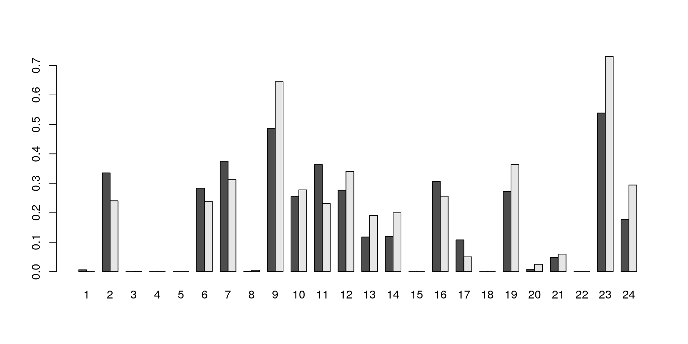

---
output:
  html_document
bibliography: ../ref.bib
---

# Analyzing repertoire sequencing data {#repertoire-seq}

<script>
document.addEventListener("click", function (event) {
    if (event.target.classList.contains("aaron-collapse")) {
        event.target.classList.toggle("active");
        var content = event.target.nextElementSibling;
        if (content.style.display === "block") {
          content.style.display = "none";
        } else {
          content.style.display = "block";
        }
    }
})
</script>

<style>
.aaron-collapse {
  background-color: #eee;
  color: #444;
  cursor: pointer;
  padding: 18px;
  width: 100%;
  border: none;
  text-align: left;
  outline: none;
  font-size: 15px;
}

.aaron-content {
  padding: 0 18px;
  display: none;
  overflow: hidden;
  background-color: #f1f1f1;
}
</style>

<div class="figure">

<p class="caption">(\#fig:unnamed-chunk-1)This page is under construction.</p>
</div>

## Motivation

An organism's immune repertoire is defined as the set of T and B cell subtypes that contain genetic diversity in the T cell receptor (TCR) components or immunoglobin chains, respectively.
This diversity is important for ensuring that the adaptive immune system can respond effectively to a wide range of antigens.
We can profile the immune repertoire by simply sequencing the relevant transcripts [@georgiou2014promise;@rosati2017overview], a procedure that can be combined with previously mentioned technologies [@zheng2017massively] to achieve single-cell resolution.
This data can then be used to characterize an individual's immune response based on the expansion of T or B cell clones, i.e., multiple cells with the same sequences for each TCR component or immunoglobulin chain.

By itself, single-cell repertoire sequencing data can be readily analyzed using tools from the [ImmCantation suite](https://immcantation.readthedocs.io/en/stable/).
In particular, the *[alakazam](https://CRAN.R-project.org/package=alakazam)* package provides functions to perform common analyses to quantify clonal diversity, reconstruct lineages, examine amino acid properties, etc.
However, in most experiments, we also obtain standard RNA sequencing data for each cell; the challenge lies in how we can integrate these two datasets together in the same analysis.
This is not entirely trivial as each cell may have zero, one or multiple sequences for any given repertoire component, whereas we only obtain a single expression profile for that cell.

We would like to define a single data structure that captures both the expression profile and repertoire state for each cell.
This ensures synchronization during operations like subsetting (as previously discussed for the `SingleCellExperiment` class) and reduces book-keeping errors throughout the course of an interactive analysis.
We achieve this using the `SplitDataFrameList` class from the *[IRanges](https://bioconductor.org/packages/3.11/IRanges)* package, which allows us to accommodate repertoire sequencing data into existing Bioconductor classes while retaining compatibility with ImmCantation functions.
We demonstrate on a publicly available 10X Genomics dataset using mouse PBMCs, for which the expression and ADT data have already been processed below:

<button class="aaron-collapse">View history</button>
<div class="aaron-content">
   
```r
#--- loading ---#
library(BiocFileCache)
bfc <- BiocFileCache(ask=FALSE)
exprs.data <- bfcrpath(bfc, file.path(
    "http://cf.10xgenomics.com/samples/cell-vdj/3.1.0",
    "vdj_v1_hs_pbmc3",
    "vdj_v1_hs_pbmc3_filtered_feature_bc_matrix.tar.gz"))
untar(exprs.data, exdir=tempdir())

library(DropletUtils)
sce.pbmc <- read10xCounts(file.path(tempdir(), "filtered_feature_bc_matrix"))
sce.pbmc <- splitAltExps(sce.pbmc, rowData(sce.pbmc)$Type)

#--- quality-control ---#
library(scater)
is.mito <- grep("^MT-", rowData(sce.pbmc)$Symbol)
stats <- perCellQCMetrics(sce.pbmc, subsets=list(Mito=is.mito))

high.mito <- isOutlier(stats$subsets_Mito_percent, type="higher")
low.adt <- stats$`altexps_Antibody Capture_detected` < nrow(altExp(sce.pbmc))/2

discard <- high.mito | low.adt
sce.pbmc <- sce.pbmc[,!discard]

#--- normalization ---#
library(scran)

set.seed(1000)
clusters <- quickCluster(sce.pbmc)
sce.pbmc <- computeSumFactors(sce.pbmc, cluster=clusters)
altExp(sce.pbmc) <- computeMedianFactors(altExp(sce.pbmc))
sce.pbmc <- logNormCounts(sce.pbmc, use_altexps=TRUE)

#--- dimensionality-reduction ---#
set.seed(100000)
altExp(sce.pbmc) <- runTSNE(altExp(sce.pbmc))

set.seed(1000000)
altExp(sce.pbmc) <- runUMAP(altExp(sce.pbmc))

#--- clustering ---#
g.adt <- buildSNNGraph(altExp(sce.pbmc), k=10, d=NA)
clust.adt <- igraph::cluster_walktrap(g.adt)$membership
colLabels(altExp(sce.pbmc)) <- factor(clust.adt)
```

</div>


```r
sce.pbmc
```

```
## class: SingleCellExperiment 
## dim: 33538 6660 
## metadata(1): Samples
## assays(2): counts logcounts
## rownames(33538): ENSG00000243485 ENSG00000237613 ... ENSG00000277475
##   ENSG00000268674
## rowData names(3): ID Symbol Type
## colnames: NULL
## colData names(3): Sample Barcode sizeFactor
## reducedDimNames(0):
## altExpNames(1): Antibody Capture
```

```r
# Moving ADT-based clustering to the top level for convenience.
colLabels(sce.pbmc) <- colLabels(altExp(sce.pbmc))
```

## Analyzing the T cell receptor repertoire

### Data processing

First, we obtain the filtered TCR contig annotations for the same set of cells.
Each row of the resulting data frame contains information about a single TCR component sequence in one cell, broken down into the alleles of the V(D)J genes making up that component (`v_gene`, `d_gene`, `j_gene`) where possible. 
The number of reads and UMIs supporting the set of allele assignments for a cell is also shown, though only the UMI count should be used for quantifying expression of a particular TCR sequence.
Each cell is assigned to a clonotype (`raw_clonotype_id`) based on the combination of the $\alpha$-chain (TRA) and $\beta$-chain (TRB) sequences in that cell.


```r
library(BiocFileCache)
bfc <- BiocFileCache(ask=FALSE)
tcr.data <- bfcrpath(bfc, file.path(
    "http://cf.10xgenomics.com/samples/cell-vdj/3.1.0",
    "vdj_v1_hs_pbmc3/vdj_v1_hs_pbmc3_t_filtered_contig_annotations.csv"))
tcr <- read.csv(tcr.data, stringsAsFactors=FALSE)
nrow(tcr)
```

```
## [1] 10121
```

```r
head(tcr)
```

```
##              barcode is_cell                   contig_id high_confidence length
## 1 AAACCTGAGATCTGAA-1    True AAACCTGAGATCTGAA-1_contig_1            True    521
## 2 AAACCTGAGATCTGAA-1    True AAACCTGAGATCTGAA-1_contig_2            True    474
## 3 AAACCTGAGGAACTGC-1    True AAACCTGAGGAACTGC-1_contig_1            True    496
## 4 AAACCTGAGGAACTGC-1    True AAACCTGAGGAACTGC-1_contig_2            True    505
## 5 AAACCTGAGGAGTCTG-1    True AAACCTGAGGAGTCTG-1_contig_1            True    495
## 6 AAACCTGAGGAGTCTG-1    True AAACCTGAGGAGTCTG-1_contig_2            True    526
##   chain     v_gene d_gene  j_gene c_gene full_length productive
## 1   TRB   TRBV20-1   None TRBJ2-7  TRBC2        True       True
## 2   TRA   TRAV13-1   None  TRAJ44   TRAC        True       True
## 3   TRB    TRBV7-2   None TRBJ2-1  TRBC2        True       True
## 4   TRA TRAV23/DV6   None  TRAJ34   TRAC        True       True
## 5   TRA      TRAV2   None  TRAJ38   TRAC        True       True
## 6   TRB    TRBV6-2   None TRBJ1-1  TRBC1        True       True
##                 cdr3                                                cdr3_nt
## 1     CSARDKGLSYEQYF             TGCAGTGCTAGAGACAAGGGGCTTAGCTACGAGCAGTACTTC
## 2 CAASIGPLGTGTASKLTF TGTGCAGCAAGTATCGGCCCCCTAGGAACCGGCACTGCCAGTAAACTCACCTTT
## 3      CASSLGPSGEQFF                TGTGCCAGCAGCTTGGGACCATCGGGTGAGCAGTTCTTC
## 4       CAASDNTDKLIF                   TGTGCAGCAAGCGATAACACCGACAAGCTCATCTTT
## 5   CAVEANNAGNNRKLIW       TGTGCTGTGGAGGCTAATAATGCTGGCAACAACCGTAAGCTGATTTGG
## 6      CASSRTGGTEAFF                TGTGCCAGCAGTCGGACAGGGGGCACTGAAGCTTTCTTT
##   reads umis raw_clonotype_id         raw_consensus_id
## 1  9327   12     clonotype100 clonotype100_consensus_1
## 2  3440    3     clonotype100 clonotype100_consensus_2
## 3 32991   29     clonotype101 clonotype101_consensus_2
## 4 10714    9     clonotype101 clonotype101_consensus_1
## 5  1734    3     clonotype102 clonotype102_consensus_1
## 6 15530   13     clonotype102 clonotype102_consensus_2
```

The challenge in incorporating all of these data structures into a single object lies in the fact that each cell may have zero, one or many TCR/immunoglobulin sequences.
This precludes direct storage of repertoire information in the `colData()` of the `SingleCellExperiment`, which expects a 1:1 mapping from each cell to each repertoire sequence.
Instead, we store the repertoire data as a `SplitDataFrameList` object where each cell corresponds to a variable-row `DataFrame` containing information for zero-to-many sequences.
This is easily done using the `DataFrame()` constructor and the `split()` function, as shown below:


```r
tra <- tcr[tcr$chain=="TRA",]
sce.pbmc$TRA <- split(DataFrame(tra), factor(tra$barcode, sce.pbmc$Barcode))
length(sce.pbmc$TRA) # Now the same as the number of cells.
```

```
## [1] 6660
```

```r
trb <- tcr[tcr$chain=="TRB",]
sce.pbmc$TRB <- split(DataFrame(trb), factor(trb$barcode, sce.pbmc$Barcode))
length(sce.pbmc$TRB)
```

```
## [1] 6660
```

### Basic diagnostics

We start by generating some basic cell-level diagnostics.
For each cluster, we determine the proportion of cells that have at least one sequence of a TCR component (Figure \@ref(fig:tcr-prop-cluster-all)).
Clusters with large counts are most likely to be T cells, though some background level of TCR expression may be observed in other clusters due to a mixture of clustering uncertainty, ambient contamination, doublet formation and potential expression in other cell types.


```r
ncells <- table(colLabels(sce.pbmc))
ncells
```

```
## 
##    1    2    3    4    5    6    7    8    9   10   11   12   13   14   15   16 
##  160  507  662   39  691 1415   32  650   76 1037  121   47   68   25   15  562 
##   17   18   19   20   21   22   23   24 
##  139   32   44  120   84   65   52   17
```

```r
# `lengths()` returns the number of sequences per cell.
at.least.one.A <- lengths(sce.pbmc$TRA) > 0
tra.counts.any <- table(colLabels(sce.pbmc)[at.least.one.A])

at.least.one.B <- lengths(sce.pbmc$TRB) > 0
trb.counts.any <- table(colLabels(sce.pbmc)[at.least.one.B])

barplot(rbind(TRA=tra.counts.any/ncells, TRB=trb.counts.any/ncells), beside=TRUE)
```

<div class="figure">

<p class="caption">(\#fig:tcr-prop-cluster-all)Proportion of cells in each cluster that express at least one sequence of the TCR $\alpha$ (dark) or $\beta$-chains (light).</p>
</div>

We can refine this to only consider the productive sequences, i.e., contigs that are likely to produce a functional protein.
This is easily achieved by taking advantage of some powerful grammar in the *[IRanges](https://bioconductor.org/packages/3.11/IRanges)* package for handling `List` structures as if they were standard R vectors.
We see a slight drop in the proportions in Figure \@ref(fig:tcr-prop-cluster-prod), which is to be expected as not all sequences are productive.


```r
# Generate a LogicalList class where each entry corresponds to a cell and is
# a logical vector specifying which of that cell's sequences are productive.
is.prod.A <- sce.pbmc$TRA[,"productive"]=="True" 
is.prod.A
```

```
## LogicalList of length 6660
## [["AAACCTGAGATCTGAA-1"]] TRUE
## [["AAACCTGAGGAACTGC-1"]] TRUE
## [["AAACCTGAGGAGTCTG-1"]] TRUE
## [["AAACCTGAGGCTCTTA-1"]] TRUE FALSE
## [["AAACCTGAGTACGTTC-1"]] logical(0)
## [["AAACCTGGTCTTGTCC-1"]] logical(0)
## [["AAACCTGGTTGCGTTA-1"]] logical(0)
## [["AAACCTGTCAACGGGA-1"]] TRUE FALSE
## [["AAACCTGTCACTGGGC-1"]] logical(0)
## [["AAACCTGTCAGCTGGC-1"]] logical(0)
## ...
## <6650 more elements>
```

```r
# We can apply operations to this LogicalList that mimic looping over a logical
# vector. For example, `any()` will return a logical vector of length equal to 
# the number of cells, with a value of TRUE if any sequence is productive.
has.prod.A <- any(is.prod.A)
head(has.prod.A)
```

```
## AAACCTGAGATCTGAA-1 AAACCTGAGGAACTGC-1 AAACCTGAGGAGTCTG-1 AAACCTGAGGCTCTTA-1 
##               TRUE               TRUE               TRUE               TRUE 
## AAACCTGAGTACGTTC-1 AAACCTGGTCTTGTCC-1 
##              FALSE              FALSE
```

```r
# And then we simply count the number of cells in each cluster.
tra.counts.prod <- table(colLabels(sce.pbmc)[has.prod.A])

is.prod.B <- sce.pbmc$TRB[,"productive"]=="True"
has.prod.B <- any(is.prod.B)
trb.counts.prod <- table(colLabels(sce.pbmc)[has.prod.B])

barplot(rbind(TRA=tra.counts.prod/ncells, TRB=trb.counts.prod/ncells),
    legend=TRUE, beside=TRUE)
```

<div class="figure">

<p class="caption">(\#fig:tcr-prop-cluster-prod)Proportion of cells in each cluster that express at least one productive sequence of the TCR $\alpha$ (dark) or $\beta$-chains (light).</p>
</div>

For completeness, we also count the number of cells in each cluster that have multiple sequences for a component (Figure \@ref(fig:tcr-prop-cluster-multi)).
The percentages are clearly lower but this phenomenon is still surprisingly common.


```r
tra.counts.multi <- table(colLabels(sce.pbmc)[lengths(sce.pbmc$TRA) > 1])
trb.counts.multi <- table(colLabels(sce.pbmc)[lengths(sce.pbmc$TRB) > 1])
barplot(rbind(TRA=tra.counts.multi/ncells, TRB=trb.counts.multi/ncells), 
    beside=TRUE)
```

<div class="figure">

<p class="caption">(\#fig:tcr-prop-cluster-multi)Proportion of cells in each cluster that express two or more sequences of the TCR $\alpha$ (dark) or $\beta$-chains (light).</p>
</div>

### Complex diagnostics

At this point, it is worth spending some time on the amazingness of the `List` grammar.
We can easily assemble complex queries on the table of contig sequence information by using nothing more than basic R syntax.
To illustrate, we will use the $\alpha$-chain data to extract some complex features,
starting with the identification of sequences that have UMI counts no less than 50% of the largest UMI count for the same cell.


```r
# Assigning to a short-name variable for convenience.
tra <- sce.pbmc$TRA

# Obtaining the maximum UMI count for each cell.
max.umi <- max(tra[,"umis"])
head(max.umi)
```

```
## AAACCTGAGATCTGAA-1 AAACCTGAGGAACTGC-1 AAACCTGAGGAGTCTG-1 AAACCTGAGGCTCTTA-1 
##                  3                  9                  3                  3 
## AAACCTGAGTACGTTC-1 AAACCTGGTCTTGTCC-1 
##        -2147483647        -2147483647
```

```r
# Generate a LogicalList indicating which sequences have UMI counts
# greater than half the maximum UMI count in the same cell.
keep <- tra[,"umis"] >= max.umi/2
keep
```

```
## LogicalList of length 6660
## [["AAACCTGAGATCTGAA-1"]] AAACCTGAGATCTGAA-1=TRUE
## [["AAACCTGAGGAACTGC-1"]] AAACCTGAGGAACTGC-1=TRUE
## [["AAACCTGAGGAGTCTG-1"]] AAACCTGAGGAGTCTG-1=TRUE
## [["AAACCTGAGGCTCTTA-1"]] AAACCTGAGGCTCTTA-1=TRUE AAACCTGAGGCTCTTA-1=TRUE
## [["AAACCTGAGTACGTTC-1"]] named logical(0)
## [["AAACCTGGTCTTGTCC-1"]] named logical(0)
## [["AAACCTGGTTGCGTTA-1"]] named logical(0)
## [["AAACCTGTCAACGGGA-1"]] AAACCTGTCAACGGGA-1=TRUE AAACCTGTCAACGGGA-1=FALSE
## [["AAACCTGTCACTGGGC-1"]] named logical(0)
## [["AAACCTGTCAGCTGGC-1"]] named logical(0)
## ...
## <6650 more elements>
```

```r
# Examine the distribution of the proportion of sequences in each cell
# that satisfied our requirements.
summary(mean(keep))
```

```
##    Min. 1st Qu.  Median    Mean 3rd Qu.    Max.    NA's 
##  0.2500  1.0000  1.0000  0.9304  1.0000  1.0000    3067
```

Boolean statements are easily accommodated with standard methods.
For example, we can identify sequences that are full-length, productive and have the largest UMI count in the cell.
Another useful aspect of the `SplitDataFrameList`'s behavior is that we can use a `LogicalList` as an argument for subsetting, which will then subset at the sequence level, i.e., the rows of each per-cell `DataFrame`.
(This contrasts with more conventional uses of a logical vector as the subset argument, which will simply subset at the cell level, i.e., the elements of the `SplitDataFrameList` itself.)


```r
keep <- tra[,"full_length"]=="True" &
    tra[,"productive"]=="True" &
    tra[,"umis"] == max(tra[,"umis"])
keep 
```

```
## LogicalList of length 6660
## [["AAACCTGAGATCTGAA-1"]] AAACCTGAGATCTGAA-1=TRUE
## [["AAACCTGAGGAACTGC-1"]] AAACCTGAGGAACTGC-1=TRUE
## [["AAACCTGAGGAGTCTG-1"]] AAACCTGAGGAGTCTG-1=TRUE
## [["AAACCTGAGGCTCTTA-1"]] AAACCTGAGGCTCTTA-1=TRUE AAACCTGAGGCTCTTA-1=FALSE
## [["AAACCTGAGTACGTTC-1"]] named logical(0)
## [["AAACCTGGTCTTGTCC-1"]] named logical(0)
## [["AAACCTGGTTGCGTTA-1"]] named logical(0)
## [["AAACCTGTCAACGGGA-1"]] AAACCTGTCAACGGGA-1=TRUE AAACCTGTCAACGGGA-1=FALSE
## [["AAACCTGTCACTGGGC-1"]] named logical(0)
## [["AAACCTGTCAGCTGGC-1"]] named logical(0)
## ...
## <6650 more elements>
```

```r
# Subsets the SplitDataFrameList to only retain sequences in each cell
# that satisfy our requirements.
tra.sub <- tra[keep]
```

The grammar also extends to dealing with character vectors.
Say we want to quantify all combinations of V and J genes, each of which is extracted from `tra` as a `CharacterList` object. 
The simplest approach is to simply `paste()` the `CharacterList` objects together and count the frequencies of the concatenated strings, as shown below.


```r
combined <- paste(tra[,"v_gene"], tra[,"j_gene"])
combined
```

```
## CharacterList of length 6660
## [["AAACCTGAGATCTGAA-1"]] TRAV13-1 TRAJ44
## [["AAACCTGAGGAACTGC-1"]] TRAV23/DV6 TRAJ34
## [["AAACCTGAGGAGTCTG-1"]] TRAV2 TRAJ38
## [["AAACCTGAGGCTCTTA-1"]] TRAV12-3 TRAJ37 TRAV25 TRAJ29
## [["AAACCTGAGTACGTTC-1"]] character(0)
## [["AAACCTGGTCTTGTCC-1"]] character(0)
## [["AAACCTGGTTGCGTTA-1"]] character(0)
## [["AAACCTGTCAACGGGA-1"]] TRAV9-2 TRAJ38 TRAV25 TRAJ31
## [["AAACCTGTCACTGGGC-1"]] character(0)
## [["AAACCTGTCAGCTGGC-1"]] character(0)
## ...
## <6650 more elements>
```

```r
combo.freq <- table(unlist(combined))
head(sort(combo.freq, decreasing=TRUE))
```

```
## 
##      TRAV1-2 TRAJ33 TRAV38-2/DV8 TRAJ45     TRAV26-1 TRAJ49          None TRAJ6 
##                 137                  40                  32                  27 
##         None TRAJ18       TRAV41 TRAJ58 
##                  17                  17
```

If an operation must be performed on the original sequence-level data frame, 
we can efficiently recover the latter by calling `unlist()` on our `SplitDataFrameList`.
It is similarly straightforward to regenerate our `SplitDataFrameList` from the data frame by using the little-known `relist()` command. 
This framework permits users to quickly switch between sequence level and cell level perspectives of the repertoire data depending on which is most convenient at any given point in the analysis.


```r
tra.seq <- unlist(tra)
dim(tra.seq) # Each row represents a sequence now.
```

```
## [1] 4863   18
```

```r
# Adding some arbitrary extra annotation (mocked up here).
extra.anno <- DataFrame(anno=sample(LETTERS, nrow(tra.seq), replace=TRUE))
tra.seq <- cbind(tra.seq, extra.anno)

# Regenerating the SplitDataFrameList from the modified DataFrame.
tra2 <- relist(tra.seq, tra)
length(tra2) # Each element represents a cell again.
```

```
## [1] 6660
```

### Quantifying clonal expansion

Quantification of clonal expansion is the most obvious application of repertoire sequencing data.
Cells with the same T cell clonotype are assumed to target the same antigen, and any increase in the frequency of a clonotype provides evidence for T cell activation and proliferation upon stimulation by the corresponding antigen.
Thus, we can gain some insights into the immune activity of each T cell cluster by counting the number of expanded clonotypes in each cluster, as shown below for the $\alpha$-chain.
(We do not exclude clonotypes containing cells in different clusters, which can arise for various genuine biological reasons, e.g., differences in the microenvironment.) 


```r
clone.id.A <- unlist(unique(sce.pbmc$TRA[,"raw_clonotype_id"]))
expanded.id.A <- setdiff(clone.id.A[duplicated(clone.id.A)], "None")
length(expanded.id.A) # number of expanded clonotypes for TRA
```

```
## [1] 92
```

```r
clone.id.B <- unlist(unique(sce.pbmc$TRB[,"raw_clonotype_id"]))
expanded.id.B <- setdiff(clone.id.B[duplicated(clone.id.B)], "None")
length(expanded.id.B) # number of expanded clonotypes for TRB
```

```
## [1] 96
```

```r
is.clone.A <- any(sce.pbmc$TRA[,"raw_clonotype_id"] %in% expanded.id.A)
tra.counts.clonal <- table(colLabels(sce.pbmc)[is.clone.A])
is.clone.B <- any(sce.pbmc$TRB[,"raw_clonotype_id"] %in% expanded.id.B)
trb.counts.clonal <- table(colLabels(sce.pbmc)[is.clone.B])

barplot(rbind(TRA=tra.counts.clonal/ncells, TRB=trb.counts.clonal/ncells), 
    legend=TRUE, beside=TRUE)
```

<div class="figure">

<p class="caption">(\#fig:unnamed-chunk-10)Proportion of cells in each cluster that have multiple clonotypes, based on the TCR $\alpha$ or $\beta$-chains.</p>
</div>

We can use this information to determine whether a particular T cell cluster is enriched for expanding clonotypes.
The example below uses Fisher's exact test to identify a significant increase in the proportion of expanded clonotypes in a cluster of putative CD8^+^ T cells compared to another cluster of CD4^+^ T cells (Figure \@ref(fig:expanded-t-clusters)).
This provides some relative measure of the average immune activity of each cluster though, of course, further subclustering may reveal finer subpopulations with more or less activity than the average of the parent cluster.


```r
# Identifying the clusters:
tclust.1 <- "2"
tclust.2 <- "6"

mat <- cbind(Expanded=tra.counts.clonal,
    Unexpanded=tra.counts.any - tra.counts.clonal)[c(tclust.1, tclust.2),]
mat 
```

```
##   Expanded Unexpanded
## 2      138        309
## 6       80       1193
```

```r
stats <- fisher.test(mat)
stats
```

```
## 
## 	Fisher's Exact Test for Count Data
## 
## data:  mat
## p-value < 2.2e-16
## alternative hypothesis: true odds ratio is not equal to 1
## 95 percent confidence interval:
##  4.869834 9.129173
## sample estimates:
## odds ratio 
##   6.650292
```

```r
# Checking the identities of the relevant clusters. Note that 'cluster' is also
# present as a colData entry in 'altExp(sce.pbmc)', which is why the
# 'other_fields="label"' argument works correctty.
of.interest <- colLabels(sce.pbmc) %in% c(tclust.1, tclust.2)

library(scater)
plotExpression(altExp(sce.pbmc)[,of.interest], 
    features=rownames(altExp(sce.pbmc)),
    other_fields="label") + facet_wrap(~label, ncol=1)
```

<div class="figure">

<p class="caption">(\#fig:expanded-t-clusters)Distribution of log-abundance values for each antibody-derived tag in the PBMC dataset, across all cells in either T cell cluster (top and bottom panels).</p>
</div>


### Quantifying gene expression and properties

We may also be interested in the expression of specific TCR genes, which can provide some insight into the type of antigens being targeted [@shugay2018vdjdb].
We again use Fisher's exact test to test if our two T cell clusters of interest differ in the proportion of TCR sequences containing each gene.
This yields a number of significant differences that may or may not be interesting, I don't know.
As usual, composition effects apply here.


```r
# This should DEFINITELY use countGenes().
gene.id.A <- sce.pbmc$TRA[,"v_gene"]
expanded.cluster <- rep(colLabels(sce.pbmc), lengths(gene.id.A))
gene.tab.A <- table(unlist(gene.id.A), expanded.cluster)

# Testing for differences between our clusters.
collected <- list()
totals <- colSums(gene.tab.A)
for (i in rownames(gene.tab.A)) {
    mat <- cbind(
        Gene=gene.tab.A[i,],
        Other=totals - gene.tab.A[i,])[c(tclust.1, tclust.2),]
    stats <- fisher.test(mat)
    collected[[i]] <- DataFrame(OR=stats$estimate, p.value=stats$p.value,
        row.names=i)
}

collected <- do.call(rbind, collected)
collected$FDR <- p.adjust(collected$p.value, method="BH")
collected <- collected[order(collected$p.value),]
head(collected)
```

```
## DataFrame with 6 rows and 3 columns
##                     OR     p.value         FDR
##              <numeric>   <numeric>   <numeric>
## TRAV1-2      17.325061 9.22092e-48 4.14941e-46
## TRAV9-2       0.347538 7.02164e-05 1.57987e-03
## TRAV38-2/DV8  2.387645 1.47719e-04 2.21578e-03
## TRAV13-1      0.407479 2.72881e-04 3.06991e-03
## TRAV38-1      0.152513 1.28213e-03 1.09826e-02
## TRAV12-1      2.217839 1.49621e-03 1.09826e-02
```

The same philosophy can be applied to detect significant differences in biophysical properties.
I have no idea what to say about this.
I can only assume that gravy refers to hydrophobicity, and not the sauce.
(One 300g can of gravy gives me a quarter of my daily fat, according to Google.
And half my sodium as well. What a bargain!)
And maybe basic TCRs will prefer to bind acidic pepties?
Now we just have to find all those acidic antigens out there - how hard can it be?
What kind of pathogen uses acidic residues, anyway?
Prolines, now that's a sign of class.


```r
# TODO: move this somewhere else.
extractDataFrame <- function(splitted, ...) {
    thing <- data.frame(...)
    thing <- thing[rep(seq_len(NROW(thing)), lengths(splitted)),,drop=FALSE]
    cbind(as.data.frame(unlist(splitted)), thing)
}
df.A <- extractDataFrame(sce.pbmc$TRA, label=colLabels(sce.pbmc))

library(alakazam)
aap <- aminoAcidProperties(df.A, seq="cdr3")
properties <- grep("_AA_", colnames(aap))
head(aap[,properties])
```

```
##                      cdr3_AA_LENGTH cdr3_AA_GRAVY cdr3_AA_BULK
## AAACCTGAGATCTGAA-1               18     0.6888889     13.41944
## AAACCTGAGGAACTGC-1               12     0.1083333     14.68250
## AAACCTGAGGAGTCTG-1               16    -0.4250000     14.51500
## AAACCTGAGGCTCTTA-1               14     0.4285714     13.09429
## AAACCTGAGGCTCTTA-1.1             NA            NA           NA
## AAACCTGTCAACGGGA-1               17    -0.2117647     14.14941
##                      cdr3_AA_ALIPHATIC cdr3_AA_POLARITY cdr3_AA_CHARGE
## AAACCTGAGATCTGAA-1           0.8166667         7.805556      0.9260145
## AAACCTGAGGAACTGC-1           0.8166667         8.641667     -1.0733532
## AAACCTGAGGAGTCTG-1           0.8562500         8.793750      0.9265075
## AAACCTGAGGCTCTTA-1           0.6285714         7.978571      0.9260145
## AAACCTGAGGCTCTTA-1.1                NA               NA             NA
## AAACCTGTCAACGGGA-1           0.8058824         8.323529      2.0378223
##                      cdr3_AA_BASIC cdr3_AA_ACIDIC cdr3_AA_AROMATIC
## AAACCTGAGATCTGAA-1      0.05555556      0.0000000       0.05555556
## AAACCTGAGGAACTGC-1      0.08333333      0.1666667       0.08333333
## AAACCTGAGGAGTCTG-1      0.12500000      0.0625000       0.06250000
## AAACCTGAGGCTCTTA-1      0.07142857      0.0000000       0.07142857
## AAACCTGAGGCTCTTA-1.1            NA             NA               NA
## AAACCTGTCAACGGGA-1      0.17647059      0.0000000       0.17647059
```

```r
collected <- list()
for (i in properties) {
    prop <- colnames(aap)[i]
    current <- split(aap[,prop], aap$label)
    left <- current[[tclust.1]]
    right <- current[[tclust.2]]
    stats <- wilcox.test(left, right)
    collected[[prop]] <- DataFrame(Delta=median(left, na.rm=TRUE) - 
        median(right, na.rm=TRUE), p.value=stats$p.value,
        row.names=prop)
}

collected <- do.call(rbind, collected)
collected
```

```
## DataFrame with 9 rows and 2 columns
##                         Delta     p.value
##                     <numeric>   <numeric>
## cdr3_AA_LENGTH    -1.00000000 3.06864e-06
## cdr3_AA_GRAVY     -0.01590909 6.97870e-01
## cdr3_AA_BULK       0.50125000 3.89143e-11
## cdr3_AA_ALIPHATIC  0.06428571 8.22883e-05
## cdr3_AA_POLARITY  -0.08064893 1.33808e-03
## cdr3_AA_CHARGE    -0.99761076 2.41862e-14
## cdr3_AA_BASIC      0.00641026 1.00025e-03
## cdr3_AA_ACIDIC     0.07142857 3.40111e-14
## cdr3_AA_AROMATIC   0.02456140 1.84476e-07
```

## Analyzing the immunoglobulin repertoire

Immunoglobulins are good.

## Multi-sample analyses

A much more interesting analysis is possible when there are multiple samples and treatment conditions, where the aim is to determine which clusters contain T cell clonotypes that expand in response to treatment.
In much the same vein as the analysis in Chapter \@ref(multi-sample-comparisons), we can obtain a cluster-by-sample count matrix by simply `cbind()`ing together the `tra.counts.clonal` vector from each sample.
To demonstrate, we will pretend that our cells are derived from 4 samples that have been merged together for common clustering (Chapter \@ref(integrating-datasets)).


```r
pretend.samples <- sample(letters[1:4], ncol(sce.pbmc), replace=TRUE)

# Creating a count matrix.
clone.counts <- any.counts <- list()
for (i in sort(unique(pretend.samples))) {
    current.sample <- sce.pbmc[,i==pretend.samples]
    clone.id.A <- unlist(unique(current.sample$TRA[,"raw_clonotype_id"]))
    expanded.id.A <- setdiff(clone.id.A[duplicated(clone.id.A)], "None")
    is.clone.A <- any(current.sample$TRA[,"raw_clonotype_id"] %in% expanded.id.A)
    clone.counts[[i]] <- table(colLabels(current.sample)[is.clone.A])
    any.counts[[i]] <- table(colLabels(current.sample)[lengths(current.sample$TRA) > 0])
}

clone.counts <- do.call(cbind, clone.counts)
any.counts <- do.call(cbind, any.counts)
```

We then test for condition-specific differences in the proportion of clonotypes that are expanded.
A natural approach would be to apply a beta-binomial model to each cluster, using the expanded and TCR-containing counts as input; for the time being, though, we will just perform a simple Wilcoxon ranked sum test.
We test on proportions to accommodate biological differences in T cell abundance between samples well as technical differences in, say, sequencing depth that might affect the success rate of TCR calls on a sample-by-sample basis.


```r
prop <- clone.counts/any.counts

# Pretending that the first two samples are cases,
# and the second two samples are controls.
wilcox.test(prop[tclust.1,1:2], prop[tclust.1,3:4])
```

```
## 
## 	Wilcoxon rank sum exact test
## 
## data:  prop[tclust.1, 1:2] and prop[tclust.1, 3:4]
## W = 2, p-value = 1
## alternative hypothesis: true location shift is not equal to 0
```

```r
wilcox.test(prop[tclust.2,1:2], prop[tclust.2,3:4])
```

```
## 
## 	Wilcoxon rank sum exact test
## 
## data:  prop[tclust.2, 1:2] and prop[tclust.2, 3:4]
## W = 2, p-value = 1
## alternative hypothesis: true location shift is not equal to 0
```

## Session Info {-}

<button class="aaron-collapse">View session info</button>
<div class="aaron-content">
```
R Under development (unstable) (2020-03-23 r78035)
Platform: x86_64-pc-linux-gnu (64-bit)
Running under: Ubuntu 18.04.4 LTS

Matrix products: default
BLAS:   /home/luna/Software/R/trunk/lib/libRblas.so
LAPACK: /home/luna/Software/R/trunk/lib/libRlapack.so

locale:
 [1] LC_CTYPE=en_US.UTF-8       LC_NUMERIC=C              
 [3] LC_TIME=en_US.UTF-8        LC_COLLATE=en_US.UTF-8    
 [5] LC_MONETARY=en_US.UTF-8    LC_MESSAGES=en_US.UTF-8   
 [7] LC_PAPER=en_US.UTF-8       LC_NAME=C                 
 [9] LC_ADDRESS=C               LC_TELEPHONE=C            
[11] LC_MEASUREMENT=en_US.UTF-8 LC_IDENTIFICATION=C       

attached base packages:
[1] parallel  stats4    stats     graphics  grDevices utils     datasets 
[8] methods   base     

other attached packages:
 [1] alakazam_0.3.0              scater_1.15.29             
 [3] ggplot2_3.3.0               BiocFileCache_1.11.4       
 [5] dbplyr_1.4.2                SingleCellExperiment_1.9.3 
 [7] SummarizedExperiment_1.17.5 DelayedArray_0.13.8        
 [9] matrixStats_0.56.0          Biobase_2.47.3             
[11] GenomicRanges_1.39.3        GenomeInfoDb_1.23.16       
[13] IRanges_2.21.8              S4Vectors_0.25.14          
[15] BiocGenerics_0.33.3         OSCAUtils_0.0.2            
[17] BiocStyle_2.15.6           

loaded via a namespace (and not attached):
 [1] nlme_3.1-145             bitops_1.0-6             bit64_0.9-7             
 [4] progress_1.2.2           httr_1.4.1               tools_4.0.0             
 [7] R6_2.4.1                 irlba_2.3.3              vipor_0.4.5             
[10] lazyeval_0.2.2           DBI_1.1.0                colorspace_1.4-1        
[13] ade4_1.7-15              withr_2.1.2              prettyunits_1.1.1       
[16] tidyselect_1.0.0         gridExtra_2.3            processx_3.4.2          
[19] bit_1.1-15.2             curl_4.3                 compiler_4.0.0          
[22] cli_2.0.2                BiocNeighbors_1.5.2      labeling_0.3            
[25] bookdown_0.18            scales_1.1.0             readr_1.3.1             
[28] callr_3.4.3              rappdirs_0.3.1           stringr_1.4.0           
[31] digest_0.6.25            rmarkdown_2.1            XVector_0.27.2          
[34] pkgconfig_2.0.3          htmltools_0.4.0          highr_0.8               
[37] rlang_0.4.5              RSQLite_2.2.0            DelayedMatrixStats_1.9.1
[40] farver_2.0.3             BiocParallel_1.21.2      dplyr_0.8.5             
[43] RCurl_1.98-1.1           magrittr_1.5             BiocSingular_1.3.2      
[46] GenomeInfoDbData_1.2.2   Matrix_1.2-18            Rcpp_1.0.4              
[49] ggbeeswarm_0.6.0         munsell_0.5.0            fansi_0.4.1             
[52] ape_5.3                  viridis_0.5.1            lifecycle_0.2.0         
[55] stringi_1.4.6            yaml_2.2.1               MASS_7.3-51.5           
[58] zlibbioc_1.33.1          grid_4.0.0               blob_1.2.1              
[61] crayon_1.3.4             lattice_0.20-40          cowplot_1.0.0           
[64] hms_0.5.3                knitr_1.28               ps_1.3.2                
[67] pillar_1.4.3             igraph_1.2.5             seqinr_3.6-1            
[70] codetools_0.2-16         glue_1.3.2               evaluate_0.14           
[73] BiocManager_1.30.10      vctrs_0.2.4              tidyr_1.0.2             
[76] gtable_0.3.0             purrr_0.3.3              assertthat_0.2.1        
[79] xfun_0.12                rsvd_1.0.3               viridisLite_0.3.0       
[82] tibble_3.0.0             beeswarm_0.2.3           memoise_1.1.0           
[85] ellipsis_0.3.0          
```
</div>
