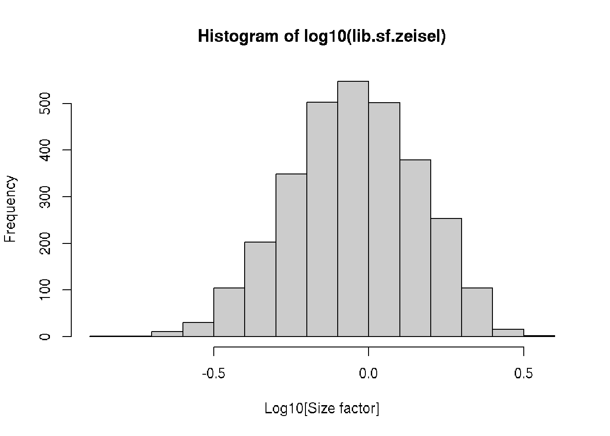
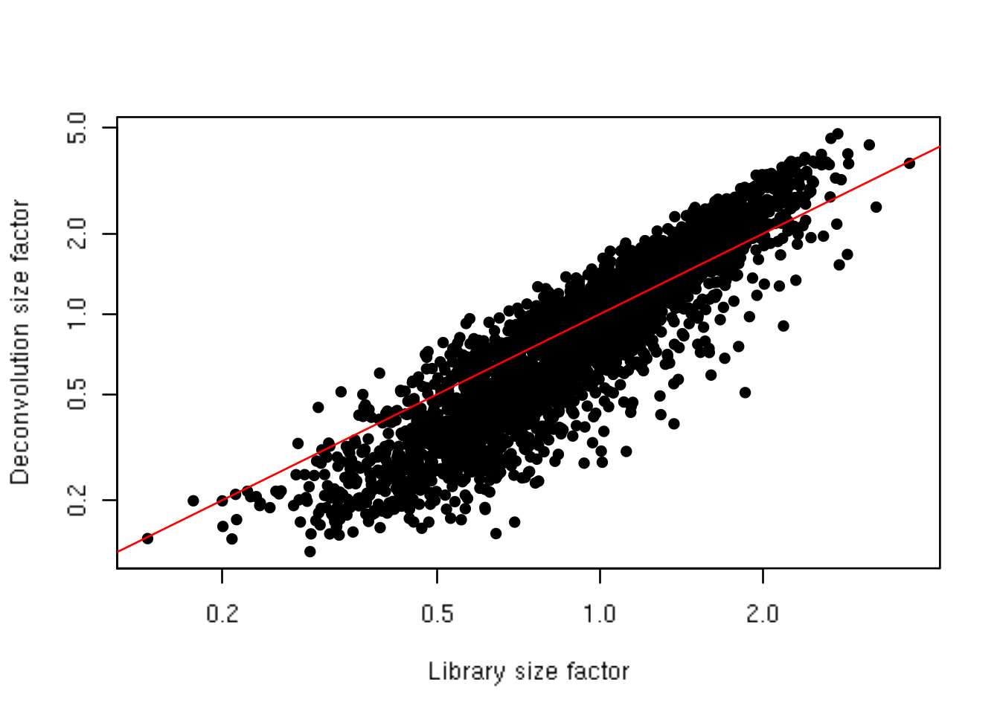
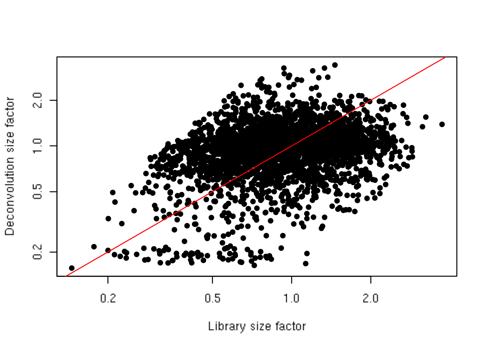
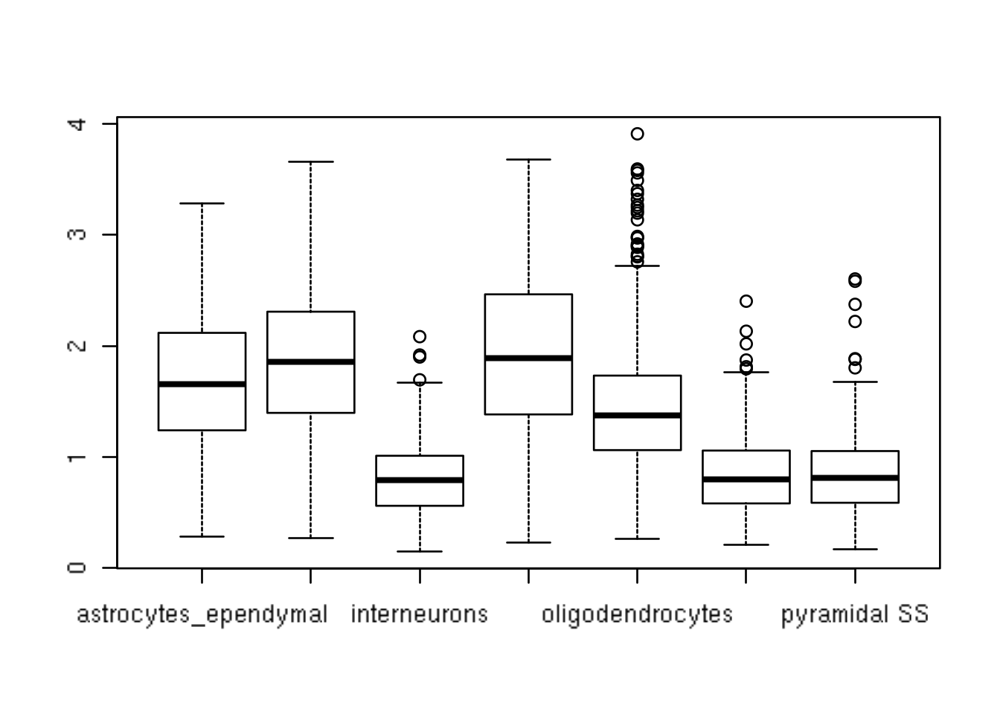

# Normalization 


## Motivation

Systematic differences in coverage between libraries are often observed in single-cell RNA sequencing data.
This typically arises from differences in cDNA capture or PCR amplification efficiency across cells, attributable to the difficulty of achieving consistent library preparation with minimal starting material^[Back in my day, we needed a million cells to do transcriptomics! When I first heard about single-cell RNA-seq, I remember thinking that this was nonsense and that it would never work. Ah, the confidence of a first year grad student... though I did have more hair back then.].
Normalization aims to remove these systematic differences such that they do not interfere with comparisons of the expression profiles between cells, e.g., during clustering or differential expression analyses.

At this point, it's worth being clear on what we mean by "systematic differences".
For the purposes of this chaper, systematic differences refer to biases that affect all genes in a predictable manner.
This includes, for example, a change in sequencing depth that scales up the (average) coverage of all genes by a certain factor.
One can also consider more complex scaling effects, e.g., with respect to gene abundance, which would require non-linear normalization methods reminiscent of microarray analyses^[I consider anyone born after the first microarray paper to be "young".].
In contrast, general batch correction methods aim to remove gene-specific differences between batches that may not follow any predictable pattern across genes, and thus will not be considered in this chapter.

## Setting up the data


```r
library(scRNAseq)
```

```
## Loading required package: SingleCellExperiment
```

```
## Loading required package: SummarizedExperiment
```

```
## Loading required package: GenomicRanges
```

```
## Loading required package: stats4
```

```
## Loading required package: BiocGenerics
```

```
## Loading required package: parallel
```

```
## 
## Attaching package: 'BiocGenerics'
```

```
## The following objects are masked from 'package:parallel':
## 
##     clusterApply, clusterApplyLB, clusterCall, clusterEvalQ,
##     clusterExport, clusterMap, parApply, parCapply, parLapply,
##     parLapplyLB, parRapply, parSapply, parSapplyLB
```

```
## The following objects are masked from 'package:stats':
## 
##     IQR, mad, sd, var, xtabs
```

```
## The following objects are masked from 'package:base':
## 
##     anyDuplicated, append, as.data.frame, basename, cbind,
##     colnames, dirname, do.call, duplicated, eval, evalq, Filter,
##     Find, get, grep, grepl, intersect, is.unsorted, lapply, Map,
##     mapply, match, mget, order, paste, pmax, pmax.int, pmin,
##     pmin.int, Position, rank, rbind, Reduce, rownames, sapply,
##     setdiff, sort, table, tapply, union, unique, unsplit, which,
##     which.max, which.min
```

```
## Loading required package: S4Vectors
```

```
## 
## Attaching package: 'S4Vectors'
```

```
## The following object is masked from 'package:base':
## 
##     expand.grid
```

```
## Loading required package: IRanges
```

```
## Loading required package: GenomeInfoDb
```

```
## Loading required package: Biobase
```

```
## Welcome to Bioconductor
## 
##     Vignettes contain introductory material; view with
##     'browseVignettes()'. To cite Bioconductor, see
##     'citation("Biobase")', and for packages 'citation("pkgname")'.
```

```
## Loading required package: DelayedArray
```

```
## Loading required package: matrixStats
```

```
## 
## Attaching package: 'matrixStats'
```

```
## The following objects are masked from 'package:Biobase':
## 
##     anyMissing, rowMedians
```

```
## Loading required package: BiocParallel
```

```
## 
## Attaching package: 'DelayedArray'
```

```
## The following objects are masked from 'package:matrixStats':
## 
##     colMaxs, colMins, colRanges, rowMaxs, rowMins, rowRanges
```

```
## The following objects are masked from 'package:base':
## 
##     aperm, apply, rowsum
```

```r
sce.zeisel <- ZeiselBrainData()
```

```
## Warning: `overscope_eval_next()` is deprecated as of rlang 0.2.0.
## Please use `eval_tidy()` with a data mask instead.
## This warning is displayed once per session.
```

```
## Warning: `overscope_clean()` is deprecated as of rlang 0.2.0.
## This warning is displayed once per session.
```

```
## snapshotDate(): 2019-06-20
```

```
## see ?scRNAseq and browseVignettes('scRNAseq') for documentation
```

```
## downloading 1 resources
```

```
## retrieving 1 resource
```

```
## loading from cache 
##     'EH2580 : 2596'
```

```
## see ?scRNAseq and browseVignettes('scRNAseq') for documentation
```

```
## downloading 1 resources
```

```
## retrieving 1 resource
```

```
## loading from cache 
##     'EH2582 : 2598'
```

```
## see ?scRNAseq and browseVignettes('scRNAseq') for documentation
```

```
## downloading 1 resources
```

```
## retrieving 1 resource
```

```
## loading from cache 
##     'EH2581 : 2597'
```

```r
sce.zeisel 
```

```
## class: SingleCellExperiment 
## dim: 21135 3005 
## metadata(0):
## assays(1): counts
## rownames(21135): Tspan12 Tshz1 ... r_U4 r_tRNA-Ser-TCG
## rowData names(1): featureType
## colnames(3005): 1772071015_C02 1772071017_G12 ... 1772066098_A12
##   1772058148_F03
## colData names(10): tissue group # ... level1class level2class
## reducedDimNames(0):
## spikeNames(1): ERCC
```

## Library size normalization


```r
library(scater)
```

```
## Loading required package: ggplot2
```

```r
lib.sf.zeisel <- librarySizeFactors(sce.zeisel)
hist(log10(lib.sf.zeisel), xlab="Log10[Size factor]", col='grey80')
```

<div class="figure">

<p class="caption">(\#fig:histlib)Distribution of size factors derived from the library size in the Zeisel brain dataset.</p>
</div>

## Normalization by deconvolution


```r
library(scran)
set.seed(100)
clust.zeisel <- quickCluster(sce.zeisel)
table(clust.zeisel)
```

```
## clust.zeisel
##   1   2   3   4   5   6   7   8   9  10  11  12 
## 380 162 172 116 426 194 423 252 267 253 166 194
```


```r
deconv.sf.zeisel <- computeSumFactors(sce.zeisel, 
    cluster=clust.zeisel, sf.out=TRUE)
plot(lib.sf.zeisel, deconv.sf.zeisel, xlab="Library size factor",
    ylab="Deconvolution size factor", log='xy', pch=16)
abline(a=0, b=1, col="red")
```

<div class="figure">

<p class="caption">(\#fig:deconv)Deconvolution size factor for each cell in the Zeisel brain dataset, compared to the equivalent size factor derived from the library size. The red line corresponds to identity between the two size factors.</p>
</div>

## Normalization by spike-ins

### Differences in total RNA content

Spike-in normalization is based on the assumption that the same amount of spike-in RNA was added to each cell [@lun2017assessing].
Systematic differences in the coverage of the spike-in transcripts can only be due to cell-specific biases, e.g., in capture efficiency or sequencing depth.
Scaling normalization is then applied to equalize spike-in coverage across cells.
We refer to the corresponding scaling factors as "spike-in size factors".

Spike-in normalization should be used if differences in the total RNA content of individual cells are of interest.
In any particular cell, an increase in the amount of endogenous RNA will not increase spike-in coverage. 
Thus, the former will not be represented as part of the bias in the latter, which means that the effects of total RNA content on expression will not be removed upon scaling.
By comparison, the other normalization methods described above will simply interpret any change in total RNA content as part of the bias and remove it.

We demonstrate the use of spike-in normalization on a different dataset involving different cell types -- namely, mouse embryonic stem cells (mESCs) and mouse embryonic fibroblasts (MEFs) [@islam2011characterization].
(We will discuss the application of spike-in normalization to the Zeisel brain data shortly.)


```r
library(BiocFileCache)
```

```
## Loading required package: dbplyr
```

```r
bfc <- BiocFileCache("raw_data", ask=FALSE)
islam.fname <- bfcrpath(bfc, file.path("ftp://ftp.ncbi.nlm.nih.gov/geo/series",
    "GSE29nnn/GSE29087/suppl/GSE29087_L139_expression_tab.txt.gz"))
```

```
## adding rname 'ftp://ftp.ncbi.nlm.nih.gov/geo/series/GSE29nnn/GSE29087/suppl/GSE29087_L139_expression_tab.txt.gz'
```

```r
counts <- read.table(islam.fname,
    colClasses=c(list("character", NULL, NULL, NULL, NULL, NULL, NULL),
    rep("integer", 96)), skip=6, sep='\t', row.names=1)

is.spike <- grep("SPIKE", rownames(counts))
sce.islam <- SingleCellExperiment(list(counts=as.matrix(counts)))
isSpike(sce.islam, "spike") <- is.spike
sce.islam$grouping <- rep(c("mESC", "MEF", "Neg"), c(48, 44, 4))

sce.islam
```

```
## class: SingleCellExperiment 
## dim: 22936 96 
## metadata(0):
## assays(1): counts
## rownames(22936): RNA_SPIKE_1 RNA_SPIKE_2 ... r_U14 r_(CGTAG)n
## rowData names(0):
## colnames(96): V8 V9 ... V102 V103
## colData names(1): grouping
## reducedDimNames(0):
## spikeNames(1): spike
```

We apply the `computeSpikeFactors()` method to estimate size factors for all cells.
This method computes the total count over all spike-in transcripts in each cell, and calculates size factors to equalize the total spike-in count across cells.


```r
library(scran)
spike.sf.islam <- computeSpikeFactors(sce.islam, sf.out=TRUE)
```

We observe a negative correlation between the two sets of size factors (Figure \@ref(fig:normplotspikemef)).
This is because MEFs contain more endogenous RNA, which reduces the relative spike-in coverage in each library (thereby decreasing the spike-in size factors) but increases the coverage of endogenous genes (thus increasing the deconvolution size factors).
If the spike-in size factors were applied to the counts, the expression values in MEFs would be scaled up while expression in mESCs would be scaled down.
However, the opposite would occur if deconvolution size factors were used.


```r
lib.sf.islam <- librarySizeFactors(sce.islam)
colours <- c(mESC="red", MEF="grey")
plot(lib.sf.islam, spike.sf.islam, col=colours[sce.islam$grouping], pch=16, 
    log="xy", xlab="Library size factor", ylab="Spike-in size factor")
legend("bottomleft", col=colours, legend=names(colours), pch=16)
```

<div class="figure">

<p class="caption">(\#fig:normplotspikemef)Size factors from spike-in normalization, plotted against the library size factors for all cells in the mESC/MEF dataset. Each point is a cells, coloured according to its type.</p>
</div>

Whether or not total RNA content is relevant -- and thus, the choice of normalization strategy -- depends on the biological hypothesis. 
In most cases, it is not interesting and can be normalized out by applying the library size or deconvolution factors. 
However, this may not always be appropriate if differences in total RNA are associated with a biological process of interest, e.g., cell cycle activity or T cell activation [@richard2018tcell].
Spike-in normalization will preserve these differences such that any changes in expression between biological groups have the correct sign.

### Differences in cell damage


```r
spike.sf.zeisel <- computeSpikeFactors(sce.zeisel, sf.out=TRUE)
plot(lib.sf.zeisel, spike.sf.zeisel, xlab="Library size factor",
    ylab="Deconvolution size factor", log='xy', pch=16)
abline(a=0, b=1, col="red")
```

<div class="figure">

<p class="caption">(\#fig:spikein)Spike-in size factor for each cell in the Zeisel brain dataset, compared to the equivalent size factor derived from the library size. The red line corresponds to identity between the two size factors.</p>
</div>


```r
boxplot(split(spike.sf.zeisel/lib.sf.zeisel, sce.zeisel$level1class))
```

<div class="figure">

<p class="caption">(\#fig:spikeinbox)Distributions of the ratios of spike-in size factors to library size factors across cells for each cell type, as defined in the published annotations by @zeisel2015brain.</p>
</div>

## Transformation
