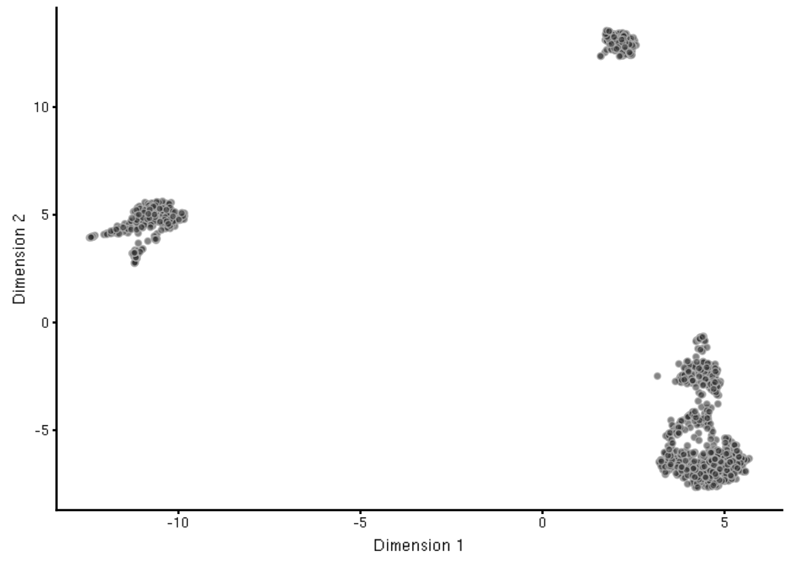
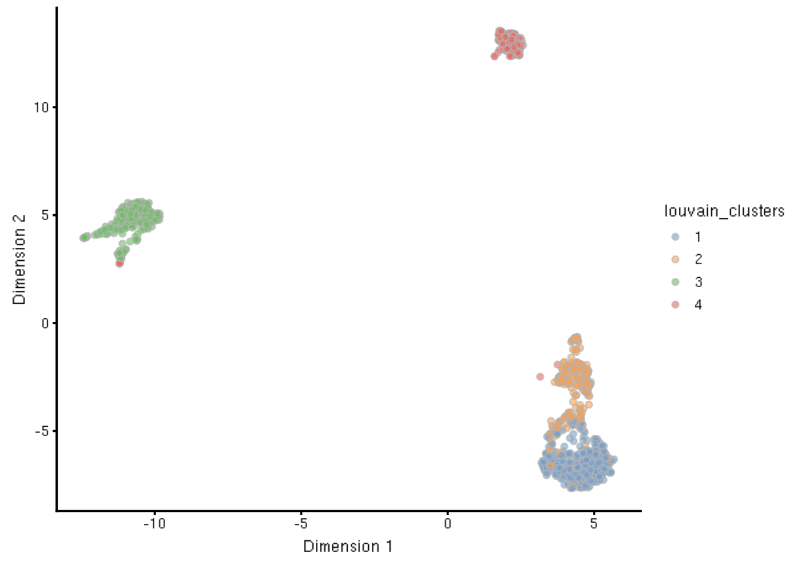
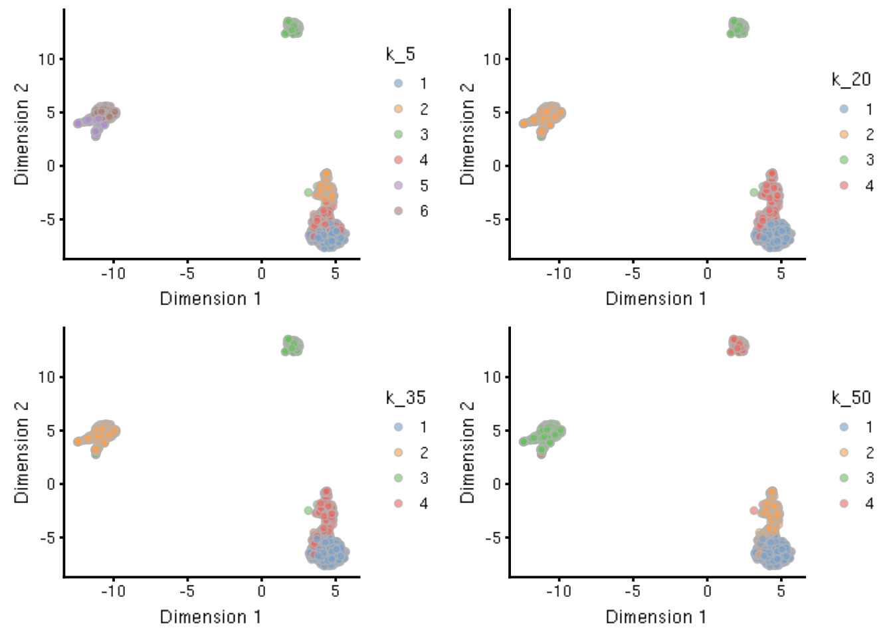
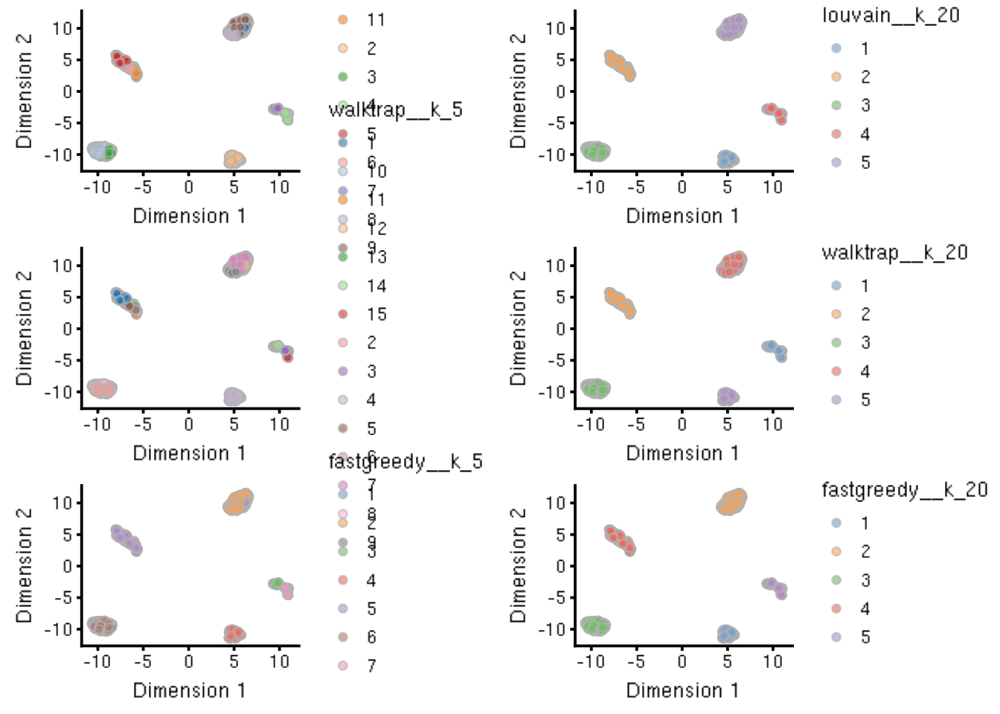
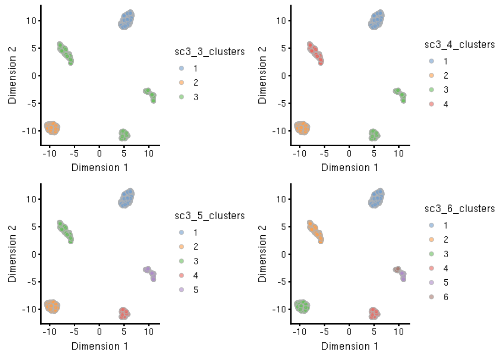

# Clustering


Data derived from single-cell assays have enabled researchers to unravel tissue heterogeneity at unprecedented levels of detail, enabling the identification of novel cell types, as well as rare cell populations that were previously unidentifiable using bulk assays. Clustering - the process of grouping cells - is a fundamental step in deconvoluting heterogeneous single-cell data into distinct groups of cells with similar expression profiles. These clusters are interpreted as proxies for more abstract biological concepts such as discrete cell types or cell states.

Here we will work with a dataset that contains labeled cell type populations to highlight different approaches to clustering scRNA-seq data.


## Understanding the Data

To follow along with this chapter, we will be using the 5 cell line data from the [*CellBench_data*](https://github.com/LuyiTian/CellBench_data) repository. We will load the original dataset, and then subsample down to 1000 cells to make performing downstream calculations faster:


```r
library(here)
sce <- readRDS(here('_rfiles/_data/cellbench_sce_sc_10x_5cl_qc.rds'))

sce <- sce[, sample(ncol(sce), 1000)]
sce
```

```
## class: SingleCellExperiment 
## dim: 11786 1000 
## metadata(3): scPipe Biomart log.exprs.offset
## assays(3): counts cpm logcounts
## rownames(11786): COL27A1 SLC35B1 ... RAC2 ANKH
## rowData names(9): is_feature_control mean_counts ...
##   n_cells_counts pct_dropout_counts
## colnames(1000): Lib90_00161 Lib90_02552 ... Lib90_02631
##   Lib90_00992
## colData names(30): unaligned aligned_unmapped ...
##   cell_line_demuxlet demuxlet_cls
## reducedDimNames(0):
## spikeNames(0):
```

The per cell labels pertaining to the 5 cell lines assayed can be found within the `colData` component under the column name `cell_line`. We can count the number of instances of each cell line present in our subsampled dataset as follows:


```r
table(sce$cell_line)
```

```
## 
##   A549  H1975  H2228   H838 HCC827 
##    312    121    219    202    146
```

Before continuing, we will perform feature selection and dimensionality reduction that will be used downstream by the clustering methods and visualizations. 


```r
library(BiocSingular)
library(scater)
library(scran)

## feature selection
fit <- trendVar(sce, use.spikes = FALSE)
dec <- decomposeVar(sce, fit)
hvg_genes <- rownames(dec[dec$bio > 0, ]) # ~4k genes

## dimensionality reduction
set.seed(1234)
sce <- runPCA(sce, ncomponents = 20,
              feature_set = hvg_genes,
              BSPARAM = IrlbaParam())
## plot(attr(reducedDim(sce, 'PCA'), 'percentVar')) ## elbow plot
sce <- runUMAP(sce, n_dimred = 20)
```

We can now visualize the 5 cell lines via UMAP:


```r
plotUMAP(sce, colour_by = 'cell_line')
```



One thing to note is that, per our UMAP visualization, cell line H1975 appears to be two primary clusters, with some cells resembling the H838 cell line.


## Manual Clustering

Low-level clustering relies on building the shared- or k-nearest neighbors graphs manually, and then applying a graph-based clustering algorithm based on the resulting graph. One such wrapper to construct the SNN/KNN graph comes from the `scran` package's `buildSNNGraph()` and `buildKNNGraph()` functions, respectively. The resulting `igraph` object from these functions can then be fed into any number of clustering algorithms provided by `igraph`. For example, louvain clustering is a popular algorithm that is implemented in the `cluster_louvain()` function.

Further, one additional parameter to note in the `buildSNNGraph()` function below is the `BNPARAM`, which provides even finer control over nearest-neighbors detection via the `BiocNeighbors` package. This parameter allows the user to specify an implementation from `BiocNeighbors` to use that has been designed for high-dimensional data. Here, we highlight the use of an approximate method via the Annoy algorithm by way of providing `AnnoyParam()`.


```r
g <- buildSNNGraph(sce, k = 50, use.dimred = 'PCA')
louvain_clusters <- igraph::cluster_louvain(g)$membership

sce$louvain_clusters <- as.factor(louvain_clusters)
```

We can then inspect the results of our clustering both on the UMAP as well as via a confusion matrix:


```r
plotUMAP(sce, colour_by = 'louvain_clusters')
```

<div class="figure">

<p class="caption">(\#fig:unnamed-chunk-6)Louvain clustering applied to an SNN graph constructed with k=50.</p>
</div>

```r
table(sce$louvain_clusters, sce$cell_line)
```

```
##    
##     A549 H1975 H2228 H838 HCC827
##   1    0     7     0    0    146
##   2    0    11     0  202      0
##   3    0     0   219    0      0
##   4  312     3     0    0      0
##   5    0   100     0    0      0
```

Overall at this k, we see that the clusters align very sensibly with the cell lines of origins.


### Varying `k`

While our first try appeared to work fairly well, this may not always be the case. Furthermore, checking the stability of clustering is sensible to ensure that a clustering result is robust. 

To iterate over the varying `k` parameter (the number of nearest neighbors to draw the graph with), we utilize the `purrr` functional programming library in this example, but note that `lapply` works equally well.


```r
library(purrr)

## Iterate over varying k for SNNGraph construction
k_v <- seq(5, 50, by = 15)
g_l <- map(k_v, function(x) {
    buildSNNGraph(sce, k = x, use.dimred = 'PCA')
})
names(g_l) <- paste0('k_', k_v)

## Iterate over resulting graphs to apply louvain clustering
lc_l <- map(g_l, function(g) {
    igraph::cluster_louvain(g)$membership
})
names(lc_l) <- paste0('k_', k_v)

## Coerce louvain cluster results list to dataframe of factors
lc_df <- data.frame(do.call(cbind, lc_l))
lc_df <- apply(lc_df, 2, as.factor)

## Append results to colData for plotting
colData(sce) <- cbind(colData(sce), lc_df)
```

Now we can plot across our various k's on the UMAP for ease of interpretation. Note that we use the *patchwork* package to combine the multiple `ggplot` objects that are generated by the `plotUMAP()` function.


```r
library(patchwork)
p_l <- map(colnames(lc_df), ~ plotUMAP(sce, colour_by = .))
wrap_plots(p_l, ncol = 2)
```

<div class="figure">

<p class="caption">(\#fig:unnamed-chunk-8)Varying k, from top left clockwise, k is set to 5, 20, 50, and 35.</p>
</div>


### Varying Clustering Algorithms

Another area for tweaking is in the clustering algorithm applied, as there are various community detection methods available through packages such as `igraph`. Here, we demonstrate a few select clustering methods - louvain, walktrap, and fast/greedy - across two different sets of graphs generated above, where k equaled 5 or 20:


```r
## Clustering functions (cf)
cf_l <- list(louvain = igraph::cluster_louvain,
             walktrap = igraph::cluster_walktrap,
             fastgreedy = igraph::cluster_fast_greedy)

## Cluster assignments (ca) per function with k_5 and k_20 graphs
ca_l <- map2(c(cf_l, cf_l),
     c(g_l[rep(c(1:2), each = length(cf_l))]),
     function(f, g) {
         f(g)$membership
})
names(ca_l) <- paste0(rep(names(cf_l), 2), '__',
                      rep(names(g_l)[1:2], each = 3))

## Coerce clustering results list to dataframe of factors
ca_df <- data.frame(do.call(cbind, ca_l))
ca_df <- apply(ca_df, 2, as.factor)

## Append results to colData for plotting
colData(sce) <- cbind(colData(sce), ca_df)
```


```r
p_l <- map(colnames(ca_df), ~ plotUMAP(sce, colour_by = .))
wrap_plots(p_l, ncol = 2, byrow = FALSE)
```

<div class="figure">

<p class="caption">(\#fig:unnamed-chunk-10)Three clustering methods (by row, top to bottom: louvain, walktrap, and fast/greedy) were applied to two graphs (by column, left to right: k=5, k=20). Clustering results are shown as different colors on the UMAP projection.</p>
</div>

We can see from this result that the choice of clustering method was largely a non-factor in the k=20 case, whereas the more granular clustering method of k=5 did indeed produce some variation, particularly between the louvain/walktrap vs the fast-greedy.


## Automated Clustering

Automated clustering frameworks seek to find an "optimal" number of clusters. The *SC3* package provides a simple framework that allows users to test for a variable number of clusters. Additionally, the *SC3* package provides handy visualizations to qualitatively assess the clustering results.

Before we use the *SC3* package, we first set a required `rowData` column for *SC3* to work:


```r
## SC3 requires this column to be appended
rowData(sce)$feature_symbol <- rownames(sce) 
```

And now we run the `sc3()` function to test for variable numbers of clusters by setting the `ks` argument. Here we search for 3 to 7 clusters:


```r
library(SC3)

## SC3 will return an SCE object with appended "sc3_" columns
sce <- sc3(sce,
           ks = 3:6,
           k_estimator = TRUE)
```

After using `sc3()`, the function returns the original `SingleCellExperiment` object, but with new columns in `colData(sce)` corresponding to the different `ks` supplied to the function, as well as a full representation of the analysis that is stored in `metadata(sce)$sc3`, which includes an estimate of the optimal `k` (as dictated by the `k_estimator = TRUE` argument above). 

Below, we show the clustering results of the `ks` we supplied, 3 through 6, shown on the UMAP representation of the data. 


```r
sc3_cols <- paste0('sc3_', 3:6, '_clusters')

p_l <- map(sc3_cols, ~ plotUMAP(sce, colour_by = .))

wrap_plots(p_l, ncol = 2)
```



To access all the output generated by `sc3()`, we can inspect the `metadata` component of our `sce` object:


```r
str(metadata(sce)$sc3, 1)
```

```
## List of 8
##  $ kmeans_iter_max: num 1e+09
##  $ kmeans_nstart  : num 1000
##  $ n_dim          : int [1:15] 44 67 50 47 40 46 43 63 51 68 ...
##  $ rand_seed      : num 1
##  $ n_cores        : num 15
##  $ k_estimation   : num 14
##  $ transformations:List of 6
##   ..- attr(*, "rng")=List of 6
##  $ consensus      :List of 4
```

The parameters and various outputs from `sc3()` are saved shown to be saved in a list. For example, we can access the estimated `k` (as we asked for via the `k_estimator = TRUE` argument to `sc3()`) by inspecting this list as follows below. Based on our data, `sc3()` estimates the optimal `k` to be:


```r
metadata(sce)$sc3$k_estimation
```

```
## [1] 14
```

The *SC3* package contains many more utilities for exploring the stability of clustering and can even produce differential expression analysis results using the `biology = TRUE` argument within the `sc3()` function. We leave it to the interested reader to [learn more advanced features in *SC3*](https://bioconductor.org/packages/release/bioc/html/SC3.html) via their vignette.
