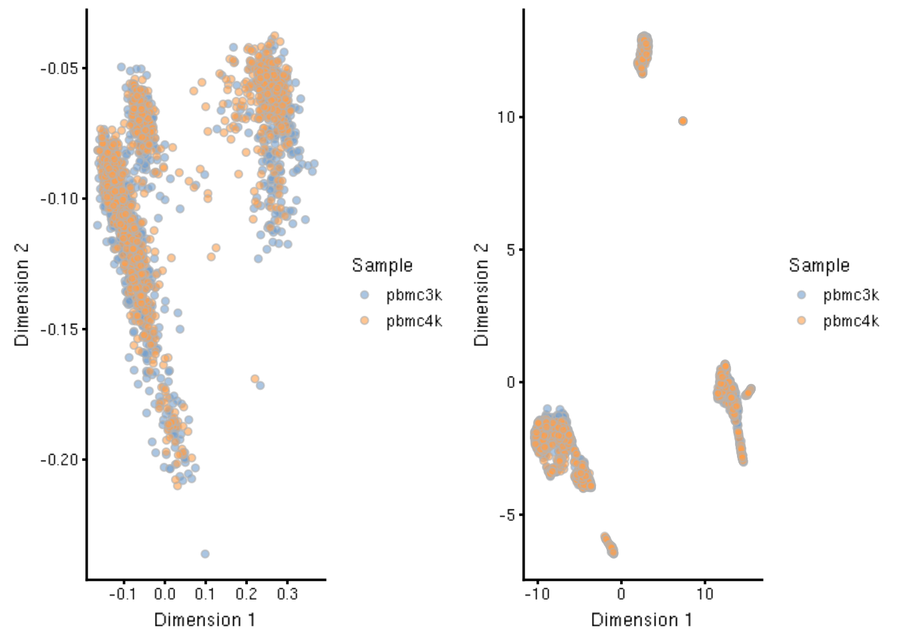
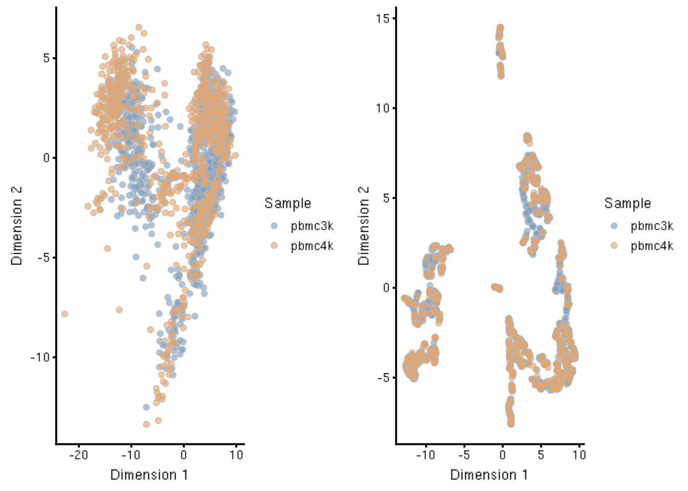
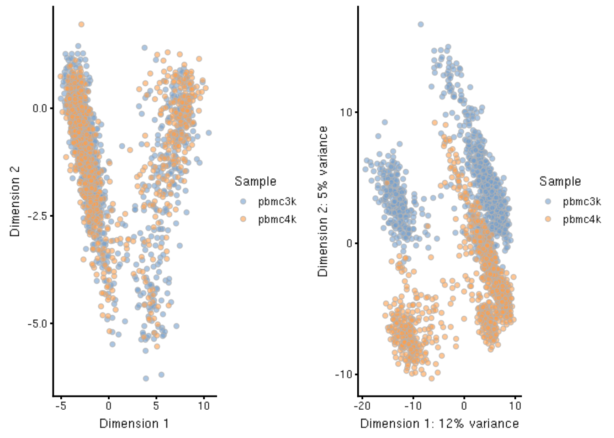
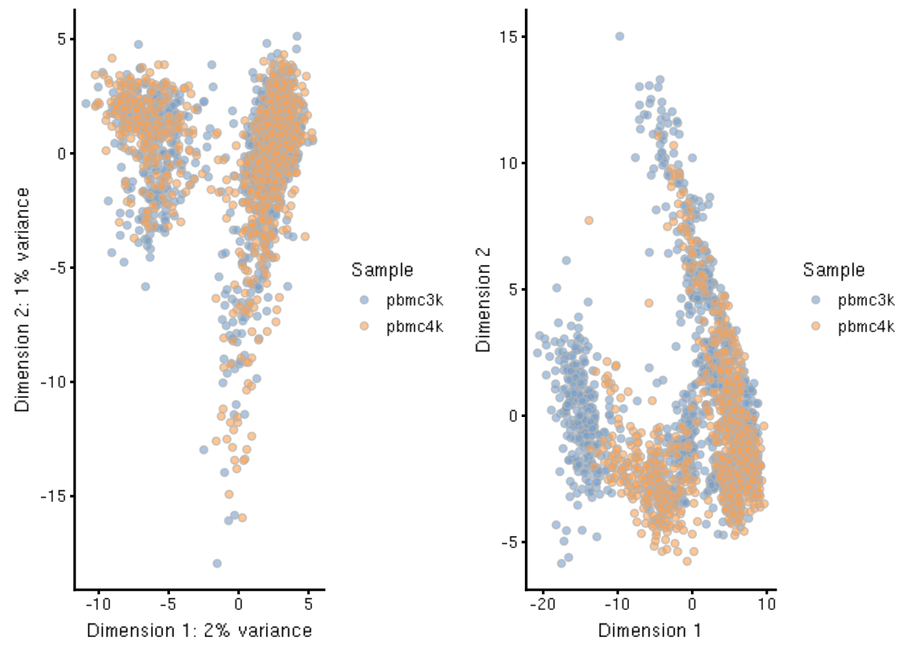
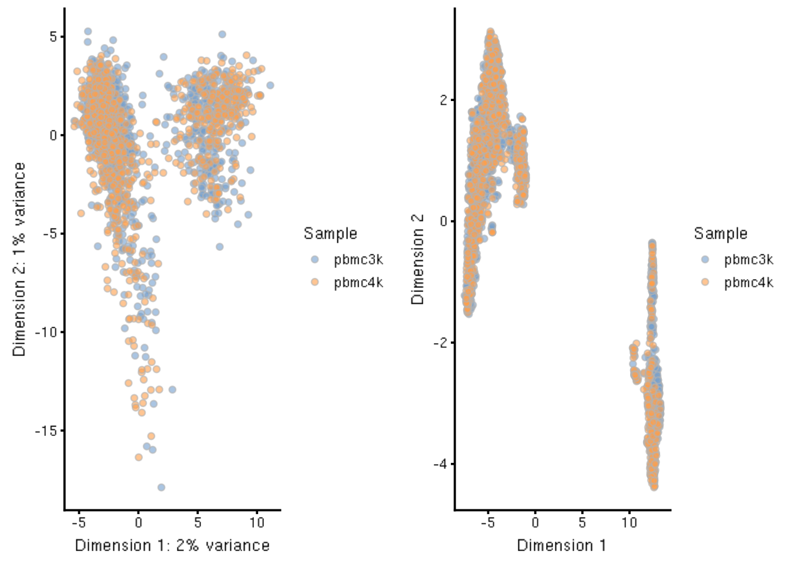

# Integrating Datasets


As scRNA-seq approaches continue to gain in popularity, projects that combine independently generated datasets will become increasingly common. While generalized linear modeling frameworks can be used to integrate disparate datasets, the performance of these frameworks in the scRNA-seq context may be sub-optimal, often due to an underlying assumption that the composition of cell populations is either known or identical across batches of cells. This has inspired a new class of methods that leverage the unique properties of scRNA-seq to improve the amelioration of batch effects, which we demonstrate here.

Here we will work with two PBMC datasets from the *TENxPBMCData* package - the `pbmc3k` and `pbmc4k` datasets - that come from different donors, and integrate them to produce an integrated representation of the data.


## Preprocessing

Before proceeding to the integration section, we will first load the data, and subsequently run it through a preprocessing pipeline that ensures we have a common set of genes across both experiments, filters out poor quality cells, and normalizes the expression matrix. The code for this is shown below for completeness. 

Note that here we make use of the *purrr* package both for code succinctness and to apply the same function to each PBMC dataset contained within the `pbmc_l` list. (see base `lapply()` and `purrrr::map()` for more details).

Furthermore, to speed up computation, we will subsample each of these datasets down to 1000 cells each.


```r
## Load the data
library(TENxPBMCData)
pbmc3k <- TENxPBMCData('pbmc3k')
pbmc4k <- TENxPBMCData('pbmc4k')
pbmc_l <- list(pbmc3k = pbmc3k, pbmc4k = pbmc4k)

## Subsample data to 1000 cells each
library(purrr)
set.seed(1234)
pbmc_l <- map(pbmc_l, function(x) { x[, sample(ncol(x), 1000)] })

## Retain common genes (rows); reorder rows by common genes
common_genes <- reduce(map(pbmc_l, rownames), intersect)
pbmc_l <- map(pbmc_l, function(x) { x[common_genes, ] })

## Save rowData from first object
## remove from each individual object else `cbind` will throw an error
rd <- rowData(pbmc_l[[1]])
pbmc_l <- map(pbmc_l, function(x) {
    rowData(x) <- NULL
    return(x)
})

## Combine the objects via `cbind`
sce <- reduce(pbmc_l, cbind)

## Replace rowData within combined object
## Uniquify row ids to use mostly human readable rownames
rowData(sce) <- rd
rownames(sce) <- scater::uniquifyFeatureNames(rd$ENSEMBL_ID, rd$Symbol_TENx)

## Calculate and apply QC metrics; filter out cells with low lib or low genes detected
library(scater)
sce <- calculateQCMetrics(sce)
low_lib <- isOutlier(sce$log10_total_counts, type = "lower", nmad = 3)
low_genes <- isOutlier(sce$log10_total_features_by_counts, type = "lower", nmad = 3)
sce <- sce[, !(low_lib | low_genes)]

## normalize data
sce <- normalize(sce)
```

From the combined dataset encapsulated within `sce`, we note that the origin of each cell is annotated within `colData` under the column `Sample`. This will be used as the batch variable throughout.


```r
table(sce$Sample) # alternately: colData(sce)$Sample
```

```
## 
## pbmc3k pbmc4k 
##    990   1000
```


## Fast MNN

The *batchelor* package provides the `fastMNN()` function, which calculates a dimension reduced representation based on the original principal components derived directly from the normalized expression data. These MNN coordinates can then be used for further dimensionality reduction via UMAP as shown below.


```r
library(batchelor)

## run MNN with no advanced preprocessing
tmp <- batchelor::fastMNN(sce, batch = sce$Sample)
reducedDim(sce, 'MNN_simple') <- reducedDim(tmp, 'corrected')

## run UMAP on the "simple MNN" version
tmp <- runUMAP(sce, use_dimred = 'MNN_simple')
reducedDim(sce, 'UMAP_MNN_simple') <- reducedDim(tmp, 'UMAP')
```


```r
library(patchwork)
p1 <- plotReducedDim(sce, 'MNN_simple', colour_by = 'Sample')
p2 <- plotReducedDim(sce, 'UMAP_MNN_simple', colour_by = 'Sample')
wrap_plots(p1, p2, nrow = 1)
```

<div class="figure">

<p class="caption">(\#fig:unnamed-chunk-4)Simple MNN method. First two MNN coordinates (left) and UMAP derived from the full MNN coordinate set (right).</p>
</div>

## Harmony

Harmony provides a unified framework for data visualization, analysis, and interpretation of scRNA-seq data. Included is a method for integrating different batches of scRNA-seq. This produces a new dimension reduction representation, saved as `HARMONY` within the *SingleCellExperiment* object, as shown below. Furthermore, this Harmony embedding can be used to produce a UMAP representation as well:


```r
library(harmony) # devtools::install_github('immunogenomics/harmony')
library(BiocSingular)

## Add PCA to sce, then run Harmony as its dependent on PCA
sce <- runPCA(sce, BSPARAM = IrlbaParam())
sce <- RunHarmony(sce, group.by.vars = "Sample")

## Calculate UMAP on Harmony embeddings
tmp <- runUMAP(sce, use_dimred = 'HARMONY')
reducedDim(sce, 'UMAP_HARMONY') <- reducedDim(tmp, 'UMAP')
```


```r
p1 <- plotReducedDim(sce, 'HARMONY', colour_by = 'Sample')
p2 <- plotReducedDim(sce, 'UMAP_HARMONY', colour_by = 'Sample')
wrap_plots(p1, p2, nrow = 1)
```

<div class="figure">

<p class="caption">(\#fig:unnamed-chunk-6)Plot of the first two components of the Harmony embedding (left). UMAP calculated on the Harmony embeddings. (right)</p>
</div>


## Advanced MNN Workflow

Here we work through a more advanced workflow using MNN as above, but this time walking through the various steps that are otherwise implicit within the `fastMNN()` function. While not always necessary, it may be informative for those interested in the finer details of a batch correction workflow. Note that this follows the 

For more details, we refer to the [`compareSingleCell` vignette](https://github.com/MarioniLab/compareSingleCell/) vignette by Aaron Lun.


### Feature Selection

We briefly highlight feature selection within the preprocessing, as the choice of genes used in the integration can have an outsize effect on end result. 

For brevity, here we use the `scran` package to identify the genes with biological coefficients of variation greater than zero, but leave the choice of method up to the reader. Note that, compared to the basic analysis workflow, we use the `multiBlockVar()` function and block on the origin (`pbmc3k` vs `pbmc4k`). This function models the variance of expression in each block separately.

Additionally, we turn off weighting such that each sample contributes equally to the results, regardless of the number of cells per sample. This prevents one condition from biasing the combined statistics. 

For more details, we refer to the [`compareSingleCell` merge](https://github.com/MarioniLab/compareSingleCell/blob/master/vignettes/embryo_merge.Rmd) vignette.


```r
library(scran)
dec <- multiBlockVar(sce, block = sce$Sample,
                     make.tech.trend = TRUE,
                     weighted = FALSE)

hvg_genes <- rownames(dec)[dec$bio > 0]
```

In this example, we get back 10671 genes from the method to use for the integration. For speed, we will limit ourselves to the top 1000 genes.


```r
hvg_genes_subset <- hvg_genes[1:1000]
```

### Dimensionality Reduction

Principal components analyses can be used to both reduce computational work and remove high-dimensional noise, as discussed in the [simpleSingleCell vignette](https://bioconductor.org/packages/3.9/simpleSingleCell/vignettes/reads.html#denoising-expression-values-using-pca). 

To accomplish this, the `multiBatchPCA()` function from *scran* ensures that each sample contributes equally to the new coordinate space. For further discussion on this point, see the [simpleSingleCell vignette](https://bioconductor.org/packages/3.9/simpleSingleCell/vignettes/batch.html#hierarchical-merging) section on hierarchical merging.

We then calculate the number of PCs to retain by comparing the variance explained per principal component versus the technical noise and total variance in the data. This will leave us with a subset of PCA components.


```r
library(batchelor)
library(BiocSingular) # provide approximate pca via IrlbaParam()

## Calculate PCA by batch
set.seed(1234) # for Random/IrlbaParam

## run batchelor version of multiBatchPCA (use :: notation to override namespace)
pcs <- batchelor::multiBatchPCA(sce, batch = sce$Sample,
                                subset.row = hvg_genes_subset,
                                get.variance = TRUE,
                                BSPARAM = IrlbaParam())

## Retain only the top PCs based on variance explained > technical noise
retain <- denoisePCANumber(
    metadata(pcs)$var.explained, # variance explained per PC.
    sum(dec[hvg_genes_subset, ]$tech),       # technical noise in subset of genes.
    metadata(pcs)$var.total      # total variance in the data
)

retain
```

```
## [1] 7
```

From the number of PCs to retain, we can filter the PCs as follows:


```r
## Subset PCA number of components up to the number in retain
top_pcs <- map(as.list(pcs), ~ .[, 1:retain])
```

Then, using the retained components as input, we can input them directly into the `fastMNN()` method as follows, and furthermore produce a UMAP representation based on these MNN coordinates:


```r
## Calculate MNN coordinates, add into reducedDims
mnn <- batchelor::fastMNN(top_pcs$pbmc3k, top_pcs$pbmc4k, pc.input = TRUE)
reducedDim(sce, 'MNN') <- mnn$corrected

## Run UMAP on MNN coordinates
tmp <- runUMAP(sce, use_dimred = 'MNN')
reducedDim(sce, 'UMAP_MNN') <- reducedDim(tmp, 'UMAP')
```

The MNN coordinates and the UMAP coordinates derived from them are visualized below:


```r
p1 <- plotReducedDim(sce, 'MNN', colour_by = 'Sample')
p2 <- plotReducedDim(sce, 'UMAP_MNN', colour_by = 'Sample')
wrap_plots(p1, p2, nrow = 1)
```

<div class="figure">

<p class="caption">(\#fig:unnamed-chunk-12)Plot of first two MNN coordinates (left). UMAP calculated on the MNN coordinates (right). Colour denotes origin of sample.</p>
</div>

Comparing to the simpler MNN workflow shown above (which only used the `fastMNN()` function on the barely processed *SingleCellExperiment* class object `sce`), we see that the two results are fairly comparable, differing only by the number of principal components and the selected number of features (here we chose 1000 for computational efficacy; we leave it to the interested reader to explore the results with a larger feature space).


## Naive Method Without Correction

For completeness, we show here the results of performing the correction solely on the gene expression matrix.


```r
## run PCA on only the normalized gene expression data
sce <- runPCA(sce, ncomponents = 25,
              feature_set = hvg_genes_subset,
              BSPARAM = IrlbaParam())

## Run UMAP on the norm gene exp. derived PCA coordinates - use only top PCs
sce <- runUMAP(sce, use_dimred = 'PCA', ncomponents = 7)
names(reducedDims(sce))[4] <- 'UMAP_PCA'
```


```r
p1 <- plotPCA(sce, colour_by = 'Sample')
p2 <- plotReducedDim(sce, 'UMAP_PCA', colour_by = 'Sample')
wrap_plots(p1, p2, nrow = 1)
```

<div class="figure">

<p class="caption">(\#fig:unnamed-chunk-14)First two components of PCA calculated directly from the gene expression matrix (left). UMAP calculated on the PCA derived from the normalized gene expression matrix (right).</p>
</div>

While the PCA looks well integrated, the UMAP representation - which encapsulates a fuller PCA space - distinctly shows the residual batch effect present.


## Limma Batch Correction

The `limma` package, a popular framework for the statistical analysis of RNA-seq, has a function `removeBatchEffect()` which will be used here to correct the normalized expression matrix `logcounts` across the two batches. The result will be assigned into the `assays` slot of the `sce` object as `limma_corrected`, and then used for PCA, saving the result in the `reducedDim` slot as `"PCA_limma"`.


```r
library(limma)
limma_corrected <- removeBatchEffect(logcounts(sce), batch = sce$Sample)
assay(sce, "logcounts_limma") <- limma_corrected ## add new assay

## calc a PCA on limma values; save separate to prevent overwriting
tmp2 <- runPCA(sce,
       ncomponents = 25,
       feature_set = hvg_genes_subset,
       exprs_values = "logcounts_limma",
       BSPARAM = IrlbaParam())

## save back into original sce
reducedDim(sce, 'PCA_limma') <- reducedDim(tmp2, 'PCA')

## run UMAP; save separate to prevent overwriting
tmp3 <- runUMAP(sce, use_dimred = 'PCA_limma')
reducedDim(sce, 'UMAP_limma') <- reducedDim(tmp3, 'UMAP')
```

The resulting PCA and UMAP from the limma batch correction method are shown below:


```r
p1 <- plotReducedDim(sce, 'PCA_limma', colour_by = 'Sample')
p2 <- plotReducedDim(sce, 'UMAP_limma', colour_by = 'Sample')
wrap_plots(p1, p2, nrow = 1)
```

<div class="figure">

<p class="caption">(\#fig:unnamed-chunk-16)PCA calculated on the limma batch-corrected gene expression matrix (left). UMAP calculated via the PCA derived from limma batch-corrected gene expression matrix (right).</p>
</div>


<!-- ```{r} -->
<!-- ## chunk for combining 1k cells from pbmc3k and pbmc4k -->
<!-- ## ... -->

<!-- ## separate chunk -->
<!-- ## Create two SCEs, reset reducedDims -->
<!-- sce_mnn_25 <- sce -->
<!-- sce_mnn_7 <- sce -->
<!-- reducedDims(sce_mnn_25) <- reducedDims(sce_mnn_7) <- NULL -->

<!-- ## Run MNN with differing component numbers -->
<!-- retain <- 25 -->
<!-- top_pcs <- map(as.list(pcs), ~ .[, 1:retain]) -->
<!-- mnn <- fastMNN(top_pcs$pbmc3k, top_pcs$pbmc4k, pc.input = TRUE) -->
<!-- reducedDim(sce_mnn_25, 'MNN') <- mnn$corrected -->
<!-- sce_mnn_25 <- runUMAP(sce_mnn_25, use_dimred = 'MNN') -->

<!-- retain <- 7 -->
<!-- top_pcs <- map(as.list(pcs), ~ .[, 1:retain]) -->
<!-- mnn <- fastMNN(top_pcs$pbmc3k, top_pcs$pbmc4k, pc.input = TRUE) -->
<!-- reducedDim(sce_mnn_7, 'MNN') <- mnn$corrected -->
<!-- sce_mnn_7 <- runUMAP(sce_mnn_7, use_dimred = 'MNN') -->

<!-- ## Plot on plot -->
<!-- plotReducedDim(sce_mnn_25, use_dimred = 'UMAP', colour_by = 'Sample') -->
<!-- dev.new() -->
<!-- plotReducedDim(sce_mnn_7, use_dimred = 'UMAP', colour_by = 'Sample') -->
<!-- ``` -->
