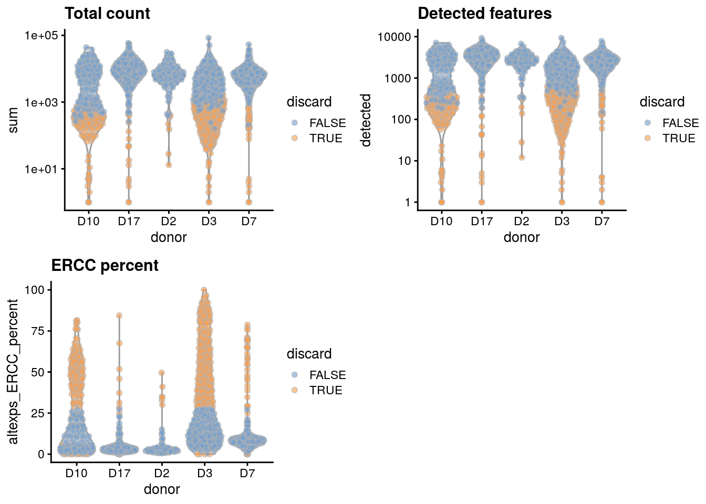
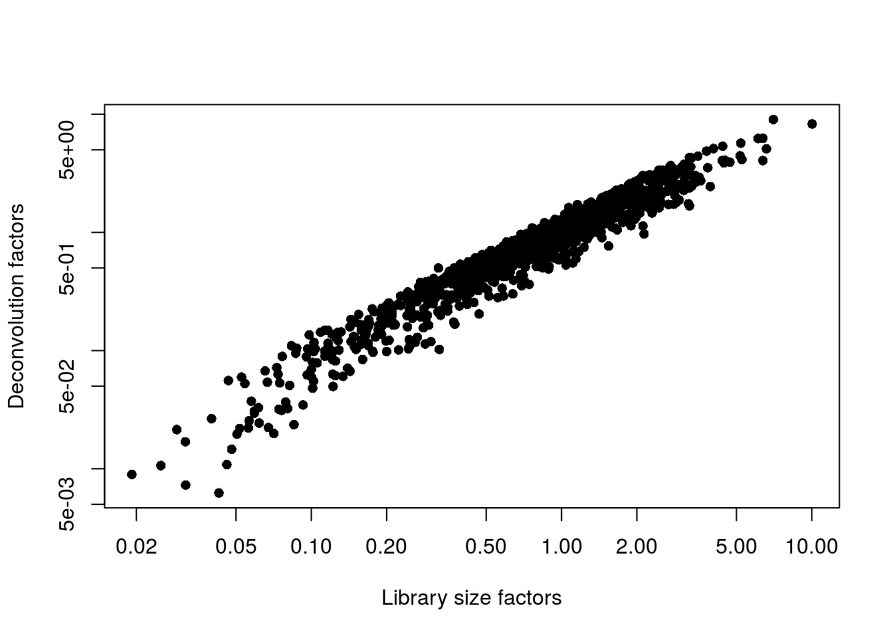
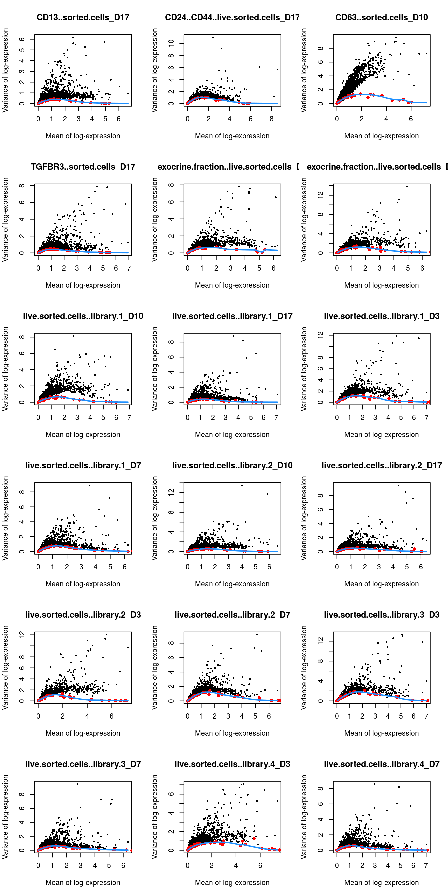

# (PART) Workflows {-}

# Human pancreas dataset (Grun)


## Introduction

This performs an analysis of the @grun2016denovo CEL-seq2 dataset,
consisting of human pancreas cells from various donors.

## Analysis code

### Data loading


```r
library(scRNAseq)
sce.grun <- GrunPancreasData()
```

### Gene annotation

We convert to Ensembl identifiers, and we remove duplicated genes or genes without Ensembl IDs.


```r
library(org.Hs.eg.db)
gene.ids <- mapIds(org.Hs.eg.db, keys=rowData(sce.grun)$symbol,
    keytype="SYMBOL", column="ENSEMBL")

keep <- !is.na(gene.ids) & !duplicated(gene.ids)
sce.grun <- sce.grun[keep,]
rownames(sce.grun) <- gene.ids[keep]
```

### Quality control

This dataset lacks mitochondrial genes so we will do without.


```r
unfiltered <- sce.grun
```


```r
library(scater)
stats <- perCellQCMetrics(sce.grun)
qc <- quickCellQC(stats, percent_subsets="altexps_ERCC_percent", nmads=3)
sce.grun <- sce.grun[,!qc$discard]
```

### Normalization 


```r
library(scran)
set.seed(1000) # for irlba. 
clusters <- quickCluster(sce.grun)
sce.grun <- computeSumFactors(sce.grun, min.mean=0.1, clusters=clusters)
sce.grun <- logNormCounts(sce.grun)
```

### Variance modelling

We block on a combined plate and donor factor.


```r
block <- paste0(sce.grun$sample, "_", sce.grun$donor)
dec.grun <- modelGeneVarWithSpikes(sce.grun, spikes="ERCC", block=block)
```

### Data integration


```r
library(batchelor)
set.seed(1001010)
merged.grun <- fastMNN(sce.grun, batch=sce.grun$donor)
```

### Dimensionality reduction


```r
set.seed(100111)
merged.grun <- runTSNE(merged.grun, dimred="corrected")
```

### Clustering


```r
snn.gr <- buildSNNGraph(merged.grun, use.dimred="corrected")
merged.grun$cluster <- factor(igraph::cluster_walktrap(snn.gr)$membership)
```

## Results

### Quality control statistics


```r
colData(unfiltered) <- cbind(colData(unfiltered), stats)
unfiltered$discard <- qc$discard

gridExtra::grid.arrange(
    plotColData(unfiltered, x="donor", y="sum", colour_by="discard") +
        scale_y_log10() + ggtitle("Total count"),
    plotColData(unfiltered, x="donor", y="detected", colour_by="discard") +
        scale_y_log10() + ggtitle("Detected features"),
    plotColData(unfiltered, x="donor", y="altexps_ERCC_percent",
        colour_by="discard") + ggtitle("ERCC percent"),
    ncol=2
)
```




```r
colSums(as.matrix(qc))
```

```
##              low_lib_size            low_n_features 
##                       101                       149 
## high_altexps_ERCC_percent                   discard 
##                        NA                       438
```

### Normalization


```r
summary(sizeFactors(sce.grun))
```

```
##    Min. 1st Qu.  Median    Mean 3rd Qu.    Max. 
##    0.01    0.43    0.79    1.00    1.29    9.02
```


```r
plot(librarySizeFactors(sce.grun), sizeFactors(sce.grun), pch=16,
    xlab="Library size factors", ylab="Deconvolution factors", log="xy")
```



### Variance modelling


```r
par(mfrow=c(6,3))
blocked.stats <- dec.grun$per.block
for (i in colnames(blocked.stats)) {
    current <- blocked.stats[[i]]
    plot(current$mean, current$total, main=i, pch=16, cex=0.5,
        xlab="Mean of log-expression", ylab="Variance of log-expression")
    curfit <- metadata(current)
    points(curfit$mean, curfit$var, col="red", pch=16)
    curve(curfit$trend(x), col='dodgerblue', add=TRUE, lwd=2)
}
```



### Data integration


```r
metadata(merged.grun)$merge.info$lost.var
```

```
##          D10     D17      D2     D3     D7
## [1,] 0.05924 0.04442 0.00000 0.0000 0.0000
## [2,] 0.00346 0.00611 0.02055 0.0000 0.0000
## [3,] 0.01184 0.01218 0.00556 0.0582 0.0000
## [4,] 0.00478 0.00774 0.00486 0.0103 0.0598
```

### Clustering


```r
table(Cluster=merged.grun$cluster, Donor=merged.grun$batch)
```

```
##        Donor
## Cluster D10 D17  D2  D3  D7
##       1  33  73  34 121  28
##       2  17  77   3  13  77
##       3  14 130   0  12  61
##       4  29 101  40  37 120
##       5  22  33   9  22  14
##       6   5  13   0   1  10
##       7   4  14   0   3   1
##       8  32   5   4  13   3
##       9   6  17   0   7  32
```


```r
plotTSNE(merged.grun, colour_by="cluster")
```


```r
plotTSNE(merged.grun, colour_by="batch")
```


