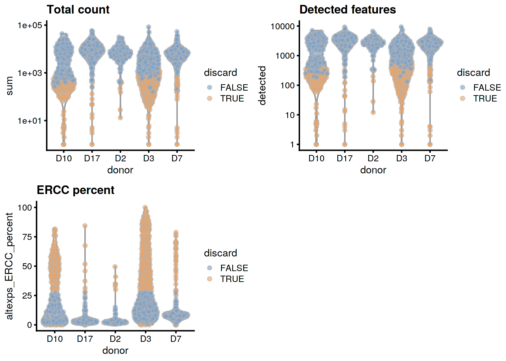
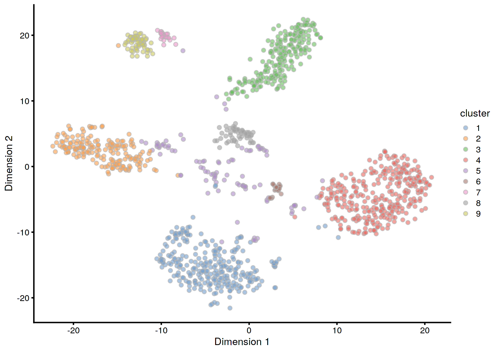
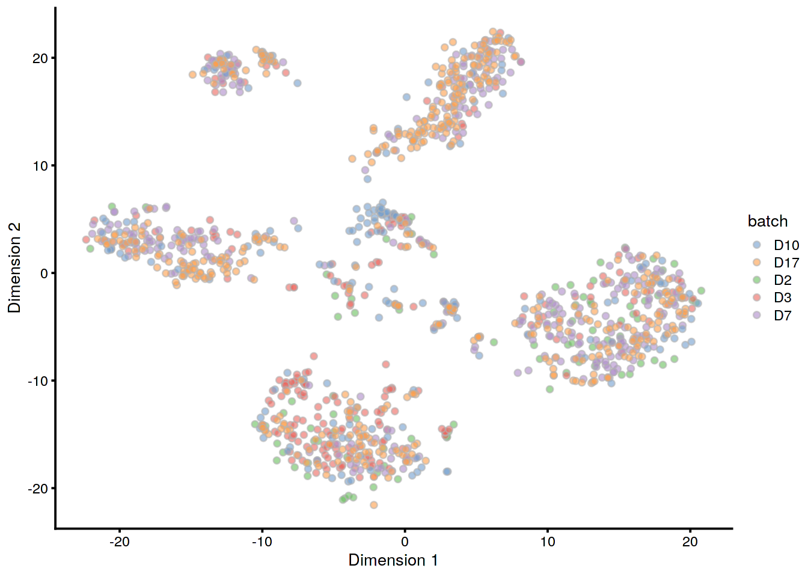

# (PART) Workflows {-}

# Human pancreas dataset (Grun)

<script>
document.addEventListener("click", function (event) {
    if (event.target.classList.contains("aaron-collapse")) {
        event.target.classList.toggle("active");
        var content = event.target.nextElementSibling;
        if (content.style.display === "block") {
          content.style.display = "none";
        } else {
          content.style.display = "block";
        }
    }
})
</script>

<style>
.aaron-collapse {
  background-color: #eee;
  color: #444;
  cursor: pointer;
  padding: 18px;
  width: 100%;
  border: none;
  text-align: left;
  outline: none;
  font-size: 15px;
}

.aaron-content {
  padding: 0 18px;
  display: none;
  overflow: hidden;
  background-color: #f1f1f1;
}
</style>

## Introduction

This performs an analysis of the @grun2016denovo CEL-seq2 dataset,
consisting of human pancreas cells from various donors.

## Analysis code

### Data loading


```r
library(scRNAseq)
sce.grun <- GrunPancreasData()
```

### Gene annotation

We convert to Ensembl identifiers, and we remove duplicated genes or genes without Ensembl IDs.


```r
library(org.Hs.eg.db)
gene.ids <- mapIds(org.Hs.eg.db, keys=rowData(sce.grun)$symbol,
    keytype="SYMBOL", column="ENSEMBL")

keep <- !is.na(gene.ids) & !duplicated(gene.ids)
sce.grun <- sce.grun[keep,]
rownames(sce.grun) <- gene.ids[keep]
```

### Quality control

This dataset lacks mitochondrial genes so we will do without.


```r
unfiltered <- sce.grun
```


```r
library(scater)
stats <- perCellQCMetrics(sce.grun)
qc <- quickCellQC(stats, percent_subsets="altexps_ERCC_percent", nmads=3)
sce.grun <- sce.grun[,!qc$discard]
```

### Normalization 


```r
library(scran)
set.seed(1000) # for irlba. 
clusters <- quickCluster(sce.grun)
sce.grun <- computeSumFactors(sce.grun, min.mean=0.1, clusters=clusters)
sce.grun <- logNormCounts(sce.grun)
```

### Variance modelling

We block on a combined plate and donor factor.


```r
block <- paste0(sce.grun$sample, "_", sce.grun$donor)
dec.grun <- modelGeneVarWithSpikes(sce.grun, spikes="ERCC", block=block)
```

### Data integration


```r
library(batchelor)
set.seed(1001010)
merged.grun <- fastMNN(sce.grun, batch=sce.grun$donor)
```

### Dimensionality reduction


```r
set.seed(100111)
merged.grun <- runTSNE(merged.grun, dimred="corrected")
```

### Clustering


```r
snn.gr <- buildSNNGraph(merged.grun, use.dimred="corrected")
merged.grun$cluster <- factor(igraph::cluster_walktrap(snn.gr)$membership)
```

## Results

### Quality control statistics


```r
colData(unfiltered) <- cbind(colData(unfiltered), stats)
unfiltered$discard <- qc$discard

gridExtra::grid.arrange(
    plotColData(unfiltered, x="donor", y="sum", colour_by="discard") +
        scale_y_log10() + ggtitle("Total count"),
    plotColData(unfiltered, x="donor", y="detected", colour_by="discard") +
        scale_y_log10() + ggtitle("Detected features"),
    plotColData(unfiltered, x="donor", y="altexps_ERCC_percent",
        colour_by="discard") + ggtitle("ERCC percent"),
    ncol=2
)
```




```r
colSums(as.matrix(qc))
```

```
##              low_lib_size            low_n_features 
##                       101                       149 
## high_altexps_ERCC_percent                   discard 
##                        NA                       438
```

### Normalization


```r
summary(sizeFactors(sce.grun))
```

```
##    Min. 1st Qu.  Median    Mean 3rd Qu.    Max. 
##   0.006   0.433   0.788   1.000   1.291   9.016
```


```r
plot(librarySizeFactors(sce.grun), sizeFactors(sce.grun), pch=16,
    xlab="Library size factors", ylab="Deconvolution factors", log="xy")
```


### Variance modelling


```r
par(mfrow=c(6,3))
blocked.stats <- dec.grun$per.block
for (i in colnames(blocked.stats)) {
    current <- blocked.stats[[i]]
    plot(current$mean, current$total, main=i, pch=16, cex=0.5,
        xlab="Mean of log-expression", ylab="Variance of log-expression")
    curfit <- metadata(current)
    points(curfit$mean, curfit$var, col="red", pch=16)
    curve(curfit$trend(x), col='dodgerblue', add=TRUE, lwd=2)
}
```


### Data integration


```r
metadata(merged.grun)$merge.info$lost.var
```

```
##           D10      D17       D2      D3      D7
## [1,] 0.059240 0.044421 0.000000 0.00000 0.00000
## [2,] 0.003461 0.006114 0.020552 0.00000 0.00000
## [3,] 0.011841 0.012180 0.005565 0.05820 0.00000
## [4,] 0.004784 0.007741 0.004861 0.01034 0.05981
```

### Clustering


```r
table(Cluster=merged.grun$cluster, Donor=merged.grun$batch)
```

```
##        Donor
## Cluster D10 D17  D2  D3  D7
##       1  33  73  34 121  28
##       2  17  77   3  13  77
##       3  14 130   0  12  61
##       4  29 101  40  37 120
##       5  22  33   9  22  14
##       6   5  13   0   1  10
##       7   4  14   0   3   1
##       8  32   5   4  13   3
##       9   6  17   0   7  32
```


```r
plotTSNE(merged.grun, colour_by="cluster")
```



```r
plotTSNE(merged.grun, colour_by="batch")
```




## Session Info {-}

<button class="aaron-collapse">View session info</button>
<div class="aaron-content">
```
R version 3.6.1 (2019-07-05)
Platform: x86_64-pc-linux-gnu (64-bit)
Running under: Ubuntu 14.04.5 LTS

Matrix products: default
BLAS:   /home/ramezqui/Rbuild/danbuild/R-3.6.1/lib/libRblas.so
LAPACK: /home/ramezqui/Rbuild/danbuild/R-3.6.1/lib/libRlapack.so

locale:
 [1] LC_CTYPE=en_US.UTF-8       LC_NUMERIC=C              
 [3] LC_TIME=en_US.UTF-8        LC_COLLATE=en_US.UTF-8    
 [5] LC_MONETARY=en_US.UTF-8    LC_MESSAGES=en_US.UTF-8   
 [7] LC_PAPER=en_US.UTF-8       LC_NAME=C                 
 [9] LC_ADDRESS=C               LC_TELEPHONE=C            
[11] LC_MEASUREMENT=en_US.UTF-8 LC_IDENTIFICATION=C       

attached base packages:
[1] parallel  stats4    stats     graphics  grDevices utils     datasets 
[8] methods   base     

other attached packages:
 [1] batchelor_1.1.14            scran_1.13.25              
 [3] scater_1.13.21              ggplot2_3.2.1              
 [5] org.Hs.eg.db_3.8.2          AnnotationDbi_1.47.1       
 [7] scRNAseq_1.99.6             SingleCellExperiment_1.7.10
 [9] SummarizedExperiment_1.15.9 DelayedArray_0.11.6        
[11] BiocParallel_1.19.3         matrixStats_0.55.0         
[13] Biobase_2.45.1              GenomicRanges_1.37.16      
[15] GenomeInfoDb_1.21.1         IRanges_2.19.16            
[17] S4Vectors_0.23.23           BiocGenerics_0.31.6        
[19] Cairo_1.5-10                BiocStyle_2.13.2           
[21] OSCAUtils_0.0.1            

loaded via a namespace (and not attached):
 [1] bitops_1.0-6                  bit64_0.9-7                  
 [3] httr_1.4.1                    tools_3.6.1                  
 [5] backports_1.1.4               R6_2.4.0                     
 [7] irlba_2.3.3                   vipor_0.4.5                  
 [9] DBI_1.0.0                     lazyeval_0.2.2               
[11] colorspace_1.4-1              withr_2.1.2                  
[13] tidyselect_0.2.5              gridExtra_2.3                
[15] bit_1.1-14                    curl_4.2                     
[17] compiler_3.6.1                BiocNeighbors_1.3.5          
[19] labeling_0.3                  bookdown_0.13                
[21] scales_1.0.0                  rappdirs_0.3.1               
[23] stringr_1.4.0                 digest_0.6.21                
[25] rmarkdown_1.15                XVector_0.25.0               
[27] pkgconfig_2.0.3               htmltools_0.3.6              
[29] limma_3.41.16                 dbplyr_1.4.2                 
[31] rlang_0.4.0                   RSQLite_2.1.2                
[33] shiny_1.3.2                   DelayedMatrixStats_1.7.2     
[35] dplyr_0.8.3                   RCurl_1.95-4.12              
[37] magrittr_1.5                  BiocSingular_1.1.7           
[39] GenomeInfoDbData_1.2.1        Matrix_1.2-17                
[41] Rcpp_1.0.2                    ggbeeswarm_0.6.0             
[43] munsell_0.5.0                 viridis_0.5.1                
[45] edgeR_3.27.13                 stringi_1.4.3                
[47] yaml_2.2.0                    zlibbioc_1.31.0              
[49] Rtsne_0.15                    BiocFileCache_1.9.1          
[51] AnnotationHub_2.17.9          grid_3.6.1                   
[53] blob_1.2.0                    dqrng_0.2.1                  
[55] promises_1.0.1                ExperimentHub_1.11.6         
[57] crayon_1.3.4                  lattice_0.20-38              
[59] cowplot_1.0.0                 locfit_1.5-9.1               
[61] zeallot_0.1.0                 knitr_1.25                   
[63] pillar_1.4.2                  igraph_1.2.4.1               
[65] codetools_0.2-16              glue_1.3.1                   
[67] evaluate_0.14                 BiocManager_1.30.4           
[69] vctrs_0.2.0                   httpuv_1.5.2                 
[71] gtable_0.3.0                  purrr_0.3.2                  
[73] assertthat_0.2.1              xfun_0.9                     
[75] rsvd_1.0.2                    mime_0.7                     
[77] xtable_1.8-4                  later_0.8.0                  
[79] viridisLite_0.3.0             tibble_2.1.3                 
[81] beeswarm_0.2.3                memoise_1.1.0                
[83] statmod_1.4.32                interactiveDisplayBase_1.23.0
```
</div>
