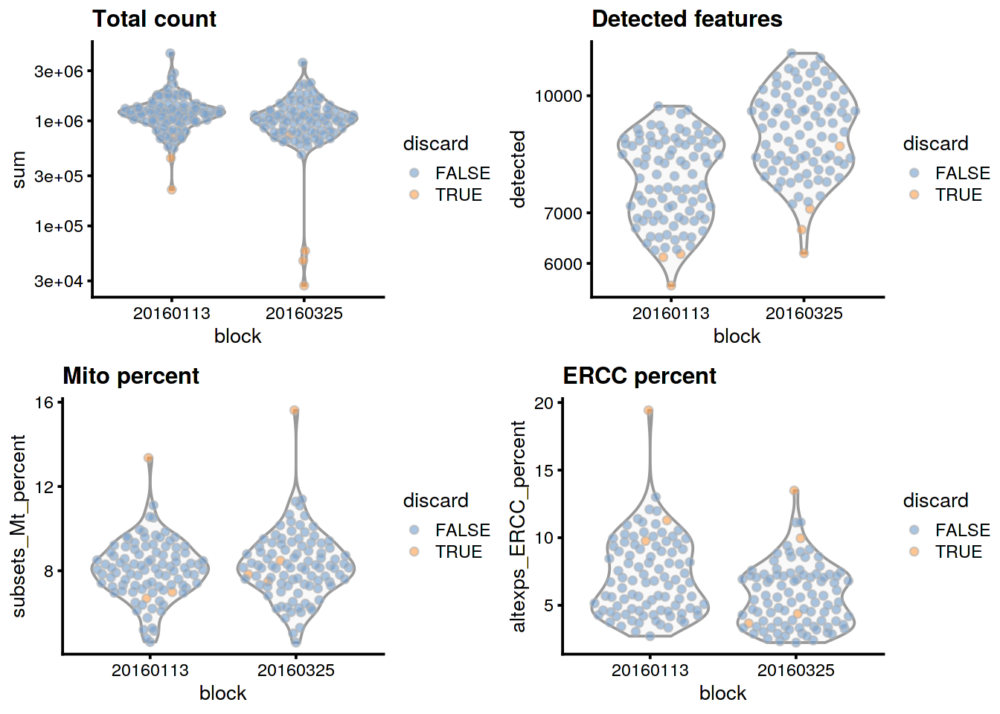
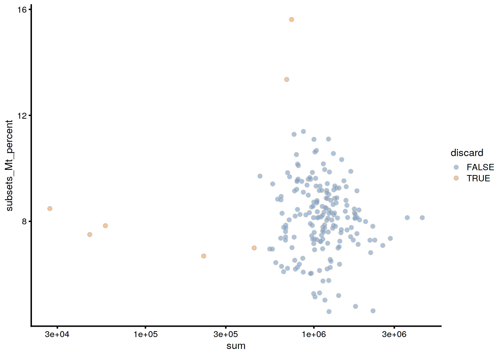
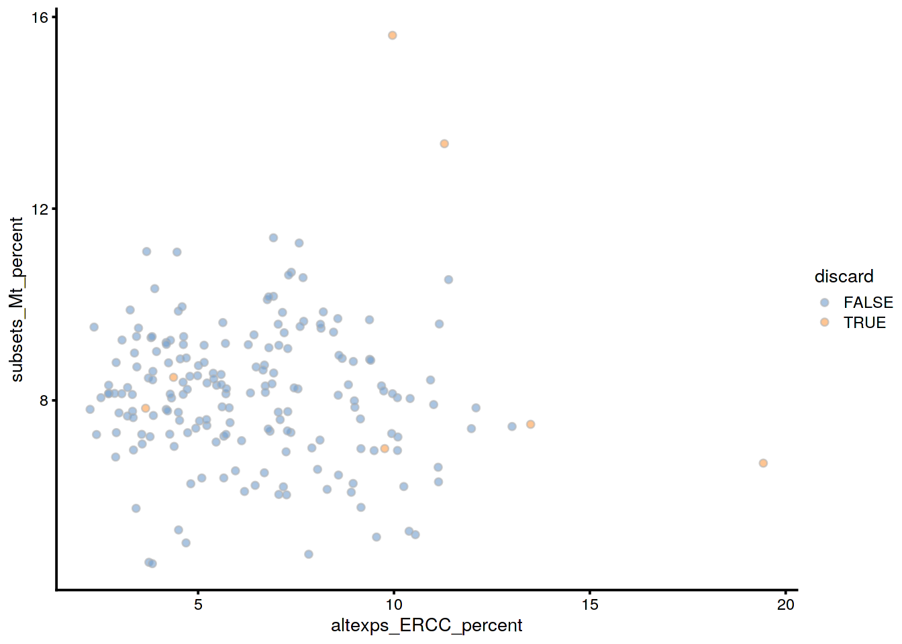
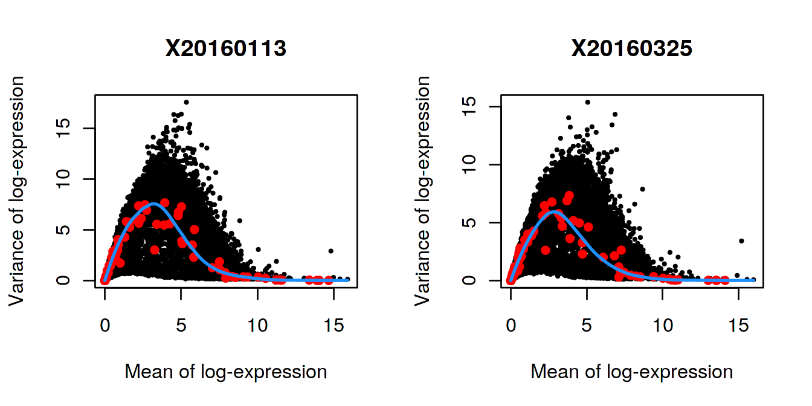
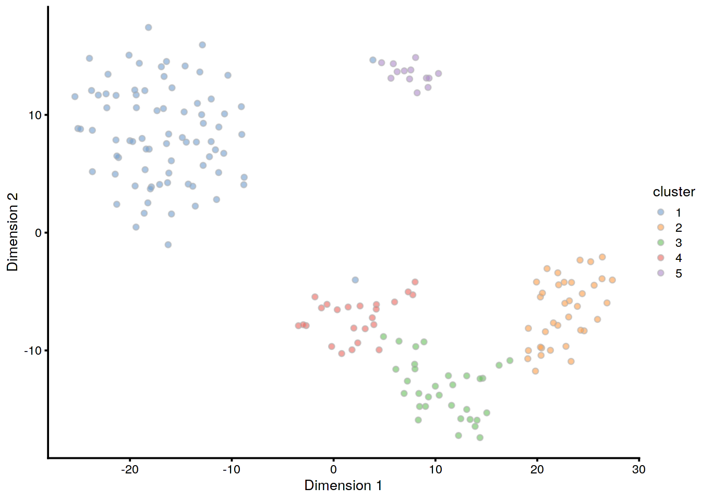
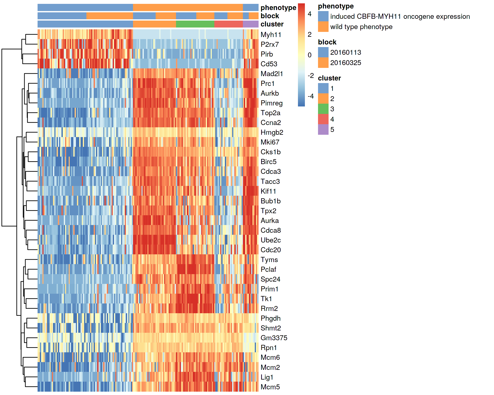

# (PART) Workflows {-}

# 416B Smart-seq2 dataset

<script>
document.addEventListener("click", function (event) {
    if (event.target.classList.contains("aaron-collapse")) {
        event.target.classList.toggle("active");
        var content = event.target.nextElementSibling;
        if (content.style.display === "block") {
          content.style.display = "none";
        } else {
          content.style.display = "block";
        }
    }
})
</script>

<style>
.aaron-collapse {
  background-color: #eee;
  color: #444;
  cursor: pointer;
  padding: 18px;
  width: 100%;
  border: none;
  text-align: left;
  outline: none;
  font-size: 15px;
}

.aaron-content {
  padding: 0 18px;
  display: none;
  overflow: hidden;
  background-color: #f1f1f1;
}
</style>

## Introduction

The @lun2017assessing dataset contains two 96-well plates of 416B cells (an immortalized mouse myeloid progenitor cell line), processed using the Smart-seq2 protocol [@picelli2014fulllength].
A constant amount of spike-in RNA from the External RNA Controls Consortium (ERCC) was also added to each cell's lysate prior to library preparation.
High-throughput sequencing was performed and the expression of each gene was quantified by counting the total number of reads mapped to its exonic regions.
Similarly, the quantity of each spike-in transcript was measured by counting the number of reads mapped to the spike-in reference sequences.

## Analysis code

### Data loading


```r
library(scRNAseq)
sce.416b <- LunSpikeInData(which="416b") 
sce.416b$block <- factor(sce.416b$block)
```

### Gene annotation

Ensembl identifiers are stable but difficult to interpret compared to the gene symbols. 
Thus, we obtain the symbols corresponding to each row using the relevant annotation package.
We also rename the rows of our `SingleCellExperiment` with the symbols, reverting to Ensembl identifiers for missing or duplicate symbols.


```r
library(AnnotationHub)
ens.mm.v97 <- AnnotationHub()[["AH73905"]]
rowData(sce.416b)$ENSEMBL <- rownames(sce.416b)
rowData(sce.416b)$SYMBOL <- mapIds(ens.mm.v97, keys=rownames(sce.416b),
    keytype="GENEID", column="SYMBOL")
rowData(sce.416b)$SEQNAME <- mapIds(ens.mm.v97, keys=rownames(sce.416b),
    keytype="GENEID", column="SEQNAME")

library(scater)
rownames(sce.416b) <- uniquifyFeatureNames(rowData(sce.416b)$ENSEMBL, 
    rowData(sce.416b)$SYMBOL)
```

### Quality control

We save an unfiltered copy of the `SingleCellExperiment` for later use.


```r
unfiltered <- sce.416b
```

Technically, we do not need to use the mitochondrial proportions as we already have the spike-in proportions (which serve a similar purpose) for this dataset.
However, it probably doesn't do any harm to include it anyway.


```r
mito <- which(rowData(sce.416b)$SEQNAME=="MT")
stats <- perCellQCMetrics(sce.416b, subsets=list(Mt=mito))
qc <- quickPerCellQC(stats, percent_subsets=c("subsets_Mt_percent",
    "altexps_ERCC_percent"), batch=sce.416b$block)
sce.416b <- sce.416b[,!qc$discard]
```

### Normalization

No pre-clustering is performed here, as the dataset is small and all cells are derived from the same cell line anyway.


```r
library(scran)
sce.416b <- computeSumFactors(sce.416b)
sce.416b <- logNormCounts(sce.416b)
```

### Variance modelling

We block on the plate of origin to minimize plate effects, 
and then we take the top 10% of genes with the largest biological components.


```r
dec.416b <- modelGeneVarWithSpikes(sce.416b, "ERCC", block=sce.416b$block)
chosen.hvgs <- getTopHVGs(dec.416b, prop=0.1)
```

### Batch correction

The composition of cells is expected to be the same across the two plates, 
hence the use of `removeBatchEffect()` rather than more complex methods.
For larger datasets, consider using `regressBatches()` from the *[batchelor](https://bioconductor.org/packages/3.10/batchelor)* package.


```r
library(limma)
assay(sce.416b, "corrected") <- removeBatchEffect(logcounts(sce.416b), 
    design=model.matrix(~sce.416b$phenotype), batch=sce.416b$block)
```

### Dimensionality reduction

We do not expect a great deal of heterogeneity in this dataset, so we only request 10 PCs.
We use an exact SVD to avoid warnings from *[irlba](https://CRAN.R-project.org/package=irlba)* about handling small datasets.


```r
sce.416b <- runPCA(sce.416b, ncomponents=10, subset_row=chosen.hvgs,
    exprs_values="corrected", BSPARAM=BiocSingular::ExactParam())

set.seed(1010)
sce.416b <- runTSNE(sce.416b, dimred="PCA", perplexity=10)
```

### Clustering


```r
my.dist <- dist(reducedDim(sce.416b, "PCA"))
my.tree <- hclust(my.dist, method="ward.D2")

library(dynamicTreeCut)
my.clusters <- unname(cutreeDynamic(my.tree, distM=as.matrix(my.dist),
    minClusterSize=10, verbose=0))
sce.416b$cluster <- factor(my.clusters)
```

## Results

### Quality control statistics


```r
colData(unfiltered) <- cbind(colData(unfiltered), stats)
unfiltered$block <- factor(unfiltered$block)
unfiltered$discard <- qc$discard

gridExtra::grid.arrange(
    plotColData(unfiltered, x="block", y="sum", 
        colour_by="discard") + scale_y_log10() + ggtitle("Total count"),
    plotColData(unfiltered, x="block", y="detected", 
        colour_by="discard") + scale_y_log10() + ggtitle("Detected features"),
    plotColData(unfiltered, x="block", y="subsets_Mt_percent", 
        colour_by="discard") + ggtitle("Mito percent"),
    plotColData(unfiltered, x="block", y="altexps_ERCC_percent", 
        colour_by="discard") + ggtitle("ERCC percent"),
    nrow=2,
    ncol=2
)
```




```r
plotColData(unfiltered, x="sum", y="subsets_Mt_percent", 
    colour_by="discard") + scale_x_log10()
```



```r
plotColData(unfiltered, x="altexps_ERCC_percent", y="subsets_Mt_percent",
    colour_by="discard") 
```




```r
colSums(as.matrix(qc))
```

```
##              low_lib_size            low_n_features 
##                         5                         0 
##   high_subsets_Mt_percent high_altexps_ERCC_percent 
##                         2                         2 
##                   discard 
##                         7
```

### Normalization


```r
summary(sizeFactors(sce.416b))
```

```
##    Min. 1st Qu.  Median    Mean 3rd Qu.    Max. 
##   0.347   0.711   0.921   1.000   1.152   3.604
```

We see that the induced cells have size factors that are systematically shifted from the uninduced cells,
consistent with the presence of a composition bias.


```r
plot(librarySizeFactors(sce.416b), sizeFactors(sce.416b), pch=16,
    xlab="Library size factors", ylab="Deconvolution factors", 
    col=c("black", "red")[grepl("induced", sce.416b$phenotype)+1],
    log="xy")
```


### Variance modelling


```r
par(mfrow=c(1,2))
blocked.stats <- dec.416b$per.block
for (i in colnames(blocked.stats)) {
    current <- blocked.stats[[i]]
    plot(current$mean, current$total, main=i, pch=16, cex=0.5,
        xlab="Mean of log-expression", ylab="Variance of log-expression")
    curfit <- metadata(current)
    points(curfit$mean, curfit$var, col="red", pch=16)
    curve(curfit$trend(x), col='dodgerblue', add=TRUE, lwd=2)
}
```



### Dimensionality reduction


```r
ncol(reducedDim(sce.416b, "PCA"))
```

```
## [1] 10
```

### Clustering

We compare the clusters to the plate of origin.
Each cluster is comprised of cells from both batches, indicating that the clustering is not driven by a batch effect.


```r
table(Cluster=sce.416b$cluster, Plate=sce.416b$block)
```

```
##        Plate
## Cluster 20160113 20160325
##       1       40       38
##       2       37       32
##       3       10       14
##       4        6        8
```

We compare the clusters to the oncogene induction status.
We observe differences in in the composition of each cluster, consistent with a biological effect of oncogene induction.


```r
table(Cluster=sce.416b$cluster, Oncogene=sce.416b$phenotype)
```

```
##        Oncogene
## Cluster induced CBFB-MYH11 oncogene expression wild type phenotype
##       1                                     78                   0
##       2                                      0                  69
##       3                                      1                  23
##       4                                     14                   0
```


```r
plotTSNE(sce.416b, colour_by="cluster")
```



Most cells have relatively small positive widths in the silhouette plot below, indicating that the separation between clusters is weak.
This may be symptomatic of over-clustering where clusters that are clearly defined on oncogene induction status are further split into subsets that are less well separated.
Nonetheless, we will proceed with the current clustering scheme as it provides reasonable partitions for further characterization of heterogeneity.


```r
library(cluster)
clust.col <- scater:::.get_palette("tableau10medium") # hidden scater colours
sil <- silhouette(my.clusters, dist = my.dist)
sil.cols <- clust.col[ifelse(sil[,3] > 0, sil[,1], sil[,2])]
sil.cols <- sil.cols[order(-sil[,1], sil[,3])]
plot(sil, main = paste(length(unique(my.clusters)), "clusters"),
    border=sil.cols, col=sil.cols, do.col.sort=FALSE)
```


### Interpretation


```r
markers <- findMarkers(sce.416b, my.clusters, block=sce.416b$block)
marker.set <- markers[["1"]]
head(marker.set, 10)
```

```
## DataFrame with 10 rows and 6 columns
##             Top              p.value                  FDR
##       <integer>            <numeric>            <numeric>
## Ccna2         1 9.85421668598772e-67  4.5924591443377e-62
## Cdca8         1 1.01448996794399e-41 1.52513840213101e-38
## Pirb          1 4.16554663077011e-33 1.95515769781954e-30
## Cks1b         2 2.98232994474815e-40 3.23229080802427e-37
## Aurkb         2 2.41435546776197e-64 5.62593111097891e-60
## Myh11         2 1.28865409950081e-46 3.75352722832101e-43
## Mcm6          3 1.15877343533364e-28 3.69886830001981e-26
## Cdca3         3 5.02047431193528e-45  1.2314430780707e-41
## Top2a         3 7.25965326958986e-61 1.12776293658655e-56
## Mcm2          4 1.50853796372546e-33 7.98907991607512e-31
##                 logFC.2           logFC.3            logFC.4
##               <numeric>         <numeric>          <numeric>
## Ccna2 -7.13310245267633 -2.20631703724532  -7.34510519589326
## Cdca8 -6.00378219751815 -2.03840963970867   -7.2617478169573
## Pirb   5.28148687893909  5.87819540547819 0.0352848702834082
## Cks1b -6.43381466749891 -4.15385484057129  -6.43853226584289
## Aurkb -6.94062780450867  -1.6553391915966  -6.41621256181855
## Myh11  4.38181921578171  4.29289578732512  0.941049889491085
## Mcm6  -5.44557545692518 -5.82130006100653  -3.58049727055086
## Cdca3 -6.22179351867583 -2.10502332118743  -7.05395104385302
## Top2a  -7.0781109799137 -2.39123404088975  -6.82973432115931
## Mcm2  -5.54196734535358 -6.09177602490117  -3.82381029847084
```


We visualize the expression profiles of the top candidates in the heatmap below to verify that the DE signature is robust.
Most of the top markers have strong and consistent up- or downregulation in cells of cluster 1 compared to some or all of the other clusters.
A cursory examination of the heatmap indicates that cluster 1 contains oncogene-induced cells with strong downregulation of DNA replication and cell cycle genes.
This is consistent with the potential induction of senescence as an anti-tumorigenic response [@wajapeyee2010senescence].


```r
top.markers <- rownames(marker.set)[marker.set$Top <= 10]
plotHeatmap(sce.416b, features=top.markers, columns=order(sce.416b$cluster), 
    colour_columns_by=c("cluster", "block", "phenotype"),
    cluster_cols=FALSE, center=TRUE, symmetric=TRUE, zlim=c(-5, 5)) 
```



## Session Info {-}

<button class="aaron-collapse">View session info</button>
<div class="aaron-content">
```
R version 3.6.1 (2019-07-05)
Platform: x86_64-pc-linux-gnu (64-bit)
Running under: Ubuntu 14.04.5 LTS

Matrix products: default
BLAS:   /home/ramezqui/Rbuild/danbuild/R-3.6.1/lib/libRblas.so
LAPACK: /home/ramezqui/Rbuild/danbuild/R-3.6.1/lib/libRlapack.so

locale:
 [1] LC_CTYPE=en_US.UTF-8       LC_NUMERIC=C              
 [3] LC_TIME=en_US.UTF-8        LC_COLLATE=C              
 [5] LC_MONETARY=en_US.UTF-8    LC_MESSAGES=en_US.UTF-8   
 [7] LC_PAPER=en_US.UTF-8       LC_NAME=C                 
 [9] LC_ADDRESS=C               LC_TELEPHONE=C            
[11] LC_MEASUREMENT=en_US.UTF-8 LC_IDENTIFICATION=C       

attached base packages:
[1] parallel  stats4    stats     graphics  grDevices utils     datasets 
[8] methods   base     

other attached packages:
 [1] cluster_2.1.0               dynamicTreeCut_1.63-1      
 [3] limma_3.41.18               scran_1.13.32              
 [5] scater_1.13.27              ggplot2_3.2.1              
 [7] ensembldb_2.9.6             AnnotationFilter_1.9.0     
 [9] GenomicFeatures_1.37.4      AnnotationDbi_1.47.1       
[11] AnnotationHub_2.17.10       BiocFileCache_1.9.1        
[13] dbplyr_1.4.2                scRNAseq_1.99.8            
[15] SingleCellExperiment_1.7.11 SummarizedExperiment_1.15.9
[17] DelayedArray_0.11.8         BiocParallel_1.19.5        
[19] matrixStats_0.55.0          Biobase_2.45.1             
[21] GenomicRanges_1.37.17       GenomeInfoDb_1.21.2        
[23] IRanges_2.19.17             S4Vectors_0.23.25          
[25] BiocGenerics_0.31.6         Cairo_1.5-10               
[27] BiocStyle_2.13.2            OSCAUtils_0.0.1            

loaded via a namespace (and not attached):
 [1] Rtsne_0.15                    ggbeeswarm_0.6.0             
 [3] colorspace_1.4-1              XVector_0.25.0               
 [5] BiocNeighbors_1.3.5           bit64_0.9-7                  
 [7] interactiveDisplayBase_1.23.0 codetools_0.2-16             
 [9] knitr_1.25                    zeallot_0.1.0                
[11] Rsamtools_2.1.5               pheatmap_1.0.12              
[13] shiny_1.4.0                   BiocManager_1.30.8           
[15] compiler_3.6.1                httr_1.4.1                   
[17] dqrng_0.2.1                   backports_1.1.5              
[19] assertthat_0.2.1              Matrix_1.2-17                
[21] fastmap_1.0.1                 lazyeval_0.2.2               
[23] later_1.0.0                   BiocSingular_1.1.7           
[25] htmltools_0.4.0               prettyunits_1.0.2            
[27] tools_3.6.1                   rsvd_1.0.2                   
[29] igraph_1.2.4.1                gtable_0.3.0                 
[31] glue_1.3.1                    GenomeInfoDbData_1.2.1       
[33] dplyr_0.8.3                   rappdirs_0.3.1               
[35] Rcpp_1.0.2                    vctrs_0.2.0                  
[37] Biostrings_2.53.2             ExperimentHub_1.11.6         
[39] rtracklayer_1.45.6            DelayedMatrixStats_1.7.2     
[41] xfun_0.10                     stringr_1.4.0                
[43] mime_0.7                      irlba_2.3.3                  
[45] statmod_1.4.32                XML_3.98-1.20                
[47] edgeR_3.27.14                 zlibbioc_1.31.0              
[49] scales_1.0.0                  hms_0.5.1                    
[51] promises_1.1.0                ProtGenerics_1.17.4          
[53] RColorBrewer_1.1-2            yaml_2.2.0                   
[55] curl_4.2                      memoise_1.1.0                
[57] gridExtra_2.3                 biomaRt_2.41.9               
[59] stringi_1.4.3                 RSQLite_2.1.2                
[61] rlang_0.4.0                   pkgconfig_2.0.3              
[63] bitops_1.0-6                  evaluate_0.14                
[65] lattice_0.20-38               purrr_0.3.3                  
[67] labeling_0.3                  GenomicAlignments_1.21.7     
[69] cowplot_1.0.0                 bit_1.1-14                   
[71] tidyselect_0.2.5              magrittr_1.5                 
[73] bookdown_0.14                 R6_2.4.0                     
[75] DBI_1.0.0                     pillar_1.4.2                 
[77] withr_2.1.2                   RCurl_1.95-4.12              
[79] tibble_2.1.3                  crayon_1.3.4                 
[81] rmarkdown_1.16                viridis_0.5.1                
[83] progress_1.2.2                locfit_1.5-9.1               
[85] grid_3.6.1                    blob_1.2.0                   
[87] digest_0.6.22                 xtable_1.8-4                 
[89] httpuv_1.5.2                  openssl_1.4.1                
[91] munsell_0.5.0                 beeswarm_0.2.3               
[93] viridisLite_0.3.0             vipor_0.4.5                  
[95] askpass_1.1                  
```
</div>
