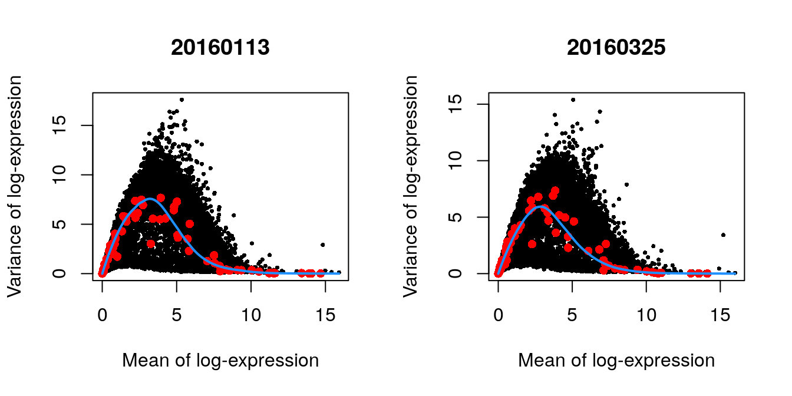

# (PART) Workflows {-}

# Lun 416B cell line (Smart-seq2)

<script>
document.addEventListener("click", function (event) {
    if (event.target.classList.contains("aaron-collapse")) {
        event.target.classList.toggle("active");
        var content = event.target.nextElementSibling;
        if (content.style.display === "block") {
          content.style.display = "none";
        } else {
          content.style.display = "block";
        }
    }
})
</script>

<style>
.aaron-collapse {
  background-color: #eee;
  color: #444;
  cursor: pointer;
  padding: 18px;
  width: 100%;
  border: none;
  text-align: left;
  outline: none;
  font-size: 15px;
}

.aaron-content {
  padding: 0 18px;
  display: none;
  overflow: hidden;
  background-color: #f1f1f1;
}
</style>

## Introduction

The @lun2017assessing dataset contains two 96-well plates of 416B cells (an immortalized mouse myeloid progenitor cell line), processed using the Smart-seq2 protocol [@picelli2014fulllength].
A constant amount of spike-in RNA from the External RNA Controls Consortium (ERCC) was also added to each cell's lysate prior to library preparation.
High-throughput sequencing was performed and the expression of each gene was quantified by counting the total number of reads mapped to its exonic regions.
Similarly, the quantity of each spike-in transcript was measured by counting the number of reads mapped to the spike-in reference sequences.

## Data loading

We convert the blocking factor to a `factor` so that downstream steps do not treat it as an integer.


```r
library(scRNAseq)
sce.416b <- LunSpikeInData(which="416b") 
sce.416b$block <- factor(sce.416b$block)
```

We rename the rows of our `SingleCellExperiment` with the symbols, reverting to Ensembl identifiers for missing or duplicate symbols.


```r
library(AnnotationHub)
ens.mm.v97 <- AnnotationHub()[["AH73905"]]
rowData(sce.416b)$ENSEMBL <- rownames(sce.416b)
rowData(sce.416b)$SYMBOL <- mapIds(ens.mm.v97, keys=rownames(sce.416b),
    keytype="GENEID", column="SYMBOL")
rowData(sce.416b)$SEQNAME <- mapIds(ens.mm.v97, keys=rownames(sce.416b),
    keytype="GENEID", column="SEQNAME")

library(scater)
rownames(sce.416b) <- uniquifyFeatureNames(rowData(sce.416b)$ENSEMBL, 
    rowData(sce.416b)$SYMBOL)
```

## Quality control

We save an unfiltered copy of the `SingleCellExperiment` for later use.


```r
unfiltered <- sce.416b
```

Technically, we do not need to use the mitochondrial proportions as we already have the spike-in proportions (which serve a similar purpose) for this dataset.
However, it probably doesn't do any harm to include it anyway.


```r
mito <- which(rowData(sce.416b)$SEQNAME=="MT")
stats <- perCellQCMetrics(sce.416b, subsets=list(Mt=mito))
qc <- quickPerCellQC(stats, percent_subsets=c("subsets_Mt_percent",
    "altexps_ERCC_percent"), batch=sce.416b$block)
sce.416b <- sce.416b[,!qc$discard]
```


```r
colData(unfiltered) <- cbind(colData(unfiltered), stats)
unfiltered$block <- factor(unfiltered$block)
unfiltered$discard <- qc$discard

gridExtra::grid.arrange(
    plotColData(unfiltered, x="block", y="sum", 
        colour_by="discard") + scale_y_log10() + ggtitle("Total count"),
    plotColData(unfiltered, x="block", y="detected", 
        colour_by="discard") + scale_y_log10() + ggtitle("Detected features"),
    plotColData(unfiltered, x="block", y="subsets_Mt_percent", 
        colour_by="discard") + ggtitle("Mito percent"),
    plotColData(unfiltered, x="block", y="altexps_ERCC_percent", 
        colour_by="discard") + ggtitle("ERCC percent"),
    nrow=2,
    ncol=2
)
```

<div class="figure">

<p class="caption">(\#fig:unref-416b-qc-dist)Distribution of each QC metric across cells in the 416B dataset, stratified by the plate of origin. Each point represents a cell and is colored according to whether that cell was discarded.</p>
</div>


```r
gridExtra::grid.arrange(
    plotColData(unfiltered, x="sum", y="subsets_Mt_percent", 
        colour_by="discard") + scale_x_log10(),
    plotColData(unfiltered, x="altexps_ERCC_percent", y="subsets_Mt_percent",
        colour_by="discard"),
    ncol=2
)
```

<div class="figure">

<p class="caption">(\#fig:unref-416b-qc-comp)Percentage of mitochondrial reads in each cell in the 416B dataset, compared to the total count (left) or the percentage of spike-in reads (right). Each point represents a cell and is colored according to whether that cell was discarded.</p>
</div>

We also examine the number of cells removed for each reason.


```r
colSums(as.matrix(qc))
```

```
##              low_lib_size            low_n_features   high_subsets_Mt_percent 
##                         5                         0                         2 
## high_altexps_ERCC_percent                   discard 
##                         2                         7
```

## Normalization

No pre-clustering is performed here, as the dataset is small and all cells are derived from the same cell line anyway.


```r
library(scran)
sce.416b <- computeSumFactors(sce.416b)
sce.416b <- logNormCounts(sce.416b)
```


```r
summary(sizeFactors(sce.416b))
```

```
##    Min. 1st Qu.  Median    Mean 3rd Qu.    Max. 
##   0.347   0.711   0.921   1.000   1.152   3.604
```

We see that the induced cells have size factors that are systematically shifted from the uninduced cells,
consistent with the presence of a composition bias (Figure \@ref(fig:unref-416b-norm)).


```r
plot(librarySizeFactors(sce.416b), sizeFactors(sce.416b), pch=16,
    xlab="Library size factors", ylab="Deconvolution factors", 
    col=c("black", "red")[grepl("induced", sce.416b$phenotype)+1],
    log="xy")
```

<div class="figure">

<p class="caption">(\#fig:unref-416b-norm)Relationship between the library size factors and the deconvolution size factors in the 416B dataset. Each cell is colored according to its oncogene induction status.</p>
</div>


## Variance modelling

We block on the plate of origin to minimize plate effects, 
and then we take the top 10% of genes with the largest biological components.


```r
dec.416b <- modelGeneVarWithSpikes(sce.416b, "ERCC", block=sce.416b$block)
chosen.hvgs <- getTopHVGs(dec.416b, prop=0.1)
```


```r
par(mfrow=c(1,2))
blocked.stats <- dec.416b$per.block
for (i in colnames(blocked.stats)) {
    current <- blocked.stats[[i]]
    plot(current$mean, current$total, main=i, pch=16, cex=0.5,
        xlab="Mean of log-expression", ylab="Variance of log-expression")
    curfit <- metadata(current)
    points(curfit$mean, curfit$var, col="red", pch=16)
    curve(curfit$trend(x), col='dodgerblue', add=TRUE, lwd=2)
}
```

<div class="figure">

<p class="caption">(\#fig:unref-416b-variance)Per-gene variance as a function of the mean for the log-expression values in the 416B dataset. Each point represents a gene (black) with the mean-variance trend (blue) fitted to the spike-in transcripts (red). This was performed separately for each plate.</p>
</div>

## Batch correction

The composition of cells is expected to be the same across the two plates, 
hence the use of `removeBatchEffect()` rather than more complex methods.
For larger datasets, consider using `regressBatches()` from the *[batchelor](https://bioconductor.org/packages/3.11/batchelor)* package.


```r
library(limma)
assay(sce.416b, "corrected") <- removeBatchEffect(logcounts(sce.416b), 
    design=model.matrix(~sce.416b$phenotype), batch=sce.416b$block)
```

## Dimensionality reduction

We do not expect a great deal of heterogeneity in this dataset, so we only request 10 PCs.
We use an exact SVD to avoid warnings from *[irlba](https://CRAN.R-project.org/package=irlba)* about handling small datasets.


```r
sce.416b <- runPCA(sce.416b, ncomponents=10, subset_row=chosen.hvgs,
    exprs_values="corrected", BSPARAM=BiocSingular::ExactParam())

set.seed(1010)
sce.416b <- runTSNE(sce.416b, dimred="PCA", perplexity=10)
```

## Clustering


```r
my.dist <- dist(reducedDim(sce.416b, "PCA"))
my.tree <- hclust(my.dist, method="ward.D2")

library(dynamicTreeCut)
my.clusters <- unname(cutreeDynamic(my.tree, distM=as.matrix(my.dist),
    minClusterSize=10, verbose=0))
sce.416b$cluster <- factor(my.clusters)
```

We compare the clusters to the plate of origin.
Each cluster is comprised of cells from both batches, indicating that the clustering is not driven by a batch effect.


```r
table(Cluster=sce.416b$cluster, Plate=sce.416b$block)
```

```
##        Plate
## Cluster 20160113 20160325
##       1       40       38
##       2       37       32
##       3       10       14
##       4        6        8
```

We compare the clusters to the oncogene induction status.
We observe differences in in the composition of each cluster, consistent with a biological effect of oncogene induction.


```r
table(Cluster=sce.416b$cluster, Oncogene=sce.416b$phenotype)
```

```
##        Oncogene
## Cluster induced CBFB-MYH11 oncogene expression wild type phenotype
##       1                                     78                   0
##       2                                      0                  69
##       3                                      1                  23
##       4                                     14                   0
```


```r
plotTSNE(sce.416b, colour_by="cluster")
```

<div class="figure">

<p class="caption">(\#fig:unref-416b-tsne)Obligatory $t$-SNE plot of the 416B dataset, where each point represents a cell and is colored according to the assigned cluster.</p>
</div>

Most cells have relatively small positive widths in Figure \@ref(fig:unref-416b-silhouette), indicating that the separation between clusters is weak.
This may be symptomatic of over-clustering where clusters that are clearly defined on oncogene induction status are further split into subsets that are less well separated.
Nonetheless, we will proceed with the current clustering scheme as it provides reasonable partitions for further characterization of heterogeneity.


```r
library(cluster)
clust.col <- scater:::.get_palette("tableau10medium") # hidden scater colours
sil <- silhouette(my.clusters, dist = my.dist)
sil.cols <- clust.col[ifelse(sil[,3] > 0, sil[,1], sil[,2])]
sil.cols <- sil.cols[order(-sil[,1], sil[,3])]
plot(sil, main = paste(length(unique(my.clusters)), "clusters"),
    border=sil.cols, col=sil.cols, do.col.sort=FALSE)
```

<div class="figure">

<p class="caption">(\#fig:unref-416b-silhouette)Silhouette plot for the hierarchical clustering of the 416B dataset. Each bar represents the silhouette width for a cell and is colored according to the assigned cluster (if positive) or the closest cluster (if negative).</p>
</div>

## Interpretation


```r
markers <- findMarkers(sce.416b, my.clusters, block=sce.416b$block)
marker.set <- markers[["1"]]
head(marker.set, 10)
```

```
## DataFrame with 10 rows and 7 columns
##             Top     p.value         FDR summary.logFC   logFC.2   logFC.3    logFC.4
##       <integer>   <numeric>   <numeric>     <numeric> <numeric> <numeric>  <numeric>
## Ccna2         1 9.85422e-67 4.59246e-62      -7.13310  -7.13310  -2.20632 -7.3451052
## Cdca8         1 1.01449e-41 1.52514e-38      -7.26175  -6.00378  -2.03841 -7.2617478
## Pirb          1 4.16555e-33 1.95516e-30       5.87820   5.28149   5.87820  0.0352849
## Cks1b         2 2.98233e-40 3.23229e-37      -6.43381  -6.43381  -4.15385 -6.4385323
## Aurkb         2 2.41436e-64 5.62593e-60      -6.94063  -6.94063  -1.65534 -6.4162126
## Myh11         2 1.28865e-46 3.75353e-43       4.38182   4.38182   4.29290  0.9410499
## Mcm6          3 1.15877e-28 3.69887e-26      -5.44558  -5.44558  -5.82130 -3.5804973
## Cdca3         3 5.02047e-45 1.23144e-41      -6.22179  -6.22179  -2.10502 -7.0539510
## Top2a         3 7.25965e-61 1.12776e-56      -7.07811  -7.07811  -2.39123 -6.8297343
## Mcm2          4 1.50854e-33 7.98908e-31      -5.54197  -5.54197  -6.09178 -3.8238103
```


We visualize the expression profiles of the top candidates in Figure \@ref(fig:unref-416b-markers) to verify that the DE signature is robust.
Most of the top markers have strong and consistent up- or downregulation in cells of cluster 1 compared to some or all of the other clusters.
A cursory examination of the heatmap indicates that cluster 1 contains oncogene-induced cells with strong downregulation of DNA replication and cell cycle genes.
This is consistent with the potential induction of senescence as an anti-tumorigenic response [@wajapeyee2010senescence].


```r
top.markers <- rownames(marker.set)[marker.set$Top <= 10]
plotHeatmap(sce.416b, features=top.markers, order_columns_by="cluster",
    colour_columns_by=c("cluster", "block", "phenotype"),
    center=TRUE, symmetric=TRUE, zlim=c(-5, 5)) 
```

<div class="figure">

<p class="caption">(\#fig:unref-416b-markers)Heatmap of the top marker genes for cluster 1 in the 416B dataset, stratified by cluster. The plate of origin and oncogene induction status are also shown for each cell.</p>
</div>

## Session Info {-}

<button class="aaron-collapse">View session info</button>
<div class="aaron-content">
```
R Under development (unstable) (2019-12-29 r77627)
Platform: x86_64-pc-linux-gnu (64-bit)
Running under: Ubuntu 14.04.6 LTS

Matrix products: default
BLAS/LAPACK: /app/easybuild/software/OpenBLAS/0.2.18-GCC-5.4.0-2.26-LAPACK-3.6.1/lib/libopenblas_prescottp-r0.2.18.so

locale:
 [1] LC_CTYPE=en_US.UTF-8       LC_NUMERIC=C               LC_TIME=en_US.UTF-8       
 [4] LC_COLLATE=C               LC_MONETARY=en_US.UTF-8    LC_MESSAGES=en_US.UTF-8   
 [7] LC_PAPER=en_US.UTF-8       LC_NAME=C                  LC_ADDRESS=C              
[10] LC_TELEPHONE=C             LC_MEASUREMENT=en_US.UTF-8 LC_IDENTIFICATION=C       

attached base packages:
[1] stats4    parallel  stats     graphics  grDevices utils     datasets  methods   base     

other attached packages:
 [1] cluster_2.1.0               dynamicTreeCut_1.63-1       limma_3.43.0               
 [4] scran_1.15.14               scater_1.15.12              ggplot2_3.2.1              
 [7] ensembldb_2.11.2            AnnotationFilter_1.11.0     GenomicFeatures_1.39.2     
[10] AnnotationDbi_1.49.0        AnnotationHub_2.19.3        BiocFileCache_1.11.4       
[13] dbplyr_1.4.2                scRNAseq_2.1.5              SingleCellExperiment_1.9.1 
[16] SummarizedExperiment_1.17.1 DelayedArray_0.13.2         BiocParallel_1.21.2        
[19] matrixStats_0.55.0          Biobase_2.47.2              GenomicRanges_1.39.1       
[22] GenomeInfoDb_1.23.1         IRanges_2.21.2              S4Vectors_0.25.8           
[25] BiocGenerics_0.33.0         Cairo_1.5-10                BiocStyle_2.15.3           
[28] OSCAUtils_0.0.1            

loaded via a namespace (and not attached):
  [1] Rtsne_0.15                    ggbeeswarm_0.6.0              colorspace_1.4-1             
  [4] XVector_0.27.0                BiocNeighbors_1.5.1           farver_2.0.1                 
  [7] bit64_0.9-7                   interactiveDisplayBase_1.25.0 codetools_0.2-16             
 [10] knitr_1.26                    zeallot_0.1.0                 Rsamtools_2.3.2              
 [13] pheatmap_1.0.12               shiny_1.4.0                   BiocManager_1.30.10          
 [16] compiler_4.0.0                httr_1.4.1                    dqrng_0.2.1                  
 [19] backports_1.1.5               assertthat_0.2.1              Matrix_1.2-18                
 [22] fastmap_1.0.1                 lazyeval_0.2.2                later_1.0.0                  
 [25] BiocSingular_1.3.1            htmltools_0.4.0               prettyunits_1.0.2            
 [28] tools_4.0.0                   igraph_1.2.4.2                rsvd_1.0.2                   
 [31] gtable_0.3.0                  glue_1.3.1                    GenomeInfoDbData_1.2.2       
 [34] dplyr_0.8.3                   rappdirs_0.3.1                Rcpp_1.0.3                   
 [37] vctrs_0.2.1                   Biostrings_2.55.4             ExperimentHub_1.13.5         
 [40] rtracklayer_1.47.0            DelayedMatrixStats_1.9.0      xfun_0.11                    
 [43] stringr_1.4.0                 ps_1.3.0                      mime_0.8                     
 [46] lifecycle_0.1.0               irlba_2.3.3                   statmod_1.4.32               
 [49] XML_3.98-1.20                 edgeR_3.29.0                  zlibbioc_1.33.0              
 [52] scales_1.1.0                  hms_0.5.2                     promises_1.1.0               
 [55] ProtGenerics_1.19.3           RColorBrewer_1.1-2            yaml_2.2.0                   
 [58] curl_4.3                      memoise_1.1.0                 gridExtra_2.3                
 [61] biomaRt_2.43.0                stringi_1.4.3                 RSQLite_2.2.0                
 [64] highr_0.8                     BiocVersion_3.11.1            rlang_0.4.2                  
 [67] pkgconfig_2.0.3               bitops_1.0-6                  evaluate_0.14                
 [70] lattice_0.20-38               purrr_0.3.3                   labeling_0.3                 
 [73] GenomicAlignments_1.23.1      cowplot_1.0.0                 bit_1.1-14                   
 [76] processx_3.4.1                tidyselect_0.2.5              magrittr_1.5                 
 [79] bookdown_0.16                 R6_2.4.1                      DBI_1.1.0                    
 [82] pillar_1.4.3                  withr_2.1.2                   RCurl_1.95-4.12              
 [85] tibble_2.1.3                  crayon_1.3.4                  rmarkdown_2.0                
 [88] viridis_0.5.1                 progress_1.2.2                locfit_1.5-9.1               
 [91] grid_4.0.0                    blob_1.2.0                    callr_3.4.0                  
 [94] digest_0.6.23                 xtable_1.8-4                  httpuv_1.5.2                 
 [97] openssl_1.4.1                 munsell_0.5.0                 beeswarm_0.2.3               
[100] viridisLite_0.3.0             vipor_0.4.5                   askpass_1.1                  
```
</div>
