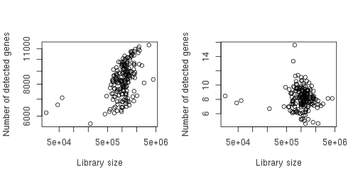
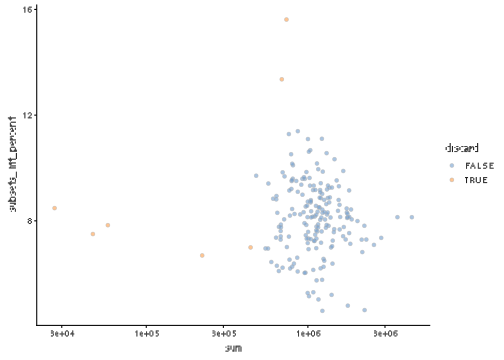
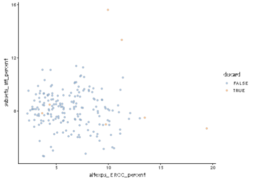
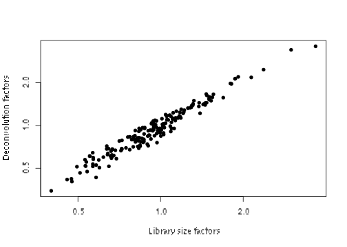
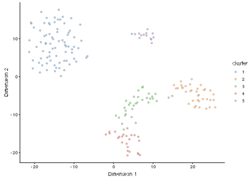

# (PART) Workflows {-}

# 416B Smart-seq2 dataset


## Introduction

This performs an analysis of the @lun2018assessing Smart-seq2 dataset, 
which contains two 96-well plates of 416B cells with and without induction of a _CBFB-MYH11_ oncogene.

## Analysis code

### Data loading


```r
library(scRNAseq)
sce.416b <- LunSpikeInData(which="416b") 
```

### Gene annotation


```r
library(AnnotationHub)
ens.mm.v97 <- AnnotationHub()[["AH73905"]]
rowData(sce.416b)$ENSEMBL <- rownames(sce.416b)
rowData(sce.416b)$SYMBOL <- mapIds(ens.mm.v97, keys=rownames(sce.416b),
    keytype="GENEID", column="SYMBOL")
rowData(sce.416b)$SEQNAME <- mapIds(ens.mm.v97, keys=rownames(sce.416b),
    keytype="GENEID", column="SEQNAME")

library(scater)
rownames(sce.416b) <- uniquifyFeatureNames(rowData(sce.416b)$ENSEMBL, 
    rowData(sce.416b)$SYMBOL)
```

### Quality control

We save an unfiltered copy of the `SingleCellExperiment` for later use.


```r
unfiltered <- sce.416b
```


```r
mito <- which(rowData(sce.416b)$SEQNAME=="MT")
stats <- perCellQCMetrics(sce.416b, subsets=list(Mt=mito))
qc <- quickCellQC(stats, percent_subsets="subsets_Mt_percent",
    nmads=3, batch=sce.416b$block)
sce.416b <- sce.416b[,!qc$discard]
```

### Normalization

No pre-clustering is performed here, as the dataset is small and the cells are all similar.


```r
library(scran)
sce.416b <- computeSumFactors(sce.416b)
sce.416b <- logNormCounts(sce.416b)
```

### Variance modelling

We take all of the genes with positive biological components.


```r
dec.416b <- modelGeneVarWithSpikes(sce.416b, "ERCC", block=sce.416b$block)
```

### Batch correction

The composition of cells is expected to be the same across the two plates, 
hence the use of `removeBatchEffect()` rather than more complex methods.


```r
library(limma)
assay(sce.416b, "corrected") <- removeBatchEffect(logcounts(sce.416b), 
    design=model.matrix(~sce.416b$phenotype), batch=sce.416b$block)
```

### Dimensionality reduction

`denoisePCA()` automatically does its own feature selection, 
so further subsetting is not strictly required unless we wanted to be more stringent.


```r
sce.416b <- denoisePCA(sce.416b, technical=dec.416b, 
    assay.type="corrected")

set.seed(1010)
sce.416b <- runTSNE(sce.416b, dimred="PCA", perplexity=10)
```

### Clustering


```r
my.dist <- dist(reducedDim(sce.416b, "PCA"))
my.tree <- hclust(my.dist, method="ward.D2")

library(dynamicTreeCut)
my.clusters <- unname(cutreeDynamic(my.tree, distM=as.matrix(my.dist),
    minClusterSize=10, verbose=0))
sce.416b$cluster <- factor(my.clusters)
```

## Results

### Quality control statistics


```r
colData(unfiltered) <- cbind(colData(unfiltered), stats)
unfiltered$block <- factor(unfiltered$block)
unfiltered$discard <- qc$discard

gridExtra::grid.arrange(
    plotColData(unfiltered, x="block", y="sum", 
        colour_by="discard") + scale_y_log10() + ggtitle("Total count"),
    plotColData(unfiltered, x="block", y="detected", 
        colour_by="discard") + scale_y_log10() + ggtitle("Detected features"),
    plotColData(unfiltered, x="block", y="subsets_Mt_percent", 
        colour_by="discard") + ggtitle("Mito percent"),
    plotColData(unfiltered, x="block", y="altexps_ERCC_percent", 
        colour_by="discard") + ggtitle("ERCC percent"),
    nrow=2,
    ncol=2
)
```




```r
plotColData(unfiltered, x="sum", y="subsets_Mt_percent", 
    colour_by="discard") + scale_x_log10()
```



```r
plotColData(unfiltered, x="altexps_ERCC_percent", y="subsets_Mt_percent",
    colour_by="discard") 
```




```r
colSums(as.matrix(qc))
```

```
##            low_lib_size          low_n_features high_subsets_Mt_percent 
##                       5                       0                       2 
##                 discard 
##                       7
```

### Normalization


```r
summary(sizeFactors(sce.416b))
```

```
##    Min. 1st Qu.  Median    Mean 3rd Qu.    Max. 
##    0.35    0.71    0.92    1.00    1.15    3.60
```


```r
plot(librarySizeFactors(sce.416b), sizeFactors(sce.416b), pch=16,
    xlab="Library size factors", ylab="Deconvolution factors", log="xy")     
```



### Variance modelling


```r
par(mfrow=c(1,2))
blocked.stats <- dec.416b$per.block
for (i in colnames(blocked.stats)) {
    current <- blocked.stats[[i]]
    plot(current$mean, current$total, main=i, pch=16, cex=0.5,
        xlab="Mean of log-expression", ylab="Variance of log-expression")
    curfit <- metadata(current)
    points(curfit$mean, curfit$var, col="red", pch=16)
    curve(curfit$trend(x), col='dodgerblue', add=TRUE, lwd=2)
}
```


### Dimensionality reduction


```r
ncol(reducedDim(sce.416b, "PCA"))
```

```
## [1] 27
```

### Clustering

We compare the clusters to the plate of origin.


```r
table(Cluster=sce.416b$cluster, Plate=sce.416b$block)
```

```
##        Plate
## Cluster 20160113 20160325
##       1       41       39
##       2       19       17
##       3       17       15
##       4       11       13
##       5        5        8
```

We compare the clusters to the oncogene induction status.


```r
table(Cluster=sce.416b$cluster, Oncogene=sce.416b$phenotype)
```

```
##        Oncogene
## Cluster induced CBFB-MYH11 oncogene expression wild type phenotype
##       1                                     80                   0
##       2                                      0                  36
##       3                                      0                  32
##       4                                      0                  24
##       5                                     13                   0
```


```r
plotTSNE(sce.416b, colour_by="cluster")
```



## References
