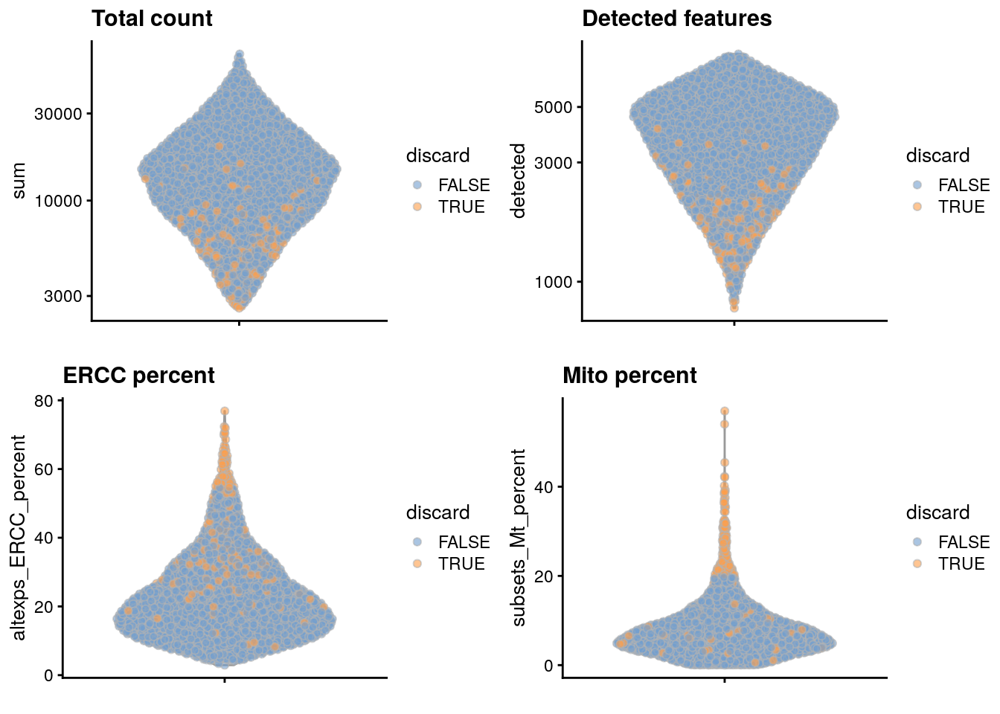
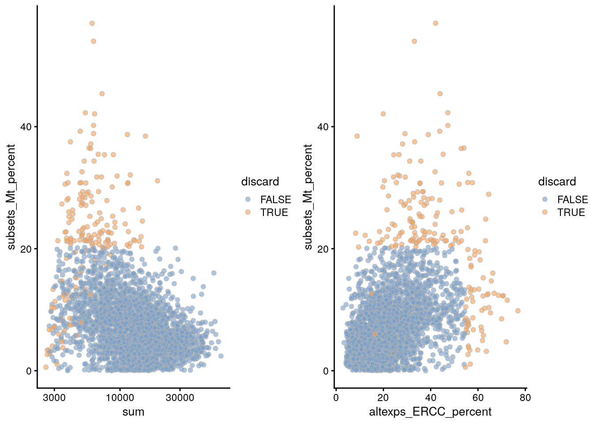
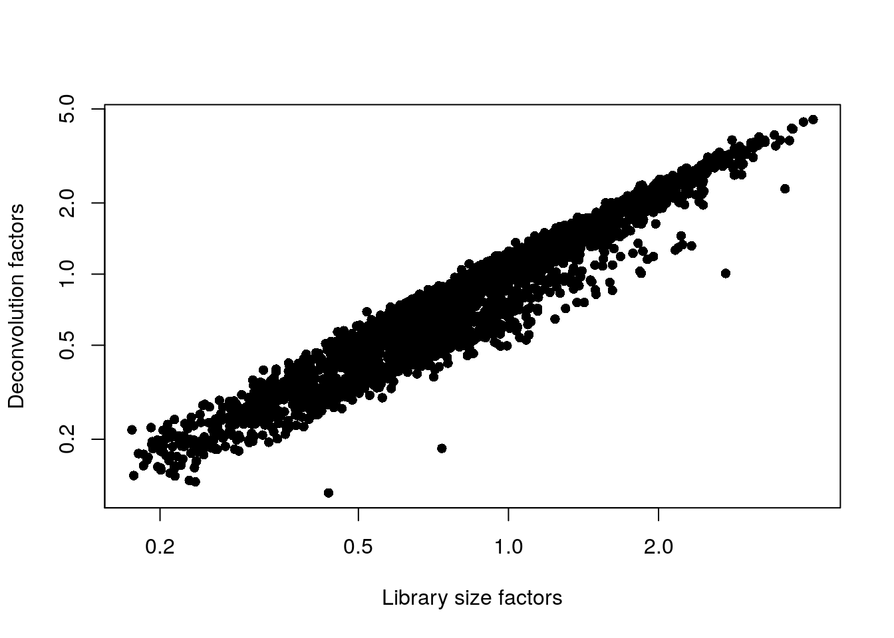
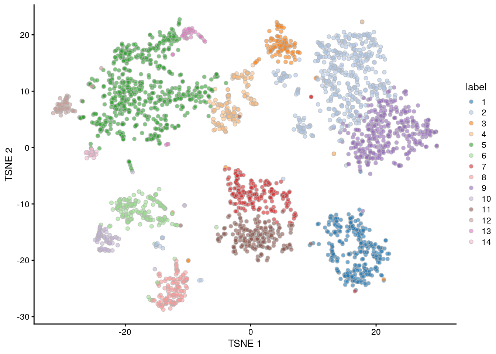

# Zeisel mouse brain (STRT-Seq)

<script>
document.addEventListener("click", function (event) {
    if (event.target.classList.contains("aaron-collapse")) {
        event.target.classList.toggle("active");
        var content = event.target.nextElementSibling;
        if (content.style.display === "block") {
          content.style.display = "none";
        } else {
          content.style.display = "block";
        }
    }
})
</script>

<style>
.aaron-collapse {
  background-color: #eee;
  color: #444;
  cursor: pointer;
  padding: 18px;
  width: 100%;
  border: none;
  text-align: left;
  outline: none;
  font-size: 15px;
}

.aaron-content {
  padding: 0 18px;
  display: none;
  overflow: hidden;
  background-color: #f1f1f1;
}
</style>

## Introduction

Here, we examine a heterogeneous dataset from a study of cell types in the mouse brain [@zeisel2015brain].
This contains approximately 3000 cells of varying types such as oligodendrocytes, microglia and neurons.
Individual cells were isolated using the Fluidigm C1 microfluidics system [@pollen2014lowcoverage] and library preparation was performed on each cell using a UMI-based protocol.
After sequencing, expression was quantified by counting the number of unique molecular identifiers (UMIs) mapped to each gene.

## Data loading

We obtain a `SingleCellExperiment` object for this dataset using the relevant function from the *[scRNAseq](https://bioconductor.org/packages/3.11/scRNAseq)* package.
The idiosyncrasies of the published dataset means that we need to do some extra work to merge together redundant rows corresponding to alternative genomic locations for the same gene.


```r
library(scRNAseq)
sce.zeisel <- ZeiselBrainData()

library(scater)
sce.zeisel <- aggregateAcrossFeatures(sce.zeisel, 
    id=sub("_loc[0-9]+$", "", rownames(sce.zeisel)))
```

We also fetch the Ensembl gene IDs, just in case we need them later.


```r
library(org.Mm.eg.db)
rowData(sce.zeisel) <- mapIds(org.Mm.eg.db, keys=rownames(sce.zeisel),
    keytype="SYMBOL", column="ENSEMBL")
```

## Quality control


```r
unfiltered <- sce.zeisel
```

The original authors of the study have already removed low-quality cells prior to data publication.
Nonetheless, we compute some quality control metrics to check whether the remaining cells are satisfactory.


```r
stats <- perCellQCMetrics(sce.zeisel, subsets=list(
    Mt=rowData(sce.zeisel)$featureType=="mito"))
qc <- quickPerCellQC(stats, percent_subsets=c("altexps_ERCC_percent", 
    "subsets_Mt_percent"))
sce.zeisel <- sce.zeisel[,!qc$discard]
```


```r
colData(unfiltered) <- cbind(colData(unfiltered), stats)
unfiltered$discard <- qc$discard

gridExtra::grid.arrange(
    plotColData(unfiltered, y="sum", colour_by="discard") +
        scale_y_log10() + ggtitle("Total count"),
    plotColData(unfiltered, y="detected", colour_by="discard") +
        scale_y_log10() + ggtitle("Detected features"),
    plotColData(unfiltered, y="altexps_ERCC_percent",
        colour_by="discard") + ggtitle("ERCC percent"),
    plotColData(unfiltered, y="subsets_Mt_percent",
        colour_by="discard") + ggtitle("Mito percent"),
    ncol=2
)
```

<div class="figure">

<p class="caption">(\#fig:unref-zeisel-qc-dist)Distribution of each QC metric across cells in the Zeisel brain dataset. Each point represents a cell and is colored according to whether that cell was discarded.</p>
</div>


```r
gridExtra::grid.arrange(
    plotColData(unfiltered, x="sum", y="subsets_Mt_percent",
        colour_by="discard") + scale_x_log10(),
    plotColData(unfiltered, x="altexps_ERCC_percent", y="subsets_Mt_percent",
        colour_by="discard"),
    ncol=2
)
```

<div class="figure">

<p class="caption">(\#fig:unref-zeisel-qc-comp)Percentage of mitochondrial reads in each cell in the Zeisel brain dataset, compared to the total count (left) or the percentage of spike-in reads (right). Each point represents a cell and is colored according to whether that cell was discarded.</p>
</div>

We also examine the number of cells removed for each reason.


```r
colSums(as.matrix(qc))
```

```
##              low_lib_size            low_n_features high_altexps_ERCC_percent 
##                         0                         3                        65 
##   high_subsets_Mt_percent                   discard 
##                         0                        68
```

## Normalization


```r
library(scran)
set.seed(1000)
clusters <- quickCluster(sce.zeisel)
sce.zeisel <- computeSumFactors(sce.zeisel, cluster=clusters) 
sce.zeisel <- logNormCounts(sce.zeisel)
```


```r
summary(sizeFactors(sce.zeisel))
```

```
##    Min. 1st Qu.  Median    Mean 3rd Qu.    Max. 
##   0.135   0.466   0.818   1.000   1.319   4.687
```


```r
plot(librarySizeFactors(sce.zeisel), sizeFactors(sce.zeisel), pch=16,
    xlab="Library size factors", ylab="Deconvolution factors", log="xy")
```

<div class="figure">

<p class="caption">(\#fig:unref-zeisel-norm)Relationship between the library size factors and the deconvolution size factors in the Zeisel brain dataset.</p>
</div>

## Variance modelling

In theory, we should block on the plate of origin for each cell.
However, only 20-40 cells are available on each plate, and the population is also highly heterogeneous.
This means that we cannot assume that the distribution of sampled cell types on each plate is the same.
Thus, to avoid regressing out potential biology, we will not block on any factors in this analysis.


```r
dec.zeisel <- modelGeneVarWithSpikes(sce.zeisel, "ERCC")
top.hvgs <- getTopHVGs(dec.zeisel, prop=0.1)
```

We see from Figure \@ref(fig:unref-zeisel-var) that the technical and total variances are much smaller than those in the read-based datasets.
This is due to the use of UMIs, which reduces the noise caused by variable PCR amplification.
Furthermore, the spike-in trend is consistently lower than the variances of the endogenous gene, which reflects the heterogeneity in gene expression across cells of different types.


```r
plot(dec.zeisel$mean, dec.zeisel$total, pch=16, cex=0.5,
    xlab="Mean of log-expression", ylab="Variance of log-expression")
curfit <- metadata(dec.zeisel)
points(curfit$mean, curfit$var, col="red", pch=16)
curve(curfit$trend(x), col='dodgerblue', add=TRUE, lwd=2)
```

<div class="figure">

<p class="caption">(\#fig:unref-zeisel-var)Per-gene variance as a function of the mean for the log-expression values in the Zeisel brain dataset. Each point represents a gene (black) with the mean-variance trend (blue) fitted to the spike-in transcripts (red).</p>
</div>

## Dimensionality reduction


```r
library(BiocSingular)
set.seed(101011001)
sce.zeisel <- denoisePCA(sce.zeisel, technical=dec.zeisel, subset.row=top.hvgs)
sce.zeisel <- runTSNE(sce.zeisel, dimred="PCA")
```

We have a look at the number of PCs retained by `denoisePCA()`.


```r
ncol(reducedDim(sce.zeisel, "PCA"))
```

```
## [1] 50
```

## Clustering


```r
snn.gr <- buildSNNGraph(sce.zeisel, use.dimred="PCA")
colLabels(sce.zeisel) <- factor(igraph::cluster_walktrap(snn.gr)$membership)
```


```r
table(colLabels(sce.zeisel))
```

```
## 
##   1   2   3   4   5   6   7   8   9  10  11  12  13  14 
## 283 231 258 141 616 169 105 187 544  75  33 204  56  35
```


```r
plotTSNE(sce.zeisel, colour_by="label")
```

<div class="figure">

<p class="caption">(\#fig:unref-zeisel-tsne)Obligatory $t$-SNE plot of the Zeisel brain dataset, where each point represents a cell and is colored according to the assigned cluster.</p>
</div>

## Interpretation


We focus on upregulated marker genes as these can quickly provide positive identification of cell type in a heterogeneous population.
We examine the table for cluster 1, in which log-fold changes are reported between cluster 1 and every other cluster.
The same output is provided for each cluster in order to identify genes that discriminate between clusters.


```r
markers <- findMarkers(sce.zeisel, direction="up")
marker.set <- markers[["1"]]
head(marker.set[,1:8], 10) # only first 8 columns, for brevity
```

```
## DataFrame with 10 rows and 8 columns
##                Top      p.value          FDR summary.logFC   logFC.2   logFC.3
##          <integer>    <numeric>    <numeric>     <numeric> <numeric> <numeric>
## Atp1a3           1 6.51084e-276 2.58337e-272       3.40014   3.27538 0.0437054
## Fabp3            1 1.15584e-127 3.01720e-125       2.12444   2.08998 1.1002207
## Gad1             1 7.15111e-234 1.28973e-230       4.53472   4.45504 4.5347207
## Gad2             1 8.67275e-211 1.14706e-207       4.13745   4.13745 4.2262499
## Ndrg4            1  0.00000e+00  0.00000e+00       3.79113   3.65041 1.0427839
## Slc32a1          1 3.93549e-109 6.34766e-107       1.89859   1.91373 1.9200583
## Syngr3           1 1.00547e-140 3.56204e-138       2.43861   2.40178 1.1562077
## Atp6v1g2         2 5.39259e-203 6.29315e-200       2.48181   2.47403 0.1865289
## Pfkm             2 1.30548e-114 2.51452e-112       1.89554   1.40227 0.5206674
## Slc6a1           2 1.28578e-161 6.37716e-159       3.53995   3.21899 3.1868525
##            logFC.4   logFC.5
##          <numeric> <numeric>
## Atp1a3    1.180740   3.40014
## Fabp3     0.568442   2.12444
## Gad1      3.992858   4.44742
## Gad2      3.730733   4.15313
## Ndrg4     1.147802   3.79113
## Slc32a1   1.777612   1.89935
## Syngr3    1.119706   2.43861
## Atp6v1g2  0.597905   2.48181
## Pfkm      0.552720   1.56984
## Slc6a1    3.045826   2.86794
```


Figure \@ref(fig:unref-zeisel-heat-cell) indicates that most of the top markers are strongly DE in cells of cluster 1 compared to some or all of the other clusters.
We can use these markers to identify cells from cluster 1 in validation studies with an independent population of cells.
A quick look at the markers suggest that cluster 1 represents interneurons based on expression of *Gad1* and *Slc6a1* [@zeng2012largescale].


```r
top.markers <- rownames(marker.set)[marker.set$Top <= 10]
plotHeatmap(sce.zeisel, features=top.markers, order_columns_by="label")
```

<div class="figure">

<p class="caption">(\#fig:unref-zeisel-heat-cell)Heatmap of the log-expression of the top markers for cluster 1 compared to each other cluster. Cells are ordered by cluster and the color is scaled to the log-expression of each gene in each cell.</p>
</div>

An alternative visualization approach is to plot the log-fold changes to all other clusters directly (Figure \@ref(fig:unref-zeisel-heat-lfc)).
This is more concise and is useful in situations involving many clusters that contain different numbers of cells.


```r
library(pheatmap)
logFCs <- getMarkerEffects(marker.set[1:50,])
pheatmap(logFCs, breaks=seq(-5, 5, length.out=101))
```

<div class="figure">

<p class="caption">(\#fig:unref-zeisel-heat-lfc)Heatmap of the log-fold changes of the top markers for cluster 1 compared to each other cluster.</p>
</div>

## Session Info {-}

<button class="aaron-collapse">View session info</button>
<div class="aaron-content">
```
R Under development (unstable) (2020-03-23 r78035)
Platform: x86_64-pc-linux-gnu (64-bit)
Running under: Ubuntu 18.04.4 LTS

Matrix products: default
BLAS:   /home/luna/Software/R/trunk/lib/libRblas.so
LAPACK: /home/luna/Software/R/trunk/lib/libRlapack.so

locale:
 [1] LC_CTYPE=en_US.UTF-8       LC_NUMERIC=C              
 [3] LC_TIME=en_US.UTF-8        LC_COLLATE=en_US.UTF-8    
 [5] LC_MONETARY=en_US.UTF-8    LC_MESSAGES=en_US.UTF-8   
 [7] LC_PAPER=en_US.UTF-8       LC_NAME=C                 
 [9] LC_ADDRESS=C               LC_TELEPHONE=C            
[11] LC_MEASUREMENT=en_US.UTF-8 LC_IDENTIFICATION=C       

attached base packages:
[1] parallel  stats4    stats     graphics  grDevices utils     datasets 
[8] methods   base     

other attached packages:
 [1] pheatmap_1.0.12             BiocSingular_1.3.2         
 [3] scran_1.15.24               org.Mm.eg.db_3.10.0        
 [5] AnnotationDbi_1.49.1        scater_1.15.29             
 [7] ggplot2_3.3.0               scRNAseq_2.1.7             
 [9] SingleCellExperiment_1.9.2  SummarizedExperiment_1.17.4
[11] DelayedArray_0.13.7         BiocParallel_1.21.2        
[13] matrixStats_0.56.0          Biobase_2.47.3             
[15] GenomicRanges_1.39.3        GenomeInfoDb_1.23.14       
[17] IRanges_2.21.8              S4Vectors_0.25.14          
[19] BiocGenerics_0.33.3         BiocStyle_2.15.6           
[21] OSCAUtils_0.0.2            

loaded via a namespace (and not attached):
 [1] bitops_1.0-6                  bit64_0.9-7                  
 [3] RColorBrewer_1.1-2            httr_1.4.1                   
 [5] tools_4.0.0                   R6_2.4.1                     
 [7] irlba_2.3.3                   vipor_0.4.5                  
 [9] DBI_1.1.0                     colorspace_1.4-1             
[11] withr_2.1.2                   tidyselect_1.0.0             
[13] gridExtra_2.3                 processx_3.4.2               
[15] bit_1.1-15.2                  curl_4.3                     
[17] compiler_4.0.0                BiocNeighbors_1.5.2          
[19] labeling_0.3                  bookdown_0.18                
[21] scales_1.1.0                  callr_3.4.2                  
[23] rappdirs_0.3.1                stringr_1.4.0                
[25] digest_0.6.25                 rmarkdown_2.1                
[27] XVector_0.27.2                pkgconfig_2.0.3              
[29] htmltools_0.4.0               limma_3.43.5                 
[31] highr_0.8                     dbplyr_1.4.2                 
[33] fastmap_1.0.1                 rlang_0.4.5                  
[35] RSQLite_2.2.0                 shiny_1.4.0.2                
[37] DelayedMatrixStats_1.9.0      farver_2.0.3                 
[39] dplyr_0.8.5                   RCurl_1.98-1.1               
[41] magrittr_1.5                  GenomeInfoDbData_1.2.2       
[43] Matrix_1.2-18                 Rcpp_1.0.4                   
[45] ggbeeswarm_0.6.0              munsell_0.5.0                
[47] viridis_0.5.1                 lifecycle_0.2.0              
[49] edgeR_3.29.1                  stringi_1.4.6                
[51] yaml_2.2.1                    zlibbioc_1.33.1              
[53] Rtsne_0.15                    BiocFileCache_1.11.4         
[55] AnnotationHub_2.19.7          grid_4.0.0                   
[57] blob_1.2.1                    dqrng_0.2.1                  
[59] promises_1.1.0                ExperimentHub_1.13.5         
[61] crayon_1.3.4                  lattice_0.20-40              
[63] cowplot_1.0.0                 locfit_1.5-9.4               
[65] knitr_1.28                    ps_1.3.2                     
[67] pillar_1.4.3                  igraph_1.2.5                 
[69] codetools_0.2-16              glue_1.3.2                   
[71] BiocVersion_3.11.1            evaluate_0.14                
[73] BiocManager_1.30.10           vctrs_0.2.4                  
[75] httpuv_1.5.2                  gtable_0.3.0                 
[77] purrr_0.3.3                   assertthat_0.2.1             
[79] xfun_0.12                     rsvd_1.0.3                   
[81] mime_0.9                      xtable_1.8-4                 
[83] later_1.0.0                   viridisLite_0.3.0            
[85] tibble_2.1.3                  beeswarm_0.2.3               
[87] memoise_1.1.0                 statmod_1.4.34               
[89] interactiveDisplayBase_1.25.0
```
</div>
