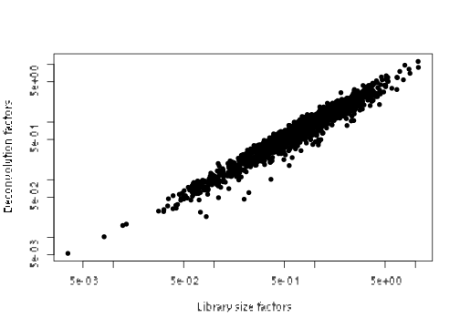
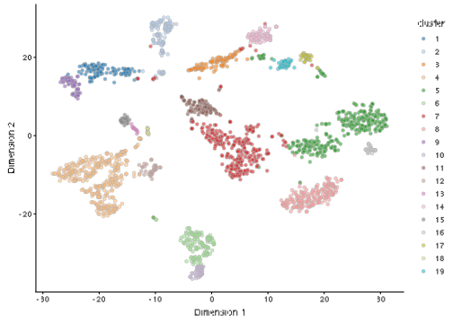
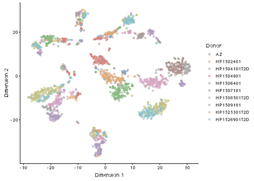

# Human pancreas dataset (Segerstolpe)


## Introduction

This performs an analysis of the @segerstolpe2016singlcell dataset,
consisting of human pancreas cells from various donors.

## Analysis code

### Data loading


```r
library(scRNAseq)
sce.seger <- SegerstolpePancreasData()
```

### Gene annotation


```r
library(AnnotationHub)
edb <- AnnotationHub()[["AH73881"]]
symbols <- rowData(sce.seger)$symbol
ens.id <- mapIds(edb, keys=symbols, keytype="SYMBOL", column="GENEID")
ens.id <- ifelse(is.na(ens.id), symbols, ens.id)

# Removing duplicated rows.
keep <- !duplicated(ens.id)
sce.seger <- sce.seger[keep,]
rownames(sce.seger) <- ens.id[keep]
```

### Sample annotation

We simplify the names of some of the relevant column metadata fields for ease of access.
Some editing of the cell type labels is necessary for consistency with other data sets.


```r
emtab.meta <- colData(sce.seger)[,c("cell type", 
    "individual", "single cell well quality")]
colnames(emtab.meta) <- c("CellType", "Donor", "Quality")
colData(sce.seger) <- emtab.meta

sce.seger$CellType <- gsub(" cell", "", sce.seger$CellType)
sce.seger$CellType <- paste0(
    toupper(substr(sce.seger$CellType, 1, 1)),
    substring(sce.seger$CellType, 2))
```

### Quality control

We remove low quality cells that were marked by the authors.
We then perform additional quality control, as some of the remaining 
still have very low counts and numbers of detected features.


```r
unfiltered <- sce.seger
```


```r
low.qual <- sce.seger$Quality == "low quality cell"

library(scater)
stats <- perCellQCMetrics(sce.seger)
qc <- quickCellQC(stats, nmads=3, percent_subsets="altexps_ERCC_percent")
sce.seger <- sce.seger[,!(qc$discard | low.qual)]
```

### Normalization

We don't normalize the spike-ins as there are some cells with no spike-in counts.


```r
library(scran)
clusters <- quickCluster(sce.seger)
sce.seger <- computeSumFactors(sce.seger, clusters=clusters)
sce.seger <- logNormCounts(sce.seger, use_altexps=FALSE)
```

### Variance modelling

We do not use cells with no spike-ins for variance modelling.
Donor AZ also has very low spike-in counts and is subsequently ignored.


```r
for.hvg <- sce.seger[,librarySizeFactors(altExp(sce.seger)) > 0
    & sce.seger$Donor!="AZ"]
dec.seger <- modelGeneVarWithSpikes(for.hvg, "ERCC", block=for.hvg$Donor)
chosen.hvgs <- head(order(dec.seger$bio, decreasing=TRUE), 2000)
```

### Dimensionality reduction


```r
library(BiocSingular)
set.seed(101011001)
sce.seger <- runPCA(sce.seger, subset_row=chosen.hvgs, 
    ncomponents=25, BSPARAM=IrlbaParam())
sce.seger <- runTSNE(sce.seger, dimred="PCA")
```

### Clustering


```r
snn.gr <- buildSNNGraph(sce.seger, use.dimred="PCA")
sce.seger$cluster <- factor(igraph::cluster_walktrap(snn.gr)$membership)
```

## Results

### Quality control statistics


```r
colData(unfiltered) <- cbind(colData(unfiltered), stats)
unfiltered$discard <- qc$discard

gridExtra::grid.arrange(
    plotColData(unfiltered, x="Donor", y="sum", colour_by="discard") +
        scale_y_log10() + ggtitle("Total count"),
    plotColData(unfiltered, x="Donor", y="detected", colour_by="discard") +
        scale_y_log10() + ggtitle("Detected features"),
    plotColData(unfiltered, x="Donor", y="altexps_ERCC_percent",
        colour_by="discard") + ggtitle("ERCC percent"),
    ncol=2
)
```


```r
colSums(as.matrix(qc))
```

```
##              low_lib_size            low_n_features 
##                       197                       587 
## high_altexps_ERCC_percent                   discard 
##                       902                      1028
```

### Normalization


```r
summary(sizeFactors(sce.seger))
```

```
##    Min. 1st Qu.  Median    Mean 3rd Qu.    Max. 
##    0.01    0.39    0.71    1.00    1.32   11.24
```


```r
plot(librarySizeFactors(sce.seger), sizeFactors(sce.seger), pch=16,
    xlab="Library size factors", ylab="Deconvolution factors", log="xy")
```



### Variance modelling


```r
par(mfrow=c(3,3))
blocked.stats <- dec.seger$per.block
for (i in colnames(blocked.stats)) {
    current <- blocked.stats[[i]]
    plot(current$mean, current$total, main=i, pch=16, cex=0.5,
        xlab="Mean of log-expression", ylab="Variance of log-expression")
    curfit <- metadata(current)
    points(curfit$mean, curfit$var, col="red", pch=16)
    curve(curfit$trend(x), col='dodgerblue', add=TRUE, lwd=2)
}
```


### Dimensionality reduction


```r
ncol(reducedDim(sce.seger, "PCA"))
```

```
## [1] 25
```

### Clustering


```r
table(sce.seger$cluster)
```

```
## 
##   1   2   3   4   5   6   7   8   9  10  11  12  13  14  15  16  17  18 
## 124 125 104 361 330 137 300 181  68  49  94  39  14  79  42  26  34  17 
##  19 
##  45
```


```r
plotTSNE(sce.seger, colour_by="cluster")
```



```r
plotTSNE(sce.seger, colour_by="Donor")
```



## References {-}
