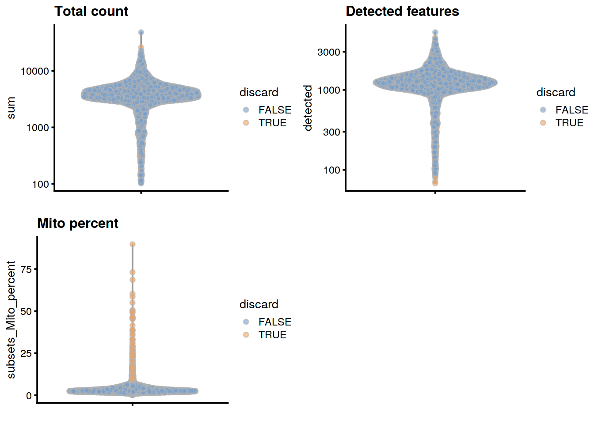
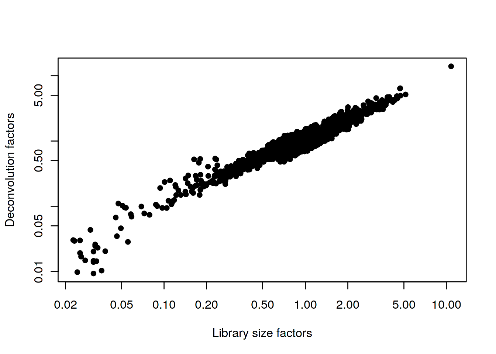
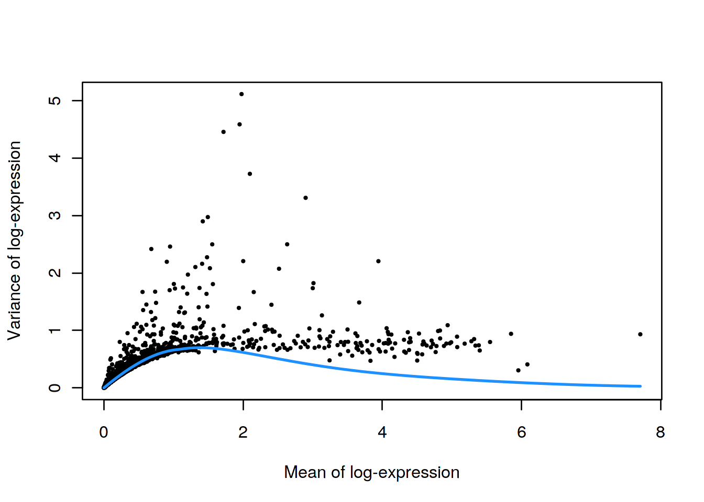
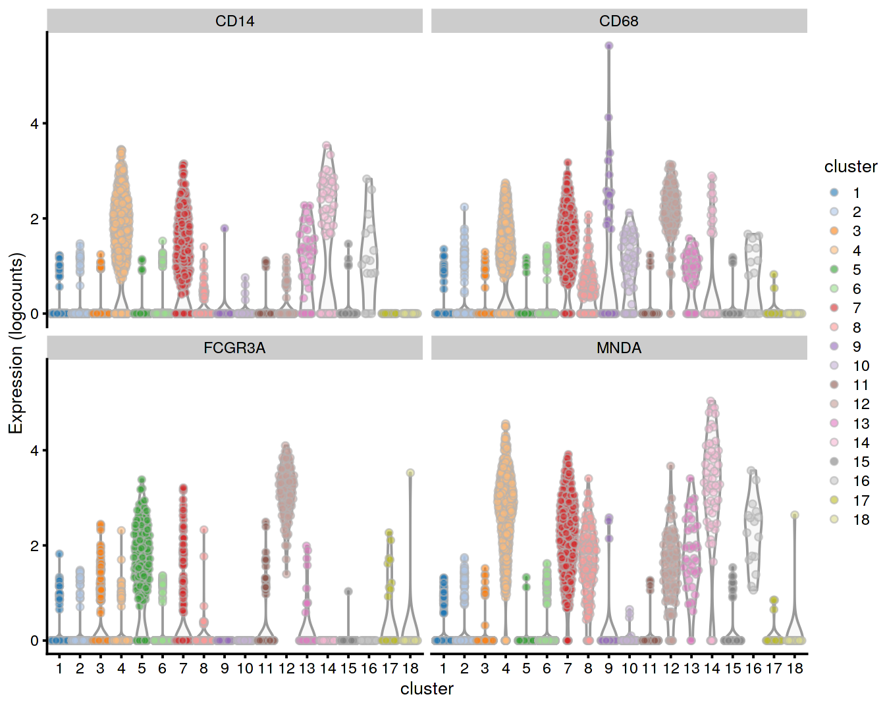

# PBMC 10X dataset (unfiltered)

<script>
document.addEventListener("click", function (event) {
    if (event.target.classList.contains("aaron-collapse")) {
        event.target.classList.toggle("active");
        var content = event.target.nextElementSibling;
        if (content.style.display === "block") {
          content.style.display = "none";
        } else {
          content.style.display = "block";
        }
    }
})
</script>

<style>
.aaron-collapse {
  background-color: #eee;
  color: #444;
  cursor: pointer;
  padding: 18px;
  width: 100%;
  border: none;
  text-align: left;
  outline: none;
  font-size: 15px;
}

.aaron-content {
  padding: 0 18px;
  display: none;
  overflow: hidden;
  background-color: #f1f1f1;
}
</style>

## Introduction

Here, we describe a brief analysis of the peripheral blood mononuclear cell (PBMC) dataset from 10X Genomics [@zheng2017massively].
The data are publicly available from the [10X Genomics website](https://support.10xgenomics.com/single-cell-gene-expression/datasets/2.1.0/pbmc4k),
from which we download the raw gene/barcode count matrices, i.e., before cell calling from the _CellRanger_ pipeline.

## Analysis code

### Data loading


```r
library(BiocFileCache)
bfc <- BiocFileCache("raw_data", ask = FALSE)
raw.path <- bfcrpath(bfc, file.path("http://cf.10xgenomics.com/samples",
    "cell-exp/2.1.0/pbmc4k/pbmc4k_raw_gene_bc_matrices.tar.gz"))
untar(raw.path, exdir=file.path(tempdir(), "pbmc4k"))

library(DropletUtils)
fname <- file.path(tempdir(), "pbmc4k/raw_gene_bc_matrices/GRCh38")
sce.pbmc <- read10xCounts(fname, col.names=TRUE)
```

### Gene annotation


```r
library(scater)
rownames(sce.pbmc) <- uniquifyFeatureNames(
    rowData(sce.pbmc)$ID, rowData(sce.pbmc)$Symbol)

library(EnsDb.Hsapiens.v86)
location <- mapIds(EnsDb.Hsapiens.v86, keys=rowData(sce.pbmc)$ID, 
    column="SEQNAME", keytype="GENEID")
```

### Cell detection


```r
set.seed(100)
e.out <- emptyDrops(counts(sce.pbmc))
sce.pbmc <- sce.pbmc[,which(e.out$FDR <= 0.001)]
```

### Quality control


```r
unfiltered <- sce.pbmc
```

We use a relaxed QC strategy and only remove cells with large mitochondrial proportions, using it as a proxy for cell damage.
This reduces the risk of removing cell types with low RNA content, especially in a heterogeneous PBMC population with many different cell types.


```r
stats <- perCellQCMetrics(sce.pbmc, subsets=list(Mito=which(location=="MT")))
high.mito <- isOutlier(stats$subsets_Mito_percent, nmads=3, type="higher")
sce.pbmc <- sce.pbmc[,!high.mito]
```

### Normalization


```r
library(scran)
set.seed(1000)
clusters <- quickCluster(sce.pbmc)
sce.pbmc <- computeSumFactors(sce.pbmc, cluster=clusters)
sce.pbmc <- logNormCounts(sce.pbmc)
```

### Variance modelling


```r
set.seed(1001)
dec.pbmc <- modelGeneVarByPoisson(sce.pbmc)
```

### Dimensionality reduction


```r
set.seed(10000)
sce.pbmc <- denoisePCA(sce.pbmc, technical=dec.pbmc)

set.seed(100000)
sce.pbmc <- runTSNE(sce.pbmc, use_dimred="PCA")

set.seed(1000000)
sce.pbmc <- runUMAP(sce.pbmc, use_dimred="PCA")
```

### Clustering


```r
g <- buildSNNGraph(sce.pbmc, k=10, use.dimred = 'PCA')
clust <- igraph::cluster_walktrap(g)$membership
sce.pbmc$cluster <- factor(clust)
```

## Results

### Quality control statistics


```r
colData(unfiltered) <- cbind(colData(unfiltered), stats)
unfiltered$discard <- high.mito

gridExtra::grid.arrange(
    plotColData(unfiltered, y="sum", colour_by="discard") +
        scale_y_log10() + ggtitle("Total count"),
    plotColData(unfiltered, y="detected", colour_by="discard") +
        scale_y_log10() + ggtitle("Detected features"),
    plotColData(unfiltered, y="subsets_Mito_percent",
        colour_by="discard") + ggtitle("Mito percent"),
    ncol=2
)
```




```r
plotColData(unfiltered, x="sum", y="subsets_Mito_percent",
    colour_by="discard") + scale_x_log10()
```


```r
summary(high.mito)
```

```
##    Mode   FALSE    TRUE 
## logical    3922     311
```

### Normalization


```r
summary(sizeFactors(sce.pbmc))
```

```
##    Min. 1st Qu.  Median    Mean 3rd Qu.    Max. 
##   0.009   0.710   0.869   1.000   1.091  13.963
```


```r
plot(librarySizeFactors(sce.pbmc), sizeFactors(sce.pbmc), pch=16,
    xlab="Library size factors", ylab="Deconvolution factors", log="xy")
```



### Variance modelling


```r
plot(dec.pbmc$mean, dec.pbmc$total, pch=16, cex=0.5,
    xlab="Mean of log-expression", ylab="Variance of log-expression")
curfit <- metadata(dec.pbmc)
curve(curfit$trend(x), col='dodgerblue', add=TRUE, lwd=2)
```



### Dimensionality reduction


```r
ncol(reducedDim(sce.pbmc, "PCA"))
```

```
## [1] 14
```

### Clustering


```r
table(sce.pbmc$cluster)
```

```
## 
##   1   2   3   4   5   6   7   8   9  10  11  12  13 
## 785 198  56 541 529 516 128 824  45 151  92  21  36
```


```r
plotTSNE(sce.pbmc, colour_by="cluster")
```


### Interpretation


```r
markers <- findMarkers(sce.pbmc, clusters=sce.pbmc$cluster, 
    pval.type="some", direction="up")
```

We examine the markers for cluster 1 in more detail.
High expression of _CD14_, _CD68_ and _MNDA_ combined with low expression of _CD16_ suggests that this cluster contains monocytes,
compared to macrophages in cluster 11.


```r
marker.set <- markers[["1"]]
as.data.frame(marker.set[1:20,1:2])
```

```
##             p.value        FDR
## CSTA     1.145e-288 3.857e-284
## VCAN     1.338e-242 2.255e-238
## FGL2     1.567e-224 1.760e-220
## S100A12  3.716e-221 3.130e-217
## FCN1     1.863e-217 1.255e-213
## LGALS2   4.864e-210 2.732e-206
## MS4A6A   7.353e-204 3.539e-200
## CD14     1.090e-173 4.592e-170
## TYMP     6.648e-173 2.489e-169
## CLEC7A   8.619e-164 2.904e-160
## MNDA     8.154e-160 2.498e-156
## CD68     1.083e-152 3.042e-149
## CFD      1.277e-150 3.309e-147
## CFP      1.646e-141 3.962e-138
## NAMPT    2.099e-140 4.714e-137
## AIF1     1.201e-135 2.529e-132
## KLF4     3.862e-134 7.654e-131
## IFI30    4.156e-131 7.779e-128
## TNFSF13B 5.086e-130 9.019e-127
## LGALS3   6.782e-130 1.143e-126
```


```r
plotExpression(sce.pbmc, features=c("CD14", "CD68",
    "MNDA", "FCGR3A"), x="cluster", colour_by="cluster")
```



## Session Info {-}

<button class="aaron-collapse">View session info</button>
<div class="aaron-content">
```
R version 3.6.1 (2019-07-05)
Platform: x86_64-pc-linux-gnu (64-bit)
Running under: Ubuntu 14.04.6 LTS

Matrix products: default
BLAS:   /home/ramezqui/Rbuild/danbuild/R-3.6.1/lib/libRblas.so
LAPACK: /home/ramezqui/Rbuild/danbuild/R-3.6.1/lib/libRlapack.so

locale:
 [1] LC_CTYPE=en_US.UTF-8       LC_NUMERIC=C              
 [3] LC_TIME=en_US.UTF-8        LC_COLLATE=en_US.UTF-8    
 [5] LC_MONETARY=en_US.UTF-8    LC_MESSAGES=en_US.UTF-8   
 [7] LC_PAPER=en_US.UTF-8       LC_NAME=C                 
 [9] LC_ADDRESS=C               LC_TELEPHONE=C            
[11] LC_MEASUREMENT=en_US.UTF-8 LC_IDENTIFICATION=C       

attached base packages:
[1] parallel  stats4    stats     graphics  grDevices utils     datasets 
[8] methods   base     

other attached packages:
 [1] scran_1.13.25               EnsDb.Hsapiens.v86_2.99.0  
 [3] ensembldb_2.9.6             AnnotationFilter_1.9.0     
 [5] GenomicFeatures_1.37.4      AnnotationDbi_1.47.1       
 [7] scater_1.13.24              ggplot2_3.2.1              
 [9] DropletUtils_1.5.9          SingleCellExperiment_1.7.11
[11] SummarizedExperiment_1.15.9 DelayedArray_0.11.6        
[13] BiocParallel_1.19.3         matrixStats_0.55.0         
[15] Biobase_2.45.1              GenomicRanges_1.37.16      
[17] GenomeInfoDb_1.21.2         IRanges_2.19.16            
[19] S4Vectors_0.23.24           BiocGenerics_0.31.6        
[21] BiocFileCache_1.9.1         dbplyr_1.4.2               
[23] Cairo_1.5-10                BiocStyle_2.13.2           
[25] OSCAUtils_0.0.1            

loaded via a namespace (and not attached):
 [1] Rtsne_0.15               ggbeeswarm_0.6.0        
 [3] colorspace_1.4-1         XVector_0.25.0          
 [5] BiocNeighbors_1.3.5      bit64_0.9-7             
 [7] RSpectra_0.15-0          codetools_0.2-16        
 [9] R.methodsS3_1.7.1        knitr_1.25              
[11] zeallot_0.1.0            Rsamtools_2.1.5         
[13] R.oo_1.22.0              uwot_0.1.4              
[15] HDF5Array_1.13.9         BiocManager_1.30.4      
[17] compiler_3.6.1           httr_1.4.1              
[19] dqrng_0.2.1              backports_1.1.5         
[21] assertthat_0.2.1         Matrix_1.2-17           
[23] lazyeval_0.2.2           limma_3.41.17           
[25] BiocSingular_1.1.7       htmltools_0.3.6         
[27] prettyunits_1.0.2        tools_3.6.1             
[29] rsvd_1.0.2               igraph_1.2.4.1          
[31] gtable_0.3.0             glue_1.3.1              
[33] GenomeInfoDbData_1.2.1   dplyr_0.8.3             
[35] rappdirs_0.3.1           Rcpp_1.0.2              
[37] vctrs_0.2.0              Biostrings_2.53.2       
[39] rtracklayer_1.45.6       DelayedMatrixStats_1.7.2
[41] xfun_0.10                stringr_1.4.0           
[43] irlba_2.3.3              statmod_1.4.32          
[45] XML_3.98-1.20            edgeR_3.27.13           
[47] zlibbioc_1.31.0          scales_1.0.0            
[49] hms_0.5.1                ProtGenerics_1.17.4     
[51] rhdf5_2.29.3             yaml_2.2.0              
[53] curl_4.2                 memoise_1.1.0           
[55] gridExtra_2.3            biomaRt_2.41.9          
[57] stringi_1.4.3            RSQLite_2.1.2           
[59] rlang_0.4.0              pkgconfig_2.0.3         
[61] bitops_1.0-6             evaluate_0.14           
[63] lattice_0.20-38          purrr_0.3.2             
[65] Rhdf5lib_1.7.5           labeling_0.3            
[67] GenomicAlignments_1.21.7 cowplot_1.0.0           
[69] bit_1.1-14               tidyselect_0.2.5        
[71] magrittr_1.5             bookdown_0.14           
[73] R6_2.4.0                 DBI_1.0.0               
[75] pillar_1.4.2             withr_2.1.2             
[77] RCurl_1.95-4.12          tibble_2.1.3            
[79] crayon_1.3.4             rmarkdown_1.16          
[81] viridis_0.5.1            progress_1.2.2          
[83] locfit_1.5-9.1           grid_3.6.1              
[85] blob_1.2.0               FNN_1.1.3               
[87] digest_0.6.21            R.utils_2.9.0           
[89] openssl_1.4.1            RcppParallel_4.4.3      
[91] munsell_0.5.0            beeswarm_0.2.3          
[93] viridisLite_0.3.0        vipor_0.4.5             
[95] askpass_1.1             
```
</div>
