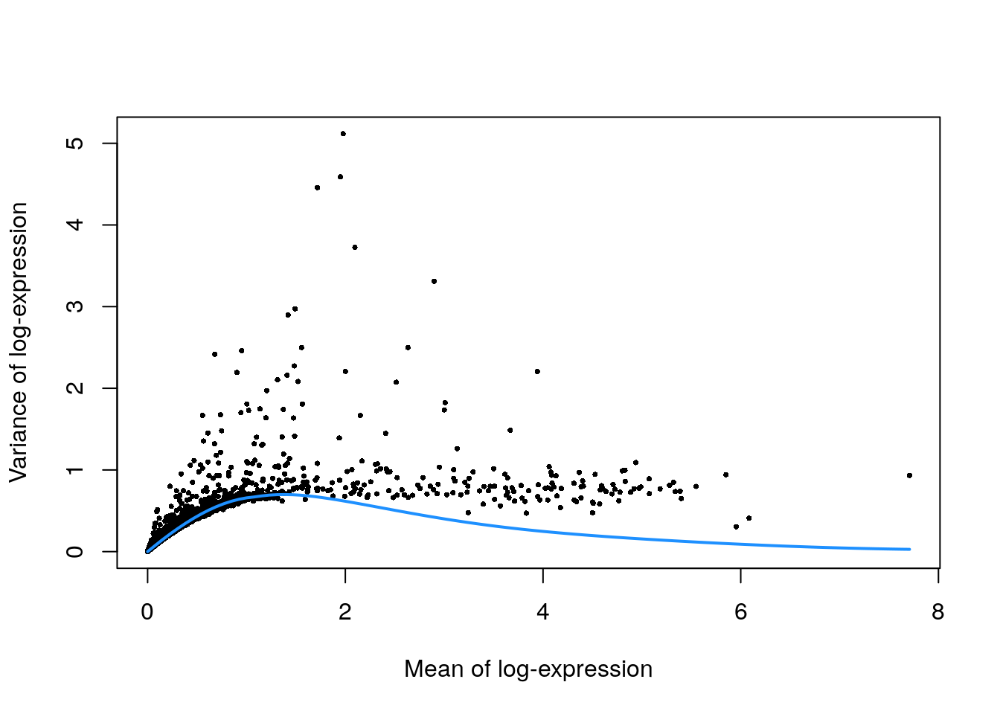

# Unfiltered human PBMCs (10X Genomics)

<script>
document.addEventListener("click", function (event) {
    if (event.target.classList.contains("aaron-collapse")) {
        event.target.classList.toggle("active");
        var content = event.target.nextElementSibling;
        if (content.style.display === "block") {
          content.style.display = "none";
        } else {
          content.style.display = "block";
        }
    }
})
</script>

<style>
.aaron-collapse {
  background-color: #eee;
  color: #444;
  cursor: pointer;
  padding: 18px;
  width: 100%;
  border: none;
  text-align: left;
  outline: none;
  font-size: 15px;
}

.aaron-content {
  padding: 0 18px;
  display: none;
  overflow: hidden;
  background-color: #f1f1f1;
}
</style>

## Introduction

Here, we describe a brief analysis of the peripheral blood mononuclear cell (PBMC) dataset from 10X Genomics [@zheng2017massively].
The data are publicly available from the [10X Genomics website](https://support.10xgenomics.com/single-cell-gene-expression/datasets/2.1.0/pbmc4k),
from which we download the raw gene/barcode count matrices, i.e., before cell calling from the _CellRanger_ pipeline.

## Data loading


```r
library(BiocFileCache)
bfc <- BiocFileCache("raw_data", ask = FALSE)
raw.path <- bfcrpath(bfc, file.path("http://cf.10xgenomics.com/samples",
    "cell-exp/2.1.0/pbmc4k/pbmc4k_raw_gene_bc_matrices.tar.gz"))
untar(raw.path, exdir=file.path(tempdir(), "pbmc4k"))

library(DropletUtils)
fname <- file.path(tempdir(), "pbmc4k/raw_gene_bc_matrices/GRCh38")
sce.pbmc <- read10xCounts(fname, col.names=TRUE)
```


```r
library(scater)
rownames(sce.pbmc) <- uniquifyFeatureNames(
    rowData(sce.pbmc)$ID, rowData(sce.pbmc)$Symbol)

library(EnsDb.Hsapiens.v86)
location <- mapIds(EnsDb.Hsapiens.v86, keys=rowData(sce.pbmc)$ID, 
    column="SEQNAME", keytype="GENEID")
```

## Quality control

We perform cell detection using the `emptyDrops()` algorithm, as discussed in Section \@ref(qc-droplets).


```r
set.seed(100)
e.out <- emptyDrops(counts(sce.pbmc))
sce.pbmc <- sce.pbmc[,which(e.out$FDR <= 0.001)]
```


```r
unfiltered <- sce.pbmc
```

We use a relaxed QC strategy and only remove cells with large mitochondrial proportions, using it as a proxy for cell damage.
This reduces the risk of removing cell types with low RNA content, especially in a heterogeneous PBMC population with many different cell types.


```r
stats <- perCellQCMetrics(sce.pbmc, subsets=list(Mito=which(location=="MT")))
high.mito <- isOutlier(stats$subsets_Mito_percent, type="higher")
sce.pbmc <- sce.pbmc[,!high.mito]
```


```r
summary(high.mito)
```

```
##    Mode   FALSE    TRUE 
## logical    3922     311
```


```r
colData(unfiltered) <- cbind(colData(unfiltered), stats)
unfiltered$discard <- high.mito

gridExtra::grid.arrange(
    plotColData(unfiltered, y="sum", colour_by="discard") +
        scale_y_log10() + ggtitle("Total count"),
    plotColData(unfiltered, y="detected", colour_by="discard") +
        scale_y_log10() + ggtitle("Detected features"),
    plotColData(unfiltered, y="subsets_Mito_percent",
        colour_by="discard") + ggtitle("Mito percent"),
    ncol=2
)
```

<div class="figure">

<p class="caption">(\#fig:unref-unfiltered-pbmc-qc)Distribution of various QC metrics in the PBMC dataset after cell calling. Each point is a cell and is colored according to whether it was discarded by the mitochondrial filter.</p>
</div>


```r
plotColData(unfiltered, x="sum", y="subsets_Mito_percent",
    colour_by="discard") + scale_x_log10()
```

<div class="figure">

<p class="caption">(\#fig:unref-unfiltered-pbmc-mito)Proportion of mitochondrial reads in each cell of the PBMC dataset compared to its total count.</p>
</div>

## Normalization


```r
library(scran)
set.seed(1000)
clusters <- quickCluster(sce.pbmc)
sce.pbmc <- computeSumFactors(sce.pbmc, cluster=clusters)
sce.pbmc <- logNormCounts(sce.pbmc)
```


```r
summary(sizeFactors(sce.pbmc))
```

```
##    Min. 1st Qu.  Median    Mean 3rd Qu.    Max. 
##   0.009   0.710   0.871   1.000   1.094  13.948
```


```r
plot(librarySizeFactors(sce.pbmc), sizeFactors(sce.pbmc), pch=16,
    xlab="Library size factors", ylab="Deconvolution factors", log="xy")
```

<div class="figure">

<p class="caption">(\#fig:unref-unfiltered-pbmc-norm)Relationship between the library size factors and the deconvolution size factors in the PBMC dataset.</p>
</div>

## Variance modelling


```r
set.seed(1001)
dec.pbmc <- modelGeneVarByPoisson(sce.pbmc)
top.pbmc <- getTopHVGs(dec.pbmc, prop=0.1)
```


```r
plot(dec.pbmc$mean, dec.pbmc$total, pch=16, cex=0.5,
    xlab="Mean of log-expression", ylab="Variance of log-expression")
curfit <- metadata(dec.pbmc)
curve(curfit$trend(x), col='dodgerblue', add=TRUE, lwd=2)
```

<div class="figure">

<p class="caption">(\#fig:unref-unfiltered-pbmc-var)Per-gene variance as a function of the mean for the log-expression values in the PBMC dataset. Each point represents a gene (black) with the mean-variance trend (blue) fitted to simulated Poisson counts.</p>
</div>

## Dimensionality reduction


```r
set.seed(10000)
sce.pbmc <- denoisePCA(sce.pbmc, subset.row=top.pbmc, technical=dec.pbmc)

set.seed(100000)
sce.pbmc <- runTSNE(sce.pbmc, dimred="PCA")

set.seed(1000000)
sce.pbmc <- runUMAP(sce.pbmc, dimred="PCA")
```

We verify that a reasonable number of PCs is retained.


```r
ncol(reducedDim(sce.pbmc, "PCA"))
```

```
## [1] 8
```

## Clustering


```r
g <- buildSNNGraph(sce.pbmc, k=10, use.dimred = 'PCA')
clust <- igraph::cluster_walktrap(g)$membership
sce.pbmc$cluster <- factor(clust)
```


```r
table(sce.pbmc$cluster)
```

```
## 
##   1   2   3   4   5   6   7   8   9  10  11  12  13  14  15  16  17  18 
## 585 518 364 458 170 791 295 107  45  46 152  84  40  60 142  16  28  21
```


```r
plotTSNE(sce.pbmc, colour_by="cluster")
```

<div class="figure">

<p class="caption">(\#fig:unref-unfiltered-pbmc-tsne)Obligatory $t$-SNE plot of the PBMC dataset, where each point represents a cell and is colored according to the assigned cluster.</p>
</div>

## Interpretation


```r
markers <- findMarkers(sce.pbmc, groups=sce.pbmc$cluster, 
    pval.type="some", direction="up")
```

We examine the markers for cluster 7 in more detail.
High expression of _CD14_, _CD68_ and _MNDA_ combined with low expression of _CD16_ suggests that this cluster contains monocytes,
compared to macrophages in cluster 12.


```r
marker.set <- markers[["7"]]
as.data.frame(marker.set[1:30,1:3])
```

```
##                  p.value        FDR summary.logFC
## FCN1          4.882e-137 1.645e-132        2.7159
## LGALS2        3.729e-133 6.282e-129        2.1914
## CSTA          1.427e-131 1.603e-127        2.1237
## CFD           1.207e-102  1.017e-98        1.5033
## FGL2           8.567e-93  5.773e-89        1.3589
## IFI30          7.823e-80  4.393e-76        1.2764
## CLEC7A         6.052e-79  2.913e-75        1.1094
## MS4A6A         1.958e-78  8.247e-75        1.4195
## CFP            8.802e-73  3.295e-69        1.3122
## S100A8         6.193e-70  2.087e-66        3.4316
## LYZ            9.327e-70  2.857e-66        3.0166
## LGALS3         1.496e-69  4.200e-66        1.1279
## RP11-1143G9.4  1.673e-69  4.336e-66        2.0166
## VCAN           2.661e-68  6.404e-65        1.2505
## SERPINA1       5.716e-65  1.284e-61        1.7134
## CPVL           1.373e-64  2.890e-61        0.9759
## CD14           4.392e-61  8.704e-58        1.1047
## S100A12        3.343e-59  6.257e-56        1.3923
## TNFSF13B       7.416e-59  1.315e-55        0.9295
## NAMPT          3.018e-57  5.084e-54        0.9750
## CD302          2.232e-56  3.581e-53        0.8216
## S100A9         2.213e-54  3.390e-51        2.5405
## MNDA           7.045e-54  1.032e-50        2.0909
## FCGRT          2.045e-53  2.871e-50        1.1251
## IGSF6          3.575e-53  4.818e-50        0.8448
## CD68           1.122e-52  1.454e-49        1.3482
## AIF1           1.471e-52  1.835e-49        2.7225
## NCF2           2.139e-52  2.574e-49        0.7757
## MPEG1          4.167e-52  4.841e-49        0.7906
## CEBPB          5.306e-51  5.789e-48        1.1035
```


```r
plotExpression(sce.pbmc, features=c("CD14", "CD68",
    "MNDA", "FCGR3A"), x="cluster", colour_by="cluster")
```


## Session Info {-}

<button class="aaron-collapse">View session info</button>
<div class="aaron-content">
```
R Under development (unstable) (2019-12-29 r77627)
Platform: x86_64-pc-linux-gnu (64-bit)
Running under: Ubuntu 14.04.6 LTS

Matrix products: default
BLAS/LAPACK: /app/easybuild/software/OpenBLAS/0.2.18-GCC-5.4.0-2.26-LAPACK-3.6.1/lib/libopenblas_prescottp-r0.2.18.so

locale:
 [1] LC_CTYPE=en_US.UTF-8       LC_NUMERIC=C               LC_TIME=en_US.UTF-8       
 [4] LC_COLLATE=C               LC_MONETARY=en_US.UTF-8    LC_MESSAGES=en_US.UTF-8   
 [7] LC_PAPER=en_US.UTF-8       LC_NAME=C                  LC_ADDRESS=C              
[10] LC_TELEPHONE=C             LC_MEASUREMENT=en_US.UTF-8 LC_IDENTIFICATION=C       

attached base packages:
[1] stats4    parallel  stats     graphics  grDevices utils     datasets  methods   base     

other attached packages:
 [1] scran_1.15.14               EnsDb.Hsapiens.v86_2.99.0   ensembldb_2.11.2           
 [4] AnnotationFilter_1.11.0     GenomicFeatures_1.39.2      AnnotationDbi_1.49.0       
 [7] scater_1.15.12              ggplot2_3.2.1               DropletUtils_1.7.1         
[10] SingleCellExperiment_1.9.1  SummarizedExperiment_1.17.1 DelayedArray_0.13.2        
[13] BiocParallel_1.21.2         matrixStats_0.55.0          Biobase_2.47.2             
[16] GenomicRanges_1.39.1        GenomeInfoDb_1.23.1         IRanges_2.21.2             
[19] S4Vectors_0.25.8            BiocGenerics_0.33.0         BiocFileCache_1.11.4       
[22] dbplyr_1.4.2                Cairo_1.5-10                BiocStyle_2.15.3           
[25] OSCAUtils_0.0.1            

loaded via a namespace (and not attached):
  [1] Rtsne_0.15               ggbeeswarm_0.6.0         colorspace_1.4-1        
  [4] XVector_0.27.0           BiocNeighbors_1.5.1      farver_2.0.1            
  [7] bit64_0.9-7              RSpectra_0.16-0          codetools_0.2-16        
 [10] R.methodsS3_1.7.1        knitr_1.26               zeallot_0.1.0           
 [13] Rsamtools_2.3.2          R.oo_1.23.0              uwot_0.1.5              
 [16] HDF5Array_1.15.2         BiocManager_1.30.10      compiler_4.0.0          
 [19] httr_1.4.1               dqrng_0.2.1              backports_1.1.5         
 [22] assertthat_0.2.1         Matrix_1.2-18            lazyeval_0.2.2          
 [25] limma_3.43.0             BiocSingular_1.3.1       htmltools_0.4.0         
 [28] prettyunits_1.0.2        tools_4.0.0              rsvd_1.0.2              
 [31] igraph_1.2.4.2           gtable_0.3.0             glue_1.3.1              
 [34] GenomeInfoDbData_1.2.2   dplyr_0.8.3              rappdirs_0.3.1          
 [37] Rcpp_1.0.3               vctrs_0.2.1              Biostrings_2.55.4       
 [40] rtracklayer_1.47.0       DelayedMatrixStats_1.9.0 xfun_0.11               
 [43] stringr_1.4.0            ps_1.3.0                 lifecycle_0.1.0         
 [46] irlba_2.3.3              statmod_1.4.32           XML_3.98-1.20           
 [49] edgeR_3.29.0             zlibbioc_1.33.0          scales_1.1.0            
 [52] hms_0.5.2                ProtGenerics_1.19.3      rhdf5_2.31.1            
 [55] yaml_2.2.0               curl_4.3                 memoise_1.1.0           
 [58] gridExtra_2.3            biomaRt_2.43.0           stringi_1.4.3           
 [61] RSQLite_2.2.0            highr_0.8                rlang_0.4.2             
 [64] pkgconfig_2.0.3          bitops_1.0-6             evaluate_0.14           
 [67] lattice_0.20-38          purrr_0.3.3              Rhdf5lib_1.9.0          
 [70] labeling_0.3             GenomicAlignments_1.23.1 cowplot_1.0.0           
 [73] bit_1.1-14               processx_3.4.1           tidyselect_0.2.5        
 [76] magrittr_1.5             bookdown_0.16            R6_2.4.1                
 [79] DBI_1.1.0                pillar_1.4.3             withr_2.1.2             
 [82] RCurl_1.95-4.12          tibble_2.1.3             crayon_1.3.4            
 [85] rmarkdown_2.0            viridis_0.5.1            progress_1.2.2          
 [88] locfit_1.5-9.1           grid_4.0.0               FNN_1.1.3               
 [91] blob_1.2.0               callr_3.4.0              digest_0.6.23           
 [94] R.utils_2.9.2            RcppParallel_4.4.4       openssl_1.4.1           
 [97] munsell_0.5.0            beeswarm_0.2.3           viridisLite_0.3.0       
[100] vipor_0.4.5              askpass_1.1             
```
</div>
