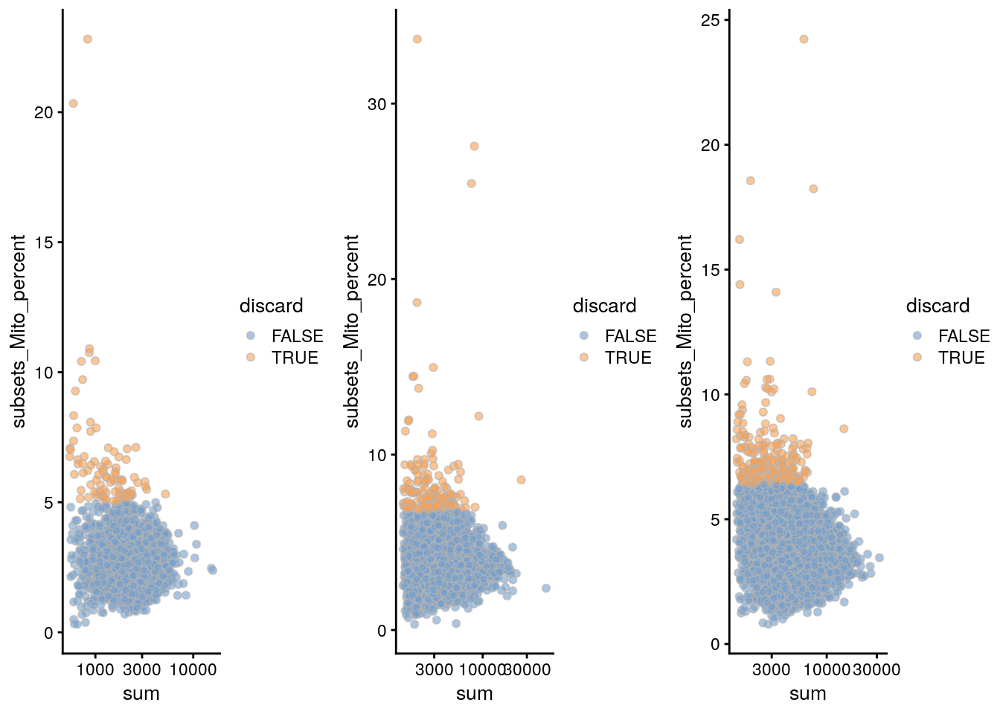
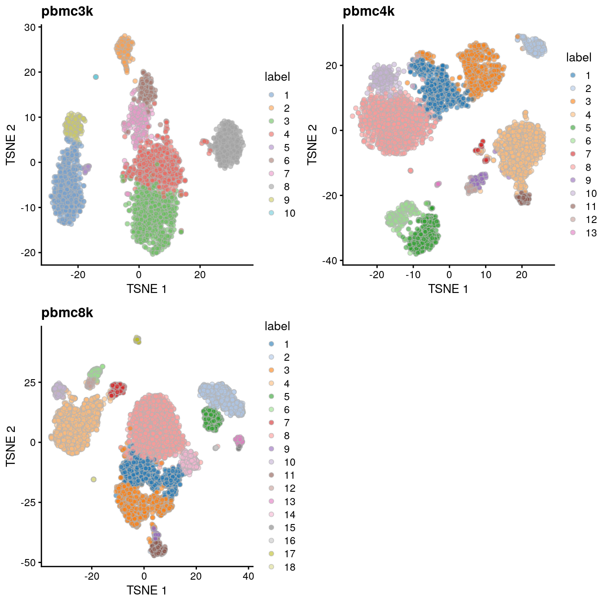

# Filtered human PBMCs (10X Genomics)

<script>
document.addEventListener("click", function (event) {
    if (event.target.classList.contains("aaron-collapse")) {
        event.target.classList.toggle("active");
        var content = event.target.nextElementSibling;
        if (content.style.display === "block") {
          content.style.display = "none";
        } else {
          content.style.display = "block";
        }
    }
})
</script>

<style>
.aaron-collapse {
  background-color: #eee;
  color: #444;
  cursor: pointer;
  padding: 18px;
  width: 100%;
  border: none;
  text-align: left;
  outline: none;
  font-size: 15px;
}

.aaron-content {
  padding: 0 18px;
  display: none;
  overflow: hidden;
  background-color: #f1f1f1;
}
</style>

## Introduction

This performs an analysis of the public PBMC ID dataset generated by 10X Genomics [@zheng2017massively],
starting from the filtered count matrix.

## Data loading


```r
library(TENxPBMCData)
all.sce <- list(
    pbmc3k=TENxPBMCData('pbmc3k'),
    pbmc4k=TENxPBMCData('pbmc4k'),
    pbmc8k=TENxPBMCData('pbmc8k')
)
```

## Quality control


```r
unfiltered <- all.sce
```

Cell calling implicitly serves as a QC step to remove libraries with low total counts and number of detected genes.
Thus, we will only filter on the mitochondrial proportion.


```r
library(scater)
stats <- high.mito <- list()
for (n in names(all.sce)) {
    current <- all.sce[[n]]
    is.mito <- grep("MT", rowData(current)$Symbol_TENx)
    stats[[n]] <- perCellQCMetrics(current, subsets=list(Mito=is.mito))
    high.mito[[n]] <- isOutlier(stats[[n]]$subsets_Mito_percent, type="higher")
    all.sce[[n]] <- current[,!high.mito[[n]]]
}
```


```r
qcplots <- list()
for (n in names(all.sce)) {
    current <- unfiltered[[n]]
    colData(current) <- cbind(colData(current), stats[[n]])
    current$discard <- high.mito[[n]]
    qcplots[[n]] <- plotColData(current, x="sum", y="subsets_Mito_percent",
        colour_by="discard") + scale_x_log10()
}
do.call(gridExtra::grid.arrange, c(qcplots, ncol=3))
```

<div class="figure">

<p class="caption">(\#fig:unref-pbmc-filtered-var)Percentage of mitochondrial reads in each cell in each of the 10X PBMC datasets, compared to the total count. Each point represents a cell and is colored according to whether that cell was discarded.</p>
</div>


```r
lapply(high.mito, summary)
```

```
## $pbmc3k
##    Mode   FALSE    TRUE 
## logical    2609      91 
## 
## $pbmc4k
##    Mode   FALSE    TRUE 
## logical    4182     158 
## 
## $pbmc8k
##    Mode   FALSE    TRUE 
## logical    8157     224
```

## Normalization

We perform library size normalization, simply for convenience when dealing with file-backed matrices.


```r
all.sce <- lapply(all.sce, logNormCounts)
```


```r
lapply(all.sce, function(x) summary(sizeFactors(x)))
```

```
## $pbmc3k
##    Min. 1st Qu.  Median    Mean 3rd Qu.    Max. 
##   0.234   0.748   0.926   1.000   1.157   6.604 
## 
## $pbmc4k
##    Min. 1st Qu.  Median    Mean 3rd Qu.    Max. 
##   0.315   0.711   0.890   1.000   1.127  11.027 
## 
## $pbmc8k
##    Min. 1st Qu.  Median    Mean 3rd Qu.    Max. 
##   0.296   0.704   0.877   1.000   1.118   6.794
```

## Variance modelling


```r
library(scran)
all.dec <- lapply(all.sce, modelGeneVar)
all.hvgs <- lapply(all.dec, getTopHVGs, prop=0.1)
```


```r
par(mfrow=c(1,3))
for (n in names(all.dec)) {
    curdec <- all.dec[[n]]
    plot(curdec$mean, curdec$total, pch=16, cex=0.5, main=n,
        xlab="Mean of log-expression", ylab="Variance of log-expression")
    curfit <- metadata(curdec)
    curve(curfit$trend(x), col='dodgerblue', add=TRUE, lwd=2)
}
```

<div class="figure">

<p class="caption">(\#fig:unref-filtered-pbmc-variance)Per-gene variance as a function of the mean for the log-expression values in each PBMC dataset. Each point represents a gene (black) with the mean-variance trend (blue) fitted to the variances.</p>
</div>

## Dimensionality reduction

For various reasons, we will first analyze each PBMC dataset separately rather than merging them together.
We use randomized SVD, which is more efficient for file-backed matrices.


```r
library(BiocSingular)
set.seed(10000)
all.sce <- mapply(FUN=runPCA, x=all.sce, subset_row=all.hvgs, 
    MoreArgs=list(ncomponents=25, BSPARAM=RandomParam()), 
    SIMPLIFY=FALSE)

set.seed(100000)
all.sce <- lapply(all.sce, runTSNE, dimred="PCA")

set.seed(1000000)
all.sce <- lapply(all.sce, runUMAP, dimred="PCA")
```

## Clustering


```r
for (n in names(all.sce)) {
    g <- buildSNNGraph(all.sce[[n]], k=10, use.dimred='PCA')
    clust <- igraph::cluster_walktrap(g)$membership
    all.sce[[n]]$cluster <- factor(clust)
}
```


```r
lapply(all.sce, function(x) table(x$cluster))
```

```
## $pbmc3k
## 
##   1   2   3   4   5   6   7   8   9  10 
## 487 154 603 514  31 150 179 333 147  11 
## 
## $pbmc4k
## 
##    1    2    3    4    5    6    7    8    9   10   11   12   13 
##  497  185  569  786  373  232   44 1023   77  218   88   54   36 
## 
## $pbmc8k
## 
##    1    2    3    4    5    6    7    8    9   10   11   12   13   14   15   16 
## 1004  759 1073 1543  367  150  201 2067   59  154  244   67   76  285   20   15 
##   17   18 
##   64    9
```


```r
all.tsne <- list()
for (n in names(all.sce)) {
    all.tsne[[n]] <- plotTSNE(all.sce[[n]], colour_by="cluster") + ggtitle(n)
}
do.call(gridExtra::grid.arrange, c(all.tsne, list(ncol=2)))
```

<div class="figure">

<p class="caption">(\#fig:unref-filtered-pbmc-tsne)Obligatory $t$-SNE plots of each PBMC dataset, where each point represents a cell in the corresponding dataset and is colored according to the assigned cluster.</p>
</div>

## Data integration

With the per-dataset analyses out of the way, we will now repeat the analysis after merging together the three batches.


```r
# Intersecting the common genes.
universe <- Reduce(intersect, lapply(all.sce, rownames))
all.sce2 <- lapply(all.sce, "[", i=universe,)
all.dec2 <- lapply(all.dec, "[", i=universe,)

# Renormalizing to adjust for differences in depth.
library(batchelor)
normed.sce <- do.call(multiBatchNorm, all.sce2)

# Identifying a set of HVGs using stats from all batches.
combined.dec <- do.call(combineVar, all.dec2)
combined.hvg <- getTopHVGs(combined.dec, n=5000)

set.seed(1000101)
merged.pbmc <- do.call(fastMNN, c(normed.sce, 
    list(subset.row=combined.hvg, BSPARAM=RandomParam())))
```

We use the percentage of lost variance as a measure.


```r
metadata(merged.pbmc)$merge.info$lost.var
```

```
##         pbmc3k    pbmc4k   pbmc8k
## [1,] 7.003e-03 3.126e-03 0.000000
## [2,] 7.137e-05 5.125e-05 0.003003
```

We proceed to clustering:


```r
g <- buildSNNGraph(merged.pbmc, use.dimred="corrected")
merged.pbmc$cluster <- factor(igraph::cluster_louvain(g)$membership)
table(merged.pbmc$cluster, merged.pbmc$batch)
```

```
##     
##      pbmc3k pbmc4k pbmc8k
##   1     113    387    825
##   2     507    395    806
##   3     175    344    581
##   4     295    539   1018
##   5     346    638   1210
##   6      11      3      9
##   7      17     27    111
##   8      33    113    185
##   9     423    754   1546
##   10      4     36     67
##   11    197    124    221
##   12    150    180    293
##   13    327    588   1125
##   14     11     54    160
```

And visualization:


```r
set.seed(10101010)
merged.pbmc <- runTSNE(merged.pbmc, dimred="corrected")
gridExtra::grid.arrange(
    plotTSNE(merged.pbmc, colour_by="cluster", text_by="cluster", text_colour="red"),
    plotTSNE(merged.pbmc, colour_by="batch")
)
```

<div class="figure">

<p class="caption">(\#fig:unref-filtered-pbmc-merged-tsne)Obligatory $t$-SNE plots for the merged PBMC datasets, where each point represents a cell and is colored by cluster (top) or batch (bottom).</p>
</div>

## Session Info {-}

<button class="aaron-collapse">View session info</button>
<div class="aaron-content">
```
R Under development (unstable) (2020-03-23 r78035)
Platform: x86_64-pc-linux-gnu (64-bit)
Running under: Ubuntu 18.04.4 LTS

Matrix products: default
BLAS:   /home/luna/Software/R/trunk/lib/libRblas.so
LAPACK: /home/luna/Software/R/trunk/lib/libRlapack.so

locale:
 [1] LC_CTYPE=en_US.UTF-8       LC_NUMERIC=C              
 [3] LC_TIME=en_US.UTF-8        LC_COLLATE=en_US.UTF-8    
 [5] LC_MONETARY=en_US.UTF-8    LC_MESSAGES=en_US.UTF-8   
 [7] LC_PAPER=en_US.UTF-8       LC_NAME=C                 
 [9] LC_ADDRESS=C               LC_TELEPHONE=C            
[11] LC_MEASUREMENT=en_US.UTF-8 LC_IDENTIFICATION=C       

attached base packages:
[1] parallel  stats4    stats     graphics  grDevices utils     datasets 
[8] methods   base     

other attached packages:
 [1] batchelor_1.3.14            BiocSingular_1.3.2         
 [3] scran_1.15.22               scater_1.15.28             
 [5] ggplot2_3.3.0               TENxPBMCData_1.5.0         
 [7] HDF5Array_1.15.13           rhdf5_2.31.6               
 [9] SingleCellExperiment_1.9.2  SummarizedExperiment_1.17.3
[11] DelayedArray_0.13.7         BiocParallel_1.21.2        
[13] matrixStats_0.56.0          Biobase_2.47.3             
[15] GenomicRanges_1.39.2        GenomeInfoDb_1.23.13       
[17] IRanges_2.21.5              S4Vectors_0.25.13          
[19] BiocGenerics_0.33.2         BiocStyle_2.15.6           
[21] OSCAUtils_0.0.2            

loaded via a namespace (and not attached):
 [1] bitops_1.0-6                  bit64_0.9-7                  
 [3] RcppAnnoy_0.0.16              httr_1.4.1                   
 [5] tools_4.0.0                   R6_2.4.1                     
 [7] irlba_2.3.3                   vipor_0.4.5                  
 [9] uwot_0.1.8                    DBI_1.1.0                    
[11] colorspace_1.4-1              withr_2.1.2                  
[13] gridExtra_2.3                 tidyselect_1.0.0             
[15] processx_3.4.2                bit_1.1-15.2                 
[17] curl_4.3                      compiler_4.0.0               
[19] BiocNeighbors_1.5.2           labeling_0.3                 
[21] bookdown_0.18                 scales_1.1.0                 
[23] callr_3.4.2                   rappdirs_0.3.1               
[25] stringr_1.4.0                 digest_0.6.25                
[27] rmarkdown_2.1                 XVector_0.27.1               
[29] pkgconfig_2.0.3               htmltools_0.4.0              
[31] limma_3.43.5                  highr_0.8                    
[33] dbplyr_1.4.2                  fastmap_1.0.1                
[35] rlang_0.4.5                   RSQLite_2.2.0                
[37] FNN_1.1.3                     shiny_1.4.0.2                
[39] DelayedMatrixStats_1.9.0      farver_2.0.3                 
[41] dplyr_0.8.5                   RCurl_1.98-1.1               
[43] magrittr_1.5                  GenomeInfoDbData_1.2.2       
[45] Matrix_1.2-18                 Rcpp_1.0.4                   
[47] ggbeeswarm_0.6.0              munsell_0.5.0                
[49] Rhdf5lib_1.9.2                viridis_0.5.1                
[51] lifecycle_0.2.0               edgeR_3.29.1                 
[53] stringi_1.4.6                 yaml_2.2.1                   
[55] zlibbioc_1.33.1               Rtsne_0.15                   
[57] BiocFileCache_1.11.4          AnnotationHub_2.19.7         
[59] grid_4.0.0                    blob_1.2.1                   
[61] dqrng_0.2.1                   promises_1.1.0               
[63] ExperimentHub_1.13.5          crayon_1.3.4                 
[65] lattice_0.20-40               cowplot_1.0.0                
[67] beachmat_2.3.2                locfit_1.5-9.1               
[69] knitr_1.28                    ps_1.3.2                     
[71] pillar_1.4.3                  igraph_1.2.5                 
[73] codetools_0.2-16              glue_1.3.2                   
[75] BiocVersion_3.11.1            evaluate_0.14                
[77] BiocManager_1.30.10           vctrs_0.2.4                  
[79] httpuv_1.5.2                  gtable_0.3.0                 
[81] purrr_0.3.3                   assertthat_0.2.1             
[83] xfun_0.12                     rsvd_1.0.3                   
[85] mime_0.9                      xtable_1.8-4                 
[87] RSpectra_0.16-0               later_1.0.0                  
[89] viridisLite_0.3.0             tibble_2.1.3                 
[91] AnnotationDbi_1.49.1          beeswarm_0.2.3               
[93] memoise_1.1.0                 statmod_1.4.34               
[95] interactiveDisplayBase_1.25.0
```
</div>
