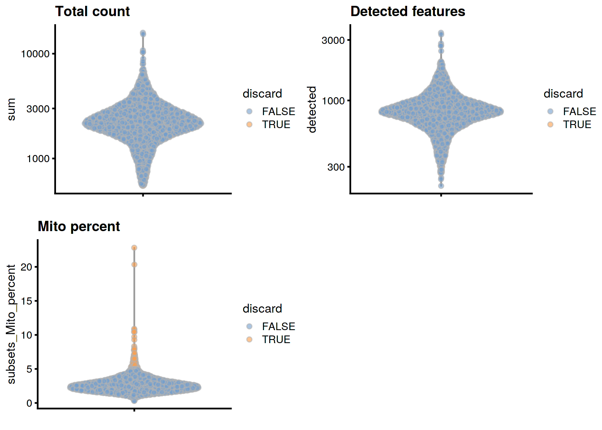
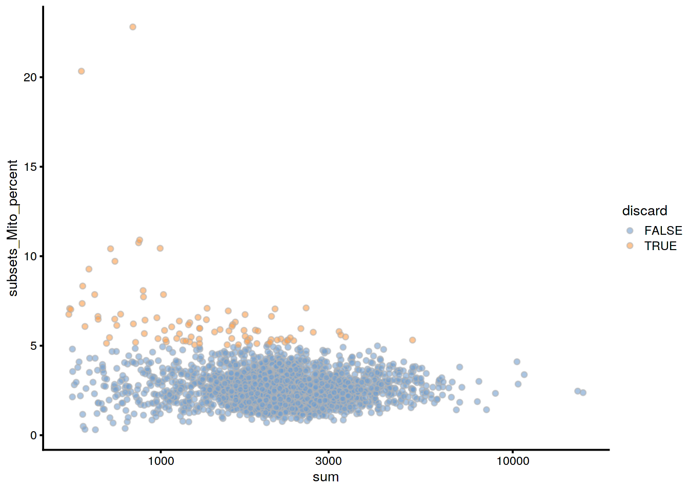
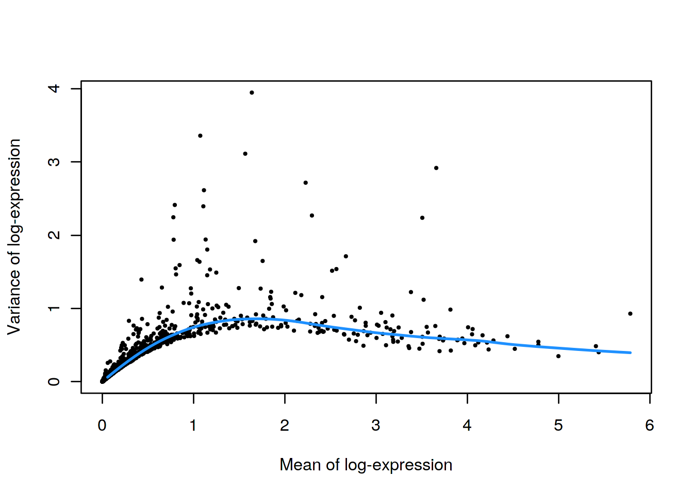
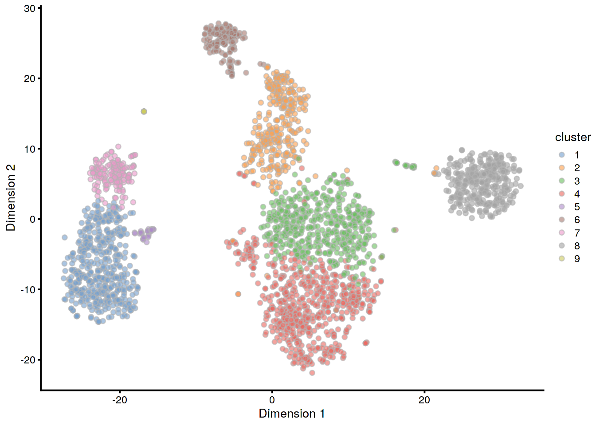

<!-- AUTOMATICALLY GENERATED, DO NOT EDIT! -->

# PBMC 3k 10X dataset (filtered)

<script>
document.addEventListener("click", function (event) {
    if (event.target.classList.contains("aaron-collapse")) {
        event.target.classList.toggle("active");
        var content = event.target.nextElementSibling;
        if (content.style.display === "block") {
          content.style.display = "none";
        } else {
          content.style.display = "block";
        }
    }
})
</script>

<style>
.aaron-collapse {
  background-color: #eee;
  color: #444;
  cursor: pointer;
  padding: 18px;
  width: 100%;
  border: none;
  text-align: left;
  outline: none;
  font-size: 15px;
}

.aaron-content {
  padding: 0 18px;
  display: none;
  overflow: hidden;
  background-color: #f1f1f1;
}
</style>

## Introduction

This performs an analysis of the public PBMC 3k dataset generated by 10X Genomics [@zheng2017massively],
starting from the filtered count matrix.

## Analysis code

### Data loading


```r
library(TENxPBMCData)
pbmc3k <- TENxPBMCData('pbmc3k')
```

### Quality control


```r
unfiltered <- pbmc3k
```

Cell calling implicitly serves as a QC step to remove libraries with low total counts and number of detected genes.
Thus, we will only filter on the mitochondrial proportion.


```r
is.mito <- grep("MT", rowData(pbmc3k)$Symbol_TENx)

library(scater)
stats <- perCellQCMetrics(pbmc3k, subsets=list(Mito=is.mito))
high.mito <- isOutlier(stats$subsets_Mito_percent, type="higher")
pbmc3k <- pbmc3k[,!high.mito]
```

### Normalization


```r
pbmc3k <- logNormCounts(pbmc3k)
```

### Variance modelling


```r
library(scran)
dec3k <- modelGeneVar(pbmc3k)
chosen.hvgs <- getTopHVGs(dec3k, prop=0.1)
```

### Dimensionality reduction

We use randomized SVD, which is more efficient for file-backed matrices.


```r
set.seed(10000)
pbmc3k <- runPCA(pbmc3k, subset_row=chosen.hvgs, ncomponents=25,
    BSPARAM=BiocSingular::RandomParam())

set.seed(100000)
pbmc3k <- runTSNE(pbmc3k, dimred="PCA")

set.seed(1000000)
pbmc3k <- runUMAP(pbmc3k, dimred="PCA")
```

### Clustering


```r
g <- buildSNNGraph(pbmc3k, k=10, use.dimred = 'PCA')
clust <- igraph::cluster_walktrap(g)$membership
pbmc3k$cluster <- factor(clust)
```

## Results

### Quality control statistics


```r
colData(unfiltered) <- cbind(colData(unfiltered), stats)
unfiltered$discard <- high.mito

gridExtra::grid.arrange(
    plotColData(unfiltered, y="sum", colour_by="discard") +
        scale_y_log10() + ggtitle("Total count"),
    plotColData(unfiltered, y="detected", colour_by="discard") +
        scale_y_log10() + ggtitle("Detected features"),
    plotColData(unfiltered, y="subsets_Mito_percent",
        colour_by="discard") + ggtitle("Mito percent"),
    ncol=2
)
```




```r
plotColData(unfiltered, x="sum", y="subsets_Mito_percent",
    colour_by="discard") + scale_x_log10()
```




```r
summary(high.mito)
```

```
##    Mode   FALSE    TRUE 
## logical    2609      91
```

### Normalization


```r
summary(sizeFactors(pbmc3k))
```

```
##    Min. 1st Qu.  Median    Mean 3rd Qu.    Max. 
##   0.234   0.748   0.926   1.000   1.157   6.604
```

### Variance modelling


```r
plot(dec3k$mean, dec3k$total, pch=16, cex=0.5,
    xlab="Mean of log-expression", ylab="Variance of log-expression")
curfit <- metadata(dec3k)
curve(curfit$trend(x), col='dodgerblue', add=TRUE, lwd=2)
```



### Clustering


```r
table(pbmc3k$cluster)
```

```
## 
##   1   2   3   4   5   6   7   8   9  10 
## 487 154 603 514  31 150 179 333 147  11
```


```r
plotTSNE(pbmc3k, colour_by="cluster")
```




## Session Info {-}

<button class="aaron-collapse">View session info</button>
<div class="aaron-content">
```
R version 3.6.1 (2019-07-05)
Platform: x86_64-pc-linux-gnu (64-bit)
Running under: Ubuntu 14.04.5 LTS

Matrix products: default
BLAS:   /home/ramezqui/Rbuild/danbuild/R-3.6.1/lib/libRblas.so
LAPACK: /home/ramezqui/Rbuild/danbuild/R-3.6.1/lib/libRlapack.so

locale:
 [1] LC_CTYPE=en_US.UTF-8       LC_NUMERIC=C              
 [3] LC_TIME=en_US.UTF-8        LC_COLLATE=C              
 [5] LC_MONETARY=en_US.UTF-8    LC_MESSAGES=en_US.UTF-8   
 [7] LC_PAPER=en_US.UTF-8       LC_NAME=C                 
 [9] LC_ADDRESS=C               LC_TELEPHONE=C            
[11] LC_MEASUREMENT=en_US.UTF-8 LC_IDENTIFICATION=C       

attached base packages:
[1] parallel  stats4    stats     graphics  grDevices utils     datasets 
[8] methods   base     

other attached packages:
 [1] scran_1.13.32               scater_1.13.27             
 [3] ggplot2_3.2.1               TENxPBMCData_1.3.0         
 [5] HDF5Array_1.13.11           rhdf5_2.29.6               
 [7] SingleCellExperiment_1.7.11 SummarizedExperiment_1.15.9
 [9] DelayedArray_0.11.8         BiocParallel_1.19.5        
[11] matrixStats_0.55.0          Biobase_2.45.1             
[13] GenomicRanges_1.37.17       GenomeInfoDb_1.21.2        
[15] IRanges_2.19.17             S4Vectors_0.23.25          
[17] BiocGenerics_0.31.6         Cairo_1.5-10               
[19] BiocStyle_2.13.2            OSCAUtils_0.0.1            

loaded via a namespace (and not attached):
 [1] bitops_1.0-6                  bit64_0.9-7                  
 [3] httr_1.4.1                    tools_3.6.1                  
 [5] backports_1.1.5               R6_2.4.0                     
 [7] irlba_2.3.3                   vipor_0.4.5                  
 [9] uwot_0.1.4                    DBI_1.0.0                    
[11] lazyeval_0.2.2                colorspace_1.4-1             
[13] withr_2.1.2                   gridExtra_2.3                
[15] tidyselect_0.2.5              bit_1.1-14                   
[17] curl_4.2                      compiler_3.6.1               
[19] BiocNeighbors_1.3.5           labeling_0.3                 
[21] bookdown_0.14                 scales_1.0.0                 
[23] rappdirs_0.3.1                stringr_1.4.0                
[25] digest_0.6.22                 rmarkdown_1.16               
[27] XVector_0.25.0                pkgconfig_2.0.3              
[29] htmltools_0.4.0               limma_3.41.18                
[31] dbplyr_1.4.2                  fastmap_1.0.1                
[33] rlang_0.4.0                   RSQLite_2.1.2                
[35] FNN_1.1.3                     shiny_1.4.0                  
[37] DelayedMatrixStats_1.7.2      dplyr_0.8.3                  
[39] RCurl_1.95-4.12               magrittr_1.5                 
[41] BiocSingular_1.1.7            GenomeInfoDbData_1.2.1       
[43] Matrix_1.2-17                 Rcpp_1.0.2                   
[45] ggbeeswarm_0.6.0              munsell_0.5.0                
[47] Rhdf5lib_1.7.6                viridis_0.5.1                
[49] edgeR_3.27.14                 stringi_1.4.3                
[51] yaml_2.2.0                    zlibbioc_1.31.0              
[53] Rtsne_0.15                    BiocFileCache_1.9.1          
[55] AnnotationHub_2.17.10         grid_3.6.1                   
[57] blob_1.2.0                    dqrng_0.2.1                  
[59] promises_1.1.0                ExperimentHub_1.11.6         
[61] crayon_1.3.4                  lattice_0.20-38              
[63] cowplot_1.0.0                 beachmat_2.1.2               
[65] locfit_1.5-9.1                zeallot_0.1.0                
[67] knitr_1.25                    pillar_1.4.2                 
[69] igraph_1.2.4.1                codetools_0.2-16             
[71] glue_1.3.1                    evaluate_0.14                
[73] RcppParallel_4.4.3            BiocManager_1.30.8           
[75] vctrs_0.2.0                   httpuv_1.5.2                 
[77] gtable_0.3.0                  purrr_0.3.3                  
[79] assertthat_0.2.1              xfun_0.10                    
[81] rsvd_1.0.2                    mime_0.7                     
[83] xtable_1.8-4                  RSpectra_0.15-0              
[85] later_1.0.0                   viridisLite_0.3.0            
[87] tibble_2.1.3                  AnnotationDbi_1.47.1         
[89] beeswarm_0.2.3                memoise_1.1.0                
[91] statmod_1.4.32                interactiveDisplayBase_1.23.0
```
</div>
