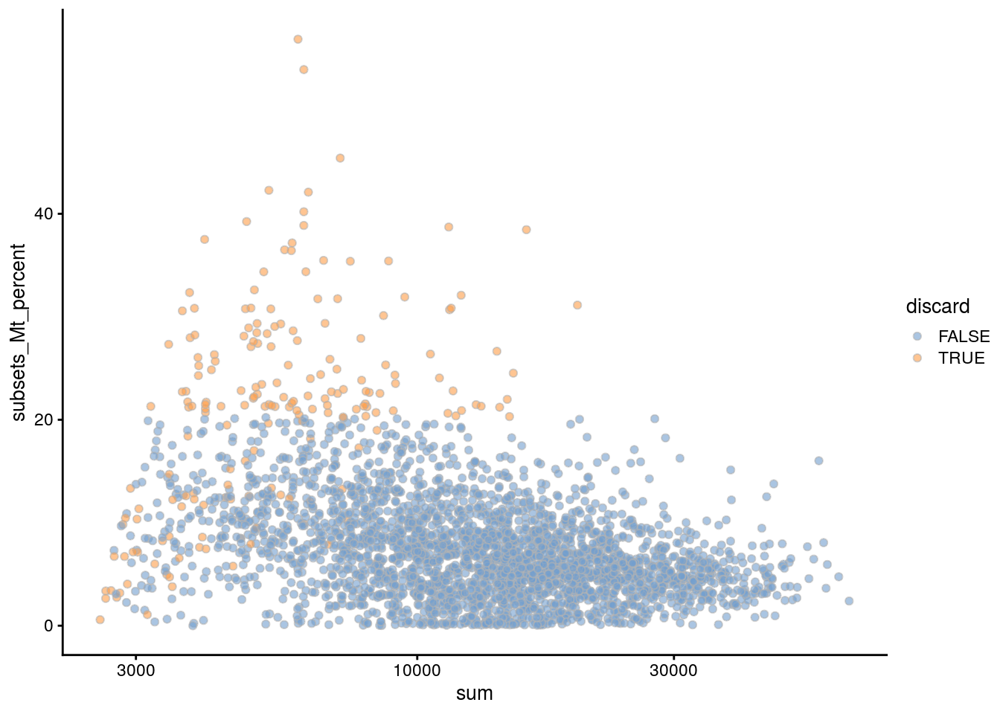
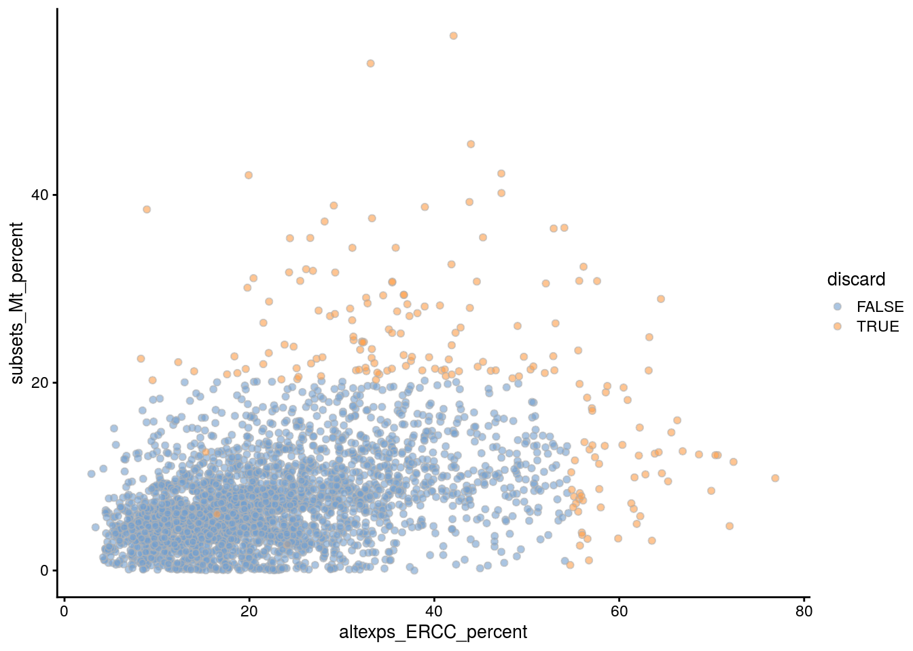
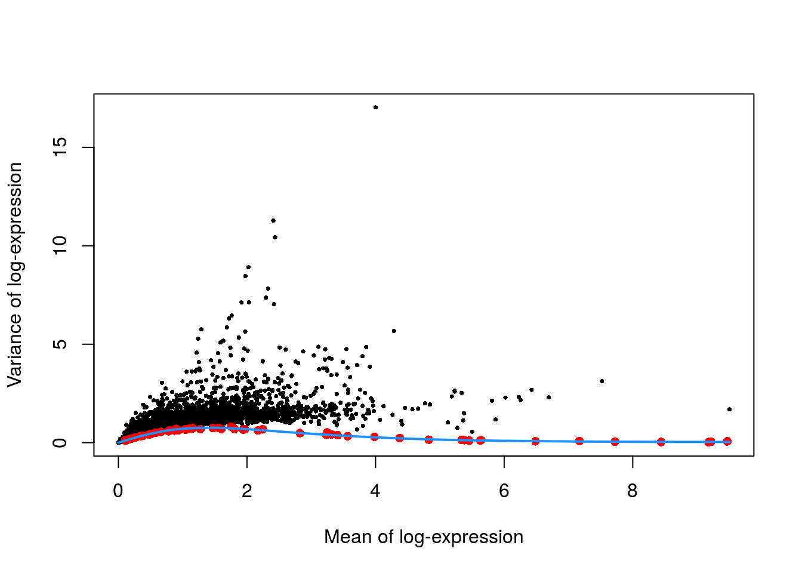
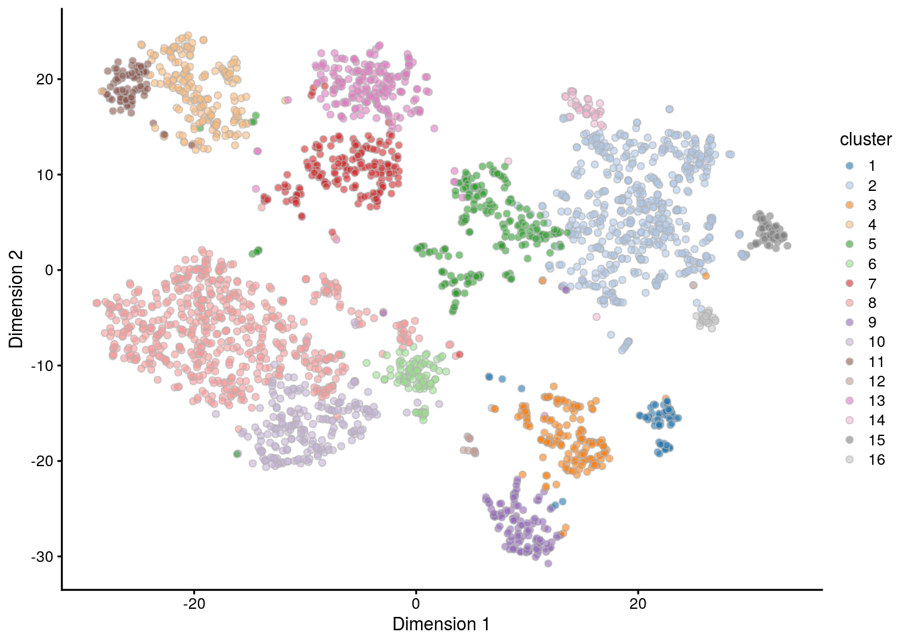
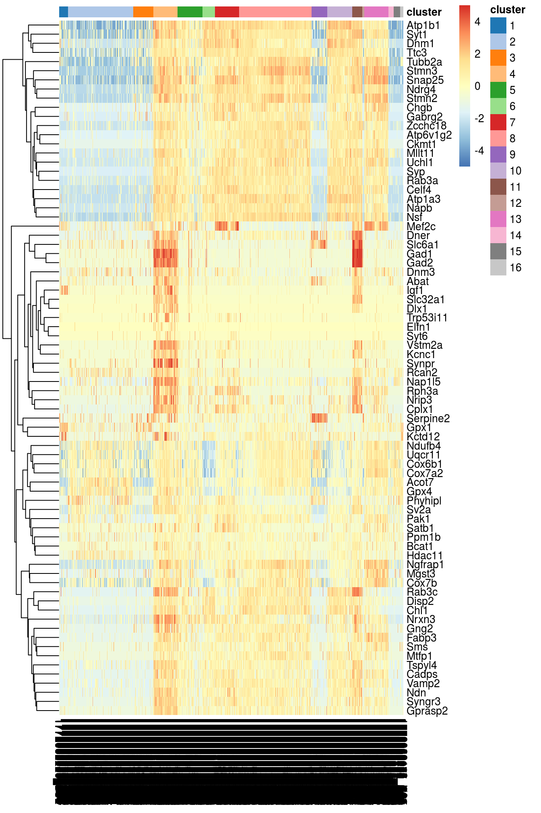
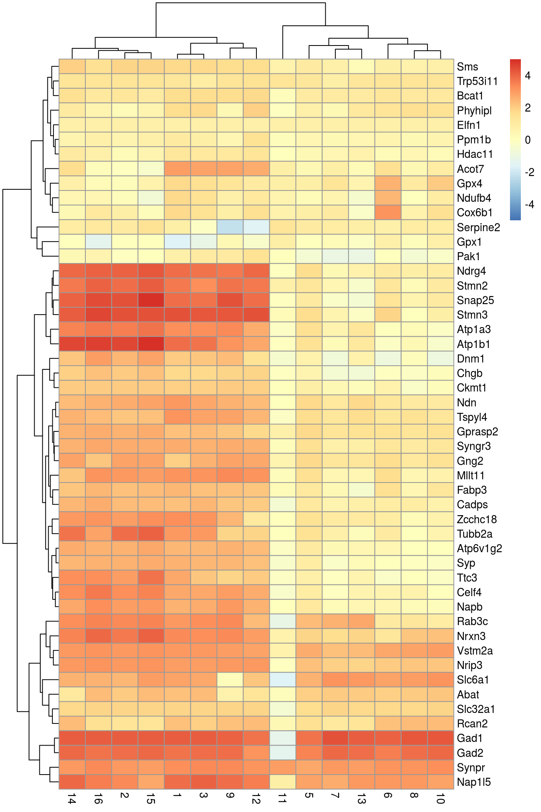

# Mouse brain dataset 


## Introduction

Here, we examine a heterogeneous dataset from a study of cell types in the mouse brain [@zeisel2015brain].
This contains approximately 3000 cells of varying types such as oligodendrocytes, microglia and neurons.
Individual cells were isolated using the Fluidigm C1 microfluidics system [@pollen2014lowcoverage] and library preparation was performed on each cell using a UMI-based protocol.
After sequencing, expression was quantified by counting the number of unique molecular identifiers (UMIs) mapped to each gene.

## Analysis

### Data loading

We remove repeats and merge together redundant rows corresponding to alternative genomic locations for the same gene.
Specifically, we sum the counts for all rows corresponding to a single gene for ease of interpretation,
and create a new `SingleCellExperiment` with these aggregated counts.


```r
library(scRNAseq)
sce.zeisel <- ZeiselBrainData()
sce.zeisel <- sce.zeisel[rowData(sce.zeisel)$featureType!="repeat",]

library(scater)
sce.zeisel <- aggregateAcrossFeatures(sce.zeisel, 
    id=sub("_loc[0-9]+$", "", rownames(sce.zeisel)))
```

### Gene annotation


```r
library(org.Mm.eg.db)
ensembl <- mapIds(org.Mm.eg.db, keys=rownames(sce.zeisel), 
    keytype="SYMBOL", column="ENSEMBL")
rowData(sce.zeisel)$ENSEMBL <- ensembl
```

### Quality control


```r
unfiltered <- sce.zeisel
```

The original authors of the study have already removed low-quality cells prior to data publication.
Nonetheless, we compute some quality control metrics to check whether the remaining cells are satisfactory.


```r
stats <- perCellQCMetrics(sce.zeisel, subsets=list(
    Mt=rowData(sce.zeisel)$featureType=="mito"))
qc <- quickCellQC(stats, percent_subsets=c("altexps_ERCC_percent", 
    "subsets_Mt_percent"), nmads=3)
sce.zeisel <- sce.zeisel[,!qc$discard]
```

### Normalization


```r
library(scran)
set.seed(1000)
clusters <- quickCluster(sce.zeisel)
sce.zeisel <- computeSumFactors(sce.zeisel, cluster=clusters) 
sce.zeisel <- logNormCounts(sce.zeisel)
```

### Variance modelling

In theory, we should block on the plate of origin for each cell.
However, only 20-40 cells are available on each plate, and the population is also highly heterogeneous.
This means that we cannot assume that the distribution of sampled cell types on each plate is the same.
Thus, to avoid regressing out potential biology, we will not block on any factors in this analysis.


```r
dec.zeisel <- modelGeneVarWithSpikes(sce.zeisel, "ERCC")
```

### Dimensionality reduction

Note that `denoisePCA()` automatically selects for genes with positive components, 
so explicit specification of `subset.row=` is not required.


```r
library(BiocSingular)
set.seed(101011001)
sce.zeisel <- denoisePCA(sce.zeisel, technical=dec.zeisel, BSPARAM=IrlbaParam())
sce.zeisel <- runTSNE(sce.zeisel, dimred="PCA")
```

### Clustering


```r
snn.gr <- buildSNNGraph(sce.zeisel, use.dimred="PCA")
sce.zeisel$cluster <- factor(igraph::cluster_walktrap(snn.gr)$membership)
```

## Results

### Quality control statistics


```r
colData(unfiltered) <- cbind(colData(unfiltered), stats)
unfiltered$discard <- qc$discard

gridExtra::grid.arrange(
    plotColData(unfiltered, y="sum", colour_by="discard") +
        scale_y_log10() + ggtitle("Total count"),
    plotColData(unfiltered, y="detected", colour_by="discard") +
        scale_y_log10() + ggtitle("Detected features"),
    plotColData(unfiltered, y="altexps_ERCC_percent",
        colour_by="discard") + ggtitle("ERCC percent"),
    plotColData(unfiltered, y="subsets_Mt_percent",
        colour_by="discard") + ggtitle("Mito percent"),
    ncol=2
)
```


```r
plotColData(unfiltered, x="sum", y="subsets_Mt_percent",
    colour_by="discard") + scale_x_log10()
```



```r
plotColData(unfiltered, x="altexps_ERCC_percent", y="subsets_Mt_percent",
    colour_by="discard")
```




```r
colSums(as.matrix(qc))
```

```
##              low_lib_size            low_n_features 
##                         0                         3 
## high_altexps_ERCC_percent   high_subsets_Mt_percent 
##                        65                       128 
##                   discard 
##                       189
```

### Normalization


```r
summary(sizeFactors(sce.zeisel))
```

```
##    Min. 1st Qu.  Median    Mean 3rd Qu.    Max. 
##    0.13    0.48    0.82    1.00    1.32    4.81
```


```r
plot(librarySizeFactors(sce.zeisel), sizeFactors(sce.zeisel), pch=16,
    xlab="Library size factors", ylab="Deconvolution factors", log="xy")
```


### Variance modelling

The technical and total variances are much smaller than those in the read-based datasets.
This is due to the use of UMIs, which reduces the noise caused by variable PCR amplification.
Furthermore, the spike-in trend is consistently lower than the variances of the endogenous genes.
This reflects the heterogeneity in gene expression across cells of different types.


```r
plot(dec.zeisel$mean, dec.zeisel$total, pch=16, cex=0.5,
    xlab="Mean of log-expression", ylab="Variance of log-expression")
curfit <- metadata(dec.zeisel)
points(curfit$mean, curfit$var, col="red", pch=16)
curve(curfit$trend(x), col='dodgerblue', add=TRUE, lwd=2)
```



### Dimensionality reduction


```r
ncol(reducedDim(sce.zeisel, "PCA"))
```

```
## [1] 50
```

### Clustering


```r
table(sce.zeisel$cluster)
```

```
## 
##   1   2   3   4   5   6   7   8   9  10  11  12  13  14  15  16 
##  72 534 167 195 206 101 197 593 129 203  85  14 200  42  53  25
```


```r
plotTSNE(sce.zeisel, colour_by="cluster")
```



### Interpretation


We focus on upregulated marker genes as these can quickly provide positive identification of cell type in a heterogeneous population.
We examine the table for cluster 4, in which log-fold changes are reported between cluster 4 and every other cluster.
The same output is provided for each cluster in order to identify genes that discriminate between clusters.


```r
markers <- findMarkers(sce.zeisel, sce.zeisel$cluster, direction="up")
marker.set <- markers[["4"]]
head(marker.set[,1:8], 10) # only first 8 columns, for brevity
```

```
## DataFrame with 10 rows and 8 columns
##               Top               p.value                   FDR
##         <integer>             <numeric>             <numeric>
## Snap25          1 1.89250170367202e-271 3.75453412991493e-267
## Mllt11          1 1.51143016587263e-198  5.9970526121495e-195
## Gad1            1 7.61960907109413e-179 1.88956780451795e-175
## Atp1a3          1 1.92427110285748e-168 2.54504096063934e-165
## Celf4           1 8.34102774997996e-168 1.03423530957407e-164
## Ndn             1 4.54700749300098e-144 3.75867006890193e-141
## Vstm2a          1 9.51443787058121e-109 3.49549875767522e-106
## Synpr           1  5.23099454814645e-72  6.25166872534203e-70
## Slc32a1         1  2.59209368203047e-66  2.49633721154384e-64
## Ndrg4           2 5.79430202499945e-236 5.74765789369854e-232
##                  logFC.1          logFC.2          logFC.3
##                <numeric>        <numeric>        <numeric>
## Snap25  3.88670036821469 4.30914890423118 3.79720866242651
## Mllt11  3.16869973795579 3.00773025022756 3.10246654261723
## Gad1     4.1809765772547 4.18474848049613 4.12829492170707
## Atp1a3  3.26120492686749 3.56940415755333 3.29072198770609
## Celf4   2.76807817623127 3.24872640870414 2.79332190468448
## Ndn     3.04681475193341 2.61981616252683 2.79263185434029
## Vstm2a   3.0289770812524 3.02829841624827 3.03503666373167
## Synpr   3.20968070920293 3.00164389973715 3.32375802516086
## Slc32a1 1.83319809501735 1.82038329280149 1.83319809501735
## Ndrg4    3.8196774532832 4.03898665167331 3.74014483126438
##                   logFC.5            logFC.6
##                 <numeric>          <numeric>
## Snap25   1.07670109293827   1.36615019990328
## Mllt11   1.56572545246833   1.60598297934231
## Gad1     3.74078692648299   4.03200792797037
## Atp1a3   1.56550859133349 0.0980072282917517
## Celf4   0.979799545755635  0.582277979848379
## Ndn      1.74510569393716   1.20437448171661
## Vstm2a   2.60017354688132   2.77643808672538
## Synpr    2.70722616294867   3.17927305686069
## Slc32a1  1.66697721376767   1.70366704904145
## Ndrg4    1.63090136754525    1.0479643935403
```


The heatmap below indicates that most of the top markers are strongly DE in cells of cluster 4 compared to some or all of the other clusters.
We can use these markers to identify cells from cluster 4 in validation studies with an independent population of cells.
A quick look at the markers suggest that cluster 4 represents interneurons based on expression of *Gad1* and *Slc6a1* [@zeng2012largescale],
differing from closely related cells in cluster 11 by virtue of high *Synpr* expression.


```r
top.markers <- rownames(marker.set)[marker.set$Top <= 10]
plotHeatmap(sce.zeisel, features=top.markers, columns=order(sce.zeisel$cluster),
    colour_columns_by="cluster", cluster_cols=FALSE,
    center=TRUE, symmetric=TRUE, zlim=c(-5, 5))
```



An alternative visualization approach is to plot the log-fold changes to all other clusters directly.
This is more concise and is useful in situations involving many clusters that contain different numbers of cells.


```r
logFCs <- as.matrix(marker.set[1:50,-(1:3)])
colnames(logFCs) <- sub("logFC.", "", colnames(logFCs))

library(pheatmap)
max.lfc <- max(abs(range(logFCs)))
pheatmap(logFCs, breaks=seq(-5, 5, length.out=101))
```


