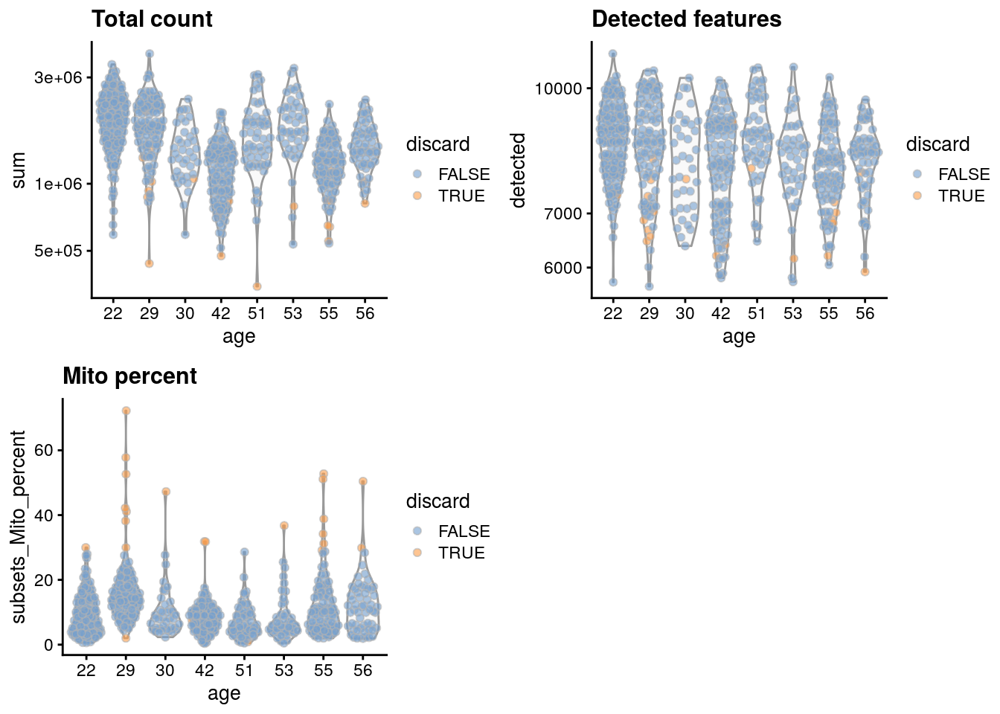
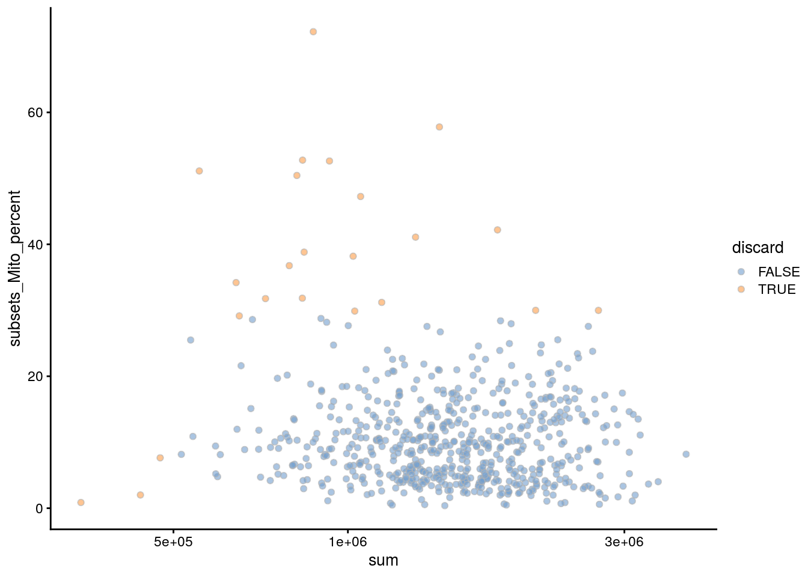
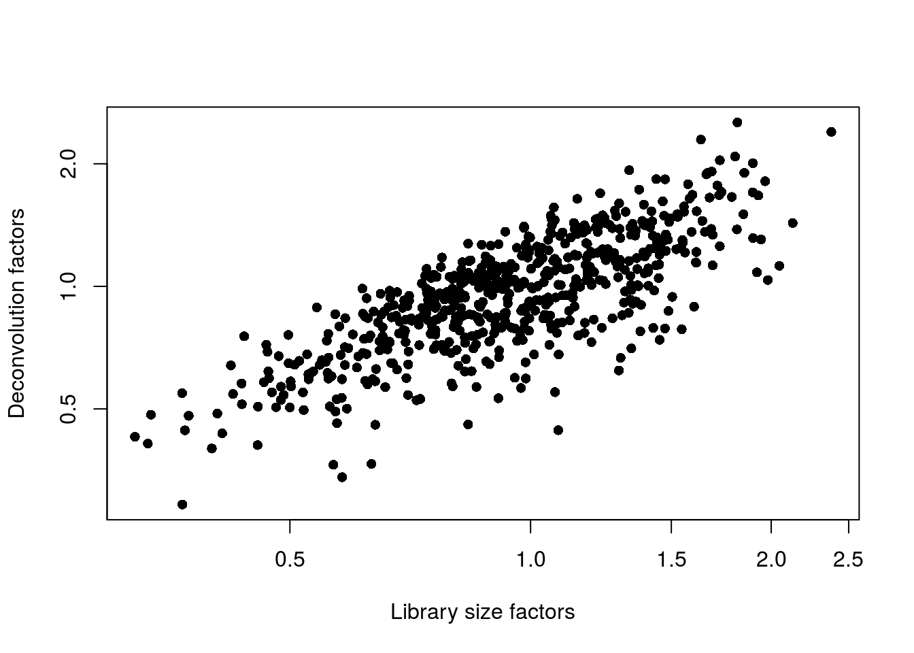
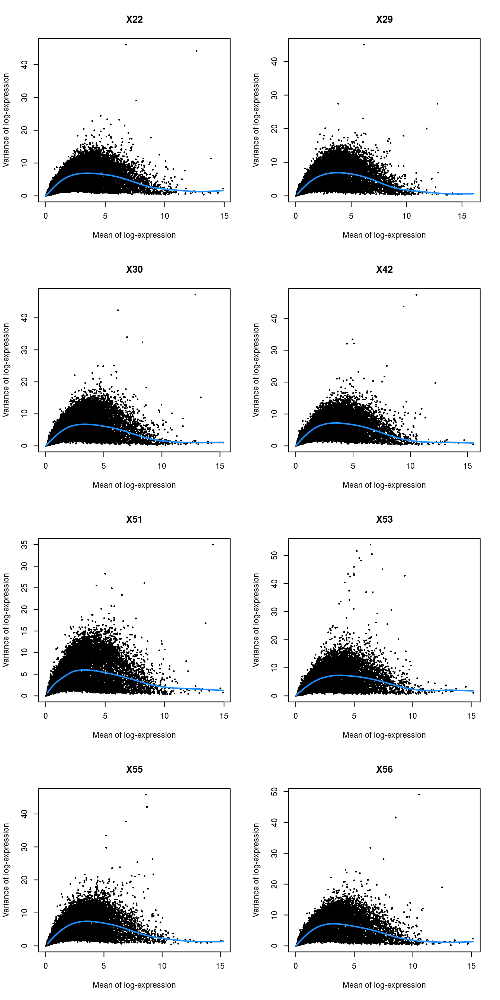

# Human pancreas dataset (Lawlor)


## Introduction

This performs an analysis of the @lawlor2017singlecell dataset,
consisting of human pancreas cells from various donors.

## Analysis code

### Data loading


```r
library(scRNAseq)
sce.lawlor <- LawlorPancreasData()
```

### Gene annotation


```r
library(AnnotationHub)
edb <- AnnotationHub()[["AH73881"]]
anno <- select(edb, keys=rownames(sce.lawlor), keytype="GENEID", 
    columns=c("SYMBOL", "SEQNAME"))
rowData(sce.lawlor) <- anno[match(rownames(sce.lawlor), anno[,1]),-1]
```

### Quality control


```r
unfiltered <- sce.lawlor
```


```r
library(scater)
stats <- perCellQCMetrics(sce.lawlor, 
    subsets=list(Mito=which(rowData(sce.lawlor)$SEQNAME=="MT")))
qc <- quickCellQC(stats, percent_subsets="subsets_Mito_percent", nmads=3)
sce.lawlor <- sce.lawlor[,!qc$discard]
```

### Normalization


```r
library(scran)
set.seed(1000)
clusters <- quickCluster(sce.lawlor)
sce.lawlor <- computeSumFactors(sce.lawlor, clusters=clusters)
sce.lawlor <- logNormCounts(sce.lawlor)
```

### Variance modelling

Using age as a proxy for the donor.


```r
dec.lawlor <- modelGeneVar(sce.lawlor, block=sce.lawlor$age)
chosen.genes <- head(order(dec.lawlor$bio, decreasing=TRUE), 2000)
```

### Dimensionality reduction


```r
library(BiocSingular)
set.seed(101011001)
sce.lawlor <- runPCA(sce.lawlor, subset_row=chosen.genes, 
    ncomponents=25, BSPARAM=IrlbaParam())
sce.lawlor <- runTSNE(sce.lawlor, dimred="PCA")
```

### Clustering


```r
snn.gr <- buildSNNGraph(sce.lawlor, use.dimred="PCA")
sce.lawlor$cluster <- factor(igraph::cluster_walktrap(snn.gr)$membership)
```

## Results

### Quality control statistics


```r
colData(unfiltered) <- cbind(colData(unfiltered), stats)
unfiltered$discard <- qc$discard

gridExtra::grid.arrange(
    plotColData(unfiltered, x="age", y="sum", colour_by="discard") +
        scale_y_log10() + ggtitle("Total count"),
    plotColData(unfiltered, x="age", y="detected", colour_by="discard") +
        scale_y_log10() + ggtitle("Detected features"),
    plotColData(unfiltered, x="age", y="subsets_Mito_percent",
        colour_by="discard") + ggtitle("Mito percent"),
    ncol=2
)
```




```r
plotColData(unfiltered, x="sum", y="subsets_Mito_percent",
    colour_by="discard") + scale_x_log10()
```




```r
colSums(as.matrix(qc))
```

```
##              low_lib_size            low_n_features 
##                         3                         0 
## high_subsets_Mito_percent                   discard 
##                        20                        23
```

### Normalization


```r
summary(sizeFactors(sce.lawlor))
```

```
##    Min. 1st Qu.  Median    Mean 3rd Qu.    Max. 
##   0.283   0.767   0.963   1.000   1.192   2.405
```


```r
plot(librarySizeFactors(sce.lawlor), sizeFactors(sce.lawlor), pch=16,
    xlab="Library size factors", ylab="Deconvolution factors", log="xy")
```



### Variance modelling


```r
par(mfrow=c(4,2))
blocked.stats <- dec.lawlor$per.block
for (i in colnames(blocked.stats)) {
    current <- blocked.stats[[i]]
    plot(current$mean, current$total, main=i, pch=16, cex=0.5,
        xlab="Mean of log-expression", ylab="Variance of log-expression")
    curfit <- metadata(current)
    curve(curfit$trend(x), col='dodgerblue', add=TRUE, lwd=2)
}
```



### Clustering


```r
table(sce.lawlor$cluster)
```

```
## 
##   1   2   3   4   5   6   7   8   9  10 
##  25  27  86 140  96  22 172  18  17  12
```


```r
plotTSNE(sce.lawlor, colour_by="cluster")
```


