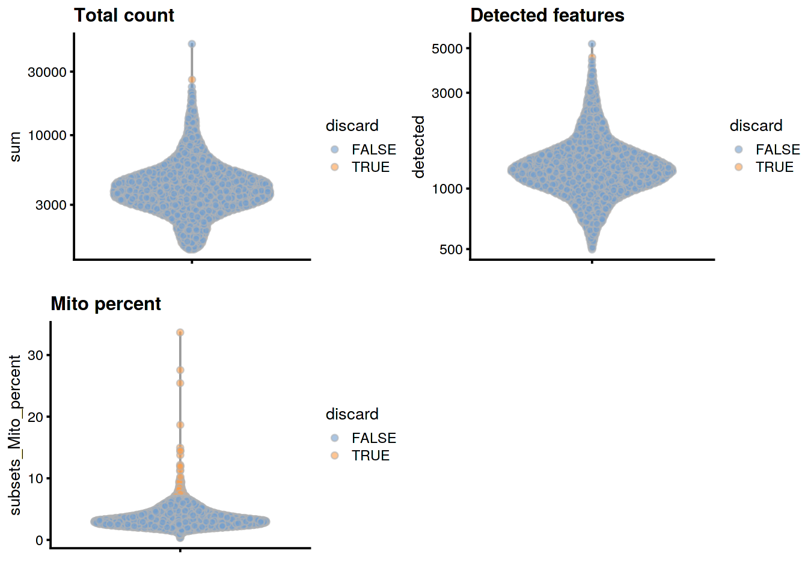
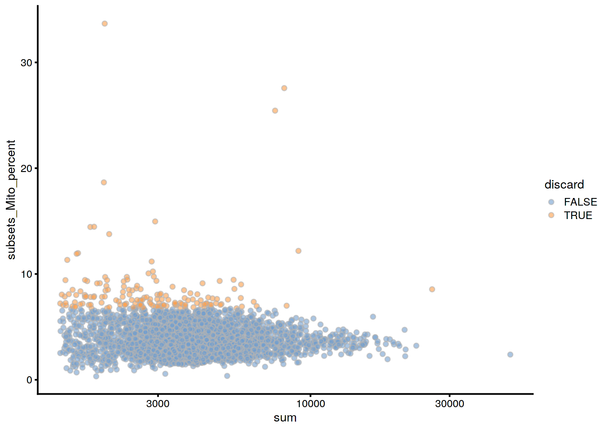
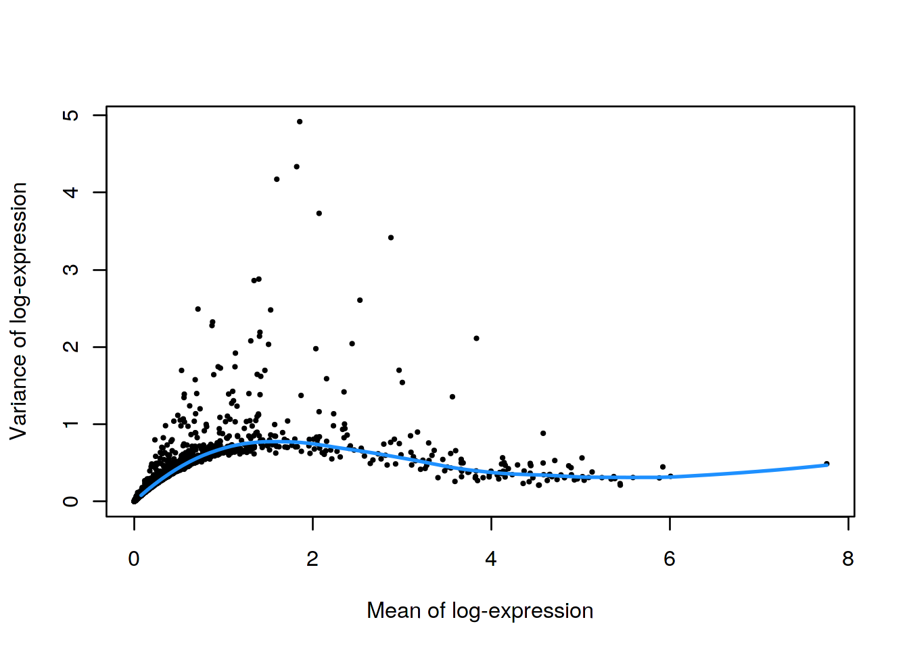
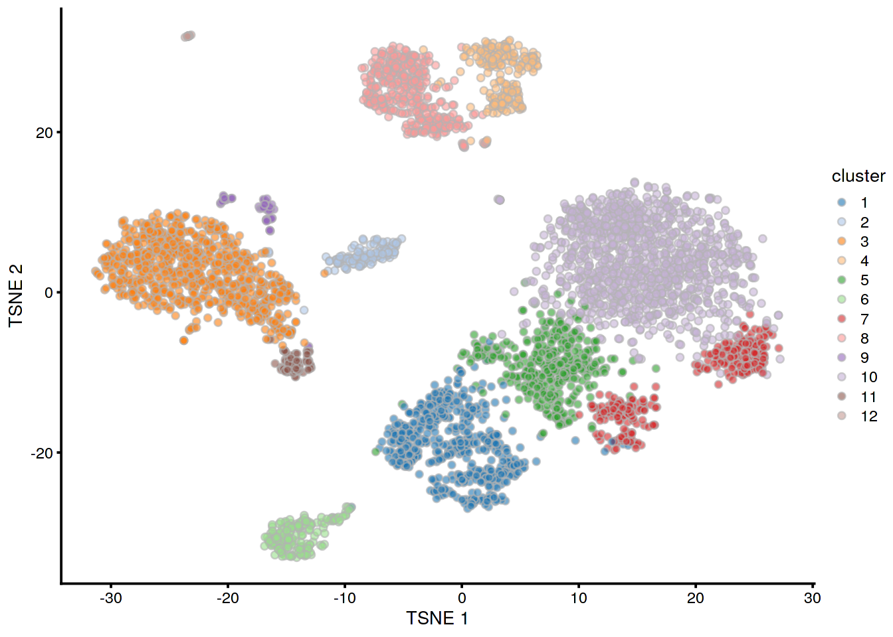

<!-- AUTOMATICALLY GENERATED, DO NOT EDIT! -->

# PBMC 4k 10X dataset (filtered)

<script>
document.addEventListener("click", function (event) {
    if (event.target.classList.contains("aaron-collapse")) {
        event.target.classList.toggle("active");
        var content = event.target.nextElementSibling;
        if (content.style.display === "block") {
          content.style.display = "none";
        } else {
          content.style.display = "block";
        }
    }
})
</script>

<style>
.aaron-collapse {
  background-color: #eee;
  color: #444;
  cursor: pointer;
  padding: 18px;
  width: 100%;
  border: none;
  text-align: left;
  outline: none;
  font-size: 15px;
}

.aaron-content {
  padding: 0 18px;
  display: none;
  overflow: hidden;
  background-color: #f1f1f1;
}
</style>

## Introduction

This performs an analysis of the public PBMC 4k dataset generated by 10X Genomics [@zheng2017massively],
starting from the filtered count matrix.

## Analysis code

### Data loading


```r
library(TENxPBMCData)
pbmc4k <- TENxPBMCData('pbmc4k')
```

### Quality control


```r
unfiltered <- pbmc4k
```


```r
is.mito <- grep("MT", rowData(pbmc4k)$Symbol_TENx)

library(scater)
stats <- perCellQCMetrics(pbmc4k, subsets=list(Mito=is.mito))
high.mito <- isOutlier(stats$subsets_Mito_percent, nmads=3, type="higher")
pbmc4k <- pbmc4k[,!high.mito]
```

### Normalization


```r
pbmc4k <- logNormCounts(pbmc4k)
```

### Variance modelling


```r
library(scran)
dec4k <- modelGeneVar(pbmc4k)
```


```r
chosen.hvgs <- which(dec4k$bio > 0)
```

### Dimensionality reduction


```r
# Using randomized SVD, which is more efficient for file-backed matrices.
set.seed(10000)
pbmc4k <- runPCA(pbmc4k, subset_row=chosen.hvgs, ncomponents=25,
    BSPARAM=BiocSingular::RandomParam())

set.seed(100000)
pbmc4k <- runTSNE(pbmc4k, dimred="PCA")

set.seed(1000000)
pbmc4k <- runUMAP(pbmc4k, dimred="PCA")
```

### Clustering


```r
g <- buildSNNGraph(pbmc4k, k=10, use.dimred = 'PCA')
clust <- igraph::cluster_walktrap(g)$membership
pbmc4k$cluster <- factor(clust)
```

## Results

### Quality control statistics


```r
colData(unfiltered) <- cbind(colData(unfiltered), stats)
unfiltered$discard <- high.mito

gridExtra::grid.arrange(
    plotColData(unfiltered, y="sum", colour_by="discard") +
        scale_y_log10() + ggtitle("Total count"),
    plotColData(unfiltered, y="detected", colour_by="discard") +
        scale_y_log10() + ggtitle("Detected features"),
    plotColData(unfiltered, y="subsets_Mito_percent",
        colour_by="discard") + ggtitle("Mito percent"),
    ncol=2
)
```




```r
plotColData(unfiltered, x="sum", y="subsets_Mito_percent",
    colour_by="discard") + scale_x_log10()
```




```r
summary(high.mito)
```

```
##    Mode   FALSE    TRUE 
## logical    4182     158
```

### Normalization


```r
summary(sizeFactors(pbmc4k))
```

```
##    Min. 1st Qu.  Median    Mean 3rd Qu.    Max. 
##   0.315   0.711   0.890   1.000   1.127  11.027
```

### Variance modelling


```r
plot(dec4k$mean, dec4k$total, pch=16, cex=0.5,
    xlab="Mean of log-expression", ylab="Variance of log-expression")
curfit <- metadata(dec4k)
curve(curfit$trend(x), col='dodgerblue', add=TRUE, lwd=2)
```



### Clustering


```r
table(pbmc4k$cluster)
```

```
## 
##    1    2    3    4    5    6    7    8    9   10   11 
##  133  573  604  388  772  187   54 1149   90  196   36
```


```r
plotTSNE(pbmc4k, colour_by="cluster")
```




## Session Info {-}

<button class="aaron-collapse">View session info</button>
<div class="aaron-content">
```
R version 3.6.1 (2019-07-05)
Platform: x86_64-pc-linux-gnu (64-bit)
Running under: Ubuntu 14.04.5 LTS

Matrix products: default
BLAS:   /home/ramezqui/Rbuild/danbuild/R-3.6.1/lib/libRblas.so
LAPACK: /home/ramezqui/Rbuild/danbuild/R-3.6.1/lib/libRlapack.so

locale:
 [1] LC_CTYPE=en_US.UTF-8       LC_NUMERIC=C              
 [3] LC_TIME=en_US.UTF-8        LC_COLLATE=en_US.UTF-8    
 [5] LC_MONETARY=en_US.UTF-8    LC_MESSAGES=en_US.UTF-8   
 [7] LC_PAPER=en_US.UTF-8       LC_NAME=C                 
 [9] LC_ADDRESS=C               LC_TELEPHONE=C            
[11] LC_MEASUREMENT=en_US.UTF-8 LC_IDENTIFICATION=C       

attached base packages:
[1] parallel  stats4    stats     graphics  grDevices utils     datasets 
[8] methods   base     

other attached packages:
 [1] scran_1.13.25               scater_1.13.24             
 [3] ggplot2_3.2.1               TENxPBMCData_1.3.0         
 [5] HDF5Array_1.13.9            rhdf5_2.29.3               
 [7] SingleCellExperiment_1.7.11 SummarizedExperiment_1.15.9
 [9] DelayedArray_0.11.6         BiocParallel_1.19.3        
[11] matrixStats_0.55.0          Biobase_2.45.1             
[13] GenomicRanges_1.37.16       GenomeInfoDb_1.21.2        
[15] IRanges_2.19.16             S4Vectors_0.23.24          
[17] BiocGenerics_0.31.6         Cairo_1.5-10               
[19] BiocStyle_2.13.2            OSCAUtils_0.0.1            

loaded via a namespace (and not attached):
 [1] bitops_1.0-6                  bit64_0.9-7                  
 [3] RcppAnnoy_0.0.13              httr_1.4.1                   
 [5] tools_3.6.1                   backports_1.1.5              
 [7] R6_2.4.0                      irlba_2.3.3                  
 [9] vipor_0.4.5                   uwot_0.1.4                   
[11] DBI_1.0.0                     lazyeval_0.2.2               
[13] colorspace_1.4-1              withr_2.1.2                  
[15] gridExtra_2.3                 tidyselect_0.2.5             
[17] bit_1.1-14                    curl_4.2                     
[19] compiler_3.6.1                BiocNeighbors_1.3.5          
[21] labeling_0.3                  bookdown_0.14                
[23] scales_1.0.0                  rappdirs_0.3.1               
[25] stringr_1.4.0                 digest_0.6.21                
[27] rmarkdown_1.16                XVector_0.25.0               
[29] pkgconfig_2.0.3               htmltools_0.3.6              
[31] limma_3.41.17                 dbplyr_1.4.2                 
[33] rlang_0.4.0                   RSQLite_2.1.2                
[35] shiny_1.3.2                   DelayedMatrixStats_1.7.2     
[37] dplyr_0.8.3                   RCurl_1.95-4.12              
[39] magrittr_1.5                  BiocSingular_1.1.7           
[41] GenomeInfoDbData_1.2.1        Matrix_1.2-17                
[43] Rcpp_1.0.2                    ggbeeswarm_0.6.0             
[45] munsell_0.5.0                 Rhdf5lib_1.7.5               
[47] viridis_0.5.1                 edgeR_3.27.13                
[49] stringi_1.4.3                 yaml_2.2.0                   
[51] zlibbioc_1.31.0               Rtsne_0.15                   
[53] BiocFileCache_1.9.1           AnnotationHub_2.17.10        
[55] grid_3.6.1                    blob_1.2.0                   
[57] dqrng_0.2.1                   promises_1.0.1               
[59] ExperimentHub_1.11.6          crayon_1.3.4                 
[61] lattice_0.20-38               cowplot_1.0.0                
[63] beachmat_2.1.2                locfit_1.5-9.1               
[65] zeallot_0.1.0                 knitr_1.25                   
[67] pillar_1.4.2                  igraph_1.2.4.1               
[69] codetools_0.2-16              glue_1.3.1                   
[71] evaluate_0.14                 RcppParallel_4.4.3           
[73] BiocManager_1.30.4            vctrs_0.2.0                  
[75] httpuv_1.5.2                  gtable_0.3.0                 
[77] purrr_0.3.2                   assertthat_0.2.1             
[79] xfun_0.10                     rsvd_1.0.2                   
[81] mime_0.7                      xtable_1.8-4                 
[83] RSpectra_0.15-0               later_0.8.0                  
[85] viridisLite_0.3.0             tibble_2.1.3                 
[87] AnnotationDbi_1.47.1          beeswarm_0.2.3               
[89] memoise_1.1.0                 statmod_1.4.32               
[91] interactiveDisplayBase_1.23.0
```
</div>
