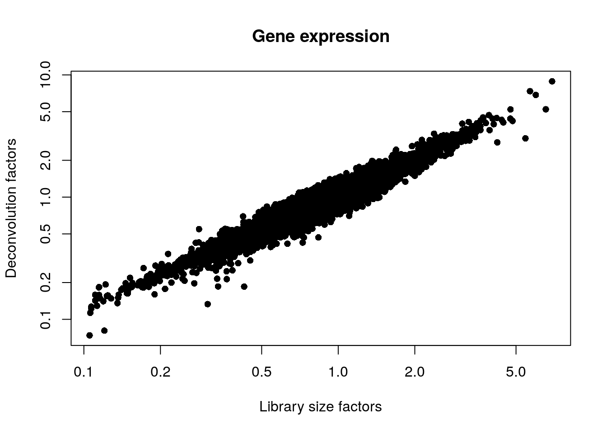
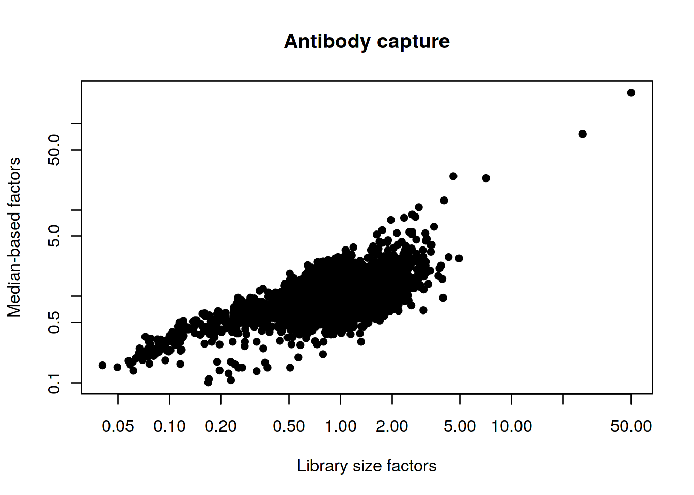

# Human PBMC 10X dataset (surface proteins)

<script>
document.addEventListener("click", function (event) {
    if (event.target.classList.contains("aaron-collapse")) {
        event.target.classList.toggle("active");
        var content = event.target.nextElementSibling;
        if (content.style.display === "block") {
          content.style.display = "none";
        } else {
          content.style.display = "block";
        }
    }
})
</script>

<style>
.aaron-collapse {
  background-color: #eee;
  color: #444;
  cursor: pointer;
  padding: 18px;
  width: 100%;
  border: none;
  text-align: left;
  outline: none;
  font-size: 15px;
}

.aaron-content {
  padding: 0 18px;
  display: none;
  overflow: hidden;
  background-color: #f1f1f1;
}
</style>

## Introduction

Here, we describe a brief analysis of _yet another_ peripheral blood mononuclear cell (PBMC) dataset from 10X Genomics [@zheng2017massively].
Data are publicly available from the [10X Genomics website](https://support.10xgenomics.com/single-cell-vdj/datasets/3.0.0/vdj_v1_mm_c57bl6_pbmc_5gex), from which we download the filtered gene/barcode count matrices for gene expression and cell surface proteins.
Note that most of the repertoire-related steps will be discussed in Chapter \@ref(repertoire-seq), this workflow mostly provides the baseline analysis for the expression data.

## Analysis code

### Data loading


```r
library(BiocFileCache)
bfc <- BiocFileCache(ask=FALSE)
exprs.data <- bfcrpath(bfc, file.path(
    "http://cf.10xgenomics.com/samples/cell-vdj/3.1.0",
    "vdj_v1_hs_pbmc3",
    "vdj_v1_hs_pbmc3_filtered_feature_bc_matrix.tar.gz"))
untar(exprs.data, exdir=tempdir())

library(DropletUtils)
sce.pbmc <- read10xCounts(file.path(tempdir(), "filtered_feature_bc_matrix"))
sce.pbmc <- splitAltExps(sce.pbmc, rowData(sce.pbmc)$Type)
```

### Quality control


```r
unfiltered <- sce.pbmc
```

We discard cells with high mitochondrial proportions and few detectable ADT counts.


```r
library(scater)
is.mito <- grep("^MT-", rowData(sce.pbmc)$Symbol)
stats <- perCellQCMetrics(sce.pbmc, subsets=list(Mito=is.mito))

high.mito <- isOutlier(stats$subsets_Mito_percent, type="higher")
low.adt <- stats$`altexps_Antibody Capture_detected` < nrow(altExp(sce.pbmc))/2

discard <- high.mito | low.adt
sce.pbmc <- sce.pbmc[,!discard]
```

### Normalization

Computing size factors for the gene expression and ADT counts.


```r
library(scran)

set.seed(1000)
clusters <- quickCluster(sce.pbmc)
sce.pbmc <- computeSumFactors(sce.pbmc, cluster=clusters)

# TODO: move into scran somewhere.
library(DelayedMatrixStats)
ambient <- rowMeans(counts(altExp(sce.pbmc)))
sf.amb <- colMedians(DelayedArray(counts(altExp(sce.pbmc)))/ambient)
sf.amb <- sf.amb/mean(sf.amb)
sizeFactors(altExp(sce.pbmc)) <- sf.amb

sce.pbmc <- logNormCounts(sce.pbmc, use_altexps=TRUE)
```

### Dimensionality reduction


```r
set.seed(100000)
altExp(sce.pbmc) <- runTSNE(altExp(sce.pbmc))

set.seed(1000000)
altExp(sce.pbmc) <- runUMAP(altExp(sce.pbmc))
```

### Clustering


```r
g.adt <- buildSNNGraph(altExp(sce.pbmc), k=10, d=NA)
clust.adt <- igraph::cluster_walktrap(g.adt)$membership
altExp(sce.pbmc)$cluster <- factor(clust.adt)

set.seed(1010010)
subclusters <- quickSubCluster(sce.pbmc, clust.adt,
    prepFUN=function(x) {
        dec <- modelGeneVarByPoisson(x)
        top <- getTopHVGs(dec, prop=0.1)
        denoisePCA(x, dec, subset.row=top)
    }, 
    clusterFUN=function(x) {
        g.gene <- buildSNNGraph(x, k=10, use.dimred = 'PCA')
        igraph::cluster_walktrap(g.gene)$membership
    }
)
```

## Results

### Quality control statistics


```r
colData(unfiltered) <- cbind(colData(unfiltered), stats)
unfiltered$discard <- discard

gridExtra::grid.arrange(
    plotColData(unfiltered, y="sum", colour_by="discard") +
        scale_y_log10() + ggtitle("Total count"),
    plotColData(unfiltered, y="detected", colour_by="discard") +
        scale_y_log10() + ggtitle("Detected features"),
    plotColData(unfiltered, y="subsets_Mito_percent",
        colour_by="discard") + ggtitle("Mito percent"),
    plotColData(unfiltered, y="altexps_Antibody Capture_detected",
        colour_by="discard") + ggtitle("ADT detected"),
    ncol=2
)
```


```r
plotColData(unfiltered, x="sum", y="subsets_Mito_percent",
    colour_by="discard") + scale_x_log10()
```


```r
summary(high.mito)
```

```
##    Mode   FALSE    TRUE 
## logical    6660     571
```

```r
summary(low.adt)
```

```
##    Mode   FALSE 
## logical    7231
```

### Normalization


```r
summary(sizeFactors(sce.pbmc))
```

```
##    Min. 1st Qu.  Median    Mean 3rd Qu.    Max. 
##   0.074   0.719   0.908   1.000   1.133   8.858
```

```r
summary(sizeFactors(altExp(sce.pbmc)))
```

```
##    Min. 1st Qu.  Median    Mean 3rd Qu.    Max. 
##    0.10    0.70    0.83    1.00    1.03  227.36
```


```r
plot(librarySizeFactors(sce.pbmc), sizeFactors(sce.pbmc), pch=16,
    xlab="Library size factors", ylab="Deconvolution factors", 
    main="Gene expression", log="xy")
```



```r
plot(librarySizeFactors(altExp(sce.pbmc)), sizeFactors(altExp(sce.pbmc)), pch=16,
    xlab="Library size factors", ylab="Median-based factors", 
    main="Antibody capture", log="xy")
```



### Clustering


```r
table(altExp(sce.pbmc)$cluster)
```

```
## 
##    1    2    3    4    5    6    7    8    9   10   11   12   13   14   15   16   17   18   19   20 
##  160  507  662   39  691 1415   32  650   76 1037  121   47   68   25   15  562  139   32   44  120 
##   21   22   23   24 
##   84   65   52   17
```


```r
plotTSNE(altExp(sce.pbmc), colour_by="cluster", text_by="cluster", text_col="red")
```


Counting the number of gene expression-derived subclusters in each ADT-derived parent cluster:


```r
data.frame(
    Cluster=names(subclusters),
    Ncells=vapply(subclusters, ncol, 0L),
    Nsub=vapply(subclusters, function(x) length(unique(x$subcluster)), 0L)
)
```

```
##    Cluster Ncells Nsub
## 1        1    160    3
## 2        2    507    4
## 3        3    662    5
## 4        4     39    1
## 5        5    691    5
## 6        6   1415    7
## 7        7     32    1
## 8        8    650    7
## 9        9     76    2
## 10      10   1037    8
## 11      11    121    2
## 12      12     47    1
## 13      13     68    2
## 14      14     25    1
## 15      15     15    1
## 16      16    562    9
## 17      17    139    3
## 18      18     32    1
## 19      19     44    1
## 20      20    120    4
## 21      21     84    3
## 22      22     65    2
## 23      23     52    3
## 24      24     17    1
```

## Session Info {-}

<button class="aaron-collapse">View session info</button>
<div class="aaron-content">
```
R Under development (unstable) (2019-12-29 r77627)
Platform: x86_64-pc-linux-gnu (64-bit)
Running under: Ubuntu 14.04.6 LTS

Matrix products: default
BLAS/LAPACK: /app/easybuild/software/OpenBLAS/0.2.18-GCC-5.4.0-2.26-LAPACK-3.6.1/lib/libopenblas_prescottp-r0.2.18.so

locale:
 [1] LC_CTYPE=en_US.UTF-8       LC_NUMERIC=C               LC_TIME=en_US.UTF-8       
 [4] LC_COLLATE=C               LC_MONETARY=en_US.UTF-8    LC_MESSAGES=en_US.UTF-8   
 [7] LC_PAPER=en_US.UTF-8       LC_NAME=C                  LC_ADDRESS=C              
[10] LC_TELEPHONE=C             LC_MEASUREMENT=en_US.UTF-8 LC_IDENTIFICATION=C       

attached base packages:
[1] stats4    parallel  stats     graphics  grDevices utils     datasets  methods   base     

other attached packages:
 [1] DelayedMatrixStats_1.9.0    scran_1.15.14               scater_1.15.12             
 [4] ggplot2_3.2.1               DropletUtils_1.7.1          SingleCellExperiment_1.9.1 
 [7] SummarizedExperiment_1.17.1 DelayedArray_0.13.2         BiocParallel_1.21.2        
[10] matrixStats_0.55.0          Biobase_2.47.2              GenomicRanges_1.39.1       
[13] GenomeInfoDb_1.23.1         IRanges_2.21.2              S4Vectors_0.25.8           
[16] BiocGenerics_0.33.0         BiocFileCache_1.11.4        dbplyr_1.4.2               
[19] Cairo_1.5-10                BiocStyle_2.15.3            OSCAUtils_0.0.1            

loaded via a namespace (and not attached):
 [1] bitops_1.0-6           bit64_0.9-7            RcppAnnoy_0.0.14       httr_1.4.1            
 [5] tools_4.0.0            backports_1.1.5        R6_2.4.1               irlba_2.3.3           
 [9] HDF5Array_1.15.2       vipor_0.4.5            uwot_0.1.5             DBI_1.1.0             
[13] lazyeval_0.2.2         colorspace_1.4-1       withr_2.1.2            tidyselect_0.2.5      
[17] gridExtra_2.3          processx_3.4.1         bit_1.1-14             curl_4.3              
[21] compiler_4.0.0         BiocNeighbors_1.5.1    labeling_0.3           bookdown_0.16         
[25] scales_1.1.0           callr_3.4.0            rappdirs_0.3.1         stringr_1.4.0         
[29] digest_0.6.23          rmarkdown_2.0          R.utils_2.9.2          XVector_0.27.0        
[33] pkgconfig_2.0.3        htmltools_0.4.0        limma_3.43.0           rlang_0.4.2           
[37] RSQLite_2.2.0          farver_2.0.1           dplyr_0.8.3            R.oo_1.23.0           
[41] RCurl_1.95-4.12        magrittr_1.5           BiocSingular_1.3.1     GenomeInfoDbData_1.2.2
[45] Matrix_1.2-18          Rcpp_1.0.3             ggbeeswarm_0.6.0       munsell_0.5.0         
[49] Rhdf5lib_1.9.0         viridis_0.5.1          lifecycle_0.1.0        R.methodsS3_1.7.1     
[53] stringi_1.4.3          yaml_2.2.0             edgeR_3.29.0           zlibbioc_1.33.0       
[57] Rtsne_0.15             rhdf5_2.31.1           grid_4.0.0             blob_1.2.0            
[61] dqrng_0.2.1            crayon_1.3.4           lattice_0.20-38        cowplot_1.0.0         
[65] locfit_1.5-9.1         zeallot_0.1.0          knitr_1.26             ps_1.3.0              
[69] pillar_1.4.3           igraph_1.2.4.2         codetools_0.2-16       glue_1.3.1            
[73] evaluate_0.14          RcppParallel_4.4.4     BiocManager_1.30.10    vctrs_0.2.1           
[77] gtable_0.3.0           purrr_0.3.3            assertthat_0.2.1       xfun_0.11             
[81] rsvd_1.0.2             RSpectra_0.16-0        viridisLite_0.3.0      tibble_2.1.3          
[85] beeswarm_0.2.3         memoise_1.1.0          statmod_1.4.32        
```
</div>
