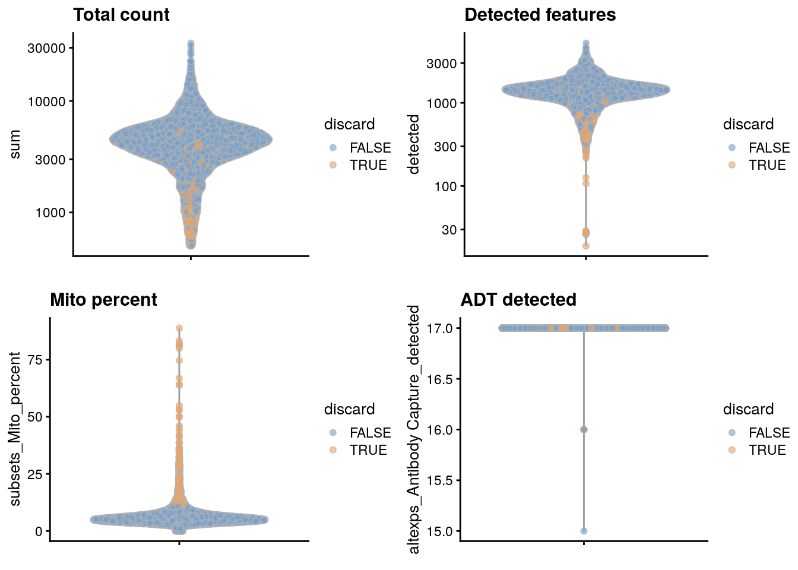
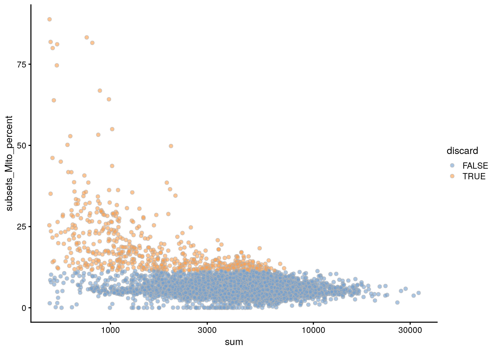
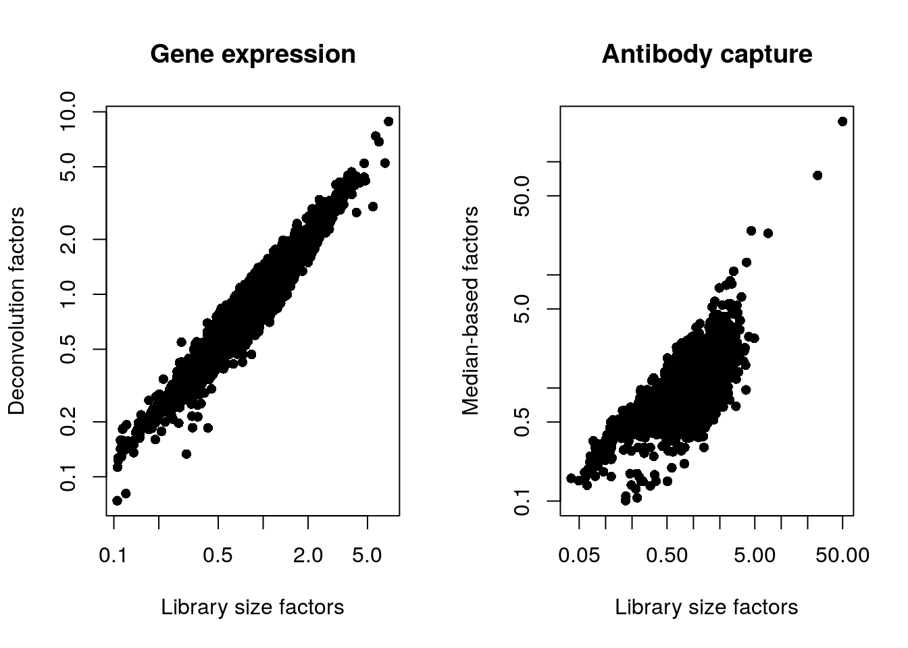
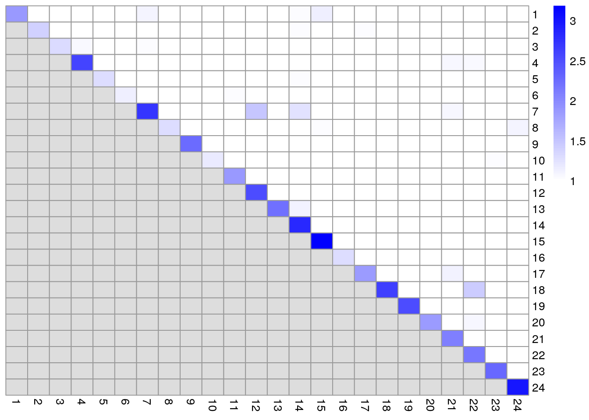
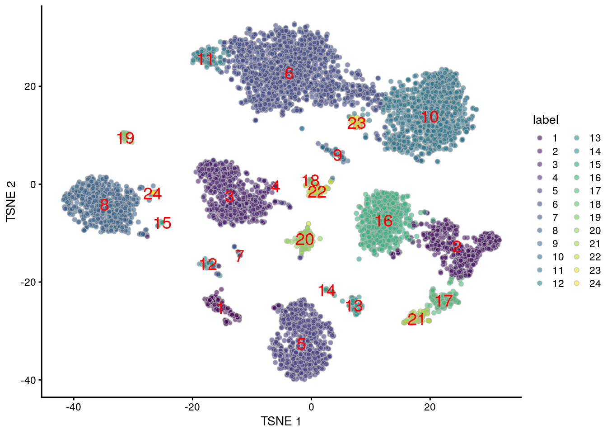

# Human PBMC 10X dataset (surface proteins)

<script>
document.addEventListener("click", function (event) {
    if (event.target.classList.contains("aaron-collapse")) {
        event.target.classList.toggle("active");
        var content = event.target.nextElementSibling;
        if (content.style.display === "block") {
          content.style.display = "none";
        } else {
          content.style.display = "block";
        }
    }
})
</script>

<style>
.aaron-collapse {
  background-color: #eee;
  color: #444;
  cursor: pointer;
  padding: 18px;
  width: 100%;
  border: none;
  text-align: left;
  outline: none;
  font-size: 15px;
}

.aaron-content {
  padding: 0 18px;
  display: none;
  overflow: hidden;
  background-color: #f1f1f1;
}
</style>

## Introduction

Here, we describe a brief analysis of _yet another_ peripheral blood mononuclear cell (PBMC) dataset from 10X Genomics [@zheng2017massively].
Data are publicly available from the [10X Genomics website](https://support.10xgenomics.com/single-cell-vdj/datasets/3.0.0/vdj_v1_mm_c57bl6_pbmc_5gex), from which we download the filtered gene/barcode count matrices for gene expression and cell surface proteins.
Note that most of the repertoire-related steps will be discussed in Chapter \@ref(repertoire-seq), this workflow mostly provides the baseline analysis for the expression data.

## Analysis code

### Data loading


```r
library(BiocFileCache)
bfc <- BiocFileCache(ask=FALSE)
exprs.data <- bfcrpath(bfc, file.path(
    "http://cf.10xgenomics.com/samples/cell-vdj/3.1.0",
    "vdj_v1_hs_pbmc3",
    "vdj_v1_hs_pbmc3_filtered_feature_bc_matrix.tar.gz"))
untar(exprs.data, exdir=tempdir())

library(DropletUtils)
sce.pbmc <- read10xCounts(file.path(tempdir(), "filtered_feature_bc_matrix"))
sce.pbmc <- splitAltExps(sce.pbmc, rowData(sce.pbmc)$Type)
```

### Quality control


```r
unfiltered <- sce.pbmc
```

We discard cells with high mitochondrial proportions and few detectable ADT counts.


```r
library(scater)
is.mito <- grep("^MT-", rowData(sce.pbmc)$Symbol)
stats <- perCellQCMetrics(sce.pbmc, subsets=list(Mito=is.mito))

high.mito <- isOutlier(stats$subsets_Mito_percent, type="higher")
low.adt <- stats$`altexps_Antibody Capture_detected` < nrow(altExp(sce.pbmc))/2

discard <- high.mito | low.adt
sce.pbmc <- sce.pbmc[,!discard]
```

We examine some of the statistics:


```r
summary(high.mito)
```

```
##    Mode   FALSE    TRUE 
## logical    6660     571
```

```r
summary(low.adt)
```

```
##    Mode   FALSE 
## logical    7231
```

```r
summary(discard)
```

```
##    Mode   FALSE    TRUE 
## logical    6660     571
```

We examine the distribution of each QC metric (Figure \@ref(fig:unref-pbmc-adt-qc)).


```r
colData(unfiltered) <- cbind(colData(unfiltered), stats)
unfiltered$discard <- discard

gridExtra::grid.arrange(
    plotColData(unfiltered, y="sum", colour_by="discard") +
        scale_y_log10() + ggtitle("Total count"),
    plotColData(unfiltered, y="detected", colour_by="discard") +
        scale_y_log10() + ggtitle("Detected features"),
    plotColData(unfiltered, y="subsets_Mito_percent",
        colour_by="discard") + ggtitle("Mito percent"),
    plotColData(unfiltered, y="altexps_Antibody Capture_detected",
        colour_by="discard") + ggtitle("ADT detected"),
    ncol=2
)
```

<div class="figure">

<p class="caption">(\#fig:unref-pbmc-adt-qc)Distribution of each QC metric in the PBMC dataset, where each point is a cell and is colored by whether or not it was discarded by the outlier-based QC approach.</p>
</div>

We also plot the mitochondrial proportion against the total count for each cell, as one does (Figure \@ref(fig:unref-pbmc-adt-qc-mito)).


```r
plotColData(unfiltered, x="sum", y="subsets_Mito_percent",
    colour_by="discard") + scale_x_log10()
```

<div class="figure">

<p class="caption">(\#fig:unref-pbmc-adt-qc-mito)Percentage of UMIs mapped to mitochondrial genes against the totalcount for each cell.</p>
</div>

### Normalization

Computing size factors for the gene expression and ADT counts.


```r
library(scran)

set.seed(1000)
clusters <- quickCluster(sce.pbmc)
sce.pbmc <- computeSumFactors(sce.pbmc, cluster=clusters)
altExp(sce.pbmc) <- computeMedianFactors(altExp(sce.pbmc))
sce.pbmc <- logNormCounts(sce.pbmc, use_altexps=TRUE)
```

We generate some summary statistics for both sets of size factors:


```r
summary(sizeFactors(sce.pbmc))
```

```
##    Min. 1st Qu.  Median    Mean 3rd Qu.    Max. 
##   0.074   0.719   0.908   1.000   1.133   8.858
```

```r
summary(sizeFactors(altExp(sce.pbmc)))
```

```
##    Min. 1st Qu.  Median    Mean 3rd Qu.    Max. 
##    0.10    0.70    0.83    1.00    1.03  227.36
```

We also look at the distribution of size factors compared to the library size for each set of features (Figure \@ref(fig:unref-norm-pbmc-adt)).


```r
par(mfrow=c(1,2))
plot(librarySizeFactors(sce.pbmc), sizeFactors(sce.pbmc), pch=16,
    xlab="Library size factors", ylab="Deconvolution factors", 
    main="Gene expression", log="xy")
plot(librarySizeFactors(altExp(sce.pbmc)), sizeFactors(altExp(sce.pbmc)), pch=16,
    xlab="Library size factors", ylab="Median-based factors", 
    main="Antibody capture", log="xy")
```

<div class="figure">

<p class="caption">(\#fig:unref-norm-pbmc-adt)Plot of the deconvolution size factors for the gene expression values (left) or the median-based size factors for the ADT expression values (right) compared to the library size-derived factors for the corresponding set of features. Each point represents a cell.</p>
</div>

### Dimensionality reduction

We omit the PCA step for the ADT expression matrix, given that it is already so low-dimensional,
and progress directly to $t$-SNE and UMAP visualizations.


```r
set.seed(100000)
altExp(sce.pbmc) <- runTSNE(altExp(sce.pbmc))

set.seed(1000000)
altExp(sce.pbmc) <- runUMAP(altExp(sce.pbmc))
```

### Clustering

We perform graph-based clustering on the ADT data and use the assignments as the column labels of the alternative Experiment.


```r
g.adt <- buildSNNGraph(altExp(sce.pbmc), k=10, d=NA)
clust.adt <- igraph::cluster_walktrap(g.adt)$membership
colLabels(altExp(sce.pbmc)) <- factor(clust.adt)
```

We examine some basic statistics about the size of each cluster, 
their separation (Figure \@ref(fig:unref-clustmod-pbmc-adt))
and their distribution in our $t$-SNE plot (Figure \@ref(fig:unref-tsne-pbmc-adt)).


```r
table(colLabels(altExp(sce.pbmc)))
```

```
## 
##    1    2    3    4    5    6    7    8    9   10   11   12   13   14   15   16 
##  160  507  662   39  691 1415   32  650   76 1037  121   47   68   25   15  562 
##   17   18   19   20   21   22   23   24 
##  139   32   44  120   84   65   52   17
```


```r
mod <- clusterModularity(g.adt, clust.adt, as.ratio=TRUE)
library(pheatmap)
pheatmap::pheatmap(log10(mod + 10), cluster_row=FALSE, cluster_col=FALSE,
    color=colorRampPalette(c("white", "blue"))(101))
```

<div class="figure">

<p class="caption">(\#fig:unref-clustmod-pbmc-adt)Heatmap of the pairwise cluster modularity scores in the PBMC dataset, computed based on the shared nearest neighbor graph derived from the ADT expression values.</p>
</div>


```r
plotTSNE(altExp(sce.pbmc), colour_by="label", text_by="label", text_col="red")
```

<div class="figure">

<p class="caption">(\#fig:unref-tsne-pbmc-adt)Obligatory $t$-SNE plot of PBMC dataset based on its ADT expression values, where each point is a cell and is colored by the cluster of origin. Cluster labels are also overlaid at the median coordinates across all cells in the cluster.</p>
</div>

We perform some additional subclustering using the expression data to mimic an _in silico_ FACS experiment.


```r
set.seed(1010010)
subclusters <- quickSubCluster(sce.pbmc, clust.adt,
    prepFUN=function(x) {
        dec <- modelGeneVarByPoisson(x)
        top <- getTopHVGs(dec, prop=0.1)
        denoisePCA(x, dec, subset.row=top)
    }, 
    clusterFUN=function(x) {
        g.gene <- buildSNNGraph(x, k=10, use.dimred = 'PCA')
        igraph::cluster_walktrap(g.gene)$membership
    }
)
```

We counting the number of gene expression-derived subclusters in each ADT-derived parent cluster.


```r
data.frame(
    Cluster=names(subclusters),
    Ncells=vapply(subclusters, ncol, 0L),
    Nsub=vapply(subclusters, function(x) length(unique(x$subcluster)), 0L)
)
```

```
##    Cluster Ncells Nsub
## 1        1    160    3
## 2        2    507    4
## 3        3    662    5
## 4        4     39    1
## 5        5    691    5
## 6        6   1415    7
## 7        7     32    1
## 8        8    650    7
## 9        9     76    2
## 10      10   1037    8
## 11      11    121    2
## 12      12     47    1
## 13      13     68    2
## 14      14     25    1
## 15      15     15    1
## 16      16    562    9
## 17      17    139    3
## 18      18     32    1
## 19      19     44    1
## 20      20    120    4
## 21      21     84    3
## 22      22     65    2
## 23      23     52    3
## 24      24     17    1
```

## Session Info {-}

<button class="aaron-collapse">View session info</button>
<div class="aaron-content">
```
R Under development (unstable) (2020-03-23 r78035)
Platform: x86_64-pc-linux-gnu (64-bit)
Running under: Ubuntu 18.04.4 LTS

Matrix products: default
BLAS:   /home/luna/Software/R/trunk/lib/libRblas.so
LAPACK: /home/luna/Software/R/trunk/lib/libRlapack.so

locale:
 [1] LC_CTYPE=en_US.UTF-8       LC_NUMERIC=C              
 [3] LC_TIME=en_US.UTF-8        LC_COLLATE=en_US.UTF-8    
 [5] LC_MONETARY=en_US.UTF-8    LC_MESSAGES=en_US.UTF-8   
 [7] LC_PAPER=en_US.UTF-8       LC_NAME=C                 
 [9] LC_ADDRESS=C               LC_TELEPHONE=C            
[11] LC_MEASUREMENT=en_US.UTF-8 LC_IDENTIFICATION=C       

attached base packages:
[1] parallel  stats4    stats     graphics  grDevices utils     datasets 
[8] methods   base     

other attached packages:
 [1] pheatmap_1.0.12             scran_1.15.24              
 [3] scater_1.15.29              ggplot2_3.3.0              
 [5] DropletUtils_1.7.8          SingleCellExperiment_1.9.3 
 [7] SummarizedExperiment_1.17.5 DelayedArray_0.13.8        
 [9] matrixStats_0.56.0          Biobase_2.47.3             
[11] GenomicRanges_1.39.3        GenomeInfoDb_1.23.16       
[13] IRanges_2.21.8              S4Vectors_0.25.14          
[15] BiocGenerics_0.33.3         BiocFileCache_1.11.4       
[17] dbplyr_1.4.2                BiocStyle_2.15.6           
[19] OSCAUtils_0.0.2            

loaded via a namespace (and not attached):
 [1] bitops_1.0-6             bit64_0.9-7              RColorBrewer_1.1-2      
 [4] RcppAnnoy_0.0.16         httr_1.4.1               tools_4.0.0             
 [7] R6_2.4.1                 irlba_2.3.3              HDF5Array_1.15.13       
[10] vipor_0.4.5              uwot_0.1.8               DBI_1.1.0               
[13] colorspace_1.4-1         withr_2.1.2              gridExtra_2.3           
[16] tidyselect_1.0.0         processx_3.4.2           bit_1.1-15.2            
[19] curl_4.3                 compiler_4.0.0           cli_2.0.2               
[22] BiocNeighbors_1.5.2      labeling_0.3             bookdown_0.18           
[25] scales_1.1.0             callr_3.4.3              rappdirs_0.3.1          
[28] stringr_1.4.0            digest_0.6.25            rmarkdown_2.1           
[31] R.utils_2.9.2            XVector_0.27.2           pkgconfig_2.0.3         
[34] htmltools_0.4.0          highr_0.8                limma_3.43.5            
[37] rlang_0.4.5              RSQLite_2.2.0            DelayedMatrixStats_1.9.1
[40] farver_2.0.3             BiocParallel_1.21.2      dplyr_0.8.5             
[43] R.oo_1.23.0              RCurl_1.98-1.1           magrittr_1.5            
[46] BiocSingular_1.3.2       GenomeInfoDbData_1.2.2   Matrix_1.2-18           
[49] Rcpp_1.0.4               ggbeeswarm_0.6.0         munsell_0.5.0           
[52] Rhdf5lib_1.9.2           fansi_0.4.1              viridis_0.5.1           
[55] lifecycle_0.2.0          R.methodsS3_1.8.0        stringi_1.4.6           
[58] yaml_2.2.1               edgeR_3.29.1             zlibbioc_1.33.1         
[61] Rtsne_0.15               rhdf5_2.31.9             grid_4.0.0              
[64] blob_1.2.1               dqrng_0.2.1              crayon_1.3.4            
[67] lattice_0.20-40          cowplot_1.0.0            locfit_1.5-9.4          
[70] knitr_1.28               ps_1.3.2                 pillar_1.4.3            
[73] igraph_1.2.5             codetools_0.2-16         glue_1.3.2              
[76] evaluate_0.14            BiocManager_1.30.10      vctrs_0.2.4             
[79] gtable_0.3.0             purrr_0.3.3              assertthat_0.2.1        
[82] xfun_0.12                rsvd_1.0.3               RSpectra_0.16-0         
[85] viridisLite_0.3.0        tibble_3.0.0             beeswarm_0.2.3          
[88] memoise_1.1.0            statmod_1.4.34           ellipsis_0.3.0          
```
</div>
