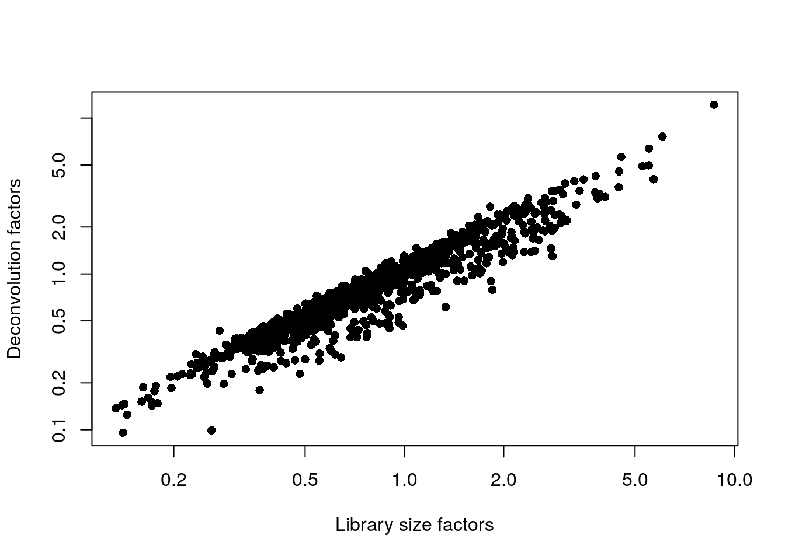

# Grun human pancreas (CEL-seq2) 

<script>
document.addEventListener("click", function (event) {
    if (event.target.classList.contains("aaron-collapse")) {
        event.target.classList.toggle("active");
        var content = event.target.nextElementSibling;
        if (content.style.display === "block") {
          content.style.display = "none";
        } else {
          content.style.display = "block";
        }
    }
})
</script>

<style>
.aaron-collapse {
  background-color: #eee;
  color: #444;
  cursor: pointer;
  padding: 18px;
  width: 100%;
  border: none;
  text-align: left;
  outline: none;
  font-size: 15px;
}

.aaron-content {
  padding: 0 18px;
  display: none;
  overflow: hidden;
  background-color: #f1f1f1;
}
</style>

## Introduction

This workflow performs an analysis of the @grun2016denovo CEL-seq2 dataset consisting of human pancreas cells from various donors.

## Data loading


```r
library(scRNAseq)
sce.grun <- GrunPancreasData()
```

We convert to Ensembl identifiers, and we remove duplicated genes or genes without Ensembl IDs.


```r
library(org.Hs.eg.db)
gene.ids <- mapIds(org.Hs.eg.db, keys=rowData(sce.grun)$symbol,
    keytype="SYMBOL", column="ENSEMBL")

keep <- !is.na(gene.ids) & !duplicated(gene.ids)
sce.grun <- sce.grun[keep,]
rownames(sce.grun) <- gene.ids[keep]
```

## Quality control


```r
unfiltered <- sce.grun
```

This dataset lacks mitochondrial genes so we will do without them for quality control.
We compute the median and MAD while blocking on the donor;
for donors where the assumption of a majority of high-quality cells seems to be violated (Figure \@ref(fig:unref-grun-qc-dist)),
we compute an appropriate threshold using the other donors as specified in the `subset=` argument.


```r
library(scater)
stats <- perCellQCMetrics(sce.grun)

qc <- quickPerCellQC(stats, percent_subsets="altexps_ERCC_percent",
    batch=sce.grun$donor,
    subset=sce.grun$donor %in% c("D17", "D7", "D2"))

sce.grun <- sce.grun[,!qc$discard]
```


```r
colData(unfiltered) <- cbind(colData(unfiltered), stats)
unfiltered$discard <- qc$discard

gridExtra::grid.arrange(
    plotColData(unfiltered, x="donor", y="sum", colour_by="discard") +
        scale_y_log10() + ggtitle("Total count"),
    plotColData(unfiltered, x="donor", y="detected", colour_by="discard") +
        scale_y_log10() + ggtitle("Detected features"),
    plotColData(unfiltered, x="donor", y="altexps_ERCC_percent",
        colour_by="discard") + ggtitle("ERCC percent"),
    ncol=2
)
```

<div class="figure">

<p class="caption">(\#fig:unref-grun-qc-dist)Distribution of each QC metric across cells from each donor of the Grun pancreas dataset. Each point represents a cell and is colored according to whether that cell was discarded.</p>
</div>


```r
colSums(as.matrix(qc), na.rm=TRUE)
```

```
##              low_lib_size            low_n_features high_altexps_ERCC_percent 
##                       450                       511                       606 
##                   discard 
##                       665
```

## Normalization 


```r
library(scran)
set.seed(1000) # for irlba. 
clusters <- quickCluster(sce.grun)
sce.grun <- computeSumFactors(sce.grun, clusters=clusters)
sce.grun <- logNormCounts(sce.grun)
```


```r
summary(sizeFactors(sce.grun))
```

```
##    Min. 1st Qu.  Median    Mean 3rd Qu.    Max. 
##   0.096   0.505   0.795   1.000   1.222  12.165
```


```r
plot(librarySizeFactors(sce.grun), sizeFactors(sce.grun), pch=16,
    xlab="Library size factors", ylab="Deconvolution factors", log="xy")
```

<div class="figure">

<p class="caption">(\#fig:unref-grun-norm)Relationship between the library size factors and the deconvolution size factors in the Grun pancreas dataset.</p>
</div>

## Variance modelling

We block on a combined plate and donor factor.


```r
block <- paste0(sce.grun$sample, "_", sce.grun$donor)
dec.grun <- modelGeneVarWithSpikes(sce.grun, spikes="ERCC", block=block)
top.grun <- getTopHVGs(dec.grun, prop=0.1)
```

We examine the number of cells in each level of the blocking factor.


```r
table(block)
```

```
## block
##                  CD13+ sorted cells_D17       CD24+ CD44+ live sorted cells_D17 
##                                      86                                      87 
##                  CD63+ sorted cells_D10 exocrine fraction, live sorted cells_D2 
##                                      41                                      82 
## exocrine fraction, live sorted cells_D3        live sorted cells, library 1_D10 
##                                       7                                      33 
##        live sorted cells, library 1_D17         live sorted cells, library 1_D3 
##                                      88                                      24 
##         live sorted cells, library 1_D7        live sorted cells, library 2_D10 
##                                      85                                      35 
##        live sorted cells, library 2_D17         live sorted cells, library 2_D3 
##                                      83                                      27 
##         live sorted cells, library 2_D7         live sorted cells, library 3_D3 
##                                      84                                      16 
##         live sorted cells, library 3_D7         live sorted cells, library 4_D3 
##                                      83                                      29 
##         live sorted cells, library 4_D7                TGFBR3+ sorted cells_D17 
##                                      83                                      90
```


```r
par(mfrow=c(6,3))
blocked.stats <- dec.grun$per.block
for (i in colnames(blocked.stats)) {
    current <- blocked.stats[[i]]
    plot(current$mean, current$total, main=i, pch=16, cex=0.5,
        xlab="Mean of log-expression", ylab="Variance of log-expression")
    curfit <- metadata(current)
    points(curfit$mean, curfit$var, col="red", pch=16)
    curve(curfit$trend(x), col='dodgerblue', add=TRUE, lwd=2)
}
```

<div class="figure">

<p class="caption">(\#fig:unref-416b-variance)Per-gene variance as a function of the mean for the log-expression values in the Grun pancreas dataset. Each point represents a gene (black) with the mean-variance trend (blue) fitted to the spike-in transcripts (red) separately for each donor.</p>
</div>

## Data integration


```r
library(batchelor)
set.seed(1001010)
merged.grun <- fastMNN(sce.grun, subset.row=top.grun, batch=sce.grun$donor)
```


```r
metadata(merged.grun)$merge.info$lost.var
```

```
##           D10      D17       D2      D3      D7
## [1,] 0.030843 0.030957 0.000000 0.00000 0.00000
## [2,] 0.007130 0.011276 0.036836 0.00000 0.00000
## [3,] 0.003529 0.005028 0.006846 0.05020 0.00000
## [4,] 0.012070 0.014673 0.013972 0.01268 0.05281
```

## Dimensionality reduction


```r
set.seed(100111)
merged.grun <- runTSNE(merged.grun, dimred="corrected")
```

## Clustering


```r
snn.gr <- buildSNNGraph(merged.grun, use.dimred="corrected")
colLabels(merged.grun) <- factor(igraph::cluster_walktrap(snn.gr)$membership)
```


```r
table(Cluster=colLabels(merged.grun), Donor=merged.grun$batch)
```

```
##        Donor
## Cluster D10 D17  D2  D3  D7
##      1   32  71  33  80  29
##      2    5   7   3   4   4
##      3    3  44   0   0  13
##      4   11 119   0   0  55
##      5   12  73  30   3  78
##      6   14  29   3   2  64
##      7    1   9   0   0   7
##      8    2   5   2   3   4
##      9    5  13   0   0  10
##      10  15  33  11  10  37
##      11   5  18   0   1  33
##      12   4  13   0   0   1
```


```r
gridExtra::grid.arrange(
    plotTSNE(merged.grun, colour_by="label"),
    plotTSNE(merged.grun, colour_by="batch"),
    ncol=2
)
```

<div class="figure">

<p class="caption">(\#fig:unref-grun-tsne)Obligatory $t$-SNE plots of the Grun pancreas dataset. Each point represents a cell that is colored by cluster (left) or batch (right).</p>
</div>

## Session Info {-}

<button class="aaron-collapse">View session info</button>
<div class="aaron-content">
```
R version 4.0.0 Patched (2020-05-01 r78341)
Platform: x86_64-pc-linux-gnu (64-bit)
Running under: Ubuntu 18.04.4 LTS

Matrix products: default
BLAS:   /home/luna/Software/R/R-4-0-branch/lib/libRblas.so
LAPACK: /home/luna/Software/R/R-4-0-branch/lib/libRlapack.so

locale:
 [1] LC_CTYPE=en_US.UTF-8       LC_NUMERIC=C              
 [3] LC_TIME=en_US.UTF-8        LC_COLLATE=en_US.UTF-8    
 [5] LC_MONETARY=en_US.UTF-8    LC_MESSAGES=en_US.UTF-8   
 [7] LC_PAPER=en_US.UTF-8       LC_NAME=C                 
 [9] LC_ADDRESS=C               LC_TELEPHONE=C            
[11] LC_MEASUREMENT=en_US.UTF-8 LC_IDENTIFICATION=C       

attached base packages:
[1] parallel  stats4    stats     graphics  grDevices utils     datasets 
[8] methods   base     

other attached packages:
 [1] batchelor_1.4.0             scran_1.16.0               
 [3] scater_1.16.0               ggplot2_3.3.0              
 [5] org.Hs.eg.db_3.11.1         AnnotationDbi_1.50.0       
 [7] scRNAseq_2.2.0              SingleCellExperiment_1.10.1
 [9] SummarizedExperiment_1.18.1 DelayedArray_0.14.0        
[11] matrixStats_0.56.0          Biobase_2.48.0             
[13] GenomicRanges_1.40.0        GenomeInfoDb_1.24.0        
[15] IRanges_2.22.1              S4Vectors_0.26.0           
[17] BiocGenerics_0.34.0         OSCAUtils_0.0.2            
[19] BiocStyle_2.16.0           

loaded via a namespace (and not attached):
 [1] bitops_1.0-6                  bit64_0.9-7                  
 [3] httr_1.4.1                    tools_4.0.0                  
 [5] R6_2.4.1                      irlba_2.3.3                  
 [7] vipor_0.4.5                   DBI_1.1.0                    
 [9] colorspace_1.4-1              withr_2.2.0                  
[11] tidyselect_1.1.0              gridExtra_2.3                
[13] processx_3.4.2                bit_1.1-15.2                 
[15] curl_4.3                      compiler_4.0.0               
[17] BiocNeighbors_1.6.0           labeling_0.3                 
[19] bookdown_0.19                 scales_1.1.1                 
[21] callr_3.4.3                   rappdirs_0.3.1               
[23] stringr_1.4.0                 digest_0.6.25                
[25] rmarkdown_2.1                 XVector_0.28.0               
[27] pkgconfig_2.0.3               htmltools_0.4.0              
[29] limma_3.44.1                  highr_0.8                    
[31] dbplyr_1.4.3                  fastmap_1.0.1                
[33] rlang_0.4.6                   RSQLite_2.2.0                
[35] shiny_1.4.0.2                 DelayedMatrixStats_1.10.0    
[37] farver_2.0.3                  BiocParallel_1.22.0          
[39] dplyr_0.8.5                   RCurl_1.98-1.2               
[41] magrittr_1.5                  BiocSingular_1.4.0           
[43] GenomeInfoDbData_1.2.3        Matrix_1.2-18                
[45] Rcpp_1.0.4.6                  ggbeeswarm_0.6.0             
[47] munsell_0.5.0                 viridis_0.5.1                
[49] lifecycle_0.2.0               edgeR_3.30.0                 
[51] stringi_1.4.6                 yaml_2.2.1                   
[53] zlibbioc_1.34.0               Rtsne_0.15                   
[55] BiocFileCache_1.12.0          AnnotationHub_2.20.0         
[57] grid_4.0.0                    blob_1.2.1                   
[59] dqrng_0.2.1                   promises_1.1.0               
[61] ExperimentHub_1.14.0          crayon_1.3.4                 
[63] lattice_0.20-41               cowplot_1.0.0                
[65] locfit_1.5-9.4                knitr_1.28                   
[67] ps_1.3.3                      pillar_1.4.4                 
[69] igraph_1.2.5                  codetools_0.2-16             
[71] glue_1.4.1                    BiocVersion_3.11.1           
[73] evaluate_0.14                 BiocManager_1.30.10          
[75] vctrs_0.3.0                   httpuv_1.5.2                 
[77] gtable_0.3.0                  purrr_0.3.4                  
[79] assertthat_0.2.1              xfun_0.13                    
[81] rsvd_1.0.3                    mime_0.9                     
[83] xtable_1.8-4                  later_1.0.0                  
[85] viridisLite_0.3.0             tibble_3.0.1                 
[87] beeswarm_0.2.3                memoise_1.1.0                
[89] statmod_1.4.34                ellipsis_0.3.1               
[91] interactiveDisplayBase_1.26.0
```
</div>
