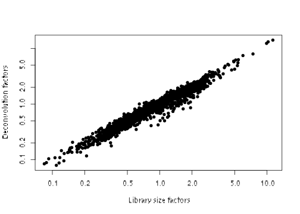
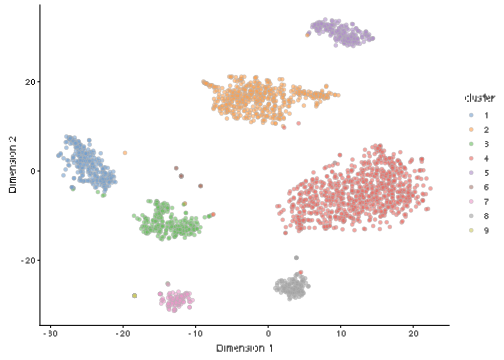
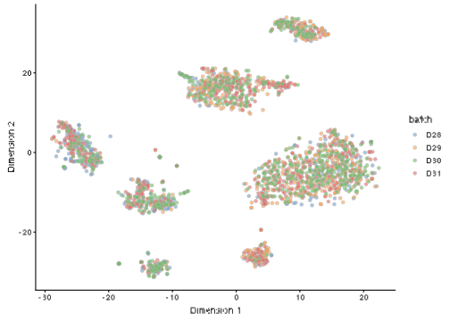

# Human pancreas dataset (Muraro)


## Introduction

This performs an analysis of the @muraro2016singlecell CEL-seq dataset,
consisting of human pancreas cells from various donors.

## Analysis code

### Data loading


```r
library(scRNAseq)
sce.muraro <- MuraroPancreasData()
```

### Gene annotation

Converting back to Ensembl identifiers.


```r
library(AnnotationHub)
edb <- AnnotationHub()[["AH73881"]]
gene.symb <- sub("__chr.*$", "", rownames(sce.muraro))
gene.ids <- mapIds(edb, keys=gene.symb, 
    keytype="SYMBOL", column="GENEID")

# Removing duplicated genes or genes without Ensembl IDs.
keep <- !is.na(gene.ids) & !duplicated(gene.ids)
sce.muraro <- sce.muraro[keep,]
rownames(sce.muraro) <- gene.ids[keep]
```

### Quality control

This dataset lacks mitochondrial genes so we will do without.


```r
unfiltered <- sce.muraro
```


```r
library(scater)
stats <- perCellQCMetrics(sce.muraro)
qc <- quickCellQC(stats, nmads=3, percent_subsets="altexps_ERCC_percent")
sce.muraro <- sce.muraro[,!qc$discard]
```

### Normalization


```r
library(scran)
set.seed(1000)
clusters <- quickCluster(sce.muraro)
sce.muraro <- computeSumFactors(sce.muraro, min.mean=0.1, clusters=clusters)
sce.muraro <- logNormCounts(sce.muraro)
```

### Variance modelling

We block on a combined plate and donor factor.


```r
block <- paste0(sce.muraro$plate, "_", sce.muraro$donor)
dec.muraro <- modelGeneVarWithSpikes(sce.muraro, "ERCC", block=block)
```

### Data integration


```r
library(batchelor)
set.seed(1001010)
merged.muraro <- fastMNN(sce.muraro, batch=sce.muraro$donor)
```

### Dimensionality reduction


```r
set.seed(100111)
merged.muraro <- runTSNE(merged.muraro, dimred="corrected")
```

### Clustering


```r
snn.gr <- buildSNNGraph(merged.muraro, use.dimred="corrected")
merged.muraro$cluster <- factor(igraph::cluster_walktrap(snn.gr)$membership)
```

## Results

### Quality control statistics


```r
colData(unfiltered) <- cbind(colData(unfiltered), stats)
unfiltered$discard <- qc$discard

gridExtra::grid.arrange(
    plotColData(unfiltered, x="donor", y="sum", colour_by="discard") +
        scale_y_log10() + ggtitle("Total count"),
    plotColData(unfiltered, x="donor", y="detected", colour_by="discard") +
        scale_y_log10() + ggtitle("Detected features"),
    plotColData(unfiltered, x="donor", y="altexps_ERCC_percent",
        colour_by="discard") + ggtitle("ERCC percent"),
    ncol=2
)
```


```r
colSums(as.matrix(qc))
```

```
##              low_lib_size            low_n_features 
##                       611                       669 
## high_altexps_ERCC_percent                   discard 
##                       696                       726
```

### Normalization


```r
summary(sizeFactors(sce.muraro))
```

```
##    Min. 1st Qu.  Median    Mean 3rd Qu.    Max. 
##    0.08    0.54    0.82    1.00    1.22   14.13
```


```r
plot(librarySizeFactors(sce.muraro), sizeFactors(sce.muraro), pch=16,
    xlab="Library size factors", ylab="Deconvolution factors", log="xy")
```



### Variance modelling


```r
par(mfrow=c(8,4))
blocked.stats <- dec.muraro$per.block
for (i in colnames(blocked.stats)) {
    current <- blocked.stats[[i]]
    plot(current$mean, current$total, main=i, pch=16, cex=0.5,
        xlab="Mean of log-expression", ylab="Variance of log-expression")
    curfit <- metadata(current)
    points(curfit$mean, curfit$var, col="red", pch=16)
    curve(curfit$trend(x), col='dodgerblue', add=TRUE, lwd=2)
}
```


### Data integration


```r
metadata(merged.muraro)$merge.info$lost.var
```

```
##          D28     D29     D30    D31
## [1,] 0.02794 0.02225 0.00000 0.0000
## [2,] 0.00176 0.00271 0.03799 0.0000
## [3,] 0.00203 0.00236 0.00201 0.0496
```

### Clustering


```r
table(Cluster=merged.muraro$cluster, Donor=merged.muraro$batch)
```

```
##        Donor
## Cluster D28 D29 D30 D31
##       1 103   6  57 113
##       2  30 155 139 163
##       3  61  20  79  95
##       4  88 265 280 220
##       5  13  74  63  43
##       6   7   6   6   5
##       7  22   7  54  26
##       8  11  69   6  39
##       9   5   2   5   9
```


```r
plotTSNE(merged.muraro, colour_by="cluster")
```



```r
plotTSNE(merged.muraro, colour_by="batch")
```



### Clustering

## References {-}
