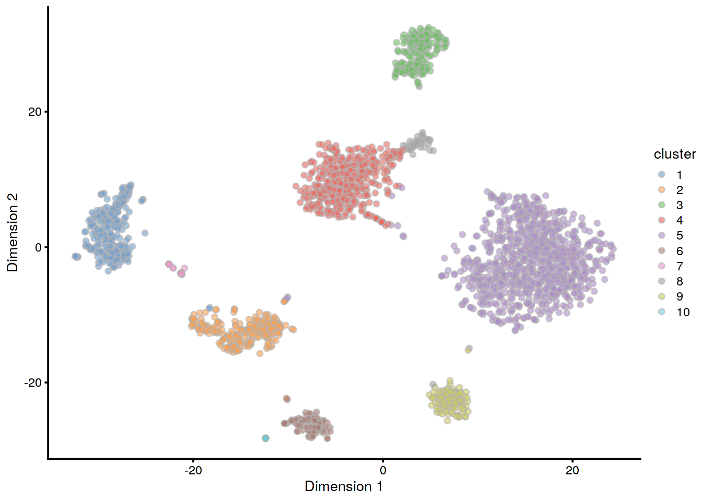
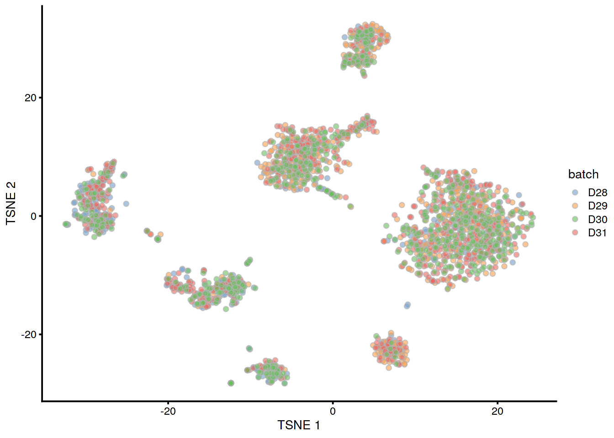

# Human pancreas dataset (Muraro)

<script>
document.addEventListener("click", function (event) {
    if (event.target.classList.contains("aaron-collapse")) {
        event.target.classList.toggle("active");
        var content = event.target.nextElementSibling;
        if (content.style.display === "block") {
          content.style.display = "none";
        } else {
          content.style.display = "block";
        }
    }
})
</script>

<style>
.aaron-collapse {
  background-color: #eee;
  color: #444;
  cursor: pointer;
  padding: 18px;
  width: 100%;
  border: none;
  text-align: left;
  outline: none;
  font-size: 15px;
}

.aaron-content {
  padding: 0 18px;
  display: none;
  overflow: hidden;
  background-color: #f1f1f1;
}
</style>

## Introduction

This performs an analysis of the @muraro2016singlecell CEL-seq dataset,
consisting of human pancreas cells from various donors.

## Analysis code

### Data loading


```r
library(scRNAseq)
sce.muraro <- MuraroPancreasData()
```

### Gene annotation

Converting back to Ensembl identifiers.


```r
library(AnnotationHub)
edb <- AnnotationHub()[["AH73881"]]
gene.symb <- sub("__chr.*$", "", rownames(sce.muraro))
gene.ids <- mapIds(edb, keys=gene.symb, 
    keytype="SYMBOL", column="GENEID")

# Removing duplicated genes or genes without Ensembl IDs.
keep <- !is.na(gene.ids) & !duplicated(gene.ids)
sce.muraro <- sce.muraro[keep,]
rownames(sce.muraro) <- gene.ids[keep]
```

### Quality control

This dataset lacks mitochondrial genes so we will do without.


```r
unfiltered <- sce.muraro
```


```r
library(scater)
stats <- perCellQCMetrics(sce.muraro)
qc <- quickPerCellQC(stats, percent_subsets="altexps_ERCC_percent")
sce.muraro <- sce.muraro[,!qc$discard]
```

### Normalization


```r
library(scran)
set.seed(1000)
clusters <- quickCluster(sce.muraro)
sce.muraro <- computeSumFactors(sce.muraro, clusters=clusters)
sce.muraro <- logNormCounts(sce.muraro)
```

### Variance modelling

We block on a combined plate and donor factor.


```r
block <- paste0(sce.muraro$plate, "_", sce.muraro$donor)
dec.muraro <- modelGeneVarWithSpikes(sce.muraro, "ERCC", block=block)
top.muraro <- getTopHVGs(dec.muraro, prop=0.1)
```

### Data integration


```r
library(batchelor)
set.seed(1001010)
merged.muraro <- fastMNN(sce.muraro, subset.row=top.muraro, 
    batch=sce.muraro$donor)
```

### Dimensionality reduction


```r
set.seed(100111)
merged.muraro <- runTSNE(merged.muraro, dimred="corrected")
```

### Clustering


```r
snn.gr <- buildSNNGraph(merged.muraro, use.dimred="corrected")
merged.muraro$cluster <- factor(igraph::cluster_walktrap(snn.gr)$membership)
```

## Results

### Quality control statistics


```r
colData(unfiltered) <- cbind(colData(unfiltered), stats)
unfiltered$discard <- qc$discard

gridExtra::grid.arrange(
    plotColData(unfiltered, x="donor", y="sum", colour_by="discard") +
        scale_y_log10() + ggtitle("Total count"),
    plotColData(unfiltered, x="donor", y="detected", colour_by="discard") +
        scale_y_log10() + ggtitle("Detected features"),
    plotColData(unfiltered, x="donor", y="altexps_ERCC_percent",
        colour_by="discard") + ggtitle("ERCC percent"),
    ncol=2
)
```


```r
colSums(as.matrix(qc))
```

```
##              low_lib_size            low_n_features high_altexps_ERCC_percent 
##                       611                       669                       696 
##                   discard 
##                       726
```

### Normalization


```r
summary(sizeFactors(sce.muraro))
```

```
##    Min. 1st Qu.  Median    Mean 3rd Qu.    Max. 
##   0.080   0.538   0.822   1.000   1.217  14.315
```


```r
plot(librarySizeFactors(sce.muraro), sizeFactors(sce.muraro), pch=16,
    xlab="Library size factors", ylab="Deconvolution factors", log="xy")
```


### Variance modelling


```r
par(mfrow=c(8,4))
blocked.stats <- dec.muraro$per.block
for (i in colnames(blocked.stats)) {
    current <- blocked.stats[[i]]
    plot(current$mean, current$total, main=i, pch=16, cex=0.5,
        xlab="Mean of log-expression", ylab="Variance of log-expression")
    curfit <- metadata(current)
    points(curfit$mean, curfit$var, col="red", pch=16)
    curve(curfit$trend(x), col='dodgerblue', add=TRUE, lwd=2)
}
```


### Data integration


```r
metadata(merged.muraro)$merge.info$lost.var
```

```
##           D28      D29      D30     D31
## [1,] 0.061236 0.024182 0.000000 0.00000
## [2,] 0.002639 0.003242 0.062255 0.00000
## [3,] 0.003409 0.002588 0.002575 0.08063
```

### Clustering


```r
table(Cluster=merged.muraro$cluster, CellType=sce.muraro$label)
```

```
##        CellType
## Cluster acinar alpha beta delta duct endothelial epsilon mesenchymal  pp unclear
##      1     217     1    3     0    8           0       0           0   2       0
##      2       0     5    5     0  212           0       0           1   0       4
##      3       0     0    0   186    0           0       0           0   0       0
##      4       0    17  385     3    0           0       0           0   0       0
##      5       0   778    2     1    0           0       3           0   0       0
##      6       1     0    2     0    6           1       0          79   0       0
##      7       0     0    1     0   13           0       0           0   0       0
##      8       0     1   42     1    3           0       0           0   0       0
##      9       0     1    6     0    0           0       0           0  97       0
##      10      0     0    0     0    0          19       0           0   0       0
```


```r
table(Cluster=merged.muraro$cluster, Donor=merged.muraro$batch)
```

```
##        Donor
## Cluster D28 D29 D30 D31
##      1  108   6  57 113
##      2   57  21  79  97
##      3   13  75  65  43
##      4   28 148 129 121
##      5   88 263 281 222
##      6   22   7  54  26
##      7    7   6   6   6
##      8    1   6   7  38
##      9   11  70   6  38
##      10   5   2   5   9
```


```r
plotTSNE(merged.muraro, colour_by="cluster")
```



```r
plotTSNE(merged.muraro, colour_by="batch")
```



## Session Info {-}

<button class="aaron-collapse">View session info</button>
<div class="aaron-content">
```
R version 3.6.1 (2019-07-05)
Platform: x86_64-pc-linux-gnu (64-bit)
Running under: Ubuntu 14.04.5 LTS

Matrix products: default
BLAS:   /home/ramezqui/Rbuild/danbuild/R-3.6.1/lib/libRblas.so
LAPACK: /home/ramezqui/Rbuild/danbuild/R-3.6.1/lib/libRlapack.so

locale:
 [1] LC_CTYPE=en_US.UTF-8       LC_NUMERIC=C               LC_TIME=en_US.UTF-8       
 [4] LC_COLLATE=C               LC_MONETARY=en_US.UTF-8    LC_MESSAGES=en_US.UTF-8   
 [7] LC_PAPER=en_US.UTF-8       LC_NAME=C                  LC_ADDRESS=C              
[10] LC_TELEPHONE=C             LC_MEASUREMENT=en_US.UTF-8 LC_IDENTIFICATION=C       

attached base packages:
[1] parallel  stats4    stats     graphics  grDevices utils     datasets  methods   base     

other attached packages:
 [1] batchelor_1.2.2             scran_1.14.3                scater_1.14.3              
 [4] ggplot2_3.2.1               ensembldb_2.10.0            AnnotationFilter_1.10.0    
 [7] GenomicFeatures_1.38.0      AnnotationDbi_1.48.0        AnnotationHub_2.18.0       
[10] BiocFileCache_1.10.2        dbplyr_1.4.2                scRNAseq_2.0.2             
[13] SingleCellExperiment_1.8.0  SummarizedExperiment_1.16.0 DelayedArray_0.12.0        
[16] BiocParallel_1.20.0         matrixStats_0.55.0          Biobase_2.46.0             
[19] GenomicRanges_1.38.0        GenomeInfoDb_1.22.0         IRanges_2.20.0             
[22] S4Vectors_0.24.0            BiocGenerics_0.32.0         Cairo_1.5-10               
[25] BiocStyle_2.14.0            OSCAUtils_0.0.1            

loaded via a namespace (and not attached):
 [1] Rtsne_0.15                    ggbeeswarm_0.6.0              colorspace_1.4-1             
 [4] XVector_0.26.0                BiocNeighbors_1.4.0           bit64_0.9-7                  
 [7] interactiveDisplayBase_1.24.0 codetools_0.2-16              knitr_1.26                   
[10] zeallot_0.1.0                 Rsamtools_2.2.0               shiny_1.4.0                  
[13] BiocManager_1.30.9            compiler_3.6.1                httr_1.4.1                   
[16] dqrng_0.2.1                   backports_1.1.5               assertthat_0.2.1             
[19] Matrix_1.2-17                 fastmap_1.0.1                 lazyeval_0.2.2               
[22] limma_3.42.0                  later_1.0.0                   BiocSingular_1.2.0           
[25] htmltools_0.4.0               prettyunits_1.0.2             tools_3.6.1                  
[28] rsvd_1.0.2                    igraph_1.2.4.1                gtable_0.3.0                 
[31] glue_1.3.1                    GenomeInfoDbData_1.2.2        dplyr_0.8.3                  
[34] rappdirs_0.3.1                Rcpp_1.0.3                    vctrs_0.2.0                  
[37] Biostrings_2.54.0             ExperimentHub_1.12.0          rtracklayer_1.46.0           
[40] DelayedMatrixStats_1.8.0      xfun_0.11                     stringr_1.4.0                
[43] mime_0.7                      irlba_2.3.3                   statmod_1.4.32               
[46] XML_3.98-1.20                 edgeR_3.28.0                  zlibbioc_1.32.0              
[49] scales_1.0.0                  hms_0.5.2                     promises_1.1.0               
[52] ProtGenerics_1.18.0           yaml_2.2.0                    curl_4.2                     
[55] memoise_1.1.0                 gridExtra_2.3                 biomaRt_2.42.0               
[58] stringi_1.4.3                 RSQLite_2.1.2                 BiocVersion_3.10.1           
[61] rlang_0.4.1                   pkgconfig_2.0.3               bitops_1.0-6                 
[64] evaluate_0.14                 lattice_0.20-38               purrr_0.3.3                  
[67] labeling_0.3                  GenomicAlignments_1.22.1      cowplot_1.0.0                
[70] bit_1.1-14                    tidyselect_0.2.5              magrittr_1.5                 
[73] bookdown_0.15                 R6_2.4.1                      DBI_1.0.0                    
[76] pillar_1.4.2                  withr_2.1.2                   RCurl_1.95-4.12              
[79] tibble_2.1.3                  crayon_1.3.4                  rmarkdown_1.17               
[82] viridis_0.5.1                 progress_1.2.2                locfit_1.5-9.1               
[85] grid_3.6.1                    blob_1.2.0                    digest_0.6.22                
[88] xtable_1.8-4                  httpuv_1.5.2                  openssl_1.4.1                
[91] munsell_0.5.0                 beeswarm_0.2.3                viridisLite_0.3.0            
[94] vipor_0.4.5                   askpass_1.1                  
```
</div>
