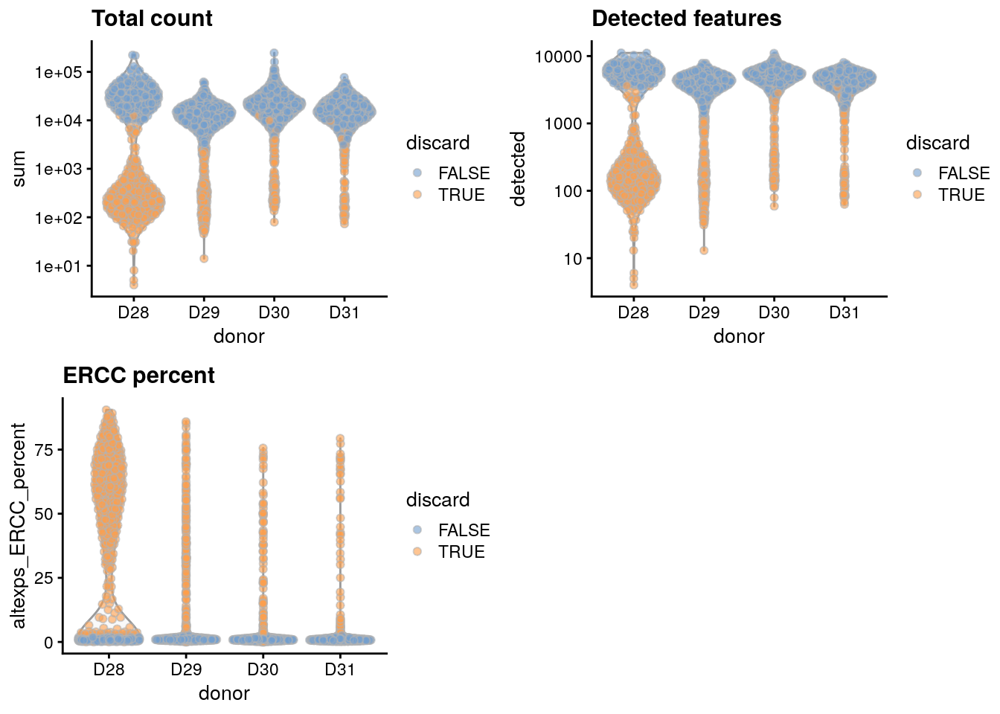
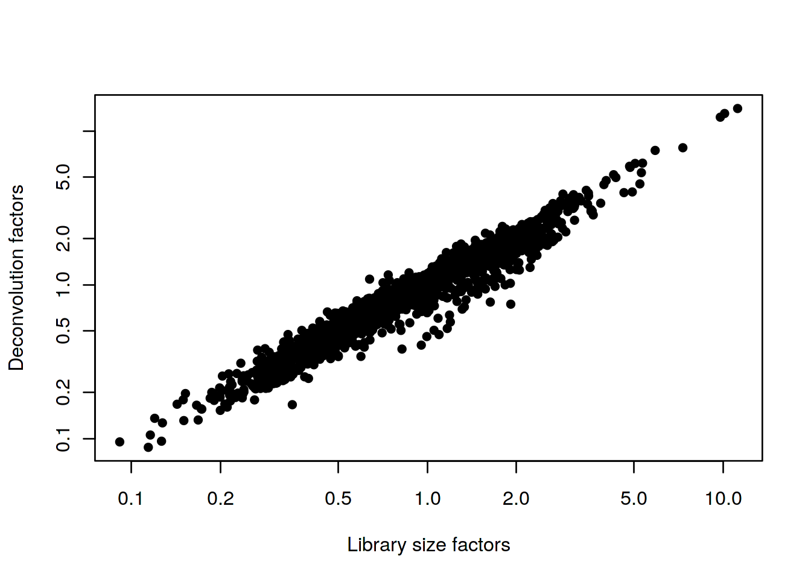
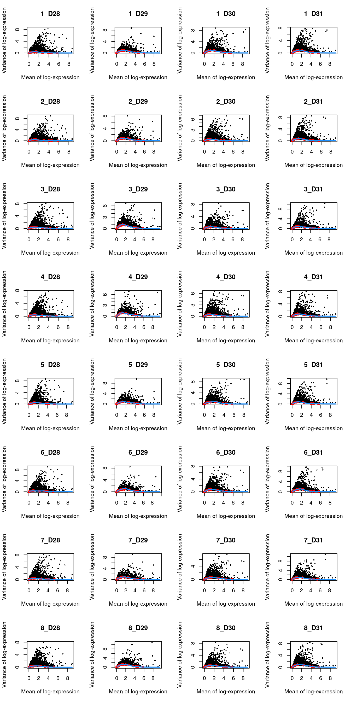
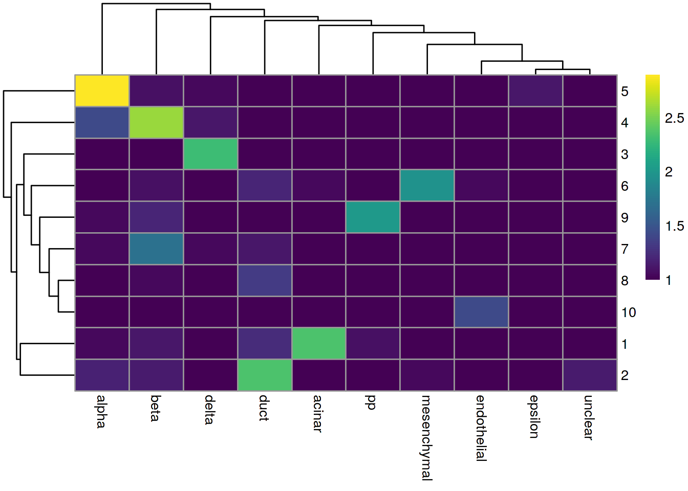
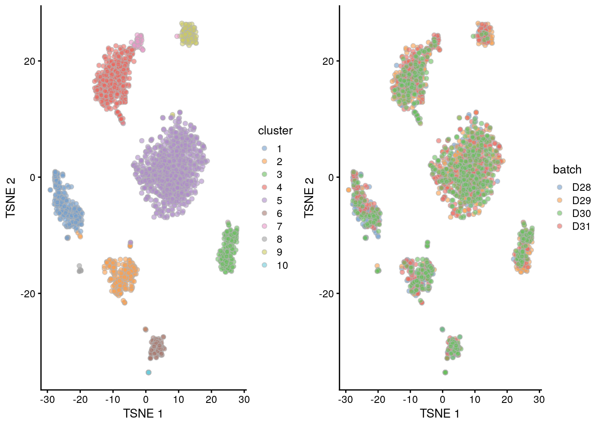

# Muraro human pancreas (CEL-seq)

<script>
document.addEventListener("click", function (event) {
    if (event.target.classList.contains("aaron-collapse")) {
        event.target.classList.toggle("active");
        var content = event.target.nextElementSibling;
        if (content.style.display === "block") {
          content.style.display = "none";
        } else {
          content.style.display = "block";
        }
    }
})
</script>

<style>
.aaron-collapse {
  background-color: #eee;
  color: #444;
  cursor: pointer;
  padding: 18px;
  width: 100%;
  border: none;
  text-align: left;
  outline: none;
  font-size: 15px;
}

.aaron-content {
  padding: 0 18px;
  display: none;
  overflow: hidden;
  background-color: #f1f1f1;
}
</style>

## Introduction

This performs an analysis of the @muraro2016singlecell CEL-seq dataset,
consisting of human pancreas cells from various donors.

## Data loading


```r
library(scRNAseq)
sce.muraro <- MuraroPancreasData()
```

Converting back to Ensembl identifiers.


```r
library(AnnotationHub)
edb <- AnnotationHub()[["AH73881"]]
gene.symb <- sub("__chr.*$", "", rownames(sce.muraro))
gene.ids <- mapIds(edb, keys=gene.symb, 
    keytype="SYMBOL", column="GENEID")

# Removing duplicated genes or genes without Ensembl IDs.
keep <- !is.na(gene.ids) & !duplicated(gene.ids)
sce.muraro <- sce.muraro[keep,]
rownames(sce.muraro) <- gene.ids[keep]
```

## Quality control


```r
unfiltered <- sce.muraro
```

This dataset lacks mitochondrial genes so we will do without.
For the one batch that seems to have a high proportion of low-quality cells, we compute an appropriate filter threshold using a shared median and MAD from the other batches (Figure \@ref(fig:unref-muraro-qc-dist)).


```r
library(scater)
stats <- perCellQCMetrics(sce.muraro)
qc <- quickPerCellQC(stats, percent_subsets="altexps_ERCC_percent",
    batch=sce.muraro$donor, subset=sce.muraro$donor!="D28")
sce.muraro <- sce.muraro[,!qc$discard]
```


```r
colData(unfiltered) <- cbind(colData(unfiltered), stats)
unfiltered$discard <- qc$discard

gridExtra::grid.arrange(
    plotColData(unfiltered, x="donor", y="sum", colour_by="discard") +
        scale_y_log10() + ggtitle("Total count"),
    plotColData(unfiltered, x="donor", y="detected", colour_by="discard") +
        scale_y_log10() + ggtitle("Detected features"),
    plotColData(unfiltered, x="donor", y="altexps_ERCC_percent",
        colour_by="discard") + ggtitle("ERCC percent"),
    ncol=2
)
```

<div class="figure">

<p class="caption">(\#fig:unref-muraro-qc-dist)Distribution of each QC metric across cells from each donor in the Muraro pancreas dataset. Each point represents a cell and is colored according to whether that cell was discarded.</p>
</div>

We have a look at the causes of removal:


```r
colSums(as.matrix(qc))
```

```
##              low_lib_size            low_n_features high_altexps_ERCC_percent 
##                       663                       700                       738 
##                   discard 
##                       773
```

## Normalization


```r
library(scran)
set.seed(1000)
clusters <- quickCluster(sce.muraro)
sce.muraro <- computeSumFactors(sce.muraro, clusters=clusters)
sce.muraro <- logNormCounts(sce.muraro)
```


```r
summary(sizeFactors(sce.muraro))
```

```
##    Min. 1st Qu.  Median    Mean 3rd Qu.    Max. 
##   0.088   0.541   0.821   1.000   1.211  13.987
```


```r
plot(librarySizeFactors(sce.muraro), sizeFactors(sce.muraro), pch=16,
    xlab="Library size factors", ylab="Deconvolution factors", log="xy")
```

<div class="figure">

<p class="caption">(\#fig:unref-muraro-norm)Relationship between the library size factors and the deconvolution size factors in the Muraro pancreas dataset.</p>
</div>

### Variance modelling

We block on a combined plate and donor factor.


```r
block <- paste0(sce.muraro$plate, "_", sce.muraro$donor)
dec.muraro <- modelGeneVarWithSpikes(sce.muraro, "ERCC", block=block)
top.muraro <- getTopHVGs(dec.muraro, prop=0.1)
```


```r
par(mfrow=c(8,4))
blocked.stats <- dec.muraro$per.block
for (i in colnames(blocked.stats)) {
    current <- blocked.stats[[i]]
    plot(current$mean, current$total, main=i, pch=16, cex=0.5,
        xlab="Mean of log-expression", ylab="Variance of log-expression")
    curfit <- metadata(current)
    points(curfit$mean, curfit$var, col="red", pch=16)
    curve(curfit$trend(x), col='dodgerblue', add=TRUE, lwd=2)
}
```

<div class="figure">

<p class="caption">(\#fig:unref-muraro-variance)Per-gene variance as a function of the mean for the log-expression values in the Muraro pancreas dataset. Each point represents a gene (black) with the mean-variance trend (blue) fitted to the spike-in transcripts (red) separately for each donor.</p>
</div>

## Data integration


```r
library(batchelor)
set.seed(1001010)
merged.muraro <- fastMNN(sce.muraro, subset.row=top.muraro, 
    batch=sce.muraro$donor)
```

We use the proportion of variance lost as a diagnostic measure:


```r
metadata(merged.muraro)$merge.info$lost.var
```

```
##           D28      D29      D30     D31
## [1,] 0.060847 0.024121 0.000000 0.00000
## [2,] 0.002646 0.003018 0.062421 0.00000
## [3,] 0.003449 0.002641 0.002598 0.08162
```

## Dimensionality reduction


```r
set.seed(100111)
merged.muraro <- runTSNE(merged.muraro, dimred="corrected")
```

## Clustering


```r
snn.gr <- buildSNNGraph(merged.muraro, use.dimred="corrected")
colLabels(merged.muraro) <- factor(igraph::cluster_walktrap(snn.gr)$membership)
```


```r
tab <- table(Cluster=colLabels(merged.muraro), CellType=sce.muraro$label)
library(pheatmap)
pheatmap(log10(tab+10), color=viridis::viridis(100))
```

<div class="figure">

<p class="caption">(\#fig:unref-seger-heat)Heatmap of the frequency of cells from each cell type label in each cluster.</p>
</div>


```r
table(Cluster=colLabels(merged.muraro), Donor=merged.muraro$batch)
```

```
##        Donor
## Cluster D28 D29 D30 D31
##      1  104   6  57 112
##      2   59  21  77  97
##      3   12  75  64  43
##      4   28 149 126 120
##      5   87 261 277 214
##      6   21   7  54  26
##      7    1   6   6  37
##      8    6   6   5   2
##      9   11  68   5  30
##      10   4   2   5   8
```


```r
gridExtra::grid.arrange(
    plotTSNE(merged.muraro, colour_by="label"),
    plotTSNE(merged.muraro, colour_by="batch"),
    ncol=2
)
```

<div class="figure">

<p class="caption">(\#fig:unref-muraro-tsne)Obligatory $t$-SNE plots of the Muraro pancreas dataset. Each point represents a cell that is colored by cluster (left) or batch (right).</p>
</div>

## Session Info {-}

<button class="aaron-collapse">View session info</button>
<div class="aaron-content">
```
R Under development (unstable) (2020-03-23 r78035)
Platform: x86_64-pc-linux-gnu (64-bit)
Running under: Ubuntu 18.04.4 LTS

Matrix products: default
BLAS:   /home/luna/Software/R/trunk/lib/libRblas.so
LAPACK: /home/luna/Software/R/trunk/lib/libRlapack.so

locale:
 [1] LC_CTYPE=en_US.UTF-8       LC_NUMERIC=C              
 [3] LC_TIME=en_US.UTF-8        LC_COLLATE=en_US.UTF-8    
 [5] LC_MONETARY=en_US.UTF-8    LC_MESSAGES=en_US.UTF-8   
 [7] LC_PAPER=en_US.UTF-8       LC_NAME=C                 
 [9] LC_ADDRESS=C               LC_TELEPHONE=C            
[11] LC_MEASUREMENT=en_US.UTF-8 LC_IDENTIFICATION=C       

attached base packages:
[1] parallel  stats4    stats     graphics  grDevices utils     datasets 
[8] methods   base     

other attached packages:
 [1] pheatmap_1.0.12             batchelor_1.3.14           
 [3] scran_1.15.24               scater_1.15.29             
 [5] ggplot2_3.3.0               ensembldb_2.11.3           
 [7] AnnotationFilter_1.11.0     GenomicFeatures_1.39.7     
 [9] AnnotationDbi_1.49.1        AnnotationHub_2.19.7       
[11] BiocFileCache_1.11.4        dbplyr_1.4.2               
[13] scRNAseq_2.1.7              SingleCellExperiment_1.9.2 
[15] SummarizedExperiment_1.17.4 DelayedArray_0.13.7        
[17] BiocParallel_1.21.2         matrixStats_0.56.0         
[19] Biobase_2.47.3              GenomicRanges_1.39.3       
[21] GenomeInfoDb_1.23.14        IRanges_2.21.8             
[23] S4Vectors_0.25.14           BiocGenerics_0.33.3        
[25] BiocStyle_2.15.6            OSCAUtils_0.0.2            

loaded via a namespace (and not attached):
  [1] Rtsne_0.15                    ggbeeswarm_0.6.0             
  [3] colorspace_1.4-1              XVector_0.27.2               
  [5] BiocNeighbors_1.5.2           farver_2.0.3                 
  [7] bit64_0.9-7                   interactiveDisplayBase_1.25.0
  [9] codetools_0.2-16              knitr_1.28                   
 [11] Rsamtools_2.3.7               shiny_1.4.0.2                
 [13] BiocManager_1.30.10           compiler_4.0.0               
 [15] httr_1.4.1                    dqrng_0.2.1                  
 [17] assertthat_0.2.1              Matrix_1.2-18                
 [19] fastmap_1.0.1                 lazyeval_0.2.2               
 [21] limma_3.43.5                  later_1.0.0                  
 [23] BiocSingular_1.3.2            htmltools_0.4.0              
 [25] prettyunits_1.1.1             tools_4.0.0                  
 [27] igraph_1.2.5                  rsvd_1.0.3                   
 [29] gtable_0.3.0                  glue_1.3.2                   
 [31] GenomeInfoDbData_1.2.2        dplyr_0.8.5                  
 [33] rappdirs_0.3.1                Rcpp_1.0.4                   
 [35] vctrs_0.2.4                   Biostrings_2.55.7            
 [37] ExperimentHub_1.13.5          rtracklayer_1.47.0           
 [39] DelayedMatrixStats_1.9.0      xfun_0.12                    
 [41] stringr_1.4.0                 ps_1.3.2                     
 [43] mime_0.9                      lifecycle_0.2.0              
 [45] irlba_2.3.3                   statmod_1.4.34               
 [47] XML_3.99-0.3                  edgeR_3.29.1                 
 [49] zlibbioc_1.33.1               scales_1.1.0                 
 [51] hms_0.5.3                     promises_1.1.0               
 [53] ProtGenerics_1.19.3           RColorBrewer_1.1-2           
 [55] yaml_2.2.1                    curl_4.3                     
 [57] memoise_1.1.0                 gridExtra_2.3                
 [59] biomaRt_2.43.3                stringi_1.4.6                
 [61] RSQLite_2.2.0                 BiocVersion_3.11.1           
 [63] highr_0.8                     rlang_0.4.5                  
 [65] pkgconfig_2.0.3               bitops_1.0-6                 
 [67] evaluate_0.14                 lattice_0.20-40              
 [69] purrr_0.3.3                   GenomicAlignments_1.23.2     
 [71] labeling_0.3                  cowplot_1.0.0                
 [73] bit_1.1-15.2                  processx_3.4.2               
 [75] tidyselect_1.0.0              magrittr_1.5                 
 [77] bookdown_0.18                 R6_2.4.1                     
 [79] DBI_1.1.0                     pillar_1.4.3                 
 [81] withr_2.1.2                   RCurl_1.98-1.1               
 [83] tibble_2.1.3                  crayon_1.3.4                 
 [85] rmarkdown_2.1                 viridis_0.5.1                
 [87] progress_1.2.2                locfit_1.5-9.4               
 [89] grid_4.0.0                    blob_1.2.1                   
 [91] callr_3.4.2                   digest_0.6.25                
 [93] xtable_1.8-4                  httpuv_1.5.2                 
 [95] openssl_1.4.1                 munsell_0.5.0                
 [97] beeswarm_0.2.3                viridisLite_0.3.0            
 [99] vipor_0.4.5                   askpass_1.1                  
```
</div>
