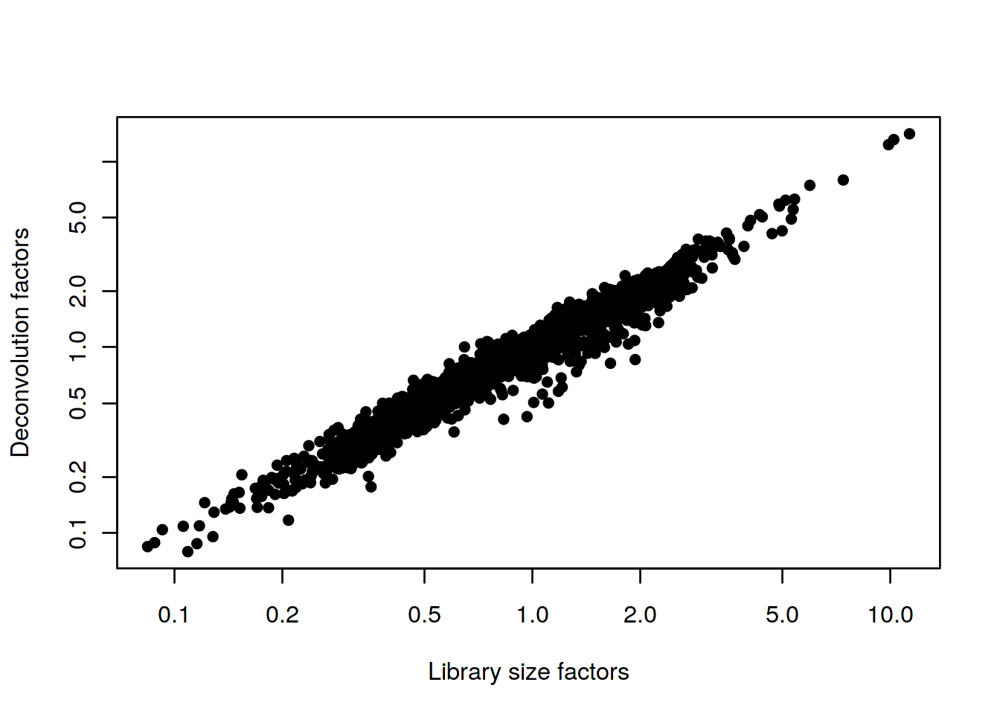
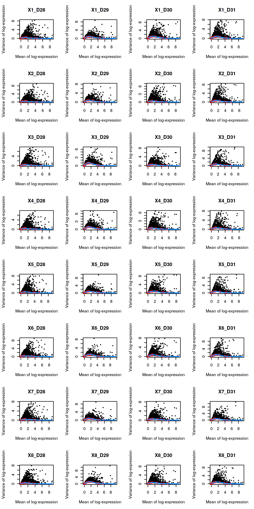
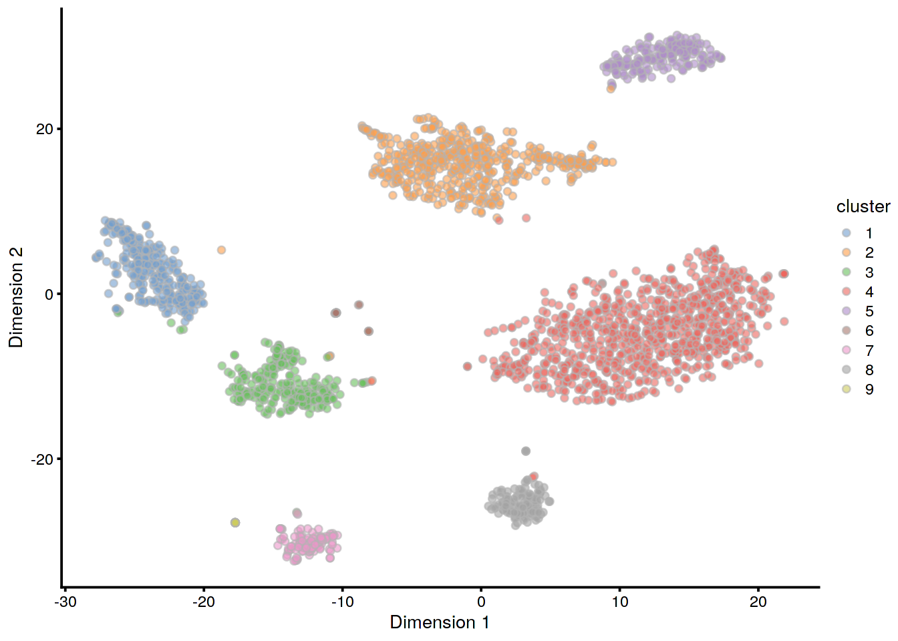
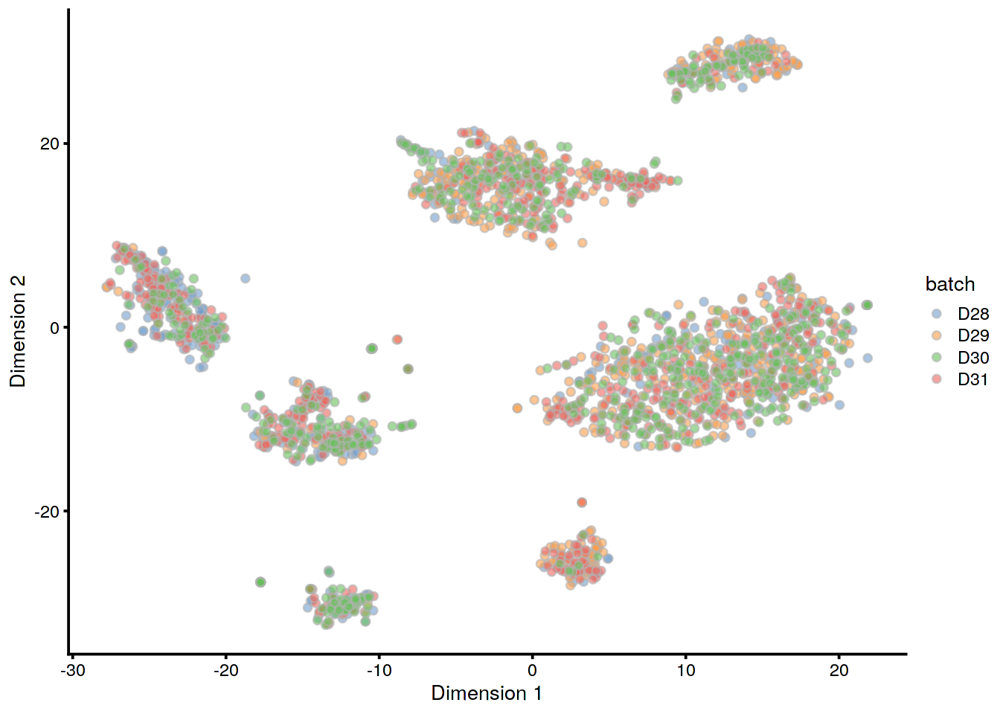

# Human pancreas dataset (Muraro)

<script>
document.addEventListener("click", function (event) {
    if (event.target.classList.contains("aaron-collapse")) {
        event.target.classList.toggle("active");
        var content = event.target.nextElementSibling;
        if (content.style.display === "block") {
          content.style.display = "none";
        } else {
          content.style.display = "block";
        }
    }
})
</script>

<style>
.aaron-collapse {
  background-color: #eee;
  color: #444;
  cursor: pointer;
  padding: 18px;
  width: 100%;
  border: none;
  text-align: left;
  outline: none;
  font-size: 15px;
}

.aaron-content {
  padding: 0 18px;
  display: none;
  overflow: hidden;
  background-color: #f1f1f1;
}
</style>

## Introduction

This performs an analysis of the @muraro2016singlecell CEL-seq dataset,
consisting of human pancreas cells from various donors.

## Analysis code

### Data loading


```r
library(scRNAseq)
sce.muraro <- MuraroPancreasData()
```

### Gene annotation

Converting back to Ensembl identifiers.


```r
library(AnnotationHub)
edb <- AnnotationHub()[["AH73881"]]
gene.symb <- sub("__chr.*$", "", rownames(sce.muraro))
gene.ids <- mapIds(edb, keys=gene.symb, 
    keytype="SYMBOL", column="GENEID")

# Removing duplicated genes or genes without Ensembl IDs.
keep <- !is.na(gene.ids) & !duplicated(gene.ids)
sce.muraro <- sce.muraro[keep,]
rownames(sce.muraro) <- gene.ids[keep]
```

### Quality control

This dataset lacks mitochondrial genes so we will do without.


```r
unfiltered <- sce.muraro
```


```r
library(scater)
stats <- perCellQCMetrics(sce.muraro)
qc <- quickPerCellQC(stats, nmads=3, percent_subsets="altexps_ERCC_percent")
sce.muraro <- sce.muraro[,!qc$discard]
```

### Normalization


```r
library(scran)
set.seed(1000)
clusters <- quickCluster(sce.muraro)
sce.muraro <- computeSumFactors(sce.muraro, min.mean=0.1, clusters=clusters)
sce.muraro <- logNormCounts(sce.muraro)
```

### Variance modelling

We block on a combined plate and donor factor.


```r
block <- paste0(sce.muraro$plate, "_", sce.muraro$donor)
dec.muraro <- modelGeneVarWithSpikes(sce.muraro, "ERCC", block=block)
```

### Data integration


```r
library(batchelor)
set.seed(1001010)
merged.muraro <- fastMNN(sce.muraro, batch=sce.muraro$donor)
```

### Dimensionality reduction


```r
set.seed(100111)
merged.muraro <- runTSNE(merged.muraro, dimred="corrected")
```

### Clustering


```r
snn.gr <- buildSNNGraph(merged.muraro, use.dimred="corrected")
merged.muraro$cluster <- factor(igraph::cluster_walktrap(snn.gr)$membership)
```

## Results

### Quality control statistics


```r
colData(unfiltered) <- cbind(colData(unfiltered), stats)
unfiltered$discard <- qc$discard

gridExtra::grid.arrange(
    plotColData(unfiltered, x="donor", y="sum", colour_by="discard") +
        scale_y_log10() + ggtitle("Total count"),
    plotColData(unfiltered, x="donor", y="detected", colour_by="discard") +
        scale_y_log10() + ggtitle("Detected features"),
    plotColData(unfiltered, x="donor", y="altexps_ERCC_percent",
        colour_by="discard") + ggtitle("ERCC percent"),
    ncol=2
)
```


```r
colSums(as.matrix(qc))
```

```
##              low_lib_size            low_n_features 
##                       611                       669 
## high_altexps_ERCC_percent                   discard 
##                       696                       726
```

### Normalization


```r
summary(sizeFactors(sce.muraro))
```

```
##    Min. 1st Qu.  Median    Mean 3rd Qu.    Max. 
##   0.079   0.537   0.825   1.000   1.220  14.129
```


```r
plot(librarySizeFactors(sce.muraro), sizeFactors(sce.muraro), pch=16,
    xlab="Library size factors", ylab="Deconvolution factors", log="xy")
```



### Variance modelling


```r
par(mfrow=c(8,4))
blocked.stats <- dec.muraro$per.block
for (i in colnames(blocked.stats)) {
    current <- blocked.stats[[i]]
    plot(current$mean, current$total, main=i, pch=16, cex=0.5,
        xlab="Mean of log-expression", ylab="Variance of log-expression")
    curfit <- metadata(current)
    points(curfit$mean, curfit$var, col="red", pch=16)
    curve(curfit$trend(x), col='dodgerblue', add=TRUE, lwd=2)
}
```



### Data integration


```r
metadata(merged.muraro)$merge.info$lost.var
```

```
##           D28      D29      D30     D31
## [1,] 0.027941 0.022248 0.000000 0.00000
## [2,] 0.001761 0.002707 0.037986 0.00000
## [3,] 0.002033 0.002363 0.002005 0.04956
```

### Clustering


```r
table(Cluster=merged.muraro$cluster, Donor=merged.muraro$batch)
```

```
##        Donor
## Cluster D28 D29 D30 D31
##       1 103   6  57 113
##       2  30 155 139 163
##       3  61  20  79  95
##       4  88 265 280 220
##       5  13  74  63  43
##       6   7   6   6   5
##       7  22   7  54  26
##       8  11  69   6  39
##       9   5   2   5   9
```


```r
plotTSNE(merged.muraro, colour_by="cluster")
```



```r
plotTSNE(merged.muraro, colour_by="batch")
```




## Session Info {-}

<button class="aaron-collapse">View session info</button>
<div class="aaron-content">
```
R version 3.6.1 (2019-07-05)
Platform: x86_64-pc-linux-gnu (64-bit)
Running under: Ubuntu 14.04.5 LTS

Matrix products: default
BLAS:   /home/ramezqui/Rbuild/danbuild/R-3.6.1/lib/libRblas.so
LAPACK: /home/ramezqui/Rbuild/danbuild/R-3.6.1/lib/libRlapack.so

locale:
 [1] LC_CTYPE=en_US.UTF-8       LC_NUMERIC=C              
 [3] LC_TIME=en_US.UTF-8        LC_COLLATE=en_US.UTF-8    
 [5] LC_MONETARY=en_US.UTF-8    LC_MESSAGES=en_US.UTF-8   
 [7] LC_PAPER=en_US.UTF-8       LC_NAME=C                 
 [9] LC_ADDRESS=C               LC_TELEPHONE=C            
[11] LC_MEASUREMENT=en_US.UTF-8 LC_IDENTIFICATION=C       

attached base packages:
[1] parallel  stats4    stats     graphics  grDevices utils     datasets 
[8] methods   base     

other attached packages:
 [1] batchelor_1.1.17            scran_1.13.26              
 [3] scater_1.13.25              ggplot2_3.2.1              
 [5] ensembldb_2.9.6             AnnotationFilter_1.9.0     
 [7] GenomicFeatures_1.37.4      AnnotationDbi_1.47.1       
 [9] AnnotationHub_2.17.10       BiocFileCache_1.9.1        
[11] dbplyr_1.4.2                scRNAseq_1.99.6            
[13] SingleCellExperiment_1.7.11 SummarizedExperiment_1.15.9
[15] DelayedArray_0.11.8         BiocParallel_1.19.3        
[17] matrixStats_0.55.0          Biobase_2.45.1             
[19] GenomicRanges_1.37.16       GenomeInfoDb_1.21.2        
[21] IRanges_2.19.16             S4Vectors_0.23.25          
[23] BiocGenerics_0.31.6         Cairo_1.5-10               
[25] BiocStyle_2.13.2            OSCAUtils_0.0.1            

loaded via a namespace (and not attached):
 [1] Rtsne_0.15                    ggbeeswarm_0.6.0             
 [3] colorspace_1.4-1              XVector_0.25.0               
 [5] BiocNeighbors_1.3.5           bit64_0.9-7                  
 [7] interactiveDisplayBase_1.23.0 codetools_0.2-16             
 [9] knitr_1.25                    zeallot_0.1.0                
[11] Rsamtools_2.1.5               shiny_1.4.0                  
[13] BiocManager_1.30.7            compiler_3.6.1               
[15] httr_1.4.1                    dqrng_0.2.1                  
[17] backports_1.1.5               assertthat_0.2.1             
[19] Matrix_1.2-17                 fastmap_1.0.1                
[21] lazyeval_0.2.2                limma_3.41.17                
[23] later_1.0.0                   BiocSingular_1.1.7           
[25] htmltools_0.4.0               prettyunits_1.0.2            
[27] tools_3.6.1                   rsvd_1.0.2                   
[29] igraph_1.2.4.1                gtable_0.3.0                 
[31] glue_1.3.1                    GenomeInfoDbData_1.2.1       
[33] dplyr_0.8.3                   rappdirs_0.3.1               
[35] Rcpp_1.0.2                    vctrs_0.2.0                  
[37] Biostrings_2.53.2             ExperimentHub_1.11.6         
[39] rtracklayer_1.45.6            DelayedMatrixStats_1.7.2     
[41] xfun_0.10                     stringr_1.4.0                
[43] mime_0.7                      irlba_2.3.3                  
[45] statmod_1.4.32                XML_3.98-1.20                
[47] edgeR_3.27.13                 zlibbioc_1.31.0              
[49] scales_1.0.0                  hms_0.5.1                    
[51] promises_1.1.0                ProtGenerics_1.17.4          
[53] yaml_2.2.0                    curl_4.2                     
[55] memoise_1.1.0                 gridExtra_2.3                
[57] biomaRt_2.41.9                stringi_1.4.3                
[59] RSQLite_2.1.2                 rlang_0.4.0                  
[61] pkgconfig_2.0.3               bitops_1.0-6                 
[63] evaluate_0.14                 lattice_0.20-38              
[65] purrr_0.3.2                   labeling_0.3                 
[67] GenomicAlignments_1.21.7      cowplot_1.0.0                
[69] bit_1.1-14                    tidyselect_0.2.5             
[71] magrittr_1.5                  bookdown_0.14                
[73] R6_2.4.0                      DBI_1.0.0                    
[75] pillar_1.4.2                  withr_2.1.2                  
[77] RCurl_1.95-4.12               tibble_2.1.3                 
[79] crayon_1.3.4                  rmarkdown_1.16               
[81] viridis_0.5.1                 progress_1.2.2               
[83] locfit_1.5-9.1                grid_3.6.1                   
[85] blob_1.2.0                    digest_0.6.21                
[87] xtable_1.8-4                  httpuv_1.5.2                 
[89] openssl_1.4.1                 munsell_0.5.0                
[91] beeswarm_0.2.3                viridisLite_0.3.0            
[93] vipor_0.4.5                   askpass_1.1                  
```
</div>
