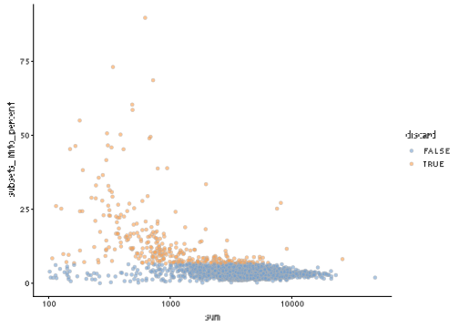
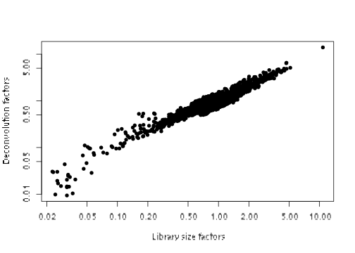
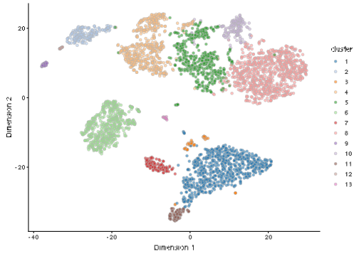

# PBMC 10X dataset (unfiltered)


## Introduction

This performs an analysis of the public PBMC dataset generated by 10X Genomics [@zheng2017massively],
starting from the unfiltered count matrix.

## Analysis code

### Data loading


```r
library(BiocFileCache)
bfc <- BiocFileCache("raw_data", ask = FALSE)
raw.path <- bfcrpath(bfc, file.path("http://cf.10xgenomics.com/samples",
    "cell-exp/2.1.0/pbmc4k/pbmc4k_raw_gene_bc_matrices.tar.gz"))
untar(raw.path, exdir=file.path(tempdir(), "pbmc4k"))

library(DropletUtils)
fname <- file.path(tempdir(), "pbmc4k/raw_gene_bc_matrices/GRCh38")
sce.pbmc <- read10xCounts(fname, col.names=TRUE)
```

### Gene annotation


```r
library(scater)
rownames(sce.pbmc) <- uniquifyFeatureNames(
    rowData(sce.pbmc)$ID, rowData(sce.pbmc)$Symbol)

library(EnsDb.Hsapiens.v86)
location <- mapIds(EnsDb.Hsapiens.v86, keys=rowData(sce.pbmc)$ID, 
    column="SEQNAME", keytype="GENEID")
```

### Cell detection


```r
set.seed(100)
e.out <- emptyDrops(counts(sce.pbmc))
sce.pbmc <- sce.pbmc[,which(e.out$FDR <= 0.001)]
```

### Quality control


```r
unfiltered <- sce.pbmc
```


```r
stats <- perCellQCMetrics(sce.pbmc, subsets=list(Mito=which(location=="MT")))
high.mito <- isOutlier(stats$subsets_Mito_percent, nmads=3, type="higher")
sce.pbmc <- sce.pbmc[,!high.mito]
```

### Normalization


```r
library(scran)
set.seed(1000)
clusters <- quickCluster(sce.pbmc)
sce.pbmc <- computeSumFactors(sce.pbmc, min.mean=0.1, cluster=clusters)
sce.pbmc <- logNormCounts(sce.pbmc)
```

### Variance modelling


```r
set.seed(1001)
dec.pbmc <- modelGeneVarByPoisson(sce.pbmc)
```

### Dimensionality reduction


```r
set.seed(10000)
sce.pbmc <- denoisePCA(sce.pbmc, technical=dec.pbmc,
    BSPARAM=BiocSingular::IrlbaParam())

set.seed(100000)
sce.pbmc <- runTSNE(sce.pbmc, use_dimred="PCA")

set.seed(1000000)
sce.pbmc <- runUMAP(sce.pbmc, use_dimred="PCA")
```

### Clustering


```r
g <- buildSNNGraph(sce.pbmc, k=10, use.dimred = 'PCA')
clust <- igraph::cluster_walktrap(g)$membership
sce.pbmc$cluster <- factor(clust)
```

## Results

### Quality control statistics


```r
colData(unfiltered) <- cbind(colData(unfiltered), stats)
unfiltered$discard <- high.mito

gridExtra::grid.arrange(
    plotColData(unfiltered, y="sum", colour_by="discard") +
        scale_y_log10() + ggtitle("Total count"),
    plotColData(unfiltered, y="detected", colour_by="discard") +
        scale_y_log10() + ggtitle("Detected features"),
    plotColData(unfiltered, y="subsets_Mito_percent",
        colour_by="discard") + ggtitle("Mito percent"),
    ncol=2
)
```


```r
plotColData(unfiltered, x="sum", y="subsets_Mito_percent",
    colour_by="discard") + scale_x_log10()
```




```r
summary(high.mito)
```

```
##    Mode   FALSE    TRUE 
## logical    3922     311
```

### Normalization


```r
summary(sizeFactors(sce.pbmc))
```

```
##    Min. 1st Qu.  Median    Mean 3rd Qu.    Max. 
##    0.01    0.71    0.87    1.00    1.09   13.96
```


```r
plot(librarySizeFactors(sce.pbmc), sizeFactors(sce.pbmc), pch=16,
    xlab="Library size factors", ylab="Deconvolution factors", log="xy")
```



### Variance modelling


```r
plot(dec.pbmc$mean, dec.pbmc$total, pch=16, cex=0.5,
    xlab="Mean of log-expression", ylab="Variance of log-expression")
curfit <- metadata(dec.pbmc)
curve(curfit$trend(x), col='dodgerblue', add=TRUE, lwd=2)
```


### Dimensionality reduction


```r
ncol(reducedDim(sce.pbmc, "PCA"))
```

```
## [1] 14
```

### Clustering


```r
table(sce.pbmc$cluster)
```

```
## 
##   1   2   3   4   5   6   7   8   9  10  11  12  13 
## 785 198  56 541 529 516 128 824  45 151  92  21  36
```


```r
plotTSNE(sce.pbmc, colour_by="cluster")
```



## References {-}
